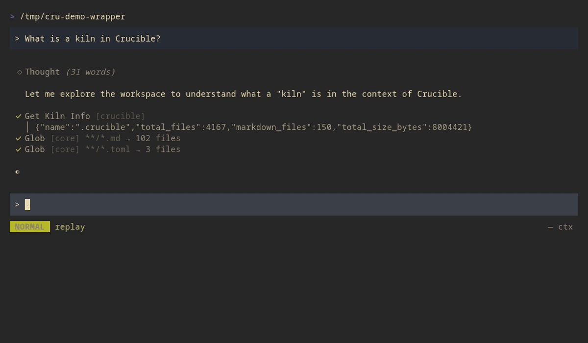

# ⚗️ Crucible

[](https://github.com/Mootikins/crucible/actions/workflows/ci.yml)
[](LICENSE-MIT)
[](https://mootikins.github.io/crucible/)

**A local-first AI agent that turns every conversation into a searchable, linkable note you own.**

No cloud. No lock-in. Your AI chats live as markdown files in git, wired into a knowledge graph you control.

<p align="center">
  
</p>

> **Early Development**: APIs and storage formats may change. Contributions welcome!

## What Makes Crucible Different

Most AI chat tools treat conversations as disposable. Crucible treats them as knowledge.

- **Sessions are markdown.** Every chat saves to a `.md` file in your workspace. Search them, link them, version them in git.
- **Your notes become agent memory.** Precognition auto-injects relevant vault context before each LLM turn. Wikilinks define relationships. Block-level embeddings power semantic search at paragraph granularity.
- **Bring any LLM.** Ollama, OpenAI, Anthropic, local GGUF models. Swap freely.
- **Extend with Lua & Fennel.** Write tools, handlers, and automations as plugins. Drop a `.lua` or `.fnl` file in your plugins folder and it just works.
- **Plaintext first.** No proprietary formats. Files are the source of truth. The database is optional acceleration.

## How It Compares

| | Crucible | ChatGPT | Obsidian + AI | OpenClaw |
|---|---|---|---|---|
| Local-first | ✅ | ❌ | ✅ | ✅ |
| Sessions as markdown | ✅ | ❌ | ❌ | ❌ |
| Knowledge graph | ✅ | ❌ | ✅ | ❌ |
| Bring your own LLM | ✅ | ❌ | Partial | ✅ |
| Plugin system | ✅ Lua/Fennel | ❌ | ✅ JS | ✅ TS |
| MCP server | ✅ | ❌ | ❌ | ❌ |
| Semantic search | ✅ Block-level | ❌ | Plugin | ❌ |
| Setup time | ~2 min | 0 | ~5 min | 2-7 hrs |

## Install

**Pre-built binaries** (Linux x86_64/aarch64, macOS Apple Silicon):

```bash
curl -fsSL https://github.com/Mootikins/crucible/releases/latest/download/install.sh | sh
```

**From source:**

```bash
cargo install --git https://github.com/Mootikins/crucible.git crucible-cli
```

## Quick Start

```bash
# Start a chat session
cru chat

# Chat with Claude Code, enriched by your knowledge base
cru chat -a claude

# Or start the MCP server for Claude/GPT integration
cru mcp
```

First run prompts for a kiln path and detects available LLM providers. A background daemon (`cru-server`) auto-spawns to manage session state, file watching, and multi-session support. It communicates over a Unix socket and restarts automatically if stopped.

**In a chat session:**
- Type naturally, the agent responds with access to your knowledge base
- `/search query` injects relevant notes into context
- `:model`, `:set`, `:export` for REPL commands
- `BackTab` cycles modes: Normal → Plan → Auto

<p align="center">
  
</p>

## Features

### Agent Chat

Interactive conversations with full session persistence. The TUI supports streaming markdown, tool calls, and multi-turn context. Sessions save as markdown files organized by workspace.

### Knowledge Graph

Wikilinks (`[[Note Name]]`) define your graph. No extraction step, no special syntax beyond what you'd write naturally. Query by graph traversal, semantic similarity, tags, or full-text search.

### MCP Server

Expose your knowledge base to any MCP-compatible AI (Claude Desktop, Claude Code, GPT, local models):

```bash
cru mcp
```

Tools include `semantic_search`, `create_note`, `get_outlinks`, `get_inlinks`, and more.

### Agent Integration (ACP)

Crucible can spawn and orchestrate external AI agents through the [Agent Context Protocol](https://agentcontextprotocol.org/). Your agent gets full access to Crucible's knowledge graph, semantic search, and tools.

```bash
# Use Claude Code with your knowledge base
cru chat -a claude

# Use OpenCode
cru chat -a opencode

# Use Gemini CLI
cru chat -a gemini
```

Built-in agents (auto-discovered if installed):

| Agent | Command | Install |
|-------|---------|---------|
| opencode | `opencode` | `go install github.com/grafana/opencode@latest` |
| claude | `npx @zed-industries/claude-agent-acp` | `npm install -g @zed-industries/claude-agent-acp` |
| gemini | `gemini` | `npm install -g gemini-cli` |
| codex | `npx @zed-industries/codex-acp` | `npm install -g @zed-industries/codex-acp` |
| cursor | `cursor-acp` | `npm install -g cursor-acp` |

Agents can delegate tasks to each other. An ACP agent like Claude can hand off work to Cursor or OpenCode mid-conversation using the `delegate_session` tool, then incorporate the results. Delegation works both directions: internal agents can delegate to ACP agents, and ACP agents can delegate to other ACP agents.

Custom profiles go in `crucible.toml`:

```toml
[acp.agents.my-claude]
extends = "claude"
env = { ANTHROPIC_BASE_URL = "http://localhost:4000" }
```

Then: `cru chat -a my-claude`

### Lua Plugins

Drop `.lua` or `.fnl` files into `~/.config/crucible/plugins/` or your kiln's `plugins/` directory:

```lua
-- @tool name="summarize" description="Summarize notes matching query"
-- @param query string "Search query"
function summarize(args)
    local results = crucible.search(args.query)
    return { summary = "Found " .. #results .. " notes" }
end
```

See the [plugin guide](./docs/Help/Concepts/Scripting%20Languages.md) for the full API.

## Documentation

- **[Documentation Site](https://mootikins.github.io/crucible/)** — searchable, organized reference
- **[docs/](./docs/)** is both the user guide and a working example kiln (155 interlinked notes)
- **[AGENTS.md](./AGENTS.md)** covers architecture and AI agent instructions

## Command Reference

| Command | Alias | Description |
|---------|-------|-------------|
| `cru chat` | `c` | Interactive AI chat with session persistence |
| `cru chat -a <agent>` | | Use an ACP agent (claude, opencode, gemini, etc.) |
| `cru chat --resume <id>` | | Resume a previous session |
| `cru mcp` | | Start MCP server for external AI agents |
| `cru process` | `p` | Parse, enrich, and store markdown files |
| `cru init` | `i` | Initialize a new kiln (workspace) |
| `cru session create` | | Create a new session (add `--agent <profile>` for ACP) |
| `cru session list` | `s` | List sessions (live by default, `--all` includes persisted) |
| `cru session show <id>` | | Show session details (daemon first, file fallback) |
| `cru session resume <id>` | | Resume a previous session in the TUI |
| `cru session pause <id>` | | Pause a running daemon session |
| `cru session unpause <id>` | | Unpause a paused daemon session |
| `cru session export <id>` | | Export session to markdown |
| `cru session search <q>` | | Search sessions by title |
| `cru stats` | | Display kiln statistics |
| `cru status` | | Storage status and metrics |
| `cru models` | | List available LLM models |
| `cru config init` | `cfg` | Initialize config file |
| `cru config show` | | Show effective configuration |
| `cru agents list` | | List registered agent cards |
| `cru skills list` | | List discovered agent skills |
| `cru tasks list` | | Manage tasks from TASKS.md |
| `cru daemon start` | | Start background daemon |
| `cru daemon status` | | Check daemon status |
| `cru storage verify` | | Verify content integrity |
| `cru auth login` | | Store LLM provider API key |

Run `cru <command> --help` for full options.

## Roadmap

- [x] TUI chat with session persistence and resume
- [x] MCP server for external agents
- [x] Lua/Fennel plugin system (17+ API modules)
- [x] Block-level semantic search with reranking
- [x] Precognition (auto-RAG before each turn)
- [x] Daemon with auto-spawn, file watching, multi-session support
- [ ] Web chat interface
- [x] ACP host mode (use Claude Code, Cursor, OpenCode through Crucible)
- [ ] ACP agent mode (embed Crucible in editors like Zed, JetBrains, Neovim)

## License

MIT or Apache-2.0, at your option.
