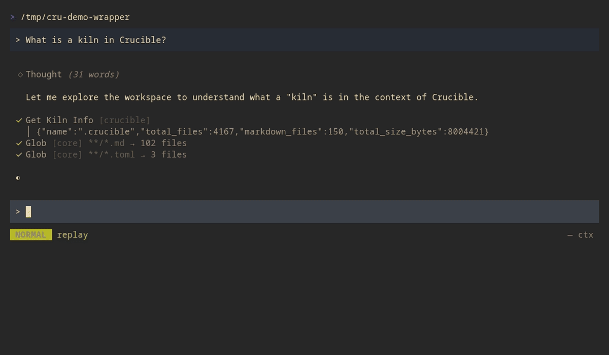

# Crucible

[](https://github.com/Mootikins/crucible/actions/workflows/ci.yml)
[](LICENSE-MIT)
[](https://mootikins.github.io/crucible/)

**A knowledge-grounded agent runtime. Agents that draw from a knowledge graph make better decisions.**

Local-first. No cloud. No lock-in. Your conversations, notes, and wikilinks form a knowledge graph that agents draw from and contribute to — all as markdown files you own.

<p align="center">
  
</p>

> **Early Development**: APIs and storage formats may change. Contributions welcome!

## What Makes Crucible Different

Memory and knowledge are too fundamental to be an afterthought. Most AI tools treat conversations as disposable — Crucible makes them the foundation.

- **Knowledge-grounded agents.** Precognition auto-injects relevant context from your knowledge graph before each LLM turn. Block-level embeddings power semantic search at paragraph granularity. The more you use it, the smarter your agents get.
- **Sessions are searchable knowledge.** Every chat saves as markdown under the daemon data root, searchable with `cru session search` and scoped by the kilns a session shares with yours. What a session *learns* goes into your kiln as notes; the transcript itself stays out of it, so a kiln stays shareable.
- **Neovim-like architecture.** Lua/Fennel plugins, TUI-first, headless daemon with RPC. Most behaviors beyond the knowledge core can be scripted.
- **Bring any LLM.** Ollama, OpenAI, Anthropic, Cohere, OpenRouter, GitHub Copilot, Vertex AI, or a custom HTTP endpoint. Embeddings run locally by default.
- **Plaintext first.** No proprietary formats. Files are the source of truth. The database is optional acceleration.

## How It Compares

The difference is architectural, not a feature checklist.

| | Crucible | Hosted chat assistant | Markdown editor + AI plugin |
|---|---|---|---|
| Source of truth | Markdown on your disk | The vendor's servers | Markdown on your disk |
| Chat history | A note in the same graph — linkable, greppable, versionable | In your vendor account | Outside the note graph |
| Index | SQLite, rebuildable from the files | Not exposed | Varies by plugin |
| Retrieval granularity | Blocks (paragraph-level embeddings) | Not exposed | Varies by plugin |
| LLM choice | Any provider, or a local model | The vendor's | Varies by plugin |
| Extension surface | Lua/Fennel against a headless daemon | None | The editor's plugin API |

## Install

**Pre-built binaries** (Linux x86_64, macOS Apple Silicon):

```bash
curl -fsSL https://github.com/Mootikins/crucible/releases/latest/download/crucible-cli-installer.sh | sh
```

**From source** (needs a Rust toolchain and `protoc`; `apt install protobuf-compiler` or `brew install protobuf`):

```bash
cargo install --git https://github.com/Mootikins/crucible.git --locked crucible-cli
```

`--locked` is required, not optional: without it Cargo re-resolves and picks a
`jaq-std` that does not compile against the pinned `jaq-json`.

The CLI, TUI and daemon need no JavaScript toolchain. `cru web` does: the UI is
compiled into the binary from `crates/crucible-web/web/dist`, which is a
[bun](https://bun.sh) build artifact and is not in the repository. A `cargo
install` therefore gives you everything except the web UI, and `cru web` serves a
page saying so. To get it, clone and run `just install` (or `just web-build`
before `cargo build`) — or use a pre-built binary above, which ships it.

## Quick Start

```bash
# Start a chat session
cru chat

# Chat with Claude Code, enriched by your knowledge base
cru chat -a claude

# Or start the MCP server for Claude/GPT integration
cru mcp
```

First run prompts for a kiln path and detects available LLM providers. A background daemon auto-spawns via `cru daemon serve` to manage session state, file watching, and multi-session support. It communicates over a Unix socket and restarts automatically if stopped.

**In a chat session:**
- Type naturally, the agent responds with access to your knowledge base
- Precognition pulls relevant notes into context before each turn; `:set precognition` toggles it
- `:model`, `:set`, `:export` for REPL commands — `:help` lists them all
- `BackTab` cycles modes: Normal → Plan → Auto (`/plan` and `/auto` jump straight there)
- `F1` opens the command palette

<p align="center">
  
</p>

## Features

### Agent Chat

Interactive conversations with full session persistence. The TUI supports streaming markdown, tool calls, and multi-turn context. Sessions save under the daemon data root (`~/.crucible/sessions/`) and carry a flat set of attached kilns as their knowledge scope.

### Knowledge Graph

Wikilinks (`[[Note Name]]`) define your graph. No extraction step, no special syntax beyond what you'd write naturally. Query by graph traversal, semantic similarity, tags, or full-text search.

### MCP Server

Expose your knowledge base to any MCP-compatible AI (Claude Desktop, Claude Code, GPT, local models):

```bash
cru mcp
```

Notes: `create_note`, `read_note`, `update_note`, `delete_note`, `list_notes`, `read_metadata`.
Search: `semantic_search`, `grep_notes`, `property_search`. Plus `get_kiln_info`,
`delegate_session`, and job control.

### Agent Integration (ACP)

Crucible can spawn and orchestrate external AI agents through the [Agent Client Protocol](https://agentclientprotocol.com). Your agent gets full access to Crucible's knowledge graph, semantic search, and tools.

```bash
# Use Claude Code with your knowledge base
cru chat -a claude

# Use OpenCode
cru chat -a opencode

# Use Gemini CLI
cru chat -a gemini
```

Built-in agents (auto-discovered if installed):

| Agent | Command | Install |
|-------|---------|---------|
| opencode | `opencode acp` | `npm install -g opencode-ai@latest` |
| claude | `npx @zed-industries/claude-agent-acp` | `npm install -g @zed-industries/claude-agent-acp` |
| gemini | `gemini` | `npm install -g @google/gemini-cli` |
| codex | `npx @zed-industries/codex-acp` | `npm install -g @zed-industries/codex-acp` |
| cursor | `cursor-acp` | `npm install -g cursor-acp` |

`claude`, `codex`, and `cursor` are bridges — they need the corresponding vendor CLI installed
as well. If none are installed, `cru chat -a <agent>` prints the install command for each.

Agents can delegate tasks to each other. An ACP agent like Claude can hand off work to Cursor or OpenCode mid-conversation using the `delegate_session` tool, then incorporate the results. Delegation works both directions: internal agents can delegate to ACP agents, and ACP agents can delegate to other ACP agents.

Custom profiles go in `~/.config/crucible/config.toml`:

```toml
[acp.agents.my-claude]
extends = "claude"
env = { ANTHROPIC_BASE_URL = "http://localhost:4000" }
```

Then: `cru chat -a my-claude`. See [ACP configuration](./docs/Help/Config/acp.md) for every
field, including per-profile trust and delegation limits.

### Lua Plugins

Drop a `.lua` or `.fnl` file into `~/.config/crucible/plugins/`. It returns a spec table; the
daemon registers whatever it declares.

```lua
-- ~/.config/crucible/plugins/summarize.lua
return {
  name = "summarize",
  tools = {
    summarize = {
      desc = "Summarize the notes matching a query",
      params = {
        { name = "query", type = "string", desc = "What to search for" },
        { name = "limit", type = "number", desc = "How many notes", optional = true },
      },
      fn = function(args)
        local hits = cru.kiln.search(args.query, { limit = args.limit or 5 })
        return { notes = hits }
      end,
    },
  },
}
```

Agents can now call `summarize`. Hooks live in the same file: `crucible.on("pre_tool_call",
handler)` at the top level registers a handler that can observe a tool call, replace its result,
or block it outright.

See the [plugin guide](./docs/Help/Extending/Creating%20Plugins.md) for the full API.

## Documentation

- **[Documentation Site](https://mootikins.github.io/crucible/)** — searchable, organized reference
- **[docs/](./docs/)** is both the user guide and a working example kiln — interlinked notes with wikilinks and frontmatter, parsed and indexed by the integration tests
- **[AGENTS.md](./AGENTS.md)** covers architecture and AI agent instructions

## Command Reference

| Command | Alias | Description |
|---------|-------|-------------|
| `cru chat` | `c` | Interactive AI chat with session persistence |
| `cru chat -a <agent>` | | Use an ACP agent (claude, opencode, gemini, etc.) |
| `cru chat --resume <id>` | | Resume a previous session |
| `cru mcp` | | Start MCP server for external AI agents |
| `cru web` | | Start the browser chat UI |
| `cru process` | `p` | Parse, enrich, and store markdown files |
| `cru init` | `i` | Initialize a new kiln |
| `cru session create` | | Create a new session (`--agent <card>`, or `--acp <profile>` for an external agent) |
| `cru session list` | | List sessions (live by default, `--all` includes persisted) |
| `cru session show <id>` | | Show session details (daemon first, file fallback) |
| `cru session open <id>` | | Open a previous session in the TUI |
| `cru session send <id> "msg"` | | Send a message and stream the response |
| `cru session configure <id>` | | Set agent backend (provider, model, endpoint) |
| `cru session pause <id>` | | Pause a running daemon session |
| `cru session resume <id>` | | Resume a paused daemon session |
| `cru session end <id>` | | End a daemon session |
| `cru session export <id>` | | Export session to markdown |
| `cru session search <q>` | | Search sessions by title |
| `cru set <id> key=val` | | Tweak runtime settings (model, temperature, etc.) |
| `cru stats` | | Display kiln statistics |
| `cru status` | | Storage status and metrics |
| `cru models` | | List available LLM models |
| `cru config init` | | Initialize config file |
| `cru config show` | | Show effective configuration |
| `cru agents list` | | List registered agent cards |
| `cru skills list` | | List discovered agent skills |
| `cru plugin list` | | List installed Lua/Fennel plugins |
| `cru tasks list` | | Manage tasks from TASKS.md |
| `cru daemon start` | | Start background daemon |
| `cru daemon status` | | Check daemon status |
| `cru daemon logs` | | Show recent output from the background daemon |
| `cru storage verify` | | Verify content integrity |
| `cru auth login` | | Store LLM provider API key |
| `cru doctor` | | Diagnose setup problems, each with a concrete fix |
| `cru search <query>` | | Semantic + text search across kiln notes |
| `cru setup` | | Bootstrap the runtime directory (plugins, themes) |

Command groups abbreviate: `cru session` → `cru s` (or `cru sess`), `cru config` → `cru cfg`.
Run `cru <command> --help` for full options.

## Roadmap

- [x] TUI chat with session persistence and resume
- [x] MCP server for external agents
- [x] Lua/Fennel plugin system
- [x] Block-level semantic search with reranking
- [x] Precognition (auto-RAG before each turn)
- [x] Daemon with auto-spawn, file watching, multi-session support
- [x] Web chat interface (`cru web`)
- [x] ACP host mode (use Claude Code, Cursor, OpenCode through Crucible)
- [ ] ACP agent mode — `cru acp` already serves editors (Zed, JetBrains, Neovim, marimo); session modes, model switching, and host-side filesystem/terminal capabilities are not wired yet

## License

Licensed under either of

- Apache License, Version 2.0 ([LICENSE-APACHE](LICENSE-APACHE) or <http://www.apache.org/licenses/LICENSE-2.0>)
- MIT license ([LICENSE-MIT](LICENSE-MIT) or <http://opensource.org/licenses/MIT>)

at your option.

Unless you explicitly state otherwise, any contribution intentionally submitted for inclusion in
this project by you, as defined in the Apache-2.0 license, shall be dual licensed as above, without
any additional terms or conditions.
