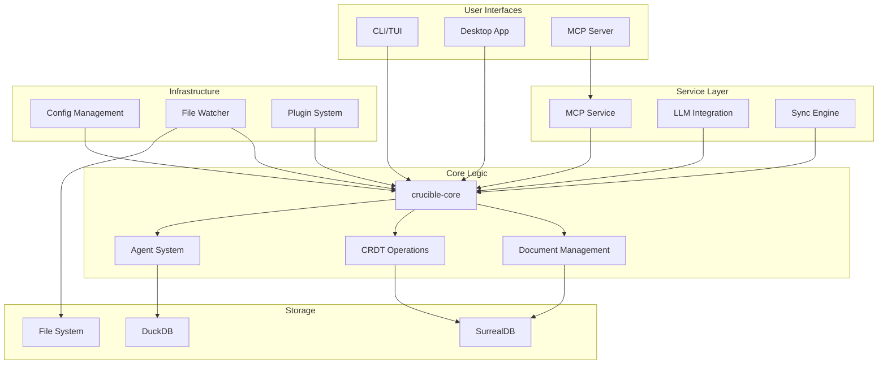
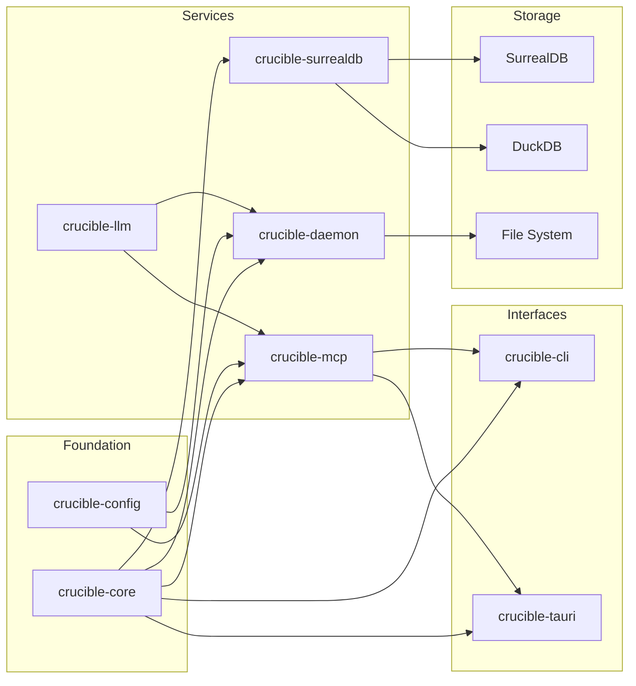
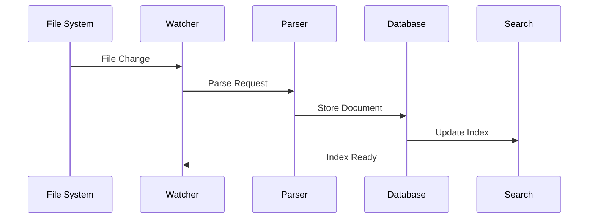
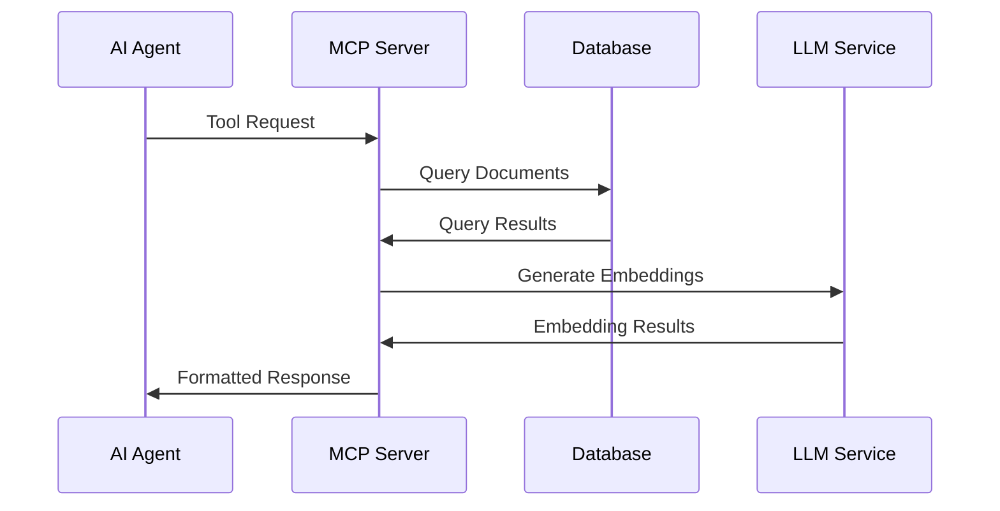
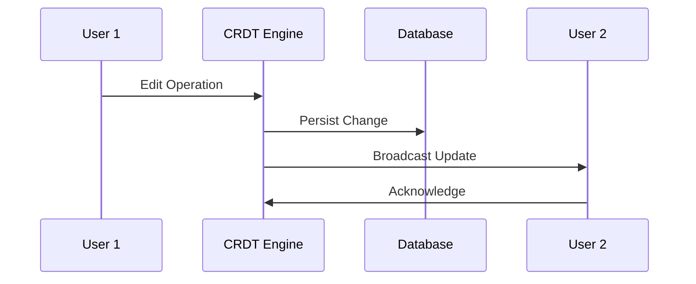

# Crucible Architecture

> High-level system architecture and component overview

## System Overview

Crucible is a knowledge management system built for linked thinking, real-time collaboration, and AI integration. The architecture follows a layered approach with clear separation between user interfaces, services, core logic, and storage.

## High-Level Architecture

## Component Relationships

## Core Components

### Foundation Layer

**crucible-core**: Heart of the system containing domain models, document management, CRDT operations, and agent definitions. Provides the essential abstractions that all other components build upon.

**crucible-config**: Centralized configuration management that handles settings, preferences, and environment-specific configuration across the entire system.

### Service Layer

**crucible-mcp**: MCP protocol server enabling AI agent integration with semantic search, document indexing, and tool-based interactions.

**crucible-daemon**: Background service providing terminal interface, REPL capabilities, and real-time file monitoring.

**crucible-surrealdb**: Database integration layer managing SurrealDB connections, queries, and data persistence.

**crucible-llm**: LLM integration supporting multiple providers (OpenAI, Ollama) for embeddings and AI capabilities.

### Interface Layer

**crucible-cli**: Command-line interface with interactive REPL, fuzzy search, and chat capabilities for terminal users.

**crucible-tauri**: Desktop application backend providing native integration, system notifications, and desktop-specific features.

**Frontend Packages**:
- **Desktop**: Tauri + Svelte 5 application for rich desktop experience
- **Shared**: Common frontend components and utilities
- **Obsidian Plugin**: Integration with Obsidian for extending existing workflows

### Supporting Systems

**crucible-watch**: File system monitoring service that detects changes and triggers document processing pipelines.

**crucible-plugins**: Plugin system using Rune scripting for dynamic extensibility and custom tool execution.

**crucible-sync**: Real-time synchronization engine managing CRDT operations and collaborative editing.

## Data Flow Patterns

### Document Processing

### AI Agent Interaction

### Real-time Collaboration

## Key Architectural Decisions

**Layered Architecture**: Clear separation between interfaces, services, core logic, and storage enables independent development and maintenance.

**Multi-Model Database**: SurrealDB provides graph, document, and relational capabilities while DuckDB handles analytics and vector operations.

**Async-First Design**: Built on Tokio for high concurrency and non-blocking operations throughout the system.

**Trait-Based Extensibility**: Rust traits enable pluggable components and easy testing while maintaining performance.

**MCP Integration**: Native support for AI agents through the Model Context Protocol enables intelligent workflows and semantic search.

**Plugin System**: Rune scripting allows dynamic extensibility without compromising core system security or performance.