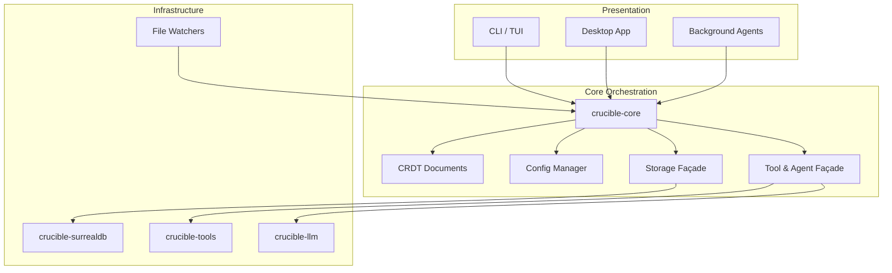

# Crucible Architecture (2025 roadmap)

Crucible is evolving toward a layered architecture where every interface (CLI today, desktop/agent integrations tomorrow) talks only to `crucible-core`. The core owns the domain model, agent orchestration, and the façades that hide storage and tooling details. Infrastructure crates stay reusable, while UIs remain thin and testable.

## High-Level Layout

## Layer Responsibilities

### Presentation Layer
- Parse user intent (commands, UI actions, agent triggers).
- Render results, handle local IO, and delegate work to the core façade.
- Remain free of direct tool/storage dependencies for portability.

### Core Orchestration
- **Domain State**: CRDT documents, metadata, and knowledge graphs.
- **Configuration**: Load and validate runtime configuration once; share with downstream components.
- **Tool/Agent Façade**: Provide traits for executing tools, running agents, and streaming results back to UIs.
- **Storage Façade**: Offer read/write APIs for SurrealDB-backed state without exposing database details.
- **Sync & Collaboration (Roadmap)**: Coordinate CRDT updates across devices and sessions; manage permissions for multi-user collaboration.

### Infrastructure Layer
- **crucible-surrealdb**: SurrealDB client, migration helpers, embedding pipelines.
- **crucible-tools**: Tool registry, execution, caching, and tracing.
- **crucible-llm**: Agent integrations, embedding providers, chat pipelines.
- **Watchers & Services**: File watchers, background processors, optional platform services.

## Data Flows

### Document Lifecycle
1. Watchers (or manual triggers) notify the core of file changes.
2. Core parses Markdown/CRDT structures and writes canonical state through the storage façade.
3. Tool façade emits events for indexing, linking, and embedding updates.
4. UIs query the core for summaries, search results, or structured data.

### Tool / Agent Invocation
1. UI or automation calls `Core::execute_tool(...)`.
2. Core checks configuration, prepares context, and delegates to `crucible-tools`.
3. Results stream back through the façade; errors are normalized for every UI.
4. Agents reuse the same pathway, enabling automated workflows.

### Sync & Collaboration (Planned)
1. Core exposes session APIs to subscribe to CRDT updates.
2. Transport plugins (desktop, server relay, p2p) forward updates between devices.
3. Conflict resolution stays inside the CRDT layer; UIs render merged documents.

## Testing Strategy
- **Unit Tests** live alongside modules and target pure logic.
- **Fixtures** come from `crucible_core::test_support`, ensuring consistent kiln/document data across crates.
- **Integration Tests** (planned `crates/integration-tests`) spin up the core façade and exercise shared workflows.
- **UI Tests** keep their own `tests::support` modules for presentation-specific helpers while relying on core fixtures for data.

## Roadmap Alignment
- Phase 2 establishes shared fixtures and per-crate support modules.
- Phase 5 moves tooling/storage orchestration fully behind the core façade.
- Phase 6 introduces a `CliApp` builder; later phases align the REPL and future desktop shell.
- Sync and multi-user collaboration build on the same façade, letting agents and humans share workflows across devices.

Legacy documentation about the "ScriptEngine" architecture is preserved in `docs/SCRIPTENGINE_API.md` for historical context and will be removed once the refactor completes.
