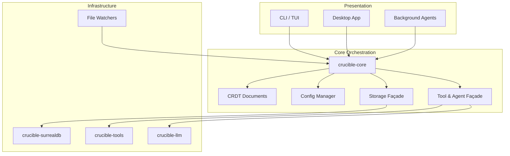

# Crucible Architecture (2025 roadmap)

Crucible is a **plaintext-first agent framework** built around metadata-rich knowledge graphs. The current MVP focuses on verifying that graph structure (wikilinks, tags, embeddings) enables better agent accuracy through agent-friendly CLI primitives. Future enhancements include RL techniques, custom agent definitions, and definable workflows via Markdown.

The architecture is evolving toward a layered system where every interface (CLI today, desktop/agent integrations tomorrow) talks only to `crucible-core`. The core owns the domain model, agent orchestration, and the façades that hide storage and tooling details. Infrastructure crates stay reusable, while UIs remain thin and testable.

## Design Philosophy

**Portable & Open**: Markdown files are the source of truth, ensuring portability across devices (even those without databases) and avoiding vendor lock-in.

**Agent-First UX**: Rather than pre-selecting context, Crucible provides simple CLI primitives (`cru semantic`, `cru query`) that agents can call with their native tool-calling capabilities to explore and discover relevant knowledge.

**Metadata-Rich Graphs**:
- **Wikilinks ARE the graph**: `[[Note Name]]` links define entities and relationships directly in plaintext
- **Notes ARE entities**: No extraction needed - `Machine Learning.md` is the entity itself
- **Block-level granularity**: Semantic search, embeddings, and results operate at AST block level (paragraphs, headings, lists)

**Incremental Optimization**: The architecture supports future enhancements (reinforcement learning for context selection, custom agent definitions, workflow automation) while maintaining the plaintext-first foundation.

## High-Level Layout



## Layer Responsibilities

### Presentation Layer
- Parse user intent (commands, UI actions, agent triggers).
- Render results, handle local IO, and delegate work to the core façade.
- Remain free of direct tool/storage dependencies for portability.

### Core Orchestration
- **Domain State**: CRDT documents, metadata, and knowledge graphs.
- **Configuration**: Load and validate runtime configuration once; share with downstream components.
- **Tool/Agent Façade**: Provide traits for executing tools, running agents, and streaming results back to UIs.
- **Storage Façade**: Offer read/write APIs for SurrealDB-backed state without exposing database details.
- **Sync & Collaboration (Roadmap)**: Coordinate CRDT updates across devices and sessions; manage permissions for multi-user collaboration.

### Infrastructure Layer
- **crucible-surrealdb**: SurrealDB client, migration helpers, embedding pipelines.
- **crucible-tools**: Tool registry, execution, caching, and tracing.
- **crucible-llm**: Agent integrations, embedding providers, chat pipelines.
- **Watchers & Services**: File watchers, background processors, optional platform services.

## Data Flows

### Document Lifecycle
1. **Integrated File Processing**: CLI automatically scans for file changes on startup, processing only new/modified files (incremental).
2. Core parses Markdown/CRDT structures and writes canonical state through the storage façade.
3. Tool façade emits events for indexing, linking, and embedding updates.
4. UIs query the core for summaries, search results, or structured data.

#### Single-Binary Architecture (2025-11)
- **No External Daemon**: All file processing happens in-process within the CLI binary
- **Startup Processing**: Files are processed automatically when CLI starts, ensuring data is always up-to-date
- **Graceful Degradation**: CLI continues to function even if file processing fails, using existing data
- **User Control**: `--no-process` flag skips processing for quick commands, `--process-timeout` controls duration
- **Incremental Updates**: Only changed files are reprocessed, providing fast subsequent startups

### Tool / Agent Invocation (Current MVP)
**Agent-Friendly CLI Primitives**: Agents call simple commands with their native tool-calling:
- `cru semantic "machine learning concepts"` - Block-level semantic search using embeddings
- `cru query 'SELECT * FROM notes WHERE tags CONTAINS "AI"'` - Flexible SurrealQL queries for graph traversal
- `cru fuzzy "neural networks"` - Fast content search across vault
- Agents use their `Read` tool to pull full note content when specific context is needed

**Future (Planned)**:
1. UI or automation calls `Core::execute_tool(...)`.
2. Core checks configuration, prepares context, and delegates to `crucible-tools`.
3. Results stream back through the façade; errors are normalized for every UI.
4. Agents reuse the same pathway, enabling automated workflows with RL-optimized context selection.

### Sync & Collaboration (Planned)
1. Core exposes session APIs to subscribe to CRDT updates.
2. Transport plugins (desktop, server relay, p2p) forward updates between devices.
3. Conflict resolution stays inside the CRDT layer; UIs render merged documents.

## Data Flow Optimization (2025-11)

### Content-Addressed Storage Architecture

The refactoring introduced a **content-addressed storage** layer with block-level deduplication and efficient change detection:

#### Core Components

1. **Content Hashers** (`crucible-core/src/hashing/`)
   - `ContentHasher` trait: Abstract interface for different hash algorithms (BLAKE3, SHA-256)
   - `BlockHasher`: Converts AST blocks to content-addressed `HashedBlock` structures
   - `FileHasher`: Streaming file-level hashing for large documents
   - Factory functions for algorithm selection: `new_blake3_block_hasher()`, `new_sha256_block_hasher()`

2. **Storage Layer** (`crucible-core/src/storage/`)
   - `ContentAddressedStorage` trait: Read/write operations for blocks and Merkle trees
   - `MemoryStorage`: In-memory implementation for testing and caching
   - `EnhancedChangeDetector`: Detects modifications, additions, and deletions with similarity scoring
   - `ChangeApplication`: Apply detected changes to existing trees with rollback support
   - `Deduplicator`: Analyzes duplicate content patterns and calculates storage savings

3. **Parser Integration** (`crucible-core/src/parser/`)
   - `ParserStorageCoordinator`: Orchestrates parsing with automatic storage integration
   - `StorageAwareParser`: Wraps base parser to add content hashing and change detection
   - Batch operations support for processing multiple documents efficiently
   - Comprehensive error recovery and operation tracking

#### Data Flow

```
Markdown File
    ↓
Parser → AST Blocks
    ↓
BlockHasher → HashedBlock[]
    ↓
ContentAddressedStorage
    ├─→ Block Storage (deduplicated)
    └─→ Merkle Tree Storage (for change detection)
    ↓
EnhancedChangeDetector
    └─→ ChangeMetadata (similarity, confidence)
```

#### Key Benefits

1. **Deduplication**: Identical blocks stored once across all documents
2. **Efficient Change Detection**: Merkle trees enable O(log n) comparison
3. **Incremental Processing**: Only changed blocks need reprocessing
4. **Algorithm Flexibility**: Easy to switch between BLAKE3 and SHA-256
5. **Storage Backends**: Pluggable storage (memory, SurrealDB, future backends)
6. **Comprehensive Tracking**: Detailed metrics on operations, deduplication, and performance

#### Implementation Highlights

- **Zero-copy where possible**: Hashing operates on borrowed slices
- **Streaming for large files**: File hasher uses buffered I/O
- **Parallel-ready**: Architecture supports future parallel processing
- **Type safety**: Strong typing prevents hash algorithm mismatches
- **Error handling**: Comprehensive `StorageError` and `ParserError` types
- **Testing**: Mock implementations for all major traits

This architecture provides the foundation for efficient file processing in the single-binary CLI, enabling fast incremental updates and intelligent change detection while maintaining data integrity through content addressing.

## Testing Strategy
- **Unit Tests** live alongside modules and target pure logic.
- **Fixtures** come from `crucible_core::test_support`, ensuring consistent kiln/document data across crates.
- **Integration Tests** (planned `crates/integration-tests`) spin up the core façade and exercise shared workflows.
- **UI Tests** keep their own `tests::support` modules for presentation-specific helpers while relying on core fixtures for data.

## REPL Implementation (Dependency Injection)

The CLI REPL demonstrates the façade pattern in practice:

### Architecture
```
┌──────────────┐
│    REPL      │ - User interface (reedline editor)
│              │ - Input parsing and command routing
└──────┬───────┘
       │ owns Arc<CrucibleCore>
       ▼
┌──────────────┐
│CrucibleCore  │ - Storage façade (query, list_tables, get_stats)
│   (Façade)   │ - Dependency injection via builder pattern
└──────┬───────┘
       │ owns dyn Storage trait
       ▼
┌──────────────┐
│SurrealClient │ - Implements Storage trait
│              │ - Database operations
└──────────────┘
```

### Key Components
- **REPL**: Thin presentation layer handling user input and output formatting
- **ReplCompleter**: Autocompletion using `Arc<CrucibleCore>` for table introspection
- **CrucibleCore**: Single point of database access through Storage trait
- **SurrealClient**: Infrastructure implementation of Storage

### Benefits
1. **Testability**: REPL uses `Repl::new_test()` with in-memory storage
2. **Portability**: Core can swap storage implementations via builder
3. **Clean boundaries**: REPL never touches database directly
4. **Autocompletion**: Completer shares Core instance for real-time table names

This pattern eliminates the legacy `ReplDatabase` wrapper and demonstrates how all presentation layers (CLI, desktop, agents) should interact with Core through façades.

## Roadmap Alignment
- Phase 2 establishes shared fixtures and per-crate support modules.
- Phase 5 moves tooling/storage orchestration fully behind the core façade.
- Phase 6 introduces a `CliApp` builder; later phases align the REPL and future desktop shell.
- Sync and multi-user collaboration build on the same façade, letting agents and humans share workflows across devices.

Legacy documentation about the former "ScriptEngine" architecture has been removed; consult Git history if you need the old design for reference.
