# Crucible Data Processing Pipeline - Architectural Diagrams

This document contains comprehensive architectural diagrams for Crucible's data processing pipeline using Mermaid syntax. These diagrams serve as technical documentation for developers working on the system.

## Table of Contents
1. [High-Level System Architecture](#1-high-level-system-architecture)
2. [Data Processing Pipeline Flow](#2-data-processing-pipeline-flow)
3. [Database Schema Diagram](#3-database-schema-diagram)
4. [Component Interaction Diagram](#4-component-interaction-diagram)
5. [Performance and Scaling Diagram](#5-performance-and-scaling-diagram)

---

## 1. High-Level System Architecture

### Overall System Components and Relationships

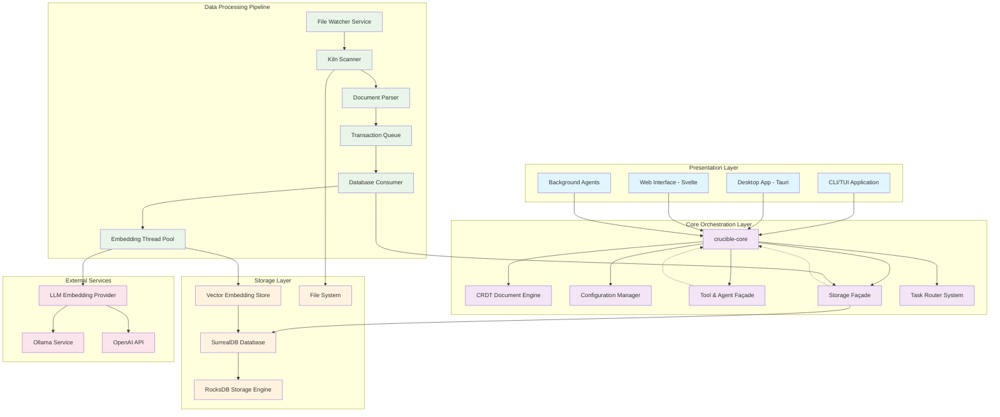

### Component Architecture with Module Boundaries

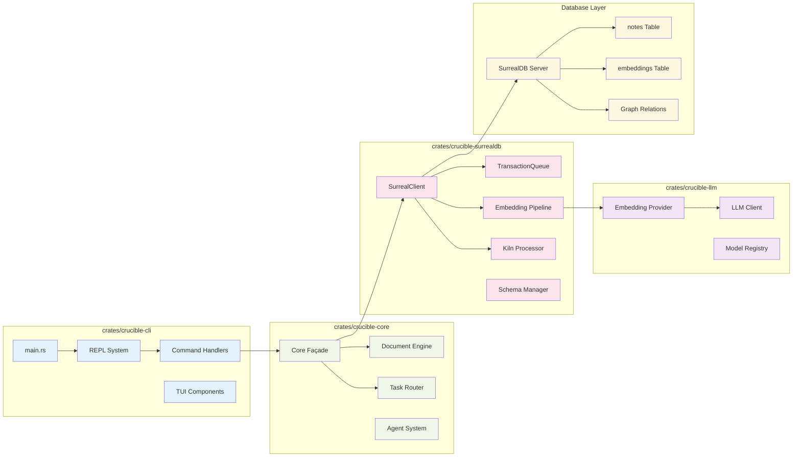

---

## 2. Data Processing Pipeline Flow

### Complete File Processing Pipeline

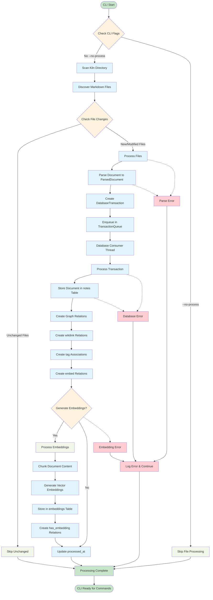

### Transaction Queue Architecture

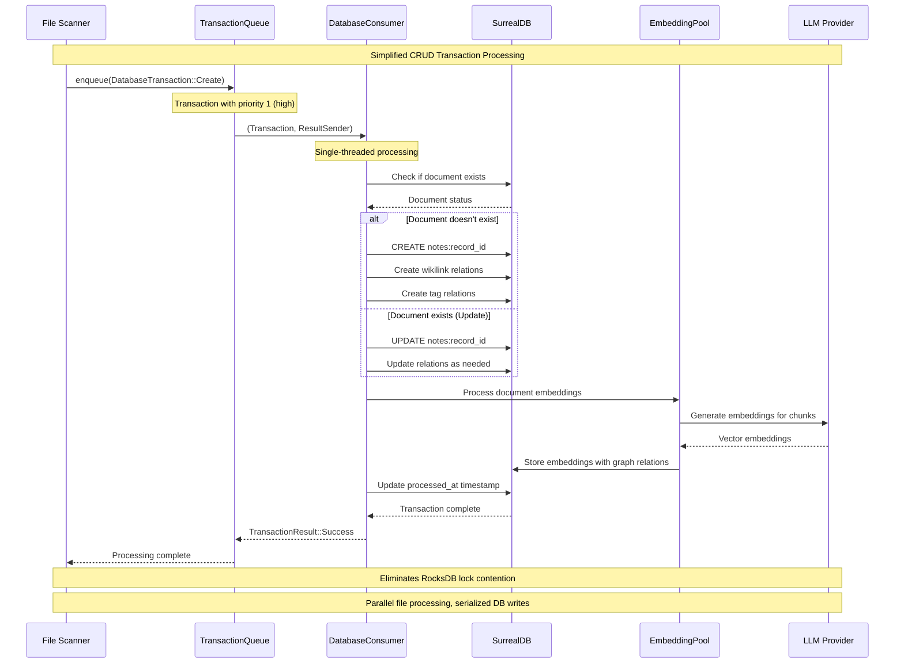

### Incremental Processing Flow

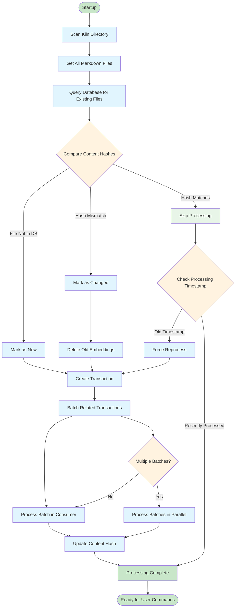

---

## 3. Database Schema Diagram

### SurrealDB Tables and Relationships

```mermaid
erDiagram
    notes {
        string id PK
        string path UK
        string title
        string content
        json metadata
        array tags
        string content_hash
        integer file_size
        string folder
        datetime created_at
        datetime modified_at
        datetime processed_at
    }

    embeddings {
        string id PK
        array vector
        string embedding_model
        integer chunk_size
        integer chunk_position
        string chunk_hash
        integer vector_dimensions
        datetime created_at
    }

    tags {
        string id PK
        string name
        datetime created_at
    }

    %% Graph Relations (SurrealDB relation tables)
    has_embedding {
        string id PK
        notes_id FK
        embeddings_id FK
        datetime created_at
    }

    wikilink {
        string id PK
        from_note_id FK
        to_note_id FK
        string link_text
        integer position
        datetime created_at
    }

    embeds {
        string id PK
        from_note_id FK
        to_note_id FK
        string embed_type
        string reference_target
        string display_alias
        integer position
        datetime created_at
    }

    tagged_with {
        string id PK
        notes_id FK
        tag_id FK
        datetime added_at
    }

    %% Relationships
    notes ||--o{ has_embedding : "has"
    notes ||--o{ wikilink : "links_to"
    notes ||--o{ embeds : "embeds"
    notes ||--o{ tagged_with : "tagged_with"
    embeddings ||--o{ has_embedding : "embedded_in"
    tags ||--o{ tagged_with : "applies_to"

    %% Wikilink self-references
    wikilink }o--|| notes : "from"
    wikilink }o--|| notes : "to"

    %% Embeds self-references
    embeds }o--|| notes : "from"
    embeds }o--|| notes : "to"

    %% Constraints and Indexes
    %% notes: UNIQUE(path), INDEX(content_hash), INDEX(processed_at)
    %% embeddings: INDEX(chunk_hash), INDEX(embedding_model), INDEX(created_at)
    %% tags: UNIQUE(name)
```

### Data Flow Through Database Schema

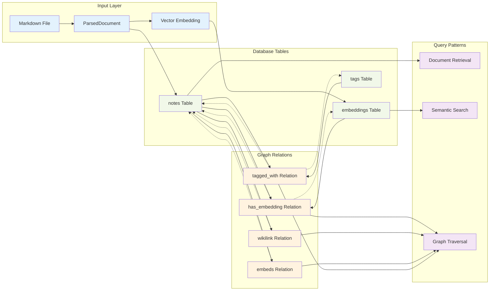

### Vector Embedding Architecture

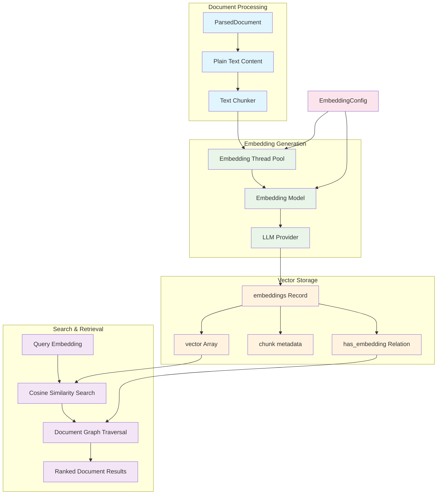

---

## 4. Component Interaction Diagram

### Module Interactions and Dependencies

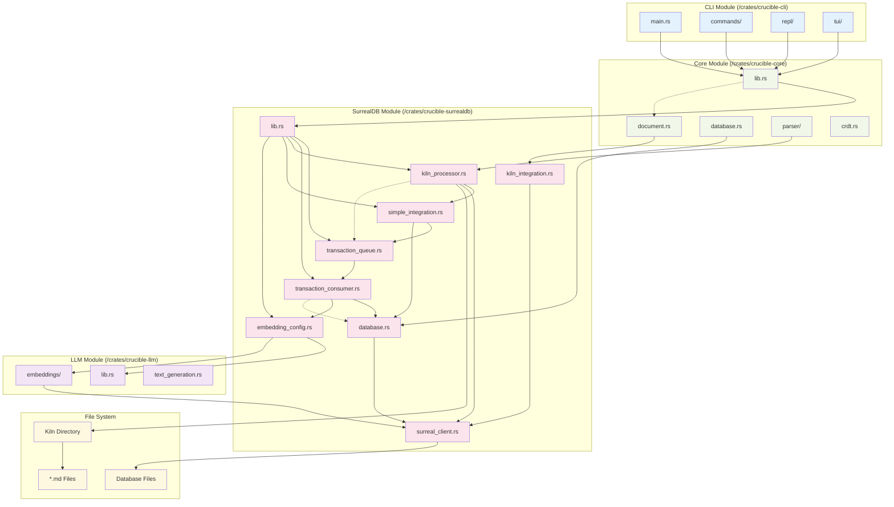

### Runtime Interaction Patterns

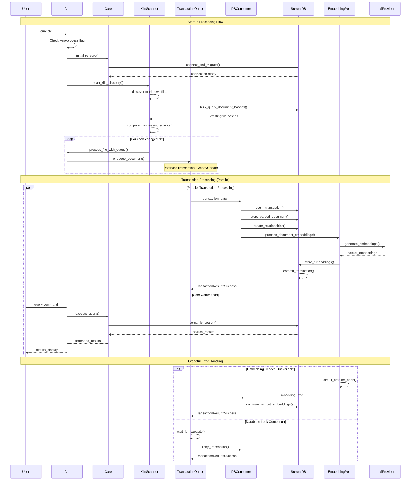

### Error Handling and Recovery Patterns

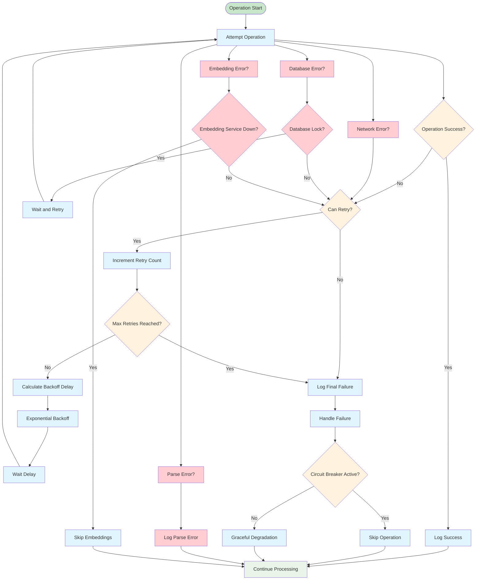

---

## 5. Performance and Scaling Diagram

### Bottleneck Points and Optimization Opportunities

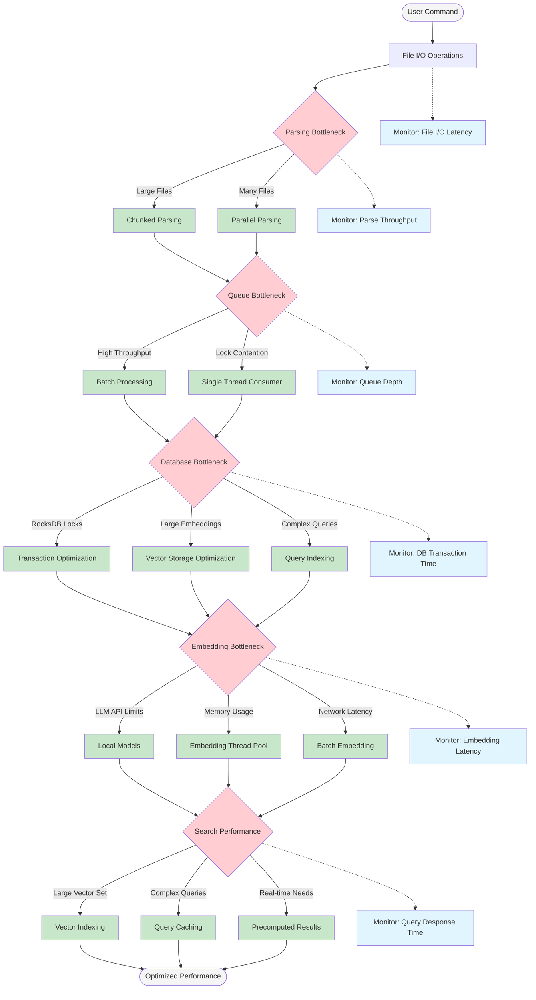

### Resource Utilization and Scaling Patterns

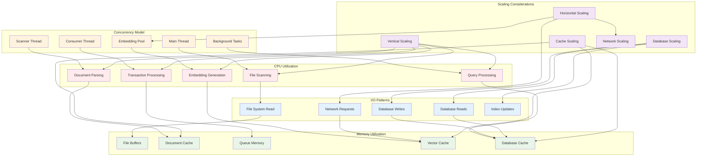

### Performance Metrics and Monitoring

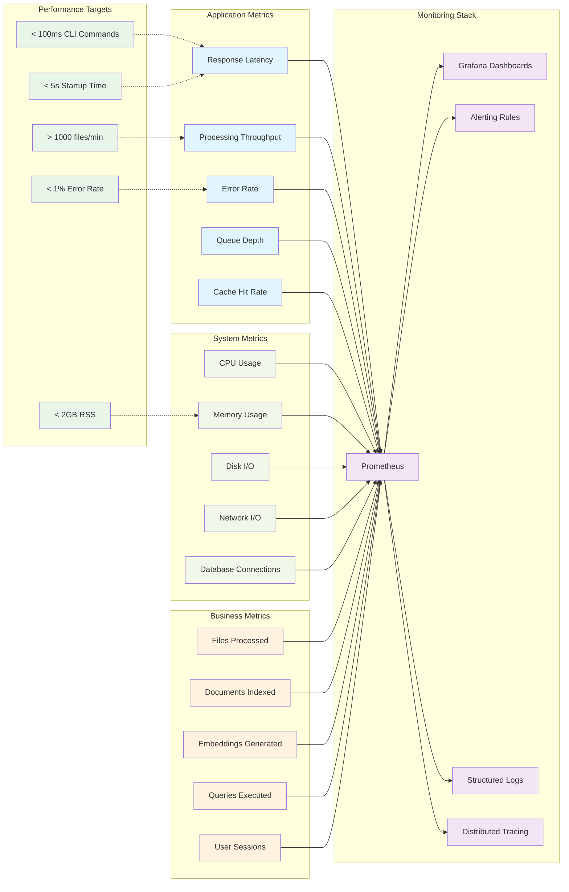

## Key Architectural Insights

### Single-Binary Architecture Benefits
1. **No External Dependencies**: All processing happens in-process, eliminating daemon management overhead
2. **Incremental Processing**: Only changed files are reprocessed, ensuring fast subsequent startups
3. **Graceful Degradation**: System continues to function even if individual components fail
4. **Queue-Based Design**: Eliminates RocksDB lock contention through serialized database writes

### Performance Characteristics
- **File Processing**: Parallel file scanning with incremental change detection
- **Database Operations**: Single-threaded consumer eliminates lock contention
- **Embedding Pipeline**: Configurable thread pool with circuit breaker patterns
- **Memory Efficiency**: Streaming document processing with configurable batch sizes

### Scaling Considerations
- **Vertical Scaling**: CPU-bound operations benefit from more cores
- **Memory Scaling**: Vector embeddings require careful memory management
- **I/O Optimization**: Bulk database operations reduce query overhead
- **Network Scaling**: Local embedding models reduce external dependencies

These diagrams provide a comprehensive view of Crucible's data processing pipeline and can serve as reference documentation for developers working on system optimization, feature development, and architectural improvements.