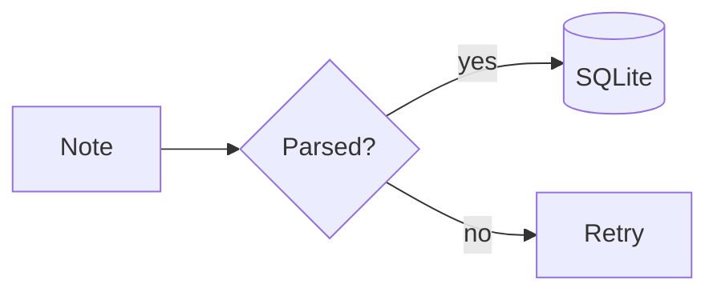
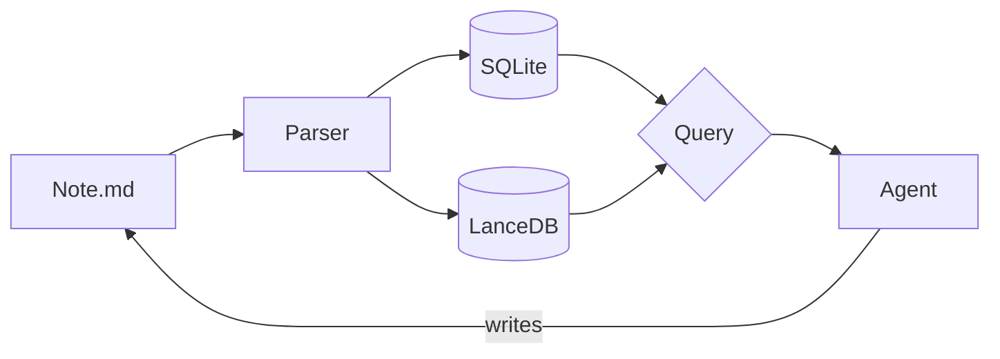
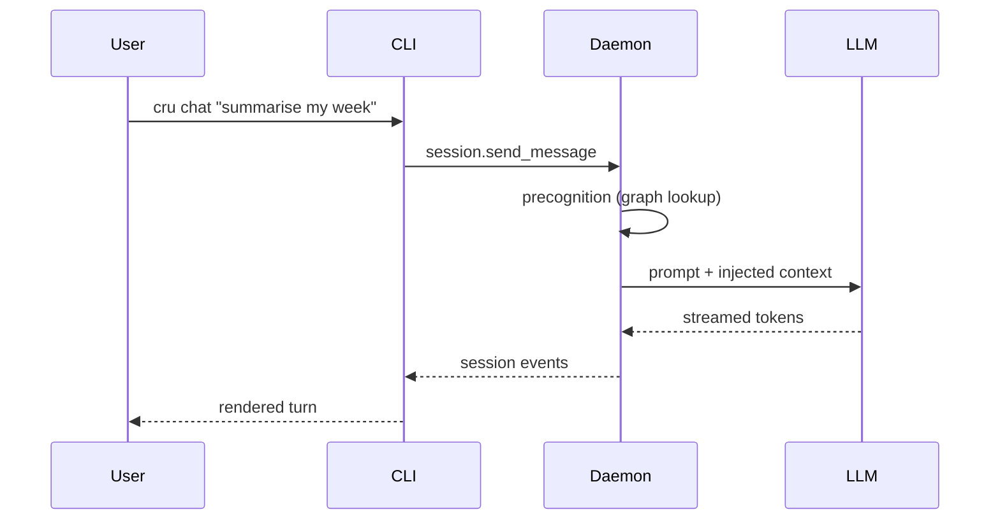
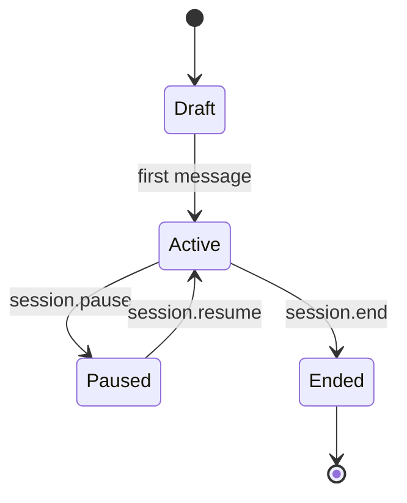
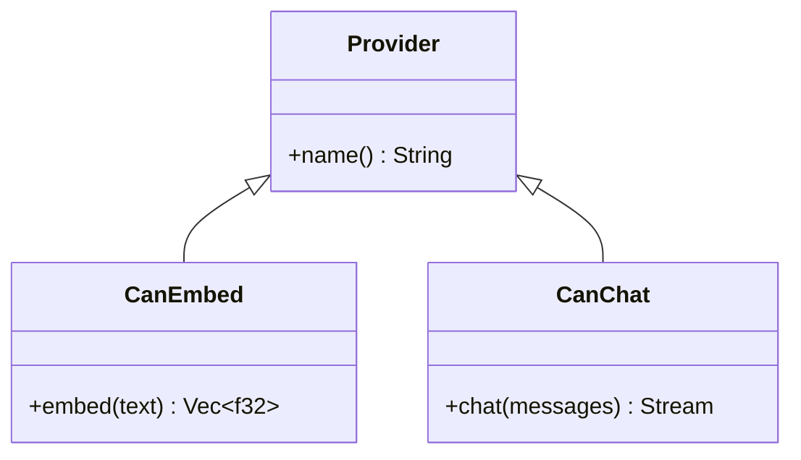
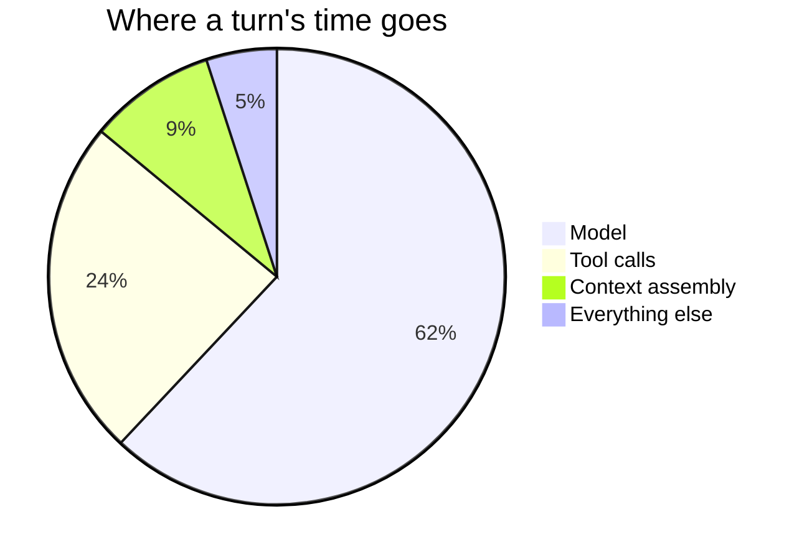
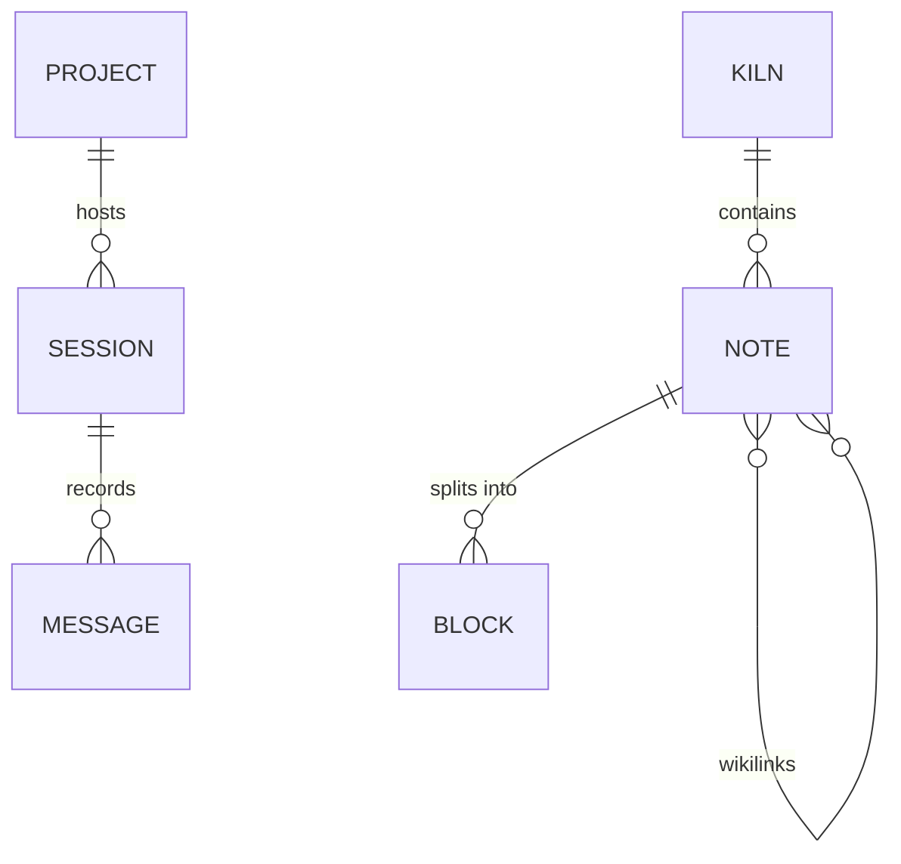
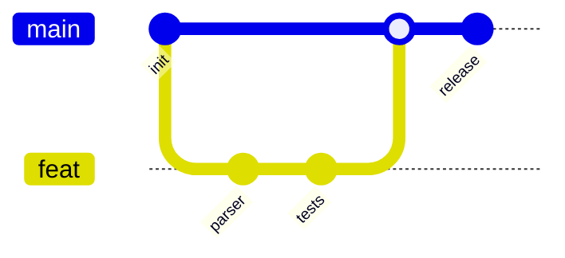
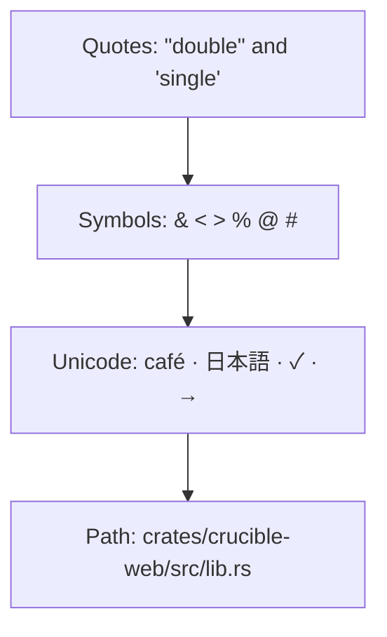

# Diagrams and Math

Notes can embed **Mermaid diagrams** and **LaTeX math**. Both render in the
reading view, in the live-preview editor, and in chat messages.

This page doubles as a render check: every block below should render as a
picture or as typeset math, never as raw source. If something on this page
shows its own markup, that is the bug.

Related: [[Help/Callouts]], [[Help/Wikilinks]], [[Help/Block References]].

## Turning them off

Both are on by default and can be switched off independently in
**Settings → Editor**:

| Setting | Effect when off |
|---|---|
| Render math | `$…$` and `$$…$$` stay as literal text |
| Render diagrams | ` ```mermaid ` fences render as plain code blocks |

Mermaid is only downloaded the first time a diagram actually renders, so
notes without diagrams pay nothing for the feature.

## Math

Inline math goes between single dollars, display math between double dollars.

```markdown
The mass–energy equivalence is $E = mc^2$.

$$
\int_{-\infty}^{\infty} e^{-x^2}\,dx = \sqrt{\pi}
$$
```

### Inline

Euler's identity, $e^{i\pi} + 1 = 0$, sits inline with the text, as does a
fraction like $\tfrac{3}{4}$, a subscripted symbol like $x_{i+1}$, and a
Greek run: $\alpha, \beta, \gamma, \Delta, \Omega$.

Inline math survives **bold**, *italic*, and `code` around it: the gradient
$\nabla f(x)$ is a vector, and $\|v\|_2 = \sqrt{\sum_i v_i^2}$ is its norm.

### Display

$$
\operatorname{softmax}(z)_i = \frac{e^{z_i}}{\sum_{j=1}^{K} e^{z_j}}
$$

Multi-line alignment:

$$
\begin{aligned}
  \cos 2\theta &= \cos^2\theta - \sin^2\theta \\
               &= 2\cos^2\theta - 1
\end{aligned}
$$

A matrix, a sum, and a limit:

$$
A = \begin{bmatrix} a & b \\ c & d \end{bmatrix}
\qquad
\sum_{n=1}^{\infty} \frac{1}{n^2} = \frac{\pi^2}{6}
\qquad
\lim_{h \to 0} \frac{f(x+h) - f(x)}{h}
$$

### What is *not* math

A lone dollar amount is left alone, so prices like $5 and $20 stay prose. An
escaped delimiter, \$notmath\$, stays literal too. Math is also skipped inside
code spans — `$E = mc^2$` — and inside fenced code blocks:

```text
$E = mc^2$ stays source here
```

### Math in other blocks

Math works inside lists, tables, quotes, and [[Help/Callouts]]:

- Complexity: $O(n \log n)$
- Probability: $P(A \mid B) = \dfrac{P(B \mid A)P(A)}{P(B)}$

| Quantity | Symbol | Definition |
|---|---|---|
| Mean | $\mu$ | $\frac{1}{n}\sum_i x_i$ |
| Variance | $\sigma^2$ | $\frac{1}{n}\sum_i (x_i - \mu)^2$ |
| Cosine similarity | $s$ | $\frac{u \cdot v}{\|u\|\,\|v\|}$ |

> [!note] In a callout
> The embedding dimension is $d = 768$, so a kiln of $N$ notes costs
> $O(Nd)$ floats.

### Malformed math

Broken math renders as a red error in place rather than breaking the page:
$\frac{1}{$ is intentionally invalid.

## Diagrams

Fence a diagram with ` ```mermaid `. The label text is drawn as SVG text, so
node labels with punctuation, quotes, and unicode all survive.

````markdown

````

### Flowchart



### Sequence



### State



### Class



### Pie



### Entity relationship



### Git graph



### Labels with awkward characters

Quotes, symbols, and unicode in labels are the case most likely to break
sanitization, so they get their own check. Note that Mermaid has no backslash
escape inside a quoted label — use its `#…;` entity codes (`#quot;`, `#35;`)
for characters that would otherwise end the string:



### Broken diagrams

A diagram that Mermaid cannot parse falls back to the raw code block instead
of erroring the note:

````markdown
```mermaid
flowchart LR
  this is not valid mermaid ][
```
````

## Checklist

When verifying a change to the renderers, walk this page in all three
surfaces:

- [ ] Reading view — every diagram is a picture, every formula is typeset
- [ ] Live-preview editor — same, and diagrams stay rendered while scrolling
      (not only after the cursor passes through them)
- [ ] Chat — paste a diagram and a formula into a message
- [ ] Node labels show their text (a blank node means label sanitization broke)
- [ ] `$5 and $20` still reads as prose
- [ ] Both settings toggles switch their feature off, and back on
