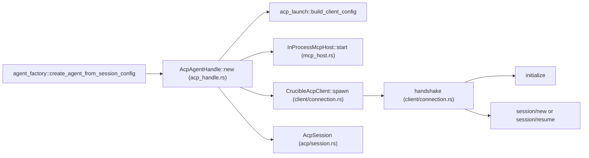
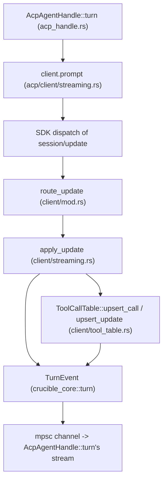

# ACP and MCP

This page describes the code under `crates/crucible-daemon/src/acp/`,
`crates/crucible-daemon/src/acp_handle.rs`, `acp_handle/translate.rs`,
`acp_launch.rs`, `mcp_host.rs`, `mcp_server.rs`, and `mcp/`. It names every
file that owns the wire protocol to an external ACP agent, the `AgentHandle`
adapter that plugs an ACP agent into the daemon's turn model, and the two MCP
surfaces the daemon exposes.

## Purpose and ownership

This subsystem owns two things. First, `crates/crucible-daemon/src/acp/` owns the
Agent Client Protocol (ACP) wire layer: spawning an external agent process
(opencode, Claude Code, Gemini CLI, codex, cursor-agent, Hermes, or
Antigravity), running the handshake over an `agent-client-protocol` SDK
connection, and turning each `session/update` notification directly into a
`crucible_core::turn::TurnEvent`. Second, `mcp_host.rs`, `mcp_server.rs`, and
`mcp/` own the daemon's own Model Context Protocol (MCP) surfaces: an
in-process HTTP server an external ACP agent's own MCP client can call into,
and a daemon-managed lifecycle for an MCP server exposed to outside tool
clients over SSE or stdio.

This subsystem must not own turn orchestration, history flattening, or tool
containment policy. `crates/crucible-daemon/src/acp/mod.rs` states this in
its own doc comment: "Orchestration (history, context, streaming
aggregation) lives in `crucible-daemon`; this crate handles only the wire
protocol." That wording is a documentation remnant from a time when `acp`
may have lived in its own crate; the module is inside `crucible-daemon` now,
so "this crate" should read "this module." `acp_handle.rs` is the seam that
turns the wire client into a [[Daemon Server|daemon]]-recognized
`AgentHandle`; it does not itself speak JSON-RPC. Tool containment is
enforced by `crates/crucible-daemon/src/tools/containment.rs`'s `RootSet`,
which `mcp_host.rs` receives as a required argument rather than building for
itself — matching AGENTS.md's rule that scope and admission live in the
containment/scope modules, not wherever a surface happens to need them.

This matches the AGENTS.md ownership table: `crucible-daemon` owns
"Sessions, admission, tools... plugin lifecycle," and ACP/MCP are two of the
tool-facing wire protocols that daemon owns. The wire framing and request
correlation Crucible's own code once owned now belong to the
`agent-client-protocol` SDK (an external dependency, not a Crucible crate);
`crucible-core` supplies the canonical `TurnEvent`/`StopReason`/
`SessionAgent`/`CanonicalToolCall`/`RawToolCall`/`AgentKeys` types this
module classifies wire frames into and consumes, never duplicating them.

## Module map

### `crates/crucible-daemon/src/acp/` — ACP wire client

| Path | Lines | Role |
| --- | --- | --- |
| `crates/crucible-daemon/src/acp/mod.rs` | 21 | Module root; re-exports `CrucibleAcpClient`, `is_agent_available`, `AcpSession`, `humanize_tool_title`, `turn_usage`, `TurnSummary`, `ClientError`/`Result`. |
| `crates/crucible-daemon/src/acp/error.rs` | 25 | `ClientError` (`thiserror`, three variants: `Session`, `Connection`, `Timeout`) and its `Result` alias. |
| `crates/crucible-daemon/src/acp/discovery.rs` | 627 | Resolves an agent name to its `AgentProfile` via `profile()`/`profiles()`; built-in table (opencode, claude, gemini, codex, cursor, hermes, antigravity) overlaid by `AcpConfig`; no caching or automatic probing. |
| `crates/crucible-daemon/src/acp/session.rs` | 217 | `AcpSession`, `ModelChoice`, `ResumeDisposition` — what one connected session carries. |
| `crates/crucible-daemon/src/acp/streaming.rs` | 150 | `TurnSummary`, `turn_usage`, `humanize_tool_title` — turn-summary and usage helpers; the client emits `crucible_core::turn::TurnEvent` directly, so there is no neutral chunk vocabulary here anymore. |

### `crates/crucible-daemon/src/acp/client/` — `CrucibleAcpClient` implementation

| Path | Lines | Role |
| --- | --- | --- |
| `crates/crucible-daemon/src/acp/client/mod.rs` | 391 | Defines `CrucibleAcpClient`, builds the SDK `Client` connection (notification/permission handlers), and exposes the generic `request<R: JsonRpcRequest>` RPC call. Keeps the agent's latest `available_commands_update` in a `watch` channel, read by `commands()`. |
| `crates/crucible-daemon/src/acp/client/connection.rs` | 259 | Process spawn/kill (`spawn`, `AgentProcess` with whole-process-group kill), capability-aware handshake (`handshake`), and `session/close` (`close`). |
| `crates/crucible-daemon/src/acp/client/streaming.rs` | 369 | The client's per-turn prompt driver (`prompt`, `wait_for_turn_end`, `CANCELLED_TURN_GRACE`) and `apply_update`, which turns each `SessionUpdate` directly into `crucible_core::turn::TurnEvent`. |
| `crates/crucible-daemon/src/acp/client/streaming_tests.rs` | 295 | `#[cfg(test)]` unit tests attached to `streaming.rs` via `#[path]` (needs crate-private access to `apply_update`). |
| `crates/crucible-daemon/src/acp/client/tool_table.rs` | 1078 | `ToolCallTable` — joins `tool_call`/`tool_call_update`/`session/request_permission` frames per `toolCallId` into one classified `CanonicalToolCall`, and reconciles them into one ordered announce/complete sequence. |
| `crates/crucible-daemon/src/acp/client/tools.rs` | 105 | Extracts a completed tool call's result (a JSON `Value`, not always text) and error text from `rawOutput`/`content`. |
| `crates/crucible-daemon/src/acp/client/recording.rs` | 248 | JSONL wire recorder (`CRUCIBLE_ACP_RECORD_DIR`), tapped from `connection.rs`'s `recorded_lines`; produces fixtures for replay tests. |
| `crates/crucible-daemon/src/acp/client/replay.rs` | 554 | Fixture-driven replay transport that feeds a recorded trace back to a live client, validating both the outgoing method name and stable per-method params (`DivergenceKind::ParamMismatch`). |
| `crates/crucible-daemon/src/acp/client/types.rs` | 152 | `ClientConfig` (plain, no serde derives; carries `tools: Vec<AgentKeys>`) and `StreamingState` (per-turn accumulator). |

### `crates/crucible-daemon/src/acp/client/tests/` — client test suite

| Path | Lines | Role |
| --- | --- | --- |
| `crates/crucible-daemon/src/acp/client/tests/mod.rs` | 86 | Declares the test submodules (`handshake`, `permission_name`, `streaming`) and shared in-process pipe fixtures: `RawAgent`, `raw_client()`, `scripted_client()`. |
| `crates/crucible-daemon/src/acp/client/tests/handshake.rs` | 288 | Connect/handshake/request/drop-kills-process-group behavior, over a scripted duplex transport and a real-process path. |
| `crates/crucible-daemon/src/acp/client/tests/permission_name.rs` | 284 | Proves the canonical call a `session/request_permission` is decided on: id-joining, agent naming, and the cancel-wins-over-answer race. |
| `crates/crucible-daemon/src/acp/client/tests/streaming.rs` | 934 | The tool-call merge/flush state machine, text accumulation and dedup, sanitization of control/bidi characters, and `describe_rpc_error`'s unwrap-termination guarantee, asserted against `TurnEvent` and `apply_update`. |

### `crates/crucible-daemon/src/` — the `AgentHandle` adapter and launch config

| Path | Lines | Role |
| --- | --- | --- |
| `crates/crucible-daemon/src/acp_handle.rs` | 709 | `AcpAgentHandle` — implements `AgentHandle`, `SessionKnobs` and `crucible_core::turn::Agent` for a daemon-managed external ACP agent. |
| `crates/crucible-daemon/src/acp_handle/translate.rs` | 325 | Pure translation: `ClientError` → `TurnError` (`turn_error`), ACP `StopReason` → `crucible_core::turn::StopReason` (`turn_stop_reason`), and `acp_prompt_text` for injected-context forwarding. |
| `crates/crucible-daemon/src/acp_launch.rs` | 690 | Resolves the command/args/env/tool-key-table to exec for an ACP agent via `acp::discovery::profile`, including sandbox relocation; refuses (does not execute) an unknown or malformed agent name. |

### `crates/crucible-daemon/src/` — MCP surfaces

| Path | Lines | Role |
| --- | --- | --- |
| `crates/crucible-daemon/src/mcp_host.rs` | 575 | `InProcessMcpHost` — an in-process MCP server over streamable HTTP that an external ACP agent's MCP client connects to; requires both a `RootSet` for containment and a permission `call_gate`. |
| `crates/crucible-daemon/src/mcp_server.rs` | 275 | `McpServerManager` — daemon-owned start/stop/status lifecycle for an MCP server served over SSE or stdio. |
| `crates/crucible-daemon/src/mcp/mod.rs` | 3 | Module root declaring `mcp::config`. |
| `crates/crucible-daemon/src/mcp/config.rs` | 148 | Projects configured MCP servers plus live gateway state into the `McpServerInfo` session-event payload. |

## Key types and traits

**`CrucibleAcpClient`** (`crates/crucible-daemon/src/acp/client/mod.rs`) is the
wire client. It holds a clone of the `agent-client-protocol` SDK's
`ConnectionTo<Agent>`, the agent's declared `AgentCapabilities` (from
`initialize`), a `turn_gate: tokio::sync::Mutex<()>` that serializes turns,
and `Arc<Mutex<Shared>>` (the running turn's state, the latest model choice,
the agent's tool-key table, and a `commands:
tokio::sync::watch::Sender<Vec<SessionCommand>>`). There is no JSON-RPC id
counter and no raw stdin/stdout field on the client itself — the SDK owns
the transport and correlates requests to responses. `CrucibleAcpClient::spawn`
(production; via `AcpAgentHandle::new`) starts an agent process and connects
over its stdio; `CrucibleAcpClient::connect` (tests, replay) connects over any
`impl ConnectTo<Client>`, with no process. `AcpAgentHandle` holds the client
in a bare `Arc<CrucibleAcpClient>` — turn exclusivity is enforced inside the
client itself, not by a handle-side mutex.

`route_update` keeps an `AvailableCommandsUpdate` the same way it keeps a
model choice: it can arrive at any time, also outside a turn, so `commands()`
gives a `watch::Receiver` any caller can read from rather than a value
`route_update` could only apply to a turn that happens to be running.
`AgentManager::session_commands` (`agent_manager/commands.rs`) reads it to
list the ACP agent's commands as `CommandKind::Agent` entries in the
session's catalog.

**`AcpSession`** (`crates/crucible-daemon/src/acp/session.rs`) is a plain,
immutable-after-construction record of what one connected session carries: a
`session_id`, an optional `ModelChoice`, an optional `SessionModeState`, the
raw `Vec<SessionConfigOption>`, and a `ResumeDisposition` (`NotAttempted`,
`Resumed`, `FellBackToNew`). It has no builder methods; `AcpSession::new`
(crate-private) takes every field up front and derives `model` from
`config_options` internally. It is created by `CrucibleAcpClient::handshake`
(`acp/client/connection.rs`) as the handshake progresses, and consumed by
`AcpAgentHandle::new` to seed the handle's own mode/model state.

**`crucible_core::turn::TurnEvent`** (`crates/crucible-core/src/turn/mod.rs`,
outside this page's file set) is the vocabulary the ACP client emits directly
for a running turn — there is no intermediate "chunk" type between the wire
and the daemon's canonical turn model. `TurnEvent::ToolCall` carries a
classified `Option<Box<crucible_core::types::CanonicalToolCall>>` (`None`
when the runtime classifies the call itself, not the agent layer);
`TurnEvent::ToolCallUpdate` carries the same `CanonicalToolCall` type but
non-optional, because it exists only to replace a call the table already
classified. A diff, when the call has one, lives on that `CanonicalToolCall`,
not on the event itself.
`crates/crucible-daemon/src/acp/client/streaming.rs`'s `apply_update` (called
from `client/mod.rs`'s `route_update` for the running turn) is the sole
producer of a text/thinking/tool-call `TurnEvent` for an ACP turn;
`client/tool_table.rs`'s `ToolCallTable` supplies the `ToolCall`/
`ToolResult`/`ToolCallUpdate` variants for tool frames specifically.

**`crucible_core::types::{RawToolCall, CanonicalToolCall, classify_acp,
AgentKeys}`** (`crates/crucible-core/src/types/tool_match.rs`,
`crates/crucible-core/src/types/tool_call.rs`, outside this page's file set) are the
classification vocabulary `ToolCallTable` builds every ACP tool call and
permission request into. `RawToolCall` merges the fields of every wire frame
for one `toolCallId`; `classify_acp(raw, keys)` turns that into a
`CanonicalToolCall` (a `kind`, a `tool` name, paths/command/url/query, diffs,
and the `agent` that made the call), using the agent's own `AgentKeys` table
when one is configured, or a default matcher otherwise. This is the one type
a Crucible tool call and an ACP agent's tool call share, so one permission
hook can decide both. `AgentKeys.title` and `AgentKeys.id` are Rust regular
expressions, not plain strings (`KeyPattern`,
`crates/crucible-core/src/types/tool_match.rs`). `title` matches the wire
title; a capture group named `tool` in the pattern gives the tool name, for
example antigravity's title "Run edit_file?" gives the tool name `edit_file`.
`id` matches `RawToolCall.tool_call_id`; for example gemini's `toolCallId`
`read_file__read_file_1758580000002_2` gives the tool name `read_file`. A bad
pattern fails config load with the error `invalid pattern` and the pattern
text, so a broken key table never reaches a running tool call. `AgentKeys.server`
lists keys for the MCP server name, for an agent that reports the server
apart from the tool name; the call then classifies under the canonical name
`mcp__<server>__<tool>`, the same name a call to Crucible's own MCP server
uses.

**`ToolCallTable`** (`crates/crucible-daemon/src/acp/client/tool_table.rs`)
is the per-turn table that joins `tool_call`, `tool_call_update`, and
`session/request_permission` frames for one `toolCallId` into a single
`Entry` — the ACP spec gives no ordering guarantee between any of the three.
Each merge re-classifies the entry's `RawToolCall` into a `CanonicalToolCall`
via `classify_acp` and the agent's `AgentKeys` table (`ToolCallTable::for_agent`
threads the agent's name and key table through). An entry is announced at
most once, at the first frame that gives it a title; a completion for an
unnamed entry is held (bounded by both `MAX_HELD_RESULTS` = 256 and
`MAX_HELD_RESULT_BYTES` = 8 MiB) until a name arrives or the turn ends, at
which point `flush` announces it under its canonical fallback name (`"tool"`
for a call `classify_acp` cannot otherwise name — there is no placeholder
string). An entry that only a `session/request_permission` ever touched
(rejected, never followed by a real frame) is not a call the agent reported,
so `flush` gives it no card at all.

**`ClientConfig`** (`crates/crucible-daemon/src/acp/client/types.rs`) is the
config the caller builds to spawn an agent: `agent_path`, `agent_args`,
`working_dir`, `env_vars`, `timeout_ms`, and `tools: Vec<AgentKeys>` (the
agent profile's tool-classification key table). It no longer derives
`Serialize`/`Deserialize` — nothing parses it from wire or config JSON
directly.`crates/crucible-daemon/src/acp_launch.rs`'s `build_client_config`
is the sole production constructor.

**`AcpAgentHandle`** (`crates/crucible-daemon/src/acp_handle.rs`) is the
adapter that makes an external ACP agent look like any other agent to the
rest of the daemon: it implements `AgentHandle`, `SessionKnobs`, and
`crucible_core::turn::Agent`. It holds the `CrucibleAcpClient` in a bare
`Arc<CrucibleAcpClient>` (turn exclusivity is the client's own concern), an
optional `InProcessMcpHost` (`_mcp_host`), the agent's mode/model state, and
the resolved `session_id: String` (always present once constructed; never
optional). `crates/crucible-daemon/src/agent_factory.rs`'s
`create_agent_from_session_config` constructs it whenever
`agent_config.agent_type == "acp"`.

**`InProcessMcpHost`** (`crates/crucible-daemon/src/mcp_host.rs`) is the
in-process MCP server `AcpAgentHandle::new` starts when a kiln path is
present; it binds an ephemeral localhost port and requires both a `RootSet`
for containment and a permission `call_gate` (or an explicit `None` outside
a session) so a Crucible-tool call the agent makes over MCP is decided by the
same policy as a call it asks about directly. **`McpServerManager`**
(`crates/crucible-daemon/src/mcp_server.rs`) is a distinct, daemon-lifetime
singleton behind `Arc<Mutex<McpServerState>>` that answers
`mcp.start`/`mcp.stop`/`mcp.status` RPCs and serves an MCP endpoint over SSE
or stdio to outside tool clients — it is not the same server instance as
`InProcessMcpHost`, though both ultimately wrap
`crate::tools::mcp_server::CrucibleMcpServer`/
`crate::tools::extended_mcp_server::ExtendedMcpServer`.

## Flows

### Connecting an ACP agent for a new session

1. `crates/crucible-daemon/src/agent_factory.rs`'s `create_agent_from_session_config`
   sees `agent_type == "acp"` and calls `AcpAgentHandle::new`.
2. `AcpAgentHandle::new` (`acp_handle.rs`) calls `acp_launch::build_client_config`
   to resolve the command/args/env/tool-key-table (including sandbox
   relocation), and — if a kiln path is present — starts an
   `InProcessMcpHost::start` (`mcp_host.rs`), passing both the session's
   `RootSet` and a `call_gate` built from `AcpPermissions::mcp_gate`
   (`crate::agent_manager`, outside this page's file set).
3. A local `connect` closure calls `CrucibleAcpClient::spawn` (`acp/client/connection.rs`),
   which starts the agent process in its own process group and connects the
   SDK transport, then calls `client.handshake(mcp_url, resume_session_id)`
   (same file), which sends `initialize`, picks HTTP or stdio MCP transport
   based on the agent's declared capabilities, attempts `session/resume` when
   a stored session id exists, and falls back to `session/new` on
   `MethodNotFound`/`ResourceNotFound` (`-32601`/`-32002`).
4. On HTTP-MCP failure, `AcpAgentHandle::new` drops the host and calls the
   same `connect` closure again with `mcp_url: None`, retrying stdio-only
   with a fresh client and process.
5. When the agent takes the HTTP MCP server (`client.agent_supports_http_mcp()`),
   the handle calls `permissions.mcp_server_decides()` so the in-process MCP
   server, not the agent's own permission prompt, is the sole decision point
   for the Crucible-tool calls the agent makes over MCP — the user sees one
   prompt, not two, for the same call.
6. The resulting `AcpSession` seeds the handle's mode/model/config-option
   state. A `session/resume` fallback to `session/new` also emits a typed
   `SetupPayload::AcpResumeFallback` event (wire name `acp_resume_fallback`,
   naming the agent, the requested and new session ids, and the reason) when
   an `EventBus` and a parent session id are available.

### Running one turn

1. `AcpAgentHandle::turn` (`acp_handle.rs`) builds a `PromptRequest` from
   `acp_prompt_text(&ctx.content, &ctx.injected)` — only the System-role
   context this turn's seam injected, never the daemon's flattened history —
   clones the shared `Arc<CrucibleAcpClient>`, and spawns a task calling
   `client.prompt(prompt_request, &event_tx)` (`acp/client/streaming.rs`).
2. `prompt` holds the client's `turn_gate` for the whole turn (waiting up to
   `CANCELLED_TURN_GRACE` for a still-cancelling prior turn first), sends
   `session/prompt`, and races the SDK's response future against `out.closed()`
   (the daemon dropping the turn) and a per-turn deadline.
3. The SDK dispatches every inbound `session/update` notification to
   `client/mod.rs`'s `route_update`, which forwards each update to
   `apply_update` (`acp/client/streaming.rs`) for the running turn.
   `apply_update` turns text/thinking/context-window updates into
   `TurnEvent`s directly, and delegates tool-call frames to
   `state.tool_calls` (`ToolCallTable`, `client/tool_table.rs`), which emits
   `TurnEvent::ToolCall`/`ToolResult`/`ToolCallUpdate`. Every event goes on
   `out`, the turn's `mpsc::UnboundedSender<TurnEvent>`.
4. `AcpAgentHandle::turn`'s stream body relays each `TurnEvent` from the
   channel unchanged — the handle keeps no per-chunk state of its own.
5. At turn end, `tool_calls.flush(&stop_reason)` force-closes any still-open
   tool card, `crate::acp::turn_usage(response)` reads token usage from the
   typed `PromptResponse.usage` field (the `unstable_end_turn_token_usage`
   schema feature — a partial or snake_case record yields no usage at all),
   and `translate::turn_stop_reason` maps the ACP `StopReason` plus a
   "produced anything" flag onto `crucible_core::turn::StopReason`. Any
   client failure is mapped by `translate::turn_error`, an exhaustive
   3-arm match over `ClientError`.

### An external ACP agent calling back into Crucible's tools over MCP

An ACP agent that negotiated HTTP MCP calls `InProcessMcpHost`'s `/mcp`
route. `mcp_host.rs`'s `build_server` binds note/search/kiln tools to the
session's kiln path (not its workspace path — the two differ whenever a
project's kiln is not its root) and the request is contained by the same
`RootSet` the internal tool dispatcher uses, so the external-agent MCP
surface cannot read outside the session's admitted roots. The call also
passes through the `call_gate` (`crate::tools::mcp_server::McpCallGate`)
`InProcessMcpHost::start` was given: the same `decide_permission` chain (card
`tool_policy`, `[permissions]` rules, saved patterns, hooks, prompt) the
daemon's internal agent uses decides the call, and a refusal returns a
normal tool result with `isError` set, not an RPC failure. See
[[Tools and Admission]] for the containment mechanism and `decide_permission`
itself.

### Publishing the MCP server list to a session

`crates/crucible-daemon/src/mcp/config.rs`'s `project_mcp_servers` runs
inside `session.create`'s setup task (`server/session/mod.rs`, outside this
page's scope), merging the configured `McpConfig` (authoritative for which
servers are listed) with the live gateway's tool map (authoritative for
`tools`/`connected`) into the `McpServerInfo` payload both the TUI and web
frontends render.

## State, concurrency and lifecycle

- `CrucibleAcpClient::spawn` starts the agent process with `kill_on_drop(true)`
  and, on Unix, `process_group(0)` — its own process group. The resulting
  `AgentProcess` (`connection.rs`) has a `Drop` that sends `SIGKILL` to the
  whole process group via `libc::killpg`, not just the direct child: an agent
  a launcher starts (`npx`, `uvx`, a sandbox prefix) is a child of the
  launcher, and killing only the launcher used to leave the agent itself
  alive. A client built via `connect` (tests, replay) has no `_child` and no
  recorder — only `spawn` builds either.
- `turn_gate: tokio::sync::Mutex<()>` on `CrucibleAcpClient` serializes turns
  on the client itself, not the handle. `prompt` holds it until the agent
  ends the turn; a dropped or timed-out turn sends `session/cancel` once and
  still waits (bounded by `CANCELLED_TURN_GRACE` = 30 s) for the agent's
  actual end before returning, so a late frame from an abandoned turn cannot
  leak into the next one. `wait_for_turn_end` (used by `AcpAgentHandle`'s
  `Drop`, before it attempts `session/close`) waits on the same gate with the
  same bound. `TurnSlot`'s `Drop` clears the shared turn state even if the
  turn's own future is dropped mid-poll without running to completion.
- A knob call (`set_mode_str`, `set_agent_config_option`, `switch_model`)
  sends its request through `CrucibleAcpClient::request`, which uses the
  client's cloned `ConnectionTo<Agent>` directly and does not wait on
  `turn_gate` — a mode or model change can run concurrently with a streaming
  turn.
- Permission requests: the SDK calls `client/mod.rs`'s registered
  `on_receive_request` handler for `session/request_permission`. It looks up
  the canonical call from the running turn's `ToolCallTable` (or a fresh
  `ToolCallTable::for_agent` when no turn is running — "a request outside a
  turn has no frames to join"), then spawns the actual answer on its own task
  so a slow human answer does not block the SDK's dispatch loop. That task
  races the configured `PermissionRequestHandler` against the turn's
  `CancellationToken` with a `biased` `tokio::select!`, so a request that
  outlives its turn always answers `Cancelled`, never a stale ready answer.
- The ACP permission gate rebuilds its `PermissionEngine` from
  `crate::agent_manager::session_permissions::SessionRules` at every call,
  not once when the agent handle is built. Both `decide` (the
  `session/request_permission` answer) and `decide_crucible_call` (the MCP
  gate), in
  `crates/crucible-daemon/src/agent_manager/messaging/permission.rs`, call
  `SessionRules::engine` fresh before each `decide_permission`, so a
  `[permissions]` or card-policy edit made mid-session takes effect on the
  very next ACP tool call, not only on a fresh handle.
- The recorder/replay pair (`recording.rs`, `replay.rs`) is a record-once,
  replay-many fixture mechanism: `Recorder::from_env` activates on
  `CRUCIBLE_ACP_RECORD_DIR`, tapped from `connection.rs`'s `recorded_lines`
  (only `spawn` builds one) and flushing every line immediately so a killed
  process still leaves a partial trace. `ReplayFixture::into_transport`
  drives a live client over `tokio::io::duplex` pipes without a real
  subprocess; its `run_driver` checks the outgoing method name and, for
  `session/prompt`/`session/cancel`/`session/new`, a set of stable params
  (session id, prompt text, `cwd`, MCP server name/transport) against the
  recording, reporting a `DivergenceKind::ParamMismatch` when they diverge —
  not just a method-name check.
- `crates/crucible-daemon/src/acp/discovery.rs` keeps no process-global
  cache and does no automatic probing to pick an agent: `discovery::profile(name,
  config)` resolves an agent name deterministically every time it is called —
  a built-in overlaid by any `[acp.agents.<name>]` entry, or a non-built-in
  name that must itself define `command`. It is the one function the
  launcher (`acp_launch.rs`), the agent listing (`discovery::agent_names`/
  `profiles`), and the permission lookup all call, so there is exactly one
  place profile-resolution logic lives.
- `McpServerManager` (`mcp_server.rs`) guards a single mutable
  `Arc<Mutex<McpServerState>>` slot for the whole daemon process; `start`
  refuses a second start while already `Running`, `stop` uses
  `std::mem::replace` to atomically swap the state and abort the tracked
  `JoinHandle`. A crashed server task is detectable through `finished:
  handle.is_finished()` without the manager transitioning itself back to
  `Stopped` — a deliberate design choice, not a watchdog gap left
  unimplemented.
- `InProcessMcpHost::start` binds `127.0.0.1:0` (an OS-assigned ephemeral
  port) and spawns `axum::serve(...).with_graceful_shutdown(...)` via
  `tokio::spawn` without retaining the resulting `JoinHandle` — cancellation
  flows only through the shared `CancellationToken` that `shutdown()`
  cancels, since a dropped handle would not have aborted the task anyway.
- Crucible's own code applies no per-line read timeout anymore (the
  hand-rolled read loop that used to enforce one is gone). Two bounded waits
  remain: `client/mod.rs`'s `HANDSHAKE_TIMEOUT` (300 s) covers the three
  handshake calls (`initialize`, `session/new`, `session/resume`), and
  `client/streaming.rs`'s per-turn deadline (ten times `timeout_ms`, or 30 s
  without one) covers a running turn. Neither times out a single read; both
  bound a whole call or turn instead.

## Boundaries and invariants

- **The agent owns its modes and its history.** `acp/session.rs`'s comment
  on `AcpSession`'s mode field states Crucible's own default mode set is a
  stand-in for an agent that declares none, not a default to merge with.
  `acp_handle/translate.rs`'s `acp_prompt_text` takes `ctx.injected` — the
  System-role messages the *current* turn's context seam added
  (Precognition, `@file` attachments, Lua `transform_context`), computed by
  the scheduler as the diff between the history before and after that seam —
  and prepends them to the new user content; it never receives or resends
  the daemon's full flattened history, because the agent already holds its
  own conversation history and a resend would duplicate it.
- **Cancellation is observed on the wire, not assumed locally.** An agent
  that has seen `session/cancel` must answer with `Cancelled`; the response,
  not a local flag, is where a cancelled turn becomes observable —
  `translate::turn_stop_reason` gives the wire-reported `Cancelled` priority
  over any other signal. The client drives cancellation through the turn's
  own `CancellationToken` and `out.closed()` (checked in `prompt`'s
  `tokio::select!`); there is no separate `StreamingState.cancelled` flag for
  a read loop to poll.
- **Every ACP agent must support stdio transport.** `client/connection.rs`'s
  `stdio_mcp_server` is documented as something "every ACP agent must take";
  HTTP MCP is an optimization the handshake falls back away from when the
  agent does not advertise it or the HTTP attempt fails, never a hard
  requirement.
- **The external-agent MCP surface is contained, and permission-gated,
  exactly like the internal tool dispatcher.** `mcp_host.rs`'s
  `InProcessMcpHost::start` takes both `containment: RootSet` and
  `call_gate: Option<McpCallGate>` as required arguments — `None` for either
  is a legitimate answer only outside a session. `AcpPermissions`
  (`crate::agent_manager::messaging::permission`, outside this page's file
  set) supplies both the `session/request_permission` handler and the MCP
  call gate from the same `decide_permission` chain, so a card `deny` or a
  `[permissions]` deny rule on a tool now stops an ACP agent's call whether
  the agent asks about it directly or makes it silently over the in-process
  MCP server. Tools bind to the session's kiln path, not its workspace path,
  and a dedicated test (`read_note_resolves_against_kiln_not_workspace`)
  proves the two are not interchangeable.
- **Agent-authored text is sanitized and capped before it leaves the ACP
  boundary.** `client/streaming.rs`'s `describe_rpc_error`/`detail_text`/`elide`
  bound both recursion depth (`MAX_DETAIL_DEPTH`) and input size
  (`MAX_DETAIL_INPUT_CHARS`) before any nested-JSON unwrap, and elide before
  sanitizing so no oversized copy of an agent's string is ever made.
  `client/tools.rs`'s tool-error extraction reuses the same `elide` and
  `sanitize_single_line`; its tool-*result* extraction, by contrast, keeps a
  structured `rawOutput` as a JSON `Value` rather than stringifying it, so a
  structured result reaches the TUI and web unstringified.
- **A tool card is announced at most once, and only for a call the agent
  actually reported.** `tool_table.rs`'s module doc states the announcement
  is one-shot; an unnamed completion is held (bounded by count and byte
  caps) until a name arrives or the turn ends, at which point it is
  announced under its canonical fallback name (`classify_acp`'s own name for
  an unmatched call, e.g. `"tool"` — not a placeholder string) and
  immediately closed. An entry that only a `session/request_permission`
  touched, never confirmed by a real `tool_call`/`tool_call_update` frame,
  gets no card at all.
- **MCP server membership is config-authoritative; liveness is
  gateway-authoritative.** `mcp/config.rs`'s `project_mcp_servers` keeps a
  failed-to-connect server listed (greyed out) rather than omitting it, and
  never invents a server the operator did not configure from a stale
  gateway entry.
- **An unknown ACP agent name is refused, not executed.**
  `acp_launch.rs`'s `resolve_agent_command` delegates entirely to
  `acp::discovery::profile`; a name that is neither a built-in nor a
  `[acp.agents.<name>]` entry with a `command` fails with an
  `AcpHandleError::Config` naming the agent and `acp.agents`, rather than the
  old behavior of trying to exec the bare name as a binary.
- **A session's environment override wins over a configured profile
  default.** `acp_launch.rs`'s `resolve_agent_command` treats the profile's
  `env` as the base and `agent_config.env_overrides` as the layer applied on
  top, so a `session.create` request's environment override for an ACP agent
  reaches the agent even when `[acp.agents.<name>].env` sets the same
  variable.
- **An ACP session refuses a fork and refuses an undo.** Both operations
  rewind or copy the daemon's own conversation tree, and an external ACP
  agent keeps its own conversation history apart from that tree.
  `crates/crucible-daemon/src/agent_manager/session_config.rs`'s
  `fork_refusal` and `crates/crucible-daemon/src/agent_manager/models.rs`'s
  `undo_refusal` each return a reason for `agent_type == "acp"`: a fork would
  copy the transcript without the agent's own history, and an undo would
  rewind the transcript while the agent still answers from the turn it lost,
  so the two would disagree. `AgentManager::fork_session` and
  `crates/crucible-daemon/src/session_bridge.rs`'s `fork_session` both check
  `fork_refusal` before they run; `AgentManager::undo`, `can_undo`,
  `undo_depth`, and `undo_history` all check `undo_refusal` the same way.

## Extension seams

- **A new ACP-compatible agent** is added to `acp/discovery.rs`'s
  `BUILTIN_AGENTS` table (name, command, args, description) — the module doc
  states this single table replaced three formerly separate, independently
  hand-maintained tables. An operator-defined agent instead goes through
  `AcpConfig.agents`, which must define `command` directly for a non-built-in
  name — a profile no longer inherits (`extends` is removed and any entry
  that still sets it is a hard error). `acp::discovery::profile` is the one
  place every caller — the launcher, discovery's own listing, and the
  permission lookup — resolves a name, so there is exactly one place to add
  behavior for a new kind of profile.
- **A new `TurnEvent` variant** is produced directly by
  `acp/client/streaming.rs`'s `apply_update` or by `acp/client/tool_table.rs`'s
  `Entry` methods, whichever caller needs it; there is no intermediate chunk
  enum or `From` translation layer to keep in sync, unlike before this
  refactor.
- **A new ACP handshake or session RPC call** is just
  `self.cx.send_request(SomeRequest)` — via `CrucibleAcpClient::request<R: JsonRpcRequest>`
  for a call outside a turn or handshake, or the crate-private
  `handshake_request`/`handshake_call` (both in `client/mod.rs`) for a call
  gated by `HANDSHAKE_TIMEOUT`. The SDK's `JsonRpcRequest::method()` supplies
  the wire method name, so there is no method-name mapping table to update.
- **A new `ClientError` variant** requires updating
  `acp_handle/translate.rs`'s `turn_error`, which has no wildcard arm and so
  fails to compile on an unhandled variant.
- **A new MCP-served tool** goes through
  `crate::tools::mcp_server::CrucibleMcpServer`/
  `crate::tools::extended_mcp_server::ExtendedMcpServer`
  (outside this page's file set — see [[Tools and Admission]]), which both
  `mcp_host.rs` and `mcp_server.rs` wrap; neither file itself defines tools.
- **A new `mcp.*` RPC method** is declared alongside `McpStart`/`McpStop`/`McpStatus`
  in `crates/crucible-daemon/src/rpc/dispatch.rs` (outside this page's file
  set) and dispatches into `McpServerManager`.

## Tests

- `crates/crucible-daemon/src/acp/client/tests/handshake.rs` (new) drives
  `spawn`/`handshake`/`request`/`close` over a scripted duplex transport and
  a real-process path: the handshake runs `initialize` then `session/new` in
  order and keeps the agent's capabilities; an `initialize`/`session/new`
  error keeps the agent's own error text; a `request<R>` call completes
  while a `prompt()` turn is held open (proving a knob call is not blocked by
  a running turn); an unreadable/unknown inbound request gets a JSON-RPC
  error rather than hanging the turn; a missing agent binary is
  `ClientError::Connection`; and, on Unix, a client drop kills the whole
  agent process group, not just the direct child.
- `crates/crucible-daemon/src/acp/client/tests/permission_name.rs` (new)
  proves the canonical call a `session/request_permission` is decided on,
  against real codex-acp wire shapes: an MCP approval that names no tool
  takes its name from the `tool_call` frame of the same `toolCallId`; the
  request carries the connection's agent name on `CanonicalToolCall.agent`;
  a request for a different id joins nothing; an agent that names the tool
  in the request itself keeps that name; a request outside a turn is still
  classified from its own fields; and a request that arrives after the turn
  is cancelled gets `Cancelled`, proven across 20 concurrent requests against
  the client's `biased` select.
- `crates/crucible-daemon/src/acp/client/tests/streaming.rs` (934 lines, the
  largest test file in this subsystem) and `streaming_tests.rs` cover the
  tool-call merge/flush state machine, text accumulation and dedup, and
  sanitization of control/bidi characters, asserted against
  `crucible_core::turn::TurnEvent` and the free function `apply_update`
  rather than the deleted `StreamingChunk`/`StreamingCallback` types. They
  also cover the cursor-acp whitespace-only-chunk resend guard, structured
  `rawOutput` staying a JSON value instead of being stringified, and the
  fallback name a `classify_acp`-unmatched call takes at flush (there is no
  "Unnamed tool" placeholder string anymore).
- `crates/crucible-daemon/src/acp/client/tests/mod.rs`'s shared fixtures
  (`RawAgent`, `raw_client()`, `scripted_client()`) connect over
  `tokio::io::duplex` with `agent_client_protocol::ByteStreams` — no test in
  this directory spawns a real `echo`/`cat` subprocess anymore.
- `discovery.rs`'s embedded tests cover `profile()`/`profiles()` resolution
  order, the removed-`extends` error, the `antigravity` built-in matching
  its registry entry, and its presence in `TRUST_PATH_COMMANDS`; the
  `serial_test` dependency this crate once needed to serialize against a
  shared mutable cache is gone along with the cache.
- `acp_launch.rs`'s embedded tests cover an unknown agent name being refused
  rather than executed, a session's `env_overrides` beating a configured
  profile's `env`, an operator profile named after a built-in overlaying
  (not replacing) that built-in's command, a profile that still sets
  `extends` being refused by name, `gemini`'s built-in launching with
  `--acp`, and an end-to-end paused-clock test
  (`the_streaming_timeout_is_the_deadline_of_a_whole_turn`) that connects a
  real `CrucibleAcpClient` over a `tokio::io::duplex` pipe to an agent task
  that never answers, and asserts the elapsed time on a `prompt()` call that
  ends in `ClientError::Timeout` equals `AcpConfig.streaming_timeout_minutes`'s
  deadline plus `CANCELLED_TURN_GRACE`.
- `crates/crucible-daemon/src/acp/client/recording.rs` and `replay.rs` each
  carry embedded `#[cfg(test)] mod tests`; together they are the mechanism
  that lets `crates/crucible-daemon/tests/acp_fixture_replay.rs` (outside
  this page's file set) replay a recorded real-agent session
  deterministically.
- `mcp_host.rs`'s embedded tests prove the external-agent MCP surface is
  contained by the session's `RootSet` and that `read_note` resolves
  against the kiln, not the workspace, plus a newer HTTP-round-trip test
  (`a_note_read_over_http_outside_the_session_roots_is_refused`) that POSTs
  raw JSON-RPC frames at a live `InProcessMcpHost` and proves `read_note`
  over the MCP HTTP transport is refused for an absolute path outside the
  kiln, an escaping symlink, and a containment-denied subtree, while a
  legitimate in-kiln read still succeeds — proving containment over the
  wire, not just via direct Rust calls (it passes `None` for `call_gate`, so
  it does not exercise permission-gating over HTTP). Two lifecycle tests
  still skip (via an early `return`, not `#[ignore]`) when binding a TCP
  socket is refused in a sandboxed CI environment — a soft deviation from
  AGENTS.md's instruction to ignore external-prerequisite tests explicitly
  and by name, though the printed message does name the reason.
- `mcp/config.rs`'s embedded tests prove the config-wins-membership and
  gateway-wins-liveness split with hand-built fixtures; no `TempDir`,
  mocks, or PTY needed.
- `mcp_server.rs` has no `#[cfg(test)]` module of its own; its
  start/stop/status lifecycle is presumably covered by daemon RPC
  integration tests outside this page's file set. This is a gap: no test
  file in this page's scope exercises `McpServerManager` directly.
- Mock-agent-based testing (`acp/mock_agent.rs`'s never-finished `MockAgent`)
  is deleted outright, per the commit that removed it: "no code used it, and
  its tests tested the stub." Its coverage is not replaced 1:1; the tests
  above use a scripted duplex transport (`tests/mod.rs`'s `scripted_client`)
  or a real agent process instead of an in-memory stub.

## Findings

- `crates/crucible-daemon/src/acp/mod.rs`'s doc comment still says "this
  crate handles only the wire protocol," but `acp` is a module inside
  `crucible-daemon`, not a separate crate — a low-severity documentation
  drift against AGENTS.md's crate-ownership table, which names no separate
  ACP crate.
- `crates/crucible-daemon/src/acp_handle/translate.rs`'s `turn_stop_reason`
  is a same-named twin of
  `crucible_daemon::provider::genai_handle::turn_stop_reason` (outside this
  page's scope), mapping a different source enum to the same target type.
  The module doc calls this intentional (an internal turn and a delegated
  turn should describe truncation/refusal with the same word); its own
  comment now reads "The client sends the cancel when `event_rx` drops, and
  then the stream body that would yield this event is gone, so a stop
  reason from the client side has no reader" — but no shared helper unifies
  the two functions, since the input types differ.
- `mcp_host.rs`'s two socket-bind tests skip via a runtime `eprintln!` +
  early `return` rather than `#[ignore]` naming the external prerequisite,
  as flagged under Tests above.
- `crates/crucible-daemon/src/acp/streaming.rs`'s `humanize_tool_title` is
  re-exported from `acp::mod` but has no caller anywhere in
  `crucible-daemon`; its one production consumer is
  `crucible-cli`'s TUI (`tui/oil/components/tool_render.rs`, a display-name
  fallback), a cross-crate dependency this page's file set does not cover.
  It title-cases a raw tool/title string for display and is unrelated to
  `CanonicalToolCall` classification — the ACP client itself no longer
  humanizes a tool's canonical name.
