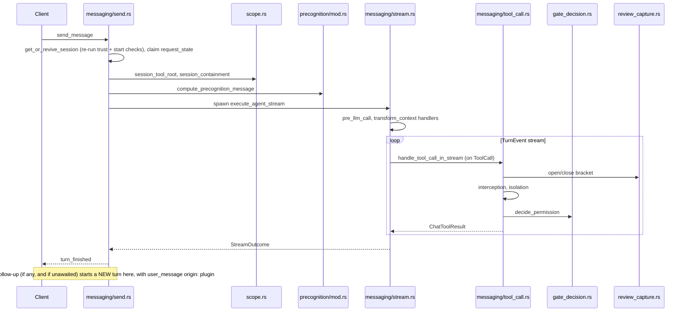

# Agent Manager

`crates/crucible-daemon/src/agent_manager/` is the daemon's agent-lifecycle
hub. It owns `AgentManager`, the per-daemon object that holds every session's
cached agent handle, tool dispatcher, plugin bindings, permission and
interaction registries, review ledgers, proposal store, and workspace
snapshots; it also drives the turn loop that turns one `send_message` call
into a gated, attributed, observable exchange with an LLM or an ACP agent,
and ends that turn with one terminal `turn_finished` event.

## Purpose and ownership

Per [[Meta/CONTEXT]] and `AGENTS.md`, `crucible-daemon` owns "Sessions,
admission, tools, storage, retrieval, review, plugin lifecycle." The Agent
Manager subsystem is where that ownership is exercised for a single turn:

- It owns turn setup and teardown (session revival, agent-handle build and
  cache, conversation-tree commit, spawn/cancel), the gate pipeline a tool
  call passes through (plan-mode bar, active-tool narrowing, card policy,
  review-capture bracket, plugin interception, isolation, one unified
  permission decision), and per-session state (`SessionSlot`).
- It must not own note storage, the SQLite link index, or embedding
  retrieval — those stay with `crucible-core`'s parser and `crucible-daemon`'s
  knowledge-storage modules; Agent Manager only calls into them (kiln search,
  containment roots).
- It must not run session-local Lua VMs: "The daemon owns one shared plugin
  VM; session-local state lives in scopes and `SessionSlot`, not per-session
  VMs" (`AGENTS.md`). `crates/crucible-daemon/src/agent_manager/vm_pass.rs`
  is the one mechanism every turn-loop stage uses to run closures against
  that shared VM, through the one `PluginHandlers` pair.
- It is one of the four places `AGENTS.md` names for the scope/admission
  boundary (`crates/crucible-daemon/src/agent_manager/scope.rs`), and it is
  where turn lifecycle is owned (`crates/crucible-daemon/src/agent_manager/messaging/`):
  "Injected context is not a user turn; preserve its role and provenance
  through live input, replay, undo and fork." A turn now ends explicitly with
  one `turn_finished` event; a `turn:complete` handler that wants more work
  starts a brand-new turn, carrying `TurnOrigin::Plugin`, rather than
  re-entering the one that just ended.

This matches the AGENTS.md line "Multi-client state (model, mode, context
budget) belongs to the session... Session-scoped runtime state belongs in
`SessionSlot`": every field that is per-session lives on `SessionSlot`
(`crates/crucible-daemon/src/agent_manager/slot.rs`), and `crates/crucible-daemon/src/agent_manager/residue.rs`
compiles a check that a new `AgentManager` field cannot silently escape that
rule.

## Module map

Grouped by directory. Lines are as of `582c5e6c1`.

### `crates/crucible-daemon/src/agent_manager/` (hub and knob files)

| Path | Lines | Role |
|---|---|---|
| `crates/crucible-daemon/src/agent_manager/mod.rs` | 1793 | Defines `AgentManager`, `AgentError` (including `SessionRefused`), `TurnStatus`/`TurnOutcome`/`StreamOutcome`, `StreamContext`, `TurnSlotHold`, the `RequestSlotGuard`/`RequestState` mutual exclusion, session-slot access, tool-dispatcher build (`get_or_create_session_dispatcher`), and `cleanup_session`. Declares every submodule below, including `handle`, and re-exports `AgentHandle`/`SessionKnobs` from it. |
| `crates/crucible-daemon/src/agent_manager/handle.rs` | 415 | Defines `SessionKnobs` (the session-scoped knobs every agent handle must answer: model, agent-advertised config options, context strategy, precognition, plugin approval, plugin turn limit) and `AgentHandle` (a supertrait of `crucible_core::turn::Agent`, adding mode, undo, an optional ACP session id, and cancel), plus the `impl_unsupported_session_knobs!` macro and the manually-forwarded `Box<dyn AgentHandle + Send + Sync>` impls of both traits. Only the daemon implements either trait — `AcpAgentHandle`, `GenaiAgentHandle`, and the daemon's own cached handle wrapper — since a client drives a session only through `DaemonClient` RPCs. |
| `crates/crucible-daemon/src/agent_manager/models.rs` | 1097 | Model/provider selection and switching, the one trust gate (`refuse_untrusted`), precognition/context-strategy/plugin-approval/plugin-turn-limit knobs, turn-history undo (refused for an ACP session via `undo_refusal`). |
| `crates/crucible-daemon/src/agent_manager/scope.rs` | 671 | Mid-session scope mutations (`connect_kiln`/`disconnect_kiln`, both persisting through `SessionManager::modify_session`) and `session_containment`, the allow/deny `RootSet` builder. One of AGENTS.md's four named admission/isolation files. |
| `crates/crucible-daemon/src/agent_manager/slot.rs` | 639 | Defines `SessionSlot`, the single per-session state holder, and its `TurnGate`/`FollowUpTurn`/`ClearAfterTurn` types. |
| `crates/crucible-daemon/src/agent_manager/providers.rs` | 503 | `session.list_providers`/`list_providers_summary` — builds `ProviderInfo` from configured and env-discovered providers. |
| `crates/crucible-daemon/src/agent_manager/attachments.rs` | 428 | Resolves `@file` mentions (optionally `@file:N`/`@file:N-M` line ranges) into inlined file contents under the session's tool root and its full containment `RootSet`; also extracts `@comment:<id>` review-comment ids (`comment_mentions`) for the send path to resolve. |
| `crates/crucible-daemon/src/agent_manager/context_length.rs` | 336 | Probes an OpenAI-compatible `/v1/models` or Ollama `/api/show` endpoint to discover a model's context window, with SSRF hardening (`redirect::Policy::none()`) — one of two SSRF checks the daemon now runs on a provider endpoint (see `session_config.rs::refuse_internal_endpoint` below for the other, broader one). |
| `crates/crucible-daemon/src/agent_manager/title.rs` | 294 | The daemon-side contract for session titling: fires once, persists, emits a typed `SettingsPayload::TitleChanged` through `&crate::EventBus`; delegates the "how" to a plugin via `registry.run_command_in(..., Some(session_id))`, which also backs the `/generate` slash command. |
| `crates/crucible-daemon/src/agent_manager/session_config.rs` | 270 | What a new or reconfigured session starts with: `fork_session` (refuses an ACP parent via `fork_refusal`), `start_hook_scope`/`commit_start_hook_scope`, `configure_agent` (isolation-unenforceable check, then the trust gate, then `refuse_internal_endpoint`'s SSRF check), `apply_session_defaults`. |
| `crates/crucible-daemon/src/agent_manager/residue.rs` | 183 | Compile-time-enforced leak detector for `cleanup_session`: an exhaustive per-field destructure of `AgentManager`, now taking `&crate::EventBus` and checking `proposals` for per-session residue. |
| `crates/crucible-daemon/src/agent_manager/stream_config.rs` | 147 | Defines `TurnEnvironment` and `AgentStreamConfig`, the frozen turn-start snapshot of a session's config (no longer carries `daemon_permissions` or `agent_type`, both retired with the deleted review gate). |
| `crates/crucible-daemon/src/agent_manager/session_permissions.rs` | 203 | Resolves the `[permissions]` rules for a session — outside a live turn (workflow validation gates) and as the engine a live turn's tool-call gate and a cached ACP handle's gate read (`session_permission_engine`, `SessionRules`); also decides a Lua Bases write (`bases_write_permission`) through the same unified gate, and the session's current write mode between turns (`write_mode_for`). |
| `crates/crucible-daemon/src/agent_manager/interaction.rs` | 134 | Daemon half of `cru.ui`'s non-permission client interactions (`request_interaction`/`respond_to_interaction`); `request_interaction` no longer takes a timeout — a pending interaction persists across a client detach/reattach and resolves only on answer or cancel. |
| `crates/crucible-daemon/src/agent_manager/status_items.rs` | 208 | The engine's own `plugin_turns` status item: one pinned, colored item per plugin whose turn runs now or whose `PluginApproval` is `Ask`/`Stop`, fed to both `session.status` and the `status_items_changed` event as the one `StatusDisplayItem` shape. |
| `crates/crucible-daemon/src/agent_manager/configured.rs` | 130 | Live config-store reads for chat-tuning knobs (`system_prompt`, `context_budget`, `precognition_results`, `autocompact_threshold`, `response_tail_chars`, `chat_endpoint`, `precognition_notify_no_kiln`). |
| `crates/crucible-daemon/src/agent_manager/cache_stats.rs` | 108 | Per-session prompt-cache hit/miss accounting (`CacheStats`) derived from provider `TokenUsage`. |
| `crates/crucible-daemon/src/agent_manager/tool_tracking.rs` | 107 | `ToolCallTracker` counts repeated identical tool calls (name + canonicalized args) to detect a stuck retry loop. |
| `crates/crucible-daemon/src/agent_manager/permissions.rs` | 98 | The pending-permission registry and routing a client's answer back to the waiting turn (paired with, but separate from, `interaction.rs`). |
| `crates/crucible-daemon/src/agent_manager/completion.rs` | 96 | Daemon half of `cru.session.complete` — a one-shot, tool-less, history-less LLM exchange for Lua plugins; resolves the provider API key the same way a streamed turn does (`configured_api_key`, one of the sources `resolve_provider_api_key` folds together). |
| `crates/crucible-daemon/src/agent_manager/tool_safety.rs` | 96 | `is_safe`/`believed_read_only` — the single default-deny policy for which tools bypass the permission gate. |
| `crates/crucible-daemon/src/agent_manager/autocompact.rs` | 79 | Pure decision function, `should_autocompact`, for whether a turn should trigger auto-compaction. |
| `crates/crucible-daemon/src/agent_manager/precognition_gate.rs` | 54 | Pure per-turn decision of whether Precognition runs at all; no longer checks for a kiln — a kiln-less session still runs Precognition so it can send its one-shot notice. |
| `crates/crucible-daemon/src/agent_manager/vm_pass.rs` | 55 | `run_handlers` — the one generic mechanism every turn-loop stage uses to run a closure against the shared daemon Lua VM; defines the single `PluginHandlers` type alias (the former, separately-bound `DaemonPermissions` alias is gone). |
| `crates/crucible-daemon/src/agent_manager/iter.rs` | 45 | Enumerates chat-capable LLM providers filtered by an optional trust classification; shared by `models.rs` and `providers.rs`. |

### `crates/crucible-daemon/src/agent_manager/messaging/` (the turn pipeline)

| Path | Lines | Role |
|---|---|---|
| `crates/crucible-daemon/src/agent_manager/messaging/permission.rs` | 2134 | The ACP session permission gate (`AcpPermissions`/`AcpGate::decide`/`decide_crucible_call`), the shared unbounded-wait prompt primitive (`prompt_user`, `OpenPrompt`), pattern-store read/write keyed on `CanonicalToolCall`, Lua permission hooks, `pre_llm_call`/`transform_context` handler chains. The internal-agent gate itself now lives in `gate_decision.rs`'s `decide_permission`, shared with this file. |
| `crates/crucible-daemon/src/agent_manager/messaging/stream.rs` | 1000 | The agent-turn driver: drives `Agent::turn()`'s event stream, emits session events, delegates tool-call dispatch (both a Crucible dispatch and an ACP agent's self-executed calls, through the same render/bracket/announce/finish functions), and stores a `turn:complete` handler's follow-up request on the session slot for `send.rs` to start as a new turn. There is no in-turn continuation. |
| `crates/crucible-daemon/src/agent_manager/messaging/send.rs` | 1479 | `AgentManager::send_message`/`send_plugin_message`/`send_relayed_message`/`send_message_with_context`/`send_message_notified`/`send_message_inner` (all built from one `TurnRequest`) — turn a user, plugin, relay or context-carrying message into a running turn; also owns `clear_session`'s atomic clear-then-turn and `start_follow_up_turn`, which starts a `turn:complete` handler's follow-up as a brand-new turn. |
| `crates/crucible-daemon/src/agent_manager/messaging/tool_call.rs` | 891 | `handle_tool_call_in_stream` — the full per-tool-call gate pipeline: policy refusals, review-capture bracket, plugin interception, isolation gate, the one `gate_decision::decide_permission` gate, `tool:render`, dispatch, spill, emit. Always returns a result — the dead ACP fallback path is gone. |
| `crates/crucible-daemon/src/agent_manager/messaging/review_capture.rs` | 251 | Opens/closes the review-ledger capture bracket around a tool call, and now also around a daemon write made outside any tool call (`attribute_write`, e.g. a Bases write from a Lua hook); a task-local (`within_tool_call`/`CURRENT_CALL`) lets a nested daemon write find its call's open bracket and reuse its permission grant (`call_allowed_in`/`mark_call_allowed`) instead of opening a second, contested bracket or re-prompting the user. |
| `crates/crucible-daemon/src/agent_manager/messaging/mod.rs` | 123 | Module wiring (`gate_decision` is now `pub(crate)`, reached from `tools_bridge.rs`), `AgentManager::cancel`, `format_tool_source`. No embedded tests. |
| `crates/crucible-daemon/src/agent_manager/messaging/gate_decision.rs` | 699 | The one tool-permission policy — `decide_permission`/`decide_nested`/`unattended_refusal`/`card_refusal` — folding card policy, the `[permissions]` engine, saved patterns, Lua permission hooks, the mode stance (narrowed by plugin-turn `PluginApproval`) and an unlimited-wait user prompt into one `Decision` (`Allow`/`UserAllowed`/`Deny`/`NoAnswer`), shared by the daemon's own tool path (`tool_call.rs`), the ACP permission handler (`permission.rs`), and unattended callers (`tools_bridge::unattended_refusal`). |
| `crates/crucible-daemon/src/agent_manager/messaging/tool_hooks.rs` | 201 | `tool:render` resolution (`lua_render`/`render_call`, `StreamContext::rendered_call`) — replacing the deleted `tool:display_start`/`tool:display_complete` hooks — the `tool_result` chained-patch seam (`apply_tool_result_handlers`), `tool:before_execute` env resolution. |
| `crates/crucible-daemon/src/agent_manager/messaging/tool_call/tests.rs` | 164 | Unit tests for `tool_call.rs`'s gate order and `invoke_tool` unwrapping. |
| `crates/crucible-daemon/src/agent_manager/messaging/isolation_gate.rs` | 79 | `isolation_refusal` — default-deny refusal builder for a session a plugin claimed isolation over. |

### `crates/crucible-daemon/src/agent_manager/precognition/` (retrieval-augmentation)

| Path | Lines | Role |
|---|---|---|
| `crates/crucible-daemon/src/agent_manager/precognition/mod.rs` | 791 | Implements the Precognition pipeline: check for a kiln first (sending a one-shot per-workspace notice and injecting nothing if there is none), else embed the turn, search kilns, let Lua reshape selection/formatting, produce the injected system `ContextMessage`, and report a kiln-open or search failure as one `NotificationHub` warning each. |
| `crates/crucible-daemon/src/agent_manager/precognition/tests.rs` | 993 | Unit/integration tests for the default formatter, char-cap backstop, and the `precognition_format`/`precognition_select` Lua seams. |

### `crates/crucible-daemon/src/agent_manager/tests/` (integration suite)

| Path | Lines | Role |
|---|---|---|
| `crates/crucible-daemon/src/agent_manager/tests/mod.rs` | 1101 | Shared harness: mock agents, `ReactorTestHarness` (now holding `Arc<AgentManager>` and a `crate::EventBus`), session/manager setup helpers, mock HTTP servers, `configure_provider_endpoint`, `bind_test_hub`. |
| `crates/crucible-daemon/src/agent_manager/tests/permissions.rs` | 1553 | Tool classification, resource-description extraction, pattern matching (keyed on `CanonicalToolCall`), permission channel lifecycle with no timeout, reply routing, and (new top module) `the_tool_gate_in_a_turn`, which drives the real turn loop end to end against `gate_decision::decide_permission` and pins the `auto_approved` marker on the `tool_call` event. |
| `crates/crucible-daemon/src/agent_manager/tests/reactor.rs` | 1377 | Plugin handler dispatch: `cru.on()` firing, gate ordering pinned against the hook loop, handler-budget timeouts, interception grants, `tool:render` re-rendering a handler-rewritten write's diff. |
| `crates/crucible-daemon/src/agent_manager/tests/messaging.rs` | 1379 | Turn events, ACP delegation pass-through, undo/snapshots, session resumption, context attachment, `@mention` (including line-range) attachment, unknown-tool dispatcher error shape, the ACP gate's own-reason denial surfacing (`note_denial`/`take_denial`). |
| `crates/crucible-daemon/src/agent_manager/tests/init_lua_defaults.rs` | 1330 | Behavior of `defaults/init.luau` against the real daemon VM: permission hooks keyed on `CanonicalToolCall`, modes (including `propose`), the `tool:render` chain and its Rust fallback, ACP mode-stance neutrality. |
| `crates/crucible-daemon/src/agent_manager/tests/dispatch.rs` | 863 | `dispatch_turn_complete_handlers`: handler registration, event delivery, returning a `FollowUpTurn` (content + owning plugin), cross-VM ordering; no re-prompt/continuation-depth surface any more. |
| `crates/crucible-daemon/src/agent_manager/tests/models_discovery.rs` | 891 | Dynamic model discovery (OpenAI, ZAI, OpenRouter, Ollama), fallback on failure, model-cache behavior, provider-keyed credential lookup. |
| `crates/crucible-daemon/src/agent_manager/tests/precognition.rs` | 1088 | Precognition enable/disable, first-message gate, content injection, drop-protection, history detection, and the no-kiln/failed-embedding/kiln-open-failure notifications. |
| `crates/crucible-daemon/src/agent_manager/tests/transcript_containment.rs` | 823 | Containment enforcement: kiln vs. sessions-root, workspace vs. note tools, re-attack probes. |
| `crates/crucible-daemon/src/agent_manager/tests/revive_isolation.rs` | 905 | Every door that revives a stored/paused session (send, Lua `resume`, Lua `eval`, plugin `create`, a history read) re-runs the plugin session-start checks so an isolation claim is reclaimed or the session is refused; defines the shared `Daemon` test rig and sandbox-plugin fixtures other files in this directory reuse. |
| `crates/crucible-daemon/src/agent_manager/tests/turn_finished.rs` | 715 | Pins the turn-ends/`turn_finished` refactor end to end: `TurnStatus`, plugin-turn provenance (`TurnOrigin`), plugin-turn-limit escalation, `cru.session.clear` semantics, an awaited turn starting no follow-up. |
| `crates/crucible-daemon/src/agent_manager/tests/session_stop.rs` | 673 | Every stop door (RPC archive/delete/end/pause, the auto-archive sweep, Lua end/pause) runs the same ordered teardown through one owner (`SessionLifecycle::stop`); a pause keeps the context attachment while every other stop releases it, and a mid-turn pause must not let the turn's remaining tool calls run unsandboxed. |
| `crates/crucible-daemon/src/agent_manager/tests/concurrency.rs` | 638 | Concurrent-request rejection, cancel wind-down, scope-mutation vs. request-slot guard, slot-sharing atomicity, `workflow.cancel` interrupting a running or between-steps step turn. |
| `crates/crucible-daemon/src/agent_manager/tests/review_comment_context.rs` | 413 | A chat message's attached/`@comment:`-mentioned review comments reach the agent as one tagged `<system-message kind="review-comment">` injection (author-named `source`), refuse an unknown or resolved comment id, and survive replay and fork; an ACP turn keeps the tag beside a separate `@file`-attachment injection. |
| `crates/crucible-daemon/src/agent_manager/tests/parity_capture.rs` | 393 | Pins internal vs. delegated (ACP) event sequences against committed JSONL fixtures, now loading the real shipped Lua defaults and waiting on `turn_finished` as the terminal event. |
| `crates/crucible-daemon/src/agent_manager/tests/trust_gate.rs` | 371 | Attach-time trust invariant across create, `configure_agent`, `switch_model`, unresolvable kiln names, and a kiln that only the session workspace's `project.toml` classifies. |
| `crates/crucible-daemon/src/agent_manager/tests/lifecycle.rs` | 303 | Configure agent, switch model, cancel, notifications (now through `NotificationHub`/`notify`), broadcast events (`EventBus::emit` returning `bool`). |
| `crates/crucible-daemon/src/agent_manager/tests/agent_tool_chain.rs` | 301 | An agent that owns its tool calls (ACP) leaves the same conversation-tree shape as a Crucible tool call, runs the same `tool:render`/loop-guard/review-bracket steps, and gets a structured result and its gate-refusal reason attributed correctly. |
| `crates/crucible-daemon/src/agent_manager/tests/revive_cold.rs` | 299 | Cold revival from a persisted session id after restart; trust-gate re-run on revival; its `manager_over`/`cold_manager` helpers are now shared `pub(super)` infrastructure for `revive_isolation.rs`. |
| `crates/crucible-daemon/src/agent_manager/tests/title.rs` | 294 | Session titling seam: plugin publication, opening-exchange shape, fallback to truncation, nil handling, `/generate` session targeting. |
| `crates/crucible-daemon/src/agent_manager/tests/build_race.rs` | 247 | Regression: a `switch_model` landing mid-build must not be overwritten by the stale build (`generation` check); its `GatedStorage` fixture is now `pub(super)`, reused by `lost_update.rs`. |
| `crates/crucible-daemon/src/agent_manager/tests/workspace.rs` | 261 | Split between workspace tools (`session.workspace`) and kiln-backed note tools (`session.kiln`). |
| `crates/crucible-daemon/src/agent_manager/tests/lost_update.rs` | 212 | Regression coverage for the session-persistence lost-update bug: seven writers (`persist_variables`, `configure_agent`, `connect_kiln`, `switch_model`, `set_mode`, `set_precognition`, `record_discovered_context_window`, `persist_acp_session_id`) now go through `SessionManager::modify_session` (closure-based read-modify-write) instead of a read-copy-then-save-whole-record pattern, proven by deterministically parking a concurrent `set_title` in the gap. |
| `crates/crucible-daemon/src/agent_manager/tests/context_injection.rs` | 212 | `cru.session.inject()` lifecycle: one-shot delivery, survives rebuild, ACP rejection, and the `<system-message kind="..." source="...">` tagging that survives replay. |
| `crates/crucible-daemon/src/agent_manager/tests/status_items.rs` | 222 | The engine's own `plugin_turns` status item, driven by the session's `PluginApproval` knob and whether a plugin turn is running now, not by any plugin publication; `session.status` and `status_items_changed` carry the identical `StatusDisplayItem` list. |
| `crates/crucible-daemon/src/agent_manager/tests/fork.rs` | 344 | Session forking via Lua and RPC: scope inheritance, selected history, unreadable-history refusal, ACP-parent refusal, isolation-record inheritance, plugin-turn role/provenance preservation through a fork. |
| `crates/crucible-daemon/src/agent_manager/tests/provider_credentials.rs` | 272 | Provider API-key resolution order (backend env var, provider-keyed credential store, `llm.providers.<key>.api_key`), a keyless turn refused before it reaches the provider, and a one-line failed-turn error carrying the provider's HTTP status and body, through both the streamed turn and `complete_once`. |
| `crates/crucible-daemon/src/agent_manager/tests/init_lua.rs` | 191 | `on_session_start` hook visibility of isolation/workspace; variable persistence across resume. |
| `crates/crucible-daemon/src/agent_manager/tests/learning_loop.rs` | 186 | End-to-end: notes written in one session are indexed and reach a new session's precognition, with kiln isolation. |
| `crates/crucible-daemon/src/agent_manager/tests/acp_undo.rs` | 177 | `AgentManager::undo`/`can_undo`/`undo_depth`/`undo_history` refuse or report empty for an ACP session at three entry points (the manager, the RPC handler, `cru.session.undo`), and confirm undo still works for an internal agent. |
| `crates/crucible-daemon/src/agent_manager/tests/review_capture.rs` | 204 | Bracket timing, overlapping-bracket contest, delegated-child ledger harvest; the review-*gate* regression this file used to pin against was deleted along with the gate itself. |
| `crates/crucible-daemon/src/agent_manager/tests/providers_concurrency.rs` | 130 | Provider probing runs concurrently, not serially. |
| `crates/crucible-daemon/src/agent_manager/tests/active_tools.rs` | 102 | `cru.tools.set_active` narrowing reaches the real provider request. |
| `crates/crucible-daemon/src/agent_manager/tests/bases_attribution.rs` | 101 | A plugin tool's Bases write joins the ambient review-capture bracket of the tool call that ran it, rather than opening a second, contested bracket. |
| `crates/crucible-daemon/src/agent_manager/tests/propose_turn.rs` | 121 | A `propose`-mode turn's note-tool call is recorded in `AgentManager::proposals()` and never reaches disk; the proposal is scoped to the turn and ends with it. |
| `crates/crucible-daemon/src/agent_manager/tests/notifications.rs` | 76 | `cru.log.notify` crossing from Lua into the daemon's `NotificationHub`. |
| `crates/crucible-daemon/src/agent_manager/tests/two_sessions.rs` | 57 | Session-scoped handlers fire for their session only; cleanup drops only their own rows. |

### `crates/crucible-daemon/src/agent_manager/tests/models/` (model/mode knob tests)

| Path | Lines | Role |
|---|---|---|
| `crates/crucible-daemon/src/agent_manager/tests/models/list.rs` | 737 | `list_models` across every `BackendType`, config source, trust filter, and discovery-failure fallback. |
| `crates/crucible-daemon/src/agent_manager/tests/models/mode_regression.rs` | 309 | Concurrency regressions for `set_mode`: no deadlock on recursive RPC, no block on a busy handle, pending-mode draining. |
| `crates/crucible-daemon/src/agent_manager/tests/models/switch.rs` | 290 | `switch_model`'s write path: persisted field updates and cache invalidation on cross-provider switch. |
| `crates/crucible-daemon/src/agent_manager/tests/models/acp_knob_reads.rs` | 303 | Model listing, live session modes (`ModeDescriptor`, not bare ids), plugin-approval/plugin-turn-limit knob reads/writes, all bringing an ACP handle up lazily. |
| `crates/crucible-daemon/src/agent_manager/tests/models/parse.rs` | 219 | `parse_provider_model`'s `"provider/model"` splitting rules. |
| `crates/crucible-daemon/src/agent_manager/tests/models/mode.rs` | 179 | Baseline `set_mode`: persistence, live-handle application, validation, event emission. |
| `crates/crucible-daemon/src/agent_manager/tests/models/resolve_provider.rs` | 133 | `resolve_provider_config` across `LlmConfig` vs. legacy `providers` config. |
| `crates/crucible-daemon/src/agent_manager/tests/models/openai_compatible.rs` | 110 | OpenAI-compatible model-listing parser and HTTP client. |
| `crates/crucible-daemon/src/agent_manager/tests/models/approval.rs` | 58 | `set_plugin_approval`/`get_plugin_approval`/`list_plugin_approvals` and `set_plugin_turn_limit` are session-owned and survive agent-handle eviction. |
| `crates/crucible-daemon/src/agent_manager/tests/models/mod.rs` | 9 | Module declarations only. |

## Key types and traits

- **`AgentManager`** (`crates/crucible-daemon/src/agent_manager/mod.rs`) — the
  central per-daemon object. Fields include: `request_state` (in-flight-turn
  guards), `slots: Arc<DashMap<String, Arc<SessionSlot>>>`, `modes`,
  `model_cache`, `kiln_manager`, `session_manager`, `background_manager`,
  `delegation_service`, `mcp_gateway`, `source_roots:
  crate::runtime_path::SourceRoots` (renamed from `card_roots:
  CardRoots` — it now also feeds skill and theme discovery), `llm_config`,
  `acp_config`, `context_config`, `permission_config`, `plugin_loader`,
  `review: Arc<ReviewLedgers>`, `proposals: Arc<crate::proposals::ProposalStore>`
  (note writes that wait for the user; the note tools record into it and the
  `proposal.*` RPCs read it), `no_kiln_noticed` (dedupes the Precognition
  no-kiln notice by workspace), and a set of `OnceLock` daemon-global
  bindings (`plugin_handlers`, `isolation`, `plugin_tool_registry`,
  `publications`, `status`, `notifications`, `external_watch`,
  `agent_factory_override`) bound once at daemon startup. The former
  `daemon_permissions: OnceLock<DaemonPermissions>` field is gone —
  `plugin_handlers` alone now serves the turn loop, the tool gate and the
  ACP gate. Created by `AgentManager::new`/`new_with_delegation` from an
  `AgentManagerParams`, held by nearly every RPC handler, the plugin
  bridges, and the stream loop.
- **`SessionSlot`** (`crates/crucible-daemon/src/agent_manager/slot.rs`) —
  the single per-session state holder the `slots` map keys by session id.
  Fields: `build: Mutex<BuildCache>` (cached agent handle + tool dispatcher +
  a `generation` counter), `tree: OnceCell<Arc<tokio::sync::Mutex<ConversationTree>>>`,
  `input: tokio::sync::Mutex<SessionInput>` (its `accept` method is the one
  path both `cru.session.inject()` and an attached review-comment/`@`-mention
  attachment go through to log and queue context), `overrides`, `variables`,
  `pending_mode`, `write_mode: TurnWriteMode` (the propose/apply write mode
  the note tools of a running turn read), `follow_up: Mutex<Option<FollowUpTurn>>`
  (what a `turn:complete` handler asked to run as the next turn),
  `turn_gate: Mutex<Option<TurnGate>>` (how the running turn may decide a
  permission, read fresh on every ACP call rather than frozen with the
  handle), `denials: Mutex<HashMap<String, String>>` (the gate's own refusal
  reason for an ACP call, by `toolCallId`, so a client sees it instead of the
  agent's own rejection text), `session_grants: Mutex<PatternStore>`
  ("allow for this session" grants, live only as long as the slot),
  `clear_after_turn: Mutex<Option<ClearAfterTurn>>`, `plugin_turn_count:
  AtomicU32` (consecutive accepted plugin turns since the last accepted user
  turn), `permissions: Mutex<HashMap<PermissionId, PendingPermission>>`,
  `prompt_lock: tokio::sync::Mutex<()>` (held across one permission prompt,
  replacing the deleted `PermissionSerializer`), `interactions:
  Mutex<HashMap<PermissionId, PendingInteraction>>`, `cache_stats`. Each
  field is its own lock so contention on one never blocks a read of another.
  Created lazily by `AgentManager::slot`, held for the duration a turn or
  scope mutation needs it, removed wholesale by `cleanup_session`.
- **`AgentHandle` / `SessionKnobs` / `BoxedAgentHandle`** (`handle.rs`) — the
  runtime contract every live agent answers inside the daemon.
  `SessionKnobs` is the closed set of session-scoped knobs (model, agent
  config options, context strategy, precognition, plugin approval, plugin
  turn limit); `AgentHandle` adds mode, undo, an optional ACP session id and
  cancel on top of `crucible_core::turn::Agent`'s `turn`/`switch_model`.
  `BoxedAgentHandle` (`mod.rs`) is `Box<dyn AgentHandle + Send + Sync>`, the
  type `SessionSlot.build`'s `BuildCache` actually stores; `AcpAgentHandle`
  (`crates/crucible-daemon/src/acp_handle.rs`) and `GenaiAgentHandle`
  (`crates/crucible-daemon/src/provider/genai_handle.rs`) are its two
  implementors. Neither trait has a client-side implementor: a client (the
  CLI's `LiveSession`, the web client) drives a session only through
  `DaemonClient` RPCs, never through a handle of its own — see [[RPC
  Client]].
- **`TurnGate` / `FollowUpTurn` / `ClearAfterTurn`** (`slot.rs`) — `TurnGate`
  is `{ is_interactive, permission_override, origin: TurnOrigin }`, written
  at turn start and read per-call by the ACP permission handler so a later,
  differently-interactive turn on the same cached handle is decided
  correctly with no rebuild. `FollowUpTurn` is `{ content, plugin }`, the
  content and owning plugin of a `turn:complete` handler's requested next
  turn. `ClearAfterTurn` is `{ prompt, gate }`, a `cru.session.clear` deferred
  until the current turn ends.
- **`TurnRequest<'a>`** (`messaging/send.rs`) — groups every turn entry
  point's arguments (`origin: TurnOrigin`, `clear_before`, `review_context:
  Option<ReviewContext>`, `event_tx: &EventBus`, `is_interactive`,
  `permission_override`, `completion_tx: Option<oneshot::Sender<TurnOutcome>>`)
  into one struct so a new field needs no new argument on every caller
  (`send_message`, `send_plugin_message`, `send_relayed_message`,
  `send_message_with_context`, `send_message_notified`, and the internal
  `start_follow_up_turn` all build one and call `send_message_inner`).
- **`StreamContext`** (private, `mod.rs`) — the per-turn bundle threaded
  through the stream loop: session id, message id, `event_tx:
  crate::EventBus`, workspace/session directories, `AgentStreamConfig`,
  `tool_dispatcher`, permission override, the conversation tree, the
  `SessionSlot`, `session_mode`, `origin: TurnOrigin` (who asked for this
  turn; the render function of a tool call reads it), `is_interactive`,
  `permission_engine: Arc<PermissionEngine>` (unconditional — the engine
  always exists, agent-profile or global), `attachment_messages:
  Vec<ContextMessage>` (the turn's own injections — an ACP review-comment
  block and the `@file` attachment are now two elements, not one merged
  message), `context_attach` registry. Built once per turn by
  `messaging/send.rs::send_message_inner`.
- **`AgentStreamConfig` / `TurnEnvironment`** (`crates/crucible-daemon/src/agent_manager/stream_config.rs`) —
  freeze a turn's inputs at turn start: model, context budget, autocompact
  threshold, tool policy, plugin handlers, isolation, mode registry, review
  ledgers, active-tool sets. No longer carries `daemon_permissions` or
  `agent_type` — both were review-gate-only fields, retired with the gate.
  Built by `AgentStreamConfig::from_session_agent` in `messaging/send.rs` so
  a plugin load or mode change mid-turn cannot reshape a turn already
  running. `active_tools` is deliberately not snapshotted, because a plugin
  narrowing the set mid-turn must take effect on the next tool call.
- **`AgentError`** (`mod.rs`) — `thiserror` enum: `SessionNotFound`,
  `InvalidSessionId`, `NoAgentConfigured`, `ConcurrentRequest`,
  `InvalidModelId`, `PermissionNotFound`, `Session(#[from] SessionError)`,
  `Factory(#[from] AgentFactoryError)`, `InvalidConfig`, `NotSupported`,
  `WorkspaceFixed`, `Chat(#[from] ChatError)`, `SessionRefused` (a revived
  session's start checks — an isolation claim, a plugin start hook — could
  not be satisfied; the session is not live).
- **`TurnStatus`** (`crucible_core::turn`, re-exported from `mod.rs`) —
  `Completed`/`Cancelled`/`HandlerCancelled`/`TimedOut`/`Failed`, carried on
  the one `turn_finished` event every turn emits when it ends — including a
  successful one; a client ends a turn on this event, not on
  `message_complete`. **`TurnOutcome`** (`mod.rs`) is the completion signal
  delivered through the completion channel to a caller (delegation) that
  must await a turn rather than watch the event stream. **`StreamOutcome`**
  (private, `mod.rs`) is `execute_agent_stream`'s internal result:
  `Completed(Option<StopReason>)`, `HandlerCancelled(String)`, `Failed(String)`.
- **`RequestSlotGuard` / `RequestState` / `TurnSlotHold`** (`mod.rs`) — RAII
  mutual exclusion over a session's `request_state` `DashMap` entry, shared
  by `messaging/send.rs::send_message` and `scope.rs::mutate_scope` so a send
  and a scope mutation exclude each other in both directions. `TurnSlotHold`
  is a second RAII type a session stop holds across releasing an isolation
  claim, so no turn can start between the check and the release.
- **`PendingPermission` / `PendingInteraction`** — `PendingPermission` is
  defined in `crates/crucible-daemon/src/agent_manager/mod.rs`, routed by
  `crates/crucible-daemon/src/agent_manager/permissions.rs`;
  `PendingInteraction` is defined in and routed by
  `crates/crucible-daemon/src/agent_manager/interaction.rs`. Each holds a
  request plus a `oneshot::Sender` for the response, stored on `SessionSlot`.
  Neither has a timeout any more: an unanswered permission or interaction
  waits until a person answers it or the turn is cancelled/the sender drops.
- **`CanonicalToolCall`** (`crucible_core::types`, exercised throughout this
  subsystem's tests) — the open-kind, cross-agent tool-call type that
  replaced the closed `ToolDisplay`/`ToolDisplayKind` enum: typed
  `command`/`paths`/`kind`/`agent`/`raw`/`render`/`diffs` fields. Built for a
  daemon tool via `CanonicalToolCall::crucible_tool(name, args)` and for an
  ACP wire frame via `classify_acp`, joining a `session/request_permission`
  frame to the earlier `tool_call` frame that announced the same id. Every
  permission decision, pattern match, and render in this subsystem is keyed
  on this type, not on a bare tool name plus JSON args.
- **`PermissionContext<'a>` / `Prompt<'a>` / `Decision`** (`messaging/gate_decision.rs`) —
  `PermissionContext` is everything one decision needs (session id, card
  `tool_policy`, `[permissions]` `engine`, `permission_override`, plugin +
  `PluginApproval`, saved patterns, session `slot`, Lua `hooks`, mode +
  `ModeRegistry`, MCP read-only set, an optional `Prompt`). `Prompt` is
  `{ slot, event_tx }`; `None` means nobody can be asked. `Decision` is
  `Allow(Option<String>)` | `UserAllowed` | `Deny(String)` | `NoAnswer` — a
  cancelled/unanswered prompt (`NoAnswer`) is distinct from a real denial.
- **`AcpPermissions` / `AcpGate`** (`messaging/permission.rs`) —
  `AcpPermissions::handler()` answers an ACP agent's own
  `session/request_permission`; `AcpPermissions::mcp_gate()` gates a Crucible
  tool call the same agent makes through the in-process MCP server;
  `mcp_server_decides()` records that the MCP gate is active so `handler()`
  does not double-prompt the same call. `AcpGate` (private) holds the
  session slot, id, event bus, workspace, whitelists dir, plugin hooks,
  `SessionRules` (reads the session's live `[permissions]` engine at each
  call, not once at handle-build time), and a "no modes" `ModeRegistry` — an
  ACP session takes no Crucible mode stance.
- **`SessionRules`** (`session_permissions.rs`) — `{ session_manager,
  acp_config, permission_config }` with `engine(session_id) ->
  PermissionEngine`; the ACP gate's one source of a per-call-fresh
  `[permissions]` engine, since the gate lives as long as its cached agent
  handle but the session's rules can change under it.
- **`prompt_user` / `OpenPrompt`** (`messaging/permission.rs`) — the one
  shared prompt primitive both the ACP and internal permission paths call
  through `gate_decision::Prompt`. Holds `SessionSlot::prompt_lock()` across
  the whole wait (one prompt per session at a time, replacing the deleted
  `PermissionSerializer`), registers the permission, emits
  `interaction_requested`, awaits with no timeout, and returns `None` on
  cancel/drop. `OpenPrompt`'s `Drop` removes an unanswered prompt from the
  session and emits `interaction_completed(..., Cancelled)` on drop so no
  client keeps showing a prompt nobody is waiting on.
- **`CaptureHandle`** (`crate::review::CaptureHandle`, opened/closed by
  `crates/crucible-daemon/src/agent_manager/messaging/review_capture.rs`) —
  the attribution bracket around one tool call's edits, now also opened by
  `attribute_write` for a daemon write with no enclosing tool call.
- **`LoopGuard`** (private, `messaging/stream.rs`) — `{ last_failure,
  failures, blocked: HashSet<String> }`; the three-strikes tool-blocking
  state applies the same way to a dispatched Crucible tool call and to a call
  an ACP-style agent runs itself (a blocked ACP call ends the turn with
  `StreamOutcome::HandlerCancelled`, since it already ran before the guard
  can refuse it), though the dedup key differs by path. For a call an
  ACP-style agent runs itself, the key also folds in the call's raw `title`
  and `locations`, through `guard_key` in
  `crates/crucible-daemon/src/agent_manager/messaging/stream.rs`. An agent
  that sends no tool name — Gemini, for example — puts the command only in
  the title, so the title and the locations are what tell its calls apart. A
  dispatched Crucible tool call keys on the name plus the canonicalized args
  alone.
- **`ToolCallTracker`** (`crates/crucible-daemon/src/agent_manager/tool_tracking.rs`) —
  per-turn map of `(name, canonicalized args) -> attempt count`, held inside
  the stream loop.
- **`PluginHandlers`** (`crates/crucible-daemon/src/agent_manager/vm_pass.rs`) —
  `(Arc<LuaScriptHandlerRegistry>, Arc<Lua>)`, the one pair for the daemon
  VM's handler registry and its `Lua`; it now serves the turn loop, the tool
  gate and the ACP gate alike. The former `DaemonPermissions` alias — a
  second, separately-bound name for the same pair — is gone, closing a hole
  where a setup that bound only one alias rendered the two paths
  differently.
- **`ProposalStore`** (`crate::proposals::ProposalStore`, held as
  `AgentManager.proposals`) — a per-session, per-turn ledger of note writes
  a `propose`-mode turn recorded instead of applying to disk: `has_turn`,
  `list`, `end_turn` (called on every exit path of a turn's spawned task, so
  the next turn starts a fresh proposal), `record_write`/`record_writes`.
- **`StatusDisplayItem` / `StatusItemKind` / `StatusColorGroup`**
  (`crucible_core`, produced by `status_items.rs`) — the one wire shape for
  both `session.status` and `status_items_changed`; the engine's own
  `plugin_turns` item is driven by `PluginApproval` and whether a plugin
  turn runs now, not by any plugin publication. `status_items.rs` builds
  each item's id from `PLUGIN_TURNS_ID_PREFIX` and marks it with
  `PLUGIN_APPROVAL_ACTION`; `refuse_engine_names` in
  `crates/crucible-lua/src/plugin_status.rs` checks a plugin's own
  `cru.plugin.set_status` and `cru.statusline.publish` calls against those
  same two constants, so a plugin cannot claim the engine's own status id or
  action for itself.

## Flows

### Sending a message

1. `send_message_inner` in `crates/crucible-daemon/src/agent_manager/messaging/send.rs`
   revives the session (`get_or_revive_session`, re-running the trust gate
   via `refuse_untrusted_on_revive`), which now also resumes a **Paused**
   session and re-runs the plugin session-start checks
   (`SessionLifecycle::enforce_session_start`) on every revive — refusing the
   send with `AgentError::SessionRefused` if a required isolation claim
   cannot be re-established — claims the session's `request_state` entry,
   resolves `session_tool_root` (`scope.rs`).
2. `get_or_create_agent` builds or reuses the cached agent handle, guarding
   against a race with `switch_model` via a `generation` counter on
   `SessionSlot::install_agent`. Building the client resolves the provider's
   API key (backend env var, provider-keyed credential store,
   `llm.providers.<key>.api_key`, Lua auth hooks, the Copilot exchange); with
   no key anywhere, the turn is refused at once, before any network request,
   naming the provider and the command that stores a key. For an ACP agent,
   once the handle is built, `get_or_create_agent` also reconciles the
   session's stored model against `agent.current_model()`. If they differ, it
   retries `switch_model` when the agent offers the stored model; otherwise
   it persists the agent's actual current model back onto the session
   record. This way, a `session/resume` that falls back to `session/new`
   never leaves the session displaying a model that nothing runs.
3. The conversation tree is rebuilt/fetched (`get_or_rebuild_session_tree`,
   in `mod.rs`, which first calls `session_manager.settle_history()` so the
   rebuild never runs ahead of the event journal) **before** the
   `user_message` event is emitted — this ordering is load-bearing for
   Precognition's first-message detection.
4. A pre-turn `WorkspaceSnapshot` is taken; the review ledger is opened or
   restored (`self.review.open_or_restore`) over the session's kilns and
   workspace, purely for attribution — there is no pre-write hold any more.
5. `precognition_gate::should_run_precognition` decides whether
   `compute_precognition_message` in `crates/crucible-daemon/src/agent_manager/precognition/mod.rs`
   runs (it no longer checks for a kiln); `attachments::build_attachment_message`
   resolves `@file`/`@file:N-M` mentions unconditionally, against the
   session's tool root and full containment `RootSet`, and
   `comment_mentions`/the `comments` param on `session.send_message` resolve
   any attached review comments into a separate injection. Each injection —
   Precognition, `@file` attachment, review comment — is pushed onto
   `attachment_messages` as its own `<system-message kind="..." source="...">`
   element, never merged into one.
6. `send_message_inner` builds `AgentStreamConfig`/`StreamContext`, snapshots
   the turn's write mode (`slot.write_mode().set(...)`) and `TurnGate`
   (`slot.set_turn_gate(...)`), and `tokio::spawn`s a task running
   `execute_agent_stream` in `crates/crucible-daemon/src/agent_manager/messaging/stream.rs`
   under a `tokio::select!` against a cancel channel.
7. On every exit path of that spawned task — normal completion, handler
   cancel, failure, or a `tokio::select!` cancel — the task ends the turn's
   proposal (`proposals.end_turn`), clears the `TurnGate`, sends the
   completion channel result if anyone awaits the turn, frees the
   `request_state` slot, and then emits the one **`turn_finished`** event
   (`status`, the last `stop_reason`, and any `error`) — after the slot is
   free, so a client that sends its next message on seeing this event is
   never told `ConcurrentRequest`. Only after that does it either run a
   deferred `clear_with_gate` or start a `turn:complete` handler's follow-up
   as a genuinely new turn (`start_follow_up_turn`, origin `TurnOrigin::Plugin`)
   — an awaited turn (a workflow step, a delegation) gets no follow-up, since
   the awaiting caller owns the session's next turn.

### Tool-call gate pipeline

`handle_tool_call_in_stream` in `crates/crucible-daemon/src/agent_manager/messaging/tool_call.rs`
runs a strictly ordered pipeline, each step documented against a named past
defect. There is no pre-write review-gate step; that mechanism was removed
along with the hunk listing (see "Boundaries and invariants" below).

1. Unwrap `invoke_tool` bridge calls (`unwrap_invoke_tool`).
2. Plan-mode plugin-tool bar (`tools/tool_modes.rs::plugin_tool_barred`).
3. `cru.tools.set_active` narrowing refusal.
4. Agent-card `ToolPolicy::Deny`, via `gate_decision::card_refusal` — above
   the hook loop, so a plugin cannot "handle" its way around a card's own
   denial.
5. Review-capture bracket opens (`review_capture.rs::open_review_bracket`),
   directly after the card-Deny refusal and before plugin interception —
   there is no gate wait before it.
6. `pre_tool_call` plugin interception, gated by `may_take_a_tool_call_over`
   (keyed on `LuaSource`'s trust root, not identity). A `Transform` result
   that rewrites the call's arguments causes its diffs to be recomputed from
   the rewritten arguments, so the permission prompt and the emitted event
   both show the diff of the call that actually runs.
7. Isolation default-deny (`isolation_gate.rs::isolation_refusal`).
8. Permission gate: one call to `gate_decision::decide_permission`, built
   from the call's rendered `CanonicalToolCall`, folding card policy, the
   `[permissions]` engine, saved patterns, Lua permission hooks, the mode
   stance (narrowed by plugin-turn `PluginApproval`) and interactivity into a
   `Decision`. `Decision::UserAllowed` re-baselines the review bracket;
   `Decision::Deny`/`NoAnswer` deny the call; an `Allow(marker)` carries the
   `auto_approved` reason (or `None`) forward onto the `tool_call` event.
   `review_capture::mark_call_allowed()` runs right below the gate, so a
   write nested in the call inherits its grant instead of re-prompting.
9. `tool:render` (`StreamContext::rendered_call`/`render_call`), dispatch
   with a timeout, `tool_result` patching, output spilling, a second
   `tool:render` pass over the finished outcome
   (`StreamContext::finish_tool_result`), event emission. The old
   `tool:display_start`/`tool:display_complete` hooks are gone; `tool:render`
   runs once before the gate (for the prompt/`tool_call` event) and once
   after dispatch (for the finished `tool_result` event).

An agent that owns its tool calls (ACP) runs a parallel path inside
`stream.rs` itself, sharing `render_call`, `open_review_bracket`/
`close_review_bracket`, `announce_tool_call`, `finish_tool_result` and the
same `LoopGuard` with the dispatched path above — it skips only what the
agent's own process already did: dispatch and output spill. Its own tool
calls do not pass through `tool_call.rs`'s isolation/permission gates,
because they already ran; the ACP permission handler (below) and the
in-process MCP gate are the enforcement points for that agent.

### One tool policy: ACP, internal, and unattended callers

`gate_decision::decide_permission` (`messaging/gate_decision.rs`) is the one
function every tool-call source calls into, each supplying its own
`PermissionContext` built from the same `CanonicalToolCall`:

- The daemon's own agents call it from `tool_call.rs`, above.
- An ACP agent's `session/request_permission` request reaches it through
  `AcpGate::decide` (`messaging/permission.rs`), and a Crucible tool the same
  agent calls through the in-process MCP server reaches it through
  `AcpGate::decide_crucible_call`. `AcpPermissions::mcp_server_decides()`
  keeps the two from double-prompting the same call.
- A Lua Bases write reaches it through
  `session_permissions.rs::bases_write_permission`, which prefers
  `decide_nested` (no re-prompt) when the write runs inside an
  already-allowed tool call's bracket (`review_capture::call_allowed_in`).
- An unattended caller (`cru.tools.call`, workflow validation) reaches the
  same chain with no card/patterns/hooks/mode/prompt, via
  `gate_decision::unattended_refusal` (`tools_bridge.rs`).

An ACP agent's tool identity is now the canonical call
(`crucible_core::types::classify_acp`), not a name collapsed from
`ToolKind`/title, so a card entry and an operator `[permissions]` rule reach
an ACP agent's own tools and its MCP-server tools by the same key a
Crucible tool uses. A grant that allows an ACP call always answers
`allow_once`, never `allow_always` — some agents cache `allow_always`
client-side and stop asking; Crucible keeps the remembered grant itself and
re-answers each later call. Symmetrically, a denial answers `reject_once`,
never `reject_always` — an agent that cached a stored deny rule the user
never chose would stop asking about the tool; with no `reject_once` option
the answer is `Cancelled`, the same fallback an unanswered prompt gets
(`select_option` in
`crates/crucible-daemon/src/agent_manager/messaging/permission.rs`). The
permission prompt itself
(`messaging/permission.rs::prompt_user`) has no timeout, shared with the
non-permission interaction prompt (`interaction.rs::request_interaction`):
both wait until a person answers or the turn is cancelled.

### Precognition

`compute_precognition_message` in `crates/crucible-daemon/src/agent_manager/precognition/mod.rs`
first checks for a kiln: with none, it sends a one-shot, per-workspace toast
notice (gated by the config key `chat.precognition_notify_no_kiln`, read via
`configured::precognition_notify_no_kiln`, and deduped by
`AgentManager.no_kiln_noticed`) and injects nothing. With a kiln, it embeds
the user's message, opens each session kiln (`collect_kiln_search_sources`,
which now also warns the user by name — through `AgentManager::notify` —
when a kiln fails to open), searches via `crate::multi_kiln_search` (which
now reports per-kiln search failures as a warning notification too, and a
total search failure as a second warning alongside its `emit_precognition_event`),
lets an optional `precognition_select` Lua handler narrow/reorder results,
enforces a hard character-budget cap regardless of what Lua did
(`apply_precognition_char_cap`), formats via `precognition_format` or the
default block (a bare body — the `<system-message>` envelope wraps it once,
in the shared injection constructor, not here), and returns a tagged
`ContextMessage::injection("precognition", "daemon", ...)` (`PRECOGNITION_TAG`)
that `transform_context` handlers may see and that
`crates/crucible-daemon/src/agent_manager/messaging/permission.rs` and
`crates/crucible-daemon/src/acp_handle/translate.rs` read back to detect a
dropped precognition message. Precognition connects into
[[Knowledge Storage and Retrieval]] through kiln search and embeddings, and
its result is one of potentially several tagged injections a turn carries
(see `attachment_messages` above).

### Model/provider switching

`switch_model` in `crates/crucible-daemon/src/agent_manager/models.rs` branches
on `agent_type == "acp"`: an ACP agent's live handle is reconfigured in
place (`session/set_config_option`) to preserve conversation history,
because evicting its cached `Arc` would SIGKILL the external process. A
non-ACP switch parses the `"provider/model"` prefix
(`parse_provider_model`), re-resolves the provider
(`resolve_provider_config`), re-runs the trust gate
(`refuse_untrusted_for_attached_kilns`, a thin wrapper over the one gate
below), and persists and invalidates the cached agent
(`SessionSlot::invalidate_agent`) through `modify_agent`, a closure-based
helper over `SessionManager::modify_session` — a live-entry mutation, not a
read-copy-then-save-the-whole-record — so a concurrent writer's own field
(e.g. a `set_title` landing in the same window) is never clobbered.
`build_race.rs` documents and reproduces the generation-counter race this
must survive; `lost_update.rs` documents and reproduces the lost-update race
`modify_session` fixes, across every session-config writer this subsystem
exposes (`configure_agent`, `connect_kiln`, `switch_model`, `set_mode`, the
per-knob setters, `record_discovered_context_window`,
`persist_acp_session_id`, `session_config::persist_variables`).

`AgentManager::refuse_untrusted(agent: Option<&SessionAgent>, kilns:
&[PathBuf], workspace: Option<&Path>)` is the one trust gate every
provider-affecting call now converges on — create, `configure_agent`,
`switch_model`, fork, revive, delegation and attach — replacing three
previously separate classification resolvers. `agent` is `Option` because a
session with no agent yet gets `Cloud`, the trust of an unknown provider
key; classification comes from `trust_resolution::resolve_session_classification`,
which also checks the session's own workspace `project.toml`, not only a
walk up from the kiln, so a kiln outside the workspace that only the
workspace's config classifies is caught too.

### Session start, stop and isolation reclaim

Every door that revives a stored or paused session — a send, Lua
`cru.session.resume`, Lua `eval` or a session hook, `cru.session.create` from
a plugin, an RPC resume — re-runs the plugin session-start checks
(`SessionLifecycle::enforce_session_start`, outside this page's file list),
because the isolation registry is memory-only: a daemon restart or a prior
pause's end hooks empty it, and only the start hooks claim it again. A door
that skips this would hand an ACP agent the host instead of its sandbox.
Symmetrically, every way a live session stops now runs through one owner,
`SessionLifecycle::stop`/`stop_from_lua`, which runs the end hooks, releases
the context attachment (except on a pause, which keeps it so a later resume
keeps its budget), changes session state, calls this subsystem's
`cleanup_session`, sweeps the handlers the session activated, and sends one
`session:ended` event naming the stop's cause. A pause is refused while a
turn is in flight, so the isolation claim a turn's tool calls depend on is
never released mid-turn.

## State, concurrency and lifecycle

- **Per-session locking.** `AgentManager.slots` is a `DashMap<String,
  Arc<SessionSlot>>` — one `Arc` per session, so reading a slot never blocks
  on another session's work. Inside `SessionSlot`, each field has its own
  lock, so a permission-prompt insert on one session never blocks a
  dispatcher read on another.
- **Single-writer-per-session exclusion.** `RequestSlotGuard`/`RequestState`
  (in `mod.rs`) give `send_message` and scope mutations (`scope.rs`) mutual
  exclusion over one session: a scope mutation claims the same slot a send
  claims, so the two exclude each other in both directions. `Drop` only
  removes the guard's own unconsumed marker, so a live turn's slot is never
  yanked from under it.
- **No more read-copy-write session persistence.** Every session-config
  writer this subsystem owns (`configure_agent`, `connect_kiln`,
  `switch_model`, `set_mode`, the per-knob setters,
  `record_discovered_context_window`, `persist_acp_session_id`,
  `session_config::persist_variables`) now persists through
  `SessionManager::modify_session`'s closure-based read-modify-write, not a
  read-a-copy-then-save-the-whole-copy pattern — the old pattern could lose a
  concurrent `set_title` (or any other concurrent field write) that landed in
  the gap between the read and the save; `tests/lost_update.rs` reproduces
  and proves the fix for all seven call sites deterministically.
- **Daemon-global bindings.** `plugin_handlers`, `isolation`,
  `plugin_tool_registry`, `publications`, `status`, `notifications`,
  `external_watch`, and `agent_factory_override` are `OnceLock`s on
  `AgentManager`, bound once at daemon startup and read without a lock
  thereafter (`AgentManager::plugin_lua` does not take the plugin-loader
  mutex, so plugin-state reads never queue behind a slow session-start hook
  on another session). The `daemon_permissions` binding that used to exist
  beside `plugin_handlers` is gone — one pair now serves every reader.
- **Cancellation.** `cancel` in `crates/crucible-daemon/src/agent_manager/messaging/mod.rs`
  cascades to delegated children (spawned, non-recursive since a child has
  no grandchildren), drops pending permission and interaction `oneshot`
  senders so blocked prompts release immediately instead of dangling with no
  time limit until answered (neither prompt kind has had a timeout since
  `ec90f6528` removed the old fixed 300s wait), signals `cancel_tx`, and
  takes (not removes) the `task_handle` so a send arriving during wind-down
  is still rejected as `ConcurrentRequest` until the task actually finishes.
- **Teardown.** `AgentManager::cleanup_session` (`mod.rs`), now taking
  `&crate::EventBus`, cancels delegated children, clears
  snapshots/`active_tools` synchronously, spawns the review-ledger harvest
  only when a delegation parent-of relationship exists, spawns release of
  external-watch handles, removes the whole `SessionSlot` in one operation,
  ends the session's turn proposal (`proposals.forget_session`), and frees
  the session's event-sequence counter through the bus before calling
  `forget_session` last (since spawned tasks above may still emit). It
  finishes with `debug_assert_no_residue` in `crates/crucible-daemon/src/agent_manager/residue.rs`,
  which destructures every `AgentManager` field with no catch-all so a new
  field must be explicitly classified as per-session or not. `cleanup_session`
  is one step inside the larger `SessionLifecycle::stop`, not the whole
  teardown — see "Session start, stop and isolation reclaim" above.
- **Model cache.** `AgentManager.model_cache` has a `MODEL_CACHE_TTL`,
  keyed by classification, populated from `iter_chat_providers` +
  `discover_models`; bypassed entirely for ACP sessions and for any
  non-`None` classification.
- **Precognition and permission handler passes** each take and release the
  shared plugin-VM lock in their own short scope (via
  `vm_pass.rs::run_handlers`) rather than holding it across both a select
  and a format pass, so plugin Lua that runs for seconds never holds the
  session's whole state hostage.
- **Plugin-turn limiting.** `send_message_inner` reads and increments
  `SessionSlot::plugin_turn_count` for a `TurnOrigin::Plugin` turn (resetting
  it on a `User`/`Relay` turn); at `session.plugin_turn_limit` it force-sets
  the plugin's approval to `Ask` if it was `Inherit` and raises a warning
  notification, and re-emits status items so the change is visible at once.
- **Events.** Session events publish through `crate::EventBus`
  (`crates/crucible-daemon/src/event_emitter.rs`, outside this page's file
  list but this subsystem's primary caller): `EventBus::channel(n)` replaces
  a bare `tokio::sync::broadcast::channel(n)`, and `.emit(msg) -> bool`
  (true = had a live receiver) replaces a raw `Sender::send() -> Result`.
  `EventBus` also owns the per-session sequence-counter map that used to be
  a bare process-global `static`, so `cleanup_session`/`session_residue` must
  be given the bus to free a session's counter.
- **Background bash jobs** are a related but separately-owned subsystem
  (`crucible-daemon/src/background_manager/`, not part of this page's file
  list) that Agent Manager's tool dispatch reaches through the
  `BackgroundSpawner` trait.

## Boundaries and invariants

- **Admission and containment.** `scope.rs::session_containment` builds an
  allowlist from the session's kilns (resolved to directories through
  `KilnRegistry` exactly once) plus its workspace, denies the flat
  `sessions_root` by path and `.crucible/sessions` by shape at any depth,
  protects daemon/plugin roots as read-only, and carves the session's own
  storage directory back in as a read-only exception. The result is handed
  identically to both the workspace tool family and the kiln/MCP family so
  neither is more permissive than the other; `attachments.rs`'s `@file`
  mention resolution now asks the same `RootSet`, so a mention cannot read
  what a `read_file` call could not.
- **Trust gate.** `AgentManager::refuse_untrusted` (`models.rs`) is the
  single gate every provider-affecting call now runs — create,
  `configure_agent`, `switch_model`, fork, revive, delegation and attach —
  reading a kiln's classification through
  `trust_resolution::resolve_session_classification` (which also checks the
  session's own workspace, not just a walk up from the kiln) and the
  provider's trust through `resolve_agent_trust`, so a cloud-provider switch
  cannot retroactively expose a kiln attached under a more trusted provider.
- **Provider-endpoint SSRF check.** `session_config.rs::refuse_internal_endpoint`
  runs `provider::endpoint_check::check_request_endpoint` against a session's
  configured provider endpoint from `configure_agent`, and `session.create`
  runs the equivalent check before it persists a session — this check now
  lives in the daemon and covers every client (web, TUI, direct RPC, Lua
  plugins), not the web frontend alone as before; an endpoint whose origin
  the operator configured (an `llm.providers` endpoint, a backend default,
  `OLLAMA_HOST`, or the legacy `chat.endpoint`) is accepted outright, and
  loopback is refused unless configured, for every client.
- **Isolation-unenforceable check.** `configure_agent` also refuses a switch
  to an external agent that the session's live isolation claim cannot
  contain (`session_lifecycle::unenforceable_reason`), checked in
  `AgentManager::configure_agent` itself rather than only in one caller, so
  the RPC handler and the Lua plugin bridge — which both call
  `configure_agent` directly — cannot bypass it.
- **ACP-delegated sessions refuse fork and undo.** `session_config.rs::fork_refusal`
  and `models.rs::undo_refusal` each refuse, by name, an operation that
  would desynchronize the daemon's own conversation tree from an external
  ACP agent's own history: a fork's copy would start the child's agent empty
  under a transcript that looks complete, and an undo has no ACP method that
  rewinds the external agent's history. `can_undo`/`undo_depth`/`undo_history`
  report empty rather than compute from the tree for an ACP session, so a
  client's undo control does not offer a command that always fails.
- **Tool takeover authority.** `tool_call.rs::may_take_a_tool_call_over`
  partitions by `LuaSource`'s trust root, not identity: `Plugin` requires the
  fragment's `intercepts_tools = true` declaration; `UserLua` and `Builtin`
  are exempt because refusing them removes no capability (a plugin-free
  `cru.shell.exec` already runs anything); `Eval` may never take a call over,
  because an eval is a socket call and the socket is what an RPC client
  reaches. `cancel` stays open to every source, since refusing a call can
  only narrow.
- **Default-deny permission gate.** `tool_safety.rs::is_safe` is the sole
  authority the gate consults to skip prompting; it may only widen on
  something the daemon itself knows, never on a third-party MCP server's
  name or `readOnlyHint` annotation. `believed_read_only` is a superset used
  only as advisory metadata and must never be used to skip the gate itself.
  In `messaging/permission.rs`, `is_safe` is checked only for a call
  `CanonicalToolCall::runs_in_crucible()` reports as Crucible's own, so an
  ACP agent's own tool sharing a name with a safe Crucible tool is never
  treated as safe by a Lua hook. Every granted tool call now carries
  `auto_approved` on its `tool_call` event, naming the layer that granted it
  (an agent card policy, a saved/session pattern grant) or absent when
  nothing needed to grant it — the marker is the user's only sight of a
  grant they never saw made.
- **Review attribution and propose-mode writes.** `review_capture.rs::needs_review_bracket`
  brackets every writing or unknown tool except `delegate_session` (a
  delegated child keeps its own ledger). There is no pre-write blocking hold
  any more: a mode that declares `writes = "propose"` (`WriteMode`) diverts a
  note write into `AgentManager::proposals()` instead of landing on disk; a
  mode with `writes = "apply"` writes immediately, subject only to the
  attribution bracket. A nested write inside an already-allowed tool call
  (a Lua-triggered Bases write, for example) is attributed to that call's own
  bracket via a task-local (`within_tool_call`/`CURRENT_CALL`) and reuses its
  permission grant (`call_allowed_in`/`mark_call_allowed`) rather than
  opening a second, contested bracket or re-prompting the user; a plugin
  tool's own writer must join the ambient bracket the same way. The review
  ledger's surviving API (`open`/`open_bracket`/`close`/`restore_from_journal`)
  is purely an attribution record now — who touched what, for delegated-child
  harvesting and the diffset/comment features — with no role left in
  deciding whether a write proceeds.
- **One-shot injected context.** `cru.session.inject()` context reaches the
  next agent call exactly once and does not enter the conversation tree; an
  ACP-typed session rejects injection outright, since the role/provenance
  distinction between injected context and a user turn cannot be preserved
  across an external agent's own history. Every injection into a turn —
  Precognition, `transform_context`, `@file`/`@comment` attachment, or a
  Lua-attached message — is now wrapped in exactly one
  `<system-message kind="..." source="...">` element naming its kind and
  source, and this wrapper is what survives replay and fork. Attached review
  comments are a second, unrelated injection path that an ACP session does
  receive (per-turn, not rejected), unlike `cru.session.inject()`.
- **Sessions run no Lua of their own.** `session_config.rs::start_hook_scope`
  seeds a scope from the live daemon config store; `on_session_start` hooks
  write into that scope, they do not load code — matching AGENTS.md's Luau
  host rule that the daemon owns one shared plugin VM.

## Extension seams

- **A new tool** is admitted through the same gate order every existing
  tool passes through in `messaging/tool_call.rs`; its dispatch target is
  registered in the tool dispatcher `AgentManager::get_or_create_session_dispatcher`
  builds (`crate::tool_dispatch`, outside this page's files, see
  [[Tools and Admission]]), with plugin tools registered last so a built-in
  always wins the dispatch walk.
- **A new provider/backend** is added to `iter.rs::iter_chat_providers`'s
  `supports_chat()` filter and to `providers.rs::build_provider_info`'s
  naming; model discovery for an OpenAI-shaped endpoint goes through
  `crate::provider::model_listing::openai_compat`, exercised by
  `crates/crucible-daemon/src/agent_manager/tests/models/openai_compatible.rs`.
- **A new turn-lifecycle Lua hook** (a new `StageId`) is dispatched through
  `vm_pass.rs::run_handlers`, following the pattern in
  `messaging/tool_hooks.rs` (which now hosts `tool:render`, the successor to
  the deleted `tool:display_start`/`tool:display_complete` pair),
  `messaging/permission.rs`, or `precognition/mod.rs`, and must decide up
  front whether it fails open or closed like the existing hooks do
  (`pre_tool_call` fails closed; `tool:render` and nearly every other hook
  fail open, to `ToolRender::fallback` or the equivalent). A `turn:complete`
  handler no longer injects into the running turn: it ends the turn, and its
  requested follow-up starts as a brand-new turn with `TurnOrigin::Plugin`.
- **A new session knob** goes on `SessionAgent`
  (`crucible_core::session`) with a getter/setter pair in `models.rs`
  following `update_agent_config_and_emit`'s skeleton (now emitting a typed
  `SettingsPayload` variant rather than an untyped `serde_json::json!` blob),
  and — if it should differ for ACP sessions — an `AcpKnob` branch
  (`Daemon`/`Wire`/`AdvertisedModel`/`Absent`), per the distinction
  `crucible_core::types::knob` documents. `set_plugin_approval`/
  `get_plugin_approval`/`list_plugin_approvals`/`set_plugin_turn_limit`
  (`models.rs`) are concrete, already-added examples of this seam: they are
  session-owned knobs that survive agent-handle eviction, not agent-handle
  state.
- **A new RPC method** touching agent lifecycle is a thin caller into this
  module's `pub`/`pub(crate)` surface (`send_message`, `switch_model`,
  `connect_kiln`, `set_mode`, and so on); see [[Session Services]] for the
  RPC-facing side and [[Daemon Server]] for dispatch.

## Tests

- **Unit/embedded tests** inside production files (`autocompact.rs`,
  `cache_stats.rs`, `context_length.rs`, `precognition_gate.rs`,
  `providers.rs`, `residue.rs`, `scope.rs`, `tool_tracking.rs`, `status_items.rs`,
  `messaging/gate_decision.rs`, `messaging/isolation_gate.rs`,
  `messaging/permission.rs`, `messaging/tool_call/tests.rs`) prove pure
  decision functions and small invariants in isolation, several as direct
  regressions against a named past defect (SSRF via redirect, the ACP
  tool-name-vs-kind bug, the stopwatch-vs-deadline permission-hook bug).
  `messaging/mod.rs` has no embedded test module any more — its old
  `permission_override_tests` block was deleted along with
  `permission_bridge.rs`; the precedence behavior it proved now lives in
  `gate_decision.rs`'s own tests. `messaging/permission.rs`'s tests are no
  longer small invariants only: `acp_permission_handler_tests` drives the
  real ACP handler end to end, including a `#[tokio::test(start_paused =
  true)]` clock-advance test proving a prompt is still pending past five
  minutes.
- **`crates/crucible-daemon/src/agent_manager/tests/`** is the integration
  tier: it drives the real `AgentManager`, `SessionManager`, and
  `DaemonPluginLoader` through public APIs and asserts observable effects
  (event order, persisted state, network requests, Lua globals). Notable
  coverage: `reactor.rs` pins gate ordering against the `pre_tool_call` hook
  loop (its former review-gate-ordering test, `gate_ordering::the_review_gate_is_above_the_hook_loop`,
  is deleted along with the gate); `concurrency.rs` and `build_race.rs` prove
  the request-slot and generation-counter races, and `concurrency.rs` also
  proves `workflow.cancel` interrupts a running or between-steps step turn
  without waiting on the step's own execution lock; `lost_update.rs` proves
  the `modify_session` fix for seven session-persistence writers;
  `transcript_containment.rs` re-attacks the containment boundary from
  workspace, note, and search tools; `trust_gate.rs` and `revive_cold.rs`
  prove the trust gate re-runs on revival, and `revive_isolation.rs` proves
  the isolation claim is re-established on every revive door, not only the
  trust gate; `session_stop.rs` proves every stop door runs the same ordered
  teardown; `turn_finished.rs` pins the turn-ends/`turn_finished` refactor and
  plugin-turn provenance end to end; `status_items.rs` and
  `models/approval.rs` prove the plugin-turn status item and its
  session-owned knobs; `parity_capture.rs` pins internal vs. ACP event shape
  against committed JSONL fixtures; `agent_tool_chain.rs` proves an
  ACP/agent-owned tool call shares the render/loop-guard/review-bracket steps
  of a Crucible tool call; `bases_attribution.rs` and `review_capture.rs`
  prove a nested or plugin-owned write joins the ambient bracket rather than
  contesting it; `learning_loop.rs` proves end-to-end write-then-retrieve
  kiln isolation; `provider_credentials.rs` proves the provider API-key
  resolution order and the one-line failed-turn error; `propose_turn.rs`
  proves a `propose`-mode write never reaches disk; `acp_undo.rs` proves
  undo's ACP refusal at three entry points; `review_comment_context.rs`
  proves attached review comments reach the agent as a tagged injection that
  survives replay and fork.
- **`crates/crucible-daemon/src/agent_manager/tests/models/`** covers
  `list_models`/`switch_model`/`resolve_provider_config`/`parse_provider_model`/`set_mode`
  against every `BackendType` and both the legacy and current provider
  config shapes, plus ACP lazy handle bring-up for knob reads (including the
  new plugin-approval/plugin-turn-limit knobs) with no prior message sent.
- **Gaps named by the records themselves:** `precognition/mod.rs` carries
  two explicit `TODO`s (path normalization for stale `extract_note_info`
  entries; a hardcoded `k=5` result count that should be configurable).
  `background_manager/tests/bash.rs` (outside this page) uses wall-clock
  `sleep` rather than condition-polling in several tests — a pattern to
  watch for if similar timing-based tests are added under
  `agent_manager/tests/`. No test file in this page's list is marked
  `#[ignore]` except `precognition/tests.rs::measure_lua_selection_overhead`,
  an explicitly named manual-inspection benchmark.

## Findings

- **Doc-comment cross-reference, not a real dependency.** `crates/crucible-core/src/config/components/chat.rs`
  has a doc comment naming
  `crucible_daemon::agent_manager::autocompact::DEFAULT_AUTOCOMPACT_THRESHOLD`.
  This is prose in a comment, not an import — `crucible-core` does not
  depend on `crucible-daemon` in code — so it is not an ownership
  violation, but it is a value that can drift out of sync with the constant
  it describes since nothing enforces the match.
- **A doc comment's tool list has drifted from the code it describes.**
  `crates/crucible-daemon/src/agent_manager/tool_safety.rs`'s doc comment on
  `is_safe` lists 11 "Safe" tool names, but the real `matches!` arms have 13:
  `discover_tools` and `get_tool_schema` are safe in the code and missing
  from the comment's list. This is documentation, not a behavior bug, but it
  is a hand-maintained catalog next to the real classification and it has
  already drifted once.
- **A doc comment describes a terminal event that no longer matches the
  code's own behavior.** `mod.rs`'s doc comment on `TurnOutcome` still says
  "the event bus emits no terminal event on a successful turn by itself,"
  but `messaging/send.rs`'s spawned task now emits `turn_finished`
  unconditionally on every exit path, including a completed turn — the
  comment describes the pre-`0167b7897` behavior. `TurnOutcome` still serves
  its stated purpose (a completion channel for an awaiting caller), so this
  is a stale rationale, not a behavior bug.
- **Two structurally identical helper functions defined twice.**
  `precognition/tests.rs` defines `make_handler_vm()` verbatim in both its
  `precognition_format_hook_tests` and `precognition_select_hook_tests`
  submodules; a small, harmless duplication that could be hoisted.
  Similarly, `precognition/mod.rs` keeps separate filename-based title
  logic in `result_title` and inside `extract_note_info`, but this one is
  explicitly documented as intentional (different questions being asked),
  not an oversight.
- **A same-named function in a different module.** `messaging/isolation_gate.rs::isolation_refusal`
  and `DaemonToolsBridge::isolation_refusal` in `crates/crucible-daemon/src/tools_bridge.rs`
  (outside this page) share a name but answer different questions for
  different callers. Not a duplicate, but a name collision worth knowing
  before grepping for one and finding the other.
- **`handle.rs`'s boxed-trait-object forwarding is a self-documented
  manual-maintenance hazard.** Every defaulted `SessionKnobs`/`AgentHandle`
  method must be re-forwarded by hand in the `Box<dyn AgentHandle + Send +
  Sync>` impls; the file's own comment says this "has now happened twice"
  (`get_modes` shipped correct and unreachable, then
  `agent_config_options`/`set_agent_config_option` did the same), guarded by
  one integration test
  (`acp_session_knobs_e2e::the_agents_own_settings_reach_a_client`) rather
  than a compile-time check. This trait pair moved into this crate from
  `crucible-core` in this change; the hazard moved with it, unchanged.
- No conflict was found between this subsystem's code and the AGENTS.md
  ownership or boundary rules it implements; the rules that are most
  explicitly load-bearing (scope/admission, turn lifecycle, one shared
  plugin VM, `SessionSlot` for session-scoped state) are each backed by a
  named regression test in `crates/crucible-daemon/src/agent_manager/tests/`.
