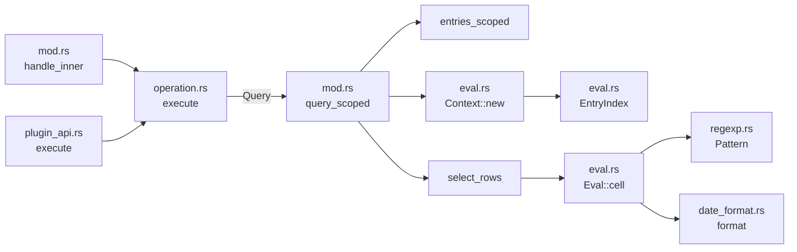
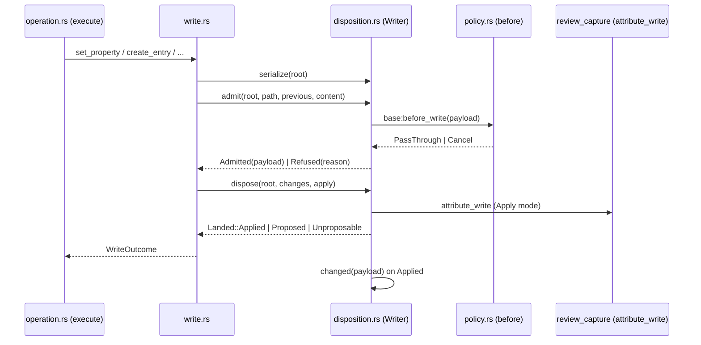

# Bases

A base file is an Obsidian query and view configuration, saved as a `.base`
YAML file or embedded as a `base` code fence, per [[Meta/CONTEXT]]. This page
covers the base document and expression AST in `crucible-core/src/bases/`
and the daemon-owned query, write, policy and plugin surface in
`crucible-daemon/src/bases/`. It does not cover the CLI's `cru base`
commands (`crates/crucible-cli/src/commands/base.rs`, see [[CLI Commands]]),
the web routes (`crates/crucible-web/src/routes/bases.rs`, see
[[Web Server]]), or the `cru.kiln` Lua registration
(`crates/crucible-lua/src/vault/bases.rs`, see [[Luau APIs]]) in full; it
names each seam and links onward. For user-facing behavior, read
[[Help/Query/Bases]].

## Purpose and ownership

Per `AGENTS.md`, `crucible-core` holds canonical parser and domain types, and
`crucible-daemon` owns storage, retrieval, tools and the write disposition.
This subsystem follows that split exactly:

- **`crucible-core/src/bases/`** owns the base document shape (`BaseFile`,
  `View`, `Filter`, `Summary`, and siblings) and the expression language's
  AST and parser (`Expr`, `BaseValue`, `Function`, `BinaryOp`). It parses;
  it does not evaluate. The module doc states the boundary directly:
  "Evaluation belongs to the daemon."
- **`crucible-daemon/src/bases/`** owns everything else: the query engine
  (`mod.rs`, `eval.rs`), the write operations (`write.rs`), the write
  admission gate (`disposition.rs`, `policy.rs`), the RPC and Lua entry
  points (`operation.rs`, `plugin_api.rs`), a from-scratch moment.js date
  formatter (`date_format.rs`), a JavaScript-semantics regex wrapper
  (`regexp.rs`), inline-fence resolution (`inline.rs`), and the
  wire-facing view-options projection (`view_options.rs`).
- **`crucible-lua/src/vault/bases.rs`** owns `BaseOperation` (the closed set
  of Bases operations) and the `cru.kiln.*` Lua registration; the daemon
  re-exports and dispatches on that enum rather than declaring its own,
  so the "one enum" the RPC and Lua paths share crosses a crate boundary.
- **`crucible-web/src/routes/bases.rs`** is a thin HTTP proxy over the
  daemon's `base.*` RPCs, mapping `WriteOutcome`/`Failure` onto HTTP status
  codes; it holds no Bases business logic of its own.

This subsystem must not own: note storage, the link index or embeddings
(that is [[Knowledge Storage and Retrieval]] — a `.base` file is classified
`KilnFileKind::Base` in `crucible-core/src/kiln.rs` and indexed as plain
text, not as a note); the review ledger itself (that is [[Review]] —
`disposition.rs` calls into it but does not implement it); or tool
admission and permission policy (that is [[Tools and Admission]] and
[[Agent Manager]] — `disposition.rs` and `plugin_api.rs` call into
`AgentManager`'s permission and scope checks rather than reimplementing
them).

## Module map

### `crates/crucible-core/src/bases/` — the document and expression AST

| Path | Lines | Role |
| --- | --- | --- |
| `crates/crucible-core/src/bases/mod.rs` | 411 | `BaseFile`, `View`, `Filter`, `Summary`, `ViewType` — the parsed `.base` document shape and its load-time contract. |
| `crates/crucible-core/src/bases/expression.rs` | 946 | `Expr`, `BaseValue`, `Function`, `BinaryOp`, `UnaryOp` — the expression AST, its closed function vocabulary, and a hand-written Pratt parser. |

### `crates/crucible-daemon/src/bases/` — the query, write and dispatch engine

| Path | Lines | Role |
| --- | --- | --- |
| `crates/crucible-daemon/src/bases/mod.rs` | 875 | Module root, query pipeline (`query`/`query_scoped`), path containment, kiln resolution, and the `base.*` RPC entry point. |
| `crates/crucible-daemon/src/bases/eval.rs` | 1157 | `Context`/`Eval` — the per-query, per-row expression evaluator with link/backlink caching and evaluation budgets. |
| `crates/crucible-daemon/src/bases/write.rs` | 802 | `set_property`, `create_entry`, `ensure_base`, `reorder_groups`, and the `file.folder` move special case. |
| `crates/crucible-daemon/src/bases/disposition.rs` | 344 | `Writer` — permission, containment, policy admission, and propose-vs-apply disposition for every Bases write. |
| `crates/crucible-daemon/src/bases/operation.rs` | 277 | `WriteOutcome`, `Failure`, typed parameter structs, and the `execute()` dispatcher RPC and Lua share. |
| `crates/crucible-daemon/src/bases/plugin_api.rs` | 104 | The `cru.kiln` Lua-facing twin of `mod.rs`'s RPC handler: kiln admission and session-scoped dispatch. |
| `crates/crucible-daemon/src/bases/policy.rs` | 39 | `before()` — the single `base:before_write` policy stage every mutation runs through. |
| `crates/crucible-daemon/src/bases/regexp.rs` | 243 | `Pattern` — a JavaScript-semantics regex wrapper over `fancy_regex`, with bounded backtracking. |
| `crates/crucible-daemon/src/bases/date_format.rs` | 318 | `format()` — a from-scratch moment.js token formatter for the `Format` expression function. |
| `crates/crucible-daemon/src/bases/inline.rs` | 36 | `range()` — locates an inline (fenced) base's exact byte range inside its host note. |
| `crates/crucible-daemon/src/bases/view_options.rs` | 136 | `ViewOptions` — the typed, always-defaulted projection of a view's presentation options. |

### `crates/crucible-daemon/src/bases/` — tests

| Path | Lines | Role |
| --- | --- | --- |
| `crates/crucible-daemon/src/bases/engine_tests.rs` | 515 | Query-engine/evaluator conformance and behavior tests against three captured fixture corpora. |
| `crates/crucible-daemon/src/bases/tests.rs` | 411 | Black-box daemon test module for the query and write operations, run exactly as `operation::execute` dispatches them. |
| `crates/crucible-daemon/src/bases/plugin_tests.rs` | 1012 | Integration tests for the Lua/plugin and RPC-with-session surface: policy, permission, folder moves, and review attribution. |

### Adjacent seams (owned by other pages)

| Path | Role |
| --- | --- |
| `crates/crucible-lua/src/vault/bases.rs` | `BaseOperation` and the `cru.kiln.*` Lua registration; see [[Luau APIs]]. |
| `crates/crucible-web/src/routes/bases.rs` | The `/api/bases/*` HTTP routes; see [[Web Server]]. |
| `crates/crucible-cli/src/commands/base.rs` | The `cru base` command family; see [[CLI Commands]]. |

## Key types and traits

- **`BaseFile`** (`crates/crucible-core/src/bases/mod.rs`) is the parsed
  document: `filters`, `formulas`, `properties`, `summaries`, `views`,
  `new_item_folder`, `new_item_template`, and an `extra` map that keeps
  unknown YAML keys. `BaseFile::parse` compiles every filter and formula
  once, injects a default table view sorted by `file.name` when the YAML
  names no view, and resolves each view's summary names against custom
  formulas. A filter or a custom summary formula that fails to compile, or
  names an unknown summary, fails the whole load; a per-view formula column
  keeps its own parse error and shows it per cell.
- **`Expr`**/**`BaseValue`**/**`Function`** (`crates/crucible-core/src/bases/expression.rs`)
  are the AST, the value type, and the closed function vocabulary of
  Obsidian 1.14.2 formulas. `Function::check_call` is the arity table only;
  the daemon's exhaustive `match` in `eval::Eval::call` is the
  implementation gate for the same closed set, so the vocabulary is
  enforced twice. `Expr::parse` resolves a call to a `Function` variant at
  parse time, so an unknown function name or a wrong argument count is a
  parse error, not a runtime one. Parsing enforces three bounds: a 64 KiB
  source limit, `MAX_NODES` (1024) parsed nodes, and `MAX_DEPTH` (128)
  evaluator frames — a left-associative operator chain evaluates in one
  frame regardless of length, so nesting depth measures evaluator frames,
  not syntax length.
- **`SummaryKind`** (`crates/crucible-core/src/bases/mod.rs`) is the
  14-variant, `EnumIter`-gated set of Obsidian's built-in summaries
  (Average, Min, Max, Sum, Range, Median, Stddev, Earliest, Latest, Checked,
  Unchecked, Empty, Filled, Unique); `Summary::Custom` names a base formula
  instead, and a base formula sharing a built-in's name wins.
- **`Entry`**/**`Row`**/**`Group`**/**`QueryResult`** (`crates/crucible-daemon/src/bases/mod.rs`)
  are the query result shapes. `Row.movable` and `Group.write_value` are
  the daemon's "move contract": a row's `movable` flag says whether it can
  move between the groups of its view, and a group's `write_value` is the
  exact value a `set_property` call needs to move a row into that group —
  the daemon owns the move rules a kanban drag or a CLI `set` relies on.
- **`Context`**/**`Eval`**/**`EntryIndex`** (`crates/crucible-daemon/src/bases/eval.rs`)
  are the evaluator: one `Context` per query holds an `EntryIndex` that
  resolves wikilinks and backlinks once per query (cached in a
  `RefCell`/`OnceCell`), and one `Eval` per row evaluates `Expr` trees into
  `BaseValue`, enforcing `MAX_EVAL_DEPTH` (2 × `MAX_DEPTH`), `MAX_STEPS`
  (100,000), and `MAX_ALLOCATION` (16 MiB). `Eval::cell` never propagates a
  failure to its caller: a cell that fails to evaluate becomes a
  `BaseValue::Error`, so one bad cell never fails a row or a query.
  Formulas are row-scoped and memoized once per row in `formula_values`,
  guarded against circular references.
- **`Writer`** (`crates/crucible-daemon/src/bases/disposition.rs`) is who
  writes: an optional `RpcContext` and an optional `Session`. No session
  means a person at a client; no context means a unit test. Its `admit`
  method runs permission checks, then the `base:before_write` policy, and
  returns an `Admission` (`Admitted(Json)` carrying the exact payload the
  policy saw, reused verbatim for the `base:changed` event, or
  `Refused(String)`). Its `dispose` method forks on the session's
  `Disposition`: `Propose` packages changes as one multi-file `Proposal`,
  refusing with `Landed::Unproposable` when the change cannot be
  represented as text (a folder move of a non-text file); `Apply` runs
  the write inside the session's review attribution.
- **`WriteOutcome`** (`crates/crucible-daemon/src/bases/operation.rs`) is a
  tagged enum every write answers with: `Applied`, `Unchanged`, `Proposed`,
  `Stale` (an `ancestor_hash` mismatch), or `Refused` (a permission rule or
  policy hook refused the write).
- **`BaseOperation`** (`crates/crucible-lua/src/vault/bases.rs`) is the
  closed set of eight Bases operations (`List`, `Views`, `Query`,
  `SetProperty`, `CreateEntry`, `ReorderGroups`, `EnsureBase`,
  `PendingWrites`); `operation.rs` re-exports it rather than declaring a
  daemon-local copy, so the RPC dispatcher and the `cru.kiln` Lua
  registration share one enum across the crate boundary.
- **`ViewOptions`** (`crates/crucible-daemon/src/bases/view_options.rs`) is
  the typed, always-defaulted projection of a view's free-form Obsidian
  presentation options (card size, image fit, row height, column widths,
  and siblings), consumed by both the CLI's native views and the web
  frontend's generated OpenAPI types.

## Flows

### Query: resolving and evaluating a base

1. `handle`/`handle_inner`, in `crates/crucible-daemon/src/bases/mod.rs`, is
   the RPC entry point; `execute`, in
   `crates/crucible-daemon/src/bases/plugin_api.rs`, is the Lua entry point.
   Each resolves the named kiln to its root through `kiln_root` before
   building a `disposition::Writer` and calling the same
   `operation::execute`.
2. `operation::execute` dispatches a `Query` operation to `query_scoped`,
   which resolves the base source (a `.base` path via `source_path`, or an
   inline fenced YAML via `Source::Inline`) and an optional host note, given
   the already-resolved kiln root.
3. `entries_scoped` walks the kiln (`kiln_files`), parses every note with
   `crucible_core::parser::CrucibleParser`, applies Obsidian property types
   from `.obsidian/types.json`, and builds one `Entry` per file.
4. `eval::Context::new` builds one `EntryIndex` for the whole query,
   resolving every wikilink and computing backlinks lazily and once.
5. `select_rows` evaluates each entry's filters and cells through one
   `eval::Eval` per row; a filter failure excludes the row, a cell failure
   becomes `BaseValue::Error`. Sorting, `group_rows`, and `summaries` follow.

### Write: admission, policy and disposition

1. `operation::execute` dispatches a write operation to `write.rs`
   (`set_property`, `create_entry`, `ensure_base`, `reorder_groups`, or the
   `file.folder` case, `move_entry`).
2. Every write takes `disposition::Writer::serialize`, the kiln-wide
   `ORDER_LOCK`, before any per-path lock, so a policy such as a WIP limit
   sees every earlier write in the kiln.
3. `Writer::admit` checks permission and write scope
   (`permit_content`/`bases_write_permission`), then runs the
   `base:before_write` policy (`policy::before`) with the final `path`,
   `previous_path`, `content`, and (for a note) parsed `properties` and
   `old_properties`. A policy handler returns `PassThrough` or
   `Cancel { reason }`; any other answer is a hard error.
4. `Writer::dispose` forks on the session's disposition: `Propose` packages
   the change as one `Proposal`; `Apply` runs the write inside
   `agent_manager::messaging::review_capture::attribute_write`.
5. `Writer::put` resolves the path through `crate::file_write::contain`
   before anything else touches it (a dangling or escaping symlink cannot
   be a write target), then calls `write_locked`, mapping its answer to a
   `WriteOutcome`.
6. On `Applied`, `Writer::changed` strips `content` from the admitted
   payload and emits `event_map::base_changed`, so `base:changed`
   broadcasts the same payload the policy saw.

### A plugin tool call and its review attribution

A plugin tool that writes a `.base` file inside a turn (for example, via
`cru.kiln.ensure_base` from a tool body) runs inside
`agent_manager::messaging::review_capture::within_tool_call`, which brackets
the call in a task-local `ToolCallScope`. `Writer::attributed`, in
`crates/crucible-daemon/src/bases/disposition.rs`, calls
`review_capture::attribute_write`, and that function checks
`captures_session` first: if the current tool call already holds an open
bracket, the Bases write joins it rather than opening a second one. Two open
brackets on the same root would both be marked contested, and the write's
hunk would then show as an external change instead of being attributed to
the tool call. `crates/crucible-daemon/src/agent_manager/tests/bases_attribution.rs`
is the regression test for this: a plugin tool (`board_init`) that writes a
base through `cru.kiln` inside a bracketed call is attributed to that call's
interval, not left contested. See [[Agent Manager]] for the bracket and
[[Review]] for the ledger it writes into.

## State, concurrency and lifecycle

- **Serialization.** `disposition::ORDER_LOCK` (`.crucible-bases-writes`) is
  a per-kiln file lock every write takes before any per-path lock, so a
  policy that counts pending or prior writes (a WIP limit) sees them in
  order. The lock is not reentrant: a task-local, `IN_POLICY`, is set only
  while a `base:before_write` policy body runs, and `Writer::serialize`
  refuses (rather than deadlocking) a nested Bases write attempted from
  inside a policy — "return cancel or nil instead."
- **Per-query caching.** `eval::EntryIndex` resolves each wikilink once
  (`RefCell<HashMap>`) and computes backlinks once, lazily, per query
  (`OnceCell`); neither cache survives past the query that built it.
- **Row-scoped memoization.** `eval::Eval::formula_values` memoizes each
  formula once per row, cleared of the caller's lambda locals
  (`value`/`index`/`acc`) before it evaluates, and guarded against a
  formula-to-formula cycle.
- **No daemon-VM state in `crucible-core`.** The expression AST and parser
  hold no daemon references; every stateful piece (the regex cache, the
  link index, the plugin handler registry) lives in the daemon's `Context`
  or `Writer`.
- **Bounded cost.** Parsing bounds source size and node/depth counts;
  evaluation bounds depth, step count, and allocation
  (`MAX_EVAL_DEPTH`/`MAX_STEPS`/`MAX_ALLOCATION`); `regexp::Pattern` bounds
  backtracking and replacement output size. Together these mean a hostile
  or accidental `.base` file cannot hang or blow up a query.
- **Write outcome, not exception, for a conflict.** A stale `ancestor_hash`
  or a symlink escape returns a typed `WriteOutcome`/error rather than
  panicking; `write.rs`'s YAML edits are checked by reparsing the result
  and comparing it to the expected document with only the target key
  changed, so a byte-level splice bug fails loudly rather than silently
  corrupting an unrelated key.

## Boundaries and invariants

- **Parsing is load-time-fatal for filters and summaries, per-cell-fatal
  for formulas.** `BaseFile::parse`'s own doc comment states this
  precisely: a filter or a custom summary formula that does not compile
  fails the whole load; a formula that does not compile loads with its
  error, and each cell using it shows that error, matching Obsidian.
- **A cell error never fails a row or a query.** `eval::Eval::cell` catches
  every evaluation failure into `BaseValue::Error`; a filter failure
  excludes the row (the free function `matches`, in
  `crates/crucible-daemon/src/bases/mod.rs`) rather than failing the query;
  a file that cannot be read or parsed is skipped with a warning
  (`entries_scoped`).
- **Two enforcement points for one closed function set.**
  `Function::check_call` (`crates/crucible-core/src/bases/expression.rs`)
  is the arity table only; `eval::Eval::call`
  (`crates/crucible-daemon/src/bases/eval.rs`) is the daemon's exhaustive
  match that actually implements every variant. Adding a `Function`
  variant without a matching `eval::Eval::call` arm fails to compile.
- **Every mutation runs through one policy stage and one notification.**
  `policy.rs`'s module doc states this directly: `base:before_write`
  before, `base:changed` after. `disposition::Admission::Admitted` carries
  the exact payload the policy saw, reused unmodified for the event, so a
  plugin cannot see one shape in its policy hook and a different shape in
  its change notification.
- **Write containment is checked at the write, not trusted from the
  caller.** `disposition::Writer::put` resolves every path through
  `crate::file_write::contain` before any byte is touched; `contain`
  canonicalizes the nearest existing ancestor, so a dangling or escaping
  symlink cannot carry a write out of the kiln even when the final path
  component does not yet exist. The read-side containment gate, `contained`
  in `crates/crucible-daemon/src/bases/mod.rs`, is a separate check for
  query-time reads: it requires the full path to already exist, canonicalizes
  it directly, and additionally rejects a hidden path segment.
- **A folder move plans twice.** `move_entry`, in
  `crates/crucible-daemon/src/bases/write.rs`, plans the rename
  once before taking any lock (to learn which files besides the two
  endpoints need locking), then re-plans under the locks and refuses if the
  second plan touches a source the first did not lock — "the checked bytes
  are the bytes that land."
- **A proposal cannot hold every kind of change.** `disposition::Landed::Unproposable`
  is the fallback for a change a `Proposal` literally cannot represent (a
  non-text file moved by a `file.folder` write); the caller answers
  `WriteOutcome::Refused` rather than silently applying it outside the
  session's chosen disposition.
- **`thiserror` at the boundary, `anyhow` inside**, per `AGENTS.md`:
  `operation::Classified`/`Failure` is what a caller (RPC or web) matches
  on; `Failure::of` walks the error chain, classifying an explicit
  `Classified`, then an `io::Error`, before defaulting to `Invalid`.
- **JavaScript semantics are a deliberate, tested choice, not an
  accident.** `eval.rs`'s coercion helpers, `regexp.rs`'s ASCII `\d`/`\w`
  classes and bounded backtracking, and `date_format.rs`'s moment.js token
  engine each exist specifically to match Obsidian's (JavaScript- and
  moment-flavored) behavior rather than Rust-native or `chrono`-native
  semantics; `crates/crucible-core/src/bases/expression.rs`'s
  `js_number_text` is the same choice for number-to-text formatting.

## Extension seams

- **A new expression function** adds a `Function` variant in
  `crates/crucible-core/src/bases/expression.rs`, an arity arm in
  `Function::check_call`, and an exhaustive-match arm in
  `crates/crucible-daemon/src/bases/eval.rs`'s `Eval::call` — the daemon's
  match is the completeness gate for the closed set. It should also gain a
  captured example in `assets/fixtures/bases/obsidian-1.14.2-expressions.json`,
  since `engine_tests.rs`'s `bases_every_declared_function_has_a_captured_example`
  fails a `Function` variant with no example case.
- **A new built-in summary** adds a `SummaryKind` variant in
  `crates/crucible-core/src/bases/mod.rs` (its `EnumIter` derive is the
  completeness gate) and an arm in `crates/crucible-daemon/src/bases/mod.rs`'s
  `builtin_summary`.
- **A new Bases operation** adds a `BaseOperation` variant in
  `crates/crucible-lua/src/vault/bases.rs`, an arm in
  `crates/crucible-daemon/src/bases/operation.rs`'s `execute`, and, if it
  writes, a function in `crates/crucible-daemon/src/bases/write.rs`. It
  reaches the CLI and web only through their own dedicated files
  (`crates/crucible-cli/src/commands/base.rs`,
  `crates/crucible-web/src/routes/bases.rs`), which this page does not
  itself define.
- **A new view presentation option** extends `ViewOptions` in
  `crates/crucible-daemon/src/bases/view_options.rs` and its `From<&View>`
  projection; an unrecognized value in the base's own YAML should default
  rather than error, matching every existing option's closed-choice,
  permissive-read behavior.
- **A new Lua-visible hook point** on a Bases write is a `StageId` or
  `EventName` variant in `crates/crucible-lua/src/handlers/hook_name.rs`
  (`StageId::BaseBeforeWrite`, `base:before_write`, and
  `EventName::BaseChanged`, `base:changed`, are the two that exist today);
  it is fired from `crates/crucible-daemon/src/bases/policy.rs` and from
  `Writer::changed` in `crates/crucible-daemon/src/bases/disposition.rs`
  respectively. See [[Luau Host]] for the handler registry these hooks run
  through.

## Tests

- **`crates/crucible-core/src/bases/mod.rs`** and
  **`crates/crucible-core/src/bases/expression.rs`** carry inline
  `#[cfg(test)]` modules proving YAML round-trip with unknown options
  preserved, invalid-filter and unknown-summary rejection at load,
  operator-token/precedence parsing, hex-escape validation, function-call
  resolution at parse time, and JavaScript-matching number formatting.
- **`crates/crucible-daemon/src/bases/engine_tests.rs`** is the
  query-engine/evaluator suite. It replays three captured fixture corpora
  under `assets/fixtures/bases/` (`obsidian-1.14.2-expressions.json`,
  `obsidian-1.14.2-summaries.json`, `js-reference.json`) and asserts a
  completeness gate tying every `Function` and `SummaryKind` variant to at
  least one captured example. Behavior tests cover calendar-date
  arithmetic, formula-to-formula circular-reference detection, the
  row/group move contract (`movable`, `write_value`), and that formulas run
  once per row (a 40-level formula-doubling chain that would be `2^40`
  evaluations if memoization were missing).
- **`crates/crucible-daemon/src/bases/tests.rs`** is the black-box daemon
  test module, calling `operation::execute` exactly as RPC or Lua would.
  It replays four more captured Obsidian conformance fixtures
  (`obsidian-1.14.2-queries.json`, `-creation.json`, `-summaries.json`,
  `-moves.json`) and covers property-write staleness, entry creation's
  "never overwrites" numbering, symlink/traversal containment, saved
  group-order round-tripping, and inline-embed byte-range resolution. One
  test, `bases_regenerate_live_obsidian_reference`, is `#[ignore]`d, naming
  its external prerequisite (a Playwright/CDP harness driving a real
  Obsidian 1.14.2 instance) per `AGENTS.md`'s test-workflow convention.
- **`crates/crucible-daemon/src/bases/plugin_tests.rs`** is the integration
  suite for the Lua/session surface: policy cancel/error/timeout behavior,
  rejection leaving an absent file absent and an empty file byte-identical,
  folder moves as one atomic multi-file proposal with backlink rewriting,
  the shipped kanban plugin's WIP-limit policy (which counts pending
  proposals, not only applied cards), Ask-mode grants scoped to the
  enclosing allowed tool call, and the reentrancy refusal
  (`bases_policy_that_writes_through_bases_is_refused_not_deadlocked`)
  proving `f2701ad41`'s order-lock-before-path-locks fix.
- **`crates/crucible-daemon/src/agent_manager/tests/bases_attribution.rs`**
  is the review-attribution regression test described above, in
  [[Agent Manager]]'s test scope rather than this page's own files.
- **`crates/crucible-daemon/src/bases/regexp.rs`** and
  **`crates/crucible-daemon/src/bases/view_options.rs`** carry their own
  inline unit tests (ASCII regex classes, adversarial-backtracking
  refusal, and closed-choice defaulting) named in the Module map.

Gaps: this page's files carry no dedicated unit test for
`crates/crucible-daemon/src/bases/date_format.rs` beyond its own
parametrized escape/format-token test; broader moment.js token coverage
rides on the shared conformance fixtures instead. `crates/crucible-web/tests/bases_daemon_e2e.rs`
drives Bases reads and writes over actual HTTP requests against a real
daemon, but it is out of this page's file set (see [[Web Server]]).

## Findings

- No AGENTS.md ownership conflict found in this page's file set: the
  document/expression AST stays in `crucible-core`, evaluation and write
  disposition stay in the daemon, `BaseOperation` is owned by
  `crucible-lua` and only re-exported by the daemon, and every write funnels
  through the daemon's existing permission, scope, and review machinery
  rather than a duplicate of it.
