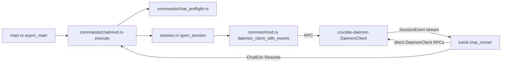

# CLI Commands

`crucible-cli` builds the one `cru` binary. This page covers its argument
surface (`src/cli/`), its command handlers (`src/commands/`), and the small
set of client-local helpers (config acquisition, kiln naming, output
formatting, provider probing, agent/storage factories) that a handler calls
before it reaches the daemon. It does not cover `src/tui/oil/` (see
[[TUI Chat App]] and [[TUI Components]]), which is a separate, much larger
subsystem that several files here hand off to.

## Purpose and ownership

`crates/crucible-cli/AGENTS.md` states the rule this whole crate follows:
"CLI/TUI IS A VIEW LAYER ONLY — NO DOMAIN LOGIC." A command handler parses
flags, calls a `DaemonClient` RPC, and renders the reply as JSON, a table, or
plain text. It must not hold session state beyond what a render needs, must
not construct a second agent or write pipeline, and must not decide
admission, retrieval, or storage policy locally.

The root `AGENTS.md` ownership table assigns "Input, presentation,
client-local state" to `crucible-cli`, and "Business logic and authoritative
storage" to `crucible-daemon`. This subsystem matches that split file by
file: every command that touches a registry, a session, a kiln, or storage
does so through `crucible_daemon::DaemonClient`. The handful of exceptions
are named in the module map below (`crates/crucible-cli/src/commands/auth.rs`
manages local credential files because secrets are process-local, not shared
state; `crates/crucible-cli/src/commands/stats.rs` and
`crates/crucible-cli/src/commands/tasks.rs` read the filesystem directly
because their subject — file counts, a `TASKS.md` file — is not daemon
state at all).

What this subsystem must not own: session lifecycle, kiln/project registry
truth, provider selection persistence, plugin activation, or retrieval
ranking. Those stay in `crucible-daemon` and `crucible-core`, reached only
through `crucible_daemon::rpc_client::DaemonClient`. No other crate in the
workspace imports from `crucible-cli` (confirmed against
`/tmp/crucible-arch/deps.md`'s cross-crate import matrix, which lists no
`cli::*` consumers) — this crate is a leaf, and its own dependency edges all
point outward to `crucible-core`, `crucible-daemon`, `crucible-lua`,
`crucible-oil`, and, behind the `web` feature (`commands/web.rs`),
`crucible-web`.

## Module map

### `src/` (root)

| Path | Lines | Role |
| --- | --- | --- |
| `crates/crucible-cli/src/main.rs` | 714 | Binary entry point: parses `Cli`, sets up logging, resolves config acquisition per command via `config_need`, dispatches every `Commands` variant, and shuts the tokio runtime down with a capped grace period. |
| `crates/crucible-cli/src/config.rs` | 528 | `fetch_effective_config`: daemon-first, local-evaluation-fallback config acquisition; re-exports/renames `crucible_core::config` types for CLI use. |
| `crates/crucible-cli/src/common/mod.rs` | 34 | `daemon_client`, `daemon_client_if_running`, `daemon_client_with_events` — the three ways a command gets a `DaemonClient`. |
| `crates/crucible-cli/src/kiln_attach.rs` | 208 | `CliKilnRegistry::resolve` — turns a `--kiln` value into a `KilnTarget` (registered name vs. bare directory) without registering it. |
| `crates/crucible-cli/src/kiln_attach/tests.rs` | 238 | Unit tests for `kiln_attach.rs`'s resolution rules, hermetic under `tempfile::TempDir`. |
| `crates/crucible-cli/src/kiln_discover.rs` | 308 | `discover_kiln` — implicit kiln discovery (CLI flag > ancestor walk > env var > global config) for commands with no explicit `--kiln`. |
| `crates/crucible-cli/src/kiln_validate.rs` | 501 | `validate_kiln_path` — path-quality checks used only by `cru init`; not a shared validation layer. |
| `crates/crucible-cli/src/output.rs` | 450 | `format_search_results`, `records_table`, and `info`/`warning`/`error`/`success` print helpers shared across command handlers. |
| `crates/crucible-cli/src/provider_detect.rs` | 533 | `detect_providers[_probed]` — local, pre-daemon LLM provider detection used by `cru init` and `chat_preflight.rs`; `wizard.rs` uses its own fixed provider list, not this module. |
| `crates/crucible-cli/src/status_line.rs` | 59 | `StatusLine` — a self-overwriting terminal status indicator for long-running startup steps. |
| `crates/crucible-cli/src/session.rs` | 599 | `AgentType`, `AgentInitParams`, `resolve_is_acp`, `LiveSession`, `OpenedSession`, and `open_session` — opens or resumes a daemon session (subscribe, then create/resume, then a best-effort pending-interaction read) and hands the caller the `DaemonClient`, the session id, and the event receiver. Holds no agent handle: the daemon owns the agent. |
| `crates/crucible-cli/src/test_daemon.rs` | 117 | `#[cfg(test)]`-only. `FakeDaemon` — a Unix-socket JSON-RPC fake that records each method and params and answers through a closure, so a test drives a real `DaemonClient` against it instead of a mock trait object. |

### `src/cli/` — clap argument definitions

| Path | Lines | Role |
| --- | --- | --- |
| `crates/crucible-cli/src/cli/mod.rs` | 577 | `Cli`, `Commands`, `LogLevel` — the single source of truth for every `cru <verb>`; declares every subcommand enum, now including `Base`, `Diff` and `Proposal`. |
| `crates/crucible-cli/src/cli/agents.rs` | 12 | `AgentsCommands` for `cru agents validate`; `list` and `show` are gone — listing is the no-subcommand behavior of `Commands::Agents` itself. |
| `crates/crucible-cli/src/cli/auth.rs` | 41 | `AuthCommands` for `cru auth`. |
| `crates/crucible-cli/src/cli/config.rs` | 37 | `ConfigCommands` for `cru config`. |
| `crates/crucible-cli/src/cli/diff.rs` | 70 | `DiffCommands`, `CommentFormat` for `cru diff branch`/`cru diff comments`. |
| `crates/crucible-cli/src/cli/eval.rs` | 59 | `EvalCommands` for `cru eval`, plus its own `execute` dispatcher (the only `cli/*` file with executable logic). |
| `crates/crucible-cli/src/cli/kiln.rs` | 53 | `KilnCommands` for `cru kiln`. |
| `crates/crucible-cli/src/cli/models.rs` | 38 | `ModelsCommands`, `EmbeddingsCommands` for `cru models`. |
| `crates/crucible-cli/src/cli/project.rs` | 31 | `ProjectCommands` for `cru project`. |
| `crates/crucible-cli/src/cli/proposal.rs` | 91 | `ProposalCommands` for `cru proposal list/show/accept/reject/dismiss/resolve`. |
| `crates/crucible-cli/src/cli/session.rs` | 273 | `SessionCommands` — the largest subcommand group, covering the full session lifecycle. |
| `crates/crucible-cli/src/cli/skills.rs` | 30 | `SkillsCommands` for `cru skills`. |
| `crates/crucible-cli/src/cli/storage.rs` | 35 | `StorageCommands` for `cru storage`. |
| `crates/crucible-cli/src/cli/tools.rs` | 16 | `ToolsCommands` for `cru tools`. |

### `src/cli/tests/` — parse-only tests

| Path | Lines | Role |
| --- | --- | --- |
| `crates/crucible-cli/src/cli/tests/mod.rs` | 25 | Declares sibling test modules; supplies the shared `parse` helper. |
| `crates/crucible-cli/src/cli/tests/agents.rs` | 35 | Parse tests for `cru agents`, including a test that `cru agents list`/`cru agents show` both fail to parse. |
| `crates/crucible-cli/src/cli/tests/chat.rs` | 81 | Parse tests for `cru chat`, including the `--card`/`--acp` mutual exclusion. |
| `crates/crucible-cli/src/cli/tests/diff.rs` | 110 | Parse tests for `cru diff branch` and `cru diff comments`, every flag and the required diffset argument. |
| `crates/crucible-cli/src/cli/tests/init.rs` | 75 | Parse tests for `cru init`. |
| `crates/crucible-cli/src/cli/tests/misc.rs` | 11 | One smoke test for `cru storage mode`. |
| `crates/crucible-cli/src/cli/tests/models.rs` | 58 | Parse tests for `cru models` and `cru models embeddings`. |
| `crates/crucible-cli/src/cli/tests/proposal.rs` | 123 | Parse tests for every `ProposalCommands` variant. |
| `crates/crucible-cli/src/cli/tests/served_prose.rs` | 84 | Cross-crate gate: every `cru <word>` named in Lua-served config prose must be a real clap subcommand or alias. |
| `crates/crucible-cli/src/cli/tests/session.rs` | 373 | Exhaustive parse tests for every `cru session` subcommand. |
| `crates/crucible-cli/src/cli/tests/tasks.rs` | 74 | Parse tests for `cru tasks`. |

### `src/commands/` — top-level command handlers

| Path | Lines | Role |
| --- | --- | --- |
| `crates/crucible-cli/src/commands/mod.rs` | 44 | Declares every command submodule, including `base`, `diff` and `proposal`; gates `web` behind the `web` feature. |
| `crates/crucible-cli/src/commands/agents.rs` | 568 | `cru agents` (bare, with `-t`/`-f`) and `cru agents validate` — the list is daemon-only (no disk fallback); `validate` still reads disk. |
| `crates/crucible-cli/src/commands/auth.rs` | 412 | `cru auth login/logout/list/copilot` — local credential file management (`secrets.toml`), the one command family that is deliberately not daemon-mediated. |
| `crates/crucible-cli/src/commands/base.rs` | 383 | `cru base list/views/query/create/set` — thin terminal client over daemon-owned Obsidian Bases; typed RPC calls (`base.*`), no local Bases evaluation. Declares `BaseCommands` inline rather than in `cli/`, the one exception to the one-enum-per-family-in-`cli/` pattern. |
| `crates/crucible-cli/src/commands/chat_factory_tests.rs` | 161 | Test-only module for `AgentSelection`'s factory-closure pattern; uses hand-rolled stand-ins, not the real factory. |
| `crates/crucible-cli/src/commands/chat_preflight.rs` | 300 | Kiln validation and zero-provider guarding for `cru chat`; the interactive-prompting slice a headless daemon cannot do itself. |
| `crates/crucible-cli/src/commands/completions.rs` | 51 | `cru completions <shell>` via `clap_complete`. |
| `crates/crucible-cli/src/commands/config.rs` | 162 | `cru config init/show/migrate/dump`. |
| `crates/crucible-cli/src/commands/daemon.rs` | 371 | `cru daemon start/stop/restart/status/logs/serve` — daemon process lifecycle from the CLI side. |
| `crates/crucible-cli/src/commands/diff.rs` | 514 | `cru diff branch`/`cru diff comments` — prints a daemon-computed diffset (branch, session record or proposal) as text/JSON, and its open review comments as a quickfix list. |
| `crates/crucible-cli/src/commands/doctor.rs` | 1146 | `cru doctor` — ~10 categories of installation health checks, including a name-clash check over every card and skill source, kiln directories included (`Source names`). |
| `crates/crucible-cli/src/commands/eval.rs` | 815 | `cru eval precognition` — offline retrieval measurement (hit@1/hit@k/MRR/recall) against a golden query set. |
| `crates/crucible-cli/src/commands/init.rs` | 813 | `cru init` — initializes a directory as a kiln or project; writes no legacy config, registers via daemon RPC. |
| `crates/crucible-cli/src/commands/kiln.rs` | 260 | `cru kiln register/list/forget` — thin wrapper over daemon kiln-registry RPCs. |
| `crates/crucible-cli/src/commands/lua.rs` | 45 | `cru lua <code>` — evaluates a Lua snippet via the daemon's `lua.eval` RPC. |
| `crates/crucible-cli/src/commands/mcp.rs` | 172 | `cru mcp` — starts/stops the daemon's MCP server over SSE or stdio. |
| `crates/crucible-cli/src/commands/process.rs` | 364 | `cru process` — explicit parse/enrich/embed of kiln files via daemon RPC, with a polling `--watch` mode. |
| `crates/crucible-cli/src/commands/project.rs` | 199 | `cru project register/list/forget` — the project-registry counterpart to `kiln.rs`. |
| `crates/crucible-cli/src/commands/proposal.rs` | 608 | `cru proposal list/show/accept/reject/dismiss/resolve` — reads and decides daemon-owned proposals (plugin- or session-authored file writes awaiting review), including conflict-marker rendering and text-based conflict resolution. |
| `crates/crucible-cli/src/commands/search.rs` | 500 | `cru search` — combines daemon full-text and semantic search across daemon-registered kilns. |
| `crates/crucible-cli/src/commands/set.rs` | 290 | `cru set [SESSION_ID] KEY=VALUE...` — validates via the TUI's shared setting validator, issues per-setting daemon RPCs; also carries the `plugin_turn_limit` and `plugin_approval.<plugin>` session knobs. |
| `crates/crucible-cli/src/commands/setup.rs` | 389 | `cru setup` — bootstraps the on-disk Luau runtime tree and a template `init.lua`. |
| `crates/crucible-cli/src/commands/skills.rs` | 165 | `cru skills list/show/search` — read-only view over daemon-discovered skills; sends the CLI's own working directory as the workspace on every RPC. |
| `crates/crucible-cli/src/commands/stats.rs` | 362 | `cru kiln stats` — local filesystem file-count/size statistics, no daemon RPC. |
| `crates/crucible-cli/src/commands/status.rs` | 120 | `cru status` — storage/system status, for a path or globally. |
| `crates/crucible-cli/src/commands/stdin.rs` | 70 | `read_stdin_message`/`resolve_message` — bounded stdin reading for `-` arguments. |
| `crates/crucible-cli/src/commands/storage.rs` | 111 | `cru storage mode/stats/verify/cleanup/backup/restore` — façade over daemon storage-maintenance RPCs. |
| `crates/crucible-cli/src/commands/tasks.rs` | 1151 | `cru tasks list/next/pick/done/blocked` — local `TASKS.md` checkbox parsing and surgical in-place rewriting. |
| `crates/crucible-cli/src/commands/tools.rs` | 104 | `cru tools list` — lists the daemon's built-in tool set from its closed `BuiltinTool::ALL` set. |
| `crates/crucible-cli/src/commands/web.rs` | 598 | `cru web`/`key`/`webhook` — starts `crucible-web`'s server, manages its API key and webhook secrets. |
| `crates/crucible-cli/src/commands/wizard.rs` | 376 | The first-run interactive setup wizard: provider/API key/default kiln, writes `init.lua` + `llm.json` + `secrets.toml`. |
| `crates/crucible-cli/src/commands/workflow.rs` | 777 | `cru workflow list/show/start/approve/status/cancel` — local note parsing for list/show, daemon RPC for the rest. |

### `src/commands/acp/` — ACP host adapter

| Path | Lines | Role |
| --- | --- | --- |
| `crates/crucible-cli/src/commands/acp/mod.rs` | 195 | `cru acp` entry point: resolves/attaches the kiln, hands off to `CrucibleAcpAgent::serve`; also covered end to end by `tests/acp_wire_tests.rs`, which drives the real binary against a mock provider. |
| `crates/crucible-cli/src/commands/acp/agent.rs` | 589 | `CrucibleAcpAgent` — implements the ACP `Agent` role by delegating every operation to the daemon over RPC. |
| `crates/crucible-cli/src/commands/acp/translate.rs` | 844 | Pure translation layer between daemon `SessionEvent`s and ACP wire types (`SessionUpdate`, `ToolCall`, `PermissionOption`), including the `TurnEnd` mapping and the canonical-tool-call-based title/kind lookup. |

### `src/commands/chat/` — `cru chat`

| Path | Lines | Role |
| --- | --- | --- |
| `crates/crucible-cli/src/commands/chat/mod.rs` | 1065 | `cru chat` end to end: flag-to-mode resolution, full-screen-by-default TUI launch (looping over `/resume`), oneshot path (direct RPCs plus `collect_turn_text`), replay. |
| `crates/crucible-cli/src/commands/chat/tests.rs` | 320 | Unit tests for `chat/mod.rs`'s pure helpers (env parsing, mode selection, piped-query folding, `chat_screen`'s inline/full-screen decision). |

### `src/commands/config/`

| Path | Lines | Role |
| --- | --- | --- |
| `crates/crucible-cli/src/commands/config/migrate.rs` | 315 | `cru config migrate` — one-time TOML → Lua config generator/splitter, verified in memory before any write. |

### `src/commands/models/`

| Path | Lines | Role |
| --- | --- | --- |
| `crates/crucible-cli/src/commands/models/mod.rs` | 63 | `cru models` (top-level) — models the configured provider(s) expose, via the daemon. |
| `crates/crucible-cli/src/commands/models/embeddings.rs` | 394 | `cru models embeddings list/download/use` — renders the daemon's embedding-model catalog, writes the `enrichment.provider` config key. |

### `src/commands/plugin/`

| Path | Lines | Role |
| --- | --- | --- |
| `crates/crucible-cli/src/commands/plugin/mod.rs` | 228 | `cru plugin` dispatch; the shared `GitPlugin`/`EntrySource` model and `configured_plugin_entries` merge point. |
| `crates/crucible-cli/src/commands/plugin/add.rs` | 220 | `cru plugin add` / `cru install` — clone a git plugin, load it into the running daemon. |
| `crates/crucible-cli/src/commands/plugin/check.rs` | 105 | `cru plugin check` — parse + declaration + optional type check of one plugin, in-process. |
| `crates/crucible-cli/src/commands/plugin/health.rs` | 136 | `cru plugin health` — runs a plugin's `health.lua` checks via the daemon. |
| `crates/crucible-cli/src/commands/plugin/list.rs` | 130 | `cru plugin list` — configured plus live-loaded plugin state. |
| `crates/crucible-cli/src/commands/plugin/new.rs` | 189 | `cru plugin new` — scaffolds a plugin directory from embedded templates. |
| `crates/crucible-cli/src/commands/plugin/remove.rs` | 166 | `cru plugin remove` — deactivate + unregister a plugin via the daemon. |
| `crates/crucible-cli/src/commands/plugin/stubs.rs` | 89 | `cru plugin stubs` — generate/verify LuaLS type declarations (`cru.d.luau`). |
| `crates/crucible-cli/src/commands/plugin/test.rs` | 155 | `cru plugin test` — runs a plugin's Luau test suite via the daemon. |
| `crates/crucible-cli/src/commands/plugin/update.rs` | 74 | `cru plugin update` — `git pull --ff-only` for installed git-hosted plugins. |

### `src/commands/session/`

| Path | Lines | Role |
| --- | --- | --- |
| `crates/crucible-cli/src/commands/session/mod.rs` | 191 | `cru session` dispatch — the single fan-out point over every `SessionCommands` variant. |
| `crates/crucible-cli/src/commands/session/acp.rs` | 866 | RPC implementation behind nearly every `cru session <verb>`; named for historical reasons, covers the whole session RPC surface, including `send`'s turn-lifecycle-aware event loop. |
| `crates/crucible-cli/src/commands/session/cleanup.rs` | 85 | `cru session cleanup` — deletes old persisted sessions, scoped by kiln. |
| `crates/crucible-cli/src/commands/session/export.rs` | 41 | `cru session export` — writes a session transcript to Markdown. |
| `crates/crucible-cli/src/commands/session/helpers.rs` | 96 | Shared pure helpers: permission-mode parsing, session-id resolution, send-argument disambiguation. |
| `crates/crucible-cli/src/commands/session/io.rs` | 163 | Filesystem-facing helpers for the daemon-unreachable session fallback path, including a context-clear event render. |
| `crates/crucible-cli/src/commands/session/list.rs` | 142 | `cru session list` — live daemon sessions plus, with `--all`, persisted history. |
| `crates/crucible-cli/src/commands/session/reindex.rs` | 30 | `cru session reindex` — retired stub explaining why the RPC it used to call no longer exists. |
| `crates/crucible-cli/src/commands/session/resume.rs` | 22 | `cru session open` — resumes a persisted session into the interactive chat TUI. |
| `crates/crucible-cli/src/commands/session/search.rs` | 48 | `cru session search` — full-text scan over past session logs via the daemon. |
| `crates/crucible-cli/src/commands/session/show.rs` | 122 | `cru session show` — renders one session's metadata and transcript, three-layer fallback. |

### `src/commands/session/tests/`

| Path | Lines | Role |
| --- | --- | --- |
| `crates/crucible-cli/src/commands/session/tests/mod.rs` | 58 | Shared fixtures/harness (`test_config`, `setup_test_session` against a real wire-format fixture). |
| `crates/crucible-cli/src/commands/session/tests/list.rs` | 55 | Tests for `list_persisted` and message-counting. |
| `crates/crucible-cli/src/commands/session/tests/misc.rs` | 130 | Tests for `resolve_session_id`, `resolve_send_inputs`, `truncate_chars`. |
| `crates/crucible-cli/src/commands/session/tests/reindex.rs` | 29 | Tests proving `reindex` never reaches for the retired RPC. |
| `crates/crucible-cli/src/commands/session/tests/show.rs` | 84 | Tests for `show` and `export` against the real wire-format fixture. |

### `src/factories/` — composition root

| Path | Lines | Role |
| --- | --- | --- |
| `crates/crucible-cli/src/factories/mod.rs` | 10 | Re-export surface for `embedding`, `storage`. Session opening lives in `crates/crucible-cli/src/session.rs`, outside this module. |
| `crates/crucible-cli/src/factories/embedding.rs` | 51 | `embedding_provider_config_from_cli` — derives an `EmbeddingProviderConfig` from loaded CLI config. |
| `crates/crucible-cli/src/factories/storage.rs` | 195 | `get_storage[_with_summary]` — daemon-only storage handle factory, `CliStorageHandle`, `KilnOpenSummary`. |

### `src/formatting/`

| Path | Lines | Role |
| --- | --- | --- |
| `crates/crucible-cli/src/formatting/mod.rs` | 154 | `OutputFormat`, `TextFormat` — the shared `--format` enums every command uses. |
| `crates/crucible-cli/src/formatting/markdown_renderer.rs` | 559 | `render_markdown` — Markdown-to-ANSI rendering for chat display. |
| `crates/crucible-cli/src/formatting/syntax.rs` | 436 | `SyntaxHighlighter` — syntect-backed code highlighting, theme derivable from the active UI colorscheme. |
| `crates/crucible-cli/src/formatting/syntax_theme.rs` | 256 | Builds a syntect `Theme` from the active UI palette; the palette-index-through-alpha-channel encoding trick. |

## Key types and traits

**`Cli` / `Commands`** (`crates/crucible-cli/src/cli/mod.rs`) — the clap
`Parser`/`Subcommand` root. `main.rs` creates the one `Cli` value via
`Cli::parse()`; every `commands::*::execute`/`handle` function consumes one
`Commands` variant. `Commands` re-exports each `*Commands` subcommand enum
defined by a sibling file in `cli/` (`AgentsCommands`, `SessionCommands`,
`KilnCommands`, `DiffCommands`, `ProposalCommands`, and so on) — one enum per
command family, all declarative, parsed by clap's derive macros with no
runtime logic beyond `eval.rs`'s `EvalCommands::execute`. `Commands::Base`
is the one exception: it routes to `crate::commands::base::BaseCommands`,
defined in `crates/crucible-cli/src/commands/base.rs` rather than in `cli/`.

**`ChatParams` / `ChatMode`** (`crates/crucible-cli/src/commands/chat/mod.rs`)
— `ChatParams` carries every flag `cru chat` needs (config, agent selection,
`read_only`, context/env overrides, resume id, the `inline` override);
`ChatMode` is `Interactive`, `Oneshot`, or `Replay`, built by
`ChatMode::from_flags` and enforced mutually exclusive at that boundary.
`main.rs` constructs `ChatParams` and calls `chat::execute`;
`commands/session/resume.rs::resume` also calls `chat::execute` with
`resume_session_id` set for `cru session open`. `chat_screen` resolves
`ChatParams::inline`, the config's `ChatScreen` (`crates/crucible-core/src/config/components/cli.rs`,
the `cli.screen` key), and whether stdout is a terminal into the one
`ChatScreen` (`Fullscreen` or `Inline`) the run draws with; `--inline` and a
non-terminal stdout both force `Inline`. Full screen is the default; a
plain `cru chat`, `cru chat --replay`, and `cru session open` (which resumes
into the TUI) all draw on the alternate screen unless `--inline` or
`cli.screen = "inline"` opts out.

**`CliKilnRegistry` / `KilnTarget` / `AttachedKiln`**
(`crates/crucible-cli/src/kiln_attach.rs`) — `CliKilnRegistry::resolve` turns
a `--kiln` string into either `KilnTarget::Registered(AttachedKiln)` or
`KilnTarget::Directory(PathBuf)`. `AttachedKiln::apply_to` writes the
resolved kiln into an in-process `CliAppConfig`. Built on
`crucible_daemon::kiln_registry::KilnRegistry`; this module "adds no policy
of its own" — registration and the catastrophic-root/forbidden-scope checks
run inside the daemon-owned registry, not here. `commands/acp/mod.rs`'s
`attach_kiln` is the confirmed caller.

**`AgentInitParams` / `AgentType` / `LiveSession` / `OpenedSession`**
(`crates/crucible-cli/src/session.rs`) — `AgentInitParams` is the builder
every chat/session entry point (interactive, oneshot, ACP) fills in before
calling `open_session`, which subscribes to `"*"`, then issues
`session.create`/`session.create_with_agent` or `session.resume`, then
subscribes to the session's own id and best-effort reads its pending
prompts. `open_session` returns an `OpenedSession { live: LiveSession,
events, pending }`; `LiveSession` is just `{ client: Arc<DaemonClient>, id }`
— it holds no agent handle and no cached session state, because the daemon
is the only owner of both. `resolve_is_acp` is the single internal-vs-ACP
decision function shared by every entry point, replacing a prior per-path
duplication that let one-shot `chat -a <agent>` silently run the internal
agent.

**`CliStorageHandle` / `KilnOpenSummary`** (`crates/crucible-cli/src/factories/storage.rs`)
— `CliStorageHandle` wraps a `crucible_daemon::DaemonStorageClient` behind
`crucible_core::storage::NoteStore`; `KilnOpenSummary` carries the
discovered/processed/skipped/error counts a `kiln.open` RPC reply reports,
so a slow indexing run doesn't look identical to an instant no-op one.

**`CrucibleAcpAgent`** (`crates/crucible-cli/src/commands/acp/agent.rs`) —
holds `sessions: StdMutex<HashMap<String, SessionEntry>>`, one dedicated
`DaemonClient` per ACP session. Created by `commands/acp/mod.rs::execute`,
served over `agent_client_protocol::Stdio`; consumes `translate.rs`'s
`classify_event`/`TurnStep`/`replay_step` to map daemon `SessionEvent`s onto
ACP `SessionUpdate`s. `pump_turn` skips every event until `opens_turn`
confirms the daemon's `user_message` for its own `message_id`, so a
`turn:complete` handler's own follow-up turn cannot end the wrong prompt.

**`TurnEnd`** (`crates/crucible-cli/src/commands/acp/translate.rs`) — how
`cru acp` answers `session/prompt` once a turn is over: `Stop(StopReason)`
for a normal end, `Refused(String)` when a handler cancelled the turn (sent
as a message chunk, then answered `refusal`), and `Failed(String)` for a
failed or timed-out turn (answered with a JSON-RPC error, not a
`PromptResponse`). `turn_end` is the one table from the daemon's
`TurnStatus` to a `TurnEnd`.

**`GitPlugin` / `EntrySource`** (`crates/crucible-cli/src/commands/plugin/mod.rs`)
— `configured_plugin_entries` is the one place that merges the daemon's live
plugin spec (`plugin_list_spec`) with an offline manifest-file fallback;
consumed by `plugin/list.rs` and `plugin/update.rs`.

**`OutputFormat` / `TextFormat`** (`crates/crucible-cli/src/formatting/mod.rs`)
— the two closed `clap::ValueEnum` sets every `--format` flag uses.
`OutputFormat::for_stdout` resolves an unspecified format by checking
whether stdout is a terminal; `Display` for both is derived from clap's own
`ValueEnum::to_possible_value` so the printed name can never diverge from
what clap accepts as input.

**`DoctorCheckResult`** (`crates/crucible-cli/src/commands/doctor.rs`) — the
uniform `{check_name, status, message}` row every `cru doctor` check
produces; `status` is a free-form `String` ("pass"/"fail"/"warn") rather
than an enum, one of a few closed-set fields in this crate not backed by a
compiler-enforced exhaustiveness gate (see Findings).

**`BaseCommands` / `Format`** (`crates/crucible-cli/src/commands/base.rs`)
— the `cru base` subcommands (`List`, `Views`, `Query`, `Create`, `Set`) and
the seven `--format` variants `cru base query` renders (`Table`, `Json`,
`Data`, `Csv`, `Tsv`, `Md`, `Paths`). `handle` sends each variant to a
`base.*` daemon RPC via `DaemonClient::typed_call`; every other type this
file touches (`Column`, `CreateEntryParams`, `ListParams`, `QueryParams`,
`QueryResult`, `Row`, `SetPropertyParams`, `Source`, `ViewSummary`,
`ViewsParams`, `WriteOutcome`) comes from `crucible_daemon::bases`, none
defined in this crate. `write` turns a `WriteOutcome` into an exit code: `Applied`,
`Unchanged` and `Proposed` succeed; `Stale` and `Refused` print to stderr
and fail. See [[Bases]].

**`DiffCommands` / `CommentFormat`** (`crates/crucible-cli/src/cli/diff.rs`)
and **`ProposalCommands`** (`crates/crucible-cli/src/cli/proposal.rs`) — the
`cru diff` and `cru proposal` argument surfaces; their handlers,
`crates/crucible-cli/src/commands/diff.rs` and
`crates/crucible-cli/src/commands/proposal.rs`, share
`stdout_diff_options`/`print_node` directly and both render a file through
`render_diffset_file` in
`crates/crucible-cli/src/tui/oil/components/diff_view.rs` — the same
function the TUI's `:diff` and `:proposals` views use, so a diff never has a
second implementation. `proposal.rs::proposal_diffset` projects a
`Proposal` to the same `(Diffset, Vec<Option<DiffFileText>>)` shape the TUI
consumes for `:proposals`.

## Flows

### `cru chat` (interactive)

1. `main.rs::async_main` matches `Commands::Chat`, builds `ChatParams`, calls
   `commands::chat::execute` (`crates/crucible-cli/src/commands/chat/mod.rs`).
2. `execute` resolves `chat_screen` (the `--inline`/`cli.screen`/terminal
   decision) once, up front. It then folds a piped stdin query into
   `Oneshot` via `apply_piped_query`, calls `chat_preflight::ensure_valid_kiln`
   and `chat_preflight::fill_default_model_if_missing`
   (`crates/crucible-cli/src/commands/chat_preflight.rs`), then, unless ACP
   or resuming, `chat_preflight::ensure_providers_available`.
3. `run_interactive_chat` loops: each iteration builds a fresh
   `OilChatRunner` (see [[TUI Chat App]]) with that `screen`, and hands the
   runner a `factory` closure calling `crate::session::open_session`
   (`crates/crucible-cli/src/session.rs`) and then, once that call has
   returned the daemon's real session id (`opened.live.id`),
   `init_lua_session` — the Lua session opens under that id, not a CLI-made
   one, so a daemon restart never sees an unreadable session folder in its
   store.
4. `open_session` connects a `DaemonClient` (`common::daemon_client_with_events`),
   subscribes to all session events (`session_subscribe(&["*"])`) *before*
   calling `session.create`/`session.create_with_agent`/`session.resume`, to
   avoid a race between setup-task events and subscription, then narrows the
   subscription to the session's own id and best-effort reads its pending
   prompts.
5. `run_with_factory` (`crates/crucible-cli/src/tui/oil/chat_runner/runner.rs`)
   takes the returned `OpenedSession` directly: no bridge, no event ring.
   The runner reads `opened.events` itself and calls
   `crate::tui::oil::chat_runner::live_session_event_consumer`
   (`crates/crucible-cli/src/tui/oil/chat_runner/stream.rs`, see [[TUI Chat
   App]]) to render messages, tool calls, thinking, and interaction prompts
   from the daemon `SessionEvent` stream; every user action goes back out as
   its own `DaemonClient` call on `opened.live`.
6. `run_with_factory` returns a `ChatExit`: `Quit` calls `LiveSession::end`
   and ends the loop; `Resume(next_session_id)` shuts down that run's Lua
   session and loops again with `next_session_id` as the id to resume — the
   same history-fetch/factory path a `cru chat --resume` invocation takes,
   without the CLI process exiting.

### `cru session send` (event loop)

`commands/session/mod.rs::execute` dispatches `SessionCommands::Send` to
`session/acp.rs::rpc::send`
(`crates/crucible-cli/src/commands/session/acp.rs`), which connects a
`DaemonClient` with events, subscribes, sends the message, and loops on
`event_rx.recv()`: it skips every event until the session's own
`SessionEventPayload::Turn(TurnPayload::UserMessage)` confirms the just-sent
turn started (a `turn:complete` handler can already have queued a follow-up
turn's events), then calls `print_event` until that turn's `TurnFinished`
event arrives. `finished_turn_result` maps the turn's `TurnStatus` to the
exit code: `Completed`/`Cancelled` exit 0; `Failed`, `TimedOut`, and
`HandlerCancelled` all `bail!` non-zero. A closed event stream before
`TurnFinished` also `bail!`s. On a `"not found"` error the command calls the
daemon RPC `session_resume_from_storage` to reload the session, then resends
once — the storage read happens daemon-side, not through `session/io.rs`'s
local file helpers (those back `list`/`export`/`show` instead). Each
invocation opens and closes its own short-lived daemon connection — there is
no persistent background task in this crate; the CLI process itself is the
client for the duration of the command.

### `cru acp` (ACP host bridge)

1. `commands/acp/mod.rs::execute` resolves and attaches the target kiln
   (`resolve_kiln`/`attach_kiln`, via `kiln_attach::CliKilnRegistry`), then
   builds `CrucibleAcpAgent::new(config)` and calls `.serve(Stdio::new())`.
2. `agent.rs::CrucibleAcpAgent::serve` registers one handler per ACP method.
   `new_session` connects a dedicated `DaemonClient`
   (`connect_or_start_with_events`), subscribes wildcard before
   `session.create` (create→subscribe race guard), then narrows the
   subscription with `narrow_subscription`.
3. `prompt` sends the message via `session_send_message` (which returns a
   `message_id`), then `pump_turn` skips every event until `opens_turn`
   confirms the `user_message` that opens that turn, then loops the rest,
   mapping each event through `translate.rs::classify_event` into a
   `TurnStep` — `Update` (forwarded as an ACP `session/update`),
   `Interaction` (routed through `handle_interaction` to an ACP
   `session/request_permission` round trip), or `Finished(TurnEnd)`, where
   `TurnEnd::Stop` answers `session/prompt` with a `StopReason`,
   `TurnEnd::Refused` sends the handler's reason as a message chunk and
   answers `refusal`, and `TurnEnd::Failed` answers with a JSON-RPC error
   rather than a `PromptResponse`.
4. `load_session` replays history via `session_events_after` before
   returning its response, because "a host keeps no transcript of its own
   across restarts" — `translate.rs::replay_step` supplies the missing
   `user_message` side that the live pump never forwards; a plugin-originated
   turn's replayed text is prefixed `"↻ {plugin}\n"`, since ACP has no
   separate system-chunk update.

A tool call's ACP title and `ToolKind` come from `translate.rs::describe`,
which reads the daemon-sent canonical call (`event.data["display"]`, a
`CanonicalToolCall`) and its Lua-produced render line, not from a
client-side guess at the bare tool name; a finished call's title gains a
`"→ 
"` suffix when the daemon's `ToolRender` carries one.
`permission_options` always offers `allow_once`/`reject_once`, offers
`allow_always` only when the request is a `Permission` whose
`suggested_pattern()` is `Some` ("with no grant that can name the call,
'allow always' would save nothing"), and never offers a "reject always" —
the daemon cannot store a deny rule.

This flow crosses `crucible-cli` (adapter), `crucible-daemon` (session
lifecycle, event generation — see [[Daemon Server]], [[Session Services]]),
and the ACP wire protocol (see [[ACP and MCP]]).

### `cru diff` (a daemon-computed diffset)

1. `main.rs::async_main` matches `Commands::Diff`, calling
   `commands::diff::handle` (`crates/crucible-cli/src/commands/diff.rs`)
   directly — there is no separate `execute` wrapper.
2. `DiffCommands::Branch` resolves the working directory (or `--root`),
   builds a `DiffsetSource::Branch` via `branch_source` (walking up to the
   nearest `.git` — a search that gives no extra access, since the daemon
   still admits the root on its own terms), and calls `client.diff_get`.
   Unless `--stat`, `file_texts` then asks `client.diff_file` for the two
   texts of each non-binary, non-oversized file.
3. `DiffCommands::Comments` resolves a `CommentsTarget` from the diffset
   string (`session-<id>`, `proposal-<uuid>`, `branch`, or `branch-<hex>`),
   calls `client.diff_comments`, and prints each open comment through
   `crucible_core::diff::quickfix_line` (the default `Quickfix` format,
   `path:line: text` for one line, else `path:start: [start-end] text`, so
   `vim -q <(cru diff comments ...)` works) or as `Json`.
4. Both subcommands print through `render_diffset_file`
   (`crates/crucible-cli/src/tui/oil/components/diff_view.rs`) — one
   `warning:` line for each of `diffset.unreadable_roots`, then each file,
   colored on a terminal and plain to a pipe.

### `cru proposal` (deciding a daemon-owned proposal)

`main.rs::async_main` matches `Commands::Proposal`, calling
`commands::proposal::handle` (`crates/crucible-cli/src/commands/proposal.rs`).
`List`/`Show` read `client.proposal_list`/`proposal_get`; `Show --conflict
<path>` prints only that file's conflict-marker text
(`conflict_text_at`), so a user can pipe it to an editor. `Accept` calls
`client.proposal_accept`; on a reply whose state is
`ProposalState::Conflicted` it refuses locally rather than reporting
success, naming `cru proposal show`/`cru proposal resolve` — "so the daemon
wrote no file." `Reject` and `Dismiss` are one RPC each with no local
branching. `Resolve` reads the settled text from a file or `-` (stdin),
refuses a text that still holds an `OURS_MARKER`/`THEIRS_MARKER` line
(`has_marker_line`; the `SPLIT_MARKER` line is not checked, since
`=======` is also a Markdown heading underline), and sends
`client.proposal_resolve_file`. Every decision is one daemon RPC; this
module performs no write of its own. See [[Daemon Server]] for the
`proposal.*` RPC dispatch and the daemon-side proposal state machine.

### `cru base` (Obsidian Bases)

`main.rs::async_main` matches `Commands::Base`, calling
`commands::base::handle` (`crates/crucible-cli/src/commands/base.rs`)
directly, since `BaseCommands` is declared inline in that file rather than
in `cli/`. Each variant is one `client.typed_call` to a `base.*` daemon RPC
(`base.list`, `base.views`, `base.query`, `base.create_entry`,
`base.set_property`); `render` formats a `QueryResult` per `Format`,
including a group-aware table branch and a hand-written Obsidian-style
Markdown table renderer. `cru base set` requires `--ancestor-hash`
(optimistic concurrency against a prior `cru base query`'s row hash); a
`Stale` or `Refused` `WriteOutcome` both print to stderr and exit non-zero
rather than silently overwriting. See [[Bases]] for the daemon-owned query
and write semantics this command is a thin client over.

### `cru plugin add` / `remove` / `list`

`plugin/add.rs::execute` prefers the daemon RPC `plugin_install` (so the
plugin activates without a restart) and only falls back to an in-process
`install_offline` clone when the daemon is entirely unreachable — "an RPC
error from a reachable daemon is a refusal, not a cue to bypass it."
`plugin/list.rs::execute` uses `daemon_client_if_running` (never
auto-spawning) and merges `plugin/mod.rs::configured_plugin_entries`
(declared + installed, offline-capable) with the daemon's live
`plugin_list_info` for a "Loaded in daemon" section including `last_error`.
See [[State Stores]] for the daemon-side spec/installed-manifest split this
flow reads.

## State, concurrency and lifecycle

Every daemon-touching command in this crate opens a short-lived
`DaemonClient` for the duration of one invocation (`common::daemon_client*`)
and drops it on return; there is no persistent background task, no shared
mutable session state, and no lock held across an `.await` anywhere in this
subsystem's own code. The two exceptions:

- `crates/crucible-cli/src/commands/acp/agent.rs`'s `CrucibleAcpAgent` is
  process-lived for the duration of `cru acp`: it holds one `DaemonClient`
  per active ACP session in `StdMutex<HashMap<String, SessionEntry>>` (a
  `std::sync::Mutex`, since lock hold times are map-lookup-short), while each
  session's event receiver is wrapped in a `tokio::sync::Mutex` because it is
  awaited across `.recv()` calls.
- `crates/crucible-cli/src/commands/process.rs`'s `run_watch_mode` polls on
  a 2-second `tokio::select!` loop against `ctrl_c()`, diffing file mtimes in
  a local `HashMap`, until the watch is interrupted — a stated temporary
  measure pending the daemon owning watch mode fully.

Startup: `main.rs::async_main` installs the rustls `ring` crypto provider,
optionally boots an in-process standalone daemon
(`Server::bind_with_plugin_config`, only under `--standalone`), sets up
tracing (file-based for stdio commands, stderr otherwise), then resolves
config per `config_need(&cli.command)` — an exhaustive match over `Commands`
returning `Daemon` (fetch the daemon's live `config.effective`), `Local` (one
throwaway boot evaluation), or `None`. Shutdown: `SocketCleanup`
(`main.rs`) is a `Drop` guard removing the standalone-mode socket file;
`commands/daemon.rs`'s `stop_daemon`/`restart_daemon` call `client.shutdown()`
over RPC for the persistent daemon case. `main()` itself shuts its tokio
runtime down with `runtime.shutdown_timeout(RUNTIME_SHUTDOWN_GRACE)` (one
second) rather than dropping it uncapped, because a still-running blocking
call (a plugin's synchronous `io.popen` read, for instance) can otherwise
keep the process alive indefinitely after the daemon's own shutdown has
already finished.

Caches: `crates/crucible-cli/src/formatting/syntax.rs` holds process-global
`static SYNTAX_SET`/`static THEME_SET` (lazily built syntect databases) and a
single `static ACTIVE_HIGHLIGHTING: RwLock<HighlightingState>` layering a
config-seeded theme under a live `:set theme` override — the one piece of
mutable global state in this subsystem, deliberately justified in its module
doc for test-isolation reasons.

## Boundaries and invariants

- **No second write pipeline.** `session.rs`'s `legacy_chat_defaults` comment
  states it directly: "Legacy `[chat]` fallbacks are client config inputs,
  not a second SessionAgent constructor. Provider and card defaults stay
  daemon-owned." Every agent construction path funnels through
  `session.create`/`session.create_with_agent`, and every later session
  action is a `DaemonClient` RPC on the `LiveSession` that call returned —
  there is no client-side agent object to construct a second time.
- **Registration is daemon state, not a CLI write.** `commands/kiln.rs` and
  `commands/project.rs` perform no local file writes; `kiln_attach.rs`
  resolves a name/directory but explicitly "adds no policy of its own" —
  `refuse_forbidden_scope` and the catastrophic-root check run inside
  `crucible_daemon::kiln_registry::KilnRegistry`, reached only over RPC. See
  [[State Stores]] for the daemon-side registry files this ultimately
  writes.
- **Config acquisition never spawns a daemon.** `config.rs::fetch_effective_config`
  only asks a daemon that is already running (`daemon_client_if_running`);
  a command that needs config but has no daemon falls back to
  `local_evaluation`, a one-shot re-run of the daemon's own boot evaluation
  path (`crucible_daemon::daemon_plugins::evaluate_boot_config`) so the two
  copies cannot drift by construction — see [[Config Boot]].
- **A card and an ACP profile are mutually exclusive namespaces.**
  `cli/mod.rs`'s `Chat.card` field carries `conflicts_with_all` against
  `acp`/`resume`/`replay` at the clap level; `session/acp.rs::agent_type_for`
  refuses rather than guesses when both `--agent` and `--acp` are given,
  because "guessing which one a name belongs to would make a card called
  `claude` permanently unreachable."
- **Closed daemon-owned sets are read, not re-listed.** `commands/tools.rs`
  reads `crucible_daemon::tools::surface::BuiltinTool::ALL` rather than
  keeping a second name list — "the CLI used to keep five stale names." See
  [[Tools and Admission]].
- **Char-boundary-safe truncation everywhere text is cut for display.**
  `crucible_oil::truncate_to_chars` (used by `output.rs` and by `agents.rs`'s
  `truncate_description` wrapper) and `auth.rs`'s own `mask_key` all cut on
  character, not byte, boundaries — each is regression-tested against
  multibyte/emoji input.
- **Daemon-first, local-fallback layering is one-directional per command.**
  `session/show.rs`, `session/export.rs`, and `session/list.rs` each try the
  daemon, then a narrower daemon RPC, then a fully local read — never mixing
  sources within one response.
- **`cru agents` (the bare list) has no disk fallback.** `commands/agents.rs::list`
  reaches the daemon through `common::daemon_client` (auto-starting) and
  treats a reply with no `cards` field as a hard error, not a silent
  fallback to a second, CLI-built card registry. Only `cru agents validate`
  reads card files off disk directly, because it reports per-file errors the
  daemon does not expose; it reads the same directories, in the same
  personal-layer-first precedence, via
  `crucible_daemon::agent_cards::card_directories` over a
  `crucible_daemon::runtime_path::SourceRoots` built from the serialized
  CLI config — one reader, not two.
- **Every git-shelling-out call site strips an inherited git-selecting
  environment.** `commands/plugin/update.rs`'s `cru plugin update` builds
  its `git pull --ff-only` command from `crucible_core::git::command()`
  rather than `tokio::process::Command::new("git")`, so a `cru` invoked
  from inside a git hook or `git rebase --exec` cannot silently operate on
  the wrong repository through an inherited `GIT_DIR`.
- **A conflicted proposal is never silently accepted.** `commands/proposal.rs`'s
  `Accept` arm refuses locally, naming `cru proposal show`/`cru proposal
  resolve`, when the daemon's `proposal_accept` reply is
  `ProposalState::Conflicted` — the daemon already wrote no file in that
  case, so the command does not report success anyway.
- **An unreadable diffset root is shown, not dropped.** `diffset.unreadable_roots`
  prints one `warning:` line per entry, ahead of the file list, in
  `commands/diff.rs::diffset_view` — a root the daemon could not read must
  not silently shrink the file list.

## Extension seams

- **A new top-level `cru <verb>`:** add a variant to `Commands`
  (`crates/crucible-cli/src/cli/mod.rs`), a `*Commands` enum in a new
  `src/cli/<verb>.rs` if it has subcommands, a handler in
  `src/commands/<verb>.rs`, a dispatch arm in `main.rs::async_main`, and a
  `ConfigNeed` classification in `main.rs::config_need` (the match is
  exhaustive, so a missing arm fails to compile). `cru diff`, `cru proposal`,
  and `cru base` are recent instances of this recipe; `cru base` is the one
  exception, since its `*Commands` enum lives in
  `crates/crucible-cli/src/commands/base.rs` rather than in `cli/`.
- **A new `cru session` subcommand:** add the clap variant to `SessionCommands`
  (`crates/crucible-cli/src/cli/session.rs`), the RPC call in
  `crates/crucible-cli/src/commands/session/acp.rs` (or a new sibling file
  under `src/commands/session/`), and a dispatch arm in
  `crates/crucible-cli/src/commands/session/mod.rs`.
- **A new `cru plugin` subcommand:** add the clap variant and `*Args` struct
  to `crates/crucible-cli/src/commands/plugin/mod.rs`, a new file under
  `src/commands/plugin/`, and a dispatch arm in `plugin/mod.rs::execute`.
- **A new `--format` output:** extend `OutputFormat`/`TextFormat`
  (`crates/crucible-cli/src/formatting/mod.rs`); both derive `clap::ValueEnum`
  so a new variant is automatically parseable and displayable without a
  second hand-written table.
- **A new RPC the CLI must call:** the RPC itself lands in
  `crates/crucible-daemon/src/rpc/dispatch.rs` (see [[RPC Client]],
  [[Daemon Server]]); the CLI-side call site is a `client.<method>(...)` call
  inside the relevant `src/commands/**` handler, obtained via
  `common::daemon_client()` or one of its siblings.

## Tests

- **Parse-only coverage** (`src/cli/tests/*.rs`, 11 files): every `cli/*.rs`
  subcommand enum has dedicated parse tests via the shared `super::parse`
  helper (`crates/crucible-cli/src/cli/tests/mod.rs`), now including
  `diff.rs` and `proposal.rs`. These prove flag defaults, aliases, and
  clap-level conflicts, never business logic — matching the crate
  AGENTS.md's "DO NOT: Test business logic here." `served_prose.rs` is the
  one cross-crate exception, gating the clap tree against
  `crucible_lua::options::app_config`'s served command prose. A dedicated
  test in `crates/crucible-cli/src/cli/tests/agents.rs`,
  `test_agents_has_no_list_or_show_subcommand`, pins the opposite fact for
  `cru agents`: `cru agents list` and `cru agents show` both fail to parse.
- **Pure-function unit tests** throughout `src/commands/**`: response
  rendering (`plugin/add.rs`, `plugin/remove.rs`, `plugin/health.rs`,
  `plugin/test.rs`, `kiln.rs`, `project.rs`),
  flag disambiguation (`chat/tests.rs`, `session/helpers.rs`'s tests),
  and error annotation (`session/acp.rs`'s `agent_type_for`/
  `annotate_unknown_agent` tests) — all against hand-built fixtures, no
  daemon or filesystem needed.
- **`TempDir`-backed integration tests**: `commands/init.rs`,
  `commands/wizard.rs`, `commands/setup.rs`, `kiln_attach/tests.rs`,
  `kiln_discover.rs`'s own tests, and `commands/session/tests/*.rs` all
  exercise real (temp-rooted) filesystem paths without a live daemon;
  daemon calls in these paths fail non-fatally, matching production
  behavior for an unreachable daemon.
- **E2E tests over the built binary** (`crates/crucible-cli/tests/`, outside
  `src/`): `bases_cli.rs` (`cru base create/query/list/views/set`),
  `cli_e2e_diff.rs` (`cru diff branch`), and `cli_e2e_proposal.rs`
  (`cru proposal list/accept/resolve`) each spawn the real `cru` binary
  against a live daemon. `acp_wire_tests.rs` does the same for `cru acp`
  (prompt turn, unknown session, cancel, permission round trip), against a
  mock OpenAI-compatible provider rather than a live daemon and provider.
- **A shared real-wire-format fixture**: `commands/session/tests/mod.rs`'s
  `setup_test_session` materializes
  `assets/fixtures/session_log_wire.jsonl` rather than a hand-rolled log,
  explicitly to keep the CLI's fallback parser honest against what the
  daemon actually writes — cross-referenced against a same-named daemon-side
  test, matching the root AGENTS.md's "test that actual crossing" rule.
- **Named gaps**: `commands/process.rs` and `commands/lua.rs` have zero
  `#[cfg(test)]` coverage despite meaningful branching (364 and 45 lines
  respectively). `commands/chat_factory_tests.rs` tests only a hand-rolled
  stand-in for the real `AgentSelection` factory, not the factory itself —
  stated as a known gap in its own trailing comment. `main.rs::config_need`'s
  own doc comment records that its Daemon/Local per-command assignment is
  "grep-derived judgment... not a proven property," with only two pinning
  tests (`a_daemon_on_a_different_config_root_is_refused`,
  `daemon_status_completes_with_no_daemon_and_spawns_none`) rather than a
  full per-command matrix.

## Findings

- **Free-form status strings instead of closed enums.** `DaemonStatus.state`
  (`commands/daemon.rs`) and `DoctorCheckResult.status`
  (`commands/doctor.rs`) use `&'static str`/`String` for a small fixed set
  of values rather than a real enum with an exhaustiveness gate — a minor,
  low-risk departure from the root AGENTS.md's "closed sets need one
  exhaustive table" rule, each locally scoped.
- **A module named for a narrower role than it plays.**
  `commands/session/acp.rs` implements essentially the entire session RPC
  layer (create/list/pause/resume/send/subscribe/replay/load), not just an
  ACP-specific slice, even though the file is purely client-side and so does
  not itself violate the root AGENTS.md's session-state-ownership rule.
- **A stale flag.** `commands/chat/mod.rs`'s `ChatParams::max_context_tokens`
  is destructured out in both `run_interactive_chat` and `run_oneshot_chat`
  but never used — the flag never reached the daemon and awaits a session
  knob to carry it.
- **A doc comment that states the old precedence.** `commands/agents.rs`'s
  `collect_agent_directories` doc comment still reads "the workspace's
  `.crucible/agents/`, then the kiln's, then `agent_directories`, then
  global cards," but the personal layer (`agent_directories`, then the
  config home) has outranked the workspace and the kiln since
  `91c53e41c`/`1bcc6e502` — the function's own test,
  `test_collect_agent_directories_starts_with_the_personal_layer`, and the
  daemon's `card_directories_follow_the_documented_precedence` both assert
  the personal layer first. The behavior is right; the comment describing it
  is not.
- **An unused declared CLI field.** `commands/workflow.rs`'s
  `WorkflowSubcommand::Start.session` is parsed by clap but discarded
  (`_session`) in `run_start` — accepted syntax with no current effect.
- **Two independent bordered-table renderers.** `formatting/markdown_renderer.rs`'s
  `render_table` (box-drawing characters, for Markdown-in-chat) and
  `output.rs`'s `comfy_table`-based `records_table` (for command-line
  `--format table` output) duplicate "render a bordered table" with
  different libraries for different rendering pipelines — not a bug, but
  worth knowing before consolidating either.
- **A near-miss dead-code deletion.** `output.rs::records_table`'s doc
  comment records that an earlier refactor left it uncalled and it was
  nearly deleted as dead code; it is in fact the implementation behind
  every `--format table` the CLI advertises.
- Everything else surveyed above (session fallback layering, closed-set
  reads like `BuiltinTool::ALL`, daemon-first config acquisition, no local
  agent/session construction) matches the ownership rules in `AGENTS.md` and
  `crates/crucible-cli/AGENTS.md` with no further conflicts found.
