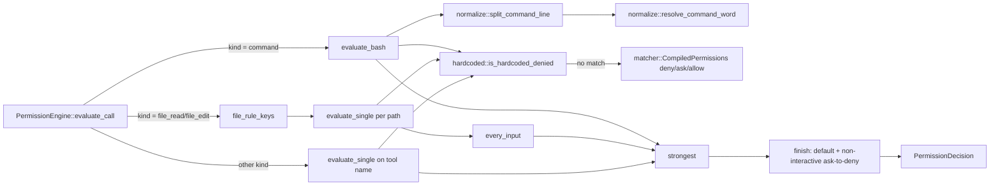

# Core Config

This page covers `crates/crucible-core/src/config/` and its two subtrees,
`config/components/` (including `config/components/permissions/`) and
`config/config/`, plus `config/includes/`. Sixty-two files, none of them
outside `crucible-core`. [[Config Boot]] describes how the daemon evaluates
`init.lua` and binds with the result; [[State Stores]] describes the
daemon-owned JSON registries that overlay this config. This page describes
the schema, the merge and provenance rules, and the permission and credential
logic that `crucible-core` owns outright.

## Purpose and ownership

`crucible-core` owns the canonical config schema, the permission-decision
engine, credential storage, and the flat provenance-tracked config store. Per
`AGENTS.md`, `crucible-core` holds "canonical domain types, config, parser";
this module is the config half of that rule. Every type here is pure and
synchronous: no daemon socket, no Lua VM, no HTTP route. `crucible-daemon`
binds a `Server` from the extracted `CliAppConfig`, runs the `PermissionEngine`
against live tool calls, and layers this config's `Registration` values under
its own JSON registries ([[State Stores]]); `crucible-lua` evaluates
`init.lua` into a `ConfigStore` ([[Luau Host]]); `crucible-web` reads the
extracted config and calls `redact_credentials` before serving it externally
([[Web Server]]). `crucible-cli` does not call `redact_credentials` itself.

This module must not run a daemon, own a socket, or decide daemon lifecycle.
It must not implement a second write path for config: `crucible-lua`'s
`cru.config.set`/`get` and the daemon's `config.save`/`reset`/`pop`/`unset`
RPCs both call into the one `ConfigStore` defined here (`merge`, `save`,
`reset`, `unset`, `pop`), rather than re-implementing rank comparison or leaf
flattening. It must not decide plugin activation order — `plugin_spec.rs`
defines the `Spec`/`SpecEntry` data shape and the rank-merge algebra, but
`crates/crucible-daemon/src/daemon_plugins/activate.rs` runs activation.

## Module map

### `crates/crucible-core/src/config/components/`

| Path | Lines | Role |
|---|---|---|
| `crates/crucible-core/src/config/components/acp.rs` | 497 | `AcpConfig`/`AgentProfile`/`DelegationConfig` — the `[acp]` section for ACP agent profiles and delegation limits; a profile no longer inherits from another. |
| `crates/crucible-core/src/config/components/backend.rs` | 1409 | `BackendType`, the one enum for every AI provider backend; per-variant metadata table, `all()` completeness list. |
| `crates/crucible-core/src/config/components/chat.rs` | 195 | `ChatConfig` — model, agent preference, context budget, `DEFAULT_SYSTEM_PROMPT`, the Precognition no-kiln notice toggle. |
| `crates/crucible-core/src/config/components/cli.rs` | 111 | `CliConfig`/`HighlightingConfig`/`ChatScreen` — terminal syntax-highlighting settings and where the chat TUI draws (`cli.screen`, alternate-screen default). |
| `crates/crucible-core/src/config/components/context.rs` | 84 | `ContextConfig` — which project-rules files (`AGENTS.md`, `.rules`, …) a session loads. |
| `crates/crucible-core/src/config/components/defaults.rs` | 105 | Shared default endpoints, models and lists that `backend.rs` and `enrichment.rs` read from. |
| `crates/crucible-core/src/config/components/llm.rs` | 774 | `LlmConfig`/`LlmProviderConfig`/builder — named provider instances and the specialty-to-model map. |
| `crates/crucible-core/src/config/components/mcp.rs` | 219 | `McpConfig`/`UpstreamServerConfig`/`TransportType` — upstream MCP server connections. |
| `crates/crucible-core/src/config/components/mod.rs` | 37 | Re-export hub for every `components::*` type. |
| `crates/crucible-core/src/config/components/trust.rs` | 272 | `TrustLevel`/`DataClassification` — the trust-versus-sensitivity policy primitive. |

### `crates/crucible-core/src/config/components/permissions/`

| Path | Lines | Role |
|---|---|---|
| `crates/crucible-core/src/config/components/permissions/engine.rs` | 309 | `PermissionEngine` — evaluates a canonical tool call against compiled rules; `evaluate_call` is the decision entry point every daemon caller uses. |
| `crates/crucible-core/src/config/components/permissions/hardcoded.rs` | 70 | `is_hardcoded_denied` — the immutable, non-configurable deny table. |
| `crates/crucible-core/src/config/components/permissions/matcher.rs` | 111 | `PermissionMatcher`/`CompiledPermissions` — `globset`-backed rule compilation. |
| `crates/crucible-core/src/config/components/permissions/mod.rs` | 21 | Re-export hub for the `permissions` component. |
| `crates/crucible-core/src/config/components/permissions/normalize.rs` | 712 | Bash-aware path normalization, command-line splitting, wrapper-stripping command-word resolution. |
| `crates/crucible-core/src/config/components/permissions/parse.rs` | 66 | `parse_rule` — parses one `"tool:pattern"`/`"tool:server:pattern"` rule string. |
| `crates/crucible-core/src/config/components/permissions/types.rs` | 105 | `PermissionMode`, `ParsedRule`, `PermissionConfig`, `PermissionDecision`. |
| `crates/crucible-core/src/config/components/permissions/tests/engine.rs` | 787 | Behavioral suite for `PermissionEngine` — precedence, chaining, unmodellable fallback, wrapper-stripping, and `evaluate_call`'s canonical-call routing. |
| `crates/crucible-core/src/config/components/permissions/tests/hardcoded.rs` | 109 | Unit tests for `is_hardcoded_denied`. |
| `crates/crucible-core/src/config/components/permissions/tests/matcher.rs` | 91 | Unit tests for `PermissionMatcher`/`CompiledPermissions`. |
| `crates/crucible-core/src/config/components/permissions/tests/mod.rs` | 21 | Test wiring plus the shared `config_with_rules` fixture builder. |
| `crates/crucible-core/src/config/components/permissions/tests/normalize.rs` | 201 | Unit tests for path normalization, splitting and command-word resolution. |
| `crates/crucible-core/src/config/components/permissions/tests/types.rs` | 199 | Unit tests for `PermissionMode`, `PermissionConfig`, and `parse_rule`. |

### `crates/crucible-core/src/config/config/`

| Path | Lines | Role |
|---|---|---|
| `crates/crucible-core/src/config/config/cli_app.rs` | 1468 | `CliAppConfig`/`SourcesConfig` — the composite, legacy (pre-Lua-boot) config struct: load, provenance annotation, kiln/project resolution, source-priority order. |
| `crates/crucible-core/src/config/config/errors.rs` | 83 | `ConfigError`/`ConfigValidationError` — the crate-boundary error types. |
| `crates/crucible-core/src/config/config/kiln_name.rs` | 499 | `KilnName` — the validated, case-folding, case-preserving kiln identifier. |
| `crates/crucible-core/src/config/config/mod.rs` | 59 | Re-export hub plus `crucible_home`/`lua_stubs_dir` helpers. |
| `crates/crucible-core/src/config/config/provider.rs` | 27 | `EffectiveLlmConfig` — the resolved provider settings, with a redacting `Debug`. |
| `crates/crucible-core/src/config/config/registry.rs` | 340 | `KilnEntry`/`ProjectEntry` and `resolve_kiln_entries`/`find_kiln_entry`/`synthesized_kiln_name`; a config-declared kiln's own source priority. |
| `crates/crucible-core/src/config/config/server.rs` | 232 | `ServerConfig`, `WebConfig`, `WorkspaceConfig`, `LoggingConfig` — daemon/web/workspace/logging sections. |
| `crates/crucible-core/src/config/config/tests.rs` | 297 | Integration tests for `CliAppConfig` load, legacy-key rejection, provider resolution. |
| `crates/crucible-core/src/config/config/types.rs` | 109 | `ScheduleEntry` and `parse_duration_string`. |

### `crates/crucible-core/src/config/` (top level)

| Path | Lines | Role |
|---|---|---|
| `crates/crucible-core/src/config/credentials.rs` | 979 | `SecretsFile`/`ProviderSecrets` — API key and OAuth token storage at `~/.config/crucible/secrets.toml`; `resolve_api_key`, `resolve_provider_api_key`, `discover_credentials`. |
| `crates/crucible-core/src/config/enrichment.rs` | 712 | `EnrichmentConfig`/`EmbeddingProviderConfig` — embedding provider settings (OpenAI, Ollama, FastEmbed, Mock) and pipeline knobs. |
| `crates/crucible-core/src/config/io_helpers.rs` | 36 | `read_with_workspace_fallback` — shared legacy-`workspace.toml`-fallback reader. |
| `crates/crucible-core/src/config/kiln_config.rs` | 163 | `KilnConfig`/`KilnMeta` — `.crucible/kiln.toml`, the kiln's own name; enforces "a kiln names no directory." |
| `crates/crucible-core/src/config/lua_emit.rs` | 213 | `emit_lua_config` — renders one `cru.config.set({...})` call for `cru config migrate`. |
| `crates/crucible-core/src/config/merge.rs` | 311 | `deep_merge`, `flatten_leaves`, `set_leaf`, `leaf_at`, `nest_leaves` — the one leaf/merge vocabulary. |
| `crates/crucible-core/src/config/mod.rs` | 119 | Module root and public re-export surface for `crucible_core::config`. |
| `crates/crucible-core/src/config/overlay.rs` | 349 | `Registration`/`Overlay`/`overlay_registrations`/`overlay_layers` — config-layer-beats-state-layer precedence. |
| `crates/crucible-core/src/config/patterns.rs` | 1077 | `PatternStore` — persistent allow-pattern storage for bash/file/tool grants. |
| `crates/crucible-core/src/config/plugin_spec.rs` | 412 | `Spec`/`SpecEntry`/`SpecRank` — the plugin spec's data shape and rank-merge algebra. |
| `crates/crucible-core/src/config/project_config.rs` | 166 | `ProjectConfig` — `.crucible/project.toml`, attached kilns and project security policy. |
| `crates/crucible-core/src/config/provenance.rs` | 752 | `ConfigSource`/`ProvenanceMap`/`LastSet` — the eight-layer rank law and pin/reset semantics. |
| `crates/crucible-core/src/config/redact.rs` | 246 | `redact_credentials` — name-based credential redaction for served config. |
| `crates/crucible-core/src/config/security.rs` | 385 | `ShellPolicy`/`ProjectFileAccess` — the agent bash-tool whitelist/blacklist and web project-file access policy. |
| `crates/crucible-core/src/config/serde_helpers.rs` | 7 | `default_true` — one shared serde default helper. |
| `crates/crucible-core/src/config/settings_file.rs` | 259 | `load_settings`/`save_settings_delta` — the `settings.json` machine layer, atomic and hand-edit-preserving. |
| `crates/crucible-core/src/config/store.rs` | 1863 | `ConfigStore` — the flat, ranked, provenance-tracked store used at boot and at daemon runtime. |
| `crates/crucible-core/src/config/tilde.rs` | 53 | `expand_tilde` — the one `~`-expansion helper for every crate. |
| `crates/crucible-core/src/config/workspace.rs` | 165 | `KilnAttachment`/`SecurityConfig` — value types embedded in `ProjectConfig`. |

### `crates/crucible-core/src/config/includes/`

| Path | Lines | Role |
|---|---|---|
| `crates/crucible-core/src/config/includes/merge.rs` | 27 | `merge_toml_values` — deep merge of two TOML trees for `{dir:}` fragments. |
| `crates/crucible-core/src/config/includes/mod.rs` | 71 | Module root and documentation for the include mechanism. |
| `crates/crucible-core/src/config/includes/path.rs` | 29 | `resolve_include_path` — resolves a reference path against a base directory. |
| `crates/crucible-core/src/config/includes/process.rs` | 115 | `process_file_references` — walks a TOML tree and resolves every reference in place. |
| `crates/crucible-core/src/config/includes/reference.rs` | 154 | `RefKind`/`parse_ref_kind`/`read_file_as_value`/`read_dir_as_value` — parses and reads one reference. |
| `crates/crucible-core/src/config/includes/tests/dir_ref.rs` | 410 | Integration tests for `{dir:}` resolution and merging. |
| `crates/crucible-core/src/config/includes/tests/file_ref.rs` | 171 | Integration tests for `{file:}` resolution. |
| `crates/crucible-core/src/config/includes/tests/mod.rs` | 4 | Test module wiring. |
| `crates/crucible-core/src/config/includes/tests/parse_ref.rs` | 67 | Unit tests for `parse_ref_kind`. |
| `crates/crucible-core/src/config/includes/tests/path.rs` | 33 | Unit tests for `resolve_include_path`. |

## Key types and traits

**`AgentProfile`** (`components/acp.rs`) no longer inherits from another
profile. A profile named after a built-in agent lays its fields over that
built-in; any other name must define `command`. `removed_extends:
Option<String>` captures an old config's `extends` key, unread by any other
field, so the daemon can name it in an error instead of failing later with an
unrelated "must define `command`" message. `tools: Vec<AgentKeys>`
(`crate::types::AgentKeys`, a [[Core Domain Types]] type from
`crates/crucible-core/src/types/tool_match.rs`) holds the key table that
classifies the agent's tool calls; `runtime/defaults/init.luau` sets it for
the built-in agents through `cru.config.set`, and a table in the user's own
config for a built-in agent name replaces the shipped table whole.

**`BackendType`** (`crates/crucible-core/src/config/components/backend.rs`) is
the one enum naming every AI provider backend (Ollama, OpenAI, Anthropic,
Cohere, VertexAI, FastEmbed, Burn, GitHubCopilot, OpenRouter, ZAI, Custom,
Mock). A private per-variant metadata table backs
`supports_chat`/`supports_embeddings`/`default_endpoint`/`api_key_env_var`;
`BackendType::all()` is the one iteration order every provider-listing caller
uses. `LlmProviderConfig` (`components/llm.rs`) holds one named provider
instance and is created from TOML/JSON deserialization or
`LlmProviderConfigBuilder`; `LlmConfig` (same file) holds the `default`
pointer, the `providers` map, and the specialty-to-model table, and is a
field of `CliAppConfig`.

**`PermissionConfig`/`PermissionMode`/`PermissionDecision`**
(`components/permissions/types.rs`) are the permission domain's leaf types.
`CompiledPermissions`/`PermissionMatcher` (`matcher.rs`) compile a
`PermissionConfig`'s rule strings into `globset` matchers, created by
`PermissionEngine::new`. `PermissionEngine` (`engine.rs`) holds one
`CompiledPermissions` and is created once per session/tool-call context by
`crucible-daemon` (`tools_bridge.rs`, `agent_manager/session_permissions.rs`,
`agent_manager/messaging/permission.rs`, `rpc/workflow_handlers.rs`); it is
consumed, never mutated, for the lifetime of one call.
`PermissionEngine::evaluate_call` is the canonical-call entry point that the
daemon's unified `decide_permission` chain
(`agent_manager/messaging/gate_decision.rs`) and ACP permission handling
(`agent_manager/messaging/permission.rs`) both call; it routes on
`CanonicalToolCall.kind` (a [[Core Domain Types]] type from
`crates/crucible-core/src/types/tool_call.rs`) rather than a raw tool name,
so one `bash`/`read`/`edit` rule governs both Crucible's own tools and every
ACP agent's equivalent call. `PermissionEngine::evaluate(tool, input,
is_interactive)` still exists as a single-tool-name entry point, but no
production caller in `crucible-daemon` uses it any more; only the crate's
own tests call it directly.

**`ChatConfig`** (`components/chat.rs`) holds the model, agent preference and
context-budget knobs, `DEFAULT_SYSTEM_PROMPT`, and
`precognition_notify_no_kiln: bool` (default `true`). The daemon's agent
manager tells each workspace once per run, as an info notice, when
Precognition is on and a session has no kiln to search; setting
`chat.precognition_notify_no_kiln = false` silences that notice.
**`CliConfig`** (`components/cli.rs`) adds `screen: ChatScreen`
(`Fullscreen` default, `Inline`) — display state of one terminal client, not
a session knob, matching the AGENTS.md rule that display state stays in the
client. `cru chat --inline` overrides it per run; a stdout that is not a
terminal forces the inline mode regardless of the setting.

**`TrustLevel`** (`components/trust.rs`) derives `Ord` from declaration order
(`Untrusted < Cloud < Local`). **`DataClassification`** (same file, `Public`,
`Internal`, `Confidential`) derives no `Ord` of its own; each variant instead
names its `required_trust_level()`. `TrustLevel::satisfies` compares a
`TrustLevel` against that required level and is the one comparison the
daemon's admission logic depends on.

**`CliAppConfig`** (`config/cli_app.rs`) is the composite struct holding every
top-level config section (`acp`, `chat`, `llm`, `enrichment`, `cli`,
`logging`, `context`, `mcp`, `permissions`, `schedules`, `runtimepath`,
`sources`, `plugins`, `web`, `server`, `workspace`, plus the location fields
`kiln_path`, `session_kiln`, `data_home`, `kilns`, `projects`,
`default_kiln`, `agent_directories`) and a `#[serde(skip)]` `source_map` for
provenance. `sources: SourcesConfig` holds `priority:
crate::runtime_path::LevelPriorities`, a new priority for each named level
(a level it does not name keeps its default; an unknown level name is a
config error); `sources` is itself the eighth `LOCATION_CONFIG_KEYS` entry,
so only `init.lua`/the boot merge can set it, matching the existing
boot-only rule for `runtimepath`. `sources.priority` reorders the levels
(`personal`/`workspace`/`kiln`/runtimepath-derived/etc.) used to resolve
which source's cards, skills and themes win a name collision; each
`runtimepath` entry can itself contain `plugins/`, `themes/`, `skills/` and
`agents/` subdirectories, with the first entry at priority 600 and each
later entry one lower. It
is created by `CliAppConfig::load` (legacy TOML loader, kept for `cru config
migrate` and test parity) or by `ConfigStore::extract`, which deserializes
the store's merged JSON `Value` into the same struct — this is the live
daemon boot path ([[Config Boot]]).

**`KilnName`** (`config/kiln_name.rs`) is the validated, allowlist-charset,
case-folded-for-comparison, case-preserved-for-display kiln identifier;
`KilnName::parse` is the strict constructor, `KilnName::normalize` the
best-effort fold from arbitrary text (a directory basename). `KilnEntry`
(`config/registry.rs`) is the `[kilns]` table value (`Path` or `Config { path,
lazy, auto, priority }`); `resolve_kiln_entries` is the one function both
`CliAppConfig::resolved_kilns` and `crucible-daemon`'s `kiln_registry.rs`
call to derive the effective kiln map, including the always-offered,
always-lazy `crucible-docs` bundled entry.
`KilnEntry::Config.priority: Option<crate::runtime_path::Priority>` lets a
config-declared kiln set its own source priority (a named level such as
`"personal"`, or a number); `None` is the level `kiln`. It is config-authored
only — the docs-bundled entry and every entry `resolve_kiln_entries`
synthesizes from the JSON-registry-backed `kilns.json` carry `priority:
None`, since neither `kilns.json` nor a kiln's own config has this field.

**`ConfigStore`** (`config/store.rs`) is the flat, ranked, provenance-tracked
JSON value store. It holds `value: Value`, `provenance: ProvenanceMap`, a
`pins` map, a `LocationPolicy`, and a list of retained `Layer`s (each an
overlay plus the `ConfigSource` and `LocationPolicy` it was merged under).
`ConfigStore::for_load()` (boot, `Accept`) and `ConfigStore::runtime()`
(daemon runtime, `Withhold`) are the two entry points; `crucible-lua`'s
`ConfigState` (`crucible-lua/src/config.rs`) holds one `ConfigStore` for the
lifetime of the plugin VM ([[Luau Host]]). `merge`, `save`, `reset`, `pop`
and `unset` are the only write doors; `extract` is the only typed read.

**`ConfigSource`** (`config/provenance.rs`) is the eight-variant ranked enum
(`Default` < `PluginDefault` < `Settings` < `Toml` < `Lua` < `Registered` <
`Cli` < `Rpc`, via `ConfigSource::rank()`) that every `ConfigStore` write
carries; `ProvenanceMap` records, per dot-joined leaf path, the last
`ConfigSource` that wrote it. `LastSet` embeds a `LuaSource`, canonically
defined in `crucible-core::lua_source` and re-exported by `crucible-lua`, so
a Lua-authored leaf's provenance names the same call site the handler
registry and `cru.storage` use.

**`SecretsFile`/`ProviderSecrets`** (`config/credentials.rs`) hold API keys
and OAuth tokens at `~/.config/crucible/secrets.toml`, mode `0o600`, created
and read independently of `ConfigStore` — credentials never travel through
the Lua config path. **`PatternStore`** (`config/patterns.rs`) holds
persisted bash/file/tool allow-patterns under
`~/.config/crucible/whitelists.d/`, one file per project hash plus a
per-user file, both mode `0o600`.

**`Spec`/`SpecEntry`/`SpecRank`** (`config/plugin_spec.rs`) are the plugin
spec's data shape: `SpecEntry` names a plugin's source (`Runtimepath` or
`Git`) and options; `Spec` holds one entry per name per rank
(`PluginFragment` < `Builtin` < `Operator`) and merges them with `merge`. It
is created and read by `crates/crucible-daemon/src/daemon_plugins/bootstrap.rs`,
`crates/crucible-daemon/src/daemon_plugins/resolve.rs` and
`crates/crucible-lua/src/plugin_spec_store.rs` ([[State Stores]], the "C11
split").

## Flows

### Permission evaluation

`PermissionEngine::evaluate_call(call, args, is_interactive)` is the
canonical-call entry point the daemon's unified `decide_permission` chain
(`agent_manager/messaging/gate_decision.rs`, [[Tools and Admission]],
[[Agent Manager]]) and ACP permission handling
(`agent_manager/messaging/permission.rs`) both call before running a tool
call. The key of a rule decides what the rule reads: a `bash` rule reads the
command line of each `command`-kind call, whichever tool made it; a file
rule reads each path of a call of its file kind (`read` reads a `file_read`
call, `edit`/`write`/`delete` read a `file_edit` call). A call gets kind
`file_read` only when its tool name is one of `CanonicalToolCall::FILE_READ_TOOL_NAMES`
in `crates/crucible-core/src/types/tool_call.rs` (`read_file`, `read_note`,
`read_metadata`, `glob`, `grep`); a path argument on any other tool gives
kind `tool` instead, so a `read:*` allow rule cannot silently cover a
non-read tool such as `delete_file`. Any other rule reads the canonical
tool name, with the JSON `args` as its input.

For a `command`-kind call, `evaluate_bash` splits the command line into
statements (`split_command_line`), resolves each statement's true command
word past wrappers like `sudo`/`timeout`/`env` (`resolve_command_word`), and
checks, in order, the hardcoded deny table, the configured `deny` rules, the
`ask` rules, an unmodellable-construct fallback (a substitution or indirect
execution that resolution cannot fully model degrades to `Ask` rather than
inheriting `allow`), then the `allow` rules; it returns `None` when no rule
decides. A command whose line Crucible cannot read keeps kind `command` with
`command: None`, so a `bash` deny rule still refuses it and, with no such
rule, `unreadable` asks rather than allows. Resolution feeds `deny`/`ask`
only; it never widens what `allow` matches. A file-kind call goes through
`evaluate_single` once per path, keyed on the kind's rule keys
(`file_rule_keys`; a `read` rule never reads an edit), and `every_input`
combines the per-path results: `allow` only when every path allows,
otherwise the strongest non-allow decision among them; a pathless edit keeps
kind `file_edit` so `edit`/`write`/`delete` deny rules still apply. Any other
call goes through `evaluate_single` on the exact tool name. `strongest`
picks `deny` over `ask` (a matched rule over an unmatched default) over
`allow` among the command/file/name lanes that apply to one call — so a
`bash`-keyed rule and a tool-name-keyed rule can both govern one command,
and the stronger wins. The shared `finish` helper applies the configured
default when nothing decided and converts any `Ask` to `Deny` when
`is_interactive` is false, for both `evaluate_call` and the older
single-tool-name `evaluate(tool, input, is_interactive)`, which no
production `crucible-daemon` caller uses any more.

### Boot: seed, merge, extract

`crucible-daemon`'s `evaluate_boot_config` ([[Config Boot]]) creates a
`ConfigStore::for_load()`, merges the shipped defaults
(`ConfigSource::Default`), the `settings.json` layer
(`ConfigSource::Settings`, via `settings_file::load_settings`), and the
`init.lua` evaluation's writes (`ConfigSource::Lua`, via `crucible-lua`'s
`ConfigState`), then calls `end_boot_phase()` to flip the store to
`LocationPolicy::Withhold` and strip location keys from the merged value.
`ConfigStore::extract()` deserializes the merged `Value` into `CliAppConfig`,
which `Server::bind_with_plugin_config` binds with. At runtime, RPC-driven
`config.save`/`reset`/`pop`/`unset` (`crucible-daemon/src/rpc/dispatch.rs`)
call the same `ConfigStore` methods; `save` calls
`ConfigStore::split_pinned` to refuse leaves a higher-ranked layer pins, then
`settings_file::save_settings_delta` to persist the accepted delta.

### Config-layer-over-state-layer overlay

`overlay_registrations`/`overlay_layers` (`config/overlay.rs`) resolve a
config-declared `Registration` (from `CliAppConfig`'s `kilns`/`projects`/
`llm.providers`) against a daemon-written state entry
([[State Stores]]): on a name collision, the config entry always wins; a
disagreeing state entry is recorded in `Overlay::shadowed` rather than
dropped, so `cru kiln list` can show it as inert. Kiln names are compared
through `KilnName::fold_str` so a config entry and a state entry differing
only in case are treated as one contested name, not two.

### TOML include resolution

`process_file_references` (`config/includes/process.rs`) walks a parsed
`toml::Value` tree depth-first; each `String` leaf is checked by
`parse_ref_kind` (`includes/reference.rs`) against the `{file:}`, `{env:}`
and `{dir:}` shapes. A `{file:}` reference reads and, for a `.toml`
extension, parses the target (`read_file_as_value`); a `{dir:}` reference
lists the directory's `.toml` files in sorted order, recurses
`process_refs_recursive` into each fragment, and folds them together with
`includes::merge::merge_toml_values`. Errors are collected rather than
aborting the walk, so one bad reference does not stop the rest of the tree
from resolving. `CliAppConfig::load` calls this after TOML parsing and
before deserialization into the typed struct.

### Credential resolution

`discover_credentials`/`resolve_api_key` (`config/credentials.rs`) check, in
order, the provider's environment variable (from `BackendType::
api_key_env_var`, not a hardcoded list), the `SecretsFile` store, then the
config-supplied key. `crucible-cli`'s `auth`/`wizard` commands and
`crucible-daemon`'s `agent_factory.rs`/`agent_manager/providers.rs` call
these to populate an `EffectiveLlmConfig` without ever writing a secret
through the Lua config path. `resolve_provider_api_key(provider_key,
backend, store, config_key)` additionally resolves a *named* provider
instance (`llm.providers.<key>`): a provider has two names, its key under
`llm.providers` (for example `zai-coding`) and its backend type (`zai`), and
`cru auth login --provider zai-coding` stores the key under the first name.
`resolve_provider_api_key` checks the backend's environment variable and the
credential store under the provider's own key first, then falls back to
`resolve_api_key` for the backend-name lookup and the config value.
`crucible-daemon`'s `agent_factory.rs` and `agent_manager/models.rs` (model
discovery) both call it, so a key that makes a chat turn work also lists the
models. `crucible-daemon`'s `webhook/mod.rs` reads its own, unrelated
`WebhookSecretsFile`, not this module.

## State, concurrency and lifecycle

`ConfigStore`, `CompiledPermissions`/`PermissionEngine`, and every
`components::*` type are plain, synchronous, `Clone` value types with no
`Arc`/`Mutex`/channel of their own; whatever lock protects them is the
caller's — `crucible-lua`'s `ConfigState` and whatever daemon session state
holds a `PermissionEngine` per call. `PatternStore::load` reads through
`tokio::fs`; `PatternStore::save` wraps the sync `save_file` in
`tokio::task::spawn_blocking`. Either way a daemon async task does not block
the runtime on file access; `load_sync`/`save_sync` exist for non-async
callers. `SecretsFile` and `PatternStore`
both write through `crate::fs::write_private` (temp file, then atomic
rename, mode `0o600`); neither takes a file lock, so concurrent writers to
the same secrets or whitelist file can race — undocumented as a limitation
in `credentials.rs`, and not exercised by a concurrency test. `settings_file`
and `store.rs` themselves take no lock either; the daemon serializes access
by routing every write through the RPC dispatch path.

`ConfigStore` has an explicit two-phase lifecycle: `for_load()` starts
`Accept` (location keys — `kiln_path`, `data_home`, `runtimepath`, etc. — are
legitimate authored config during boot), `end_boot_phase()` flips it to
`Withhold` for the daemon's runtime lifetime, after which any RPC-driven
write to a `LOCATION_CONFIG_KEYS` leaf is diverted into the `withheld`
report rather than applied. `rebuild()` (called by `reset`/`unset`/`pop`)
replays every retained `Layer` through `apply` under that layer's own
recorded policy, not the store's current policy, specifically so a runtime
pop cannot strip provenance from a boot-time location key.

## Boundaries and invariants

- **Hardcoded deny is unconditional.** `is_hardcoded_denied` (`hardcoded.rs`)
  runs before any configured rule in both `evaluate_bash` and
  `evaluate_single`; no `PermissionConfig` can override it.
- **Resolution only tightens.** `resolve_command_word`/`split_command_line`
  (`normalize.rs`) feed `deny`/`ask`, never `allow`; a stripped wrapper
  cannot grant an allow the raw command line did not already have
  (`engine.rs`, `tests/engine.rs::stripping_a_wrapper_never_grants_an_allow_it_did_not_have`).
- **A saved allow-pattern is never wider than the action displayed.**
  `PermRequest::suggested_pattern` (in `crucible-core::interaction`, outside
  this page) returns `Option<String>`: it reads the canonical call and
  proposes the command line, the one path of a single-path edit, or the
  exact tool name — dropping a trailing wildcard so the suggestion is never
  wider than the action shown — and returns `None` when the call has no
  single, nameable target (an unreadable command, a multi-path or pathless
  edit, or a call that names nothing); every frontend (the TUI modal, the web
  card, `cru acp`) then offers no "always allow" choice at all for that call,
  only `allow_once`/`reject_once`. A user may still type a wider pattern
  (`PatternStore::add_bash_pattern` accepts `cargo *`);
  `PatternStore::bare_command_wildcard`, screened by `load_file`/
  `load_file_reporting` (`patterns.rs`), refuses only a pattern that is one
  command word plus a bare `*` and nothing else when the store is next read
  back, closing the widest form of that gap.
- **Location keys never travel over the unauthenticated RPC socket.**
  `LOCATION_CONFIG_KEYS`/`SETTINGS_CONFIG_KEYS` (`cli_app.rs`) classify every
  top-level `CliAppConfig` field into exactly one bucket, enforced by the
  test `every_config_key_is_classified_as_a_location_or_a_setting`;
  `ConfigStore::apply` withholds any leaf under a location key once
  `LocationPolicy::Withhold` is active.
  `config.set`/`config.save` refuse to write one, per `cli_app.rs`'s
  doc comment on `LOCATION_CONFIG_KEYS`.
- **Rank has exactly one definition.** `ConfigSource::rank()`
  (`provenance.rs`) is the only ordering the merge, the pin-refusal check,
  and the settings UI consult; `#![deny(clippy::wildcard_enum_match_arm)]`
  and `#![deny(clippy::match_wildcard_for_single_variants)]` at the module
  level fail the build if a new `ConfigSource` variant is matched by a
  wildcard arm anywhere in the crate.
- **A kiln config names no directory.** `kiln_config.rs`'s test
  `a_kiln_config_names_no_directory` asserts that injected `runtimepath`/
  `plugins` keys do not round-trip through `KilnConfig` — the type can only
  ever hold `name`.
  It is the direct code-level enforcement of the AGENTS.md rule that a kiln
  "holds knowledge" and is not itself a place a session's runtime state can
  hide.
- **Credentials are redacted by name, at every depth.** `redact_credentials`
  (`redact.rs`) matches field names ending in `_key`, or equal to (or
  `_`-prefixed with) `token`/`secret`/`password`/`passphrase`/`credential`,
  recursively, rather than a fixed list of paths — the fix for a prior gap
  where `Serialize` (used by the web API) was not redacted the way `Debug`
  was.
- **Two independently defined shell-safety mechanisms coexist.**
  `security.rs`'s `ShellPolicy::is_allowed` (the agent bash-tool
  whitelist/blacklist) does not split on shell metacharacters; `patterns.rs`'
  `PatternStore::matches_bash` (the interactive permission-grant whitelist)
  does, via `split_command_line`, and refuses to match at all when the split
  finds a construct it cannot model. They serve different callers and are
  not cross-referenced from either file.

## Extension seams

- **A new provider backend** adds a `BackendType` variant, a
  `BackendMetadata` table row (`backend.rs`), and, if it has defaults,
  constants in `defaults.rs`. `BackendType::all()`'s declaration order is
  load-bearing for `providers.list`/`cru auth list`, so a new variant's
  position in the match/`all()` pair is checked by
  `all_lists_every_backend_variant_in_declaration_order`.
- **A new permission rule shape** (beyond `tool:pattern` and
  `tool:server:pattern`) changes `parse.rs`'s `parse_rule` and, if it needs
  new matching behavior, `matcher.rs`'s `PermissionMatcher::matches`.
- **A new top-level config section** is a new file under
  `config/components/`, re-exported from `components/mod.rs`, added as a
  field on `CliAppConfig` (`config/cli_app.rs`), and classified into exactly
  one of `LOCATION_CONFIG_KEYS`/`SETTINGS_CONFIG_KEYS` — the classification
  test fails the build until this is done.
- **A new `ConfigSource` layer** is a new `ConfigSource` variant
  (`provenance.rs`) with a `rank()` arm, a `reset_drops()` decision, and a
  `pins_a_leaf()` decision; the crate-level clippy denies force every match
  in the crate to name the new variant explicitly.
- **A new include reference kind** (beyond `{file:}`/`{env:}`/`{dir:}`) adds
  a `RefKind` variant and a `parse_ref_kind` case (`includes/reference.rs`)
  plus a `process_refs_recursive` arm (`includes/process.rs`).
- **A new credential-bearing provider** needs no new code in
  `credentials.rs` itself if `BackendType::api_key_env_var` already answers
  for it — `env_var_for_provider` derives from that table rather than a
  second hardcoded list, specifically because a second list is how two
  providers' keys went undetected once before.

## Tests

- `crates/crucible-core/src/config/components/permissions/tests/engine.rs`,
  `crates/crucible-core/src/config/components/permissions/tests/hardcoded.rs`,
  `crates/crucible-core/src/config/components/permissions/tests/matcher.rs`,
  `crates/crucible-core/src/config/components/permissions/tests/normalize.rs`
  and `crates/crucible-core/src/config/components/permissions/tests/types.rs` —
  the permission engine's behavioral suite: precedence order, chained-command
  semantics, wrapper-stripping (~28 parameterized cases), unmodellable-construct
  fallback, non-interactive ask-to-deny conversion, the hardcoded table's own
  patterns, and `evaluate_call`'s canonical-call routing across `command`/
  `file_read`/`file_edit` kinds (file-kind-vs-path precedence, a bash-keyed
  rule versus a tool-name-keyed rule on one command, and multi-path
  allow-needs-every-path). Pure unit tests, no process boundary crossed.
- `crates/crucible-core/src/config/config/tests.rs` — `CliAppConfig` load,
  legacy-section rejection (`[embedding]`, `[providers]`, `chat.provider`),
  `ServerConfig`'s `deny_unknown_fields` behavior, and `effective_llm_provider`
  resolution. Uses `crate::test_support::EnvVarGuard` and `tempfile`.
- `crates/crucible-core/src/config/includes/tests/dir_ref.rs`,
  `crates/crucible-core/src/config/includes/tests/file_ref.rs`,
  `crates/crucible-core/src/config/includes/tests/parse_ref.rs` and
  `crates/crucible-core/src/config/includes/tests/path.rs` —
  integration tests for the include mechanism against real `TempDir`
  fixtures, including alphabetical override order and nested reference
  resolution.
- Inline `#[cfg(test)]` modules (not separate files, within the file each
  proves): `store.rs` (dozens of `ConfigStore` invariant tests: one-write-one-leaf,
  location withholding, rank-gated merge, `save`/`reset`/`pop` semantics);
  `provenance.rs` (exhaustive `ConfigSource::iter()` walks proving rank
  uniqueness and serde-tag agreement); `kiln_name.rs` (charset rejection
  table, the `normalize`-then-`parse` property test); `registry.rs`
  (`KilnEntry` TOML shapes, synthesized-name rules); `plugin_spec.rs`
  (rank-merge behavior per rank); `patterns.rs` (20+ tests pinned to the
  whitelist-widening bug class); `credentials.rs` (20+ tests, `#[serial]` for
  env-var races); `overlay.rs` (`two_layers_that_differ_only_in_case_are_one_contested_name`);
  `backend.rs` (per-variant metadata assertions, ~132 assertions per its own
  comment).
- Gaps: `context.rs`, `mcp.rs` and `cli.rs` each round-trip their own struct
  directly through an inline `#[cfg(test)]` module rather than a separate
  test file — `context.rs`'s `test_serialize_roundtrip`, `mcp.rs`'s
  `test_mcp_config_serialization`, and `cli.rs`'s
  `the_chat_draws_full_screen_by_default` and
  `the_screen_setting_reads_both_names` for the `screen` field. `credentials.rs`
  and `patterns.rs` write through `crate::fs::write_private` with no file
  lock; no test exercises two concurrent writers to the same secrets or
  whitelist file.

## Findings

- `config/config/cli_app.rs`'s own module doc states the daemon no longer
  boots through `CliAppConfig::load` — `init.lua` evaluated into a
  `ConfigStore` is the live path ([[Config Boot]]). The file is kept
  deliberately for `cru config migrate` and legacy-parity tests, not a
  fallback for the Lua boot; this is consistent with, not a conflict with,
  the AGENTS.md rule that Lua config has no Rust fallback, but a reader
  scanning this file alone could mistake it for the live loader.
- `config/components/defaults.rs`'s doc comment on `DEFAULT_OPENROUTER_MODEL`
  says the constant is "built from one string" with `DEFAULT_ANTHROPIC_MODEL`
  so the two "cannot drift"; the code is two separate string literals tied
  together only by a regression test (`the_openrouter_default_names_the_anthropic_default`).
  The invariant is real but test-enforced, not structurally guaranteed as
  the comment implies.
- `config/config/server.rs`'s `ServerConfig` opts into `#[serde(deny_unknown_fields)]`;
  `WebConfig`, `WorkspaceConfig` and `LoggingConfig` do not, so an unknown key
  under `[web]`, `[workspace]` or `[logging]` is silently ignored rather than
  erroring, unlike an unknown key under `[server]`.
  `LoggingConfig`'s own doc comment lists eleven fields removed from a prior
  revision that were parsed and never read — the removal already happened;
  the comment is a record of it, not live dead code.
- `config/includes/mod.rs`'s module doc describes a `BestEffort` mode (missing
  env vars warn and continue) versus a `Strict` mode (hard error); `process.rs`'s
  actual `RefKind::Env` handling always both warns and pushes an
  "Environment variable not found" error, with no `BestEffort`/`Strict` enum or field
  anywhere in `includes/`. The doc describes a mode that is not implemented.
- `config/components/trust.rs`'s `TrustLevel` derives `Ord` from declaration
  order (`Untrusted < Cloud < Local`) with no test that pins the order itself
  beyond pairwise `>`/`<` assertions; a variant reorder that kept every
  pairwise test passing (a rotation, not a swap) would silently invert a
  security-relevant comparison.
- `config/security.rs`'s `ShellPolicy` and `config/patterns.rs`'s
  `PatternStore` are two independently defined shell command-safety
  mechanisms serving different callers (the agent's `bash` tool versus the
  interactive permission-grant whitelist) with materially different
  bypass-resistance (`ShellPolicy::is_allowed` does no shell-metacharacter
  splitting; `PatternStore::matches_bash` does, via
  `permissions::split_command_line`). Neither file's doc comment cross-references
  the other's existence.
- `config/config/registry.rs`'s `KilnEntry::Config.auto` field is round-tripped
  through serde but, per the file's own doc comment, "nothing in Crucible
  reads it" today — deliberate write-survival for a human-edited file, not a
  live defect.
- `config/io_helpers.rs`'s `read_with_workspace_fallback` takes a
  `_ws_section: &str` parameter that is documented as unused ("kept for API
  clarity") — a minor, acknowledged wart, not a bug.
- `config/mod.rs`'s public re-export list names `resolve_api_key` but not
  `resolve_provider_api_key`, the function every daemon caller actually
  reaches for a named `llm.providers` entry; both `agent_factory.rs` and
  `agent_manager/models.rs` import it through the longer
  `crucible_core::config::credentials::resolve_provider_api_key` path rather
  than the crate's own re-export surface.
