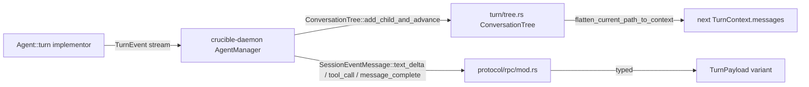
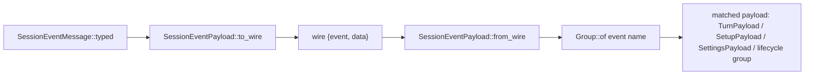
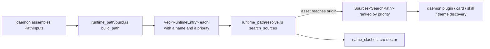

# Core Domain Types

This page covers 126 files under `crates/crucible-core/src/`. It does not
cover the config schema and permission engine ([[Core Config]]), the note
parser (`parser/types/*`, [[Parser]]), or the SQLite link index, embeddings,
and note-edit pipeline ([[Knowledge Storage and Retrieval]]). This page
describes the rest of `crucible-core`'s canonical domain types: what a
session is, how a turn flows, how the daemon and both clients agree on wire
shapes, the trait layer other crates implement against, and the small
cross-cutting utilities and test-support code every other module leans on.

## Purpose and ownership

`AGENTS.md` gives `crucible-core` one ownership row: "Canonical domain
types, config, parser." This page is the domain-types half of that row,
minus config and the parser, which have their own pages. Every type here is
plain data or a trait definition. None of it owns a socket, a database
connection, a Lua VM, or an HTTP route.

`crucible-core` says what a session, a turn, a review ledger, an interaction
request, a wire event, and a runtime-path entry ARE. It does not say how the
daemon stores a session on disk, how it schedules a turn, or how it enforces
a permission gate — those decisions belong to `crucible-daemon`
([[Daemon Server]], [[Agent Manager]], [[Session Services]]). `AgentHandle`
and `SessionKnobs` live in `crucible_daemon::agent_manager::handle` (see
[[Agent Manager]]), not in this crate, since only the daemon ever implements
or holds one — a client drives a session through `DaemonClient` RPCs, never
through a handle. `crucible-core`'s `crates/crucible-core/src/turn/mod.rs`
defines the lower-level `Agent` trait (`turn`/`switch_model`/`cancel`) that
`AgentHandle` is a supertrait of.
A concrete `KnowledgeRepository` (`crates/crucible-core/src/traits/knowledge.rs`)
runs in the daemon's storage layer; this crate defines only the interface.
A concrete `ToolExecutor` runs in the daemon or `crucible-lua`; `ToolSurface`
classification itself is decided by the daemon's
`classify` in `crates/crucible-daemon/src/tools/surface.rs`, named directly in
`crates/crucible-core/src/traits/tools.rs`'s own doc comment.

Three files bend the "plain data" rule on purpose. `crates/crucible-core/src/fs.rs`
writes a credential file atomically, `crates/crucible-core/src/runtime_roots.rs`
(with `bundled_docs.rs`) materializes an embedded tree to disk once at daemon
startup, and `crates/crucible-core/src/git.rs` builds a `git` `Command` with
every repository-selecting environment variable removed, so a caller that
names a directory through `-C`/`current_dir` cannot be redirected to an
inherited `GIT_DIR`. All three are named, single-purpose I/O helpers shared
across crates, not a second business-logic layer. `crates/crucible-core/src/test_support/` is the
other exception: it writes to a `TempDir`, sets real environment variables,
and reads a real `.env.local`. `AGENTS.md` names this crate's `EnvVarGuard`
and hermetic-env pattern directly, so this is documented shared test
infrastructure, not a boundary violation.

Nothing in this page runs a daemon or answers an RPC. `crucible-daemon`,
`crucible-cli`, and `crucible-web` import from these modules and build
behavior on top of them.

## Module map

### `crates/crucible-core/src/` (top level)

| Path | Lines | Role |
|---|---|---|
| `crates/crucible-core/src/bundled_docs.rs` | 153 | Embeds and materializes the `Help/`+`Guides/` doc corpus so an installed `cru` can serve help retrieval. |
| `crates/crucible-core/src/error_utils.rs` | 145 | Strips nested tool-error prefixes (`ToolCallError:`, etc.) for cleaner TUI display. |
| `crates/crucible-core/src/fs.rs` | 84 | Atomic, owner-only-readable (`0o600`) file write helper shared by credential/session-auth writers. |
| `crates/crucible-core/src/fuzzy.rs` | 90 | `FuzzyMatcher` (autocomplete scoring) and `levenshtein` ("did you mean" distance). |
| `crates/crucible-core/src/git.rs` | 41 | `command()` — a `git` `std::process::Command` with the repository-selecting env vars removed, so a caller naming a directory via `-C`/`current_dir` cannot be redirected to an inherited `GIT_DIR`. |
| `crates/crucible-core/src/http.rs` | 326 | `HttpRequest`/`HttpResponse`/`HttpExecutor` — the `reqwest`-backed HTTP type Lua's `http` API wraps. |
| `crates/crucible-core/src/lua_source.rs` | 146 | `LuaSource` — who defined a piece of Lua; deliberately grants no capability. |
| `crates/crucible-core/src/note_frontmatter.rs` | 633 | `split_fences`/`split_yaml_frontmatter`/`set_frontmatter_key` — a byte-exact YAML-frontmatter splice primitive; changes only the lines of one key. |
| `crates/crucible-core/src/paths.rs` | 44 | Shared `CRUCIBLE_PLUGIN_PATH` env parsing and the user plugin directory, read by both the daemon and `crucible-lua`'s standalone loader. |
| `crates/crucible-core/src/recording.rs` | 73 | `RecordingHeader`/`RecordedEvent`/`RecordingFooter` for the granular session-recording file format. |
| `crates/crucible-core/src/runtime_roots.rs` | 527 | Resolves and embeds the shipped `runtime/` tree (plugins, defaults, themes, skills) into the binary; `shipped()` is the split-out half of `for_current_exe()` that excludes the user's `cru setup` copy. |
| `crates/crucible-core/src/serde_helpers.rs` | 3 | Re-export shim for `default_true` (the real definition lives under `config`). |
| `crates/crucible-core/src/sources.rs` | 367 | `Source`/`Sources`/`Entry`/`Lookup`, `sources_new`/`lookup`/`listing`/`first` — the one "which source wins" precedence rule shared by card, skill, theme, default and plugin-command resolution. |
| `crates/crucible-core/src/status_color.rs` | 134 | `StatusColorGroup` (12-variant palette enum) and `plugin_hue` — the shared status-item color vocabulary for both renderers. |
| `crates/crucible-core/src/text.rs` | 203 | Terminal-injection-safe text sanitization (control/bidi/zero-width stripping) and byte/char-safe truncation. |
| `crates/crucible-core/src/utils.rs` | 71 | `glob_match` — the one glob-matching entry point for permission/tool-name patterns. |

### `crates/crucible-core/src/agent/`

| Path | Lines | Role |
|---|---|---|
| `crates/crucible-core/src/agent/integration_test.rs` | 46 | Best-effort smoke test loading real example agent cards from disk, if any ship. |
| `crates/crucible-core/src/agent/loader.rs` | 205 | `AgentCardLoader` — parses agent-card markdown (frontmatter + system prompt) into `AgentCard`, cached by path; always sets the card's `namespace` to `None`. |
| `crates/crucible-core/src/agent/matcher.rs` | 136 | `AgentCardMatcher` — tag/text scoring of `AgentCard`s against an `AgentCardQuery`. |
| `crates/crucible-core/src/agent/mod.rs` | 116 | `AgentCardRegistry` — the in-memory, name-keyed store combining loader and matcher. |
| `crates/crucible-core/src/agent/tests.rs` | 491 | Unit tests for the loader, registry, and matcher. |
| `crates/crucible-core/src/agent/types.rs` | 191 | `AgentCard`/`AgentCardFrontmatter`/`AgentCardQuery`/`AgentCardMatch`/`ToolPolicy` — the "Model Card" schema; `AgentCard.namespace` disambiguates two cards of one name. |

### `crates/crucible-core/src/background/`

| Path | Lines | Role |
|---|---|---|
| `crates/crucible-core/src/background/mod.rs` | 92 | `BackgroundSpawner` trait for detached bash jobs; the daemon implements it. |
| `crates/crucible-core/src/background/types.rs` | 424 | `JobId`/`JobKind`/`JobStatus`/`JobInfo`/`JobResult`/`JobError`, `generate_job_id`. |

### `crates/crucible-core/src/canvas/`

| Path | Lines | Role |
|---|---|---|
| `crates/crucible-core/src/canvas/containment.rs` | 444 | Resolves and validates that a canvas's `file`/`background` references stay inside its owning kiln. |
| `crates/crucible-core/src/canvas/mod.rs` | 619 | `Canvas`/`Node`/`NodeKind`/`Edge` — lossless JSON Canvas 1.0 parse and Obsidian-compatible serialize. |
| `crates/crucible-core/src/canvas/tests.rs` | 436 | Round-trip, spec-surface, graph-projection, and on-disk-fidelity tests for `canvas/mod.rs`. |

### `crates/crucible-core/src/events/`

| Path | Lines | Role |
|---|---|---|
| `crates/crucible-core/src/events/emitter.rs` | 477 | `EventEmitter` trait, `EmitOutcome`/`EventError`, `NoOpEmitter` — the fail-open legacy file-watch event bus. |
| `crates/crucible-core/src/events/mod.rs` | 58 | Module root; documents the removed `Reactor`/`Handler`/`subscriber` system this bus replaced. |
| `crates/crucible-core/src/events/ring.rs` | 461 | `EventRing<E>` — a bounded, thread-safe, power-of-two ring buffer for event history/replay. |
| `crates/crucible-core/src/events/session_event/internal.rs` | 130 | `InternalSessionEvent` — daemon-only pipeline signals wrapped as `SessionEvent::Internal`; six live variants. |
| `crates/crucible-core/src/events/session_event/mod.rs` | 276 | `SessionEvent`/`ScriptingEvent` — the closed, Lua-facing scripting vocabulary; nine scripting names, two with a live `SessionEvent` variant. |
| `crates/crucible-core/src/events/session_event/types.rs` | 69 | `NoteChangeType`/`FileChangeKind` supporting enums. |
| `crates/crucible-core/src/events/session_event/tests/events.rs` | 107 | Tests for the live `SessionEvent` variants (names, summaries, JSON tags). |
| `crates/crucible-core/src/events/session_event/tests/mod.rs` | 12 | Test-module wiring plus a shared `test_path()` helper. |
| `crates/crucible-core/src/events/session_event/tests/types.rs` | 63 | Tests for `NoteChangeType`/`FileChangeKind`/`SessionEvent::default`. |

### `crates/crucible-core/src/interaction/`

| Path | Lines | Role |
|---|---|---|
| `crates/crucible-core/src/interaction/ask.rs` | 416 | `AskRequest`/`AskResponse`/`AskBatch`/`AskQuestion`/`AskBatchResponse`/`QuestionAnswer`. |
| `crates/crucible-core/src/interaction/edit.rs` | 141 | `ArtifactFormat`/`EditRequest`/`EditResponse`/`ShowRequest`. |
| `crates/crucible-core/src/interaction/mod.rs` | 40 | Module root; re-exports the whole renderer-agnostic interaction surface. |
| `crates/crucible-core/src/interaction/permission.rs` | 446 | `PermissionScope`/`PermAction`/`PermRequest`/`PermResponse`, with the `suggested_pattern` safety rule; `PermRequest::from_call` is the one builder every gate uses. |
| `crates/crucible-core/src/interaction/types.rs` | 913 | `InteractionRequest`/`InteractionResponse` (the union of every kind) plus `Popup*`/`Panel*` types. |

### `crates/crucible-core/src/project/`

| Path | Lines | Role |
|---|---|---|
| `crates/crucible-core/src/project/mod.rs` | 8 | Re-export of `Project`/`ProjectKiln`/`RepositoryInfo`. |
| `crates/crucible-core/src/project/types.rs` | 106 | `Project`/`ProjectKiln`/`RepositoryInfo` — registered-project metadata. |

### `crates/crucible-core/src/prompts/`

| Path | Lines | Role |
|---|---|---|
| `crates/crucible-core/src/prompts/mod.rs` | 5 | Re-export of `DEFAULT_SYSTEM_PROMPT`. |
| `crates/crucible-core/src/prompts/templates.rs` | 26 | `DEFAULT_SYSTEM_PROMPT` — the minimal Rust-side fallback, subordinate to Lua's own default. |

### `crates/crucible-core/src/protocol/`

| Path | Lines | Role |
|---|---|---|
| `crates/crucible-core/src/protocol/lifecycle.rs` | 319 | Daemon socket path resolution and creation of the private, per-uid `0700` socket directory. |
| `crates/crucible-core/src/protocol/mod.rs` | 16 | Re-export aggregator for `lifecycle`, `rpc`, `session_events`. |
| `crates/crucible-core/src/protocol/rpc/method.rs` | 391 | `RpcMethod` and `METHODS` from one `rpc_methods!` table, and `rpc_set_method`, the method that writes each `SessionKnob`. The server dispatches on `RpcMethod`, and each client calls a method through it, so a misspelled method does not compile. |
| `crates/crucible-core/src/protocol/rpc/mod.rs` | 593 | `Request`/`Response`/`RpcError`, `SessionEventMessage` and its named constructors (`turn_finished` replaces the deleted `ended`); the `BUSY` error code. |
| `crates/crucible-core/src/protocol/rpc/tests.rs` | 830 | Golden wire-shape regression tests for `SessionEventMessage`, including the migration of old recorded wire forms into their current shape. |
| `crates/crucible-core/src/protocol/requests/mod.rs` | 27 | Declares the ten `requests` submodules and glob re-exports each one, so every type has one path: `crucible_core::protocol::requests::Name`. |
| `crates/crucible-core/src/protocol/requests/agent.rs` | 186 | Request types for `session.*` agent/model/mode RPCs, `models.list`, `providers.list`, `embeddings.models`. |
| `crates/crucible-core/src/protocol/requests/common.rs` | 117 | `DaemonCapabilities`/`CapabilityFlags`/`VersionCheck` and the small shared request shapes (`EmptyParams`, `PathRequest`, `NameRequest`, `SkillsListRequest`, `AgentsListCardsRequest`) more than one submodule needs. |
| `crates/crucible-core/src/protocol/requests/lua.rs` | 126 | Request and reply types for `lua.*` plugin-lifecycle RPCs: init/shutdown session, discover, health check, generate stubs, run plugin tests. |
| `crates/crucible-core/src/protocol/requests/notifications.rs` | 33 | Request and reply types for `notification.list`/`notification.dismiss`. |
| `crates/crucible-core/src/protocol/requests/plugin.rs` | 114 | Request and reply types for `plugin.*`/`project.*`/`surface.*` RPCs, including `SurfaceListReply` and `SurfaceGetReply`. |
| `crates/crucible-core/src/protocol/requests/proposals.rs` | 58 | Request types for `proposal.*` RPCs: list, get, accept, reject, resolve. |
| `crates/crucible-core/src/protocol/requests/session.rs` | 396 | Request and reply types for the bulk of `session.*` RPCs: create, list, get/status, history, pause/resume/end/delete/archive/clear, replay, send-message, interaction-respond, search, export. |
| `crates/crucible-core/src/protocol/requests/storage.rs` | 649 | Request and reply types for kiln registry, text/vector/grep search, note CRUD, link graph, pipeline processing, MCP control, `diff.*`, and `fs.*` RPCs; also `first_per_note`, `ListedComment`, and `GREP_DEFAULT_LIMIT`. The reply types include `KilnRow` (`kiln.list`), `NoteListRow` (`list_notes`), `NoteByNameReply`/`WikilinkTarget` (`get_note_by_name`), `GetBacklinksReply`/`BacklinkEntry` (`get_backlinks`), and `KilnGraphReply`/`KilnGraphNote`/`KilnGraphLink` (`kiln.graph`) — one type per reply, so the daemon builds it and the web route returns it unchanged. All `diff.comment*` replies have `ToSchema` behind the `openapi` feature, so `crucible-web` names them directly. |
| `crates/crucible-core/src/protocol/requests/subscription.rs` | 8 | The `session.subscribe`/`session.unsubscribe` request type. |
| `crates/crucible-core/src/protocol/requests/workflow.rs` | 18 | Request types for `workflow.start`/`approve_gate`. |
| `crates/crucible-core/src/protocol/session_events/lifecycle.rs` | 444 | `JobPayload`/`ReviewPayload`/`NotificationPayload`/`WorkflowPayload`/`SystemPayload`, each declared through the `event_payload!` macro. |
| `crates/crucible-core/src/protocol/session_events/mod.rs` | 461 | `SessionEventPayload`/`Group`/`EventDecodeError` and the `event_payload!` macro — the typed contract layered over the untyped envelope; `migrate`/`migrate_history` keep an old transcript decodable. |
| `crates/crucible-core/src/protocol/session_events/settings.rs` | 85 | `SettingsPayload` — model/mode/scope/title/system-prompt/precognition/context-strategy/plugin-approval/plugin-turn-limit change events, and `CommandsChanged {}`, which says only that a client must read `session.commands` again; it carries no catalog itself. |
| `crates/crucible-core/src/protocol/session_events/setup.rs` | 153 | `SetupPayload` group — the eight session-setup-phase payloads; `acp_resume_fallback` is the one variant an ACP connection, not the setup task, produces. |
| `crates/crucible-core/src/protocol/session_events/tests.rs` | 816 | Mechanism, completeness, fixture-sweep, and persistence tests for the typed payload contract; a golden `session_event_wire_names.txt` list pins every declared name. |
| `crates/crucible-core/src/protocol/session_events/turn.rs` | 397 | `TurnPayload` (15 variants: adds `context_cleared`/`turn_finished`, merges the split ACP-update pair into one `tool_call_update`, and drops `ended`/`injection_pending`) and `ToolResultBody` — the per-turn event stream. |

### `crates/crucible-core/src/runtime_path/`

| Path | Lines | Role |
|---|---|---|
| `crates/crucible-core/src/runtime_path/asset.rs` | 362 | `RuntimeAsset` closed set plus the four total functions (`subdir`/`shape`/`executes`/`reaches`) answering everything about each kind. |
| `crates/crucible-core/src/runtime_path/build.rs` | 481 | `PathInputs`/`KilnRoot`/`build_path` — config, env and session state into a `Vec<RuntimeEntry>`, each entry carrying its own source name and priority. |
| `crates/crucible-core/src/runtime_path/entry.rs` | 430 | `Origin` (priority looked up via `Origin::level`, no longer `Ord`), `PriorityLevel`/`Priority`/`LevelPriorities`, `RuntimeEntry`/`EntryKind`/`SearchPath`. |
| `crates/crucible-core/src/runtime_path/mod.rs` | 29 | Module wiring; re-exports the priority API (`PriorityLevel`, `search_sources`, `name_clashes`, `KilnRoot`); documents the five drifted resolvers this subsystem replaced. |
| `crates/crucible-core/src/runtime_path/resolve.rs` | 282 | `search_paths`/`search_sources`/`name_clashes` — joins `asset` with `entry`'s priorities into a ranked `Sources<SearchPath>`, dropping a lower source that repeats a directory or a name. |

### `crates/crucible-core/src/session/`

| Path | Lines | Role |
|---|---|---|
| `crates/crucible-core/src/session/mod.rs` | 36 | Re-export surface and glossary doc for the session domain types. |
| `crates/crucible-core/src/session/search.rs` | 105 | `SessionSearchMatch`/`SessionSearchResponse` — the reply of `session.search`, and `SessionSearchResponse::to_text`, the one text rendering `cru session search`, the TUI's `/search` and the web's `/search` all share. |
| `crates/crucible-core/src/session/types/agent.rs` | 675 | `SessionAgent` and its `from_profile`/`from_card`/`internal_from_config` constructors; `from_profile` no longer copies the ACP profile's `env` into `env_overrides`. |
| `crates/crucible-core/src/session/types/config.rs` | 47 | `ContextStrategy` — `Truncate`/`Summarize`. |
| `crates/crucible-core/src/session/types/enums.rs` | 128 | `RecordingMode`/`SessionType`/`SessionState`. |
| `crates/crucible-core/src/session/types/id.rs` | 343 | `SessionId` — the validated, path-traversal-safe session identifier. |
| `crates/crucible-core/src/session/types/mod.rs` | 24 | Re-export aggregator for `session/types/*`. |
| `crates/crucible-core/src/session/types/review.rs` | 728 | `Ledger`/`ComposedHunk`/`Integrity`/`HunkId`/`SnapshotId`/`Comment`/`CommentAnchor`/`CommentSide` — the attribution and comment model (no `ReviewState`/`Verdict`/`GateBlock`; a comment owns a diffset). `Comment` and its anchor types have `ToSchema` behind the `openapi` feature; `SnapshotId` implements the trait by hand, so its schema is the plain string of its wire spelling, not its two-arm enum. |
| `crates/crucible-core/src/session/types/session.rs` | 569 | `Session` — the persisted unit of agent interaction, its legacy kiln-path merge logic, and its plugin isolation/approval/turn-limit bookkeeping. |
| `crates/crucible-core/src/session/types/summary.rs` | 69 | `SessionSummary` — a lightweight session-listing projection. |
| `crates/crucible-core/src/session/types/tests/agent.rs` | 401 | `SessionAgent` serialization and `from_profile` tests. |
| `crates/crucible-core/src/session/types/tests/context_strategy.rs` | 40 | `ContextStrategy` parse/display tests, including the removed `sliding_window` name. |
| `crates/crucible-core/src/session/types/tests/mod.rs` | 5 | Test-module wiring. |
| `crates/crucible-core/src/session/types/tests/recording.rs` | 56 | `RecordingMode`/`Session.recording_mode` serialization and back-compat tests. |
| `crates/crucible-core/src/session/types/tests/review.rs` | 418 | Hunk-identity, ledger-append, integrity-grading, and comment-anchor/diffset tests. |
| `crates/crucible-core/src/session/types/tests/session.rs` | 539 | `Session` tests: kiln set, workspace normalization, legacy `meta.json` migration, plugin approval overrides, plugin turn limit back-compat. |

### `crates/crucible-core/src/test_support/`

| Path | Lines | Role |
|---|---|---|
| `crates/crucible-core/src/test_support/env_guard.rs` | 102 | `EnvVarGuard` — RAII single-variable set/restore for env-reading tests. |
| `crates/crucible-core/src/test_support/fixtures.rs` | 319 | `KilnFixture` — `TempDir` markdown-file kiln builders (`Basic`/`Clustering`/`Complex`/`Custom`). |
| `crates/crucible-core/src/test_support/hermetic_env.rs` | 116 | `hermetic_env_pairs` — an allowlisted environment for spawning `cru` child processes in tests. |
| `crates/crucible-core/src/test_support/local_env.rs` | 144 | Reads a gitignored `.env.local` for opt-in real-provider tests. |
| `crates/crucible-core/src/test_support/mocks/event_emitter.rs` | 497 | `MockEventEmitter<E>` — a configurable, observable `EventEmitter` test double. |
| `crates/crucible-core/src/test_support/mocks/mod.rs` | 22 | Mock-module aggregator. |
| `crates/crucible-core/src/test_support/mod.rs` | 47 | `test_support` aggregator plus `kiln_path_str`/`nonexistent_path`. |

### `crates/crucible-core/src/traits/`

| Path | Lines | Role |
|---|---|---|
| `crates/crucible-core/src/traits/auth.rs` | 8 | `AuthHeaders` type alias for provider auth-hook responses. |
| `crates/crucible-core/src/traits/chat.rs` | 161 | `ChatError`, `PrecognitionNoteInfo`, `ChatToolResult`, `ChatToolCall` (the one model tool-call record: `name`, parsed `arguments`, optional `id`). `SessionKnobs`/`AgentHandle` and the per-plugin approval floor and turn-limit knobs live in `crucible_daemon::agent_manager::handle` — see [[Agent Manager]]. |
| `crates/crucible-core/src/traits/context_ops/context_ops_tests.rs` | 170 | Tests for `ContextMessage` construction, `Range`'s tagged-JSON serde, and the injection envelope's tag-forging resistance. |
| `crates/crucible-core/src/traits/context_ops/mod.rs` | 257 | `ContextMessage`/`MessageMetadata`, `Position`, `Range` — Lua's context-manipulation primitives; `ContextMessage::injection`/`escape` tag a daemon-injected system message with its `kind`/`source`. |
| `crates/crucible-core/src/traits/knowledge.rs` | 167 | `KnowledgeRepository` trait, `NoteInfo`/`NoteLinks`. |
| `crates/crucible-core/src/traits/llm.rs` | 145 | `MessageRole`/`LlmToolDefinition`/`FunctionDefinition`/`TokenUsage`. |
| `crates/crucible-core/src/traits/mcp.rs` | 260 | `ContentBlock`/`ToolCallResult`/`McpToolInfo`/`McpServerInfo`/`McpTransportConfig`/`McpError`. |
| `crates/crucible-core/src/traits/mod.rs` | 32 | Trait-layer re-export root — every crate implementing these traits imports through here. |
| `crates/crucible-core/src/traits/parser.rs` | 5 | Re-export of canonical parser types under the `traits::` namespace. |
| `crates/crucible-core/src/traits/provider.rs` | 191 | `ModelCapability`/`UnifiedModelInfo` — provider capability description. |
| `crates/crucible-core/src/traits/tools.rs` | 465 | `ToolExecutor` trait, `ToolSurface`, `ExecutionContext`/`ToolDefinition`/`ToolExample`. |

### `crates/crucible-core/src/turn/`

| Path | Lines | Role |
|---|---|---|
| `crates/crucible-core/src/transcript/mod.rs` | 1031 | `TranscriptFold`, `Transcript`, `TranscriptItem`, `TranscriptOp`: the one fold from session events to what a client draws (user turns, answer segments, tool cards, delegations, injected context, notices). `TranscriptFold::apply` gives the ops of each event; `Transcript::apply` replays them on a snapshot. An item has the `timestamp` of the event that made it (an answer segment: the event that ended it). An answer segment names the `model` of the session, and its `usage` has `cache_read_tokens`. `Precognition` keeps its `query_summary`. The markdown export, the Lua history rows and `cru session` read these fields. |
| `crates/crucible-core/src/transcript/tests.rs` | 490 | The fold of a live turn and of its stored events give one transcript; the ops rebuild the snapshot; golden files in `assets/fixtures/golden/transcript/` hold the fold of five recordings. |
| `crates/crucible-core/src/turn/mod.rs` | 719 | `TurnEvent`/`Agent` trait/`StopReason`/`AgentCapabilities`/`TurnContext`/`TurnStatus`/`TurnOrigin` — the unified agent-event protocol; a turn ends before any handler-requested follow-up runs. |
| `crates/crucible-core/src/turn/tree.rs` | 622 | `ConversationTree`/`TurnNode`/`NodeContent`/`NodeId` — the append-only, branchable conversation store; `NodeContent::Plugin` gives a plugin-requested turn its own node kind. |

### `crates/crucible-core/src/types/`

| Path | Lines | Role |
|---|---|---|
| `crates/crucible-core/src/types/acp.rs` | 100 | `FileDiff` and re-exports of the raw ACP schema types under `types::acp::schema`. |
| `crates/crucible-core/src/types/command.rs` | 248 | `BuiltinCommand` (the commands every client provides), `CommandKind` (`Builtin`/`Mode`/`Plugin`/`Skill`/`Agent`), `SessionCommand` (one catalog entry), `SendOutcome` (`Turn { message_id }` or `Command { command, result }`, `session.send_message`'s reply), and `split_slash_command`. |
| `crates/crucible-core/src/types/database.rs` | 71 | `DocumentId`/`SearchResult`/`BlockRef`. |
| `crates/crucible-core/src/types/knob.rs` | 346 | `SessionKnob`/`AcpKnob`/`AgentConfigOption` — which per-session settings exist and how ACP handles them; `SessionKnob::PluginTurnLimit` is a daemon-only knob. |
| `crates/crucible-core/src/types/mcp_status.rs` | 20 | `McpServerInfo` (display-only) for the `mcp_servers_ready` setup event. |
| `crates/crucible-core/src/types/mode.rs` | 447 | `WriteMode`/`BuiltinMode`/`ModeDescriptor`/`SessionModes` — mode presentation and whether a mode's note writes apply to disk or are recorded as proposals. `SessionModes::next_mode`/the free function `next_mode` give the mode after the current one, wrapping, for `/mode` and its `Shift+Tab` equivalent. |
| `crates/crucible-core/src/types/mod.rs` | 95 | Re-export root for `types/*`; documents where each canonical type actually lives. |
| `crates/crucible-core/src/types/notification.rs` | 309 | `Notification`/`NotificationScope`/`NotificationKind`; a session scope wins over workspace/kiln scoping. |
| `crates/crucible-core/src/types/plugin_status.rs` | 24 | `PluginStatusEntry` for the `plugins_discovered` setup event. |
| `crates/crucible-core/src/types/popup.rs` | 92 | `PopupEntry` — the cross-platform simple popup-list-item type. |
| `crates/crucible-core/src/types/provider_info.rs` | 20 | `ProviderInfo` for the `providers_listed` setup event and `list_providers` RPC. |
| `crates/crucible-core/src/types/skill.rs` | 48 | `SkillSummary`/`SkillDetail`/`SkillsReply` — the `skills.list`/`skills.search`/`skills.get` replies, moved from `crucible-daemon` so the daemon client and the web route name the same type. |
| `crates/crucible-core/src/types/status_item.rs` | 108 | `StatusDisplayItem`/`StatusItemKind`/`StatusProgress` — the `session.status` reply and `status_items_changed` event payload. |
| `crates/crucible-core/src/types/surface.rs` | 135 | `Surface`/`Shape`/`Mark`/`SurfaceRow` — the plugin-surface wire types a `cru.surface.declare`d panel serializes as, moved from `crucible-lua` so the daemon, the web route and `crucible-lua` name the same type. |
| `crates/crucible-core/src/types/tool_call.rs` | 612 | `BuiltinKind`/`CanonicalToolCall`/`ToolRender`/`RenderField` — the canonical, cross-crate tool-call classification and display projection. |
| `crates/crucible-core/src/types/tool_match.rs` | 813 | `classify_acp`/`AgentKeys`/`KeyPattern`/`RawToolCall` — the default matcher that turns an ACP tool call into a `CanonicalToolCall`. |
| `crates/crucible-core/src/types/tool_ref.rs` | 181 | `ToolRef`/`ToolSource` — a unified tool reference spanning core, native, MCP, plugin and ACP sources. |
| `crates/crucible-core/src/types/undo.rs` | 13 | `UndoSummary`. |

### `crates/crucible-core/src/workflow/`

| Path | Lines | Role |
|---|---|---|
| `crates/crucible-core/src/workflow/engine.rs` | 1067 | `WorkflowExecution` state machine — flattens a `WorkflowDoc` to slots, `tick()`s one at a time, joins parallel groups. |
| `crates/crucible-core/src/workflow/events.rs` | 55 | `WorkflowEvent`, `AssessmentOutcome`. |
| `crates/crucible-core/src/workflow/handler.rs` | 83 | `StepHandler` trait, `DispatchTable` — table-driven step-type dispatch. |
| `crates/crucible-core/src/workflow/mod.rs` | 39 | Module wiring; documents the "Phase 3a" scope (dispatch table now, Lua translation later). |
| `crates/crucible-core/src/workflow/stdlib.rs` | 73 | `DefaultHandler`/`GateHandler`, `stdlib_dispatch` — the two bundled step handlers. |

## Key types and traits

**Session identity and lifecycle.** `SessionId` (`session/types/id.rs`) is
an allowlist-validated newtype (`[A-Za-z0-9._-]`, one path component); it is
the only type permitted to name a session directory. `Session`
(`session/types/session.rs`) holds `id`, `session_type`, `kilns`, an
optional `workspace`, `state`, `agent: Option<SessionAgent>`, and more; a
hand-written `Serialize`/`Deserialize` pair runs legacy kiln-path migration
on every load. `Session` no longer holds a per-session `NotificationQueue`
(the daemon owns one notification store instead); it does hold
`isolation_record: Option<IsolationRecord>` (which plugin claimed isolation
for the session, and whether the session or the plugin's config asked for
it), `plugin: Option<String>` (the plugin that created the session, recorded
for every `SessionType`), `plugin_approvals: BTreeMap<String, PluginApproval>`
(`Inherit`/`Ask`/`Stop`, a per-plugin permission-floor override), and
`plugin_turn_limit: u32` (default 25, the consecutive plugin turns allowed
before the daemon raises that plugin's approval floor to `Ask`). `SessionAgent`
(`session/types/agent.rs`) is built by `from_card`/`from_profile`/
`internal_from_config`, layering an `AgentCard` or an ACP `AgentProfile` over
a base agent, narrowing tool policy and MCP servers under a delegating
parent; `from_profile` leaves `env_overrides` empty, because the ACP
launcher reads the profile's own `env` map from config at every spawn rather
than have a copy in the session row win over the session's own overrides.
`SessionSummary` (`session/types/summary.rs`) is a `From<&Session>` listing
projection, and it is the one reply shape of `session.create` and
`session.list`: every field the record always has (`id`, `session_type`,
`kilns`, `workspace`, `state`, `started_at`, `event_count`, `archived`) is
required, not `Option`; only a field the record can genuinely lack
(`title`, `agent_model`, `last_activity`, `parent_session_id`) is
`Option`. `SessionDetail` (same file) is what `session.get` answers: a
`SessionSummary` flattened onto the wire (`#[serde(flatten)]`) plus the
full-record fields (`agent`, `continued_from`, `plugin_approvals`,
`plugin_turn_limit`, `recording_mode`), required wherever the record
always has a value. `SessionDetail` derefs to `SessionSummary`.
`ContextStrategy`/`RecordingMode`/
`SessionType`/`SessionState` (`session/types/config.rs`, `enums.rs`) are
small closed sets. The daemon's session storage, `agent_manager`, and server
RPC handlers create, hold, and mutate all of these; `crucible-cli` and
`crucible-web` read them.

**Review.** `Ledger` (`session/types/review.rs`) is an append-only,
per-root record of tool-call write intervals; `HunkId::derive` hashes
root/path/before/after/base-range into a stable content identity, never
positional. `ComposedHunk` is a difference between the session base and the
worktree, attributed to tool calls; the session record diffset (`Diffset`,
`crates/crucible-core/src/diff.rs`, documented on [[Review]]), not
`ComposedHunk`, is what a client renders. `Integrity`/`SkipKind` grade journal-read failures, marking a
root degraded when its attribution cannot be trusted; there is no
gate-facing `Verdict` any more — the review gate, the reject-revert, and the
undo stack were removed. `Comment` now belongs to a `diffset: DiffsetId`
rather than a session, and anchors on a `CommentAnchor`
(`Snapshot`/`Commit`/`Proposal`) with a `CommentSide` (`Base`/`Current`) and a
`quoted` string recording the text of its range at comment time, so a later
listing can find the range again after the text moves. The daemon's `review/`
module (`crates/crucible-daemon/src/review/`) is the sole creator and holder
of a `Ledger`; this crate defines the shape and the identity rules only
([[Review]]).

**Turn protocol and conversation tree.** `TurnEvent` (`turn/mod.rs`) is the
one event type every agent backend emits: `TextDelta`, `Thinking`,
`ToolCall{id, name, args, call: Option<Box<CanonicalToolCall>>}`,
`ToolCallUpdate{id, call}`, `ToolResult`, `ToolBatchEnd`,
`ContextAttach{message: ContextMessage}`, `Usage`, `ContextWindow`,
`Done{StopReason}`, `Error`, and more. `HandlerInjection` no longer exists: a
turn now ends before any `turn:complete` handler's follow-up runs, and that
follow-up is a new, independently-admitted turn, not a re-entry into the one
that just finished. `TurnStatus` (`Completed`/`Cancelled`/`HandlerCancelled`/
`TimedOut`/`Failed`) says what happened to a whole turn, carried by the
`turn_finished` wire event; `TurnOrigin` (`User`/`Plugin(name)`/`Relay(name)`)
says who asked for it, nested as `{kind, name}` on `user_message` and on the
render payload. The `Agent` trait's `turn` method returns a
`BoxStream<'a, TurnEvent>` borrowing `&'a mut self`, so a caller must hold
that borrow for the stream's life. `ConversationTree`/`TurnNode`/`NodeContent`
(`turn/tree.rs`) is the append-only, branchable store backing undo/fork/retry;
`NodeContent::Plugin{name, text}` records a plugin-requested turn distinctly
from `NodeContent::User`, and both count as turn boundaries for
`undo_depth`/`undo_turns`. `flatten_current_path_to_context` projects the
current path to `Vec<ContextMessage>` for the next `TurnContext`, projecting
a `Plugin` node as a `System`-role `ContextMessage::injection`, not a `User`
message. `crucible-daemon`'s `AgentManager`/`agent_manager/slot.rs` owns the
tree per session and drives every concrete `Agent` implementation
([[Agent Manager]]).

**The trait layer (dependency inversion).** `SessionKnobs`/`AgentHandle` are
part of `crucible_daemon::agent_manager::handle`'s trait layer (see [[Agent
Manager]]), not this crate's, since the only implementors
(`AcpAgentHandle`, `GenaiAgentHandle`) and the only holder (`SessionSlot`'s
`BuildCache`) are daemon-internal, and no client crate implements or holds
one. What stays here is `Agent` (`crates/crucible-core/src/turn/mod.rs`):
`turn`/`switch_model`/`cancel`, the lower-level surface `AgentHandle` is a
supertrait of.
`KnowledgeRepository` (`traits/knowledge.rs`) decouples note retrieval from
SQLite storage. Its methods return `anyhow::Result`, because no caller
matches a variant. The crate root defines no error type. `ToolExecutor`/`ToolSurface` (`traits/tools.rs`) is the
tool-execution and security-classification boundary; `ToolSurface`
deliberately has no `Default`, so an unclassified tool cannot be silently
treated as safe. `ContextMessage`/`Range` (`traits/context_ops/mod.rs`) is
the conversation message type Lua's `remove_messages` and the scheduler
both use; `ContextMessage::injection`/`escape` wrap a daemon-injected system
message (Precognition, `cru.context.attach`, a plugin turn) with a
`<system-message kind="..." source="...">` envelope and record `kind`/
`source` in `MessageMetadata`, so a client or a later handler can tell an
injection from ordinary history and cannot be tricked by injected text that
contains its own fake envelope. `MessageMetadata::tool_calls` holds
`ChatToolCall` (`traits/chat.rs`), the same record that the daemon stream,
the permission gate and the provider handles use. `MessageRole`/`TokenUsage`
(`traits/llm.rs`) and `ContentBlock`/`McpError` (`traits/mcp.rs`) are shared
LLM/MCP wire-adjacent types. Every trait's real, business-logic
implementation lives in `crucible-daemon` or `crucible-cli`; `crucible-core`
itself implements no forwarding boxed-trait impl for the chat traits, since
`AgentHandle`/`SessionKnobs`'s `Box<dyn AgentHandle + Send + Sync>` impls
live in `handle.rs` with the traits (see [[Agent Manager]] for that
boxed-forwarding hazard).

**Interaction protocol.** `InteractionRequest`/`InteractionResponse`
(`interaction/types.rs`) unify `AskRequest`, `AskBatch`, `EditRequest`,
`ShowRequest`, `PermRequest`, `PopupRequest`, and `InteractivePanel` into one
correlated exchange. `InteractionRequest::KINDS` is a hand-maintained,
exhaustive-match-checked list; a new variant fails to compile until it is
added there, which in turn fails coverage tests in `crucible-lua` and the web
bundle. `PermRequest` (`interaction/permission.rs`) carries the full
`CanonicalToolCall` (render, ACP agent, raw tool name), the `layer` that
asked, and the turn's `TurnOrigin`, so a permission prompt shows everything
known about the call, not just its name and arguments; `PermRequest::from_call`
is the single builder every gate uses, for both Crucible's own tools and an
ACP agent's calls. `PermRequest::suggested_pattern` returns `Option<String>`
— `None` when no grant can safely name the call (an unreadable command, a
multi-path or path-less edit, or a call nothing names) — and, when it
returns `Some`, the pattern is never wider than the action a user actually
saw. `crucible-lua`'s `cru.ui.*` API, `crucible-daemon`'s
`agent_manager`/`session_bridge`, and both the TUI and web renderers all
consume this vocabulary.

**The event system.** Two disjoint vocabularies exist by design.
`EventEmitter`/`EventRing` (`events/emitter.rs`, `events/ring.rs`) back the
legacy but still-live file-watch bus. `SessionEvent`/`InternalSessionEvent`/
`ScriptingEvent` (`events/session_event/*`) is the Lua-facing scripting
vocabulary; it is not the wire type. `SessionEventPayload`/`Group`
(`protocol/session_events/mod.rs`) is the wire-facing transport vocabulary,
split into `TurnPayload`, `SetupPayload`, `SettingsPayload`, and the five
groups in `lifecycle.rs` (`JobPayload`, `ReviewPayload`,
`NotificationPayload`, `WorkflowPayload`, `SystemPayload`). Each group enum
is declared through a shared `event_payload!` macro, which pairs one
`"wire_name" => Variant { .. }` literal with the serde rename, the
`WIRE_NAMES` list, any named constant, and a `declares` predicate, so the
name list cannot drift from the enum it describes.
`TurnPayload::as_scripting_event` is the one bridge between the two.

**Wire protocol.** `SessionEventMessage` (`protocol/rpc/mod.rs`) is the
`{event, data}` envelope every daemon broadcast travels as, built through
named constructors (`text_delta`, `tool_call_with_metadata`, `turn_finished`,
and about twenty more) or through `typed`, which calls
`SessionEventPayload::to_wire`. `turn_finished` is the turn's one terminal
wire event, carrying `TurnStatus`/`StopReason`/an error string; it replaces
the deleted `ended` constructor and `TurnPayload::Ended` entirely (the daemon
no longer sends `ended`). `tool_call_with_metadata`/`tool_call_update` take a
`CanonicalToolCall` rather than a `lua_primary_arg` string and a raw
`Vec<FileDiff>`, so the diffs, the render line and fields, the ACP agent, and
the raw wire form all travel together on one type, once.
**Request and reply types.** `crates/crucible-core/src/protocol/requests/`
holds every RPC method's request and reply type: a client serializes one,
and the daemon's own handler deserializes the identical type, so a field
rename in one place changes what the daemon accepts. `mod.rs` glob
re-exports all ten submodules, so a caller names a type as
`crucible_core::protocol::requests::Name` and never needs the daemon crate
to reach it. `crates/crucible-daemon/src/rpc_client/client/` holds only the
`DaemonClient` methods that build and send these types over RPC ([[RPC
Client]]); `storage.rs` also carries `ListedComment` (moved out of
`crates/crucible-daemon/src/diff/comments.rs`) and `GREP_DEFAULT_LIMIT`
(moved out of `crates/crucible-daemon/src/server/grep.rs`), because a
client and the daemon's own handler both name them.

`SessionEventMessage::plugin_message` exists alongside `user_message`, for a
turn a `turn:complete` handler started, tagging `TurnPayload::UserMessage.origin`
with `TurnOrigin::Plugin`. `protocol::BUSY = -32009` is a standard error code
alongside `INTERNAL_ERROR`/`INVALID_PARAMS`/`INVALID_REQUEST`/
`METHOD_NOT_FOUND`/`PARSE_ERROR`. `Group::of` is the single event-name-to-type
dispatch table (71 wire names across 8 groups); it composes each group's
macro-generated `declares` predicate rather than matching one hand-written
literal table, so the table cannot drift from the enums it routes.
`protocol::session_events::migrate`/`migrate_history` give an old, already
recorded wire event its current typed form — `SessionEventPayload::from_wire`
runs `migrate` before every decode, and the daemon's history loader runs
`migrate_history` over a whole stored transcript. `Request`/`Response`/
`RpcError` is the plain JSON-RPC envelope. `crucible-daemon` constructs
these; `crucible-cli`'s TUI, `crucible-web`'s SSE layer, and any RPC client
decode them ([[RPC Client]]).

**Runtime-path resolution.** `RuntimeAsset` (`runtime_path/asset.rs`) is a
five-variant closed set (`Plugins`, `Skills`, `Cards`, `Themes`, `Defaults`);
its four methods (`subdir`, `shape`, `executes`, `reaches`) are compile-time
exhaustive, enforced by `#![deny(clippy::wildcard_enum_match_arm)]`.
Skills-vs-cards kiln/workspace precedence (the deleted
`kiln_outranks_workspace`) is now just the `PriorityLevel` ordering
(`Workspace` above `Kiln`), not a per-asset exception. `Origin`
(`runtime_path/entry.rs`) names where a root came from; `Origin::level` maps
it to a `PriorityLevel` (`Env`, `Personal`, `Workspace`, `Kiln`,
`Runtimepath`, `Harness`, `Runtime`, `Plugin`, `Builtin`), and
`default_priority` or a config's `sources.priority` override decides the
number `search_sources` sorts by — position in `Origin`'s declaration means
nothing; `Origin` no longer derives `Ord`. `build_path` (`runtime_path/build.rs`)
assembles `PathInputs` (config, env, and a `KilnRoot` per attached kiln) into
a `Vec<RuntimeEntry>`, each entry carrying its own source name and priority;
`search_sources` (`runtime_path/resolve.rs`) sorts that list by priority for
one `RuntimeAsset` into a `Sources<SearchPath>` (`crate::sources`, the shared
"which source wins" resolver also behind card/skill/theme/default/plugin-
command precedence), and `name_clashes` reports the lower-priority sources a
name collision dropped, for `cru doctor`. `crucible-daemon`'s
`runtime_path.rs` assembles `PathInputs` for plugin discovery from the
shared `SourceRoots`, but it is not the only assembler: `agent_cards.rs`
assembles its own `PathInputs` for card discovery and
`skills/discovery.rs` assembles its own for skill discovery, each from the
same `SourceRoots`. `cru doctor` calls all three paths and reports the
`name_clashes` of each.

**Workflow engine.** `WorkflowExecution` (`workflow/engine.rs`) flattens a
parsed `WorkflowDoc` into a `Vec<Slot>` (gates, steps, parallel groups),
holds a cursor and an `OutputScope`, and advances exactly one slot per
`tick()`. `StepHandler`/`DispatchTable` (`workflow/handler.rs`) resolve a
step's `[type:: X]` heading to a handler; `stdlib_dispatch`
(`workflow/stdlib.rs`) registers the two bundled handlers (`default`,
`gate`). `WorkflowEvent`/`AssessmentOutcome` (`workflow/events.rs`) are the
pure domain events the daemon bridges into `SessionEventMessage`.
`crucible-daemon`'s `workflow_registry.rs` and `rpc/workflow_handlers.rs`
own the `WorkflowExecution` instance, drive `tick`, and persist
`WorkflowSnapshot` between RPC calls.

**Agent cards and background jobs.** `AgentCard`/`AgentCardRegistry`
(`agent/*`) is the "Model Card" metadata-about-agents pattern, consumed by
`crucible-cli`'s `agents` command and by `SessionAgent::from_card`. A card's
`namespace: Option<String>` field records which plugin source discovered it,
disambiguating two same-named cards so a bare-name lookup resolves
deterministically by layer while a full `source:name` always resolves to one
card; `AgentCardLoader` always sets `namespace` to `None` — the daemon's
plugin loader assigns the real value outside this crate.
`BackgroundSpawner`/`JobKind`/`JobStatus` (`background/*`) covers only
genuinely detached bash jobs; subagent delegation runs through the daemon's
own scheduler, not this trait, though `JobKind::Subagent` is still
constructed by `crates/crucible-daemon/src/delegation.rs` as a display/
bookkeeping wrapper around that real session.

**Small display and domain types (`types/`).** `CanonicalToolCall`/
`ToolRender` (`types/tool_call.rs`) is the one shared "what is this tool
call, and how should it render" projection for both Crucible's own tools and
ACP calls, used across the daemon's ACP client, permission gate, Lua render/
permission handlers, and the web/TUI tool cards; a kind is an open string,
not a closed enum, and classification (`CanonicalToolCall::crucible_tool`)
is split from rendering (`ToolRender`, computed once by the daemon; `None`
in an older transcript). `classify_acp`/`AgentKeys`/`KeyPattern`/
`RawToolCall` (`types/tool_match.rs`) is the default matcher that builds a
`CanonicalToolCall` from an ACP `tool_call`/`tool_call_update` frame and an
agent's key table (Lua data, from the agent profile's `tools` field, not a
Rust structure that ships per-agent knowledge); `classify_acp`'s fixed
precedence order is diff content, then MCP tool name, then ACP kind and
locations, then the key table, then the usual `rawInput` keys, then a
`tool` fallback. `CanonicalToolCall::runs_in_crucible` distinguishes a call
Crucible itself executes from an ACP agent's own same-named tool, and gates
the read-only exemption. `ToolRef`/`ToolSource` (`types/tool_ref.rs`) spans
core/native/MCP/plugin/ACP tool provenance. `WriteMode`/`ModeDescriptor`
(`types/mode.rs`) say whether a mode's note writes apply to disk (`Apply`,
the default) or are recorded as an unapplied proposal (`Propose`);
`effective_for`/`degraded_for` force `Apply` for any agent type other than
`"internal"`, because the daemon cannot hold back a write an external ACP
agent already made in its own process — this replaces the deleted
`ReviewPolicy`, which had no `Propose`-equivalent and computed review
strength as a floor over what an agent type could enforce. `SessionKnob`/
`AcpKnob` (`types/knob.rs`) name the five-member closed set of per-session
settings (`Model`, `Mode`, `ContextStrategy`, `Precognition`,
`PluginTurnLimit`) and how each one behaves on an ACP session.
`Notification`/`NotificationScope` (`types/notification.rs`, now
session-scopable, with a session scope taking priority over workspace/kiln
scoping), `StatusDisplayItem`/`StatusItemKind`/`StatusProgress`
(`types/status_item.rs`, the one wire shape for the `session.status` reply
and the `status_items_changed` event) with `StatusColorGroup`/`plugin_hue`
(`status_color.rs`) naming its color, `DocumentId`/`SearchResult`
(`types/database.rs`), and `FileDiff` (`types/acp.rs`) round out the
cross-crate wire vocabulary.

**Test support.** `EnvVarGuard` (`test_support/env_guard.rs`) restores one
environment variable on drop, for env-reading tests only.
`hermetic_env_pairs` (`test_support/hermetic_env.rs`) builds an allowlisted
environment for spawning a `cru` child so real provider credentials never
leak into a test process. `KilnFixture` (`test_support/fixtures.rs`) builds
`TempDir` markdown kilns. `MockEventEmitter` (`test_support/mocks/event_emitter.rs`)
is a configurable, observable `EventEmitter` test double behind an
`Arc<Mutex<_>>`. Every crate's test suite that needs a fake event bus, a
scoped child environment, or a disposable kiln imports from here.

## Flows

### A turn's event stream becomes wire events and tree nodes

A concrete `Agent::turn` implementation (in `crucible-daemon` or
`crucible-cli`) streams `TurnEvent`s. The daemon's `AgentManager` reads the
stream, folds each event into the session's `ConversationTree`
(`add_child_and_advance`), and builds the matching
`SessionEventMessage`/`TurnPayload` for broadcast.

`TurnEvent::ContextAttach{message: ContextMessage}` must always be appended
to the tree, never prepended, because prepending would invalidate the whole
prompt-cache prefix; its `message` is a fully tagged `ContextMessage` (built
through `ContextMessage::injection`), so provenance survives onto the wire
event itself. `TurnPayload::is_persisted` is an exhaustive match with no
wildcard arm, so a new variant must be classified before it can reach a
resumed transcript; a turn now ends before any `turn:complete` handler's
follow-up runs, and that follow-up is a new, independently admitted turn
carrying its own `TurnOrigin`, not a continuation of the turn that just
finished.

### A wire event decodes into a typed payload

`SessionEventMessage::typed` calls `SessionEventPayload::to_wire`, which
serializes an adjacently-tagged enum into the `{event, data}` pair the
envelope carries. Decoding reverses this: `SessionEventPayload::from_wire`
first runs the event and its data through `migrate` (rewriting an old
recorded shape — a top-level `diffs` on `tool_call`, the split
`tool_call_args_update`/`tool_call_diff_update` pair, `ended`, or a flat
string `origin` — into its current form), then `Group::of` maps the
(possibly rewritten) event name to one of eight group enums and deserializes
into that group. Each group's `WIRE_NAMES` list is macro-derived from its own
`event_payload!` declarations, and a checked-in golden file
(`assets/fixtures/golden/session_event_wire_names.txt`) pins the full 71-name
list against them.

Every payloadless event variant is declared as an empty struct, never a unit
variant, because a unit variant under adjacent tagging omits the `data` key
entirely — a wire-shape break the golden tests in
`crates/crucible-core/src/protocol/rpc/tests.rs` and
`crates/crucible-core/src/protocol/session_events/tests.rs` pin against.

### Runtime-path resolution

The daemon assembles `PathInputs` from config, environment, and session
state (one `KilnRoot` per attached kiln, in attach order), calls `build_path`
to get a `Vec<RuntimeEntry>` where each entry already carries its own source
name and priority, then calls `search_sources` once per `RuntimeAsset` it
needs to discover.

`search_paths`/`search_sources` never call `exists()`; some callers
(`daemon_plugin_paths_from`) filter by existence afterward, others
(`defaults_candidates_from`) deliberately do not, because the file an agent
plants is by definition the file that was not there yet. `search_sources`
drops a lower-priority source that repeats a directory silently (the same
directory reachable through two roots) but a repeated name loudly, returning
the loser from `name_clashes` for `cru doctor` to report.

### Workflow tick

`WorkflowExecution::tick` matches the current `Slot`, resolves a handler via
`DispatchTable::resolve`, awaits `StepHandler::execute`, and applies the
returned `StepOutcome` — advancing the cursor, pausing at a gate, or failing
the workflow. A parallel group runs its members concurrently via
`futures::future::join_all`, each branch cloning the pre-group scope so
siblings cannot observe each other's outputs, then merges outputs back in
document order regardless of completion order.

### An agent handle is built for a session

`SessionAgent::from_profile` builds an ACP-backed agent from an
`AgentProfile`. `SessionAgent::from_card` layers an `AgentCard` over a base
agent: it resolves provider/model through card fields, then the
`[llm.models]` specialty map, then the base; under a delegating parent, it
narrows `tool_policy` and `mcp_servers` to the more restrictive of parent and
card via `restrictiveness`/`narrow_tool_policy`, so a session denied `bash`
cannot delegate into a card that allows it. The resulting `SessionAgent`
attaches to a `Session` via `with_agent`.

### An interaction request round-trips

The daemon builds an `InteractionRequest` (an `Ask`, `Permission`, `Popup`,
or one of the other four kinds) and emits it as `SessionEvent::InteractionRequested`
or `TurnPayload::InteractionRequested`. `crucible-lua`'s `cru.ui.*` bindings,
the TUI's interaction modal, and the web bundle all render the same
`InteractionRequest::KINDS` set. The client returns an `InteractionResponse`;
the daemon's `agent_manager`/`session_bridge` delivers it back to the
waiting call site.

## State, concurrency and lifecycle

Almost nothing in this page owns a lock, a channel, or a background task —
`crucible-core` defines shapes; `crucible-daemon` owns the runtime state
built from them. The exceptions:

- `EventRing<E>` (`events/ring.rs`) holds a `Box<[RwLock<Option<Arc<E>>>]>`
  slot array and an `AtomicU64` write sequence, with a manual
  `unsafe impl Send + Sync` justified by its field types already being
  `Send + Sync`. Old events may be overwritten under concurrent access — a
  documented, tested property, not a bug.
- `MockEventEmitter<E>` (`test_support/mocks/event_emitter.rs`) holds its
  state behind `Arc<Mutex<_>>` so tests can share one mock emitter across
  concurrent tasks.
- `WorkflowExecution` (`workflow/engine.rs`) is a plain owned struct with no
  interior locking; the only concurrency inside `tick()` is one
  `join_all` over a single parallel group's branches, joined before control
  returns. The daemon owns the instance and any locking around it.
- `ConversationTree` (`turn/tree.rs`) is append-only: deletion is
  unsupported, and every logical removal (`remove_range`, `undo_turns`)
  rewinds the `current` cursor rather than mutating history. Undo/redo now
  operate over both `NodeContent::User` and `NodeContent::Plugin` turn
  boundaries, not user turns alone. The daemon's `AgentManager` holds one
  tree per session, single-owner.
- `Ledger` (`session/types/review.rs`) is append-only in-memory bookkeeping;
  `push_interval_in_memory` is journal-less by design — the daemon's
  `ReviewLedgers::record_interval` does both the ledger push and the journal
  write together.
- `AgentCardLoader` (`agent/loader.rs`) caches parsed cards by file path with
  no mtime/content invalidation; a caller must call `clear_cache()` after
  editing a card under an unchanged path.
- `ensure_bundled_runtime`/`ensure_bundled_docs` (`runtime_roots.rs`,
  `bundled_docs.rs`) are each `OnceLock`-memoized, called once at daemon
  startup; extraction failure logs a warning and returns `None` rather than
  failing boot.
- `protocol::lifecycle::ensure_private_socket_dir` loops at most twice to
  tolerate a benign create-race with another daemon instance, then refuses
  rather than repairs an existing entry that is a symlink, not a directory,
  foreign-owned, or group/other-accessible. `remove_socket` runs at daemon
  startup, after the daemon acquires the socket lock, to reclaim a stale
  socket left by a prior process.
- `Integrity::clear_root` and `AgentCardRegistry::clear` are the explicit
  reset points a caller uses between test runs or session resets. There is
  no per-session `NotificationQueue::clear` any more (the daemon owns one
  notification store, not a queue per session) and no whole-ledger
  `Integrity::clear` (only `clear_root`, scoped to one root, remains) — the
  review gate that `Integrity::clear` once supported was removed.
- `test_support::EnvVarGuard` is not thread-safe against parallel tests
  mutating the same variable in one process; it relies on nextest's process
  isolation, per `AGENTS.md`.

## Boundaries and invariants

- **A session id cannot name a path outside its own directory.**
  `SessionId::parse` (`session/types/id.rs`) allowlists
  `[A-Za-z0-9._-]`, rejects a leading dot, and confirms via
  `Path::new(s).components()` that the string is exactly one normal
  component. `dir_under` is the only sanctioned way to turn an id into a
  path.
- **A canvas reference cannot resolve outside its kiln.**
  `canvas/containment.rs::resolve_file_ref` lexically rejects absolute
  paths, `..`, and interior NULs, then canonicalizes the deepest existing
  ancestor to catch a symlink escape even when the final leaf is missing.
- **The daemon's own socket directory is refused, not repaired, when
  compromised.** `protocol/lifecycle.rs::ensure_private_socket_dir` never
  calls `chmod`/`unlink`/`rename` on an existing entry; `SocketDirRefusal`
  reports the finding and lets the caller decide.
- **`ToolSurface` has no `Default`.** (`traits/tools.rs`) A classification
  lookup cannot fall back to `.unwrap_or_default()` and accidentally treat
  an unclassified tool as safe; absence must resolve to `Unknown` explicitly.
- **`LuaSource` grants nothing.** (`lua_source.rs`) Whether a source may
  take a tool call over is decided solely by
  `may_take_a_tool_call_over` in `crates/crucible-daemon/src/agent_manager/messaging/tool_call.rs`
  (confirmed by grep), matching `AGENTS.md`'s rule that `UserLua`/`Builtin`
  are exempt and `Eval` cannot take calls over.
- **`WriteMode::effective_for` forces `Apply` for a non-internal agent.**
  (`types/mode.rs`) An ACP agent's effective write mode is always `Apply`,
  never the mode's declared `Propose`, because the daemon cannot hold back a
  write an external agent already made in its own process; only an internal
  agent keeps a mode's declared `Propose`.
- **A turn ends before any handler-requested follow-up runs.** (`turn/mod.rs`)
  A `turn:complete` handler that wants more work asks for a new, separately
  admitted turn tagged with `TurnOrigin::Plugin`, rather than re-entering the
  turn that just finished; one turn never holds two replies or two
  `message_complete` events.
- **A saved allow-pattern is never wider than the action a user saw.**
  `interaction/permission.rs::PermRequest::suggested_pattern` returns
  `Option<String>`, refusing to suggest a pattern at all rather than
  guessing an unsafe wide one, and is tested end-to-end through
  `crate::config::PatternStore`'s save/load round trip.
- **`RuntimeAsset` and `SessionKnob`/`AcpKnob` are closed sets with a
  compile-time gate.** (`runtime_path/asset.rs`, `types/knob.rs`) Both
  modules carry `#![deny(clippy::wildcard_enum_match_arm)]` and
  `#![deny(clippy::match_wildcard_for_single_variants)]`, so a new variant
  fails to compile until every total function answers for it.
- **`Session.kilns` is never serialized; `Session.workspace` is never
  `Some("")`.** (`session/types/session.rs`) Both invariants exist because
  downstream root builders read an empty/absent value as "encloses
  everything," not as "nothing."
- **`SessionEventPayload`'s payloadless variants stay empty structs.**
  (`protocol/session_events/mod.rs`) Adjacent tagging omits `data` for a
  unit variant, which would silently change the wire shape.
- **`ToolResult.terminate` is always serialized.**
  (`protocol/session_events/turn.rs`) An existing subscriber reads
  `data.terminate` unconditionally; `skip_serializing_if` would be a wire
  break.

## Extension seams

- **A new interaction kind** adds an `InteractionRequest`/`InteractionResponse`
  variant and a `KINDS` entry (`interaction/types.rs`), then a `cru.ui.*`
  binding in `crucible-lua`, a TUI renderer, and a web renderer — the
  `KINDS` exhaustive match and the client-coverage tests both fail the build
  until all three exist.
- **A new wire event** adds a `"wire_name" => Variant { .. }` literal to the
  right `*Payload` group's `event_payload!` declaration
  (`protocol/session_events/{turn,setup,settings,lifecycle}.rs`), which
  generates its serde rename, its `WIRE_NAMES` entry, and its `declares` arm
  together, and, if a Rust caller constructs it directly, a named
  constructor on `SessionEventMessage` (`protocol/rpc/mod.rs`). The golden
  fixture test in `protocol/session_events/tests.rs`
  (`assets/fixtures/golden/session_event_wire_names.txt`) catches a variant
  whose wire name was renamed or forgotten there.
- **A new session knob** adds a `SessionKnob` variant (`types/knob.rs`, in
  this crate), an `on_acp` match arm, and a `SessionKnobs` trait method —
  the trait itself lives in `crucible_daemon::agent_manager::handle`, not in
  this crate (see [[Agent Manager]]). The two `#![deny]` lints and
  the absent `Default` on `AcpKnob` force every answer to be explicit. A new
  `SessionKnobs` method itself has no default, so the build fails until
  every implementor answers it: `AcpAgentHandle`
  (`crates/crucible-daemon/src/acp_handle.rs`), `GenaiAgentHandle`
  (`crates/crucible-daemon/src/provider/genai_handle.rs`), `handle.rs`'s own
  `Box<dyn AgentHandle + Send + Sync>` forwarding impl, and each test double
  that implements the trait by hand instead of through
  `impl_unsupported_session_knobs!`. There is no client-side implementor to
  update any more: `crucible_daemon::rpc_client` defines no `AgentHandle`
  of its own. `crucible-web` names no `SessionKnobs` implementor of its own:
  its `SessionKnobsResponse` (`crates/crucible-web/src/routes/session/mod.rs`)
  is an unrelated response DTO for a knobs-support HTTP route, built from
  `crucible_core::types::SessionKnobSupport`, not from the trait.
- **A new `RuntimeAsset` kind** (a sixth thing the runtimepath can hold)
  adds a variant and answers `subdir`/`shape`/`executes`/`reaches` for it —
  the compile-time deny lints in `runtime_path/asset.rs` make this
  unavoidable; a per-asset precedence exception is no longer expressible as
  a bespoke method (the deleted `kiln_outranks_workspace`) and must instead
  be a `sources.priority` override.
- **A new workflow step type** registers a `StepHandler` on the
  `DispatchTable` the daemon builds from `stdlib_dispatch()`
  (`workflow/{handler,stdlib}.rs`); an unregistered type falls back to
  `DefaultHandler` rather than blocking progress.
- **A new background job kind** adds a `JobKind` variant
  (`background/types.rs`) and an implementation of the new behavior in the
  daemon's `BackgroundSpawner`; it is not the seam for subagent delegation,
  which is the daemon's scheduler's job.
- **A new tool-classification answer** is decided in the daemon's
  `classify` in `crates/crucible-daemon/src/tools/surface.rs`, not here;
  `traits/tools.rs::ToolSurface` only names the three possible answers
  (`Host`/`Daemon`/`Unknown`).
- **A new mode** is authored in Lua as a `ModeDescriptor`; `BuiltinMode`
  itself (`Ask`/`Plan`/`Auto`) is closed, and a descriptor with no `writes`
  field defaults to the permissive `WriteMode::Apply` (disk is written), not
  to a conservative gate.

## Tests

Tests in this file set are almost entirely colocated with their modules,
pure, and free of `TempDir`/PTY/process boundaries except where noted:

- `agent/tests.rs` and `agent/integration_test.rs` prove the agent-card
  loader/registry/matcher stack; the integration test is a no-op when no
  example cards ship, which is a weak gate.
- `canvas/tests.rs` proves lossless round-trip, spec-surface parsing, graph
  projection, and byte-for-byte fidelity against a real Obsidian sample
  fixture.
- `events/session_event/tests/*` prove the live `SessionEvent` variant set,
  its JSON tags, and the supporting enums.
- `protocol/rpc/tests.rs` and `protocol/session_events/tests.rs` are the
  wire-shape safety net: golden per-event assertions, a golden
  `session_event_wire_names.txt` list that pins every `event_payload!`-declared
  name, a sweep of every event name recorded in `assets/fixtures/*.jsonl`, and
  pinned decodes of every legacy wire shape `migrate` rewrites (an old
  `tool_call` with a top-level `diffs`, `tool_call_args_update`/
  `tool_call_diff_update`, `ended`, and a flat-string `origin`).
- `session/types/tests/*` prove `SessionAgent` construction/narrowing,
  `Session`'s legacy `meta.json` migration and workspace/kiln
  disambiguation, the plugin-approval/plugin-turn-limit knobs' back-compat
  defaulting, and the review ledger's hunk-identity, integrity, and
  comment-anchor/diffset rules.
- `traits/context_ops/context_ops_tests.rs` proves `ContextMessage`
  construction, `Range`'s tagged JSON shapes, and that an injected body
  containing a forged `<system-message>` tag cannot close or fake the
  envelope.
- `sources.rs`'s inline tests prove sort order, duplicate/bad-name errors,
  bare-vs-full lookup, unknown-prefix `Missing`, a tie resolving to
  `Ambiguous`, and `within` tie-breaking. `types/tool_call.rs`'s and
  `types/tool_match.rs`'s inline tests prove the classification/render
  fallback shapes and `classify_acp`'s fixed precedence order.
- `workflow/engine.rs`'s inline test module drives real `tick()` sequences,
  including a `tokio::sync::Barrier`-based test that proves parallel-group
  members genuinely run concurrently rather than merely appearing to.
- `test_support/mocks/event_emitter.rs`'s own tests prove the mock itself
  (reset, concurrency, custom event types) before other crates rely on it.

Gaps: `recording.rs` has no `#[cfg(test)]` module of its own; its behavior
is exercised only by the daemon's writer and the CLI's replay driver, both
out of scope for this page. `paths.rs::env_plugin_paths`'s
`CRUCIBLE_PLUGIN_PATH` splitting/dedup logic has no direct test in this
file. `AgentHandle`/`SessionKnobs`'s manually-forwarded `Box<dyn AgentHandle>`
methods are part of `crucible_daemon::agent_manager::handle`, not this
crate — see [[Agent Manager]] for that hazard.

## Findings

- **`events/session_event/internal.rs`'s doc comment overstates its own live
  variant count.** The module doc says "Only the seven below ever had a
  producer," but `InternalSessionEvent` now declares six variants
  (`FileChanged`/`FileDeleted`/`FileMoved`/`NoteCreated`/`NoteModified`/
  `NoteDeleted`) after `PrecognitionComplete` was deleted as unused —
  confirmed by direct count. A small, harmless drift, of the same shape as
  the `protocol/session_events/settings.rs` count drift this page used to
  flag here (fixed: that file's doc comment now states no number at all,
  and the `event_payload!` macro derives its `WIRE_NAMES` from the enum
  instead of a hand-maintained count).
- **`traits/mcp.rs` carries a stale, empty section header.** A
  `// MCP Traits - Interface Segregation` comment introduces a section with
  no traits under it — confirmed by reading the file; whatever traits it
  once named are gone or moved, and the header was not removed with them.
- **`test_support/fixtures.rs::create_complex_kiln` ignores the `depth` its
  own size estimate uses.** `KilnFixture::Complex::estimated_file_count`
  computes a geometric total from `depth` (`total += level_count;
  level_count *= 3` per level), but `create_complex_kiln(domains, _depth)`
  hardcodes exactly two nesting levels (`areas_per_domain = 3`,
  `topics_per_area = 2`) regardless of `depth` — confirmed by reading the
  function. A caller that trusts `estimated_file_count` for a `depth` other
  than the hardcoded shape gets a wrong prediction of what the fixture
  actually builds.
- **`session/types/summary.rs`'s `From<&Session>` never fills the field its
  own comment promises.** `event_count: 0, // Would be populated from
  storage` is set unconditionally; the conversion does not compute a real
  count, so a caller that trusts `SessionSummary::from(&session).event_count`
  without separately populating it reads a permanent zero.
- **`http.rs`'s `HttpError::InvalidUrl` is unreachable from `execute`.** The
  variant exists but `execute`'s error mapping only produces `Timeout` or a
  generic `Request` error; a URL-parse failure surfaces as the latter, not
  as `InvalidUrl`. `HttpMethod::Patch`/`Head`/`Options` also have no
  matching `HttpRequest` builder constructor, unlike `Get`/`Post`/`Put`/`Delete`.
- **One record's claim that `JobKind::Subagent` is dead code does not hold
  up.** It is still constructed live by
  `crates/crucible-daemon/src/delegation.rs` (confirmed by grep) as a
  display/bookkeeping wrapper around a real scheduler-driven child session,
  not as a job the `BackgroundSpawner` trait spawns. Reported here only to
  correct that earlier claim, not as an open issue.
- **`protocol/session_events/turn.rs`'s `ContextInjected` non-persistence is
  an acknowledged, not a resolved, design question.** The code comment
  points to an open question in an external plan document rather than a
  closed decision; a resumed transcript still relies on the stored
  `context_injected` line that `inject_context` writes directly, to avoid
  double-persisting the same content.
None of the above conflicts with `AGENTS.md`'s ownership table: every trait
in this page is implemented outside `crucible-core`, every closed set with a
compile-time gate matches the "one exhaustive table" design rule, and the
security-relevant boundaries (`SessionId`, canvas containment, the socket
directory, `ToolSurface`) all enforce refusal rather than repair or silent
widening.
