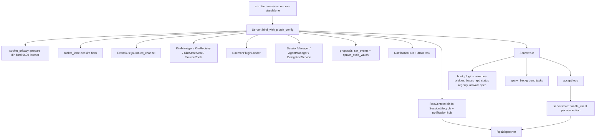

# Daemon Server

This page covers `crucible-daemon`'s socket-facing server: the `Server` type
and its boot sequence, the JSON-RPC dispatch table and per-connection framing,
every `server::*` RPC handler module (including the diffset/comment handlers
in `crates/crucible-daemon/src/server/diff.rs`,
`crates/crucible-daemon/src/server/diff_comments.rs` and
`crates/crucible-daemon/src/server/diff_context.rs`), the event/notification/
subscription fan-out, and the crate-wide plumbing (activity tracking, event
publication and sequencing, event-name translation, webhook auth) those
handlers share. It does not cover `agent_manager`, `daemon_plugins`,
`kiln_manager`/`kiln_registry`, `session_lifecycle`, `crate::review` (the
diffset base/ledger store), `crate::proposals`, `crate::bases`, session
storage internals, or Luau host internals — those are neighbor subsystems
this page cites but does not own.

## Purpose and ownership

Per `AGENTS.md`, `crucible-daemon` owns "sessions, admission, tools, storage,
retrieval, review, plugin lifecycle." This page's files are the part of that
ownership that terminates a JSON-RPC request: they hold the Unix socket, they
are the one place a client's intent becomes a state change, and they are the
one place a peer's credential is checked. A client (`crucible-cli`,
`crucible-web`) sends intent over this socket; it does not construct a second
write pipeline, and this server does not trust anything a client claims about
paths, scopes, or session ids without re-deriving it.

What this subsystem must not own: business logic that belongs to a narrower
owner it forwards to — `crate::agent_manager::AgentManager` (turn lifecycle,
modes, knobs, trust), `crate::session_manager::SessionManager` (persisted
session state), `crate::kiln_manager`/`crate::kiln_registry` (kiln identity),
`crate::daemon_plugins::DaemonPluginLoader` (plugin activation),
`crate::session_lifecycle::SessionLifecycle` (the one session-stop owner) —
the `server::*` handler modules are consistently thin wrappers that parse
params, call one of those owners, and shape the reply. There is no longer a
deliberate RPC-layer-only invariant of the kind this page once named: the
former isolation-vs-agent-switch check in
`handle_session_configure_agent` in `crates/crucible-daemon/src/rpc/dispatch.rs`
moved into `AgentManager::configure_agent` (outside this page), because the
Lua plugin bridge called that method directly and bypassed the RPC-layer
copy of the check; every caller now shares one gate. The config location-key
floor is not enforced in the RPC layer either: `handle_config_set` only
relays what the shared `crucible-core` config store already withheld.

Socket ownership follows the documented rule directly: `crates/crucible-daemon/src/server/socket_privacy.rs`
binds a private, 0600 listener and refuses (never repairs) a squatted
directory; `crates/crucible-daemon/src/server/core/mod.rs` treats the
connection itself as the authentication boundary via `SO_PEERCRED`, matching
"the per-user 0700 socket directory, never a shared unauthenticated socket."

## Module map

Directory `crates/crucible-daemon/src/` (top-level files):

| Path | Lines | Role |
|---|---|---|
| `crates/crucible-daemon/src/activity.rs` | 228 | `DaemonActivity`/`WorkGuard`: the one work-outstanding counter the idle timer reads. |
| `crates/crucible-daemon/src/event_emitter.rs` | 253 | `EventBus`: the daemon's one publication owner — stamps `seq`, journals losslessly, and broadcasts live. |
| `crates/crucible-daemon/src/event_map.rs` | 845 | The one lookup table between an internal event and the `EventName` a Lua `cru.on` handler registers under; also builds the `base:changed`/`proposal_changed` wire events. |
| `crates/crucible-daemon/src/internal_events.rs` | 6 | Re-export shim for `crucible_core::events::InternalSessionEvent`. |
| `crates/crucible-daemon/src/lifecycle.rs` | 77 | Installs OS shutdown signal handlers for a standalone daemon process; re-exports socket path helpers. |
| `crates/crucible-daemon/src/lossless_queue.rs` | 193 | An unbounded, single-consumer queue that drops no item, with a `Waiter` for "every item sent so far is finished" — backs `EventBus`'s journal and the kiln index's own queue. |
| `crates/crucible-daemon/src/notifications.rs` | 934 | `NotificationHub`: the daemon-owned `cru.log.notify` sink, ring store, per-session hidden-id set, and session-scoped/global fan-out. |
| `crates/crucible-daemon/src/protocol.rs` | 4 | Re-export shim for the canonical JSON-RPC wire types in `crucible_core::protocol` (now including the `BUSY` error code). |
| `crates/crucible-daemon/src/rpc_helpers.rs` | 523 | `require_param!`/`optional_param!`/`typed_params` — the shared RPC parameter-extraction helpers. |
| `crates/crucible-daemon/src/storage.rs` | 6 | Module root re-exporting the SQLite note/property/FTS store. |
| `crates/crucible-daemon/src/subscription.rs` | 497 | `SubscriptionManager`: which connected clients want which session's events. |
| `crates/crucible-daemon/src/test_fixtures.rs` | 101 | `#[cfg(test)]` builders for `LlmConfig`/`SessionAgent`/`AgentManager` shared across this crate's unit tests. |
| `crates/crucible-daemon/src/test_support.rs` | 669 | `pub` test doubles (`MockKnowledgeRepository`, `MockEmbeddingProvider`, `MockSubagentHandle`) and temp session-manager builders shared with integration tests. |

Directory `crates/crucible-daemon/src/observe/` (session-log read side):

| Path | Lines | Role |
|---|---|---|
| `crates/crucible-daemon/src/observe/events.rs` | 890 | `LogEvent`/`SessionLogLine` and the `session.jsonl` parser (`parse_session_log`, `replay_session_log`); `LogEvent::System` now carries `tags`/`injection`, `LogEvent::User` carries `plugin`, and a `LogEvent::Clear` variant marks a context clear. |
| `crates/crucible-daemon/src/observe/id.rs` | 53 | Re-export shim for `SessionId`/`SessionType`, replacing a former duplicate validator. |
| `crates/crucible-daemon/src/observe/markdown.rs` | 524 | Renders a `Vec<LogEvent>` to Markdown (`session.md` export); shows a plugin turn as `## ↻ <plugin>` and a `Clear` marker as a `Context cleared` line. |
| `crates/crucible-daemon/src/observe/mod.rs` | 80 | Module root; re-exports the observe read API. |
| `crates/crucible-daemon/src/observe/rebuild.rs` | 326 | Reconstructs a `ConversationTree` from a session log for resume-time history; a `LogEvent::Clear` restarts the tree without erasing the log, and a plugin-authored user turn rebuilds as `NodeContent::Plugin`. |
| `crates/crucible-daemon/src/observe/session.rs` | 344 | `load_events`/`events_after`: the file-backed loaders behind `session.load_events`/`session.events_after`. |

Directory `crates/crucible-daemon/src/rpc/` (dispatch layer):

| Path | Lines | Role |
|---|---|---|
| `crates/crucible-daemon/src/rpc/context.rs` | 482 | `RpcContext`, `RpcContextParams`, `DeferredShutdown`: the shared state every handler dispatches against; builds `SessionLifecycle`, binds it to delegation, and binds the notification hub to `AgentManager`. |
| `crates/crucible-daemon/src/rpc/dispatch.rs` | 4308 | `RpcMethod`/`METHODS`/`RpcDispatcher::dispatch`: the closed method table and cross-cutting session/config/plugin logic, including the `diff.*`/`proposal.*`/`base.*`/`fs.read` families (no `review.*` methods remain). |
| `crates/crucible-daemon/src/rpc/knob_method.rs` | 101 | `rpc_set_method`: the total mapping from `SessionKnob` to its writing `RpcMethod`. |
| `crates/crucible-daemon/src/rpc/missing_session_contract.rs` | 383 | `#[cfg(test)]` pinned table of every session-taking method's answer for a missing session — seven distinct answers now that the review family (an eighth) is gone. |
| `crates/crucible-daemon/src/rpc/mod.rs` | 19 | Module root; re-exports the RPC public surface. |
| `crates/crucible-daemon/src/rpc/params.rs` | 65 | `parse_params`: the one typed-params chokepoint. |
| `crates/crucible-daemon/src/rpc/ui.rs` | 174 | `ui.config`/`ui.set_theme` handlers; the theme/statusline snapshot builder `style_payload`; theme resolution now reads `SourceRoots` (runtimepath and every active plugin's directory). |
| `crates/crucible-daemon/src/rpc/workflow_handlers.rs` | 1038 | `workflow.start/approve_gate/status/cancel`: the workflow driver, snapshot persistence, and validation-command gate; `cancel` sets a per-run `CancellationToken` and stops the live turn before taking the execution lock. |

Directory `crates/crucible-daemon/src/server/` (connection lifecycle and top-level RPC handlers):

| Path | Lines | Role |
|---|---|---|
| `crates/crucible-daemon/src/server/accept.rs` | 79 | Classifies which `accept()` errors are transient (retry) vs. need backoff. |
| `crates/crucible-daemon/src/server/bind.rs` | 324 | `BindWithPluginConfigParams`: the one parameter struct `Server::bind_with_plugin_config` consumes. |
| `crates/crucible-daemon/src/server/diff.rs` | 946 | `diff.get`/`diff.file`: `Admission`, branch/session-record/proposal diffset resolution, and file-text serving. |
| `crates/crucible-daemon/src/server/diff_comments.rs` | 585 | `diff.comment`/`diff.resolve_comment`/`diff.delete_comment`/`diff.comments`: comment anchoring, outdatedness projection, and the source the Lua bridge shares with these handlers. |
| `crates/crucible-daemon/src/server/diff_comments_tests.rs` | 563 | `#[cfg(test)]`, `#[path]`-included from `diff_comments.rs`: anchoring, refusal, and outdatedness-projection tests. |
| `crates/crucible-daemon/src/server/diff_context.rs` | 204 | Resolves `@comment:<id>` mentions and composer `CommentRef`s into `<context kind="review-comment">` blocks for `session.send_message`. |
| `crates/crucible-daemon/src/server/external_announce.rs` | 69 | Coalesces external file-change events into one `review_changed` event per session. |
| `crates/crucible-daemon/src/server/file_event_hooks.rs` | 444 | Dispatches broadcast events into Lua `cru.on(...)` handlers; `run_handlers` is shared with `SessionLifecycle::stop`'s scoped end-observer pass. |
| `crates/crucible-daemon/src/server/grep.rs` | 447 | `search_grep`/`fs.grep`: contained ripgrep-based content search. |
| `crates/crucible-daemon/src/server/idle.rs` | 293 | `IdleTimer`/`IdleSnapshot`: the idle-shutdown policy for an auto-spawned daemon. |
| `crates/crucible-daemon/src/server/kiln.rs` | 2092 | Every `kiln.*`, vector/text search, and `note.*`/`process_*` RPC handler; `kiln.list` rows carry a `git` field, and `note.upsert`/`note.delete` route through `KilnManager`'s index owner. |
| `crates/crucible-daemon/src/server/llm.rs` | 428 | `llm.register_provider`, `embeddings.models`. |
| `crates/crucible-daemon/src/server/lua.rs` | 539 | `lua.init_session`/`shutdown_session`/`discover_plugins`/`plugin_health`/`generate_stubs`/`register_commands`; `fire_session_end_hooks_once` is the shared, deadlock-safe end-hook helper. |
| `crates/crucible-daemon/src/server/lua_plugin_suite.rs` | 1172 | `lua.run_plugin_tests`; CI gates that run/typecheck every shipped plugin's suite. |
| `crates/crucible-daemon/src/server/mod.rs` | 1607 | `Server`: bind, boot sequence, accept loop, background tasks, shutdown against one shared deadline. |
| `crates/crucible-daemon/src/server/note_refactor.rs` | 1128 | `note.rename`/`note.move`: link-rewriting note/canvas rename; its `plan_rename`/`apply_rename` split is what `crates/crucible-daemon/src/bases/write.rs` reuses, and its `reindex_rename` step is what `crates/crucible-daemon/src/proposals/rpc.rs` reuses. |
| `crates/crucible-daemon/src/server/notifications.rs` | 43 | `notification.list`/`notification.dismiss` handlers over the global ring. |
| `crates/crucible-daemon/src/server/observe.rs` | 492 | `session.load_events`/`events_after`/`list_persisted`/`render_markdown`/`export_to_file`/`cleanup`. |
| `crates/crucible-daemon/src/server/platform.rs` | 468 | `mcp.*`, `skills.*`, `agents.list_profiles`/`list_cards`/`resolve_profile`; skill/card discovery now takes an explicit `workspace` and every attached kiln. |
| `crates/crucible-daemon/src/server/plugin_install.rs` | 391 | `plugin.install`/`plugin.remove`, each holding the plugin-loader task-local marker while its Lua runs. |
| `crates/crucible-daemon/src/server/plugins.rs` | 1482 | Plugin lifecycle/surfaces/publications/options/commands, `project.*`, `scm.clone`, plugin file watcher; `session.status` now answers `AgentManager::status_items`'s typed `StatusDisplayItem` list. |
| `crates/crucible-daemon/src/server/socket_lock.rs` | 55 | Advisory single-daemon `flock` on `<socket>.lock`. |
| `crates/crucible-daemon/src/server/socket_privacy.rs` | 327 | Private socket-directory preparation and 0600-at-bind-time listener binding. |
| `crates/crucible-daemon/src/server/storage.rs` | 45 | `storage.verify/cleanup/backup/restore` — unimplemented stubs. |
| `crates/crucible-daemon/src/server/ui_broadcast.rs` | 142 | `broadcast_style_changed`/`broadcast_exprs_changed`: the push half of the UI-config handshake, built from a typed `SystemPayload::UiStyleChanged`. |

Directory `crates/crucible-daemon/src/server/core/` (per-connection framing):

| Path | Lines | Role |
|---|---|---|
| `crates/crucible-daemon/src/server/core/mod.rs` | 617 | `handle_client`, `serve_requests`, `forward_events`, `persist_event`, `sweep_and_archive_stale_sessions`. |
| `crates/crucible-daemon/src/server/core/tests.rs` | 514 | Socket-pair unit tests for panic containment, per-request concurrency, lag/gap markers, write timeout. |

Directory `crates/crucible-daemon/src/server/fs/` (file-tree RPCs):

| Path | Lines | Role |
|---|---|---|
| `crates/crucible-daemon/src/server/fs/mod.rs` | 712 | `fs.list_dir`/`fs.move`/`fs.mkdir`/`fs.trash`; a kiln folder move calls `KilnManager::folder_moved` so every note under it reindexes. |
| `crates/crucible-daemon/src/server/fs/tests.rs` | 682 | Containment/escape/symlink/cap tests for the file-tree RPCs. |

Directory `crates/crucible-daemon/src/server/session/` (session RPC surface):

| Path | Lines | Role |
|---|---|---|
| `crates/crucible-daemon/src/server/session/approval.rs` | 61 | `session.set_plugin_approval`/`get_plugin_approval`/`list_plugin_approvals`: per-session, per-plugin approval overrides. |
| `crates/crucible-daemon/src/server/session/create.rs` | 836 | `session.create`: kiln/workspace/agent admission (SSRF check, then one shared trust gate) before persisting. |
| `crates/crucible-daemon/src/server/session/lifecycle.rs` | 319 | pause/resume/resume_from_storage/history/end/delete/archive/unarchive/replay/compact, with pause/end/delete/archive funneling through `SessionLifecycle::stop`. |
| `crates/crucible-daemon/src/server/session/list.rs` | 762 | `session.list`/`search`/`get` (the `get` reply now includes `plugin_approvals`/`plugin_turn_limit`). |
| `crates/crucible-daemon/src/server/session/messaging.rs` | 535 | `configure_agent`/`send_message`(with review-comment context resolution)/`clear`/context injection/cancel/interaction respond. |
| `crates/crucible-daemon/src/server/session/mod.rs` | 273 | Module aggregator plus the post-create background `spawn_setup_task` (typed `SetupPayload` events). |
| `crates/crucible-daemon/src/server/session/models.rs` | 200 | `switch_model`/`list_models`/`models.list`/`providers.list`/`fork` (fork now refuses an ACP-run parent by name). |
| `crates/crucible-daemon/src/server/session/modes.rs` | 430 | `list_modes`/`list_knobs`/`list_agent_options`/`set_agent_option`; each mode descriptor now carries a `writes: WriteMode` (`Apply`/`Propose`). |
| `crates/crucible-daemon/src/server/session/notifications.rs` | 98 | `add_notification`/`list_notifications`/`dismiss_notification`, reading/writing `NotificationHub` directly for a live-or-stored session. |
| `crates/crucible-daemon/src/server/session/params.rs` | 311 | `set_mode`/`set_precognition`/`get_*`/`undo`/`can_undo`/`undo_depth`/`cache_stats`/`set_plugin_turn_limit`/`get_plugin_turn_limit`. |
| `crates/crucible-daemon/src/server/session/scope.rs` | 351 | `caller_kiln_scope`, `connect_kiln`/`disconnect_kiln`/`set_workspace`, `connect_kiln` now gated by the one shared trust gate. |

Directory `crates/crucible-daemon/src/server/tests/` (integration tests, in-process daemon):

| Path | Lines | Role |
|---|---|---|
| `crates/crucible-daemon/src/server/tests/mod.rs` | 256 | `TestServer` fixture and RPC-call helpers shared by every file below. |
| `crates/crucible-daemon/src/server/tests/boot_hermeticity.rs` | 50 | Boot never reads the developer's `$XDG_CONFIG_HOME/crucible/init.lua`. |
| `crates/crucible-daemon/src/server/tests/child_sessions.rs` | 182 | Child visibility, archive/delete cascade, parent-link reporting. |
| `crates/crucible-daemon/src/server/tests/delegation_e2e.rs` | 203 | End-to-end delegation through real `Server` binding, not an injected manager. |
| `crates/crucible-daemon/src/server/tests/event_seq.rs` | 100 | Per-session contiguous `seq`, exercised directly against `EventBus::emit` (the former source-text bypass lint is gone now that `EventBus`'s sender is private). |
| `crates/crucible-daemon/src/server/tests/events.rs` | 288 | Event persistence via the journal, kiln-index maintenance off the watcher bridge, error-response construction. |
| `crates/crucible-daemon/src/server/tests/graph.rs` | 90 | `kiln.graph` node/edge shape, self-link exclusion. |
| `crates/crucible-daemon/src/server/tests/idle_shutdown.rs` | 233 | End-to-end idle-timer wiring (unconnected exit, connected hold-open, in-flight turn). |
| `crates/crucible-daemon/src/server/tests/isolation_param.rs` | 202 | `session.create`'s `isolation` param round-trips and inherits to children, including the new `isolation_record`. |
| `crates/crucible-daemon/src/server/tests/kiln_index.rs` | 519 | The kiln index following disk changes off a lossless per-kiln queue, not the client broadcast bus. |
| `crates/crucible-daemon/src/server/tests/kiln_scope_validation.rs` | 292 | Adversarial `note.upsert` scope-escape tests. |
| `crates/crucible-daemon/src/server/tests/lifecycle.rs` | 312 | RPC lifecycle transitions and their invalid-state errors. |
| `crates/crucible-daemon/src/server/tests/models_settings.rs` | 240 | Model switching, mode listing, global model list. |
| `crates/crucible-daemon/src/server/tests/persist_event.rs` | 871 | Persistence filtering, sweep/archive through `SessionLifecycle::stop`, and subscriber interaction. |
| `crates/crucible-daemon/src/server/tests/persisted_session.rs` | 875 | Read/export/cleanup RPCs, traversal and symlink refusal. |
| `crates/crucible-daemon/src/server/tests/plugin_boot.rs` | 462 | Plugin boot merge/activate ordering, operator disable, setup failure isolation, plugin-sourced skills. |
| `crates/crucible-daemon/src/server/tests/review_watch.rs` | 105 | External-change coalescing and bracketed-write suppression. |
| `crates/crucible-daemon/src/server/tests/rpc_basic.rs` | 482 | Ping, error codes, kiln/session basics, kiln-in-sessions-root refusal. |
| `crates/crucible-daemon/src/server/tests/session_id_boundary.rs` | 248 | Session-id traversal rejection across every session-taking method. |
| `crates/crucible-daemon/src/server/tests/session_journal.rs` | 117 | `session.jsonl` persistence and `session.events_after` sourced from the lossless journal, not the broadcast ring. |
| `crates/crucible-daemon/src/server/tests/session_log_capture.rs` | 109 | Wire-format regression: captured `session.jsonl` vs. a committed fixture. |
| `crates/crucible-daemon/src/server/tests/shutdown.rs` | 116 | The shared shutdown deadline: queued events all persist, and a write already under way finishes within its grace period. |
| `crates/crucible-daemon/src/server/tests/startup_kilns.rs` | 214 | Registered-vs-open kilns across a restart; lazy kilns stay closed. |
| `crates/crucible-daemon/src/server/tests/subscription.rs` | 269 | `session.subscribe`/`unsubscribe` RPCs and broadcast delivery. |
| `crates/crucible-daemon/src/server/tests/truncation.rs` | 95 | UTF-8-safe grep-result truncation golden tests. |
| `crates/crucible-daemon/src/server/tests/trust.rs` | 506 | The one shared trust gate (`AgentManager::refuse_untrusted`) at create, connect_kiln and model switch. |

Directory `crates/crucible-daemon/src/webhook/` (webhook ingress auth):

| Path | Lines | Role |
|---|---|---|
| `crates/crucible-daemon/src/webhook/mod.rs` | 511 | `WebhookSecrets`/`Signature`: signature verification, replay protection, secret minting. |
| `crates/crucible-daemon/src/webhook/tests.rs` | 520 | Signature wire-format, verification, replay/skew, secrets load/mint tests. |

## Key types and traits

**`Server`** (`crates/crucible-daemon/src/server/mod.rs`) is the bound daemon
process. It holds the `UnixListener`, a `shutdown_tx: broadcast::Sender<()>`,
`Arc`s to every subsystem manager (`kiln_manager`, `session_manager`,
`workspace_tools`, `agent_manager`, `project_manager`), the `dispatcher:
Arc<RpcDispatcher>`, and the same `rpc_context: Arc<RpcContext>` the
dispatcher runs against (kept so plugin boot reaches the daemon's real
`session.create` path). It also holds `plugin_loader:
Arc<Mutex<Option<DaemonPluginLoader>>>`, `idle_shutdown: Option<Duration>`,
`data_home`, `socket_lock: Option<std::fs::File>` (RAII-held flock),
`authorized_uid`, an optional `mcp_gateway`, and `activity: Arc<DaemonActivity>`.
It is created once by `Server::bind_with_plugin_config` and consumed by
`Server::run`; `crates/crucible-cli`'s `cru daemon serve` subcommand and its
`--standalone` in-process path (`crucible-cli/src/main.rs`) are its callers.
`DaemonClient::connect_or_start()` does not call it directly — on a missing
daemon it spawns a `cru daemon serve` child process and connects to that.

**`EventBus`** (`crates/crucible-daemon/src/event_emitter.rs`) is the
daemon's one event-publication owner — every field and parameter that used
to be a bare `broadcast::Sender<SessionEventMessage>` is now a
`crate::EventBus` (a `Clone`, `Arc`-backed handle over a private sender).
`EventBus::emit(event) -> bool` locks a per-instance `sequences:
Mutex<HashMap<String, u64>>`, stamps the event's `seq` (`stamp_event`), sends
it to a `crate::lossless_queue::Sender` journal, and then to the live
`broadcast::Sender` ring, all under the same lock, so publication order and
stamping cannot race apart. In debug builds `emit` asserts
`crucible_core::protocol::Group::of(&event.event).is_some()` — the bus
panics rather than publish a name no payload enum declares, since such a
name would decode as `UnknownEvent` in every client. `EventBus::channel(cap)`
builds a bus with no persistence consumer (tests, detached runtimes);
`EventBus::journaled_channel(cap)` (production, `Server::bind_with_plugin_config`)
returns the bus paired with its `crate::lossless_queue::Receiver` so a
journal consumer always exists from construction. `seed_session`/
`forget_session`/`has_seq_counter` replace the former free functions over a
global `SESSION_SEQ_COUNTERS` static; `seed_session` continues a resumed
session's counter above its highest persisted `seq` so a restart cannot
reissue one a client cursor already holds.

**`crate::lossless_queue`** (`crates/crucible-daemon/src/lossless_queue.rs`)
is the ordered, unbounded, single-consumer `mpsc` queue behind `EventBus`'s
journal (and, separately, the kiln index's own ingest queue — see
[[Knowledge Storage and Retrieval]]): `Sender::send` never blocks and never
drops, and `Sender::waiter().wait()` returns once every item sent before the
call has dropped out of the consumer (`Entry`'s `Drop` marks it done), so a
reader of stored state can settle against "everything already published" without polling.

**`RpcContext`** (`crates/crucible-daemon/src/rpc/context.rs`) is the shared,
`Arc`-wrapped state bag every RPC handler dispatches against: `kiln`,
`sessions`, `agents`, `subscriptions`, `event_tx: crate::EventBus`, `shutdown:
Arc<DeferredShutdown>`, `project_manager`, `lua_sessions:
Arc<DashMap<String, Arc<Mutex<LuaSessionState>>>>`, `plugin_loader`, `llm_state`,
`llm_config: LiveLlmConfig` (the one live provider table, not a copy),
`mcp_server_manager`, `mcp_config`, `data_home`, `workflows:
Arc<WorkflowRegistry>`, `kiln_registry`, `kiln_state`, `session_lifecycle:
Arc<SessionLifecycle>`, `notifications: Arc<NotificationHub>`. `Server`
constructs it once at bind time and hands `Arc<RpcContext>` to
`RpcDispatcher::new`; `RpcContext::effective_config` is the only correct way
to read the live-merged app config (reading `bound_config` directly would
serve a value frozen at boot). `RpcContext::new` itself builds
`SessionLifecycle` (with this same `event_tx`), binds it to
`AgentManager::delegation_service()` (so a delegated child and a
sweep/RPC-ended parent share the once-only teardown claim), and binds
`notifications` onto `AgentManager` as its one notification store.
`RpcContext::diff_admission()` builds a `crate::server::diff::Admission`
(`project_manager`, `kiln`, `sessions`, `agents.review`, `agents.proposals()`)
— the shared admission context the dispatcher and the Lua session bridge
both read for a diffset/comment/review-context request, so a plugin and a
client see one admission.

**`RpcDispatcher`** (`crates/crucible-daemon/src/rpc/dispatch.rs`) wraps one
`Arc<RpcContext>` and exposes `async fn dispatch(&self, client_id, req) ->
Response` — an exhaustive match over `RpcMethod`, generated with `METHODS`
by the `rpc_methods!` macro so the wire-name list and the dispatch arms
cannot drift. `handle_client` in `crates/crucible-daemon/src/server/core/mod.rs`
calls `dispatch()` once per request.

**`LuaSessionState`** (`crates/crucible-daemon/src/server/mod.rs`) pairs a
per-session `LuaExecutor` with an `end_hooks_fired: bool` guard, because both
`session.end` (`crates/crucible-daemon/src/rpc/dispatch.rs`) and
`lua.shutdown_session` (`crates/crucible-daemon/src/server/lua.rs`) can fire
`on_session_end`, and plugins are not required to be idempotent. `RpcContext`
holds the map (`lua_sessions: Arc<DashMap<String, Arc<Mutex<LuaSessionState>>>>`);
both RPC paths call the shared `fire_session_end_hooks_once` in
`crates/crucible-daemon/src/server/lua.rs`, which clones the session's `Arc`
out of `lua_sessions` and drops the map guard before awaiting the Lua lock.
Holding the guard across that await used to let `session.end` and
`lua.shutdown_session` queue on the same worker thread and deadlock,
answering neither call in roughly 1 of 70 `cru chat :quit` runs.

**`DaemonActivity`/`WorkGuard`/`WorkKind`** (`crates/crucible-daemon/src/activity.rs`)
is the daemon-wide "am I busy" answer: `WorkKind` (`Connection`, `Turn`,
`BackgroundJob`, `Maintenance`) is a closed, exhaustively-matched enum;
`DaemonActivity::start` returns an RAII `WorkGuard` whose `Drop` decrements
an `AtomicUsize` per kind. Everything that starts durable work in
`run` in `crates/crucible-daemon/src/server/mod.rs` takes a guard; `run` is
the sole caller of `outstanding()`/`busy_kinds()`, and it feeds the
`outstanding()` reading into the `IdleSnapshot` that `IdleTimer`
(`crates/crucible-daemon/src/server/idle.rs`) observes.

**`SubscriptionManager`/`ClientId`** (`crates/crucible-daemon/src/subscription.rs`)
tracks which `ClientId` (a process-lifetime-unique counter) wants which
session's events, plus the `WILDCARD_SESSION = "*"` subscription. Two
`DashMap`s (session→clients, client→sessions) are kept symmetric by every
mutator; `handle_client` in `crates/crucible-daemon/src/server/core/mod.rs`
removes a client on disconnect.

**`NotificationHub`** (`crates/crucible-daemon/src/notifications.rs`) is the
daemon's one notification store: a `RING = 200`-entry persisted
`VecDeque<Notification>`, a per-session `hidden: BTreeMap<String,
BTreeSet<String>>` (the shared notices a session closed for itself only), an
`mpsc` drain queue (`NOTIFY_QUEUE = 1024`) with `try_send` semantics so a
full queue surfaces as a Lua error rather than blocking, and `fan_out` logic
with three cases: a session-scoped notification (`add_for_session`) goes to
that session alone; a global notification goes once to the wildcard session,
addressing every subscribed client without a per-session check; a
kiln/workspace-scoped notification goes to each live session the free
function `reaches(notification, session_id, workspace, kilns, hidden)`
admits — the same predicate `list_for_session` filters by, so live delivery
and a listing cannot disagree. `dismiss_for_session` removes a session-owned notice for every
session (announced on `WILDCARD_SESSION`) but only hides a shared notice for
the dismissing session (`announce_dismissed`); `NotificationFile::prune_hidden`
drops a hidden id once its notice leaves the ring. `Server::bind_with_plugin_config`
constructs the hub, hands it to `AgentManager` via `RpcContext::new`, and
calls `spawn_drain`; readers are `RpcContext.notifications`,
`crates/crucible-daemon/src/server/notifications.rs`'s handlers
(`notification.list`/`notification.dismiss`, the global ring) and
`crates/crucible-daemon/src/server/session/notifications.rs`'s handlers
(`session.add_notification`/`list_notifications`/`dismiss_notification`,
scoped to one session and resolved through `SessionManager::read_session` so
a stored-only session after a restart still answers).

**`EventRow`/`ROWS`/`HookedEvent`** (`crates/crucible-daemon/src/event_map.rs`)
is the single translation table between a daemon-internal event and the
`EventName` a Lua `cru.on` handler names; `message_for` is total — every
`InternalSessionEvent` variant has a wire form, so it returns
`SessionEventMessage` directly rather than an `Option` — and `decode` is its
inverse, consumed by `crates/crucible-daemon/src/server/file_event_hooks.rs`.
`base_changed`/`proposal_changed` are dedicated constructors alongside
`ROWS`: a Bases write reports its own change once the disk holds it, and
`proposal_changed` addresses the synthetic system session, since a proposal
belongs to no user session and every client's Inbox listens there.

**`DeferredShutdown`** (`crates/crucible-daemon/src/rpc/context.rs`) holds a
`broadcast::Sender<()>` and an `AtomicBool` "armed" flag so a `shutdown` RPC's
confirmation is written to the socket before the accept loop breaks — `arm()`
inside the handler, `fire_if_armed()` after the reply is on the wire (in
`crates/crucible-daemon/src/server/core/mod.rs`).

**`WebhookSecrets`/`Signature`** (`crates/crucible-daemon/src/webhook/mod.rs`)
holds the per-webhook-name HMAC secret table, a replay cache
(`Mutex<Vec<(i64, [u8;32])>>`), and `verify_at`, the scheme dispatcher between
a timestamped (`Signature::Timestamped`) and body-only (`Signature::BodyOnly`,
GitHub-style) signature. `crucible-web`'s webhook route is the sole caller of
`verify`; this crate never signs in production (`sign`/`sign_body_only` are
`test`/`test-utils`-gated).

## Flows

### Boot

`Server::bind_with_plugin_config` (`crates/crucible-daemon/src/server/mod.rs`),
given a `BindWithPluginConfigParams` (`crates/crucible-daemon/src/server/bind.rs`):
prepare socket dir (`prepare_socket_dir` in `crates/crucible-daemon/src/server/socket_privacy.rs`)
→ acquire the exclusive flock (`acquire_socket_lock` in `crates/crucible-daemon/src/server/socket_lock.rs`)
→ remove a stale socket → bind the private 0600 listener
(`bind_private_listener` in `crates/crucible-daemon/src/server/socket_privacy.rs`)
→ build the journaled event bus (`EventBus::journaled_channel(EVENT_CHANNEL_CAPACITY
= 4096)`, keeping the returned journal receiver as `Server.journal`) → build
the kiln registry/state/LLM-state layers and `SourceRoots` (naming the kiln
registry as a card/skill/theme source) → build `KilnManager` → build/upgrade
`DaemonPluginLoader` → build `SessionManager`, `WorkspaceTools`,
`DelegationService` → build `AgentManager` (naming its `SourceRoots`, and
carrying every active plugin's directory once the loader is locked) → wire
the proposal store to the event bus and spawn its stale-proposal watch
(`crate::proposals::spawn_stale_watch`) → build `SubscriptionManager`,
`ProjectManager` → migrate legacy in-kiln sessions → build `NotificationHub`
and spawn its drain → build `RpcContext` (which itself builds
`SessionLifecycle`, binds it to delegation, and binds the notification hub
onto `AgentManager`) → build `RpcDispatcher`.

`Server::run` then calls `boot_plugins` (wires the plugin VM's `sessions`/
`notify`/`tools` bridges, registers the Lua Bases API
(`crucible_lua::bases_api::register`) bound to `crate::bases::plugin_api::resolver`,
binds handler registries into `AgentManager`/`KilnManager`, wires the
structured status-item registry's change notifier, runs spec-driven
activation under the plugin-loader-held marker, broadcasts a style-changed
event), spawns the background tasks listed under State/concurrency below,
and enters the accept loop (`tokio::select!` over accept / shutdown /
idle-probe, not `biased`).

### A request, end to end

`handle_client` in `crates/crucible-daemon/src/server/core/mod.rs` checks the
peer's `SO_PEERCRED` uid (`peer_accepted`), splits the stream, spawns
`forward_events` (broadcast→socket) as its own cancellable task, and runs
`serve_requests`: read a line → acquire one of `MAX_INFLIGHT_PER_CONNECTION =
32` semaphore permits → spawn a task that parses the `Request` and calls
`RpcDispatcher::dispatch` inside `catch_unwind` (`handle_request`) → write
the reply under a shared `Mutex<OwnedWriteHalf>` with a 30s
`write_line_or_close` timeout. `dispatch()` parses the method name into
`RpcMethod::parse`, then either forwards one line to a
`crate::server::*` handler (`forward!` macro) or calls one of
`RpcDispatcher`'s own `handle_*` wrappers for cross-cutting methods
(session create/pause/resume/end/fork, config get/set/save, plugin install/
reload/remove, `lua.eval`, `scm.clone`, `workflow.*`).

### `session.create`

`handle_session_create` in `crates/crucible-daemon/src/server/session/create.rs`
→ `RpcContext::create_session_resolved`: parse and dedupe requested kiln
names against `KilnRegistry` (unresolvable names refuse) → refuse forbidden
workspace scopes (`refuse_forbidden_scope`) → optionally resolve the agent
(`resolve_create_agent`, against every attached kiln), running
`AgentManager::refuse_internal_endpoint` first when the agent is externally
reachable (an async SSRF check against the provider endpoint, so a refusal
here leaves no session behind) → run `AgentManager::refuse_untrusted` once
against the resolved agent (or a freshly-built default internal agent when
none was requested) and every attached kiln, fail closed → register the
workspace as a project (best-effort) → `SessionManager::create_session`
persists → optionally write `isolation` and `plugin` through
`SessionManager::modify_session` (mutates the live entry under the persist
guard, rather than saving a whole copy that could lose a concurrent writer's
field) → optionally `AgentManager::configure_agent` → open every kiln in
`KilnManager` (best-effort) → optionally start a `RecordingWriter` →
`spawn_setup_task` in `crates/crucible-daemon/src/server/session/mod.rs`
detaches (indexing, plugin discovery, MCP/provider listing, context-window
discovery — never blocks the reply, and every event it emits is now a typed
`SetupPayload` variant). Back in `handle_session_create` in
`crates/crucible-daemon/src/rpc/dispatch.rs`, the wrapper additionally
resolves `workspace_target` (fail-closed) and calls
`enforce_plugin_session_start` (fires `on_session_start` through
`SessionLifecycle`, the same gate `DelegationService` uses for a forked
child) before emitting `session_created`. `AgentManager::refuse_untrusted`
(`crates/crucible-daemon/src/agent_manager/models.rs`) is the one trust gate
create shares with `session.configure_agent`, `switch_model`, fork, revive,
delegation and `session.connect_kiln` — see Boundaries and invariants below.

### `diff.get`/`diff.file` and comment resolution

`crate::server::diff::handle_diff_get`/`handle_diff_file` resolve a
`DiffsetSource` (`Branch { root, base, head }`, `SessionRecord { session }`,
`Proposal { id }`) against an `Admission` (`RpcContext::diff_admission()`):
a branch source must admit its root (a registered project, a session's own
workspace, or inside a registered kiln) **and** that root must itself be a
git top level, checked before any git invocation; a proposal source needs no
root admission at all, since the daemon reads a proposal's files from its
own store. `crate::server::diff_comments`'s four handlers
(`diff.comment`/`resolve_comment`/`delete_comment`/`comments`) share the same
`serve()`/`Admission` resolution, and the Lua bridge calls the identical
handlers for `cru.diff.comment`/`cru.diff.resolve_comment`, so an agent's
comment and a person's comment take one path. Every new comment, of any
source kind, calls `admission.review.comment_store().remember_source(&source)`
so a later bare comment-id lookup (`crate::server::diff_context::find`) can
resolve it back to its diffset. `crate::server::diff_context::review_context`
is the entry point `session.send_message` calls when a message names
`@comment:<id>` or carries a composer `CommentRef`: it resolves each id,
refuses one that is already resolved or unfindable ("attach it from the diff
pane"), and builds a `<context kind="review-comment">` block per comment
before the turn starts — a hard refusal, not a silent drop.

### Event fan-out

Any code holding a `crate::EventBus` calls `.emit(event)`, which locks the
bus's per-session `sequences` map, stamps `seq`, and publishes to both a
`crate::lossless_queue` journal and the live `broadcast::Sender` ring under
that one lock. `server/core::forward_events` relays each live-ring message
to its connected client, emitting a `stream_gap` marker (no `seq`) on
`RecvError::Lagged`. `crate::server::file_event_hooks::spawn_file_event_hooks`
separately decodes the same live ring (`event_map::decode`) into Lua
`cru.on(...)` handler invocations, fail-open per handler, warning (not just
logging at `debug`) when the ring's lag drops one — there is no replay for a
dropped one-off lifecycle or webhook event. `server/core::persist_event`,
driven by a task that now drains `Server.journal` (the lossless queue) and
not the live ring, writes the subset `should_persist` admits to
`session.jsonl` (and, for `user_message`/`message_complete`, to
`session.md`); because the journal drops nothing, a burst that overruns
`EVENT_CHANNEL_CAPACITY` on the live ring still lands in `session.jsonl`
whole and in order, and `session.events_after`'s reconnect read is
journal-backed too. See [[Data Flows]] for the end-to-end wire path across
frontends.

## State, concurrency and lifecycle

- **Locks**: `plugin_loader: Arc<Mutex<Option<DaemonPluginLoader>>>` serializes
  plugin mutation; handlers that call back into daemon APIs from inside a
  plugin callback explicitly clone the loader `Arc` out of the guard first to
  avoid a self-deadlock (`crates/crucible-daemon/src/server/plugins.rs`).
  Install/remove/reload and the boot-time `load_plugins_from_spec` additionally
  wrap the loader call in `crate::session_lifecycle::holding_plugin_loader`,
  a task-local marker that lets `session.create` refuse (rather than deadlock)
  a session a plugin's own setup code tries to create while the mutex is held.
  `lua_sessions: DashMap<..>` is per-session-keyed, no crate-wide lock; both
  `session.end` and `lua.shutdown_session` clone the session's Lua state out
  of the map and drop the guard before awaiting the Lua lock
  (`fire_session_end_hooks_once`), closing a lock-across-await deadlock that
  used to hang roughly 1 in 70 `cru chat :quit` runs. `socket_lock:
  Option<std::fs::File>` is an OS-level `flock`, held for the process's life
  and released on `Drop`.
- **Channels**: one `crate::EventBus` (`EVENT_CHANNEL_CAPACITY = 4096` live
  ring capacity) for all session events — internally a private
  `broadcast::Sender` plus a `crate::lossless_queue::Sender` journal, not two
  independent channels a caller can reach separately; one `mpsc` queue
  (`NOTIFY_QUEUE = 1024`) feeding `NotificationHub::spawn_drain`; a
  `broadcast::Sender<()>` for shutdown.
- **Caches**: `LiveLlmConfig` (one live provider table shared by `RpcContext`
  and `AgentManager`); `EventBus`'s own `sequences: Mutex<HashMap<String,
  u64>>` (per-`EventBus`-instance, not a process-global — `seed_session`
  continues a resumed session's counter above its highest persisted `seq`,
  and `forget_session` retires it last in teardown so an in-flight task
  never reuses a duplicate one).
- **Background tasks** spawned from `Server::run`: model-cache warmer;
  event-persistence task (drains `Server.journal`, the lossless queue, not
  the live ring); kiln-index task (`KilnManager::run_index_jobs`, fed by its
  own lossless job queue — see [[Knowledge Storage and Retrieval]] —
  replacing a deleted file-reprocess task that read the lossy client bus);
  archive-sweep task (every 30 minutes, `sweep_and_archive_stale_sessions`,
  now driven through `SessionLifecycle`, not `AgentManager`); external-change
  review watch (`crates/crucible-daemon/src/server/external_announce.rs`);
  MCP reconnect loop; auto-title task; startup kiln-open task. Every
  background task except the model-cache warmer and the startup kiln-open
  task holds its own `CancellationToken`; all are cancelled together and
  joined against one shared `SHUTDOWN_DEADLINE = 2s` (`join_before`,
  `crates/crucible-daemon/src/server/mod.rs`), then aborted and logged if
  still running. The persist task alone gets `STARTED_WRITE_GRACE = 1s` more
  past the deadline — `persist_deadline` fires so the drain stops taking new
  queued events, but an already-started `session.jsonl` write gets the extra
  second to finish rather than being cut. The daemon's SIGTERM exit budget is
  therefore `SHUTDOWN_DEADLINE + STARTED_WRITE_GRACE` (3s) at most for
  background work, plus whatever the accept loop and connection tasks take;
  `crucible-cli`'s own client-side runtime stop additionally bounds itself to
  a 1s timeout rather than a bare drop (`RUNTIME_SHUTDOWN_GRACE` in
  `crucible-cli/src/main.rs`), so the two budgets are read together — see
  [[CLI Commands]].
- **Idle shutdown**: `IdleTimer` in `crates/crucible-daemon/src/server/idle.rs`
  starts its clock the instant the daemon binds; it reads only
  `DaemonActivity`'s outstanding-work count and socket reachability. A
  resident but ended session does not count as work — only an active
  connection, an in-flight turn, a background job, or a maintenance pass do.
  An in-process daemon and one with declarative `schedules` never arm the
  timer.
- **Cleanup**: `sweep_and_archive_stale_sessions`
  (`crates/crucible-daemon/src/server/core/mod.rs`, `pub(crate)`) skips only
  sessions with an active subscriber (there is no review queue any more to
  gate on), then calls `SessionLifecycle::stop(id, StopCause::AutoArchive)`
  for the rest — the same one-owner stop path `session.pause`/`end`/
  `archive`/`delete` (`crates/crucible-daemon/src/server/session/lifecycle.rs`),
  the Lua pause/end bridge, and delegation all call. `stop`, not the
  individual handler, cascades an archive or a delete to delegated children,
  runs `AgentManager::cleanup_session` as one of its steps, and sends exactly
  one `session:ended` event naming the `StopCause`.

## Boundaries and invariants

- **Socket is the trust boundary.** Every RPC method is unauthenticated once
  a connection is open; `peer_accepted` in
  `crates/crucible-daemon/src/server/core/mod.rs` fails closed if
  `SO_PEERCRED` cannot be read, and refuses even the daemon's own root.
- **Refuse, never repair.** `prepare_socket_dir` in `crates/crucible-daemon/src/server/socket_privacy.rs`
  aborts startup on a squatted daemon-owned fallback directory rather than
  `chmod`/`unlink`ing a predictable path; it never touches an operator-chosen
  directory beyond `create_dir_all`.
- **Said-nothing vs. said-something-unresolvable.** `caller_kiln_scope`
  (`crates/crucible-daemon/src/server/session/scope.rs`) is the one parse
  site distinguishing an absent scope (permissive for `session.list`, closed
  for `session.search`) from a non-empty scope that resolves to nothing
  (always refused) — called directly by
  `crates/crucible-daemon/src/server/session/list.rs` and by
  `session.list_persisted`/`session.cleanup` in
  `crates/crucible-daemon/src/server/observe.rs`, so all four handlers share
  one parse.
- **Trust is checked by one shared gate everywhere.**
  `AgentManager::refuse_untrusted(agent, kilns, workspace)`
  (`crates/crucible-daemon/src/agent_manager/models.rs`) is the single trust
  gate for `session.create`, `session.configure_agent`, `switch_model`, fork,
  revive, delegation and `session.connect_kiln` — it resolves a kiln's
  classification and the agent's provider trust and refuses fail-closed if
  the trust is insufficient. No call site resolves classification or
  provider trust locally any more:
  `crates/crucible-daemon/src/server/session/create.rs`'s two former
  create-only resolvers and `crates/crucible-daemon/src/server/session/scope.rs`'s
  former `check_attach_trust` (which gated `session.connect_kiln`) are both
  deleted, and `session.connect_kiln` now calls `refuse_untrusted` directly.
  `crates/crucible-daemon/src/server/tests/trust.rs` covers this, including a
  regression for the bug the unification closed: the old create-time gate
  read an unresolved bare provider name as `Local`, while `configure_agent`'s
  gate read the same name as `Cloud`, so an agentless create could pass a
  gate the very next `configure_agent` call would refuse.
- **Config location keys never travel through `config.set`.**
  `handle_config_set` in `crates/crucible-daemon/src/rpc/dispatch.rs` calls
  `crucible_lua::merge_app_config_tagged` with `ConfigSource::Rpc`, and the
  shared `crucible-core` config store's `Withhold` policy is what strips
  `LOCATION_CONFIG_KEYS` before the merge lands; `handle_config_set` only
  relays the withheld-key report. So an RPC caller cannot introduce or
  re-point a kiln/project path outside the registered floor.
- **Path containment is re-derived, never trusted from the caller.**
  `crates/crucible-daemon/src/server/fs/mod.rs` (component whitelist +
  canonicalize-and-contain + per-entry symlink check),
  `validate_grep_root` in `crates/crucible-daemon/src/server/grep.rs`,
  `crates/crucible-daemon/src/server/session/` (session-id-as-path-component
  validation, `crates/crucible-daemon/src/server/tests/session_id_boundary.rs`),
  and `crates/crucible-daemon/src/server/diff.rs` (`check_path`/
  `check_contained`, plus its own git-top-level admission rule for a branch
  diffset root) all apply this pattern independently rather than sharing one
  call that a future handler could skip.
- **A kiln folder move must reindex through the kiln's index owner, not the
  watcher alone.** `handle_fs_move` in `crates/crucible-daemon/src/server/fs/mod.rs`
  calls `KilnManager::folder_moved` for a `"kiln"`-kind move before replying;
  the filesystem watcher reports a folder rename as one event for the folder
  and nothing for the notes under it, so without this call every note under
  the moved folder stayed indexed at its old path.
- **Isolation-vs-agent-switch is enforced in `AgentManager`, not the RPC
  layer.** `AgentManager::configure_agent`
  (`crates/crucible-daemon/src/agent_manager/session_config.rs`, outside this
  page) checks `session_lifecycle::unenforceable_reason` against the
  session's isolation claim before allowing a switch to an external (ACP)
  agent, and answers `AgentError::InvalidConfig`. Every caller — the RPC
  handler `handle_session_configure_agent` in
  `crates/crucible-daemon/src/rpc/dispatch.rs` and the Lua plugin bridge,
  which calls `configure_agent` directly — now shares this one check, closing
  a bypass the plugin bridge previously had when the RPC layer held its own
  copy of the check. This still matches AGENTS.md's requirement that
  "creation, resume, delegation and fork must honor current kiln trust and
  isolation," just at a different owner.
- **A plugin cannot inject a `"user"`-role message.** `inject_context_impl`
  in `crates/crucible-daemon/src/server/session/messaging.rs` refuses a
  plugin-attributed `cru.session.inject(sid, "user", text)` by name
  ("Plugin '<plugin>' cannot inject a user message; inject it as 'system'");
  only an RPC-originated inject (attributed to `"rpc"`) may use `"user"`. A
  `"system"` injection is tagged with its kind and source
  (`LogEvent::System { injection: Some((kind, source)), .. }`) so a resume,
  an undo and a fork give the same element back — see AGENTS.md's "Injected
  context is not a user turn."
- **A pause is refused, not raced, against an in-flight turn.**
  `SessionLifecycle::stop(id, StopCause::Pause)` answers `StopError::TurnRunning`
  (mapped to `INVALID_PARAMS`) rather than releasing an isolated session's
  claim out from under a turn that is still running.
- **Workflow validation commands pass through the same gate as
  `cru.tools.call`.** `run_validation_command` in `crates/crucible-daemon/src/rpc/workflow_handlers.rs`
  checks `tools_bridge::isolated_session_refusal` then
  `tools_bridge::unattended_refusal`, in that order, before ever spawning a
  shell, because a workflow note's `## Validation` command text is
  attacker-supplied.
- **A shadowed config/state/registry entry stays in the file it lost from.**
  Kilns (`crates/crucible-daemon/src/server/kiln.rs`) and projects
  (`handle_project_registry_list` in `crates/crucible-daemon/src/server/plugins.rs`)
  each report a `shadowed`/`origin` losing entry by name in their RPC replies
  rather than silently dropping it. LLM providers get the weaker version of
  the same treatment: `LlmStateStore::overlay_onto`, called from
  `crates/crucible-daemon/src/server/mod.rs` at boot, only logs a `warn!` for
  the losing entry, it is not surfaced through an RPC field. An addition is
  always live while a re-point waits for the next bind.

## Extension seams

- **A new RPC method** is a new `RpcMethod` variant declared through the
  `rpc_methods!` macro and one arm in `RpcDispatcher::dispatch`
  (`crates/crucible-daemon/src/rpc/dispatch.rs`); `#[deny(clippy::wildcard_enum_match_arm)]`
  and `#[deny(clippy::match_wildcard_for_single_variants)]` fail the build if
  the arm is missing. See [[Consolidation Plan#Extension seams]] for the
  request/response/error/session-lifecycle behavior a new method must prove.
- **A new session knob** needs an arm in
  `rpc_set_method` in `crates/crucible-daemon/src/rpc/knob_method.rs`, whose own
  `#[deny]`s make a missing arm a compile error.
- **A new daemon-internal event that a plugin should see** gets one `EventRow`
  in `ROWS` in `crates/crucible-daemon/src/event_map.rs`; `event_map` is the only
  place outbound naming and inbound `cru.on` matching are decided. Whatever
  the producer builds must be a name a payload enum declares
  (`crucible_core::protocol::Group::of`) — `EventBus::emit`
  (`crates/crucible-daemon/src/event_emitter.rs`) `debug_assert!`s this, so an
  event built with a raw string constant instead of a typed
  `SessionEventMessage::typed`/dedicated constructor panics in a debug build
  rather than silently decoding as `UnknownEvent` on every client.
- **A new file-tree or note-write RPC** lands beside the existing handler in
  `crates/crucible-daemon/src/server/fs/mod.rs` or
  `crates/crucible-daemon/src/server/kiln.rs`, and must reuse
  `crate::tools::containment::reject_non_normal` and the canonicalize-and-
  contain pattern rather than re-deriving containment; a folder move inside a
  kiln must also call `KilnManager::folder_moved` or the kiln index goes
  stale under it.
- **A new diffset/comment RPC** lands beside the existing handlers in
  `crates/crucible-daemon/src/server/diff.rs`/
  `crates/crucible-daemon/src/server/diff_comments.rs`, reusing
  `RpcContext::diff_admission()` rather than re-deriving admission, and its
  own `check_path`/`check_contained` rather than a new containment check.
- **A new plugin lifecycle RPC** (install/remove/reload/list/publications/
  options/commands) lands in `crates/crucible-daemon/src/server/plugins.rs`
  or `crates/crucible-daemon/src/server/plugin_install.rs`, sharing the
  `Arc<Mutex<Option<DaemonPluginLoader>>>` locking discipline described above,
  including the `holding_plugin_loader` task-local marker if the call runs
  Lua.
- **A new background task** is spawned from `Server::run`
  (`crates/crucible-daemon/src/server/mod.rs`) with its own
  `CancellationToken`, joined against the shared `SHUTDOWN_DEADLINE`, and —
  if it starts durable work — must take a `DaemonActivity` guard of the
  correct `WorkKind` so the idle timer sees it. A task that owns writing
  durable state (not merely relaying to a connected client) should read
  `EventBus`'s lossless journal (or its own `crate::lossless_queue`, as the
  kiln index does), not the live broadcast ring, so a lag never loses it.

## Tests

- `crates/crucible-daemon/src/server/tests/` (26 files, in-process `TestServer`
  fixture, real production binding via `Server::bind_with_data_home*`) is the
  primary coverage: RPC basics and error codes (`rpc_basic.rs`), lifecycle
  transitions (`lifecycle.rs`), session-id and kiln-scope security boundaries
  (`session_id_boundary.rs`, `kiln_scope_validation.rs`), idle-shutdown wiring
  end to end (`idle_shutdown.rs`), plugin boot ordering
  (`plugin_boot.rs`), delegation through real server wiring, not an injected
  manager (`delegation_e2e.rs`), event sequencing exercised directly against
  `EventBus::emit` (`event_seq.rs` — the source-text lint that used to police
  `event_tx.send` bypasses is gone now that `EventBus`'s sender is private,
  making a bypass unconstructible rather than merely detected), the
  sweep/archive interaction with `SessionLifecycle::stop` and subscribers
  (`persist_event.rs`), the kiln index tracking disk changes off its own
  lossless queue rather than the client bus (`kiln_index.rs`), `session.jsonl`
  persistence and `session.events_after` sourced from the lossless journal
  rather than the broadcast ring (`session_journal.rs`), the shared shutdown
  deadline and its write-in-flight grace period (`shutdown.rs`), and a
  wire-format regression pinned against a committed fixture
  (`session_log_capture.rs`).
- `crates/crucible-daemon/src/server/core/tests.rs` proves the connection-layer
  hazards directly over `UnixStream::pair` (panic containment, out-of-order
  replies, permit starvation, lagged-receiver gap markers, write timeout) —
  narrower and faster than driving them through `TestServer`.
- `crates/crucible-daemon/src/server/fs/tests.rs` proves path-containment,
  symlink-escape, and `MAX_DIR_ENTRIES` cap behavior for the file-tree RPCs.
- `crates/crucible-daemon/src/server/diff_comments_tests.rs` (`#[cfg(test)]`,
  included into `diff_comments.rs` via `#[path]`) proves comment anchoring
  (branch/session-record/proposal), outdatedness projection across a later
  edit, and that resolving/deleting an unknown or wrong-diffset comment id is
  a params error.
- `crates/crucible-daemon/src/rpc/missing_session_contract.rs` is a
  deliberately non-refactored pinned table of every session-taking method's
  answer for a missing session id (seven distinct answers, now that the
  review family's answer is gone), run through a real `RpcDispatcher`.
- `crates/crucible-daemon/src/webhook/tests.rs` covers signature verification,
  replay/skew, and secret minting in isolation from the HTTP edge.
- Gaps named by the source itself: `crates/crucible-daemon/src/server/storage.rs`'s
  four RPCs are unimplemented stubs with no behavior to test.
  `crates/crucible-daemon/src/server/grep.rs`'s doc-comment vs. module-doc
  mismatch on "open-kilns-only" is unresolved (see Findings).
  `crates/crucible-daemon/src/server/note_refactor.rs` performs synchronous
  `std::fs` I/O inside an async fn without `spawn_blocking`, untested for
  blocking-runtime impact.

## Findings

- `validate_grep_root` in `crates/crucible-daemon/src/server/grep.rs`'s own doc
  comment says "Open-kilns-only (not `get_or_open`)... opening a kiln would
  initialize `.crucible/` in an arbitrary directory," and the file's
  module-level doc comment and its returned error text both likewise say
  "an open kiln." The code itself iterates `KilnManager::admissible_kiln_roots()`
  (registered kilns, not merely open ones); only one inline comment, directly
  above that loop inside the function body, states the "registered, not
  merely open" rule the code follows. The module doc, the function doc, and
  the user-facing error message are all stale relative to the code.
- `crates/crucible-daemon/src/internal_events.rs` re-exports
  `crucible_core::events::InternalSessionEvent` under
  `crate::internal_events::InternalSessionEvent`, but
  `crates/crucible-daemon/src/event_map.rs` imports the same type directly
  from `crucible_core::events::session_event::InternalSessionEvent` instead
  of through this shim — two spellings of one import path coexist in the
  same crate. Not a behavior bug, but exactly the kind of duplication AGENTS.md
  asks to avoid.
- `crates/crucible-daemon/src/server/session/params.rs` carries an orphaned
  doc comment ("`timeout_secs` can be null to clear the timeout, so we use
  optional") with no matching `timeout_secs` getter/setter in the file —
  either stale documentation or code that moved elsewhere without the comment
  following it.
- `crates/crucible-daemon/src/server/storage.rs` exposes four `storage.*` RPC
  methods that unconditionally reply `"not_implemented"`. This is
  functionally dead surface area, not flagged with a `TODO` in the source.
- `crates/crucible-daemon/src/rpc/mod.rs` declares `pub(crate) mod workflow_handlers;`
  alongside this crate's other RPC submodules, but
  `crates/crucible-daemon/src/rpc/workflow_handlers.rs` and the sibling
  `crates/crucible-daemon/src/workflow_handlers/mod.rs` (outside this page's
  scope, owning `DaemonInlineHandler`) share a base module name for two
  distinct responsibilities — a naming collision a reader must not conflate,
  per that file's own doc comment.
- `handle_session_undo` in `crates/crucible-daemon/src/server/session/params.rs`
  maps `AgentError::NotSupported` to `INVALID_PARAMS`, but no longer special-cases
  `AgentError::Chat(ChatError::NotSupported(_))` the way it once did (that arm
  was deleted when undo's ACP refusal moved to the `AgentError::NotSupported`
  variant `session.fork` also uses). A `ChatError::NotSupported` now falls
  into the generic `Err(e) => internal_error(req.id, e)` arm and answers
  `INTERNAL_ERROR` where it used to answer `METHOD_NOT_FOUND` — a narrower
  regression in this one mapping, not the ACP-refusal case the change was
  made for.

No conflict was found between this subsystem's code and the AGENTS.md
ownership table: business logic, admission checks, and write paths are
consistently daemon-side; clients reached through `crucible-daemon`'s public
surface (per `deps.md`, `crucible-cli` and `crucible-web`) send intent and do
not construct a second config or write pipeline.
