# Data Flows

This page traces the main flows that cross crate boundaries, each as a
numbered sequence plus a mermaid diagram. It names the function and the full
file path, rooted at `crates/`, at each step. It does not restate a
subsystem's internal design; each flow links to the page that owns the detail.
[[Crate Map]] gives the one-way dependency order these flows follow;
[[Index]] lists every subsystem page. Read [[Meta/CONTEXT]] first for
"kiln", "session", "turn" and "plugin" vocabulary, and [[Meta/Product]] for
behavior and proof status.

## 1. Daemon start and config boot

1. `crates/crucible-cli/src/commands/daemon.rs`'s `serve`/`start_daemon`
   handler calls `crucible_daemon::daemon_plugins::evaluate_boot_config`
   (`crates/crucible-daemon/src/daemon_plugins/boot.rs`), which builds one
   `DaemonPluginLoader` (`crates/crucible-daemon/src/daemon_plugins/mod.rs`)
   around one `LuaExecutor` (`crates/crucible-lua/src/executor.rs`).
2. `evaluate_boot_config` seeds a `ConfigStore::for_load()`
   (`crates/crucible-core/src/config/store.rs`) with shipped defaults, then
   `settings.json` (`crates/crucible-core/src/config/settings_file.rs`),
   then evaluates `init.lua` once inside the VM under a 30-second budget,
   through `crates/crucible-lua/src/config.rs`'s `ConfigState`.
3. `end_boot_phase()` flips the store to `LocationPolicy::Withhold` and
   strips location keys; `ConfigStore::extract()` deserializes the merged
   value into `CliAppConfig`
   (`crates/crucible-core/src/config/config/cli_app.rs`).
4. `crates/crucible-cli/src/commands/daemon.rs` calls
   `Server::bind_with_plugin_config` (`crates/crucible-daemon/src/server/mod.rs`,
   params in `crates/crucible-daemon/src/server/bind.rs`) with the boot
   loader. `bind_with_plugin_config` binds the private 0600 socket
   (`crates/crucible-daemon/src/server/socket_privacy.rs`), builds
   `KilnManager`, `SessionManager`, `AgentManager`, `RpcContext`
   (`crates/crucible-daemon/src/rpc/context.rs`) and `RpcDispatcher`
   (`crates/crucible-daemon/src/rpc/dispatch.rs`).
5. `Server::run` calls `boot_plugins`, which runs
   `crates/crucible-daemon/src/daemon_plugins/activate.rs`'s `activate` for
   every discovered/spec plugin, then enters the accept loop.

See [[Config Boot]] for the full seed/evaluate/extract sequence and the
rank law, [[Daemon Server]] for the bind sequence, and [[Luau Host]] for the
VM and activation body.

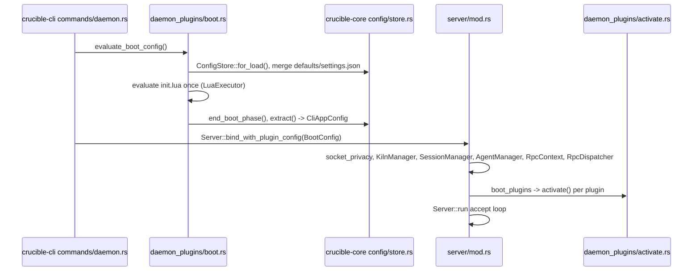

## 2. Client connect (`connect_or_start`) and session create/resume

1. A front end (`crucible-cli`'s `common::daemon_client_with_events`, or
   `crucible-web`'s `init_daemon`) calls
   `DaemonClient::connect_or_start_with_events()`
   (`crates/crucible-daemon/src/rpc_client/client/mod.rs`).
2. `validate_socket_path` checks the path length; `connect_with_events`
   tries the existing socket; `verify_or_restart` compares build SHAs and
   restarts a stale daemon.
3. On failure, `start_and_retry` spawns `cru daemon serve`
   (guarded by a `SpawnedDaemon`) and retries through `connect_backoff`
   (about 4.6s across 8 attempts).
4. The caller subscribes wildcard (`session_subscribe(&["*"])`) *before*
   calling `session.create`/`session.create_with_agent`
   (`crates/crucible-cli/src/session.rs`'s `open_session`), to avoid a
   create-then-subscribe race.
5. `session.create` reaches `handle_session_create` in
   `crates/crucible-daemon/src/server/session/create.rs`, which calls
   `RpcContext::create_session_resolved` in the same file. That resolves
   kilns against `KilnRegistry`, refuses a forbidden scope, resolves
   provider trust, resolves the requested agent, calls
   `SessionManager::create_session` in `crates/crucible-daemon/src/session_manager.rs`,
   then persists the resolved agent through `AgentManager::configure_agent`
   in `crates/crucible-daemon/src/agent_manager/session_config.rs`. Back in
   `crates/crucible-daemon/src/rpc/dispatch.rs`, `enforce_plugin_session_start`
   runs `SessionLifecycle::enforce_session_start` in
   `crates/crucible-daemon/src/session_lifecycle.rs` (fires `on_session_start`,
   checks isolation) only after that response exists — a plugin can call
   `session.create` from inside its own `on_session_end` hook, and the loader
   mutex is not reentrant.
6. `spawn_setup_task` in `crates/crucible-daemon/src/server/session/mod.rs`
   detaches indexing, plugin discovery and provider listing; the reply
   returns without waiting for it.
7. `cru session open` / a resumed TUI calls `session_resume_from_storage`,
   which `FileSessionStorage::load` in `crates/crucible-daemon/src/session_storage.rs`
   answers, re-checking the directory/id-agreement invariant and the scope
   floor on every load. `enforce_plugin_session_start` in
   `crates/crucible-daemon/src/rpc/dispatch.rs` runs the same
   `SessionLifecycle::enforce_session_start` gate on a `session.resume` reply
   as it does on `session.create`: only the id extraction differs.
   `session.resume` also resumes a session that this daemon does not hold,
   for example one that an earlier daemon recorded: `handle_session_resume`
   in `crates/crucible-daemon/src/server/session/lifecycle.rs` falls back to
   `resume_session_from_storage`. `cru acp`'s `session/load` needs this after
   a daemon restart. A message
   sent to an ended or paused session revives it and runs the same gate
   without a `session.resume` call at all — see step 3 of the next flow.

See [[RPC Client]] for connect/backoff detail, [[Session Services]] for
creation/lifecycle/agent construction, and [[CLI Commands]] for the
`cru chat` entry point.

```mermaid
sequenceDiagram
    participant FE as Front end (cru / web)
    participant DC as rpc_client/client/mod.rs DaemonClient
    participant D as daemon process
    participant Dispatch as rpc/dispatch.rs
    participant Create as server/session/create.rs
    participant SM as session_manager.rs
    participant AM as agent_manager/session_config.rs
    participant Lifecycle as session_lifecycle.rs

    FE->>DC: connect_or_start_with_events()
    DC->>D: connect / spawn+retry
    FE->>DC: session_subscribe(["*"])
    FE->>DC: session.create
    DC->>Dispatch: handle_session_create
    Dispatch->>Create: create_session_resolved
    Create->>SM: create_session
    Create->>AM: configure_agent (if agent given)
    Create->>Create: spawn_setup_task (detached)
    Create-->>Dispatch: Session
    Dispatch->>Lifecycle: enforce_plugin_session_start -> enforce_session_start
    Dispatch-->>FE: session_created reply
```

## 3. A user turn: TUI input through admission, tools, provider stream, and events back to TUI/web

1. `handle_key` in `crates/crucible-cli/src/tui/oil/chat_app/input_handling.rs`
   turns `Enter` into `Action::Send(ChatAppMsg::UserMessage)`
   (`crates/crucible-cli/src/tui/oil/chat_app/mod.rs`).
2. `process_action` in `crates/crucible-cli/src/tui/oil/chat_runner/actions.rs`
   is the sole place a daemon RPC leaves this crate; it calls
   `session_send_message` directly on the `DaemonClient` held by
   `params.session: Option<&crate::session::LiveSession>` — there is no
   client-side agent handle in between.
3. `handle_session_send_message` in `crates/crucible-daemon/src/server/session/messaging.rs`
   calls `AgentManager::send_message` in `crates/crucible-daemon/src/agent_manager/messaging/send.rs`,
   which reaches `send_message_inner` in the same file. It calls
   `get_or_revive_session` (same file), which loads an ended or paused
   session from storage and runs `SessionLifecycle::enforce_session_start`
   on it — the same gate `session.create`/`session.resume` run (step 5 and
   step 7 of the previous flow) — before the send continues, so a revived
   isolated session reclaims its sandbox rather than running one turn on the
   host. `send_message_inner` then claims `request_state`, resolves
   `session_tool_root` (`crates/crucible-daemon/src/agent_manager/scope.rs`),
   builds/reuses the agent handle, rebuilds the `ConversationTree`
   (`crates/crucible-core/src/turn/tree.rs`), and emits the `user_message`
   event before running Precognition
   (`crates/crucible-daemon/src/agent_manager/precognition/mod.rs`) — the
   tree rebuild reads `session.jsonl` and must run before the event that a
   separate writer task appends to it. The event's `origin` field carries
   the `TurnOrigin` (`crates/crucible-core/src/turn/mod.rs`) that
   `send_message`/`send_plugin_message`/`send_relayed_message`
   (`crates/crucible-daemon/src/agent_manager/messaging/send.rs`) set on the
   `TurnRequest`; `turn_msgs` in
   `crates/crucible-cli/src/tui/oil/chat_runner/commands.rs` renders a
   `TurnOrigin::Relay` turn as a prefixed user message and a
   `TurnOrigin::Plugin` turn as a system notice, so a plugin-issued or
   relayed turn never displays as one the local user typed.

   Precognition results, `transform_context`
   handler output and an attached review comment (flow 11) each become
   exactly one `<system-message kind="..." source="...">` injection, built by
   `ContextMessage::injection` in `crates/crucible-core/src/traits/context_ops/mod.rs`
   — never one element per entry.
4. `send_message_inner` spawns
   `execute_agent_stream` in `crates/crucible-daemon/src/agent_manager/messaging/stream.rs`,
   which drives the concrete `Agent::turn()` stream
   (`crates/crucible-core/src/turn/mod.rs`; the genai provider or
   `AcpAgentHandle`) and emits `SessionEvent`s. Sending an injected
   `System`-role message to an Anthropic model, `context_messages_to_chat`
   in `crates/crucible-daemon/src/provider/genai_handle.rs` picks the wire
   role from the message's `metadata.kind`: a tagged injection goes out as a
   `user` message instead of `system`, because Anthropic's API treats every
   `system` slot as one leading block, not a turn position. An ACP agent
   never receives per-message roles at all: `acp_prompt_text` in
   `crates/crucible-daemon/src/acp_handle/translate.rs` prepends this turn's
   tagged injections as plain text ahead of the user content.
5. On a `ToolCall`,
   `handle_tool_call_in_stream` in `crates/crucible-daemon/src/agent_manager/messaging/tool_call.rs`
   runs the gate pipeline in order: the plan-mode bar, active-tool
   narrowing, the agent card's hard `Deny`
   (`card_refusal` in `crates/crucible-daemon/src/agent_manager/messaging/gate_decision.rs`),
   the review-capture bracket (`open_review_bracket` in
   `crates/crucible-daemon/src/agent_manager/messaging/review_capture.rs`,
   see flow 4), plugin interception (`pre_tool_call` handlers), the
   isolation gate (`isolation_refusal` in
   `crates/crucible-daemon/src/agent_manager/messaging/isolation_gate.rs`),
   then the one tool policy (`decide_permission` in
   `crates/crucible-daemon/src/agent_manager/messaging/gate_decision.rs`,
   the same function the ACP path's `AcpGate::decide` calls). An unattended
   caller with nobody to prompt — `cru.tools.call` or a workflow validation
   command — instead calls `unattended_refusal` in the same file, which
   shares `decide_permission`'s `decide_unprompted` chain but treats an
   `Ask` outcome as a denial rather than a prompt. Then dispatch through
   `DaemonToolDispatcher::dispatch_tool` in `crates/crucible-daemon/src/tool_dispatch.rs`
   into `WorkspaceTools` or `CrucibleMcpServer`'s `NoteTools`/`SearchTools`/`KilnTools`
   (each resolving through `FsScope` in `crates/crucible-daemon/src/tools/fs_scope.rs`).
   No step here holds a write for a later decision; see flow 4 for what a
   writing call does inside this pipeline.
6. Every event goes through `EventBus::emit`, a method on the `EventBus`
   type in `crates/crucible-daemon/src/event_emitter.rs`. `emit` stamps a
   per-session `seq`, then sends the event to both the live
   `broadcast::Sender<SessionEventMessage>` ring and a lossless
   `crate::lossless_queue` journal, under one lock, so a slow-reader lag on
   the ring never drops a `session.jsonl` line — the persist task in
   `crates/crucible-daemon/src/server/mod.rs` reads the journal, not the
   ring. Kiln indexing (flow 6) does not read this journal at all: it runs
   off its own `IndexQueue`, fed by the watcher and by every daemon write.
   Under the same lock, the bus folds the event into the session's
   transcript (`TranscriptFold` in `crates/crucible-core/src/transcript/mod.rs`)
   and puts the ops of the fold in the `transcript` field of the live copy.
   The journal copy has no ops. `SessionManager::seed_seq` seeds the fold
   from the stored log when a session becomes resident, so the ops fit the
   snapshot that `session.history` serves. Each reader of a stored session
   reads the same fold: `SessionManager::load_transcript` for
   `session.history`, the Lua history rows (`message_rows` in
   `crates/crucible-daemon/src/session_bridge.rs`), `session.list_persisted`
   and `session.cleanup`, and `crucible_daemon::load_transcript` for
   `session.render_markdown`, `session.export_to_file` and `cru session`
   with no daemon. First, `stored_events`
   (`crates/crucible-daemon/src/observe/events.rs`) turns each old view line
   of the log into its wire event. The markdown export
   (`render_to_markdown`, `crates/crucible-daemon/src/observe/markdown.rs`)
   renders the transcript. It has no fold of its own.
7. `forward_events` in `crates/crucible-daemon/src/server/core/mod.rs` relays
   each message to a socket client (TUI or ACP host). The CLI TUI's live
   session runs `live_session_event_consumer` in
   `crates/crucible-cli/src/tui/oil/chat_runner/stream.rs` (a stored-history
   or replay run uses the plain `session_event_consumer`, which opens no
   interaction prompt); either way it keeps an event whose `session_id`
   matches this session, or is
   `crucible_daemon::subscription::WILDCARD_SESSION`, or is
   `crucible_daemon::event_map::SYSTEM_SESSION` — a `proposal_changed` event
   (flow 11) belongs to no session, so without that third case the filter
   would drop it before it ever reached the TUI. It translates a kept event
   via `session_event_to_chat_msgs`
   (`crates/crucible-cli/src/tui/oil/chat_runner/commands.rs`) into a
   `ChatAppMsg`, which `OilChatApp::on_message`
   (`crates/crucible-cli/src/tui/oil/chat_app/mod.rs`) folds into
   `ContainerList`/`CachedToolCall`
   (`crates/crucible-cli/src/tui/oil/`) for
   the next `render_frame` (`crates/crucible-cli/src/tui/oil/chat_runner/render.rs`).
8. In parallel, the web client reaches the same event through its own
   subscribed connection: `event_stream` in `crates/crucible-web/src/routes/chat.rs`
   calls `ReconnectingDaemon::subscribe_events` in
   `crates/crucible-web/src/services/daemon_event_stream.rs`, which
   subscribes a per-session broadcast channel inside `EventBroker` and calls
   `reconcile` to open (or keep open) the one upstream `session_subscribe`
   RPC that channel needs. `spawn_event_router` in
   `crates/crucible-web/src/services/daemon.rs` reads the daemon's raw event
   channel and calls `EventBroker::dispatch` for every event, which fans it
   into the per-session channel `subscribe_events` handed out; `event_stream`
   forwards it as the daemon's own `{event, data}` pair — `to_sse` in
   `crates/crucible-web/src/routes/chat.rs`. See flow 12 for the
   system-scoped sibling of this stream.

See [[Agent Manager]] for the full gate pipeline and precognition,
[[Tools and Admission]] for dispatch/containment, [[TUI Chat App]] and
[[TUI Components]] for the client-side reducer, [[Daemon Server]] for
`EventBus`, and [[Web Server]] for the SSE projection.

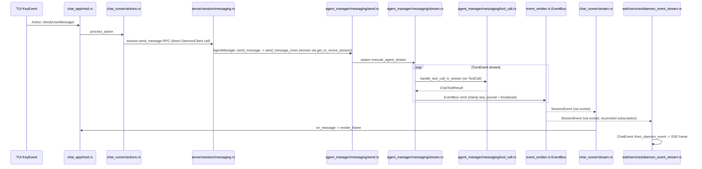

Before `Handler` calls `send_message`, it reads `content` through
`AgentManager::slash_route` (`agent_manager/commands.rs`), against the
session's one command catalog. Plain text, a built-in command, and an agent
command all answer `SlashRoute::Message`, so the diagram above still holds
for them unchanged. A mode switches the session and starts no turn unless
`rest` has text; a plugin command runs and answers without a turn; a skill
attaches its instructions and lets the diagram's turn proceed. The RPC
answers a `SendOutcome`: `Turn { message_id }` for a turn that started, or
`Command { command, result }` for one the daemon ran without a turn.

## 4. A tool call that writes a note, through propose-or-apply disposition

No step in flow 3's gate pipeline holds a write for a later human decision
any more. A write either lands now (`Apply`) or becomes a `Proposal` nobody
has decided yet (`Propose`); flow 11 covers reading and deciding on what
either one produced.

1. Inside step 5 of flow 3, `open_review_bracket`
   (`crates/crucible-daemon/src/agent_manager/messaging/review_capture.rs`)
   calls `ReviewLedgers::open_bracket` in `crates/crucible-daemon/src/review/mod.rs`,
   capturing every tracked root's current tree
   (`RootBackend::capture` in `crates/crucible-daemon/src/review/backend.rs`).
   This brackets the call for attribution; it never blocks it.
2. A writing tool call (for example `update_note`, `NoteTools` in
   `crates/crucible-daemon/src/tools/notes/mod.rs`) resolves the write
   through `resolve_note_write` in `crates/crucible-daemon/src/tools/notes/helpers.rs`
   (`FsScope::resolve_for_write`, `is_note_file` on both path forms) and
   takes the write lock via `crate::file_write::lock`
   (`crates/crucible-daemon/src/file_write.rs`), then asks
   `propose::Disposition` (`crates/crucible-daemon/src/tools/notes/propose.rs`)
   which way this turn's `TurnWriteMode` points.
3. In `Disposition::Apply` (the default), the tool calls `write_locked` in
   `crates/crucible-daemon/src/file_write.rs` with an `ExpectedBase` — a
   merge-or-refuse check against whatever is on disk, never a raw
   `std::fs::write`. `write_locked` also calls `crate::kiln_manager::landed`
   under the same write lock, queuing the change for the kiln index (flow 6)
   without waiting on the watcher's echo of it.
4. In `Disposition::Propose(writes)`, the tool never touches disk. It calls
   `NoteWrites::propose`/`propose_all` (same file), which records the change
   as an `Open` `Proposal` in `ProposalStore` (`crates/crucible-daemon/src/proposals/mod.rs`),
   keyed by `author_of(session)` and the note's canonical kiln root; a second
   write of the same turn to the same path extends that proposal instead of
   opening a new one. `delete_note` refuses outright in `Propose`
   disposition — a proposal holds new text, not a removal.
5. On tool-call completion (either disposition), `ReviewLedgers::close`
   (`crates/crucible-daemon/src/review/mod.rs`) re-captures each root, diffs
   against the bracket's before-tree, and appends an `Interval` via
   `record_interval` in `crates/crucible-daemon/src/review/persist.rs` →
   `append` in `crates/crucible-daemon/src/review/journal.rs` (`review.jsonl`)
   — for a `Propose` write this records that the *proposal* was made, not
   that the kiln changed, since nothing did.
6. A `.base` write takes the same fork one level up: `Writer::put` in
   `crates/crucible-daemon/src/bases/disposition.rs` resolves the path
   through `crate::file_write::contain` first, then calls `Writer::dispose`,
   which reads the same `Disposition` check; see flow 10 for the rest of
   that path.

See [[Review]] for the ledger/journal/retention model,
[[Tools and Admission]] for the write-containment path this crosses, and
flow 11 for the diffset read and the proposal decision that follows.

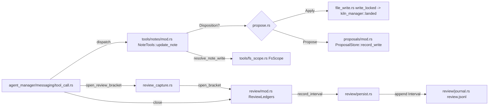

## 5. Plugin discovery and activation

1. `PluginManager::discover` in `crates/crucible-lua/src/lifecycle/discovery.rs`
   walks search paths and reads each candidate's `spec.luau` through
   `read_fragment` in `crates/crucible-lua/src/lifecycle/fragment.rs`'s
   read-only sandbox — no `cru`, no `require`, no plugin code runs.
2. At boot, `Server::bind_with_plugin_config` (step 1) calls
   `DaemonPluginLoader::load_plugins_from_spec`
   (`crates/crucible-daemon/src/daemon_plugins/mod.rs`), which calls
   `activate` in `crates/crucible-daemon/src/daemon_plugins/activate.rs` for
   every discovered/spec entry.
3. `activate` resolves `enabled`/`opts` via
   `resolve_enabled` in `crates/crucible-daemon/src/daemon_plugins/resolve.rs`/`resolve_opts`,
   `require`s the entry module once in the one shared VM (or matches an
   instance already run synchronously during `init.lua`'s own `require`,
   via `install_boot_require_hook`), parses the returned table with
   `spec_from_table` in `crates/crucible-lua/src/lifecycle/spec.rs`, registers
   tools/commands/services, then runs the spec entry's `config` or the
   module's `setup(opts)`, then `on_load`.
4. `cru plugin add`/`plugin.install` (`crates/crucible-daemon/src/plugin_ops.rs`,
   `crates/crucible-daemon/src/server/plugin_install.rs`) clones a git
   plugin and calls the same `activate` — runtime install and boot
   converge on one activation body.
5. Going `Error`/`Disabled`/reload/remove calls
   `DaemonPluginLoader::make_plugin_inert`
   (`crates/crucible-daemon/src/daemon_plugins/mod.rs`), which releases all
   nine registries a plugin can touch: the shared handler registry
   (`cru.on`, permission hooks, session hooks, the provider-auth hook),
   schedules, timers, spawned services, tools/commands, publications,
   surfaces, options, and statusline.

See [[Luau Host]] for the full boot/activation sequence and every registry
`make_plugin_inert` releases.

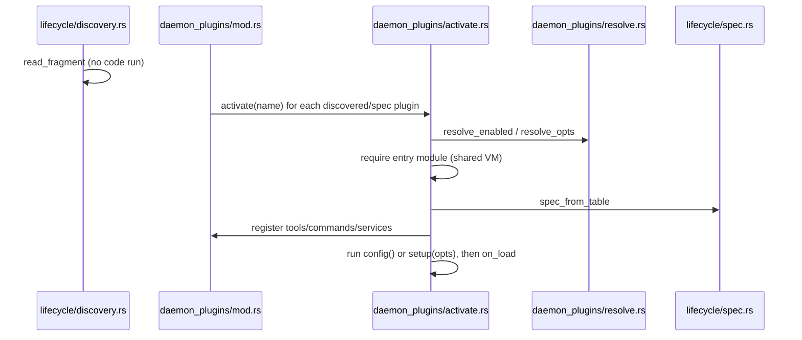

## 6. Kiln file change to parse, link index and embeddings

One lossless, per-kiln `IndexQueue` (`crates/crucible-daemon/src/kiln_manager/index.rs`)
feeds one index-owner task; a daemon write and an external editor's write
both end up there, but they enter it by different doors.

1. A daemon write — a note-tool write (`NoteTools`, `crates/crucible-daemon/src/tools/notes/mod.rs`),
   an RPC file write (`handle`/`write_for_roots` in
   `crates/crucible-daemon/src/file_write.rs`), or a proposal accept
   (flow 11) — calls `write_locked`, which calls `crate::kiln_manager::landed`
   under the same write lock. `landed` pushes an `IndexJob` (`ChangeOrigin::Daemon`)
   onto every open kiln's `IndexQueue` and marks the path as this write's
   echo, so the watcher does not queue it a second time.
2. An external editor's write instead reaches disk with nobody telling the
   daemon first. `NotifyWatcher` in `crates/crucible-daemon/src/watch/backends/notify_backend.rs`
   debounces it at the OS level; `WatchManager` in `crates/crucible-daemon/src/watch/manager.rs`'s
   event-processing task dispatches to `IndexingHandler` in
   `crates/crucible-daemon/src/watch/handlers/indexing.rs`, which turns the
   change into a `SessionEvent` and hands it to the kiln's
   `DaemonEventBridge` (`crates/crucible-daemon/src/file_watch_bridge.rs`).
   `DaemonEventBridge::emit` pushes an `IndexJob` (`ChangeOrigin::Watcher`)
   onto the same `IndexQueue` — unless `IndexQueue::is_echo_of_write`/
   `_removal`/`_move` recognizes it as the very echo step 1 just marked —
   then broadcasts the `SessionEventMessage` on the daemon's `EventBus`
   itself, ahead of indexing: the watcher path announces first and indexes
   second.
3. One task per kiln, `KilnManager::run_index_jobs` in
   `crates/crucible-daemon/src/kiln_manager/index.rs`, drains its
   `IndexQueue` in order and calls `apply`, which calls `sync` →
   `KilnManager::process_file` in `crates/crucible-daemon/src/kiln_manager.rs`
   — taking the `connections` write lock and calling
   `NotePipeline::process_with_events` in `crates/crucible-daemon/src/pipeline/note_pipeline.rs`.
   For a `ChangeOrigin::Daemon` job (step 1's kind), `apply` also calls
   `announce_file` to broadcast the `file_changed`/`file_deleted`/`file_moved`
   event a watcher would otherwise have sent — a daemon write's own bridge
   announcement never runs, so this is the only place that event comes from.
4. `NotePipeline` quick-filters on content hash, then calls
   `CrucibleParser::parse_file` in `crates/crucible-core/src/parser/implementation.rs`
   (hashes before frontmatter split, runs `ExtensionRegistry::apply` —
   `BasicMarkdownIt`, `Wikilink`, `InlineLink`, `Latex`, `EnhancedTags` — in
   order), producing a `ParsedNote`
   (`crates/crucible-core/src/parser/types/parsed_note.rs`).
5. `NotePipeline` calls `Enricher::enrich` in `crates/crucible-daemon/src/enrichment/service.rs`
   (unless skipped), then `NoteStore::upsert` in `crates/crucible-core/src/storage/note_store.rs`
   — implemented by
   `SqliteNoteStore` in `crates/crucible-daemon/src/storage/sqlite/note_store.rs`,
   which internally reruns link resolution via
   `crates/crucible-daemon/src/storage/sqlite/link_index.rs` — then, if
   configured, `BlockStore::replace_note_blocks`
   (`crates/crucible-daemon/src/storage/sqlite/block_store.rs`, optionally
   through the `index:blocks` Lua stage,
   `crates/crucible-daemon/src/retrieval_stage.rs`) and
   `FtsIndex::index` (`crates/crucible-daemon/src/storage/sqlite/fts.rs`).
6. `KilnManager::announce` fans the note-lifecycle `SessionEvent`s
   `process_with_events` returned through `EventBus::emit`, the same
   stamp-and-publish call step 6 of flow 3 uses.

See [[Parser]] for the parse sequence and byte-offset invariants, and
[[Knowledge Storage and Retrieval]] for the queue, pipeline, SQLite backend
and retrieval side.

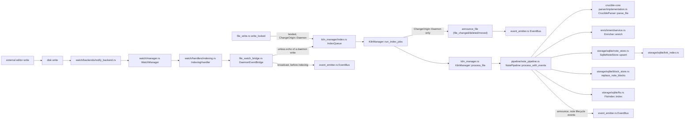

## 7. Web HTTP/WebSocket request to daemon RPC

1. `crates/crucible-cli/src/commands/web.rs` calls
   `crucible_web::start_server` (`crates/crucible-web/src/server.rs`),
   which calls `services::daemon::init_daemon` — connecting or
   auto-spawning a `DaemonClient` the same way step 2 does — and builds
   `AppState` (`crates/crucible-web/src/services/daemon.rs`).
2. A browser request to `/api/*` passes
   `bearer_auth` in `crates/crucible-web/src/middleware/auth/mod.rs`, which
   runs `HostPolicy::accepts` first, then relaxes (auth disabled, loopback,
   bearer token, session cookie).
3. A route handler (for example
   `crates/crucible-web/src/routes/session/mod.rs`) calls one
   `state.daemon.*` method, which goes through
   `ReconnectingDaemon::forward_rpc` in `crates/crucible-web/src/services/daemon.rs`,
   itself a thin call into the same `DaemonClient` RPC surface `crucible-cli`
   uses (`crates/crucible-daemon/src/rpc_client/client/`).
4. The one SSE route, `GET /api/events` (`crates/crucible-web/src/routes/events.rs`,
   Simplification Plan step 19), subscribes every topic a client names in
   `?topics=a,b,...` before it replays or forwards anything into any of
   them, so no event emitted between subscribe and replay is lost. A
   session's own topic (chat, step 8 of flow 3) and the `system` topic
   (publications, proposals, filesystem and surface changes, flow 12) both
   go through the same `subscribe_events` call inside this one route, in
   place of the four routes (`chat.rs`, `fs.rs`, `surface.rs`, and this
   file's own former `system_event_stream`) that used to call it
   separately. `routes/plugin.rs` defines the `PublicationChangedEvent`
   shape a plugin's publication projects into, but opens no stream of its
   own: a publication change travels the `system` topic, not a
   plugin-specific one.
5. On a connection-shaped error, `forward_rpc` retries once, only for a
   `ReplayPolicy::Safe` call; a `Once`-policy write (any daemon-side
   mutation) returns the error immediately rather than risk executing
   twice.

See [[Web Server]] for the full router assembly, auth/host defense, and
reconnect machinery, and [[RPC Client]] for the shared client library both
frontends call into.

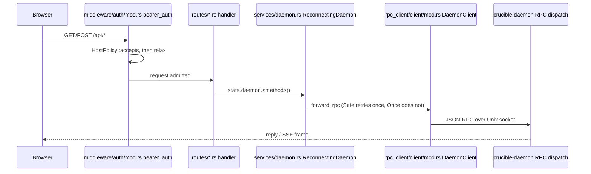

## 8. ACP entry (external agent) and MCP entry (external tool client)

**ACP: the daemon drives an external coding agent as a session's agent.**

1. `create_agent_from_session_config` in `crates/crucible-daemon/src/agent_factory.rs`
   sees `agent_type == "acp"` and calls `AcpAgentHandle::new`
   (`crates/crucible-daemon/src/acp_handle.rs`).
2. `AcpAgentHandle::new` resolves the launch command
   (`build_client_config` in `crates/crucible-daemon/src/acp_launch.rs`),
   optionally starts an `InProcessMcpHost`
   (`crates/crucible-daemon/src/mcp_host.rs`, containment-scoped to the
   session's kiln), then calls `CrucibleAcpClient::spawn` and
   `CrucibleAcpClient::handshake` (both in
   `crates/crucible-daemon/src/acp/client/connection.rs`), which spawn the
   process and send `session/new` or `session/resume`. If the agent refuses
   the in-process MCP server's HTTP transport, `AcpAgentHandle::new` drops
   it and retries the same spawn/handshake with stdio-only transport.
3. A turn calls `AcpAgentHandle::turn`, which drives
   `CrucibleAcpClient::prompt` in `crates/crucible-daemon/src/acp/client/streaming.rs`.
   The SDK dispatches each inbound `session/update` notification to
   `apply_update` in the same file, which turns it directly into a
   `crucible_core::turn::TurnEvent` — the same type step 3's internal agent
   emits — with no intermediate chunk type in between; tool-call frames merge
   through `TurnEvent::ToolCall`/`ToolResult`/`ToolCallUpdate`. Every event
   goes on the turn's `mpsc::UnboundedSender<TurnEvent>`, and
   `AcpAgentHandle::turn`'s stream body relays each one onward, so the rest
   of the turn pipeline (event emission, tool result handling) treats an ACP
   agent and the internal provider identically from that point on.

**MCP: an outside tool client calls into the daemon's own tools.**

1. `cru mcp` (`crates/crucible-cli/src/commands/mcp.rs`) starts/stops the
   daemon's `McpServerManager` in `crates/crucible-daemon/src/mcp_server.rs`,
   which serves `ExtendedMcpServer` in `crates/crucible-daemon/src/tools/extended_mcp_server.rs`
   over SSE or stdio.
2. `ExtendedMcpServer` wraps `CrucibleMcpServer` in `crates/crucible-daemon/src/tools/mcp_server.rs`
   (note/search/kiln/delegation/job tools) plus plugin tools and gateway
   tools; an incoming `tools/call` reaches the same
   `NoteTools`/`SearchTools`/`KilnTools` step 4's writing path uses.
3. An external ACP agent's own MCP client instead calls the *in-process*
   `InProcessMcpHost` from step 1 above, bound per-session and contained by
   the same `RootSet` step 3's tool dispatch uses.

See [[ACP and MCP]] for the wire client, `ToolCallTable` reconciliation, and
both MCP surfaces in full, and [[Tools and Admission]] for the containment
these both share.

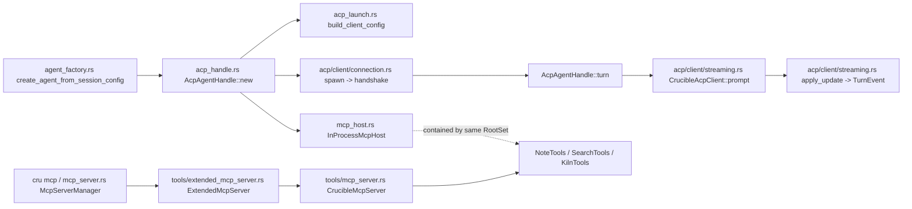

## 9. Fork, undo and delegation

**Fork.** `cru session fork` / `cru.session.fork` reaches
`fork_session` in `crates/crucible-daemon/src/agent_manager/session_config.rs`
(also `crates/crucible-daemon/src/server/session/models.rs` and
`fork_session` in `crates/crucible-daemon/src/session_bridge.rs` for the RPC and
plugin entry points respectively). It re-runs the trust gate against the
forked session's kilns, selects the history to carry over from the
`ConversationTree`, and refuses on unreadable history rather than forking a
partial view.

**Undo.** `undo` in `crates/crucible-daemon/src/agent_manager/models.rs` reads
the turn history and calls
`WorkspaceSnapshot::restore` in `crates/crucible-daemon/src/workspace_snapshot.rs`
to revert the workspace to a pre-turn git tree or byte journal, scoped
strictly to the workspace directory. There is no separate undo on the review
side any more: the ledger never reverts a hunk or replays a rejection, so a
decision an agent's write needs now goes through propose mode instead (flow
4) — a `Proposal` that is never accepted just sits `Open`, `Stale` or gets
superseded, with nothing to undo because nothing landed.

**Delegation.** 1. The `delegate_session` tool or
`crates/crucible-daemon/src/session_bridge.rs`'s `create_delegation` calls
`DelegationService::spawn_delegation` in `crates/crucible-daemon/src/delegation.rs`.
2. `spawn_delegation` validates depth (parent's `delegation_config.max_depth`),
checks the `allowed_targets` allowlist, and calls `AgentManager::refuse_untrusted`,
which resolves the child's trust (`AgentManager::resolve_agent_trust`) and
checks it against each parent kiln's `DataClassification` — a cloud ACP
target on a confidential kiln is refused regardless of name. 3. It acquires
a per-parent `Semaphore`
permit, calls `SessionManager::create_child_session`, then runs the same
`SessionLifecycle::enforce_session_start` gate every other creation path
passes through (step 2), since `create_child_session` alone runs no hooks.
4. A spawned watcher awaits the child's turn completion, ends the child
session, and emits `delegation_spawned`/`delegation_completed`/`delegation_failed`
events the parent's turn loop consumes. At child teardown,
`ReviewLedgers::harvest_and_clear` folds the child's review intervals into
the parent's ledger, stamped with the parent's turn coordinate (see flow 4).

See [[Agent Manager]] for the trust-gate re-run pattern shared by fork,
switch-model and revival, [[Session Services]] for delegation's full
depth/concurrency/trust gating, and [[Review]] for delegation harvest.

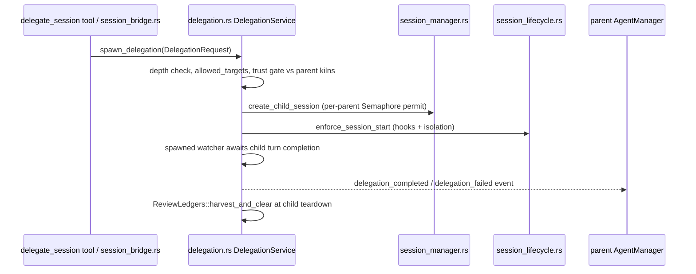

## 10. A Bases query and write

1. `base.list`/`base.views`/`base.query`/`base.create_entry`/`base.set_property`/`base.reorder_groups`
   RPCs (`crates/crucible-daemon/src/rpc/dispatch.rs`) reach `handle`/`handle_inner`
   in `crates/crucible-daemon/src/bases/mod.rs`; the Lua surface (`cru.kiln.*`)
   reaches `execute` in `crates/crucible-daemon/src/bases/plugin_api.rs`
   instead. Both resolve the named kiln to its root, build one
   `disposition::Writer`, and call the same `operation::execute` in
   `crates/crucible-daemon/src/bases/operation.rs` — the query engine and the
   write engine share one dispatcher regardless of which surface called in.
2. A `Query` operation reaches `query_scoped`: `entries_scoped` walks the
   kiln, parses every note with `CrucibleParser`, applies Obsidian property
   types from `.obsidian/types.json`, and builds one `Entry` per file; a
   single `eval::Context::new` resolves every wikilink and computes
   backlinks once for the whole query, not once per row.
3. A write operation (`set_property`, `create_entry`, `ensure_base`,
   `reorder_groups`, or a folder move) reaches `write.rs`, which takes
   `disposition::Writer::serialize` — the kiln-wide `ORDER_LOCK`, ahead of any
   per-path lock — before touching anything, so a policy such as a WIP limit
   sees every earlier write in the kiln.
4. `Writer::put` resolves the path through `crate::file_write::contain`
   before anything else touches it, then calls `Writer::admit`, which
   checks permission and write scope, then runs the `base:before_write` Lua
   policy hook (`policy::before`) with the final path, previous path,
   content, and (for a note) parsed properties and old properties; a
   handler answers `PassThrough` or `Cancel { reason }`.
5. `Writer::dispose` forks on the same `propose::Disposition` flow 4's note
   writes read: `Propose` packages the change as one `Proposal`; `Apply`
   runs the write inside `review_capture::attribute_write` — joining the
   current tool call's open bracket rather than opening a second one, so a
   plugin tool that writes a base inside a bracketed call is attributed to
   that call, not left contested.
6. On `Applied`, `Writer::changed` emits `event_map::base_changed`, so
   `base:changed` broadcasts the same payload the policy saw. A rejected or
   proposed write never emits it.

See [[Bases]] for the document/expression AST, the write-policy contract,
and the plugin review-attribution regression, and flow 11 for what a `Bases`
proposal's decision looks like once it reaches `ProposalStore`.

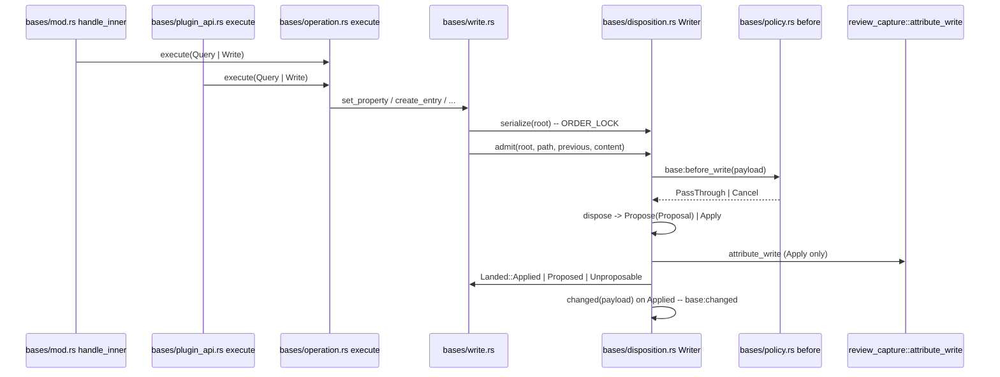

## 11. Diffset review and proposal decision

Nothing on the write side (flows 4 and 10) blocks for a decision. This flow
covers reading what changed and deciding a pending proposal, both of which
happen on demand, well after the write that made them.

1. `diff.get`/`diff.file` RPCs (`crate::server::diff`,
   `crates/crucible-daemon/src/server/diff.rs`) or `DaemonClient::diff_get`/
   `diff_file`/`diff_file_request` (`crates/crucible-daemon/src/rpc_client/client/storage.rs`)
   take a `crucible_core::diff::DiffsetSource` — `Branch`, `SessionRecord` or
   `Proposal` — not a bare session id. A `SessionRecord` source calls
   `ReviewLedgers::record_files`/`record_text` after
   `ensure_loaded`/`ensure_record_loaded`
   (`crates/crucible-daemon/src/server/session/review/mod.rs`); a `Branch`
   source reads git directly through `crates/crucible-daemon/src/diff/branch.rs`;
   a `Proposal` source calls `ProposalStore::diff_files`/`diff_text`
   (`crates/crucible-daemon/src/proposals/diff.rs`). All three answer the
   same `DiffFileEntry`/`DiffFileText` wire shapes.
2. `diff.comment`/`diff.resolve_comment`/`diff.delete_comment`/`diff.comments`
   (`crate::server::diff_comments`) call `CommentStore` in
   `crates/crucible-daemon/src/diff/comments.rs`, one JSON file per diffset
   under `<data_home>/diff-comments/`, regardless of which of the three
   sources owns it. A user attaches a stored comment to a chat message as a
   `CommentRef` or an `@comment:<id>` mention; `crate::server::diff_context::review_context`
   resolves it against the session's admitted roots, and
   `crate::diff::context::message` builds the one tagged injection flow 3
   step 3 describes.
3. `proposal.list`/`get`/`accept`/`reject`/`dismiss`/`resolve` RPCs
   (`crates/crucible-daemon/src/proposals/rpc.rs`) — from `cru proposal`
   (`crates/crucible-cli/src/commands/proposal.rs`), the web's
   `POST /api/proposals/{id}/*` (`crates/crucible-web/src/routes/proposals.rs`,
   a thin proxy), or `cru.proposals.accept`/`reject` through
   `DaemonSessionApi::decide_proposal` in `crucible-lua`'s `context.rs` —
   all reach the same `ProposalStore` methods.
4. Accepting or resolving admits every kiln root the proposal writes, then
   writes every file of the proposal as one set through
   `write_many_for_roots` in `crates/crucible-daemon/src/file_write.rs`
   (which calls `crate::kiln_manager::landed` per file, same as flow 6's
   step 1). A conflicting file makes the whole proposal `Conflicted { files }`,
   each `FileConflict` re-derived by a `merge3` three-way merge so every
   conflicting file is reported even when only one file's write failed.
   `split.rs`'s `accept_paths`/`reject_paths` decide a named subset instead,
   splitting the rest into a new `Proposal`.
5. `ProposalStore::announce` emits `proposal_changed` on the daemon's system
   session after every write, supersede, reject and dismiss — see flow 3
   step 7 for how the CLI TUI's own filter keeps a system-session event, and
   flow 12 for how it reaches a browser.

See [[Review]] for the full diffset/comment/proposal type map and the
capture-to-interval flow (flow 4's step 5), and [[RPC Client]] for the
`diff.*`/`proposal.*` client DTOs.

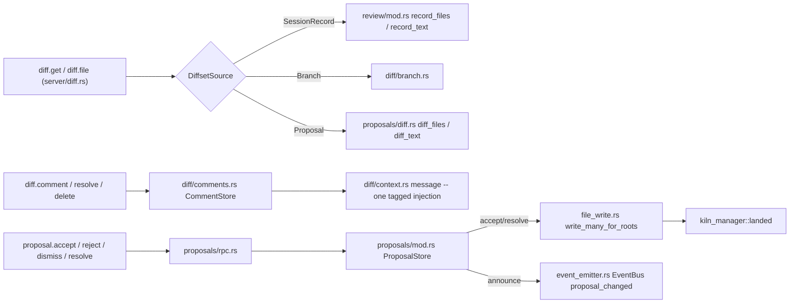

## 12. The web event stream: browser SSE reconciled against the daemon

Flow 3 step 8 covers a session's own topic of the one SSE route. This flow
covers the `system` topic `publication_changed`/`proposal_changed`,
filesystem and surface-change events travel, and the interest bookkeeping
every topic shares, all inside the one route Simplification Plan step 19
put them on, `GET /api/events` (`crates/crucible-web/src/routes/events.rs`).

1. A browser opens `GET /api/events?topics=system` (bare, or alongside a
   session id: `?topics=<session id>,system`). One connection carries every
   topic the page currently needs; the four routes this replaced
   (`chat.rs::event_stream`, `fs.rs::fs_event_stream`,
   `surface.rs::surface_event_stream`, and this file's own former
   `system_event_stream`) each opened their own.
2. `events_stream` calls `state.daemon.subscribe_events(topic)`
   (`ReconnectingDaemon::subscribe_events`,
   `crates/crucible-web/src/services/daemon_event_stream.rs`) for every named
   topic *before* it replays or forwards anything into any of them, for the
   same reason flow 3 step 8 subscribes first: `EventBroker::dispatch` drops
   an event for a session id with no local subscriber.
3. `subscribe_events` subscribes a per-topic (here, the `"system"` topic)
   broadcast channel inside `EventBroker`, then calls `reconcile`.
   `reconcile` compares `wants_events` (does any local channel still have a
   receiver) against the daemon-side `Upstream` state it is tracking for
   that id, and calls `session_subscribe`/`unsubscribe_events` on the daemon
   only when the two disagree — so a second browser tab opening the same
   topic costs one more local receiver, not a second daemon RPC, and the
   last tab closing releases the daemon subscription rather than leaking it.
4. `spawn_event_router` (`crates/crucible-web/src/services/daemon.rs`) is
   the one task reading the daemon's raw event channel; it calls
   `EventBroker::dispatch` for every event, which fans it into whichever
   per-topic channels `subscribe_events` handed out, `"system"` included.
5. `events_stream` merges the per-topic streams (`futures::stream::select_all`)
   and turns a `stream_gap` event on the `system` topic into a control frame
   regardless of shape, and every other `system`-topic event through
   `system_event_frame`, which tries each of `FsEvent::from_daemon_event`,
   `SurfaceChangedEvent::from_daemon_event`,
   `PublicationChangedEvent::from_daemon_event`
   (`SystemPayload::PUBLICATION_CHANGED`, type defined in
   `crates/crucible-web/src/routes/plugin.rs`) and
   `ProposalChangedEvent::from_daemon_event` (`SystemPayload::PROPOSAL_CHANGED`,
   defined in `routes/events.rs`) in turn, dropping an event none of them
   recognise. Every frame's body gains a `topic` field before it is written.
   The browser reacts to a publication or a proposal by refetching —
   `GET /api/plugins/publications` or `GET /api/proposals/{id}` — never by
   reading a value out of the event itself.

See [[Web Server]] for `EventBroker`/`ReconnectingDaemon`'s full reconnect
and gap-recovery machinery, and flow 11 for what emits `proposal_changed` in
the first place.

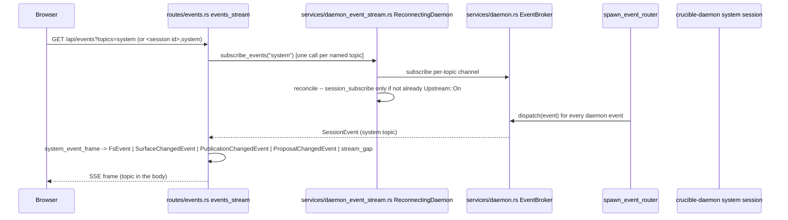
