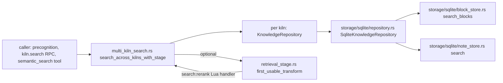

# Knowledge Storage and Retrieval

This page covers the daemon's persistent knowledge layer: the canonical
storage traits and domain types in `crucible-core`, the SQLite backend that
implements them, the registries that turn a filesystem path into a named
kiln or project, the one ordered index queue and the pipeline that turn a
disk change into indexed rows, multi-kiln semantic and full-text search, and
the file-watch pipeline that feeds that queue (and keeps the review ledger
synchronized with changes made outside the daemon).

## Purpose and ownership

Per `AGENTS.md`, `crucible-core` holds the canonical domain types and
traits — `NoteStore`, `BlockStore`, `PropertyStore`, `Scope`, `KilnFileKind`,
the enrichment domain types, and the wire types for a note write — while
`crucible-daemon` owns "storage, retrieval" and their SQLite implementation.
This page's subsystem:

- **Owns**: the traits and domain types that describe a note, a block, a
  property and a scope (`crucible-core/src/storage/*`,
  `crucible-core/src/enrichment/*`); the SQLite tables and migration ladder
  that store them (`crucible-daemon/src/storage/sqlite/*`); the registry that
  decides which filesystem paths may become a kiln or a project
  (`crucible-daemon/src/kiln_registry.rs`, `crucible-daemon/src/project_manager.rs`,
  their machine-written state files); the daemon's file read/write critical
  section (`crucible-daemon/src/file_write.rs`); the one lossless index
  queue and its drain task that turn a daemon write or a watcher report into
  stored rows (`crucible-daemon/src/kiln_manager/index.rs`), and the note
  pipeline they call (`crucible-daemon/src/pipeline/*`,
  `crucible-daemon/src/enrichment/*`); multi-kiln retrieval and its optional
  Lua rerank stage (`crucible-daemon/src/multi_kiln_search.rs`,
  `crucible-daemon/src/retrieval_stage.rs`); and the file-watch pipeline that
  reports disk changes for both indexing and the review ledger's
  external-change backstop (`crucible-daemon/src/watch/*`).
- **Must not own**: it does not decide *whether* a session may reach a kiln
  (that is admission/scope, per `AGENTS.md`'s `agent_manager/scope.rs` and
  `tools/{containment,surface}.rs` boundary); write-side scope enforcement for
  `NoteStore::upsert`/`delete` is explicitly left to the caller above the
  trait, not to this subsystem's traits. It does not merge the parser, the
  link index and embeddings into one type — `crucible-daemon/src/pipeline/note_pipeline.rs`'s
  `NotePipeline` connects them without merging them, matching `AGENTS.md`'s
  "Knowledge has separate owners" rule.
- A few files in scope sit at the edge of this ownership on purpose:
  `crates/crucible-daemon/src/scm.rs` (git clone for project registration),
  `crates/crucible-daemon/src/workspace_targets.rs` (workspace path resolution
  before `session.create`) and `crates/crucible-daemon/src/workspace_snapshot.rs`
  (turn-level undo) share the registration/root-safety machinery with kiln
  and project registration but serve session lifecycle, not the index
  itself — see the Findings section below.

## Module map

### `crates/crucible-core/src` — canonical domain types

| Path | Lines | Role |
| --- | --- | --- |
| `crates/crucible-core/src/file_write.rs` | 137 | `FileWriteRequest`/`FileChange`/`FileReadRequest`/`FileReadReply`/`FileContent`/`ExpectedBase` — the daemon's file read and write wire types; canonical types declared here, the read/write paths owned by the daemon. |
| `crates/crucible-core/src/kiln.rs` | 276 | `KilnFileKind` — the one classification of what a file inside a kiln is (`Note`/`Canvas`/`Base`/`PlainText`/`Asset`), replacing per-caller extension checks; also `is_excluded_name`, the dotfile/`EXCLUDED_DIRS` predicate a kiln walk skips. |
| `crates/crucible-core/src/processing.rs` | 117 | `ProcessingResult` — the outcome the note pipeline reports for one file (success with changed blocks, or skipped as unchanged). |

### `crates/crucible-core/src/enrichment`

| Path | Lines | Role |
| --- | --- | --- |
| `crates/crucible-core/src/enrichment/embedding.rs` | 122 | `EmbeddingProvider` trait — the dependency-inversion seam over concrete embedding backends. |
| `crates/crucible-core/src/enrichment/eval.rs` | 281 | Golden-set types and pure retrieval metrics (`mrr`, `hit_rate_at_k`) for the retrieval-quality eval harness. |
| `crates/crucible-core/src/enrichment/geometry.rs` | 363 | Pure vector-geometry functions (`cosine`, `arc_best`, `curve_best`) composed from Lua via `cru.vec`. |
| `crates/crucible-core/src/enrichment/mod.rs` | 19 | Module root; re-exports the enrichment public surface and the pipeline config types. |
| `crates/crucible-core/src/enrichment/types.rs` | 254 | `EnrichedNote`, `BlockEmbedding`, `EnrichmentMetadata` — the domain shape of a note ready for storage. |

### `crates/crucible-core/src/storage`

| Path | Lines | Role |
| --- | --- | --- |
| `crates/crucible-core/src/storage/block_store.rs` | 106 | `BlockStore` trait and `BlockRecord`/`BlockHit`/`CachedVector` — block-granularity vector storage. |
| `crates/crucible-core/src/storage/error.rs` | 155 | `StorageError`/`StorageResult`, the crate-wide storage error enum with retryable/corruption classification. |
| `crates/crucible-core/src/storage/error_ext.rs` | 14 | `StorageResultExt` — `.storage_backend()` sugar converting any `Display` error into `StorageError::Backend`. |
| `crates/crucible-core/src/storage/mod.rs` | 36 | Module aggregator and re-export surface for `crucible-core::storage`. |
| `crates/crucible-core/src/storage/note_store.rs` | 699 | `NoteStore` trait, `NoteRecord`, `Filter`/`Op`, link/graph types (`LinkOccurrence` now carries `heading_ref`) — the unified note metadata and search abstraction. |
| `crates/crucible-core/src/storage/property_store.rs` | 57 | `PropertyStore` trait for EAV key/value properties backing the plugin `cru.storage` API. |
| `crates/crucible-core/src/storage/scope.rs` | 363 | `Scope` — the memory-scoping security boundary (`same_workspace`) that keeps sibling workspaces isolated. |
| `crates/crucible-core/src/storage/scoped_links.rs` | 84 | `visible_paths`/`scoped_outlinks`/`scoped_backlinks` — applies `Scope` filtering on top of `NoteStore`'s raw link-graph reads. |

### `crates/crucible-daemon/src` — registries, retrieval and workspace utilities

| Path | Lines | Role |
| --- | --- | --- |
| `crates/crucible-daemon/src/file_watch_bridge.rs` | 236 | Adapts `crucible_core::events::EventEmitter` onto the kiln's index-owner queue and the daemon's `EventBus`, dropping the echo of a daemon-originated write/delete/move. |
| `crates/crucible-daemon/src/file_write.rs` | 561 | The shared read/write critical section for browser/RPC reads and writes and note tools: innermost-root resolution, symlink containment, per-path locking, `Put`/`Patch`/`Remove` application (singly or as one `write_many_for_roots` set), and `fs.read`; every landed write/removal reports to the kiln's index owner under the same lock. |
| `crates/crucible-daemon/src/kiln_manager.rs` | 1447 | `KilnManager` — owns per-kiln SQLite/FTS connections, opens/closes them, drives `NotePipeline`, starts the watcher, owns the one lossless index-update queue for every daemon write and watcher report, and reconciles the index against disk. |
| `crates/crucible-daemon/src/kiln_manager/index.rs` | 387 | The kiln manager's one index-update owner: an ordered, lossless queue fed by the watcher bridge, every daemon write and `fs.move`, drained by one task that indexes and (for a daemon-originated change) announces. |
| `crates/crucible-daemon/src/kiln_registry.rs` | 875 | `KilnRegistry` — the single door turning a filesystem path into a named, floor-checked kiln; config-layer and runtime registration. |
| `crates/crucible-daemon/src/kiln_state.rs` | 453 | `KilnStateStore` — reader/writer for `kilns.json`, the machine-written kiln registration state layer. |
| `crates/crucible-daemon/src/multi_kiln_search.rs` | 1292 | Fans a semantic-search query across every attached kiln, merges/dedupes/trust-filters results, applies an optional Lua rerank stage, and returns the names of any kilns whose search failed alongside the hits. |
| `crates/crucible-daemon/src/project_manager.rs` | 1314 | `ProjectManager` — registers and manages projects in `projects.json`; enforces the catastrophic-root floor shared by every caller. |
| `crates/crucible-daemon/src/registry_store.rs` | 234 | `RegistryStore<T>` — the generic, locked, atomic read-modify-write helper behind every daemon JSON registry file. |
| `crates/crucible-daemon/src/retrieval_stage.rs` | 368 | The two Lua-transformable retrieval stages, `search:rerank` and `index:blocks`, where the first VM with a usable handler wins. |
| `crates/crucible-daemon/src/scm.rs` | 686 | Git helpers backing `scm.clone` and the plugin clone/pin bootstrap: one shared URL validator, pin validation and checkout, destination containment, argv-only `git` invocation with inherited `GIT_DIR`/etc. stripped. |
| `crates/crucible-daemon/src/workspace_snapshot.rs` | 739 | Captures/restores per-turn workspace state for undo, via a git throwaway-tree or an in-memory journal. |
| `crates/crucible-daemon/src/workspace_targets.rs` | 201 | Resolves a client-selected `workspace_target` spec against a plugin-published provider before `session.create`. |

### `crates/crucible-daemon/src/enrichment`

| Path | Lines | Role |
| --- | --- | --- |
| `crates/crucible-daemon/src/enrichment/mod.rs` | 10 | Module root; documents `Enricher` as the single concrete enrichment implementation. |
| `crates/crucible-daemon/src/enrichment/service.rs` | 751 | `Enricher` — turns a parsed note plus changed block ids into block embeddings, a note embedding and metadata, with content-hash vector reuse. |
| `crates/crucible-daemon/src/enrichment/types.rs` | 3 | Re-exports `BlockEmbedding`/`EnrichedNote`/`EnrichmentMetadata` from `crucible-core`. |

### `crates/crucible-daemon/src/kiln_manager` and `kiln_registry` — tests

| Path | Lines | Role |
| --- | --- | --- |
| `crates/crucible-daemon/src/kiln_manager/tests/mod.rs` | 857 | `KilnManager` open/close/list lifecycle, registry-driven bulk open, reconciliation, canvas indexing, text-index backfill, concurrent-open dedup. |
| `crates/crucible-daemon/src/kiln_manager/tests/note_events.rs` | 241 | Proves `KilnManager` broadcasts `note:created`/`modified`/`deleted` under the exact names `event_map` declares; its event-collecting helper also recognizes `note:renamed`, but no test in this file exercises a rename. |
| `crates/crucible-daemon/src/kiln_registry/tests.rs` | 660 | Unit tests for building `KilnRegistry` from config and for the registration floor (`refuse_forbidden_scope`). |

### `crates/crucible-daemon/src/pipeline`

| Path | Lines | Role |
| --- | --- | --- |
| `crates/crucible-daemon/src/pipeline/canvas_index.rs` | 300 | Converts a parsed `.canvas` document into a `NoteRecord`, extracting file-node and in-card-wikilink references as `links_to`. |
| `crates/crucible-daemon/src/pipeline/mod.rs` | 34 | Module root; re-exports `NotePipeline`/`NotePipelineConfig` and states the pipeline's orchestration-only design contract. |
| `crates/crucible-daemon/src/pipeline/note_pipeline.rs` | 1666 | `NotePipeline` — the daemon's single orchestrator turning a file on disk into indexed storage rows; also `write_rows_for_record`, which gives a caller-supplied `NoteRecord` (`note.upsert`) the same block and text rows a file-driven run would produce. |

### `crates/crucible-daemon/src/storage/sqlite` — the SQLite backend

| Path | Lines | Role |
| --- | --- | --- |
| `crates/crucible-daemon/src/storage/sqlite/adapters.rs` | 192 | `SqliteClientHandle` — builds a pool + note store into the `NoteStore`/`PropertyStore`/`BlockStore`/`KnowledgeRepository` trait objects the rest of the daemon consumes. |
| `crates/crucible-daemon/src/storage/sqlite/block_store.rs` | 461 | `SqliteBlockStore` — `BlockStore` over the `note_blocks` table, with an exact two-phase blob-scored top-k search. |
| `crates/crucible-daemon/src/storage/sqlite/config.rs` | 91 | `SqliteConfig` — plain configuration for the SQLite backend (path, WAL, foreign keys, timeouts, cache/mmap sizes). |
| `crates/crucible-daemon/src/storage/sqlite/connection.rs` | 267 | `SqlitePool` — connection wrapper around one shared `Connection`, pragma configuration, migration invocation at open. |
| `crates/crucible-daemon/src/storage/sqlite/error_ext.rs` | 14 | `SqliteResultExt` — converts `rusqlite::Error` into `StorageError`. |
| `crates/crucible-daemon/src/storage/sqlite/fts.rs` | 720 | `FtsIndex` — FTS5 full-text search over note title/content, plus the safe query builder `build_match_query`. |
| `crates/crucible-daemon/src/storage/sqlite/link_index.rs` | 890 | `pub(crate)` resolved-wikilink index (`note_links` v2 + `note_link_keys`) — deterministic, Obsidian-matching link resolution (Unicode-case-folded partial-path suffix matching, indexed by key) replacing both the old fuzzy runtime matcher and a per-resolve table scan. |
| `crates/crucible-daemon/src/storage/sqlite/mod.rs` | 57 | Module tree declaration and re-export surface for the SQLite backend. |
| `crates/crucible-daemon/src/storage/sqlite/note_store.rs` | 1404 | `SqliteNoteStore` — the `NoteStore` implementation: CRUD, scope-enforced reads, exact top-k cosine search, filter-to-SQL, link-index orchestration (including `note_link_keys` upkeep). |
| `crates/crucible-daemon/src/storage/sqlite/property_store.rs` | 383 | `PropertyStore` implementation over the `properties` EAV table, attached to `SqliteNoteStore`. |
| `crates/crucible-daemon/src/storage/sqlite/repository.rs` | 634 | `SqliteKnowledgeRepository` — bridges `NoteStore`/`BlockStore` to the daemon's higher-level `KnowledgeRepository` API used by precognition and search RPCs. |
| `crates/crucible-daemon/src/storage/sqlite/vector.rs` | 124 | `pub(super)` embedding codec and blob-direct cosine scorer shared by `note_store.rs` and `block_store.rs`. |

### `crates/crucible-daemon/src/storage/sqlite/schema`

| Path | Lines | Role |
| --- | --- | --- |
| `crates/crucible-daemon/src/storage/sqlite/schema/mod.rs` | 616 | Sole owner of DDL execution: the numbered migration ladder (`apply_migrations`, v1–v8) and `schema_migrations` bookkeeping; `DERIVED_TABLES` now also lists `note_link_keys`. |
| `crates/crucible-daemon/src/storage/sqlite/schema/tests.rs` | 730 | Unit tests for the migration ladder, including end-to-end upgrade paths from older on-disk schemas. |

### `crates/crucible-daemon/src/watch` — the file-watch pipeline

| Path | Lines | Role |
| --- | --- | --- |
| `crates/crucible-daemon/src/watch/backends/mod.rs` | 4 | Module gate re-exporting `NotifyWatcher`. |
| `crates/crucible-daemon/src/watch/backends/notify_backend.rs` | 375 | `NotifyWatcher` — wraps the `notify`/`notify-debouncer-full` crates into Crucible's `WatchHandle`/`FileEvent` model; decodes a kernel rename as one `Moved` event (not two `Modified`s) and a lost-events overflow as a `Rescan`. |
| `crates/crucible-daemon/src/watch/error.rs` | 125 | The watch subsystem's independent `Error`/`Result` type. |
| `crates/crucible-daemon/src/watch/events.rs` | 374 | `FileEvent`, `FileEventKind` (now including `Rescan`), `EventMetadata`, `EventFilter` — the shared file-event data model; `EventFilter::matches` always passes a `Rescan` and skips the extension filter for a folder-shaped `Moved`. |
| `crates/crucible-daemon/src/watch/external_changes.rs` | 1286 | `ExternalChangeTracker`/`ExternalChangeWatch` — classifies every worktree write as bracketed, external or untracked, for the review ledger. |
| `crates/crucible-daemon/src/watch/manager.rs` | 464 | `WatchManager` — the generic watch coordinator: backend instances, event queue, debouncer, handler registry, event-processing task. |
| `crates/crucible-daemon/src/watch/mod.rs` | 37 | Crate-level module declarations and re-exports for `watch`. |
| `crates/crucible-daemon/src/watch/traits.rs` | 135 | `WatchHandle`, `WatchConfig`, `DebounceConfig`, and the `EventHandler` trait. |

### `crates/crucible-daemon/src/watch/handlers`

| Path | Lines | Role |
| --- | --- | --- |
| `crates/crucible-daemon/src/watch/handlers/external_change.rs` | 224 | `ExternalChangeHandler` — the `EventHandler` adapter feeding observed writes into `ExternalChangeTracker`; logs (does not reclassify) on a watcher-queue `Rescan`. |
| `crates/crucible-daemon/src/watch/handlers/indexing.rs` | 228 | `IndexingHandler` — the `EventHandler` that turns a watched file-tree change (including the lost-events rescan signal) into a `SessionEvent` and hands it to its emitter (the kiln's `DaemonEventBridge` in production), which queues it for the kiln index owner and broadcasts it. |
| `crates/crucible-daemon/src/watch/handlers/mod.rs` | 100 | `HandlerRegistry` (priority-sorted handler list) and the `create_default_handlers` factory; re-exports `IndexingHandler` and `WATCH_RESCAN_EVENT`. |

### `crates/crucible-daemon/src/watch/utils`

| Path | Lines | Role |
| --- | --- | --- |
| `crates/crucible-daemon/src/watch/utils/debouncer.rs` | 266 | `Debouncer` — in-process event debouncer grouping/deduplicating rapid successive events per path. |
| `crates/crucible-daemon/src/watch/utils/mod.rs` | 39 | Utils module wiring plus `EventUtils::deduplication_key`, whose exhaustive `FileEventKind` match now also covers `Rescan`. |
| `crates/crucible-daemon/src/watch/utils/queue.rs` | 121 | `EventQueue` — bounded FIFO with drop-oldest backpressure feeding handler dispatch; a drain after any drop appends a synthetic `FileEventKind::Rescan` so a consumer that mirrors the tree knows to re-read it. |

### `crates/crucible-daemon/src/workspace`

| Path | Lines | Role |
| --- | --- | --- |
| `crates/crucible-daemon/src/workspace/indexer.rs` | 214 | `index_workspace_files`/`index_kiln_notes` — pure filesystem listing helpers for `session.create`'s setup task; `index_workspace_files`' `git ls-files` call runs through `crucible_core::git::command()`, which strips the repository-selecting environment variables before running. |
| `crates/crucible-daemon/src/workspace/mod.rs` | 7 | Module wiring; documents the "free of daemon state" boundary that lets `indexer.rs` run inside `spawn_blocking`. |

## Key types and traits

- **`NoteStore`** (`crates/crucible-core/src/storage/note_store.rs`) is the
  unified storage abstraction for note metadata and semantic/graph search.
  Its supporting types are `NoteRecord` (path, content hash, embedding,
  title, tags, `links_to`, `links: Vec<LinkOccurrence>`, properties, scope),
  `Filter`/`Op` (query construction), `GraphLink`/`InboundLink`/`SearchResult`.
  `LinkOccurrence` carries an `Option<String> heading_ref` — the heading or
  named Base view following a wikilink target, threaded from the parser's
  `Wikilink::heading_ref` and persisted by `storage/sqlite/link_index.rs`'s
  `write_links` into `note_links.heading_ref`. `upsert`/`delete`/`content_hash`
  are unscoped at the trait layer by design ("write-side scope enforcement is
  the responsibility of the caller above the trait"); `get`/`list`/`get_by_hash`/`search`
  take an `authority: &Scope` and backends must filter server-side. It is
  implemented by `crates/crucible-daemon/src/storage/sqlite/note_store.rs`'s
  `SqliteNoteStore`, held as `Arc<dyn NoteStore>` inside
  `crates/crucible-daemon/src/storage/sqlite/adapters.rs`'s
  `SqliteClientHandle`, and consumed by `NotePipeline`, the RPC storage
  client, and the Lua `cru.kiln.*`/`cru.storage` bindings.
- **`BlockStore`** (`crates/crucible-core/src/storage/block_store.rs`) is the
  block-granularity counterpart: one row per parsed passage
  (`BlockRecord`), identified by `(note_path, span_start)`. Implemented by
  `crates/crucible-daemon/src/storage/sqlite/block_store.rs`'s
  `SqliteBlockStore`; created and held by `Enricher` and `NotePipeline`.
- **`PropertyStore`** (`crates/crucible-core/src/storage/property_store.rs`)
  is an EAV key/value trait for plugin-namespaced data. Implemented on the
  same `SqliteNoteStore` struct in
  `crates/crucible-daemon/src/storage/sqlite/property_store.rs`, but in a
  separate file from the `NoteStore` implementation — a cross-file
  trait-impl split worth knowing when tracing all impls of `SqliteNoteStore`.
- **`Scope`** (`crates/crucible-core/src/storage/scope.rs`) is the security
  predicate: `Scope::Workspace { path }` with `same_workspace` deciding
  visibility. It is created at kiln bind time
  (`crates/crucible-daemon/src/storage/sqlite/adapters.rs`'s
  `SqliteClientHandle::with_kiln_path`), held by every storage adapter that
  needs an authority, and consumed by `crates/crucible-core/src/storage/scoped_links.rs`'s
  filtering functions and by `crates/crucible-daemon/src/storage/sqlite/note_store.rs`'s
  `scope_authority_to_sql`.
- **`KilnFileKind`** (`crates/crucible-core/src/kiln.rs`) is the sole
  extension-based classification (`Note`/`Canvas`/`Base`/`PlainText`/`Asset`),
  consumed by the watcher, the pipeline, tools, and the CLI. `INDEXABLE_EXTENSIONS`
  includes `"base"`, so a `.base` (Obsidian Bases saved query) file is
  discovered and indexed like a plain-text file, without being a `Note`.
- **`ExpectedBase`** (`crates/crucible-core/src/file_write.rs`) is the merge/conflict
  check a checked write compares the disk against: `Unchecked`, `Absent`
  (no file expected), `Hash { hash }`, or `Text { text, hash }`. It replaces
  an ad hoc `(base_hash, base_text)` pair and makes "no file expected"
  distinct from "hash of an empty file," matching `AGENTS.md`'s "Rejection
  must distinguish an absent file from an empty one" rule. The same file also
  declares `FileReadRequest`/`FileReadReply`/`FileContent`/`FileEncoding`,
  the wire types behind the `fs.read` RPC.
- **`EmbeddingProvider`** (`crates/crucible-core/src/enrichment/embedding.rs`)
  is the dependency-inversion trait over embedding backends (object-safe,
  `Arc<dyn EmbeddingProvider>`); its stored-vector reuse key is
  `(provider_kind, model_name)`. Held by `Enricher` and by
  `crates/crucible-daemon/src/kiln_manager.rs` (via
  `get_or_create_embedding_provider`, outside this page's scope).
- **`EnrichedNote`/`BlockEmbedding`/`EnrichmentMetadata`**
  (`crates/crucible-core/src/enrichment/types.rs`) are the enrichment output
  domain types, produced by
  `crates/crucible-daemon/src/enrichment/service.rs`'s `Enricher::enrich`
  and consumed by `NotePipeline`.
- **`ProcessingResult`** (`crates/crucible-core/src/processing.rs`) is the
  outcome `NotePipeline::process`/`process_with_events` returns for one
  file: `Success { changed_blocks, embeddings_generated, warnings }` or
  `Skipped`.
- **`KilnManager`** (`crates/crucible-daemon/src/kiln_manager.rs`) owns
  `connections: RwLock<HashMap<PathBuf, KilnConnection>>` (each holding a
  `StorageHandle` — SQLite + FTS — and a `NotePipeline`), an `opening` gate
  `Mutex<HashMap<PathBuf, Arc<Mutex<()>>>>` serializing concurrent opens, an
  optional `event_tx: crate::EventBus` (`crates/crucible-daemon/src/event_emitter.rs`),
  and — for a manager with a bus — its one index owner: `index: Option<Arc<IndexQueue>>`,
  `index_jobs: Mutex<Option<lossless_queue::Receiver<IndexJob>>>` (taken once
  by the daemon's startup code via `take_index_jobs` and handed to
  `run_index_jobs`), and an `index_waiter` so `settle_index` can await "every
  job queued so far is applied." It is constructed once per daemon and
  shared as `Arc<KilnManager>` across `server/*` RPC handlers, `agent_manager`,
  and `daemon_plugins`.
- **`IndexQueue`/`IndexJob`/`ChangeOrigin`/`Landed`** (`crates/crucible-daemon/src/kiln_manager/index.rs`)
  are the one ordered channel (`crate::lossless_queue`) every kiln-file
  change passes through before the index or the event bus sees it. `IndexJob`
  is `Changed`/`Deleted`/`Moved`/`Rescan`, each tagged `ChangeOrigin::Daemon`
  or `::Watcher`; the free function `landed` (called by `file_write.rs` under
  the file's write lock, with no `KilnManager` handle in scope) signals every
  open `IndexQueue` in the process through a process-wide weak-referenced
  registry. `KilnManager::run_index_jobs` is the one task per daemon that
  drains the queue in order and calls `apply`/`sync`/`sync_moved_folder`.
- **`KilnRegistry`** (`crates/crucible-daemon/src/kiln_registry.rs`) holds
  `RwLock<KilnIndex>` (`entries: BTreeMap<KilnName, RegisteredKiln>` plus a
  reverse `by_path` map). Built at boot from config
  (`from_app_config`) and layered with runtime state
  (`overlay_state`, fed by `KilnStateStore::registrations()`); shared as
  `Arc<KilnRegistry>` into `KilnManager` via `with_kiln_registry`.
- **`ProjectManager`** (`crates/crucible-daemon/src/project_manager.rs`)
  holds a `DashMap<PathBuf, Project>` cache backed by a locked
  `RegistryStore<ProjectStateFile>`; the map is a cache, never the source of
  truth for a write.
- **`RegistryStore<T>`** (`crates/crucible-daemon/src/registry_store.rs`) is
  the generic locked read-modify-write primitive shared by
  `KilnStateStore`, `ProjectManager`, and (outside this page) `llm_state.rs`
  and `plugin_ops.rs`.
- **`NotePipeline`** (`crates/crucible-daemon/src/pipeline/note_pipeline.rs`)
  holds `Arc<CrucibleParser>`, `Arc<Enricher>`, `Arc<dyn NoteStore>`, an
  optional `Arc<FtsIndex>`, an optional `Arc<dyn BlockStore>`, and an
  optional `SharedStageVm` for the `index:blocks` plugin hook. Built by
  `KilnManager::open` via `with_config`/`with_index_stage`/`with_text_index`/`with_block_store`.
- **`Enricher`** (`crates/crucible-daemon/src/enrichment/service.rs`) holds
  `Option<Arc<dyn EmbeddingProvider>>` and `Option<Arc<dyn BlockStore>>`;
  stateless otherwise. Built by `KilnManager` and `NotePipeline`'s test
  helpers via `from_optional_provider`/`new`, then shared via `Arc`.
- **`KilnSearchSource`/`RerankStage`** (`crates/crucible-daemon/src/multi_kiln_search.rs`)
  are the inputs to `search_across_kilns_with_stage`: one entry per attached
  kiln's `KnowledgeRepository`, and an optional list of Lua stage VMs. The
  function's return type is `Result<(Vec<SearchResult>, Vec<String>)>`: the
  second element names each source kiln whose search failed (`"<kiln>:
  <error>"`), so a caller can tell the user rather than let a failed kiln
  look like a kiln with no match.
- **`StageVm`/`SharedStageVm`** (`crates/crucible-daemon/src/retrieval_stage.rs`)
  pair a `LuaScriptHandlerRegistry` with an `mlua::Lua`; held once per kiln
  inside `KilnConnection.pipeline` (`index:blocks`) and passed per-call into
  `multi_kiln_search` (`search:rerank`).
- **`WatchManager`** (`crates/crucible-daemon/src/watch/manager.rs`) owns
  `watchers: Arc<RwLock<HashMap<String, NotifyWatcher>>>`, an `mpsc` channel
  into a spawned event-processing task, a `Debouncer`, and a `HandlerRegistry`.
  Constructed by `KilnManager::open` (default handlers, feeding
  `IndexingHandler`, constructed with the kiln's `DaemonEventBridge` as its
  emitter) and separately by `ExternalChangeWatch::start` (default handlers
  disabled, feeding only `ExternalChangeHandler`). `IndexingHandler` reports a
  lost-events overflow as `WATCH_RESCAN_EVENT` (`crates/crucible-daemon/src/watch/handlers/indexing.rs`),
  which the bridge turns into an `IndexJob::Rescan` rather than broadcasting it.
- **`ExternalChangeTracker`/`CaptureWindow`** (`crates/crucible-daemon/src/watch/external_changes.rs`)
  are the review ledger's backstop: a `DashMap<PathBuf, RootState>`
  refcounts sessions per watched root, and `CaptureWindow` is an RAII guard
  a tool call holds open so writes made during it are attributed rather than
  flagged external.
- **`WorkspaceSnapshot`/`SnapshotMap`** (`crates/crucible-daemon/src/workspace_snapshot.rs`)
  capture a turn's starting state (a git tree or a journal of bytes) for
  undo; held in a `DashMap<(session_id, node_id), Arc<WorkspaceSnapshot>>`,
  used by `agent_manager`.

## Flows

### Registering and opening a kiln

1. A path is admitted by `crates/crucible-daemon/src/kiln_registry.rs`'s
   `KilnRegistry::register_path`/`register_named`/`register_discovered`,
   which funnel through `absolutize` → `refuse` (`refuse_forbidden_scope`) →
   `insert_entry`. A refused path yields no entry and no name.
2. `KilnManager::open` canonicalizes the path, checks `connections` under a
   read lock, and on a miss takes a per-path gate from `opening` so
   concurrent callers opening the same kiln serialize on the expensive setup
   rather than racing to insert two connections.
3. `create_sqlite_client` (`crates/crucible-daemon/src/storage/sqlite/adapters.rs`)
   opens a `SqlitePool`, which runs `schema::apply_migrations`
   (`crates/crucible-daemon/src/storage/sqlite/schema/mod.rs`) before any
   query executes.
4. `KilnManager` registers the kiln's name (`name_on_open`), runs a one-time
   link-reindex if the migration outcome asked for one, backfills the FTS5
   index if the note count exceeds the indexed count, builds a `NotePipeline`
   bound to the shared plugin VM, and starts a `WatchManager`.

### Writing and indexing a note

Every kiln-file change — a daemon write, a watcher-observed edit, or a
folder move — reaches the index through the same ordered, lossless queue
(`crates/crucible-daemon/src/kiln_manager/index.rs`), rather than the daemon
write reaching it early through its own reprocess and the watcher reaching it
late through the client-facing event bus, which drops events for a slow
receiver.

```mermaid
flowchart LR
    A[file_write.rs write_locked] -->|Put, Patch or Remove| B[disk write]
    A -->|landed, under the same lock| Q[kiln_manager/index.rs IndexQueue]
    B --> C[watch/backends/notify_backend.rs]
    C --> D[watch/manager.rs WatchManager]
    D --> E[watch/handlers/indexing.rs IndexingHandler]
    E -->|SessionEvent| BR[file_watch_bridge.rs DaemonEventBridge]
    BR -->|not an echo of a daemon change| Q
    BR -->|not an echo, not a folder move| Bus[daemon EventBus]
    Q --> J[KilnManager::run_index_jobs]
    J -->|daemon-originated job| Bus
    J --> F[KilnManager::apply / sync / sync_moved_folder]
    F --> G[pipeline/note_pipeline.rs NotePipeline::process_with_events]
    G --> H[enrichment/service.rs Enricher::enrich]
    G --> I[NoteStore::upsert]
    G --> K[BlockStore::replace_note_blocks]
    G --> M[FtsIndex::index]
    I --> L[storage/sqlite/link_index.rs write_links / reresolve_keys]
```

1. `crates/crucible-daemon/src/file_write.rs`'s `handle`/`write_for_roots`/`write_many_for_roots`
   resolve the *innermost* registered root that contains the path (a kiln
   wins over a project; inside each kind the narrower root wins), lock every
   path (sorted, for a multi-path set), and apply a `LockedChange::Put`
   (checked against an `ExpectedBase`), `Patch` (anchored edits), or `Remove`.
   `write_locked` calls `crate::kiln_manager::landed` **under the same
   per-path lock**: it marks the write so the watcher's later report of it is
   recognized as an echo, and pushes an `IndexJob` (`ChangeOrigin::Daemon`)
   onto every open kiln's `IndexQueue`. `fs.move` of a folder signals the
   index the same way, via `KilnManager::folder_moved`.
2. The file-watch pipeline also notices the change: `notify_backend.rs`
   decodes a kernel rename as one `FileEventKind::Moved` (not two `Modified`s)
   and a lost-events overflow as `FileEventKind::Rescan`; `watch/manager.rs`'s
   event-processing task dispatches the event to
   `crates/crucible-daemon/src/watch/handlers/indexing.rs`'s `IndexingHandler`,
   which turns it into a `SessionEvent` and hands it to its emitter — it does
   not parse, embed, or index anything itself.
3. For a kiln, that emitter is `crates/crucible-daemon/src/file_watch_bridge.rs`'s
   `DaemonEventBridge`. It asks `IndexQueue::is_echo_of_write`/`_removal`/`_move`
   whether the report repeats a daemon change already marked in step 1; if
   so, it drops the report (queues and broadcasts nothing). Otherwise it
   pushes an `IndexJob` (`ChangeOrigin::Watcher`) onto the kiln's `IndexQueue`,
   then broadcasts the change on the daemon's `EventBus` — except a moved
   *folder*, which is queued for the index but never broadcast, because a
   `FileMoved` handler expects a file.
4. One task per daemon, `KilnManager::run_index_jobs`, drains the `IndexQueue`
   in order and calls `apply`, which dispatches to `sync` (re-index a
   changed or deleted path), `sync_moved_folder` (re-index every file under a
   moved folder, at both its old and new path), or a full re-open for a
   `Rescan`. A job reads the disk when it runs, so a late or repeated job is
   harmless.
5. `sync` calls `NotePipeline::process_with_events` for a file that is still
   there. `NotePipeline` runs quick-filter (hash comparison, short-circuit on
   no change), parse (`CrucibleParser::parse_file`), enrich
   (`Enricher::enrich`, unless skipped), and store: `NoteStore::upsert`
   (which also keeps `note_link_keys` in sync and reruns link resolution via
   `crates/crucible-daemon/src/storage/sqlite/link_index.rs`), then, if
   configured, `write_block_rows` (`BlockStore::replace_note_blocks`,
   optionally passed through the `index:blocks` Lua stage in
   `crates/crucible-daemon/src/retrieval_stage.rs`) and `write_text_row`
   (`FtsIndex::index`). `.canvas` files take the parallel
   `crates/crucible-daemon/src/pipeline/canvas_index.rs` path instead of the
   markdown parser; a `.base` file takes the same shorter plain-text branch
   as a `.txt` file. For a path that is gone, `sync` drops its rows instead
   (`KilnManager::drop_note`).
6. For an `IndexJob` tagged `ChangeOrigin::Daemon`, `run_index_jobs` announces
   the change on the `EventBus` (`announce_file`) after the index has it. The
   watcher then reports the same bytes again; the bridge in step 3 drops that
   report as an echo, so a Lua `FileChanged` handler runs once per write, not
   twice.

A caller that stores a `NoteRecord` directly rather than through a file
change — `note.upsert`/`note.delete`, outside this page's files, via
`KilnManager::upsert_note_record`/`delete_note_rows` — does not go through
the index queue: `upsert_note_record` calls `NoteStore::upsert` and then
`NotePipeline::write_rows_for_record` to also write the block rows and the
text row a file-driven run would have produced (reading the file's body only
when the record's path is a plain relative path that resolves inside the
kiln); `delete_note_rows` removes the note row, its text row and (by
cascade) its block rows. A reader that must observe its own just-issued
write immediately, rather than after the index owner drains it, calls
`KilnManager::settle_index`.

### Retrieval

1. `crates/crucible-daemon/src/multi_kiln_search.rs`'s
   `search_across_kilns_with_stage` iterates every `KilnSearchSource`,
   trust-filters by `DataClassification`, and tries `search_blocks` before
   falling back to `search_vectors` — a block-level hit is preferred over a
   whole-note hit. A source whose search errors is skipped from the hit
   list but named, as `"<kiln>: <error>"`, in the function's second return
   value, so the caller can tell the user a kiln failed rather than let it
   look like a kiln with no match.
2. Each source's `KnowledgeRepository` (implemented by
   `crates/crucible-daemon/src/storage/sqlite/repository.rs`'s
   `SqliteKnowledgeRepository`) delegates to
   `crates/crucible-daemon/src/storage/sqlite/block_store.rs` and
   `crates/crucible-daemon/src/storage/sqlite/note_store.rs`, both of which
   score directly against the raw embedding blob
   (`crates/crucible-daemon/src/storage/sqlite/vector.rs`) before
   materializing only the top-k winners.
3. Results are merged and deduped by `(kiln_path, document_id, span_start)`,
   sorted deterministically, and — if a `RerankStage` with a live
   `search:rerank` handler was supplied — passed through
   `crates/crucible-daemon/src/retrieval_stage.rs`'s
   `first_usable_transform`, which lets a Lua handler reorder, rescore, or
   introduce a verified block before the final `top_k` cut.

### External-change tracking and undo (adjacent flows)

- `crates/crucible-daemon/src/watch/external_changes.rs`'s
  `ExternalChangeTracker` runs its own `WatchManager` (default handlers
  disabled) feeding only `ExternalChangeHandler`; every observed write is
  classified `Bracketed`, `External`, or dropped as noise/ignored, and
  broadcast to the review ledger. See [[Review]] for how the ledger
  consumes this classification.
- `crates/crucible-daemon/src/workspace_snapshot.rs`'s `WorkspaceSnapshot::create`
  captures a git tree (via a throwaway index) or a byte journal before a
  turn, and `restore` reverts to it on undo, scoped strictly to the
  workspace directory. See [[Agent Manager]] for the turn boundary that
  triggers capture/restore.
- `crates/crucible-daemon/src/workspace_targets.rs`'s `WorkspaceTargets::resolve`
  runs a plugin-published `targets`-channel command to produce the absolute
  path a session should be created against, before `session.create`
  commits a project registration or an agent working directory anywhere.
  See [[Session Services]].
- `crates/crucible-daemon/src/scm.rs`'s `clone_repo` and its validation
  functions (`normalize_clone_url`, `validate_clone_dest`) back the
  `scm.clone` RPC that seeds a project via git before
  `crates/crucible-daemon/src/project_manager.rs` registers it; `clone_repo`
  now also takes caller-supplied clone options, and `normalize_clone_url` is
  the one URL validator shared with the plugin clone bootstrap (outside this
  page), which also uses this file's `validate_pin`/`checkout_pin` to check
  out a plugin's pinned revision without letting the pin be read as a git
  option. `run_git` builds its `Command` from `crucible_core::git::command()`,
  which strips inherited `GIT_DIR`/`GIT_WORK_TREE`/etc. so a daemon process
  invoked inside a git hook or `git rebase --exec` cannot have its git calls
  redirected into the invoking repository; `workspace/indexer.rs`'s
  `git ls-files` call and `workspace_snapshot.rs`'s git calls use the same
  helper.

## State, concurrency and lifecycle

- **`KilnManager`**: a read-mostly `RwLock<HashMap<PathBuf, KilnConnection>>`
  guards open connections; a separate `Mutex<HashMap<PathBuf, Arc<Mutex<()>>>>`
  gate ("opening") serializes concurrent opens of the same kiln without
  holding the connections lock across the expensive setup await — entries in
  this gate are never removed, bounded by the number of kilns ever opened in
  the process's lifetime.
- **`IndexQueue`**: wraps a `lossless_queue::Sender<IndexJob>` and a
  `DashMap<PathBuf, (Echo, Instant)>` of the daemon's own recent writes,
  keyed by a canonicalized-parent/kept-name form (`echo_key`) because the
  daemon and the watcher can spell one file two ways, and a removed file has
  no canonical form of its own. A mark expires after `ECHO_WINDOW = 5s`
  (several times the notify debouncer's two 500ms stages) and is pruned on
  the next `mark`. A process-wide `static QUEUES: RwLock<Vec<Weak<IndexQueue>>>`
  registry lets the free function `landed` (called from `file_write.rs`,
  which has no `KilnManager` handle) signal every daemon's index owner in
  the process; the registry holds weak references, so a dropped daemon
  leaves no queue behind.
- **`KilnRegistry`**: one `RwLock<KilnIndex>`; every public method returns an
  owned snapshot so no borrow escapes the lock.
- **`ProjectManager`**: `DashMap` cache plus `RegistryStore`'s file lock;
  every mutation goes through `update_file`, so two racing `cru` processes
  cannot lose each other's writes.
- **`RegistryStore<T>`**: takes a blocking exclusive lock on a `<file>.lock`
  sidecar (never the data file itself, since the data file is renamed on
  every write) before every read or read-modify-write.
- **`SqlitePool`**: one shared `Arc<Mutex<Connection>>` (`parking_lot`);
  every SQL-touching method in the `sqlite/*` files spawns onto
  `tokio::task::spawn_blocking` around `with_connection`/`with_transaction`,
  keeping blocking `rusqlite` calls off the async runtime. `with_transaction`
  uses `unchecked_transaction()` because the connection is shared behind a
  mutex and cannot be borrowed mutably; the RAII guard rolls back a
  panicking write rather than leaving the connection stuck mid-transaction.
- **`WatchManager`**: a `RwLock<HashMap<String, NotifyWatcher>>` of backend
  instances, an `mpsc` channel into a `tokio::spawn`ed event-processing task
  running a `tokio::select!` loop (incoming events, a 50ms flush tick that
  drains the `Debouncer`, and shutdown), and an `Arc<Mutex<EventQueue>>`
  bounded FIFO with drop-oldest backpressure. A queue overflow does not
  disappear silently: `EventQueue::drain_all` appends one
  `FileEventKind::Rescan` after any drop since the last drain, which
  `IndexingHandler` always reports and the kiln bridge turns into an
  `IndexJob::Rescan`. `shutdown()` signals the task, awaits it, then drops
  all watchers — the per-watcher cleanup itself is a bare `debug!` log,
  flagged in its own comment as incomplete.
- **`ExternalChangeTracker`**: a `DashMap<PathBuf, RootState>` refcounts
  sessions per root; `CaptureWindow::drop` decrements and arms a suppression
  linger so writes still in flight through two debounce stages are not
  misclassified; `untrack_session` removes a session's entries synchronously
  and returns the roots that became fully unreferenced, which
  `ExternalChangeWatch::unwatch_session` then unwatches. Unlike `SnapshotMap`
  below, this path does no git work and spawns nothing.
- **`SnapshotMap`** (`workspace_snapshot.rs`): a `DashMap<(String, u32), Arc<WorkspaceSnapshot>>`
  keyed by session and turn node; releasing a snapshot's git keep-ref is
  likewise spawned rather than awaited inline.
- **Startup**: `KilnRegistry::from_app_config` builds the config layer at
  boot; `overlay_state` layers `kilns.json` under it. `ProjectManager::load`
  heals legacy on-disk kiln-path spellings and drops projects at forbidden
  roots, loudly.
- **Shutdown/cleanup**: kilns are closed via `KilnManager::close`, dropping
  the `KilnConnection` (pool, pipeline, watch manager); `ExternalChangeWatch::shutdown`
  and `WatchManager::shutdown` both exist as explicit async teardown paths
  rather than relying on `Drop` alone for anything that touches an
  OS-level resource (inotify handles, git keep-refs). `KilnManager::run_index_jobs`
  is its own `tokio::spawn`ed task, stopped by a `CancellationToken` the
  daemon cancels on shutdown; the loop holds no long-lived activity guard of
  its own, only one per job, so it never keeps the daemon alive by itself.

## Boundaries and invariants

- **Sibling-workspace isolation** is enforced twice: `crates/crucible-core/src/storage/scope.rs`'s
  `Scope::same_workspace` is the predicate; `crates/crucible-daemon/src/storage/sqlite/note_store.rs`'s
  `scope_authority_to_sql` composes it into every scoped SQL query, and
  `crates/crucible-core/src/storage/scoped_links.rs` applies the same
  predicate in memory for graph reads. `get`/`list`/`get_by_hash`/`search`
  make "does not exist" and "exists but denied" indistinguishable to the
  caller, deliberately, to avoid a side channel.
- **Write-side scope is above the trait, not inside it** — `NoteStore::upsert`/`delete`/`content_hash`
  take no `Scope` argument; `content_hash` in particular is read unscoped so
  the indexer's own quick-filter never mistakes "no row visible" for "not
  indexed yet" and re-embeds on every open.
- **Registration floor**: `crates/crucible-daemon/src/kiln_registry.rs`'s
  `refuse_forbidden_scope` and `crates/crucible-daemon/src/project_manager.rs`'s
  `forbidden_root_reason` refuse catastrophic universal roots (`/`, home and
  its ancestors, the sessions root) on both the lexical and canonicalized
  form of the path, so a symlink or a `..` traversal cannot bypass the
  floor. A refusal yields no entry and no name — never a name that resolves
  to nothing.
- **Note write containment**: `crates/crucible-daemon/src/file_write.rs`
  walks up to the nearest existing ancestor and canonicalizes it before
  writing, to contain a symlink escape, and distinguishes a forbidden
  (readable-but-not-writable) target from a not-found one. `fs.read` reuses
  the same `contain`/nearest-existing helpers, and root resolution for both
  reads and writes picks the *innermost* of possibly nested roots
  (`innermost_root`), not merely the first that matches.
- **`ExpectedBase::Absent` keeps an absent file distinct from an empty
  one**: a `Put` whose caller expects no file (`Absent`) always conflicts
  against an existing file, even an empty one, rather than merging silently;
  every caller of the checked write (`write_locked`, `write_many_for_roots`,
  the note tools) goes through `ExpectedBase`, per `AGENTS.md`'s "Rejection
  must distinguish an absent file from an empty one" rule.
- **`DAEMON_PROPERTY_KEYS`** (`crates/crucible-core/src/storage/note_store.rs`)
  is the exhaustive table of daemon-stamped property keys; `public_properties`
  strips every one of them before a property map reaches a client.
- **Vector reuse** is keyed by `(provider_kind, model_name)`, never model
  name alone, both in `crates/crucible-core/src/enrichment/embedding.rs`'s
  doc contract and in `crates/crucible-daemon/src/enrichment/service.rs`'s
  `storage_key`; a plugin-replaced vector is stored under a distinctly
  suffixed model name (`#index:blocks`) so the cache never conflates it with
  a provider's own vector.
- **Block identity**: `crates/crucible-core/src/storage/block_store.rs`'s
  `(note_path, span_start)` primary key means two top-level blocks of a note
  cannot begin at the same byte; `crates/crucible-daemon/src/storage/sqlite/block_store.rs`
  enforces this with `WITHOUT ROWID`.
- **Single DDL ownership**: every `CREATE`/`ALTER`/`DROP` for the kiln
  database runs from the numbered ladder in
  `crates/crucible-daemon/src/storage/sqlite/schema/mod.rs`; `DERIVED_TABLES`
  names which tables are safe to drop and rebuild because they are fully
  re-derivable from files on disk — `properties` is deliberately excluded.
  `note_link_keys` (see the link-resolution bullet below) is a `DERIVED_TABLES`
  member created and backfilled idempotently inside `link_index.rs`'s
  existing `ensure_note_links_v2` migration path, not through a new numbered
  `apply_migration_vN` step.
- **Link-resolution precedence** (`crates/crucible-daemon/src/storage/sqlite/link_index.rs`):
  exact extension-less path → unique title → unique path-suffix (file stem
  or partial path) → deterministic ambiguous winner (shortest path, then
  lexicographic) → dangling. Matching folds Unicode case in Rust (SQLite's
  `lower()` is ASCII-only); among exact matches the written case wins, so
  `a.md` and `A.md` stay distinct. Candidates come from `note_link_keys`, a
  per-note key table kept in sync by `SqliteNoteStore::upsert`/`delete`, not
  a scan of `notes`.
- **Canvas link containment**: `crates/crucible-daemon/src/pipeline/canvas_index.rs`
  drops any file-node reference that fails containment against the kiln
  root rather than indexing an attacker-chosen path.
- **External-change tracking is purely additive**: it never removes a hunk
  or overrides the review ledger's attribution; a missed event degrades to
  a delayed refresh, never a confidently wrong answer — including across a
  watcher-queue overflow, which `ExternalChangeHandler` only logs (it has no
  re-scan action of its own to take, unlike the indexing side).
- **Undo scope**: `crates/crucible-daemon/src/workspace_snapshot.rs`'s
  `restore` is scoped to the workspace directory (`.`), never `:(top)`, so
  an undo cannot revert a user's uncommitted edits in sibling directories.

## Extension seams

- **A new storage backend** implements `NoteStore`/`BlockStore`/`PropertyStore`
  from `crates/crucible-core/src/storage/` and is wired the way
  `crates/crucible-daemon/src/storage/sqlite/adapters.rs`'s
  `SqliteClientHandle` wires SQLite — proof required is link queries and
  scoped retrieval, not only CRUD self-tests, per
  [[Consolidation Plan#Extension seams]].
- **A new embedding provider** implements `EmbeddingProvider` from
  `crates/crucible-core/src/enrichment/embedding.rs`; provider wiring itself
  lives outside this page's files (`crucible-daemon/src/llm/embeddings/*`,
  `crucible-daemon/src/embedding.rs`).
- **A new retrieval-time behavior** (rerank or block-row rewrite) is a Lua
  handler registered for `StageId::SearchRerank` or `StageId::IndexBlocks`,
  consumed through `crates/crucible-daemon/src/retrieval_stage.rs`'s
  `first_usable_transform`/`index_blocks` — the first VM with a usable
  `Transform` wins; an erroring handler leaves the Rust default in place.
- **A new file-watch reaction** implements `EventHandler`
  (`crates/crucible-daemon/src/watch/traits.rs`) and registers through
  `crates/crucible-daemon/src/watch/handlers/mod.rs`'s `HandlerRegistry`,
  either via `create_default_handlers` (joins indexing) or a dedicated
  `WatchManager` instance with default handlers disabled (as
  `ExternalChangeWatch` does).
- **A new schema migration** adds `apply_migration_vN` to
  `crates/crucible-daemon/src/storage/sqlite/schema/mod.rs`, bumps
  `SCHEMA_VERSION`, and updates `DERIVED_TABLES` if the migration adds or
  removes a fully re-derivable table.
- **A new workspace-target provider** is a plugin publishing a `targets`
  channel entry with `axis = "workspace"`; `crates/crucible-daemon/src/workspace_targets.rs`
  resolves it before session creation without any change to this subsystem.

## Tests

- **Storage traits** (`crates/crucible-core/src/storage/note_store.rs`,
  `crates/crucible-core/src/storage/scope.rs`): inline unit tests prove
  builder behavior, filter/`Op` classification, serialization round trips
  and back-compat, and `Scope`'s canonicalization/frontmatter-parsing/legacy-refusal
  behavior. Pure unit tests, no daemon involved.
- **Enrichment math** (`crates/crucible-core/src/enrichment/geometry.rs`,
  `crates/crucible-core/src/enrichment/eval.rs`): inline tests cross-check
  `arc_best`/`curve_best` against a brute-force reference over random
  trials, and prove golden-set parsing/metric functions on malformed and
  empty fixtures.
- **`Enricher`** (`crates/crucible-daemon/src/enrichment/service.rs`):
  inline tests prove heading-trail breadcrumbing, changed-block filtering,
  and batching/failure propagation. That the note-level embedding is a
  distinct forward pass rather than a mean of block vectors is a design
  comment on `generate_note_embedding`, not a behavior a test asserts.
- **`KilnManager`** (`crates/crucible-daemon/src/kiln_manager/tests/mod.rs`,
  `crates/crucible-daemon/src/kiln_manager/tests/note_events.rs`): lifecycle,
  registry-driven open, index reconciliation (ghost rows dropped, a vanished
  kiln root must never drive mass deletion), canvas indexing, FTS backfill
  completeness, concurrent-open dedup, and event-bus broadcast naming —
  the last file explicitly calls the RPC handlers rather than the store, to
  avoid a "the caller does X" test that never invokes the caller.
  `crates/crucible-daemon/src/kiln_manager/index.rs` itself has no inline
  test module; its index-owner behavior (a folder move or an external
  rename leaves no ghost row, a daemon write is indexed without waiting for
  the watcher and announced exactly once, a rescan re-opens the kiln,
  `note.upsert` writes its text and block rows and reads no file outside the
  kiln) is instead covered end-to-end by the daemon-server integration tests
  in `crates/crucible-daemon/src/server/tests/kiln_index.rs`.
- **`KilnRegistry`** (`crates/crucible-daemon/src/kiln_registry/tests.rs`):
  config-driven construction and the registration floor, including
  symlink and `..`-traversal attempts against the sessions root and `$HOME`.
- **SQLite backend** (inline `#[cfg(test)]` modules in
  `crates/crucible-daemon/src/storage/sqlite/`,
  plus `crates/crucible-daemon/src/storage/sqlite/schema/tests.rs`): cover
  round-trip storage, SQL-injection rejection in filter translation,
  scope-enforcement regression tests (a kiln-path-unbound handle leaking
  sibling-workspace notes), FTS query-builder edge cases, resolved-link
  convergence after a note moves folders, and the full migration ladder
  including upgrades from pre-v1 schema shapes. `link_index.rs` also proves
  Unicode-case candidates agree with a scanned reference across a rename,
  partial-path/case-precedence resolution, that candidate lookup uses the
  `note_link_keys` index rather than a table scan, one-time key-table
  backfill on migration, and `heading_ref` round-tripping through storage
  and the v2-column migration; `schema/tests.rs` asserts every
  `DERIVED_TABLES` entry, including `note_link_keys`, has exactly one DDL
  constant.
- **`NotePipeline`/canvas** (inline tests in
  `crates/crucible-daemon/src/pipeline/note_pipeline.rs`,
  `crates/crucible-daemon/src/pipeline/canvas_index.rs`): quick-filter skip
  behavior (with a regression test naming a fixed 3m35s-per-boot reindex
  bug), plugin `index:blocks` row validation, and canvas link containment
  against `../../../etc/passwd`-shaped references.
- **`multi_kiln_search`** (inline `mod tests`/`mod rerank_tests` in
  `crates/crucible-daemon/src/multi_kiln_search.rs`): merge/dedupe/trust
  filtering across kilns, rerank-stage reorder/rescore/introduce behavior
  against a real `mlua::Lua` VM, and that a failing kiln is named in the
  function's second return value rather than silently dropped.
- **Watch pipeline** (inline tests in
  `crates/crucible-daemon/src/watch/`):
  real-`inotify` watch/unwatch, debounce-loses-no-event regression coverage,
  a kernel rename decoding as one `Moved` event rather than two `Modified`s
  (`notify_backend.rs`), a queue overflow's drain ending with a synthetic
  `Rescan` (`watch/utils/queue.rs`), `IndexingHandler`'s own inline tests for
  batch/rescan/move reporting, and extensive `external_changes.rs` coverage
  of ownership classification, the suppression linger, and full end-to-end
  watch-to-tracker integration.
- **Workspace utilities** (inline tests in
  `crates/crucible-daemon/src/workspace_snapshot.rs`,
  `crates/crucible-daemon/src/workspace_targets.rs`,
  `crates/crucible-daemon/src/scm.rs`,
  `crates/crucible-daemon/src/workspace/indexer.rs`,
  `crates/crucible-daemon/src/registry_store.rs`,
  `crates/crucible-daemon/src/project_manager.rs`): real-git undo
  survives an aggressive prune and stays scoped to the workspace; workspace
  target spec parsing; URL/name/pin validation and containment for
  `scm.clone` and the plugin clone bootstrap; git-aware workspace file
  listing with the 2000-entry cap; registry-store concurrent-writer safety.
  `workspace_snapshot.rs` also proves, by spawning its own test binary with
  `GIT_DIR`/`GIT_WORK_TREE` set to a sandbox repository, that
  `WorkspaceSnapshot::create`'s git calls ignore an inherited repository
  selection rather than writing into it.
- **Gaps**: `crates/crucible-daemon/src/retrieval_stage.rs` has no
  `#[cfg(test)]` module of its own — its behavior is exercised only
  indirectly through `note_pipeline.rs`'s staged-pipeline tests and
  `multi_kiln_search.rs`'s rerank tests, not through a direct unit test of
  `first_usable_transform`/`index_blocks` in isolation.
  `crates/crucible-daemon/src/watch/manager.rs`'s own queue/dispatch/debounce
  integration has no dedicated test file; it is covered only indirectly
  through `external_changes.rs`'s integration tests and
  `kiln_manager/tests/mod.rs`'s concurrent-open test.

## Findings

- `crates/crucible-daemon/src/storage/sqlite/property_store.rs` takes no
  `Scope`/authority parameter on any of its five methods: any caller with an
  `entity_id` string can read, write or delete any other caller's plugin
  properties within the same kiln. Unlike `notes`, properties are
  effectively kiln-global rather than workspace-scoped; the file's own
  comments do not state whether this is intentional.
- `crates/crucible-core/src/storage/scope.rs` does not define `can_read`/`can_write`
  methods on `Scope`, though doc comments elsewhere in the same crate and in
  `crates/crucible-core/src/storage/note_store.rs` refer to "`Scope::can_read`"
  and "`Scope::can_write`" as the enforcement mechanism. The actual
  enforcement appears to be `same_workspace`, composed ad hoc at each call
  site (e.g. `scope_authority_to_sql`); the doc comments' informal naming
  does not match a method that exists.
- `crates/crucible-core/src/storage/error.rs`'s `StorageError` carries several
  variants (`TreeNotFound`, `TreeValidation`, `BlockSize`, `MemoryAllocation`,
  `QuotaExceeded`) that read as leftovers from an earlier content-addressed
  storage design; this page's source material did not confirm whether any
  current code path constructs them.
- `crates/crucible-daemon/src/watch/manager.rs`'s `shutdown()` drops every
  watcher with only a `debug!` log per watcher; the comment "Watchers should
  implement proper cleanup" flags this as incomplete rather than a
  considered no-op.
- `crates/crucible-daemon/src/workspace_snapshot.rs` implements turn-level
  undo, which `AGENTS.md` assigns to "Turn lifecycle:
  `agent_manager/messaging/`" rather than to storage/retrieval. It is
  included on this page because it shares git-root and workspace-path
  handling with kiln/project registration, not because it is part of the
  index; a reader looking for turn-lifecycle ownership should also read
  [[Agent Manager]].
