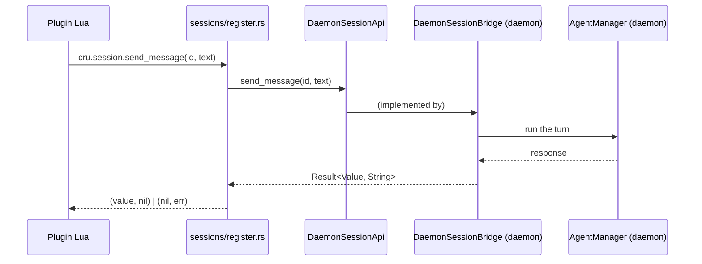

# Luau APIs

This page names each `cru.*` namespace module in `crucible-lua`, the pure
data/logic files those modules build on, and the `sessions/` and `vault/`
sub-trees. It does not cover the VM lifecycle, the module resolver, the
plugin lifecycle or the config store; those belong to [[Luau Host]]. Read
[[Meta/CONTEXT]] first for "plugin", "spec", "source" and "activation".

## Purpose and ownership

`crucible-lua` is the Luau host crate. Per the repository agent guide, it
owns "Luau host, bindings, plugin behavior and defaults." This page's slice
of that crate owns the surface Lua code calls for every `cru.*` namespace: what a
plugin author can call, what each call declares as its Luau type, and how a
call reaches a real backend.

It must not own business logic or authoritative storage. Every namespace
that touches daemon state (`cru.session`, `cru.tools`, `cru.storage`,
`cru.kiln`, `cru.ui`, `cru.diff`, `cru.proposals`) is registered twice: once
as a stub that always answers absence, and once against a small trait
(`DaemonSessionApi`, `DaemonToolsApi`) or a resolver closure the daemon
implements. `crucible-lua` never constructs a `WorkspaceTools`, a session
actor or a `NoteStore`; it holds an `Arc<dyn Trait>` or an `Arc<dyn Fn>` the
daemon installed. This matches the ownership table: "clients send intent;
they must not construct a second agent configuration or write pipeline" —
here the "client" is the plugin VM and the daemon is the authority on the
other side of the trait.

A second, narrower ownership rule holds inside this slice: registries that
front daemon-owned broadcast state (`StatuslineExprRegistry`,
`SurfaceRegistry`, `ContextAttachRegistry`) hold their own data (`Mutex`-
guarded maps) but never learn what a `SessionEventMessage` or a broadcast bus
is. Each exposes an `Arc<dyn Fn>` "change notifier" slot the daemon installs
after registration — a crate-dependency firewall repeated three times in
this page's files.

## Module map

### `crates/crucible-lua/src/` — namespace and support files

| Path | Lines | Role |
| --- | --- | --- |
| `crates/crucible-lua/src/auth_plugin.rs` | 220 | `cru.on_provider_auth` hook registration and firing (`fire_provider_auth_hooks`) for provider HTTP headers. |
| `crates/crucible-lua/src/authorship.rs` | 343 | `AuthorRoots`/`config_layer` — pure classification of a config write's `ConfigSource` layer from its chunk name. |
| `crates/crucible-lua/src/command_effect.rs` | 130 | `CommandEffect` (`Read`/`Write`) — a plugin's self-declared, unverified label for a command's data-loss risk. |
| `crates/crucible-lua/src/context.rs` | 675 | `cru.context.*` bulk ops (`usage`, `compact`, `messages`, `remove`) over `DaemonSessionApi`, stub-then-upgrade. |
| `crates/crucible-lua/src/context_attach.rs` | 386 | `ContextAttachRegistry` — the per-session, budget-capped, dedup buffer behind `cru.context.attach`, tagging each block with the attaching plugin. |
| `crates/crucible-lua/src/embed.rs` | 150 | `cru.embed` — re-embeds text with the kiln's own embedding provider, through a resolver the host injects. |
| `crates/crucible-lua/src/fs.rs` | 755 | `cru.fs.*` — scoped, attributed filesystem access for plugin code, distinct from raw `io.open`. |
| `crates/crucible-lua/src/hl.rs` | 412 | Pure highlight-group model (`HlColor`, `HlGroup`) and `resolve`, which returns `crucible_oil::style::Style` directly, shared by the Lua binding and the TUI renderer. |
| `crates/crucible-lua/src/hl_lua.rs` | 332 | `cru.hl.set`/`cru.hl.link` plus the JSON wire codec for `HlRegistry`. |
| `crates/crucible-lua/src/http.rs` | 272 | `cru.http.*` — `get`/`post`/`put`/`delete`/`patch`/`request` over `crucible_core::http::HttpExecutor`. |
| `crates/crucible-lua/src/json_query.rs` | 958 | `oq` module — multi-format parse/encode/query (JSON/YAML/TOML/TOON) and the JSON↔Lua bridge used crate-wide. |
| `crates/crucible-lua/src/mcp.rs` | 97 | `cru.mcp` stub — always-empty answers for the stub-generator VM; plugins reach MCP through daemon gateway tools instead. |
| `crates/crucible-lua/src/modes.rs` | 769 | `cru.modes` — agent modes a Lua table declares (`ModeDefinition`, `ModeStance`, `ToolSelector`, `WriteMode`); the daemon reads these for tool visibility, permission stance and whether a note write applies or becomes a proposal. |
| `crates/crucible-lua/src/notify.rs` | 595 | `cru.log.notify`/`notify_once`/`levels` and the `NotificationSink` trait the daemon implements. |
| `crates/crucible-lua/src/oil.rs` | 1370 | `cru.oil.*` — builds `crucible_oil::Node` trees (`text`, `col`, `row`, `popup`, `component`, …) from Lua. |
| `crates/crucible-lua/src/paths.rs` | 288 | `cru.paths.*` — read-only session/workspace/plugin-state/config directory lookups. |
| `crates/crucible-lua/src/publications.rs` | 390 | `cru.plugin.publish` — a plugin-scoped JSON channel any client can read back. |
| `crates/crucible-lua/src/ratelimit.rs` | 280 | `cru.ratelimit.new` — a token-bucket rate limiter exposed as Lua userdata. |
| `crates/crucible-lua/src/schedule.rs` | 564 | `cru.schedule`/`cru.schedule.cancel` — a Lua callback that runs on an interval, on a task the crate spawns (feature `send`). |
| `crates/crucible-lua/src/shell.rs` | 1157 | `cru.shell.exec`/`spawn`/`which` — plugin command execution under `PluginShellPolicy` (fail-open sandbox), stripping inherited git-repository environment variables first. |
| `crates/crucible-lua/src/source_files.rs` | 196 | Single source of truth for `.lua`/`.luau` extension preference and collision refusal, used by `require` and discovery. |
| `crates/crucible-lua/src/statusline_exprs.rs` | 657 | `StatuslineExprRegistry` — session-scoped, plugin-attributed values behind `cru.statusline.set`/`clear`. |
| `crates/crucible-lua/src/statusline_items.rs` | 617 | Pure `Layout`/`StatusItem`/`Region` data model and its wire codec. |
| `crates/crucible-lua/src/statusline_lua.rs` | 533 | `cru.statusline` Lua constructors (`sl.mode`, `sl.model{}`, `sl.proposals`, `sl.items`, `sl.plugin_turns`, `sl.setup`) that build a `Layout`. `crates/crucible-lua/src/plugin_status.rs` (see [[Luau Host]]) opens the same `statusline` module table through `crate::lua_util::get_or_create_module` to add `cru.statusline.item`/`publish`; the two files share one Lua table, not one owner. |
| `crates/crucible-lua/src/storage_api.rs` | 444 | `cru.storage.*` — the per-plugin EAV property-store API over `crucible_core::storage::PropertyStore`. |
| `crates/crucible-lua/src/surfaces.rs` | 968 | `cru.surface.declare`/`set_rows` — the cross-client panel registry (`SurfaceRegistry`). `Surface`, `Shape`, `Mark` and `SurfaceRow` are `crucible_core::types` types, re-exported here. |
| `crates/crucible-lua/src/theme.rs` | 1325 | Canonical `ThemeConfig` domain type and its Lua-table parser/loader; the built-in dark theme. |
| `crates/crucible-lua/src/theme_wire.rs` | 479 | JSON wire codec for `ThemeConfig`, for the `ui.config` RPC handshake; keeps colors unresolved on the wire. |
| `crates/crucible-lua/src/timer.rs` | 582 | `cru.timer.clock`/`sleep`/`timeout`/`spawn` with per-plugin task-abort bookkeeping. |
| `crates/crucible-lua/src/tools_api.rs` | 1151 | `cru.tools.*` — direct workspace-tool invocation (`call`/`list`/`batch`/`set_active`) over `DaemonToolsApi`. |
| `crates/crucible-lua/src/ui.rs` | 297 | `cru.ui.*` — client-addressed interaction requests (ask/edit/show/permission/popup/panel), each pending until a client answers or cancels it. |
| `crates/crucible-lua/src/ui_geometry.rs` | 558 | `cru.geometry` — closed per-surface border/padding/prompt geometry, with a wire codec. |
| `crates/crucible-lua/src/vec_api.rs` | 203 | `cru.vec` — vector geometry (`dot`, `normalize`, `cosine`, `arc_best`, `curve_best`) for retrieval-strategy Lua. |
| `crates/crucible-lua/src/ws.rs` | 318 | `cru.ws` — a WebSocket client (`connect`/`send`/`receive`/`close`) as Lua userdata. |

### `crates/crucible-lua/src/sessions/` — the `cru.session.*` trait boundary

| Path | Lines | Role |
| --- | --- | --- |
| `crates/crucible-lua/src/sessions/mod.rs` | 529 | Declares `DaemonSessionApi` (the trait `crucible-daemon` implements), `DiffOp`, `ProposalDecision` and `ResponsePart`; no runtime logic. This module owns the whole Lua session API. |
| `crates/crucible-lua/src/sessions/handle.rs` | 494 | The `Session` Lua userdata, the `SessionConfigRpc` trait, `UnsupportedSessionRpc`, `SessionVariables`, and every lifecycle-verb method (`session_method!`). |
| `crates/crucible-lua/src/sessions/current.rs` | 96 | `CurrentSession`, the session that one VM executes for, and `register_session_module`, which registers `cru.session.current`, the deprecated `cru.get_session` and the `cru.sessions` alias. |
| `crates/crucible-lua/src/sessions/diff.rs` | 102 | Registers `cru.diff.*` (`get`, `file`, `comment`, `resolve_comment`, `comments`), one function per `DiffOp` variant, over `DaemonSessionApi::diff`. |
| `crates/crucible-lua/src/sessions/proposals.rs` | 156 | Registers `cru.proposals.*` (`rejected`, `list`, `accept`, `reject`) over `DaemonSessionApi`'s proposal methods. |
| `crates/crucible-lua/src/sessions/register.rs` | 1225 | The stub and daemon-backed registration of every `cru.session.*` verb (and, as a side effect, `cru.diff`/`cru.proposals`), and the shared `*_op` bodies both free functions and `Session` methods call. |
| `crates/crucible-lua/src/sessions/tests/mod.rs` | 654 | Shared `MockDaemonApi` fixture and the `sessions` test-tree module list. |
| `crates/crucible-lua/src/sessions/tests/completion.rs` | 80 | Tests `cru.session.complete`, the one-shot completion primitive. |
| `crates/crucible-lua/src/sessions/tests/config.rs` | 277 | Tests the `Session` properties and variables over a bound `SessionConfigRpc`, the single bind, `cru.session.current` and `cru.get_session`, and `UnsupportedSessionRpc`. |
| `crates/crucible-lua/src/sessions/tests/crud.rs` | 460 | Tests `create`/`get`/`list`: whole-table forwarding, kiln handling, `configure_agent` implication, legacy positional form. |
| `crates/crucible-lua/src/sessions/tests/delegate.rs` | 193 | Tests the `delegate = true` create path: parentage stamping and refusal semantics, and that `create` stamps the running plugin's name onto the session. |
| `crates/crucible-lua/src/sessions/tests/diff.rs` | 64 | Tests every `cru.diff` function forwards its whole params object to the `DiffOp` of its name and translates a JSON `null` to Lua `nil`; tests the stub path answers "no daemon connected" for every op. |
| `crates/crucible-lua/src/sessions/tests/graph.rs` | 217 | Tests `inject`, `fork`, `collect_subagents`, `cache_stats`, and the undo family. |
| `crates/crucible-lua/src/sessions/tests/handles.rs` | 348 | Tests the `Session` userdata handle's methods against the free-function equivalents, including that a `get` handle reads `workspace`, `isolation` and `plugin` from its record, and that an unknown property is an error and not a panic. |
| `crates/crucible-lua/src/sessions/tests/messages.rs` | 89 | Tests `cru.session.messages` (role filter, limit, tools flag). |
| `crates/crucible-lua/src/sessions/tests/messaging.rs` | 64 | Smoke tests for `send_message`/`cancel`/`end_session` free functions. |
| `crates/crucible-lua/src/sessions/tests/namespace.rs` | 189 | Tests the stub/daemon key-set parity gate, the deprecated `cru.sessions` alias, and `cru.session.clear`'s prompt/plugin plumbing. |
| `crates/crucible-lua/src/sessions/tests/proposals.rs` | 146 | Tests `cru.proposals.rejected`/`list`/`accept`/`reject` against `MockDaemonApi`, and the stub path's "no daemon connected" answer for all four. |
| `crates/crucible-lua/src/sessions/tests/subscription.rs` | 788 | Tests `subscribe`/`next_event`, including async-timing regressions against a second, timing-controlled mock. |
| `crates/crucible-lua/src/sessions/tests/ui.rs` | 168 | Tests `cru.ui.*` interaction-kind functions, colocated here to reuse `MockDaemonApi`. |

### `crates/crucible-lua/src/vault/` — the `cru.kiln.*` bindings

| Path | Lines | Role |
| --- | --- | --- |
| `crates/crucible-lua/src/vault/mod.rs` | 850 | `cru.kiln.*` — note/graph reads, named-kiln reads, and `cru.kiln.path`; stub-then-resolver-backed; also mounts the Bases operations `vault/bases.rs` defines onto the same table. |
| `crates/crucible-lua/src/vault/bases.rs` | 137 | `cru.kiln.list_bases`/`base_views`/`query`/`set_property`/`create_entry`/`reorder_groups`/`ensure_base`/`pending_writes` — Bases operations bound onto the existing `cru.kiln` table; fail-closed ("Bases requires a daemon runtime") until the daemon binds a real `BasesResolver` at boot. |
| `crates/crucible-lua/src/vault/tests.rs` | 1167 | Unit tests for `vault/mod.rs`, split into `stub_tests`, `store_tests`, `graph_tests`, `blocks_tests`. |

## Key types and traits

**`DaemonSessionApi`** (`crates/crucible-lua/src/sessions/mod.rs`) is the
trait every `cru.session.*`, `cru.context.*`/`cru.ui.*`, `cru.diff.*` and
`cru.proposals.*` daemon-backed function calls through. Every method is
async and trades in `serde_json::Value`, "so a plugin reaches every field an
RPC caller does without this crate re-declaring any of them." `crucible-daemon`'s
`DaemonSessionBridge` (`crates/crucible-daemon/src/session_bridge.rs`) is
the sole production implementer. `crucible-lua` cannot depend on
`crucible-daemon`, so the trait inverts the dependency: the low crate
declares the shape, the high crate supplies the body.

**`DiffOp`** and **`ProposalDecision`** (both `crates/crucible-lua/src/sessions/mod.rs`)
are the two closed enums the review surface dispatches on. `DiffOp`
(`Get`/`File`/`Comment`/`ResolveComment`/`Comments`, a `strum::EnumIter`)
names one `cru.diff.*` function each, in `crates/crucible-lua/src/sessions/diff.rs`,
over `DaemonSessionApi::diff`. `ProposalDecision` (`Accept`/`Reject`) is the
argument `cru.proposals.accept`/`reject`
(`crates/crucible-lua/src/sessions/proposals.rs`) pass to
`DaemonSessionApi::decide_proposal`.

**`DaemonToolsApi`** (`crates/crucible-lua/src/tools_api.rs`) is the
equivalent trait for `cru.tools.*` (`call_tool`, `list_tools`,
`set_active_tools`, `get_active_tools`). `crucible-daemon`'s
`DaemonToolsBridge` (`crates/crucible-daemon/src/tools_bridge.rs`)
implements it over the real `WorkspaceTools`.

**`Session`** (`crates/crucible-lua/src/sessions/handle.rs`) is the `cru.session`
Lua userdata: `id`, an optional `Arc<dyn DaemonSessionApi>`, a `HostHook`-
bound `SessionConfigRpc`, the session's `workspace` and `isolation` (set at
`create` time and also filled in from the daemon record on any handle
`wrap_session_record` builds — `get`, `list`, `fork`, …), `end_reason` (why
a stopped session's handle was built — `paused`, `ended`, `archived`,
`auto_archived`, `deleted`, `refused` or `child_done`, `nil` everywhere
else, for a hook that runs at session end), `plugin` (the plugin that
created the session, from the record, `nil` for a session no plugin
created), and the JSON `record` a handle was built from. `crucible-daemon`
constructs it via `create`/`get`/`list`/`fork`; a hook constructs one bound
to a `SessionConfigRpc` implementor outside this page for the pre-agent
"buffer-local" tier. The `session_method!` macro generates every lifecycle
verb (`send_message`, `fork`, `undo`, `clear`, `review_list_hunks`, …) by
calling the matching `*_op` function in `sessions/register.rs`, so a handle
method and its free-function equivalent share one body.

**`SessionConfigRpc`** (`crates/crucible-lua/src/sessions/handle.rs`) is the
trait a `Session`'s `model`/`mode`/`system_prompt` property reads and writes
through. Every method is required — no default — because a defaulted
setter once answered success while writing nothing.

**`ContextAttachRegistry`** (`crates/crucible-lua/src/context_attach.rs`)
holds `Arc<Mutex<HashMap<session_id, SessionAttachments>>>`. Each session's
pending queue holds `Vec<ContextMessage>` (`crucible_core::traits::ContextMessage`),
not raw strings: `attach(&self, session_id: &str, source: &str, content: &str,
key: Option<&str>)` wraps the content as `ContextMessage::injection("attachment",
source, content)`, where `source` is the attaching plugin's name or the
literal `"lua"` when Lua code with no plugin source attaches — so the turn
the agent sees can show which plugin injected which block. `crucible-daemon`'s
`AgentManager` (see [[Agent Manager]]) owns and drains one instance
(`context_attach` field, `crates/crucible-daemon/src/agent_manager/mod.rs`),
calling `drain` before building the next LLM turn and `release` at session
end.

**`StatuslineExprRegistry`** (`crates/crucible-lua/src/statusline_exprs.rs`)
and **`SurfaceRegistry`** (`crates/crucible-lua/src/surfaces.rs`) are the two
other session/plugin-keyed registries this page defines. Both hold a
`Mutex`-guarded map, both expose a `HostHook`-installed change notifier
(`ChangeNotifier`, `SurfaceEmitter`) the daemon installs once, and both
release the lock before calling that notifier. `StatusRegistry`
(`crates/crucible-lua/src/plugin_status.rs`, see [[Luau Host]]) reuses this
page's `ChangeNotifier` type alias for its own `set_change_notifier` rather
than declaring a fourth notifier type, so a session-change callback the
daemon installs on one registry has the same shape as one it installs on
this page's two.

**`ModeRegistry`/`ModeDefinition`/`ModeStance`/`ToolSelector`**
(`crates/crucible-lua/src/modes.rs`) back `cru.modes`. The daemon owns one
`ModeRegistry` instance and reads it for tool-visibility and default
permission stance; the module doc states plainly that modes are "Not a
security boundary" — deny rules and containment stay unconditional
elsewhere. A mode also declares `writes` (`ModeDefinition.writes: WriteMode`,
`"apply"` or `"propose"`, default `"apply"`, a hard Lua error for any other
string): the daemon's turn-start reads it into the session slot, so a note
write during a `"propose"`-mode turn is recorded as a proposal rather than
written to disk.

**`BaseOperation`** (`crates/crucible-core/src/bases/operation.rs`) and
**`BasesResolver`** (`crates/crucible-lua/src/vault/bases.rs`) back the eight
`cru.kiln.*` Bases functions. `BaseOperation` is a `strum::EnumIter` with the
variants `List`, `Views`, `Query`, `SetProperty`, `CreateEntry`,
`ReorderGroups`, `EnsureBase` and `PendingWrites`. It is the one closed set
that the daemon's Bases RPC methods and `cru.kiln.*` use. The core crate owns
it. The Lua binding and `crates/crucible-daemon/src/bases/operation.rs` import
it from `crucible_core::bases`. The conversion to Lua is
`BaseOperation::name`: `vault/bases.rs` binds one `cru.kiln` function for each
variant under that name. `BasesResolver` is the resolver-closure type alias
that the daemon binds once, at boot, over `crucible_lua::bases_api::register`.
`crates/crucible-lua/src/lib.rs` re-exports `crates/crucible-lua/src/vault/bases.rs`
as `bases_api`.

**`ThemeConfig`** and its wire pair (`crates/crucible-lua/src/theme.rs`,
`crates/crucible-lua/src/theme_wire.rs`) and **`UiGeometry`**
(`crates/crucible-lua/src/ui_geometry.rs`) are the domain types the `ui.config`
RPC (outside this page, in `crucible-daemon`) carries to `crucible-cli`'s
TUI. Colors cross the wire unresolved so each client resolves against its
own terminal.

**`PluginShellPolicy`** (`crates/crucible-lua/src/shell.rs`) is the
plugin-sandbox command policy — fail-open by default, and explicitly not the
same type as the agent bash-tool's fail-closed `ShellPolicy` in
`crucible-core::config`.

## Flows

### A plugin sends a message through `cru.session.send_message`

1. Lua calls `cru.session.send_message(id, text)`, or `session:send_message(text)`
   on a `Session` handle.
2. Both paths resolve to `send_message_op` in
   `crates/crucible-lua/src/sessions/register.rs`, which reads the calling
   plugin's name from `crate::plugin_context::current_plugin_name(lua)` and
   calls `api.send_message(id, text, plugin)` on the bound `Arc<dyn
   DaemonSessionApi>` — a plugin-originated send is tagged as a plugin turn,
   never a user turn.
3. `crucible-daemon`'s `DaemonSessionBridge::send_message`
   (`crates/crucible-daemon/src/session_bridge.rs`) runs the real turn
   through `AgentManager`.
4. The result crosses back as `(Value, Value)` — `(response, nil)` on
   success, `(nil, err)` on failure — never a raised Lua error.

### A plugin reads a kiln through `cru.kiln.list`

1. At plugin-VM boot, `crates/crucible-daemon/src/daemon_plugins/mod.rs` calls
   `register_vault_module` (`crates/crucible-lua/src/vault/mod.rs`), which
   installs empty-answering stubs for every other `cru.kiln.*` name, and a
   fail-closed stub (raises `mlua::Error::runtime("Bases requires a daemon
   runtime")`, rather than answering empty) for the eight Bases operations,
   via `bases::register(lua, None)`.
2. When a kiln opens, the daemon calls
   `register_vault_module_with_store_scoped(lua, store, authority)`, which
   snapshots the `host_bound()` names (the six named-kiln read functions —
   `blocks`, `note`, `notes`, `links`, `search`, `path` — plus the eight
   Bases operation names `BaseOperation::names()` supplies), re-publishes the
   stubs, then overwrites `list`/`get`/`outlinks`/`backlinks`/`neighbors`/
   `neighbors_with_hops` against the real `Arc<dyn NoteStore>` scoped by
   `authority`. The Bases names are only carried over here, not rebound: the
   real `BasesResolver` is bound once, at daemon boot (see "Key types and
   traits").
3. A plugin's `cru.kiln.list()` call now reaches `crucible_core::storage`
   directly, scoped to that kiln's authority — the same `Scope` the SQLite
   link index enforces elsewhere.
4. `cru.kiln.blocks`/`note`/`notes`/`links`/`search` (named-kiln reads) go
   through a separate `KilnRepositoryResolver` the daemon binds via
   `register_kiln_repository_resolver`, one resolver call per named kiln
   rather than the caller's own scope.
5. The eight `cru.kiln.list_bases`/`base_views`/`query`/`set_property`/
   `create_entry`/`reorder_groups`/`ensure_base`/`pending_writes` functions
   are a separate sub-surface on the same table: bound once at daemon boot by
   `crucible_lua::bases_api::register`, over a `BasesResolver` the daemon's
   `crates/crucible-daemon/src/bases/plugin_api.rs` supplies, not by the
   per-kiln flow above.

### A plugin reviews a delegated session through `cru.diff` and `cru.proposals`

1. `cru.diff.*` (`get`, `file`, `comment`, `resolve_comment`, `comments`) and
   `cru.proposals.*` (`rejected`, `list`, `accept`, `reject`) replace the
   removed `cru.session.review_set_state`/`review_comment`/`review_resolve_comment`
   verbs; `cru.session.review_list_hunks` is unchanged.
2. Both namespaces are registered from the same two call sites as
   `cru.session` itself, in `crates/crucible-lua/src/sessions/register.rs`'s
   `register_sessions_module` (stub path, calling `register_diff_stub`/
   `register_proposals_stub`) and `register_sessions_inner` (real path,
   calling `register_diff_with_api`/`register_proposals_with_api`).
3. `cru.diff.<op>` dispatches on `DiffOp` and forwards its whole params
   object to `DaemonSessionApi::diff`; `cru.proposals.accept`/`reject`
   dispatch on `ProposalDecision` through `DaemonSessionApi::decide_proposal`,
   and `cru.proposals.rejected`/`list` call `rejected_proposals`/
   `list_proposals` directly.
4. The `review` plugin reads the session record of a delegated child, or the
   branch of a child worktree, through `cru.diff`, and lists/accepts/rejects
   that child's proposals through `cru.proposals` — the daemon runs the same
   handler as for a client RPC, so a plugin sees the same admission and the
   same refusals.

### A plugin declares a cross-client panel through `cru.surface.declare`

1. Lua calls `cru.surface.declare(name, {title=..., shape="list"})`, handled
   by `register_surface_module` (`crates/crucible-lua/src/surfaces.rs`).
2. `SurfaceRegistry::declare` inserts or refreshes the entry keyed by
   `(plugin, name)`, releases its `Mutex` guard, then calls the installed
   `SurfaceEmitter`.
3. The daemon's emitter (installed once via `HostHook`, outside this page)
   stamps a sequence number onto the change and pushes it onto its
   broadcast bus.
4. `crucible-cli`'s TUI and `crucible-web`'s frontend both render the same
   `Surface`/`SurfaceRow` shape from that bus — the one core type with
   `ToSchema`, named directly by the daemon, the web route and this
   registry — since the contract is semantic (rows and marks), not a
   rendered node tree.

## State, concurrency and lifecycle

Every stateful registry in this page follows the same shape: an
`Arc<Mutex<HashMap<...>>>` (or `Arc<RwLock<...>>` for the rarer read-heavy
case), keyed by session id, plugin name, or both. `ContextAttachRegistry`,
`StatuslineExprRegistry`, `SurfaceRegistry` and `PublicationRegistry`
(outside this page) all release their lock before calling an installed
change notifier, because that notifier reaches daemon-owned broadcast state
and must never run under the registry's own lock.

`ModeRegistry` (`crates/crucible-lua/src/modes.rs`) and
`ContextAttachRegistry` are the two registries this page's tests construct
directly and clone freely — cloning shares the underlying `Arc`, so every
handle sees the same live state.

Release/cleanup has two shapes across this page: per-session (`release` on
`ContextAttachRegistry`, `release_session` on `StatuslineExprRegistry`,
called at session end) and per-plugin (`release_plugin` on
`SurfaceRegistry`/`PublicationRegistry`, `release_source` on
`StatuslineExprRegistry`, called when a plugin goes inert). Neither registry
here spawns its own background task; `crates/crucible-lua/src/schedule.rs`
and `crates/crucible-lua/src/timer.rs` are the two files in this page that do
spawn tokio tasks (feature `send` only), each tracking `(LuaSource,
oneshot::Sender<()>)`/`(LuaSource, JoinHandle)` pairs so a plugin's cleanup
path (outside this page, in the handler registry) can cancel or abort every
task that source created.

`cru.ratelimit` (`crates/crucible-lua/src/ratelimit.rs`) and `cru.ws`
(`crates/crucible-lua/src/ws.rs`) hold per-userdata-instance state
(`Arc<tokio::sync::Mutex<...>>`), not a crate-wide registry — a rate limiter
or a WebSocket connection belongs to whichever Lua value holds it, and its
lifetime ends when that value is garbage-collected or explicitly closed.

`sessions/register.rs`'s `subscribe_op`/`send_and_collect_op` wrap a
`tokio::sync::mpsc::UnboundedReceiver` in `Arc<Mutex<_>>` so a Lua "next
event" closure can be called repeatedly; iteration is pull-driven from Lua,
never a spawned push loop.

## Boundaries and invariants

Two dual-registration disciplines recur across this page and are each
enforced by a runtime completeness check, not by convention alone:

- `crates/crucible-lua/src/sessions/register.rs`'s `SESSION_FNS` and
  `crates/crucible-lua/src/tools_api.rs`'s `TOOL_FNS` are each the single
  name/type list both the stub table and the daemon-backed table build from,
  and both call `gate_module_keys` to refuse construction if the two tables'
  key sets disagree.
- `crates/crucible-lua/src/ui.rs`'s `declared_kinds` performs the same check
  against `crucible_core::interaction::InteractionRequest::KINDS`.

Attribution never crosses from Lua: `crates/crucible-lua/src/storage_api.rs`
and `crates/crucible-lua/src/publications.rs` both read the calling plugin's
name from Rust-side VM app data (outside this page, in `plugin_context.rs`),
never from a Lua global a plugin could forge. `storage_api.rs`'s own test
proves writing the historical `cru._current_plugin` global is now inert.
`crates/crucible-lua/src/sessions/register.rs` repeats the same discipline
for the session surface: `create_op` strips any caller-supplied `plugin`
key and re-stamps it from `crate::plugin_context::current_plugin_name(lua)`
(the same treatment it already gave `parent_session_id`), and
`send_message_op`/`send_and_collect_op`/`inject_op`/`clear_op` all read that
same function to fill their `plugin`/`relay` argument — a plugin can name
its own send or injection, but never another plugin's.
`crates/crucible-lua/src/context_attach.rs`'s `attach` follows the identical
pattern for `cru.context.attach`.

Containment is enforced at the boundary, not trusted from the caller:
`crates/crucible-lua/src/fs.rs` resolves the nearest existing ancestor before
comparing a write target against a plugin's roots, specifically to catch a
symlink escape; `crates/crucible-lua/src/vault/mod.rs`'s `join_relative`
refuses `..`/absolute components in a named-kiln relative path;
`crates/crucible-lua/src/shell.rs`'s `prepare_command` removes every git-
repository environment variable (`crucible_core::git::REPOSITORY_ENV_VARS`,
e.g. `GIT_DIR`, `GIT_INDEX_FILE`) before running a plugin command, so a
daemon started inside a git hook or `git rebase --exec` does not leak its
parent repository into a plugin-run git command;
`crates/crucible-lua/src/vault/bases.rs`'s `acting_session` is a session-
identity containment check of the same family: a plugin running inside a
session may repeat that session in a Bases call but never name a different
one, closing off a way a Bases call could otherwise borrow another
session's write permissions and ledger.

Closed vocabularies stay closed by a compiler-enforced rule:
`crates/crucible-lua/src/command_effect.rs`'s `CommandEffect` and
`crates/crucible-lua/src/surfaces.rs`'s `Shape`/`Mark` all forbid a wildcard
match arm, so a new variant is a compile error everywhere it is not named.
`cru.geometry` (`crates/crucible-lua/src/ui_geometry.rs`) is deliberately a
closed surface set, in contrast to the open, linkable highlight-group
namespace `cru.hl` (`crates/crucible-lua/src/hl.rs`).

Every `cru.*` top-level key is itself a closed set: `CruNamespace`
(`crates/crucible-lua/src/namespace.rs`, outside this page) enumerates every
name this page's modules and their siblings may register, and
`crates/crucible-daemon/tests/cru_namespace_gate.rs` compares it against the
live plugin VM's actual keys in both directions.

The error convention every Lua caller sees is `(value, nil)` on success, `(nil, err)`
on failure — never a raised error — for every daemon-backed function in
`context.rs`, `sessions/register.rs`, `sessions/diff.rs`,
`sessions/proposals.rs`, `tools_api.rs` and `ui.rs`. Three named
exceptions raise instead, each with a stated reason: `cru.ws.connect`
(no Luau name exists for the connection type to pair with an error),
`cru.fs.remove` (a permanent data-loss guard), and `cru.embed`'s unbound
stub (an empty vector would look like a real zero-length answer). The eight
`cru.kiln.*` Bases functions raise too, when unbound: `vault/bases.rs`'s
stub answers `mlua::Error::runtime("Bases requires a daemon runtime")`
rather than an empty value, because a Bases call implies a write path a
silent empty answer would hide.

`cru.ui.*` requests no longer carry or respect a `timeout` option: the
`DEFAULT_TIMEOUT_SECS` constant and `timeout_from` helper are gone from
`crates/crucible-lua/src/ui.rs`, and `DaemonSessionApi::request_interaction`
(`crates/crucible-lua/src/sessions/mod.rs`) lost its `timeout_secs`
parameter. A request now waits until a client answers it or it is
explicitly cancelled — there is no more auto-expiry path, so `{ kind =
"cancelled" }` means only "the user dismissed it" or "the request was
cancelled," never "the timeout elapsed."

## Extension seams

- **A new `cru.session.*` verb** adds one entry to `SESSION_FNS`
  (`crates/crucible-lua/src/sessions/register.rs`), one method on
  `DaemonSessionApi` (`crates/crucible-lua/src/sessions/mod.rs`), one `*_op`
  function, and — if it should read on a `Session` handle too — one line in
  the `session_method!` macro invocation in
  `crates/crucible-lua/src/sessions/handle.rs`.
- **A new `cru.tools.*` verb** adds one entry to `TOOL_FNS`
  (`crates/crucible-lua/src/tools_api.rs`) and one method on
  `DaemonToolsApi`.
- **A new interaction kind** adds one entry to
  `crucible_core::interaction::InteractionRequest::KINDS` (outside this
  page) and one declaration in `crates/crucible-lua/src/ui.rs`'s
  `declaration`/`declared_kinds`.
- **A new agent mode field** extends `ModeDefinition`/`ModePermissions` in
  `crates/crucible-lua/src/modes.rs`; the daemon's permission/tool-visibility
  path reads the registry, not a Rust constant.
- **A new statusline item kind** extends `StatusItem` in
  `crates/crucible-lua/src/statusline_items.rs` and its Lua constructor in
  `crates/crucible-lua/src/statusline_lua.rs`; `Proposals`, `List` and
  `PluginTurns` (the pending-proposal count, a plugin's published status
  list, and the engine's own plugin-turn items) are the current examples —
  a row field, not a new `Shape`, is the extension point for a new surface
  kind in `crates/crucible-lua/src/surfaces.rs` — deliberately the opposite
  of the statusline's closed vocabulary, per that file's own module doc.
- **A new theme/geometry field** extends the matching struct in
  `crates/crucible-lua/src/theme.rs` or `crates/crucible-lua/src/ui_geometry.rs`
  and its paired wire function in `theme_wire.rs`, so a forgotten field
  degrades to a default rather than silently vanishing across the wire.
- **A new Bases operation** adds one variant to `BaseOperation`
  (`crates/crucible-core/src/bases/operation.rs`), which supplies both its
  `cru.kiln.*` name (`BaseOperation::name`) and whether it needs a session
  (`BaseOperation::writes`); the daemon's Bases RPC dispatch reads the same
  enum, so a variant that forgets one of these two `match` arms is a
  compile error, not a silent gap.
- **A new `cru.diff.*` verb** adds one variant to `DiffOp`
  (`crates/crucible-lua/src/sessions/mod.rs`), one declared type in
  `crates/crucible-lua/src/sessions/diff.rs`'s `decl`, and one method on
  `DaemonSessionApi`; **a new `cru.proposals.*` verb** adds one entry to
  `crates/crucible-lua/src/sessions/proposals.rs`'s `PROPOSAL_FNS` and,
  where it decides rather than reads, one `ProposalDecision` variant.

## Tests

Each namespace file in this page carries its own `#[cfg(test)]` module
(unmentioned individually here where the module map row already names the
file); the notable exceptions are `sessions/` and `vault/`, which split their
tests into dedicated files this page's module map lists by path.

`crates/crucible-lua/src/sessions/tests/` proves the trait boundary end to
end against `MockDaemonApi` (`crates/crucible-lua/src/sessions/tests/mod.rs`):
CRUD and whole-table forwarding (`crud.rs`), delegation/parentage stamping
and that `create` stamps the running plugin's name (`delegate.rs`), the
conversation-tree verbs (`graph.rs`), handle-vs-free-function parity, and
that a `get` handle reads `workspace`/`isolation`/`plugin`
from its record (`handles.rs`), message filtering (`messages.rs`), the
stub/daemon key-set parity gate, the deprecated alias and the new
`cru.session.clear` verb's prompt/plugin plumbing (`namespace.rs`),
`subscribe`/`next_event` async-channel correctness against a second,
timing-controlled mock (`subscription.rs`) — the largest file in the tree,
built specifically to catch a class of bug the synchronous mock cannot
surface — and the two new review-surface namespaces: every `cru.diff`
function forwards its params object unmodified and translates a JSON
`null` to Lua `nil` (`diff.rs`), and `cru.proposals.rejected`/`list`/
`accept`/`reject` pass their arguments through to the matching
`DaemonSessionApi` method, on both the stub and daemon-backed path
(`proposals.rs`).

`crates/crucible-lua/src/vault/tests.rs` proves: path-traversal refusal and
the no-resolver error path (`stub_tests`); `list`/`get` against a hand-
rolled `MockNoteStore` (`store_tests`); `outlinks`/`backlinks`/`neighbors`
hop-and-path ordering and scope-based authority filtering, explicitly framed
as a regression test for a past release where these functions shipped
returning an empty table (`graph_tests`); and named-kiln reads plus the
host-bound-members-survive-a-storage-upgrade regression (`blocks_tests`).

`crates/crucible-lua/src/vault/bases.rs` tests the pure `acting_session`
function. It also proves the conversion across the Lua boundary: each
`cru.kiln` Bases function sends its own `BaseOperation`, the kiln name and
the options to the resolver. The daemon tests the real resolver
(`crates/crucible-daemon/src/agent_manager/tests/bases_attribution.rs`,
`crates/crucible-daemon/src/bases/plugin_tests.rs`).

## Findings

- **One tool-definition shape.** `LuaTool` and `ToolParam` were a second
  copy of `DiscoveredTool` and `DiscoveredParam`
  (`crates/crucible-lua/src/discovered.rs`). No code read them, and no Lua
  value used them. They are gone. A plugin tool has one shape,
  `DiscoveredTool`, and `discovered_params_to_json_schema` gives its schema.
- **A colocation, not a conflict.** `crates/crucible-lua/src/sessions/tests/ui.rs`
  tests `crate::ui` rather than `crate::sessions`, placed there to reuse
  `MockDaemonApi` rather than duplicate a large mock. The file's own header
  comment states this reason and names the trait as "31-method" — now more
  stale than a previous revision of this page recorded (33), since
  `DaemonSessionApi` has grown to 35 methods. This remains a deliberate
  colocation trade, not a misfiled test; the file's own three timeout-option
  tests were deleted with the `cru.ui.*` timeout mechanism, leaving no
  replacement test, because there is nothing left to time out.
- **A narrow, low-marginal-value test file.** `crates/crucible-lua/src/sessions/tests/messaging.rs`
  covers `send_message`/`cancel`/`end_session` via the free-function path
  only; `handles.rs` and `crud.rs` already exercise most of the same verbs
  via the handle path. Not wrong, but thin relative to its neighbors.
- **A new namespace with its Lua-binding coverage elsewhere.**
  `crates/crucible-lua/src/vault/bases.rs`'s own `#[cfg(test)]` module
  covers only the pure `acting_session` function; nothing in this crate
  calls `register`'s Lua bindings or exercises the unbound-resolver stub's
  error message. The only test that calls `cru.kiln.ensure_base` through a
  live Lua VM is
  `crates/crucible-daemon/src/agent_manager/tests/bases_attribution.rs`, in
  `crucible-daemon`, which also binds the real `BasesResolver`. Every other
  daemon-backed namespace this page documents pairs its stub with a
  same-crate stub test; Bases does not.
- No AGENTS.md ownership conflict found among the 55 files this page
  covers: every daemon-backed namespace marshals through a trait or a
  resolver the daemon implements, and no file in this page constructs a
  concrete daemon backend, opens a socket to authoritative storage, or
  duplicates a write pipeline.
