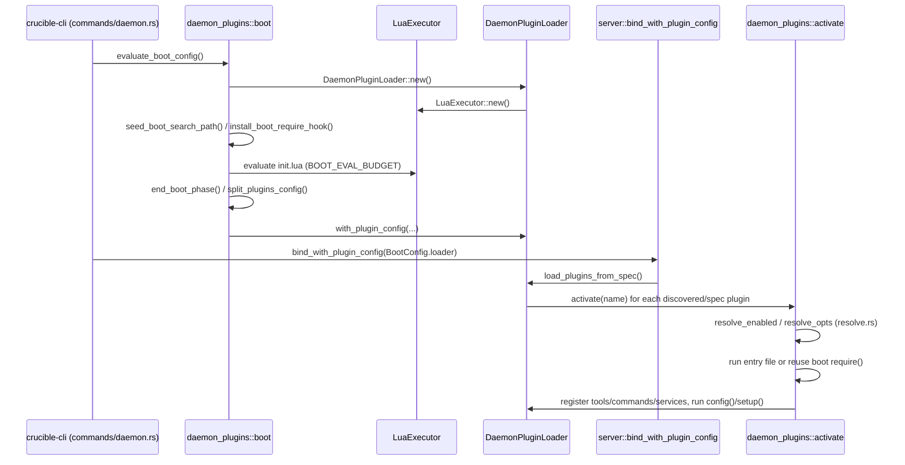

# Luau Host

This page covers the Luau host infrastructure: the VM that runs plugin and
user code, plugin discovery and activation, the shared handler/hook
registry, the config-store bridge, the settings-tree engine, and the
pure-Lua standard library the host loads into every VM. It does not cover
the individual `cru.*` capability namespaces (`cru.fs`, `cru.http`,
`cru.shell`, `cru.oil`, `cru.session`, `cru.tools`, `cru.ws`, `cru.storage`,
statusline, surfaces, theming, and so on); those live in [[Luau APIs]].

## Purpose and ownership

Per AGENTS.md, `crucible-lua` owns the Luau host: bindings, the plugin VM,
and plugin behavior and defaults. `crucible-daemon` owns plugin lifecycle
as one part of its wider ownership of sessions, admission, tools, storage
and review. The two crates divide the work this page describes as follows.

`crucible-lua` owns, inside this page's scope:

- The one VM type, `LuaExecutor` (`crates/crucible-lua/src/executor.rs`),
  and the primitives it wires together: the host-owned module resolver
  (`crates/crucible-lua/src/modules.rs`), the PUC-Lua compatibility shim
  (`crates/crucible-lua/src/luau_compat.rs`), the VM-instruction deadline
  hook (`crates/crucible-lua/src/handler_budget.rs`), and the type-checked
  registration helper (`crates/crucible-lua/src/host_registry.rs`).
- Plugin identity and lifecycle bookkeeping with no VM of its own:
  `PluginManager` (`crates/crucible-lua/src/lifecycle/mod.rs`), discovery
  (`crates/crucible-lua/src/lifecycle/discovery.rs`), the read-only fragment
  sandbox (`crates/crucible-lua/src/lifecycle/fragment.rs`), and the
  runtime declaration reader (`crates/crucible-lua/src/lifecycle/spec.rs`).
- The one handler/hook store, `LuaScriptHandlerRegistry`
  (`crates/crucible-lua/src/handlers/registry.rs`), and every registration
  API that writes into it (`cru.on`, `cru.clear`,
  `cru.permissions.on_request`, `cru.on_session_start`/`cru.on_session_end`).
- The config-store bridge (`crates/crucible-lua/src/config.rs`) and the
  settings-tree engine for plugin options and app config
  (`crates/crucible-lua/src/options/`).
- The pure-Lua standard-library additions and the plugin test harness
  (`crates/crucible-lua/src/prelude/`).
- The Rust-side authority substrate — who is running, and which session —
  that Lua cannot read or write (`crates/crucible-lua/src/plugin_context.rs`)
  and the default-deny sandbox claim registry
  (`crates/crucible-lua/src/isolation.rs`).

`crucible-daemon` owns, inside this page's scope:

- The one shared plugin VM instance, `DaemonPluginLoader`
  (`crates/crucible-daemon/src/daemon_plugins/mod.rs`), and the single
  activation body every trigger converges on
  (`crates/crucible-daemon/src/daemon_plugins/activate.rs`), matching
  AGENTS.md's rule that boot, `require`, install and reload share one path.
  This page's boot coverage is deliberately thin: [[Config Boot]] is the
  detailed reference for `evaluate_boot_config` and the `init.lua`
  evaluation sequence, and [[State Stores]] covers the registry files
  (`plugins.installed.json`, `plugin-options.json`) this page's loader
  reads and writes.
- Plugin install/remove and the legacy-manifest import
  (`crates/crucible-daemon/src/plugin_ops.rs`), plugin search-path
  resolution and the enabled `Git` spec entries' checkout
  (`crates/crucible-daemon/src/daemon_plugins/bootstrap.rs`), and the two
  pure `enabled`/`opts` resolution rules
  (`crates/crucible-daemon/src/daemon_plugins/resolve.rs`). Git URL
  validation and the actual clone/checkout run through
  `crates/crucible-daemon/src/scm.rs` (`normalize_clone_url`, `validate_pin`,
  `clone_repo`, `checkout_pin`), shared with the `scm.clone` RPC handler
  (`crates/crucible-daemon/src/server/plugins.rs`) and outside this page's
  file list; `bootstrap.rs` no longer holds its own git-URL validator.
- Resolving the shipped `runtime/defaults/init.luau` defaults and the
  daemon's own `require` search path
  (`crates/crucible-daemon/src/runtime_defaults.rs`,
  `crates/crucible-daemon/src/runtime_path.rs`). The same
  `runtime_path.rs` also defines `SourceRoots`/`ActivePluginDirs`, naming
  each active plugin's directory and each attached kiln as a skill/card/
  theme discovery source (see Flows and Key types below); that half is a
  separate concern from the `require` search path and is read by
  agent-card, skill and theme discovery, not by `daemon_plugin_paths`.

What this subsystem must not own: a second plugin VM per client or per
session (AGENTS.md: "The daemon owns one shared plugin VM"), a second
activation path outside `daemon_plugins/activate.rs`, or a `package.path`
escape hatch around the host's own `require` (`modules.rs`). It also must
not decide tool takeover by `LuaSource` alone — that decision belongs to
`may_take_a_tool_call_over` in `crucible-daemon`'s tool dispatch, outside
this page; this page's `plugin_context.rs` only records the
`intercepts_tools` grant that decision reads.

## Module map

Paths are relative to the repository root. "Lines" is the file's line
count at `582c5e6c1`.

### `crates/crucible-daemon/src/` (plugin install and runtime-path support)

| Path | Lines | Role |
|---|---|---|
| `crates/crucible-daemon/src/plugin_ops.rs` | 640 | Shared install/remove logic for `cru plugin add/remove` and the `plugin.install`/`plugin.remove` RPCs; owns `plugins.installed.json` and the one-time `plugins.toml` legacy import. |
| `crates/crucible-daemon/src/runtime_defaults.rs` | 371 | Resolves the shipped `runtime/defaults/init.luau`: `$CRUCIBLE_RUNTIME` (level `env`) first, then `runtimepath` entries, then the exe-relative/bundled roots, then `crucible_lua::BUILTIN_INIT_LUA` as the compiled-in fallback. `machine_runtime_roots()` is the production root list the boot injects into `load_defaults`. |
| `crates/crucible-daemon/src/runtime_path.rs` | 411 | `daemon_path`/`machine_runtime`: reads `$CRUCIBLE_PLUGIN_PATH`, `$CRUCIBLE_RUNTIME` and the config dir, and builds the daemon's own `Vec<RuntimeEntry>` for `require`, with no workspace/kiln/plugin roots. Separately, `SourceRoots`/`ActivePluginDirs` name each active plugin's directory and each attached kiln as a skill/card/theme discovery source, keyed by priority level (`sources.priority`, `kilns.<name>.priority`). |

### `crates/crucible-daemon/src/daemon_plugins/` (the daemon's plugin loader)

| Path | Lines | Role |
|---|---|---|
| `crates/crucible-daemon/src/daemon_plugins/mod.rs` | 1368 | `DaemonPluginLoader` — the one plugin VM, every registry it owns, and the lifecycle operations (discover, activate, reload, disable, remove). |
| `crates/crucible-daemon/src/daemon_plugins/activate.rs` | 361 | The single activation body: boot's spec-driven pass, an `init.lua` `require`, a runtime install and a reload all converge here. Also records the active plugin's directory in `PluginRegistry`'s `ActivePluginDirs`, so its `skills/`, `agents/` and `themes/` become discovery sources. |
| `crates/crucible-daemon/src/daemon_plugins/boot.rs` | 1410 | The one-VM config boot: builds the VM, seeds the module search path, evaluates `init.lua` once, extracts the effective `CliAppConfig`. See [[Config Boot]] for the full sequence. |
| `crates/crucible-daemon/src/daemon_plugins/bootstrap.rs` | 263 | Plugin search-path resolution (`daemon_plugin_paths`); the actual git clone/checkout of enabled `Git` spec entries now runs through `crates/crucible-daemon/src/scm.rs`. |
| `crates/crucible-daemon/src/daemon_plugins/option_store.rs` | 423 | Durable persistence for `cru.plugin.options` settings-pane values through the shared, locked `RegistryStore`, replayed through each plugin's own setter at boot and reload. See [[State Stores]]. |
| `crates/crucible-daemon/src/daemon_plugins/resolve.rs` | 166 | The two pure rules, `resolve_enabled` and `resolve_opts`, that both activation and bootstrap read so they answer the same question the same way. |

### `crates/crucible-daemon/src/daemon_plugins/tests/`

| Path | Lines | Role |
|---|---|---|
| `crates/crucible-daemon/src/daemon_plugins/tests/activate.rs` | 447 | Unit tests for `activate::activate` across boot `require`, the spec-driven pass and `reload_plugin`, and that only an active plugin's directory is a skill/card/theme source. |
| `crates/crucible-daemon/src/daemon_plugins/tests/active_kiln.rs` | 92 | Tests that a plugin learns the active kiln only by name, never by filesystem path. |
| `crates/crucible-daemon/src/daemon_plugins/tests/check.rs` | 73 | Tests `cru plugin check` against the loader's own VM (which has `cru.schedule`/`cru.timer`, unlike the standalone checker VM). |
| `crates/crucible-daemon/src/daemon_plugins/tests/install.rs` | 399 | Hermetic tests of `plugin_ops`'s install/remove cores composed with loader activation, mirroring the real RPC handler sequence. |
| `crates/crucible-daemon/src/daemon_plugins/tests/lifecycle.rs` | 540 | Load/reload bookkeeping: `loaded_specs` merge semantics, the inert-on-`Error` contract, plugin-context attribution on every `activate` exit path. |
| `crates/crucible-daemon/src/daemon_plugins/tests/mod.rs` | 1387 | Root test module: API-surface contract, session-lifecycle hook firing, discovery/search-path resolution (including `$CRUCIBLE_RUNTIME`-outranks-`runtimepath` precedence), `eval`, kiln-graph Lua bindings, and the `make_plugin_inert` clean-sweep guarantee. |
| `crates/crucible-daemon/src/daemon_plugins/tests/plugin_context.rs` | 106 | Tests that plugin storage attribution is Rust-side app data, not a forgeable Lua global. |
| `crates/crucible-daemon/src/daemon_plugins/tests/services.rs` | 159 | Tests declared plugin "services" — attribution to the owning plugin, and abort-before-respawn on reload/disable. |
| `crates/crucible-daemon/src/daemon_plugins/tests/shipped.rs` | 414 | Contract tests over the bundled plugin set in `runtime/plugins/`: discovery, real activation, fragment/module-table separation, and the config kill switch. |

### `crates/crucible-lua/src/` (VM lifecycle, plugin identity, and shared infrastructure)

| Path | Lines | Role |
|---|---|---|
| `crates/crucible-lua/src/executor.rs` | 904 | `LuaExecutor` — owns one `mlua::Lua` VM, wires every stateless `cru.*` module at construction, drives session-start/session-end lifecycle hooks. |
| `crates/crucible-lua/src/modules.rs` | 1146 | The host-owned `require` implementation: the sole module resolver for every Crucible Lua VM, with public (by-name) and private (by-path, per-plugin) roots. |
| `crates/crucible-lua/src/luau_compat.rs` | 1203 | Re-implements the PUC-Lua `io`/`os` pieces Luau strips out, plus `io.popen`/`os.execute`, so plugins keep filesystem/process capability. |
| `crates/crucible-lua/src/handler_budget.rs` | 291 | Enforces a wall-clock deadline on one handler call via the VM's execution-interrupt hook, complementing `tokio::time::timeout`. |
| `crates/crucible-lua/src/host_registry.rs` | 695 | `Ns` — registers an `mlua` function and checks its declared Luau type against the real Rust argument/return types in the same call. |
| `crates/crucible-lua/src/host_hook.rs` | 175 | `HostHook<T>` — a generic install-once/read-many cell for a boxed host callback the daemon installs at boot. |
| `crates/crucible-lua/src/host_api.rs` | 899 | The static/generated declaration of the whole `cru.*` surface (the un-migrated half) and the renderer that emits `.luau` declaration files. |
| `crates/crucible-lua/src/signature.rs` | 815 | The canonical `LuaType`/`Signature` model and hand-written parser: declared-type text to Luau syntax, JSON Schema, or doc string. |
| `crates/crucible-lua/src/isolation.rs` | 455 | `cru.isolation.require` — a session's default-deny sandbox claim, consumed by the daemon's tool dispatch and agent manager. |
| `crates/crucible-lua/src/plugin_context.rs` | 472 | The Rust-side, Lua-unreachable app-data slots recording who is executing (`LuaSource`), which session, and each plugin's `intercepts_tools` grant. |
| `crates/crucible-lua/src/plugin_spec_store.rs` | 648 | Backing store for `cru.plugin.setup(entries)` — the declared plugin list, ranked by the writing `LuaSource`, and each entry's `config` function. |
| `crates/crucible-lua/src/plugin_status.rs` | 701 | `cru.plugin.set_status`/`clear_status` and `cru.statusline.item`/`publish` — durable, session-scoped, per-author (per-plugin) UI status items, read by the RPC layer for TUI and web; refuses the engine's reserved `plugin_turns:` id prefix and `plugin_approval` action. |
| `crates/crucible-lua/src/manifest.rs` | 361 | Models what the host knows about a plugin before running its Lua: the synthesized manifest, `PluginState`, `PluginSource`, name/version validation. |
| `crates/crucible-lua/src/namespace.rs` | 182 | `CruNamespace` — the exhaustive, compiler-checked enum of every top-level key allowed on the `cru` global; enforced by a daemon completeness test. |
| `crates/crucible-lua/src/hooks.rs` | 372 | Registers `cru.on_session_start`/`cru.on_session_end` into the shared handler store. |
| `crates/crucible-lua/src/session_start_scope.rs` | 208 | The "before the agent exists" tier for `on_session_start` hooks: `session.system_prompt`/`mode`/`model` writes land here, read back by `AgentManager::apply_session_defaults`. |
| `crates/crucible-lua/src/schema.rs` | 192 | Builds JSON Schema for a Lua-declared tool from the shared `Signature`/`LuaType` model. |
| `crates/crucible-lua/src/config.rs` | 1955 | The Lua-side app-config store bridge — `cru.config.set/get`, `cru.rtp.*`, `ConfigState`, boot-phase lifecycle, `init.lua`/kiln-config loading — and theme-file resolution (`theme_roots`/`list_available_themes`/`resolve_theme_file`), source-ranked the same way plugin/skill/kiln discovery is. See [[Config Boot]] for the sequence this file implements. |
| `crates/crucible-lua/src/config_syntax.rs` | 61 | Distinguishes "this config file does not parse" (fatal) from "this file parsed and then raised" (rolled back), across the `cru.include`/`require` Rust-callback boundary. |
| `crates/crucible-lua/src/check.rs` | 1402 | Implements `cru plugin check`: parse, declarations, optional `luau-lsp`/`luau-analyze` typecheck, and on-VM top-level-effect detection. |
| `crates/crucible-lua/src/stubs.rs` | 407 | Generates plugin-author stub files (`cru.lua`, `cru.d.luau`, `cru-docs.json`) by walking a live `cru` table. |
| `crates/crucible-lua/src/test_support.rs` | 375 | Test-only builder for minimal Lua VMs with a chosen subset of `cru.*` modules, an in-memory `PropertyStore` fixture, and `MockSessionRpc`, the in-memory `SessionConfigRpc` that session handle tests bind. |
| `crates/crucible-lua/src/discovered.rs` | 109 | The plain-data shapes a plugin's spec table parses into (`DiscoveredTool`, `DiscoveredCommand`, `DiscoveredHandler`, `DiscoveredService`); `lifecycle/spec.rs` does the parsing. |
| `crates/crucible-lua/src/types.rs` | 22 | `LuaExecutionResult`, the result of `LuaExecutor::execute_source`. |
| `crates/crucible-lua/src/error.rs` | 155 | `LuaError`, the crate's error type, its `mlua` interop conversions, and `format_lua_error` for user-facing display. |
| `crates/crucible-lua/src/error_ext.rs` | 14 | `LuaResultExt` — a one-line extension trait converting any displayable error into `LuaResult`. |
| `crates/crucible-lua/src/lua_util.rs` | 94 | Small shared helpers for the `cru` namespace tables, and the deprecated `cru.sessions` alias. |

### `crates/crucible-lua/src/handlers/` (the hook/event registry)

| Path | Lines | Role |
|---|---|---|
| `crates/crucible-lua/src/handlers/registry.rs` | 1065 | `LuaScriptHandlerRegistry` — the single store backing `cru.on`, `cru.permissions.on_request`, the session hooks and the provider-auth hook; the execution choke point. |
| `crates/crucible-lua/src/handlers/hook_name.rs` | 694 | `EventName`/`StageId`/`HookName` — the closed, exhaustively-checked vocabulary of names `cru.on` and related APIs accept. |
| `crates/crucible-lua/src/handlers/cru_on.rs` | 216 | Implements `cru.on(event_type, [opts,] handler)`, the primary registration API. |
| `crates/crucible-lua/src/handlers/cru_clear.rs` | 81 | Implements `cru.clear`, the retirement counterpart to `cru.on`. |
| `crates/crucible-lua/src/handlers/permission.rs` | 400 | Implements `cru.permissions.on_request`, the synchronous permission-gate hook; the request view carries one `CanonicalToolCall`, and its `IntoLua` conversion makes the hook table. |
| `crates/crucible-lua/src/handlers/before_execute.rs` | 91 | Implements the `tool:before_execute` hook: Lua-injected environment variables for the tool call about to run. |
| `crates/crucible-lua/src/handlers/render.rs` | 62 | Implements `tool:render`: display data for one tool call, called again with its finished result; last-registered-handler-wins, unlike other stages' first-wins rule. |
| `crates/crucible-lua/src/handlers/conversion.rs` | 127 | The single projection from `SessionEvent` to the flat JSON/Lua table every handler sees, and its inverse. |
| `crates/crucible-lua/src/handlers/script_handler.rs` | 257 | Interprets a raw Lua return value into `ScriptHandlerResult`/`EventOutcome` — the Neovim-style return-convention parser. |
| `crates/crucible-lua/src/handlers/mod.rs` | 109 | Module root: documents the subsystem's contract, re-exports the public surface, owns the "installed registry" VM app-data slot. |

### `crates/crucible-lua/src/handlers/tests/`

| Path | Lines | Role |
|---|---|---|
| `crates/crucible-lua/src/handlers/tests/registry.rs` | 231 | Tests for `cru.on` registration, validation, and the one shared store across every registration API. |
| `crates/crucible-lua/src/handlers/tests/runtime.rs` | 610 | Tests for runtime dispatch: `register`, `runtime_handlers_for` selection/ordering, `execute_runtime_handler`, id-allocation, fail-open on an unregistered handler. |
| `crates/crucible-lua/src/handlers/tests/scope.rs` | 453 | Tests for `SessionScope`: per-session registration, session isolation, illegal-scope refusals, session-end sweep. |
| `crates/crucible-lua/src/handlers/tests/once.rs` | 422 | Tests for the `once = true` option across all four dispatch paths that load a registration's body. |
| `crates/crucible-lua/src/handlers/tests/clear.rs` | 355 | Tests for `cru.clear`'s name/pattern/session filters and its own-source-only reach. |
| `crates/crucible-lua/src/handlers/tests/permission.rs` | 405 | Tests for `execute_permission_hooks`: first-decision-wins, pattern scoping, shared glob syntax with `cru.on`. |
| `crates/crucible-lua/src/handlers/tests/budget.rs` | 209 | Tests that a per-handler time budget stops both an awaiting handler (tokio timeout) and a spinning handler (VM deadline hook). |
| `crates/crucible-lua/src/handlers/tests/interpret.rs` | 293 | Unit tests for `interpret_handler_result`'s precedence rules (cancel/transform/inject/handled). |
| `crates/crucible-lua/src/handlers/tests/conversion.rs` | 121 | Contract tests pinning the exact Lua event-table shape a handler receives. |
| `crates/crucible-lua/src/handlers/tests/render.rs` | 47 | Tests for the merged `tool:render` Lua hook. |
| `crates/crucible-lua/src/handlers/tests/mod.rs` | 10 | Module declarations wiring the ten test submodules together. |

### `crates/crucible-lua/src/lifecycle/` (discovery, fragment sandbox, plugin state)

| Path | Lines | Role |
|---|---|---|
| `crates/crucible-lua/src/lifecycle/mod.rs` | 294 | `PluginManager` — the registry of discovered plugins and each one's lifecycle state; holds no VM. |
| `crates/crucible-lua/src/lifecycle/discovery.rs` | 252 | Walks search paths, identifies plugin directories/single files, reads each fragment, runs no plugin code. |
| `crates/crucible-lua/src/lifecycle/fragment.rs` | 448 | Reads and validates `spec.luau` in a read-only sandboxed environment, producing a `Fragment` with no behavior run. |
| `crates/crucible-lua/src/lifecycle/spec.rs` | 218 | Parses `tools`/`commands`/`handlers`/`services`/`setup` out of the table a plugin's `init.luau` returned, after the daemon ran it. |
| `crates/crucible-lua/src/lifecycle/error.rs` | 28 | `LifecycleError`, the lifecycle subsystem's error type. |
| `crates/crucible-lua/src/lifecycle/error_log.rs` | 106 | A bounded ring-buffer log of plugin runtime errors, stored as per-VM app data, read by `cru.errors.recent`. |

### `crates/crucible-lua/src/lifecycle/tests/`

| Path | Lines | Role |
|---|---|---|
| `crates/crucible-lua/src/lifecycle/tests/discovery.rs` | 304 | Integration tests for `PluginManager::discover` against a real temp-directory tree: ordering, fragment application, ambiguity handling. |
| `crates/crucible-lua/src/lifecycle/tests/spec.rs` | 419 | Tests for `spec_from_table`: every declaration kind, type validation, command-effect parsing. |
| `crates/crucible-lua/src/lifecycle/tests/state.rs` | 207 | Tests for `PluginManager`'s state transitions and `.luau`-extension/ambiguous-entry-point discovery. |
| `crates/crucible-lua/src/lifecycle/tests/error_log.rs` | 173 | Tests for `PluginErrorLog`'s ring buffer and its `cru.errors.recent`/hook-error integration. |
| `crates/crucible-lua/src/lifecycle/tests/mod.rs` | 53 | Module wiring and shared fixtures (`create_test_plugin`, `vm_with_error_log`) for the `lifecycle::tests` tree. |

### `crates/crucible-lua/src/options/` (the settings-tree engine)

| Path | Lines | Role |
|---|---|---|
| `crates/crucible-lua/src/options/mod.rs` | 950 | The runtime engine for a plugin's live Ace3-style options tree: `cru.plugin.options`, `describe`/`get`/`set`/`execute`. |
| `crates/crucible-lua/src/options/control.rs` | 241 | `Control` — the closed enum of settings-control kinds, replacing a free string. |
| `crates/crucible-lua/src/options/validate.rs` | 172 | Declaration-time structural validation (depth, node count, per-`Control` required fields) before a tree is stored. |
| `crates/crucible-lua/src/options/admit.rs` | 225 | The write-time gate for one leaf: type, disabled flag, range and choice checks, before a plugin's setter runs. |
| `crates/crucible-lua/src/options/app_config.rs` | 942 | Declares the app-config half of the same control vocabulary in Rust, since `CliAppConfig` has no live Lua table to walk. |

### `crates/crucible-lua/src/prelude/` (pure-Lua stdlib additions and the plugin test harness)

| Path | Lines | Role |
|---|---|---|
| `crates/crucible-lua/src/prelude/mod.rs` | 248 | Orchestrates loading every prelude Lua module and hand-writes the Luau type declarations for the pure-Lua half. |
| `crates/crucible-lua/src/prelude/stdlib.rs` | 431 | Embeds `cru.retry`, `cru.emitter`, `cru.check`, `cru.settings`, `cru.service`. `cru.service` resolves its config schema through `cru.settings`. |
| `crates/crucible-lua/src/prelude/qol.rs` | 144 | Embeds `cru.inspect`, `cru.tbl_deep_extend`, `cru.tbl_get`, `cru.on_error`. |
| `crates/crucible-lua/src/prelude/health.rs` | 105 | Embeds `cru.health`, a `vim.health`-inspired plugin self-diagnostics API. |
| `crates/crucible-lua/src/prelude/test_runner.rs` | 324 | Embeds a minimal busted-style test runner (`describe`/`it`/`expect`/`run_tests`). |
| `crates/crucible-lua/src/prelude/test_mocks.rs` | 537 | Embeds the mock layer standing in for daemon-registered host modules inside the plugin test runner's bare VM. |

### `crates/crucible-lua/src/prelude/tests/`

| Path | Lines | Role |
|---|---|---|
| `crates/crucible-lua/src/prelude/tests/check.rs` | 74 | Unit tests for `cru.check.*` and a smoke test that the expected prelude modules exist. |
| `crates/crucible-lua/src/prelude/tests/declarations.rs` | 42 | Proves every hand-written prelude Luau declaration at least parses as valid Luau. |
| `crates/crucible-lua/src/prelude/tests/emitter.rs` | 255 | Unit tests for `cru.emitter`. |
| `crates/crucible-lua/src/prelude/tests/retry.rs` | 93 | Unit and one real-timer integration test for `cru.retry`. |
| `crates/crucible-lua/src/prelude/tests/service.rs` | 116 | Unit tests for `cru.service.define`/`list`/`status`/`stop` and its config-resolution fallback chain. |
| `crates/crucible-lua/src/prelude/tests/mod.rs` | 5 | Test module aggregator. |

## Key types and traits

**`LuaExecutor`** (`crates/crucible-lua/src/executor.rs`) holds one
`mlua::Lua`, one `ModuleRegistry`, and a `CurrentSession` handle. The daemon
creates exactly one, inside `DaemonPluginLoader::new`. It is not `Clone`;
every caller holds it by reference or by the loader that owns it.

**`DaemonPluginLoader`** (`crates/crucible-daemon/src/daemon_plugins/mod.rs`)
wraps one `LuaExecutor` plus every plugin-facing registry the daemon binds
to it: a `PluginManager`, `loaded_specs` (a plugin's declarations by name),
a `HostHook<Arc<dyn DaemonSessionApi>>` session-API bridge, spawned service
tasks by owning plugin, a mode registry and the `handler_registry`
(permission hooks live inside the same `LuaScriptHandlerRegistry`, not a
separate registry), and the isolation/status/surface/publication/options
registries. `crucible-cli/src/commands/daemon.rs` calls `evaluate_boot_config`
for the `BootConfig`, then `Server::bind_with_plugin_config`
(`crates/crucible-daemon/src/server/mod.rs`; its params type is defined in
`crates/crucible-daemon/src/server/bind.rs`) wires that boot loader in, or
builds one with `DaemonPluginLoader::new` when none was supplied. RPC
handlers in `crates/crucible-daemon/src/server/plugins.rs` and
`crates/crucible-daemon/src/server/plugin_install.rs` call its
`pub`/`pub(crate)` methods for every `plugin.*` RPC. `DaemonPluginLoader::handlers()`
returns one `PluginHandlers` pair (the `handler_registry` and the plugin
`Lua`), so the turn loop, the tool gate and the ACP gate all read the same
pair rather than two duplicate bindings.

**`PluginManager`** (`crates/crucible-lua/src/lifecycle/mod.rs`) is the
registry of what discovery found and each plugin's `PluginState`
(`Discovered`/`Loaded`/`Active`/`Error`/`Disabled`; `Loaded` has no
constructor anywhere in the workspace, confirmed by grep). It holds no
`Lua` — activation is
the daemon's act, in the daemon VM, so `PluginManager` only records the
outcome the daemon reports back through `mark_active`/`mark_error`/
`disable`/`forget`. `DaemonPluginLoader` owns one instance.

**`Fragment`** (`crates/crucible-lua/src/lifecycle/fragment.rs`) is the
read-only metadata `read_fragment` extracts from `spec.luau` without
running plugin code: `name`, `version`, `description`, `author`, `license`,
`intercepts_tools`, `opts`. `discovery.rs`'s `apply_fragment` folds it onto
the directory-derived manifest.

**`PluginSpec`** (`crates/crucible-lua/src/lifecycle/spec.rs`) is the
runtime companion: `tools: Vec<DiscoveredTool>`, `commands`, `handlers`,
`services`, `has_setup`, and a `source: Option<String>` field the file
declares but the parser never assigns — see Findings.
`activate::activate_inner` builds one per activation and stores it in
`DaemonPluginLoader::loaded_specs`.

**`LuaScriptHandlerRegistry`** (`crates/crucible-lua/src/handlers/registry.rs`)
is one `Arc<Mutex<Vec<Registration>>>` plus one `Arc<AtomicU64>` id
allocator — the single store every registration API writes into and every
dispatch site reads from. `DaemonPluginLoader` holds one `Arc<..>` (its
`handler_registry` field) shared with the tool dispatcher and the agent
manager. A **`Registration`** carries the `HookName`, the owning
`LuaSource`, a numeric id, an optional identifier `pattern`, a
`SessionScope`, an optional `key`, `once`, an optional `timeout_ms`, and the
Lua body behind an `Arc<RegistryKey>`.

**`HookName`** (`crates/crucible-lua/src/handlers/hook_name.rs`) is
`Event(EventName) | Stage(StageId)` — the closed, compiler-checked union of
every name `cru.on` accepts. `EventName` covers fire-and-forget broadcasts
(`file:changed`, `note:created`, `session:created`, `base:changed`, …);
`StageId` covers synchronous interception stages (`pre_tool_call`,
`tool:result`, `tool:render`, `permission:request`, `session:start`,
`provider:auth`, `search:rerank`, `index:blocks`, `base:before_write`, …).
Four `StageId` names — `PermissionRequest`, `SessionStart`, `SessionEnd`,
`ProviderAuth` — have their own dedicated registration API and are refused
through `cru.on`; every other stage, including `base:before_write`,
registers through plain `cru.on`. `ToolRender`'s budget is the short
`PERMISSION_BUDGET`, not the `TURN_STAGE_BUDGET` most stages use, because a
render runs before each tool call and each prompt.

**`LuaSource`** (re-exported from `crucible_core::lua_source` by
`crates/crucible-lua/src/plugin_context.rs`) is the total enum — `Plugin`,
`UserLua`, `Builtin`, `Eval` — that names who is running: the config store,
the handler registry, `cru.storage`, and the schedule and timer registries
all key on it. It lives in `crucible-core` because five subsystems read it
and only one, `crucible-lua`, holds the VM; the `mlua`-dependent brackets
(`set_source`/`enter_plugin`/`enter_session`) stay in `plugin_context.rs`.
`ContextAttachRegistry` (`crates/crucible-lua/src/context_attach.rs`) keys
only on session id, not on `LuaSource`.

**`ConfigState`/`ConfigStore`** (`crates/crucible-lua/src/config.rs`) is the
process-global (`OnceLock<Arc<RwLock<ConfigState>>>`) app-config bridge.
Every `cru.config.set`/`cru.rtp.*` write funnels through `merge_from_lua`,
which classifies the call site (`AuthorRoots::classify`, outside this
page's scope) and tags the write with a `ConfigSource`. [[Config Boot]]
covers the boot sequence and the rank rule in full.

**`OptionsRegistry`** (`crates/crucible-lua/src/options/mod.rs`) holds one
live Lua `Table` per plugin behind an `Arc<Mutex<HashMap<String,
OptionsTree>>>`. `describe`/`get`/`set`/`execute` all re-evaluate the live
table on every call, because `values`/`disabled` may be functions.
`Control` (`options/control.rs`) is the closed vocabulary both this tree
and `options/app_config.rs`'s Rust-declared app-config tree render
through, so the TUI and web settings panes share one shape.

**`IsolationRegistry`**/**`IsolationClaim`** (`crates/crucible-lua/src/isolation.rs`)
record a session's default-deny sandbox claim: which tools are exempt, and
what argv wraps a host execution. `host_execution_allowed` is the actual
gate a claimed session's tool call passes through, keyed by
`crucible_core::traits::tools::ToolSurface`, not by tool name.

**`SourceRoots`**/**`ActivePluginDirs`** (`crates/crucible-daemon/src/runtime_path.rs`)
name every skill/card/theme discovery source outside the `require` search
path: `config_home`, the deprecated `agent_directories`, `runtimepath`, the
kiln registry (each attached kiln takes its registered name, or
`kiln`/`kiln-2`/… by attach order), and `plugin_dirs`, a handle to
`ActivePluginDirs` — one `Arc<RwLock<BTreeMap<String, PathBuf>>>` that
`crates/crucible-daemon/src/plugin_tools.rs`'s `PluginRegistry` owns.
`activate.rs` inserts a plugin's directory once it activates;
`make_plugin_inert`'s `PluginRegistry::remove_plugin` removes it, so a
disabled or errored plugin puts no text into a prompt. `levels_plugins_ignore`
names the `sources.priority` levels that hold a plugin directory, because
plugin `require` roots are fixed before `init.lua` runs and plugin discovery
reuses that order — `sources.priority` cannot reorder them. `kiln_roots`
resolves each kiln's priority from `kilns.<name>.priority`, a level name or
number, read from the user's config only.

**`StatusRegistry`** (`crates/crucible-lua/src/plugin_status.rs`) backs
`cru.plugin.set_status`/`clear_status` and `cru.statusline.item`/`publish`.
Storage is `session → author → key → entry`
(`HashMap<String, BTreeMap<String, BTreeMap<String, StatusEntry>>>`); the
author is always `crate::plugin_context::current_source`, never a
caller-supplied string, so a plugin can neither write into another
plugin's list nor erase it. `get()` flattens every author's list into one
`Vec<(id, entry)>` with `id = "{author}/{key}"`, sorted by `StatusEntry`'s
`priority` (default 128, lower first), then by id. `set_change_notifier`
installs a `HostHook`-backed callback (the same `ChangeNotifier` type
`StatuslineExprRegistry` uses) that every mutation calls once the lock is
released, and only when something actually changed. `release_plugin`
drops one author's list from every session that has one; `make_plugin_inert`
(`crates/crucible-daemon/src/daemon_plugins/mod.rs`) calls it. `refuse_engine_names`
rejects a plugin-declared `id` starting with `crucible_core::types::PLUGIN_TURNS_ID_PREFIX`
or an `action` equal to `crucible_core::types::PLUGIN_APPROVAL_ACTION`, so a
plugin cannot impersonate the daemon's own plugin-turn/approval status item.

**`Control` vocabularies stay closed by construction.** `Control`,
`HookName`/`EventName`/`StageId`, `CruNamespace`, and `CommandEffect`
(consumed via `crate::discovered::DiscoveredCommand`, defined outside this
page) all carry `#![deny(clippy::wildcard_enum_match_arm)]` at their module
top and a hand-written `ALL`/`EnumIter` completeness test, matching
AGENTS.md's "closed sets need one exhaustive table and a compiler/runtime
completeness gate" rule. `CruNamespace` (`crates/crucible-lua/src/namespace.rs`)
picked up two variants this way: `Diff` (`cru.diff.get`/`file`/the comments)
and `Proposals` (`cru.proposals.rejected`/`list`/`accept`/`reject`), each
added to the exhaustive match the lint requires.

## Flows

### Boot: one VM, one evaluation, then activation

[[Config Boot]] is the full reference for this flow; the summary below
names only the functions this page's files implement.

A plugin `require`d during `init.lua` evaluation cannot await `activate`
(`require` is a sync closure with no loader handle), so
`install_boot_require_hook` runs the module body synchronously under
`LuaSource::Plugin(name)`, and `activate` later matches that instance by
file and finishes the remaining steps (declarations, registration, hooks,
`config`). `activate_inner`'s ten numbered steps are described in
[[Config Boot]] and in the module doc of
`crates/crucible-daemon/src/daemon_plugins/activate.rs` itself.

### A tool call reaches a registered hook

1. `agent_manager`'s messaging pipeline (outside this page) calls
   `LuaScriptHandlerRegistry::runtime_handlers_for(StageId::PreToolCall, ..)`
   to select matching `Registration`s, in registration order.
2. For each, `execute_handler_with_payload` sets the plugin's `LuaSource`
   (`plugin_context::set_source`), enters the session
   (`plugin_context::enter_session`), races `tokio::time::timeout` against
   the VM deadline hook (`handler_budget::enter`), and calls
   `Registration::take_body` — the one choke point that also retires a
   `once` registration before the body runs.
3. `script_handler::interpret_handler_result` maps the raw Lua return into
   a `ScriptHandlerResult` (`Transform`/`PassThrough`/`Cancel`/`Inject`/
   `Handled`), and the caller (outside this page) acts on it. A bare Lua
   string return (the shipped `precognition_format` handler's contract) is
   an expected `Transform`, not a warned "unexpected type" fallback; only a
   boolean, number, function or other non-table/non-string/non-nil return
   trips that warning (`unexpected_return`).
4. The previous `LuaSource` is restored unconditionally, on every exit path.

### A permission decision

`execute_permission_hooks` (`crates/crucible-lua/src/handlers/permission.rs`)
is the one synchronous exception to the async dispatch above: permission
decisions must answer before an async gap can hand the thread away, so this
function calls each hook's body with `handler.call::<Value>` inside one
`handler_budget::enter(PERMISSION_BUDGET)` span covering the whole loop. The
first hook to answer `{allow=true}` or `{deny=true}` wins; an exhausted
list, or no hooks at all, answers `Prompt`. Each hook's `PermissionRequest`
carries one `crucible_core::types::CanonicalToolCall` (field `call`, not a
bare `tool_name`). `PermissionRequest` is a Lua-side view: it adds only the
arguments, the read-only class and the session mode, which no core type
holds. Its `IntoLua` conversion makes the Lua table that a handler receives.
The conversion reads `file_path` from the `path` or `file` argument. The
table has `tool_name`, `kind`, `paths` (always present), and
`command`/`url`/`query`/`agent` when the call has them. One hook can thus
decide a Crucible tool call and an ACP agent's tool call from the same
shape.

### Plugin discovery and activation stay two passes

`PluginManager::discover` (`crates/crucible-lua/src/lifecycle/discovery.rs`)
reads each candidate's `spec.luau` through `fragment::read_fragment`'s
read-only sandbox and never `require`s or runs `init.luau`. Activation
(`daemon_plugins::activate::activate`) is the only place that runs a
plugin's module body, in the one daemon VM. This split is the mechanism
behind AGENTS.md's rule: "Discovery reads fragments without running plugin
code. Activation runs the module once and its spec entry's config."

### Settings-pane write

1. The web or TUI settings pane calls the `plugin.option_set` RPC (outside
   this page), which calls `OptionsRegistry::set`.
2. `set` resolves the target node, then calls `admit::admit_value` — the
   write-time gate — **before** calling the inherited Lua setter.
3. On success, `daemon_plugins::option_store::record` persists the value to
   `plugin-options.json` through the shared, locked, atomic `RegistryStore`
   (see [[State Stores]]); a file that fails to parse is left untouched and
   `record` returns an error naming it, rather than being silently reset.
4. At the next boot or `plugin.reload`, `option_store::restore`/
   `restore_plugin` replays every stored value through the plugin's own
   setter, after `config`/`setup` ran, so a settings-pane value outranks
   both the shipped default and what `init.lua` set.

## State, concurrency and lifecycle

**One VM, one mutex-guarded plugin loader.** `DaemonPluginLoader` is driven
from behind whatever lock the daemon's caller already holds around it (per
`activate.rs`'s own comment, "the loader mutex is what makes the
Error-but-still-registered window unobservable"); no file in this page adds
a second lock around the VM itself.

**The handler registry is one lock, not two.** `LuaScriptHandlerRegistry`
merged a former two-lock design (row metadata separate from the Lua body)
into one `Mutex<Vec<Registration>>`, specifically so a poisoned lock cannot
leave metadata and body disagreeing, and so a dispatch racing a reload
cannot read a row whose body already went. `register`/`clear_source`/
`clear_session`/`clear_matching` and every dispatch function take this one
lock briefly and release it before calling back into Lua.

**Ids are never reused, and retirement is one choke point.** `register`
allocates via `AtomicU64::fetch_add`, never from `Vec::len()`, so a reload
that shrinks the store cannot hand a survivor's slot to a new registration.
`Registration::take_body` is the single function that returns a callable
body, and it retires a `once` registration inside that same call — a
dispatch path cannot obtain a body without passing retirement.

**Two independent per-plugin cleanup stores, deliberately not unified.**
`crate::schedule::cancel_source` and `crate::timer::abort_source` (both
outside this page's file list, called from
`crates/crucible-lua/src/handlers/registry.rs`'s free function
`clear_source`) are swept alongside the handler registry on plugin unload,
each with its own `Arc<Mutex<..>>` store keyed by owning `LuaSource`. The
registry's own doc states the reason: a shared generic helper would need
five knobs (container, element, owner projection, stop action, store
lookup) for three call sites.

**`make_plugin_inert`** (`crates/crucible-daemon/src/daemon_plugins/mod.rs`)
is the single, exhaustive release path for a plugin going `Error`,
`Disabled`, reloaded, or removed: it calls `on_unload`, drops the module
table and registry key, invalidates cached private modules, aborts every
spawned service task, removes the plugin's tools/commands from
`PluginRegistry`, clears every `cru.on`/permission/session/auth-hook/
schedule registration via `clear_source`, releases publications, surfaces,
status and options, releases statusline values, and calls
`lua.expire_registry_values()`. `IsolationRegistry` is session-keyed, not
plugin-keyed, so no plugin-scoped release exists for it or is needed;
`StatusRegistry` keeps one list for each plugin, and `self.status.release_plugin(name)`
drops an inert plugin's list. A regression test
(`a_reload_leaves_one_copy_of_every_registration_and_inert_leaves_none`, in
`daemon_plugins/tests/mod.rs`) pins that this list covers nine separate
registries, not five.

**Startup order inside `LuaExecutor::new`.** The handler-budget interrupt
hook installs first, before any `cru.*` module registers, because "every
handler budget is enforced from inside this hook." `register_stdlib_compat`
(`luau_compat.rs`) runs unconditionally, so every plugin has `io`/`os`
whether or not it claims filesystem capability in its fragment.

**Boot rollback is total, not partial.** A runtime failure in `init.lua`
(a raise, or a `BOOT_EVAL_BUDGET` overrun) rolls the whole config-store
snapshot back and drops the failed VM — "taking hooks, handlers,
`package.loaded` and every `_G` mutation with it" — rather than keeping
whatever registered before the failing line. A syntax error is fatal and
the daemon refuses to start. See [[Config Boot]] for the classification
rule (`InitFailure::Syntax` vs `InitFailure::Runtime`).

**Options-tree evaluation is live, not cached.** `OptionsRegistry` keeps
the plugin's real Lua `Table`, not a JSON snapshot, because `values`/
`disabled` may be zero-argument functions the settings pane must
re-evaluate on every read (a container-runtime probe going stale is the
example both `options/mod.rs` and `options/admit.rs` cite).

## Boundaries and invariants

- **The daemon owns one shared plugin VM.** Enforced by construction:
  `DaemonPluginLoader::new` builds exactly one `LuaExecutor`, and no file in
  this page's scope constructs a second one for a session or a client.
- **Discovery runs no plugin code; activation runs it once.**
  `lifecycle/fragment.rs`'s `read_only_env` gives a fragment six pure
  functions and sealed copies of `string`/`table`/`math` — no `cru`, no
  `require`, no `_G` — so a fragment cannot self-grant `intercepts_tools`.
  `lifecycle/discovery.rs` never calls `require` or evaluates `init.luau`.
- **`intercepts_tools` is a fragment-only grant.** `plugin_context.rs`'s
  `record_plugin_intercept`/`intercept_for` store the grant Rust-side, keyed
  by plugin name, decoupled from `enter_plugin` so entering a source never
  re-decides the grant. This is the mechanism, not the decision: the
  decision (`may_take_a_tool_call_over`) lives in `crucible-daemon`, outside
  this page.
- **A source is read, never written, by Lua.** `plugin_context::current_source`/
  `current_plugin_name` are `mlua` app-data reads with no Lua-visible
  setter. `crate::storage::PropertyStore` namespacing and `cru.plugin.publish`
  attribution both key on this, and a regression test in
  `daemon_plugins/tests/plugin_context.rs` proves writing
  `cru._current_plugin` from Lua is inert.
- **A status author is read, never written, by Lua.** `cru.plugin.set_status`,
  `cru.statusline.publish` and `crate::plugin_status::refuse_engine_names`
  all take the author from `plugin_context::current_source`, never from a
  `plugin` field on the Lua options table, so a plugin can neither publish
  under another plugin's name nor under the engine's reserved
  `plugin_turns:` id prefix or `plugin_approval` action.
- **A plugin's directory is a discovery source only while the plugin is
  active.** `crates/crucible-daemon/src/runtime_path.rs`'s `ActivePluginDirs`
  gets its one entry from `activate.rs`, and the same `make_plugin_inert`
  path that runs `clear_source` for an inert plugin removes it, so a
  disabled or broken plugin's `skills/`, `agents/` and `themes/` stop
  reaching discovery in the same step that stops its hooks.
- **Once-retirement happens before the body runs, not after.** `registry.rs`
  cites Neovim upstream issue #25526 for why: a nested dispatch (a
  `pre_tool_call` handler that runs a tool) can re-enter the same hook name
  while a still-registered one-shot row is visible, so the row must already
  be gone before the call, not after it returns.
- **A dispatch id is never reused; a scoped registration replaces by full
  key, never appends.** Both are documented fixes for real regressions
  (id-collision after reload; a per-session hook re-registering on every
  `resume_from_storage` and leaking one handler per resume) — see
  `handlers/tests/scope.rs` and `handlers/tests/runtime.rs`.
- **Two timeout mechanisms, because one does not cover the other's
  failure.** `tokio::time::timeout` only cancels at an await point;
  `handler_budget`'s VM-instruction hook stops a spinning
  `while true do end` a `tokio` timeout cannot reach. Both wrap every
  handler call in `execute_handler_with_payload`.
- **A write is checked before the setter, never after.**
  `options/admit.rs`'s `admit_value` runs before `OptionsRegistry::set`
  calls the plugin's own (untrusted) Lua setter, so a malformed value never
  reaches plugin code.
- **A settings-tree declaration is refused at declaration time, never at
  render time.** `options/validate.rs`'s `validate_tree` runs inside
  `register_options_module`, before a tree is stored, so `cru.plugin.options{...}`
  itself fails for an invalid tree rather than the settings pane silently
  drawing the wrong control.
- **A config-syntax error is marked only for the config root, never for a
  plugin file.** `config_syntax.rs`'s `config_syntax_error` returns `None`
  for a plugin's own syntax error on purpose — "a plugin is not the user's
  config, so it stays fail-open" — matching the `RootKind::User` vs
  `RootKind::Plugin` split `modules.rs` enforces on every `require`.
- **`CruNamespace` is the reviewable gate for adding a new `cru.*` key,**
  checked against the live plugin VM by a daemon test
  (`crucible-daemon/tests/cru_namespace_gate.rs`, outside this page) in both
  directions: an undeclared key on the VM, and a declared key the VM lacks.

## Extension seams

- **A new `EventName`/`StageId`.** Add the variant to
  `crates/crucible-lua/src/handlers/hook_name.rs`; the `#[deny(clippy::wildcard_enum_match_arm)]`
  lint forces every method (`as_str`, `budget`, `carries_session`) to name
  it, and `hook_name.rs`'s own test reads the help doc
  docs/Help/Extending/Event Hooks.md to diff the documented table against
  `hook_names()`. If the stage needs a dedicated argument shape rather than
  the generic `(ctx, event)` pair `cru.on` hands every handler, give it its
  own registration API (as `permission.rs`/`hooks.rs` do) and add it to
  `HookName::own_api`. `EventName::BaseChanged`, `StageId::BaseBeforeWrite`
  and `StageId::ToolRender` were all added this way.
- **A new `Control` kind for the settings tree.** Add the variant to
  `crates/crucible-lua/src/options/control.rs`'s `Control` enum and its
  `ALL` array; `options/validate.rs` and `options/admit.rs` both match over
  `Control` under the same wildcard-arm lint, so a new kind with no
  required-field or write-check arm fails to compile.
- **A new app-config leaf that needs a settings-pane control.** Add an
  `AppControl` row in `crates/crucible-lua/src/options/app_config.rs`'s
  `APP_CONTROLS`, or a `ReadOnlyLeaf` row in `READ_ONLY_LEAVES` with a
  stated reason; the file's own test suite (`every_config_leaf_has_a_control_or_a_listed_reason`)
  derives the required set from `CliAppConfig::default()` itself, so a new
  leaf with neither fails a test rather than silently rendering nothing.
  `chat.precognition_notify_no_kiln` (a toggle) and `cli.screen` (a
  fullscreen/inline select) are two such rows in `APP_CONTROLS`.
- **A new pure-Lua stdlib addition.** Add Lua source to
  `crates/crucible-lua/src/prelude/stdlib.rs`, `crates/crucible-lua/src/prelude/qol.rs`,
  or `crates/crucible-lua/src/prelude/health.rs`, and load it from
  `prelude/mod.rs::register_prelude`; hand-write its Luau declaration in
  `declare_lua_prelude` (there is no Rust closure for `Ns` to check a
  pure-Lua function against) and add a syntax-parseability assertion in
  `prelude/tests/declarations.rs`.
- **A new `cru.*` capability module with a Rust closure.** That module
  itself belongs to [[Luau APIs]], not this page, but its registration
  function is called from `setup_globals` in `crates/crucible-lua/src/executor.rs`
  (stateless modules) or `crates/crucible-daemon/src/daemon_plugins/mod.rs`
  (daemon-backed modules), and it should build an `Ns`
  (`crates/crucible-lua/src/host_registry.rs`) so its declared type is
  checked against its Rust signature at registration time.
- **A new plugin lifecycle hook (`on_load`/`on_unload`-adjacent).** The
  hook table lives on `PluginManager`
  (`crates/crucible-lua/src/lifecycle/mod.rs`); `call_hook`'s pattern (log
  and record via `record_plugin_error`, never propagate) is the one to
  follow so a raising hook does not stop activation for other plugins.

## Tests

- **`crates/crucible-daemon/src/daemon_plugins/tests/`** (nine files, this
  page's module map above) drive real `mlua::Lua` VMs through discovery,
  activation, reload, disable and inert-cleanup, and prove the "Error/Not-
  Active means fully inert" contract across all nine registries
  `make_plugin_inert` releases. `shipped.rs` runs the real bundled
  `runtime/plugins/` tree end to end, closing the gap a text-grep gate
  (checking for `name = ` and similar substrings) used to leave open.
- **`crates/crucible-lua/src/handlers/tests/`** (eleven files) exhaustively
  cover `cru.on`/`cru.clear`/`cru.permissions.on_request`, session scoping,
  per-handler budgets, `once` retirement across all four independent fire
  paths, and the raw-table-to-`ScriptHandlerResult` interpretation
  contract. A dedicated `poison` test module in `registry.rs` proves every
  reader and writer still works after a deliberately poisoned mutex.
- **`crates/crucible-lua/src/lifecycle/tests/`** (five files) prove
  discovery's file-name-sort determinism, the read-only fragment sandbox's
  refusal of `cru`/`require`/global writes, `spec_from_table`'s declaration
  reading and type validation, and `PluginManager`'s state-machine
  transitions, including a directory holding both `init.lua` and
  `init.luau` being a reported discovery error rather than a silent guess.
- **`crates/crucible-lua/src/options/mod.rs`**'s embedded `gate_tests`
  module exercises `validate_tree`/`admit_value` end to end: every
  `Control::ALL` variant is declarable, and every write-time refusal
  (out-of-bounds range, non-positive step, unlisted select choice, disabled
  option) is proven against a real Lua tree, not just the pure functions.
- **`crates/crucible-lua/src/prelude/tests/`** (six files) cover the
  pure-Lua stdlib's behavior directly (`cru.check`, `cru.emitter`,
  `cru.retry`, `cru.service`) plus one syntax-only gate
  (`declarations.rs`) for the hand-written types that have no backing Rust
  closure to check against.
- **Gaps.** `crates/crucible-daemon/src/daemon_plugins/bootstrap.rs` has no
  `#[cfg(test)]` module of its own in this page's file list; its coverage
  is the daemon's `server/tests/boot_hermeticity.rs` and the
  `agent_manager/tests/*` suites, outside this page. `crates/crucible-daemon/src/plugin_ops.rs`,
  `crates/crucible-daemon/src/daemon_plugins/boot.rs`, `runtime_defaults.rs`
  and `runtime_path.rs` likewise carry their own inline tests (not
  enumerated as separate files here) rather than a `tests/` subdirectory —
  `boot.rs`'s inline tests prove `$CRUCIBLE_RUNTIME`/`runtimepath`/
  `sources.priority` precedence hermetically, against a fixture runtime
  tree the production `machine_runtime_roots()` path never reaches. No file
  in this page's scope uses a TUI harness, PTY, or insta snapshots — all
  tests use `tempfile::TempDir`, in-memory SQLite, or a bare `mlua::Lua`,
  consistent with daemon-level, non-TUI testing guidance.

## Findings

- **`crates/crucible-lua/src/types.rs` holds only `LuaExecutionResult`.**
  `ToolResult`, `LuaTool` and `ToolParam` are gone. `LuaTool` and
  `ToolParam` copied `DiscoveredTool` and `DiscoveredParam`, and no code
  read them. `LuaExecutionResult` serves `executor.rs`'s `execute_source`,
  which only tests call.
- **`PluginSpec::source` (`crates/crucible-lua/src/lifecycle/spec.rs`) is
  declared and never assigned.** `spec_from_table` builds every other
  field of `PluginSpec` but leaves `source` at `PluginSpec::default()`'s
  `None`, and no code in the workspace reads `.source` on a `PluginSpec`
  either (confirmed by grep). The field's own file doc calls this out as
  unclear rather than settled; a caller setting it after this function
  returns was not found.
- **Three `LifecycleError` variants have no constructor.**
  `AlreadyLoaded`, `DependencyNotSatisfied` and `CircularDependency`
  (`crates/crucible-lua/src/lifecycle/error.rs`) are defined but never
  built anywhere in the workspace (confirmed by grep). They read as
  reserved for a dependency-resolution feature this page's files do not
  implement, not as dead code from a removed one, but the absence of any
  call site is worth a maintainer's confirmation.
- **`crates/crucible-daemon/src/daemon_plugins/tests/mod.rs` (1387 lines)
  mixes several unrelated test subjects** (API-surface contract, lifecycle
  hooks, discovery/runtime-root-precedence resolution, kiln-graph bindings,
  fs scoping, inert-cleanup) in one file. The module's own doc comment
  records that narrower subjects were already split out (`activate`, `active_kiln`,
  `check`, `install`, `lifecycle`, `plugin_context`, `services`, `shipped`);
  the residual file is a known grab-bag, not a silent one, so this is a
  size observation rather than a defect.
- **No conflicts with AGENTS.md found** in this page's file list beyond the
  two items above. Every file's ownership matches the ownership table
  (`crucible-lua` for the VM/host/lifecycle/handlers/options/prelude,
  `crucible-daemon` for the one shared loader instance and install/remove);
  the closed-set-with-completeness-gate pattern
  (`Control`, `HookName`, `CruNamespace`) is applied consistently; and the
  single-activation-path rule holds — every call to
  `daemon_plugins::activate::activate` found by grep originates inside the
  `daemon_plugins` module: production calls in
  `crates/crucible-daemon/src/daemon_plugins/mod.rs`, and two direct calls
  from `crates/crucible-daemon/src/daemon_plugins/tests/activate.rs`.
