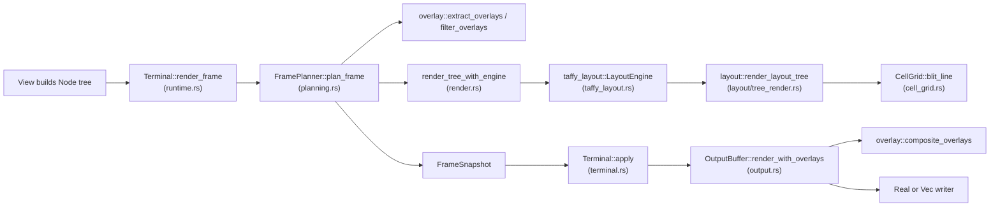

# Oil Renderer

`crucible-oil` is a small, self-contained crate. It defines a declarative
`Node` tree, lays it out with the `taffy` flexbox engine, paints it into a
cell buffer, and drives a real or in-memory terminal — on the main screen
with incremental repaint, or on the alternate screen with a row diff. It has
one crate dependency inside the workspace: `crucible-core`, and only in its
dev-dependencies, for `EnvVarGuard` in color-sensitive tests. Everything else
it imports is external (`crossterm`, `taffy`, `textwrap`, `html_parser`,
`unicode-width`, `unicode-segmentation`, `thiserror`, `tracing`, optional
`serde`, optional `proptest`).

## Purpose and ownership

The root `AGENTS.md` ownership table names `crucible-oil` as the owner of
"Terminal rendering primitives." This subsystem owns:

- The `Node` declarative UI vocabulary (`crates/crucible-oil/src/node.rs`)
  and its value types (`crates/crucible-oil/src/style.rs`).
- Layout: converting a `Node` tree to a Taffy flexbox tree and back to an
  absolute-position `LayoutTree`
  (`crates/crucible-oil/src/taffy_layout.rs`, `crates/crucible-oil/src/layout/`).
- Painting: turning a `LayoutTree` into ANSI text through a cell buffer
  (`crates/crucible-oil/src/layout/tree_render.rs`,
  `crates/crucible-oil/src/cell_grid.rs`).
- The single unified render entry point that graduation (scrollback),
  overlays, and the live viewport all share
  (`crates/crucible-oil/src/render.rs`, `crates/crucible-oil/src/planning.rs`).
- The terminal driver: raw mode, cursor placement, and two presentation
  modes — incremental main-screen repaint with scrollback-safe resize, and a
  row-diffed alternate screen for full-screen frames
  (`crates/crucible-oil/src/terminal.rs`, `crates/crucible-oil/src/output.rs`,
  `crates/crucible-oil/src/screen.rs`).
- Small stateless helpers this whole pipeline shares: ANSI parsing
  (`crates/crucible-oil/src/ansi.rs`), string truncation
  (`crates/crucible-oil/src/utils.rs`), line clamping
  (`crates/crucible-oil/src/viewport.rs`), and a keyboard-focus registry
  (`crates/crucible-oil/src/focus.rs`).
- One markup front end that terminates in `Node`: an HTML subset
  (`crates/crucible-oil/src/template/html.rs`), which the Luau plugin host
  uses for `cru.oil.markup(...)`. The Luau host builds most UI through
  direct Node-builder function bindings (`cru.oil.text`, `cru.oil.col`, and
  so on) instead. `parse_color` in the same file is the color parser of both
  the HTML subset and the `cru.oil` bindings.

What this subsystem must not own: it holds no session state, no client
input handling, and no daemon RPC. `AGENTS.md` assigns "Input,
presentation, client-local state" to `crucible-cli`/`crucible-web`, so
`crucible-oil` renders whatever `Node` tree a caller builds and never
constructs one from session or daemon data on its own. It matches that
split: the crate's cross-crate dependency count in `/tmp/crucible-arch/deps.md`
is one row, `oil src core::test_support 3` — `crucible-oil` never imports
`crucible-cli`, `crucible-daemon`, or `crucible-lua`; the dependency runs the
other way. `crucible-cli`'s TUI (`tui/oil/`) is the crate's sole production
consumer; `crucible-lua`'s `oil.rs` module (host API, see [[Luau APIs]]) is
the crate's plugin-facing consumer, mainly through direct `Node`-builder
functions plus `template/html.rs` for embedded markup strings.

## Module map

### Crate root

| Path | Lines | Role |
| --- | --- | --- |
| `crates/crucible-oil/src/lib.rs` | 84 | Module declarations, the crate's public re-export surface, and the `is_default` helper backing the "Lean-JSON" serde contract (default-valued fields are omitted, not written as `null`). |

### Core vocabulary and value types

| Path | Lines | Role |
| --- | --- | --- |
| `crates/crucible-oil/src/node.rs` | 1011 | Defines `Node` (Text, Box, Input, Spinner, Popup, Fragment, Slot, Overlay, Action, Raw, Rows) and its builder functions, including `TextRole`/`WrapJoin` for selection-aware text and `rows()`/`RowsNode` for reusing an earlier render's output. The crate's central data model. |
| `crates/crucible-oil/src/popup_node.rs` | 126 | `PopupNode`/`PopupItemNode` and their builders, split out of `node.rs`. |
| `crates/crucible-oil/src/style.rs` | 914 | `Style`, `Color`, `AdaptiveColor`, `Padding`, `Border`/`BorderChars`, `JustifyContent`, `AlignItems`, `Gap` — the crate's visual vocabulary, plus crossterm and raw ANSI SGR conversions. |
| `crates/crucible-oil/src/focus.rs` | 299 | `FocusContext`/`FocusId` — an independent keyboard-focus cycling registry for TUI widgets. |

### ANSI and cell-level primitives

| Path | Lines | Role |
| --- | --- | --- |
| `crates/crucible-oil/src/ansi.rs` | 561 | ANSI escape-sequence utilities: stripping, visible-width measurement, style-aware wrapping, background-color extraction. |
| `crates/crucible-oil/src/cell_grid.rs` | 805 | `CellGrid`/`StyledCell`/`RowText` — the 2D styled-grapheme buffer (one grapheme cluster per cell, continuation cells for wide graphemes) that ANSI-aware lines are blitted into. A row is lazy: it keeps a `verbatim` reference to a previously rendered string until something draws into it, then materializes cells. It backs the native diffing path (`to_string_compact`, `rows_compact`) and the full-screen row-diff path (`row_ansi`, `invert`, `text`, `copy_row_from`, `overlay_row_from`). |
| `crates/crucible-oil/src/utils.rs` | 300 | Width- and character-based string truncation, a re-export of the `ansi` helpers most other modules use, and `wrap_gaps`, which recovers the source text a wrap dropped between two wrapped lines, for full-screen selection and copy. |
| `crates/crucible-oil/src/viewport.rs` | 140 | Pure line-buffer helpers: clamp to a viewport height (top- or bottom-anchored), pad to a minimum height. |

### Layout

| Path | Lines | Role |
| --- | --- | --- |
| `crates/crucible-oil/src/taffy_layout.rs` | 897 | `LayoutEngine` — lowers a `Node`/`BoxNode` tree into a `taffy` flexbox tree, runs layout, and projects the result into `LayoutTree`. Sizes and projects `Node::Rows` as a leaf of full width and one row per string, and copies each text's `TextRole` onto `LayoutBox::role`. |
| `crates/crucible-oil/src/layout/mod.rs` | 27 | Module root for `layout/`; declares submodules, re-exports `LayoutTree`/`LayoutBox`/`LayoutContent` and the three tree-painting entry points (`render_layout_tree`, `render_layout_tree_rows`, `render_layout_tree_to_grid`), defines `Rect`. |
| `crates/crucible-oil/src/layout/types.rs` | 271 | `LayoutTree`/`LayoutBox`/`LayoutContent` — the render-time IR that mirrors `Node` but drops layout-only fields (`Size`, `Direction`). `LayoutBox` carries a `role: TextRole`; `LayoutContent` has a `Rows { rows }` variant for a kept-rows leaf. |
| `crates/crucible-oil/src/layout/tree_render.rs` | 935 | `render_layout_tree`, `render_layout_tree_to_grid`, `render_layout_tree_rows` — walk a `LayoutTree` and paint it into a `CellGrid`, then serialize to an ANSI string, a cell grid, or per-row strings plus `RowText`. The pipeline's final rendering stage. |
| `crates/crucible-oil/src/layout/query.rs` | 345 | Read-only `LayoutTree` queries: `content_text`, `find_by_key` — used by tests and debugging. `content_text` reads a `LayoutContent::Rows` leaf's joined text too. |
| `crates/crucible-oil/src/layout/debug.rs` | 467 | `LayoutTree::debug_print` — an ASCII-art tree dump for debugging layout without a full render. Prints a `LayoutContent::Rows` leaf as its row count. |

### Unified render path

| Path | Lines | Role |
| --- | --- | --- |
| `crates/crucible-oil/src/render.rs` | 715 | Four public entry points into the Taffy layout pipeline: `render_tree` (ANSI string plus cursor, shared by the viewport, graduation, and overlay paths), `render_to_rows` (one string per row, for a caller that keeps rendered content across frames), `render_to_text_rows` (rows plus each row's `RowText`, for full-screen selection), and `render_tree_to_grid` (a `CellGrid` plus cursor, for the full-screen presenter). |
| `crates/crucible-oil/src/render_helpers.rs` | 177 | `pub(crate)` text-formatting helpers (wrap-and-pad, spinner frame selection, popup item line format) shared by the render paths. The wrap-and-pad helper returns a `WrappedText{lines, gaps}` pair; `gaps` carries the source text a wrap dropped between two rows. |
| `crates/crucible-oil/src/planning.rs` | 354 | `FramePlanner` — orchestrates one frame: strips overlays from the tree, renders viewport, overlays, and graduation through `render_tree`, returns a `FrameSnapshot`. |
| `crates/crucible-oil/src/overlay.rs` | 324 | `Overlay`/`OverlayAnchor` and `composite_overlays` — merges floating overlay content onto base lines at a screen anchor. |

### Terminal driver

| Path | Lines | Role |
| --- | --- | --- |
| `crates/crucible-oil/src/terminal.rs` | 759 | `Terminal<W>` — the real (and headless) terminal driver: raw mode, cursor tracking, and either applying a `FrameSnapshot` to a `Write` sink (`ScreenMode::Inline`) or presenting a `CellGrid` through a row diff on the alternate screen (`ScreenMode::Fullscreen`, via `ScreenDiff` in `crates/crucible-oil/src/screen.rs`). Owns alternate-screen entry/exit and mouse-capture toggling. |
| `crates/crucible-oil/src/output.rs` | 647 | `OutputBuffer<W>` — incremental terminal-diffing writer; repaints only changed rows, enforces a scrollback cap, composites overlays. |
| `crates/crucible-oil/src/screen.rs` | 230 | `ScreenDiff` — a row-level diff writer for the full-screen (alternate-screen) mode: writes only the rows that changed since the last frame, in one synchronized update, and never clears the screen. `ENABLE_MOUSE_CAPTURE`/`DISABLE_MOUSE_CAPTURE` — the SGR mouse-reporting sequences the full-screen mode turns on and off (buttons plus drag motion, not every pointer move). |
| `crates/crucible-oil/src/runtime.rs` | 266 | `FrameRenderer` trait, implemented by `Terminal<W>`; `TestRuntime`, a test-only wrapper that exercises the real `Terminal` path. |

### Components

| Path | Lines | Role |
| --- | --- | --- |
| `crates/crucible-oil/src/components/mod.rs` | 7 | Re-export shim for `drawer`, `input_area`, `popup`. |
| `crates/crucible-oil/src/components/drawer.rs` | 257 | `Drawer`/`DrawerKind` — a bordered, footer-badged panel listing label/content rows (for example a messages log). |
| `crates/crucible-oil/src/components/input_area.rs` | 1 | `INPUT_MAX_CONTENT_LINES` — the canonical cap on visible chat-input lines before scrolling. |
| `crates/crucible-oil/src/components/popup.rs` | 286 | `PopupOverlay` — a stateful selection-list widget (command palette, autocomplete) that composes a `Node::Popup` as a bottom-anchored overlay. |

### Test-only generators

| Path | Lines | Role |
| --- | --- | --- |
| `crates/crucible-oil/src/proptest_strategies.rs` | 303 | Shared `proptest` generators (`arb_node`, `arb_op`, `arb_operation_sequence`, and so on) for property tests across the crate. Gated `#[cfg(any(test, feature = "test-utils"))]`. |

### Templates (plugin UI authoring)

| Path | Lines | Role |
| --- | --- | --- |
| `crates/crucible-oil/src/template/mod.rs` | 3 | Re-export shim for `html`. |
| `crates/crucible-oil/src/template/html.rs` | 421 | `html_to_node` — converts a small HTML subset into a `Node` tree. |

## Key types and traits

- **`Node`** (`crates/crucible-oil/src/node.rs`) is the hub type: every
  renderer, layout stage, and template front end produces or consumes it.
  Its variants are `Empty`, `Text(TextNode)`, `Box(BoxNode)`, `Input(InputNode)`,
  `Spinner(SpinnerNode)`, `Popup(PopupNode)`, `Fragment(Vec<Node>)`,
  `Slot { name, children }`, `Overlay(OverlayNode)`, `Action(ActionNode)`,
  `Raw(RawNode)`, `Rows(RowsNode)`. Callers build it with the module's free
  functions (`text`, `col`, `row`, `text_input`, `spinner`, `popup`,
  `overlay_from_bottom`, `action`, `raw`, `badge`, `rows`, and more), or
  through `template/html.rs` for HTML plugin markup. `crucible-cli`'s TUI
  views hold and consume it once per frame; `crucible-oil` itself never
  stores a `Node` across frames except inside test harnesses.
- **`RowsNode`** (`crates/crucible-oil/src/node.rs`) holds rows an earlier
  render produced (`pub rows: Arc<[String]>`), built with `crate::node::rows`.
  A caller keeps the rows of content that no longer changes and puts them
  back in a later tree, so a later frame does not lay that content out
  again. `taffy_layout.rs` sizes it as one row of height per string at full
  available width; `layout/tree_render.rs` paints each row with
  `CellGrid::put_row`, which keeps it as a string until something else
  draws over it.
- **`TextRole`/`WrapJoin`** (`crates/crucible-oil/src/node.rs`) mark what a
  `TextNode` is to a full-screen selection and copy: `Source { indent }`
  starts a line behind a gutter of `indent` columns, `Continues(WrapJoin)`
  continues the line above it and names the source text a wrap dropped
  between the two rows, `Gutter` is never source text. Only the renderer
  knows which cells are which, so `render_box` in
  `crates/crucible-oil/src/layout/tree_render.rs` reads `LayoutBox::role`
  and records the result per row as `CellGrid`'s `RowText`.
- **`BoxNode`** is `Node::Box`'s payload: `children`, `direction`
  (`Column`/`Row`), `size` (`Fixed`/`Flex`/`Content`), `padding`, `margin`,
  an optional `border`, `style`, `justify`, `align`, `gap`. It is what
  `taffy_layout.rs` lowers into a Taffy node.
- **`ActionNode`** wraps a child with an `action` name and a `BTreeMap`
  of string params — the one variant that carries a cross-target (web)
  activation hook, since a terminal frame has no side channel a `FocusContext`
  can register into but a browser DOM node does.
- **`LayoutEngine`** (`crates/crucible-oil/src/taffy_layout.rs`) owns a
  `taffy::TaffyTree` and is the layout session: `compute_layout_tree` clears
  it, lowers `Node` into Taffy node IDs, runs `taffy::compute_layout`, and
  projects the result into a `LayoutTree`. `FramePlanner` holds one
  `LayoutEngine` and reuses it across frames so the Taffy node pool is not
  rebuilt every frame.
- **`LayoutTree`/`LayoutBox`/`LayoutContent`** (`crates/crucible-oil/src/layout/types.rs`)
  are the render-time IR: `LayoutBox` carries an absolute `Rect`, a
  `LayoutContent` (a `Node`-shaped enum without layout-only fields, plus a
  `Rows { rows }` variant for a kept-rows leaf), children, style, a `role:
  TextRole`, and an optional debug `key`. `layout/tree_render.rs` is its
  sole painter, through three entry points (see `render.rs` below);
  `layout/query.rs` and `layout/debug.rs` are read-only consumers, mostly
  for tests.
- **`CellGrid`/`StyledCell`/`RowText`** (`crates/crucible-oil/src/cell_grid.rs`)
  is the 2D styled-grapheme buffer every render pass blits lines into, one
  grapheme cluster per cell (a `StyledCell`'s optional `tail` holds the rest
  of a multi-code-point grapheme; `is_continuation()` marks a cell a wide
  grapheme to its left covers). A row is lazy: it keeps a `verbatim`
  reference to a `RowsNode`'s string until something draws into it, so
  copying a kept row costs nothing until it changes. It serializes to a
  compact ANSI string (`to_string_compact`, `rows_compact`) for the inline
  path, or exposes cells directly (`row`, `row_ansi`, `invert`, `text`,
  `grapheme_span`) for the full-screen path's row diff and selection. It is
  created fresh per render call inside `layout/tree_render.rs`; nothing
  holds one across frames except `Terminal<W>`'s `ScreenDiff`, which keeps
  the previous frame's rendered rows, not a `CellGrid`.
- **`FramePlanner`/`FrameSnapshot`/`FramePlan`/`Graduation`/`RenderedOverlay`**
  (`crates/crucible-oil/src/planning.rs`) are the per-frame orchestration
  types. `FramePlanner` is created once by `Terminal<W>` and called once per
  frame (`plan_frame`); `FrameSnapshot` is the immutable output a `Terminal`
  then applies.
- **`Terminal<W: Write = Stdout>`** (`crates/crucible-oil/src/terminal.rs`)
  is the driver: it owns an `OutputBuffer<W>`, a `FramePlanner`, a
  `ScreenDiff`, and its current `ScreenMode` and mouse-capture state. It is
  created and held by `crucible-cli`'s TUI event loop
  (`crates/crucible-cli/src/tui/oil/mod.rs`,
  `crates/crucible-cli/src/tui/oil/chat_runner/mod.rs`) for the whole process
  lifetime of a chat session. `ScreenMode` (`Inline`, the default, or
  `Fullscreen { mouse_capture }`) picks which of two drivers `Terminal`
  presents through: `enter`/`exit` switch to and from the alternate screen
  and toggle mouse reporting for `Fullscreen`; `handle_resize` skips the
  inline mode's scrollback purge and just invalidates the row diff;
  `sync_size` catches a size change that arrives before its resize event, so
  a full-screen frame is never built at a stale width.
- **`OutputBuffer<W>`** (`crates/crucible-oil/src/output.rs`) owns the actual
  writer and a `PreviousFrame` (the diffing state); it is the sole owner of
  "what is currently on screen" for `ScreenMode::Inline`.
- **`ScreenDiff`** (`crates/crucible-oil/src/screen.rs`) is `ScreenMode::Fullscreen`'s
  counterpart to `OutputBuffer`: it keeps the last frame's rows as rendered
  ANSI strings and, on `present`, writes only the rows that differ from a
  `CellGrid`, each addressed by its own cursor move, inside one DEC
  synchronized update, and never clears the screen. `Terminal::present`
  delegates to it; `invalidate()` forces the next frame to rewrite every row.
- **`FrameRenderer`** (`crates/crucible-oil/src/runtime.rs`) is the trait
  `Terminal<W>` implements (`render_frame`, `force_full_redraw`,
  `set_min_viewport_rows`, `size`) so the CLI's event loop can drive either a
  real terminal or, in tests, `TestRuntime` (a thin wrapper over
  `Terminal<Vec<u8>>`) through the same interface.
- **`Style`/`Color`** (`crates/crucible-oil/src/style.rs`) are the visual
  vocabulary every node carries; `Color` is the type with the crate's most
  heavily commented invariant (see Boundaries below).

## Flows

### Building and rendering one frame (inline mode)

This is the `ScreenMode::Inline` path: the terminal owns the scroll and the
transcript lives in its own scrollback. See "Full-screen presentation" below
for `ScreenMode::Fullscreen`, the alternate-screen path.

1. A view (in `crucible-cli`'s `tui/oil/`, or plugin Lua via direct
   `Node`-builder bindings or `template/html.rs`) builds a `Node` tree.
2. `Terminal::render_frame` (via the `FrameRenderer` trait,
   `crates/crucible-oil/src/runtime.rs`) calls its `FramePlanner::plan_frame`
   (`crates/crucible-oil/src/planning.rs`).
3. `plan_frame` extracts overlay nodes with `extract_overlays` and strips
   them from the main tree with `filter_overlays`
   (`crates/crucible-oil/src/overlay.rs`), renders the main tree through
   `render_tree_with_engine` (`crates/crucible-oil/src/render.rs`), renders
   each overlay separately, and renders any graduated (scrolled-off) node —
   all through the same `render_tree` path so viewport and scrollback stay
   byte-identical for the same tree and dimensions.
4. `render_tree_with_engine` calls `taffy_layout::build_layout_tree_with_engine`
   (`crates/crucible-oil/src/taffy_layout.rs`) to get a `LayoutTree`, then
   `layout::render_layout_tree` (`crates/crucible-oil/src/layout/tree_render.rs`)
   to paint it into a `CellGrid` (`crates/crucible-oil/src/cell_grid.rs`) and
   serialize it to an ANSI string plus `CursorInfo`.
5. `plan_frame` returns a `FrameSnapshot`. `Terminal::apply`
   (`crates/crucible-oil/src/terminal.rs`) normalizes the cursor to the
   viewport bottom, writes any graduated content to real scrollback, then
   calls `OutputBuffer::render_with_overlays`
   (`crates/crucible-oil/src/output.rs`), which diffs against the previous
   frame and writes only the changed rows, wrapped in a DEC
   synchronized-update block so partial frames never flash.
6. `Terminal::apply` repositions the cursor via `position_cursor`.

### Keeping rendered rows across frames

A caller that draws the same content every frame (a finished transcript
message, for example) can render it once and keep the rows instead of
laying it out again each frame.

1. The caller calls `render_to_rows(node, width)` or `render_to_text_rows(node,
   width)` (`crates/crucible-oil/src/render.rs`), which lays `node` out as
   a column child and paints it, returning one string per row (plus each
   row's `RowText` for `render_to_text_rows`).
2. The caller keeps the `Vec<String>` (typically as an `Arc<[String]>`) and,
   in a later frame, puts it back into the tree with `crate::node::rows(...)`,
   which builds a `Node::Rows(RowsNode)`.
3. `taffy_layout.rs` sizes a `Node::Rows` leaf at the full available width
   and one row of height per string, and projects it to a
   `LayoutContent::Rows { rows }` leaf.
4. `render_box`'s `Rows` arm, in
   `crates/crucible-oil/src/layout/tree_render.rs`, calls `grid.put_row` for
   each row, which keeps it as a `verbatim` reference in the `CellGrid`
   (`crates/crucible-oil/src/cell_grid.rs`) rather than materializing cells,
   as long as nothing else draws over that row.
5. The row reaches the output unchanged: `to_string_compact`/`rows_compact`
   read the verbatim string directly, and the full-screen grid path
   (`render_tree_to_grid`) calls `grid.draw_verbatim_rows()` once, right
   before presenting, to materialize every kept row's cells.

### Plugin markup to Node

A Luau plugin builds most UI by calling `cru.oil.*` functions
(`crucible-lua/src/oil.rs`, see [[Luau APIs]]) that construct a `Node`
directly with this crate's builder functions (`text`, `col`, `row`, and so
on). For an embedded HTML string, `cru.oil.markup` calls `html_to_node`
(`crates/crucible-oil/src/template/html.rs`). Either way the result is a
plain `Node`, so the rest of the pipeline (layout, render, terminal or, on
the web side, JSON serialization) treats plugin-built and Rust-built trees
identically.

### Full-screen presentation

`ScreenMode::Fullscreen` swaps `OutputBuffer`'s incremental repaint for a
row diff on the alternate screen, so the app owns every row, the scroll,
and selection.

1. `Terminal::sync_size` runs before each frame, to catch a size change that
   has no resize event yet; if the size changed it calls `handle_resize`,
   which invalidates the row diff for a full-screen terminal.
2. The view builds a `Node` tree, as in the inline flow.
3. `render_tree_to_grid(node, width, height)` (`crates/crucible-oil/src/render.rs`)
   calls `taffy_layout::build_layout_tree_with_engine` for a `LayoutTree`,
   then `layout::render_layout_tree_to_grid`
   (`crates/crucible-oil/src/layout/tree_render.rs`) to paint a `CellGrid`
   and find the cursor cell, then `grid.draw_verbatim_rows()` to materialize
   any kept rows, and returns a `GridRender { grid, cursor }`.
4. A view that supports selection calls `CellGrid::invert` over the
   selected column range of each selected row before presenting, and reads
   `CellGrid::text`/`grapheme_span` to build a copy from the source text a
   selection covers (using each row's `RowText` to skip its gutter and
   rejoin a wrap's dropped source text).
5. `Terminal::present(grid, cursor)` delegates to `self.screen.present`
   (`ScreenDiff::present` in `crates/crucible-oil/src/screen.rs`), which computes
   `grid.row_ansi(y)` per row, compares it against the last frame's rows,
   and writes only the changed rows — each addressed by its own cursor move
   and ending with an erase to the end of the line — inside one DEC
   synchronized update. An unchanged frame with an unchanged cursor writes
   nothing.
6. `Terminal::print_to_main_screen` is the escape hatch out of this mode: it
   leaves the alternate screen, writes lines to the main screen's own
   scrollback, re-enters the alternate screen, and invalidates `ScreenDiff`
   since the alternate screen may not keep its content across the switch.

### Resize

`Terminal::handle_resize` re-reads terminal size. For `ScreenMode::Inline`,
a width change forces a full scrollback purge and transcript replay,
because "no escape sequence can rewrap a row the terminal already owns." A
height-only change is lighter unless the process detects a mobile
on-screen keyboard shell (Termux, iSH, via `mobile_keyboard_shell`), where
a rebuild would otherwise replay the whole transcript every time the
keyboard toggles. For `ScreenMode::Fullscreen`, `handle_resize` skips the
purge and replay entirely: the alternate screen has no scrollback to
preserve, so it only calls `self.screen.invalidate()` and returns, and the
next frame's row diff rewrites every row at the new width.

## State, concurrency and lifecycle

- No async runtime and no locking anywhere in this crate. Every render pass
  is a synchronous, single-threaded call from the CLI's event loop.
- `FramePlanner` holds the only cross-frame mutable state inside the layout
  path: one `LayoutEngine`, cleared and reused each `plan_frame` call to
  avoid reallocating Taffy's tree.
- `OutputBuffer` holds the only cross-frame mutable state inside the output
  path: `previous: Option<PreviousFrame>`, collapsed into a single `Option`
  "so inconsistent state is unrepresentable" (its own doc comment).
  `force_next_redraw` and the scrollback caps (`max_transcript_rows`,
  `min_frame_rows`) are set once at construction or resize, not per frame.
- `Terminal<W>` is the process-lifetime owner of `OutputBuffer` and
  `FramePlanner`, plus, for the full-screen mode, a `ScreenDiff` and the
  current `ScreenMode`/`mouse_captured` state — none of which existed
  before this mode. It is constructed once by the CLI's TUI startup and
  lives until `Terminal::exit` is called at shutdown, which reverses
  `enter` (`cleanup_viewport` for the inline mode, restore cursor shape,
  show cursor, disable raw mode, and, for the full-screen mode, turn off
  mouse capture and leave the alternate screen, flush a trailing newline).
- `ScreenDiff` holds the only cross-frame mutable state inside the
  full-screen presentation path: the last frame's rows as rendered ANSI
  strings, its cursor, and a `valid` flag that `invalidate()` clears to
  force the next frame to rewrite every row.
- `mobile_keyboard_shell` caches its OS-detection result process-wide in a
  `static OnceLock`, the crate's only global state.
- `FocusContext` (`crates/crucible-oil/src/focus.rs`) is a plain struct with
  no shared-state wrapper; whatever view owns it (the CLI's chat app state)
  is responsible for its lifetime — `crucible-oil` does not hold one itself.
- Test-only state: `TestRuntime` (`crates/crucible-oil/src/runtime.rs`) wraps
  a `Terminal<Vec<u8>>` and an accumulating `stdout_buffer` string so tests
  can assert scrollback across frames without re-deriving it; it is gated
  `#[cfg(any(test, feature = "test-utils"))]` and is never built into the
  production binary.

## Boundaries and invariants

- **`render_tree` is the one ANSI-string render path.** `render_tree` in
  `crates/crucible-oil/src/render.rs` is the one place a `Node` becomes an
  ANSI string; `planning.rs` uses it for the viewport, overlays, and
  graduation alike, and a test
  (`graduation_and_viewport_emit_byte_identical_output_for_same_tree`) pins
  that the two paths stay byte-identical. `render_tree_to_grid`
  (`crates/crucible-oil/src/render.rs`) is a deliberate second path that
  shares the same `LayoutEngine`/`build_layout_tree_with_engine` call and
  the same `layout::render_box` walk, but returns a `CellGrid` instead of a
  string, for the full-screen mode, which needs cells to invert and diff.
- **Height is a hint, not a clip.** `render_tree`'s `height` parameter is a
  Taffy available-space hint; clipping to the visible screen is
  `OutputBuffer`'s job, not the renderer's — pinned by
  `render_tree_height_is_taffy_hint_not_hard_clip`.
- **Background-inheritance in `CellGrid`.** `put_grapheme`, the free
  function `blit_line` delegates to via `blit_into`, in
  `crates/crucible-oil/src/cell_grid.rs`: a cell write that sets no
  background inherits whatever background is already in that cell (by cell
  state, not by tree ancestry). The rule is documented as relying on
  Crucible's convention of non-overlapping siblings, and is pinned by
  `fg_only_write_inherits_prior_bg_from_cell`.
- **ANSI parsing has documented, unresolved divergences.**
  `skip_until_st_or_bel` in `crates/crucible-oil/src/ansi.rs` skips an
  unterminated OSC/APC/DCS run unbounded; `consume_escape` (called from
  `blit_into`) in `crates/crucible-oil/src/cell_grid.rs` bounds its
  parallel skip at 256 characters. Both files cross-reference each other
  and name a "Stage B (render path unification)" convergence that has not
  happened. A third, simpler CSI-only parser, `parse_line_to_cells` in
  `crates/crucible-oil/src/overlay.rs`, is independent of both and, unlike
  `blit_into`/`blit_text`/`put_grapheme`, is not grapheme-aware: it still
  writes one `char` per cell, so it also diverges from the other two on
  ZWJ sequences and combining marks.
- **Color encoding is table-driven, not name-mapped.** `style.rs::Color`
  documents and tests a specific regression: crossterm's own named colors are
  shifted from ANSI convention, so `to_crossterm`/`to_ansi_fg`/`to_ansi_bg`
  remap by palette slot, not by color name, pinned by
  `named_colors_render_to_the_palette_slot_they_name` and
  `gray_and_dark_gray_follow_the_terminal_palette`.
- **Repaint floor is a degradation, not a repair.** `OutputBuffer` clamps a
  repaint's start row to `first_addressable_line` (the oldest row still on
  screen) and logs a `tracing::warn!` if a caller's diff wanted to rewrite an
  off-screen row; only appending strictly above the visible tail avoids the
  warning, per `a_change_above_the_visible_window_still_leaves_the_screen_correct`.
- **`min_frame_rows` keeps overlays from growing the frame.** A bottom-anchored
  overlay taller than the content draws over the rows above the prompt
  instead of pushing the prompt down, per
  `an_overlay_taller_than_the_content_does_not_grow_a_reserved_frame`.
- **The serialized `Node` shape is a wire contract.** `lib.rs`'s "Lean-JSON"
  rule (default-valued fields omitted via one shared `is_default` helper) is
  consumed by the web UI's node renderer; `crates/crucible-oil/tests/wire_shape.rs`
  and `crates/crucible-oil/tests/serialize_json.rs` pin the externally-tagged,
  snake_case shape as a cross-language contract, not a debug aid. See
  [[Web Windowing]] for the browser-side consumer.
- **Cursor math assumes viewport-bottom.** `Terminal::apply` normalizes the
  cursor to the viewport bottom before anything else, so `clear()` and
  `render_with_overlays()` can assume that invariant; `position_cursor`'s own
  comment states it directly.
- **The full-screen mode never clears the screen.** `ScreenDiff::present`
  (`crates/crucible-oil/src/screen.rs`) only ever rewrites rows that
  changed, each ending with an erase to the end of the line; it never emits
  a full-screen clear, pinned by
  `every_frame_is_one_synchronized_update_without_a_screen_clear`. Mouse
  reporting for this mode is a hand-rolled SGR sequence
  (`ENABLE_MOUSE_CAPTURE`/`DISABLE_MOUSE_CAPTURE`, buttons plus drag motion:
  1000, 1002, 1006), not crossterm's `EnableMouseCapture`, because
  crossterm's helper also turns on 1003 (every pointer move), which would
  flood the event loop.

## Extension seams

- **A new `Node` variant** lands in `crates/crucible-oil/src/node.rs`
  (the enum, a builder function, and matching arms in
  `crates/crucible-oil/src/taffy_layout.rs`,
  `crates/crucible-oil/src/layout/types.rs`,
  `crates/crucible-oil/src/layout/tree_render.rs`,
  `crates/crucible-oil/src/layout/debug.rs`, and
  `crates/crucible-oil/src/layout/query.rs`) plus, if plugin-facing, a
  tag in `crates/crucible-oil/src/template/html.rs`. `Node::Rows` is the
  seam's own most recent instance: it added an arm in every file this bullet
  names except the template front end, since a kept-rows leaf is a
  rendering optimization, not something a plugin author writes directly.
- **A new overlay anchor** extends `OverlayAnchor` in
  `crates/crucible-oil/src/overlay.rs` (today it has one variant,
  `FromBottom`) and the compositing arm in `composite_overlays`.
  `crates/crucible-oil/src/components/popup.rs` is the current sole overlay
  consumer to check when adding one.
- **A new component** (a bordered panel, a list widget) lands beside
  `crates/crucible-oil/src/components/drawer.rs` and
  `crates/crucible-oil/src/components/popup.rs`, re-exported from
  `crates/crucible-oil/src/components/mod.rs`; the CLI wraps it with its own
  `Component` trait adapter (see [[TUI Components]]) rather than
  `crucible-oil` implementing that trait itself.
- **A new template tag** lands in
  `crates/crucible-oil/src/template/html.rs`'s `element_to_node`.
- **A new color or border style** lands in
  `crates/crucible-oil/src/style.rs`; a border must also add its char set to
  `BorderChars` and its per-edge existence check, since only edges that exist
  consume a cell.

## Tests

- `crates/crucible-oil/tests/layout_render_properties.rs` — consolidated
  property tests for layout, overlay compositing, and rendering (each former
  file kept as its own `mod` block so regression seeds still key on the same
  test names).
- `crates/crucible-oil/tests/row_layout_tests.rs` — pins the `Size` contract
  for row layouts: a Content-sized child shrinks to its natural width, a
  Flex sibling fills the rest, and overflow degrades by shrinking and
  ellipsizing rather than pushing siblings off-grid.
- `crates/crucible-oil/tests/ansi_properties.rs` — property tests over ANSI
  parsing, including one case built on the shared `arb_style` generator in
  `crates/crucible-oil/src/proptest_strategies.rs`.
- `crates/crucible-oil/tests/cursor_properties.rs` — property tests over
  cursor math; its own inline `proptest` strategies, not the shared
  generators in `proptest_strategies.rs`.
- `crates/crucible-oil/tests/style_wrap_tests.rs` — integration tests
  targeting a specific bug class: ANSI style codes lost or misapplied when
  styled text wraps across lines.
- `crates/crucible-oil/tests/sequencing_proofs.rs` — a "Stage C" harness that
  drives `FramePlanner`/`Terminal`/`OutputBuffer` through arbitrary operation
  sequences (`arb_operation_sequence`) and asserts crate-level invariants
  (monotonic scrollback, render idempotence, determinism, and — per its
  phasing comment — width-stable graduation, no double-paint, ANSI run
  integrity, overlay non-interference, cursor restored after
  `cleanup_viewport`) hold across every frame, independent of which caller
  built the tree.
- `crates/crucible-oil/tests/graduation_properties.rs` — property tests that
  graduated content never contains spinner characters and that sync-update
  markers stay balanced.
- `crates/crucible-oil/tests/wire_shape.rs`,
  `crates/crucible-oil/tests/serialize_json.rs` — pin the serialized `Node`
  JSON shape as a cross-language contract for the web renderer.
- `crates/crucible-oil/tests/standalone_integration.rs` — a small
  integration smoke test independent of the property suites.
- Per-module `#[cfg(test)]` unit tests inside almost every file listed above
  (`ansi.rs`, `cell_grid.rs`, `render.rs`, `screen.rs`, `style.rs`,
  `taffy_layout.rs`, `terminal.rs`, `utils.rs`, `viewport.rs`, `layout/*.rs`,
  `runtime.rs`) cover the specific invariants named in Boundaries above.
  `cell_grid.rs` adds five grapheme tests (a ZWJ emoji keeps every code
  point across two cells, a CJK character takes two cells, a combining
  mark stays with its base, `text()` from inside a wide grapheme returns
  the whole grapheme, `invert` widens to a wide lead) alongside the
  pre-existing background-inheritance test. `screen.rs` adds eight tests
  of `ScreenDiff::present`'s output (first frame writes every row, only
  the changed row is rewritten, an unchanged frame writes nothing, a
  cursor-only move writes no row body, a shorter row erases its old tail,
  a full-width row omits the trailing erase, every frame is one
  synchronized update with no screen clear, `invalidate()` forces a full
  rewrite); two of the eight replay the written bytes through a
  `vt100::Parser` to check the real terminal result. `render.rs` adds a
  test, `kept_rows_render_the_same_frame_as_their_node`, that checks
  ten node shapes and confirms a `rows()` node renders byte-identically
  to the node it came from.
- Gaps: `crates/crucible-oil/tests/graduation_tests.rs` and
  `crates/crucible-oil/tests/graduation_invariant_tests.rs` are both empty
  stub files whose only content is a comment stating graduation logic moved
  to `crucible-cli` (the app layer). That move did happen for
  `graduation_tests.rs`: `crates/crucible-cli/src/tui/oil/tests/graduation_tests.rs`
  is a real, populated test file under the same name. No
  `graduation_invariant_tests.rs` exists at the `crucible-cli` layer under
  that name, though `crates/crucible-cli/src/tui/oil/tests/inter_frame_invariant_tests.rs`
  covers related inter-frame invariants. `crates/crucible-oil/src/layout/debug.rs`'s
  `debug_print` and `crates/crucible-oil/src/layout/query.rs`'s
  `content_text`/`find_by_key` have no non-test caller found by grep inside
  this crate; `crates/crucible-cli/src/tui/oil/tests/layout_test_helpers.rs`
  does consume all three from `crucible-cli`'s own test suite.

## Findings

- `crates/crucible-cli/src/tui/oil/chat_app/mod.rs` declares its own
  `pub const INPUT_MAX_CONTENT_LINES: usize = 3;`, shadowing the canonical
  constant this crate defines in
  `crates/crucible-oil/src/components/input_area.rs`. Grep finds no importer
  of the `chat_app` copy anywhere in `crucible-cli`; the actual consumer,
  `crates/crucible-cli/src/tui/oil/components/input_component.rs`, imports
  the canonical one via `crates/crucible-cli/src/tui/oil/components/mod.rs`'s
  `pub use crucible_oil::INPUT_MAX_CONTENT_LINES;`. The `chat_app` copy looks
  like dead code left over from before the crate split, and its existence
  is itself a small duplication `AGENTS.md`'s "Prefer derives, conversions,
  `?` and small shared helpers over repeated plumbing" guidance would flag.
- `crates/crucible-oil/src/layout/tree_render.rs` carries a doc comment on
  its `borderless_box_with_bg_fills_rect` test that reads "Today the renderer
  ignores `style` when there's no border — that's the bug." The surrounding
  `render_box_content` code fills the background for a borderless box
  whenever `style.bg.is_some()`, so the comment describes a bug the code has
  already fixed; it is a stale description, not a live defect.
- `parse_line_to_cells` in `crates/crucible-oil/src/overlay.rs` reimplements a
  simpler, CSI-only version of the ANSI-run parsing that `blit_line` (via
  `blit_into`) in `crates/crucible-oil/src/cell_grid.rs` already does (no
  OSC/APC/DCS handling). It is not named in either file's own "Stage B"
  convergence note, but it is a third ANSI-run parser in a crate that already
  documents two others as pending unification. It also stayed on the old
  one-`char`-per-cell model when `blit_into`/`blit_text`/`put_grapheme`
  moved to one grapheme cluster per cell, so it now diverges from
  `cell_grid.rs` on ZWJ sequences and combining marks too — a new,
  undocumented divergence neither file's own convergence note names.
- `HtmlError::UnsupportedElement` in `crates/crucible-oil/src/template/html.rs`
  is declared but no code path in the file constructs it — dead until a
  strict-mode validation path is added. Child-node parse errors inside
  `html_to_node` are silently dropped (`.filter_map(|c| ... .ok())`) rather
  than aggregated, which can hide malformed plugin markup rather than surface
  it, in tension with `AGENTS.md`'s "every error variant a distinct handler."
- The two documented ANSI-skip-bound divergences between `ansi.rs` and
  `cell_grid.rs` (see Boundaries) and the render-path "Stage B" convergence
  they both name are unresolved as of this revision; they are intentional,
  tracked divergences, not something this page found newly broken.
