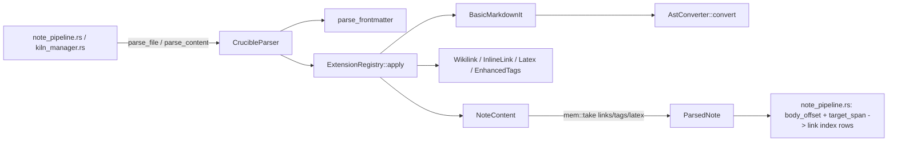

# Parser

## Purpose and ownership

The parser owns turning bytes into structured, byte-addressed note data:
`crates/crucible-core/src/parser/`. It reads one string or one file at a
time and returns a `ParsedNote`. It does not resolve links, does not know
about kilns, SQLite or other notes, and does not touch the network or a
provider. This matches AGENTS.md's ownership table, which names
`crucible-core` as the owner of "canonical domain types, config, parser" and
separates parser byte spans from "SQLite link index = resolution/backlinks/
rename" and from embeddings-based retrieval.

The parser types live under `crates/crucible-core/src/parser/types/`, the
canonical location AGENTS.md names directly ("Keep parser types canonical in
`crucible-core/src/parser/types/`... Re-export types instead of duplicating
them across crates or in Lua"). `crates/crucible-core/src/parser/mod.rs` is
the one re-export point; every other crate imports parser types through it
or through `crucible_core::parser::*`.

Three adjoining files travel with this page because they sit in the same
write path and each is a pure, filesystem-free text primitive, not a parser
extension: `crates/crucible-core/src/note_edit.rs` (anchored line edits),
`crates/crucible-core/src/note_merge.rs` (three-way line merge), and
`crates/crucible-core/src/note_frontmatter.rs` (byte-exact YAML frontmatter
split and key splice). All three are functions that a daemon write path
calls; per AGENTS.md, "Note writes and review are daemon-owned" — these
files supply the algorithm, not the write door itself. See [[Daemon Server]]
and [[Knowledge Storage and Retrieval]] for the daemon-side callers.

What the parser must not own, and does not: kiln identity, link resolution
and backlinks (owned by the SQLite link index), retrieval and embeddings, and
any write to disk. `ParsedNote` and `NoteContent` carry raw text and byte
offsets only; a `Wikilink`'s `target_span` is a byte range into the parsed
body, not a resolved link. The daemon's `NotePipeline` and `kiln_manager.rs`
convert that span to a file-absolute link-index row; the parser itself never
performs that conversion.

## Module map

| Path | Lines | Role |
| --- | --- | --- |
| `crates/crucible-core/src/parser/mod.rs` | 78 | Module root; declares submodules and re-exports the parser's public API |
| `crates/crucible-core/src/parser/implementation.rs` | 553 | `CrucibleParser`, the one parser type: file/content read, frontmatter split, extension run, `ParsedNote` assembly |
| `crates/crucible-core/src/parser/extensions.rs` | 191 | The closed `Extension` enum and `ExtensionRegistry` that runs its variants in order |
| `crates/crucible-core/src/parser/traits.rs` | 68 | `ParserCapabilities`, the descriptor of what `CrucibleParser` supports |
| `crates/crucible-core/src/parser/error.rs` | 225 | `ParserError` (fatal), `ParseError`/`ParseErrorType`/`ErrorSeverity` (non-fatal, collected) |
| `crates/crucible-core/src/parser/frontmatter_extractor.rs` | 496 | `FrontmatterExtractor`/`extract_frontmatter`: a second YAML/TOML frontmatter splitter, used by `TaskFile` |
| `crates/crucible-core/src/parser/test_utils.rs` | 94 | `parse_note`, a cfg-gated cross-crate test helper wrapping `CrucibleParser` |
| `crates/crucible-core/src/parser/basic_markdown_it.rs` | 581 | `BasicMarkdownItExtension`: markdown-it-backed extension filling `NoteContent.blocks` (feature `markdown-it-parser`) |
| `crates/crucible-core/src/parser/wikilinks.rs` | 187 | `WikilinkExtension`: `[[note]]`, `[[note\|alias]]`, `[[note#heading]]`, `![[embed]]` |
| `crates/crucible-core/src/parser/inline_links.rs` | 231 | `InlineLinkExtension`: standard `[text](url "title")` links |
| `crates/crucible-core/src/parser/latex.rs` | 287 | `LatexExtension`: `$...$` inline and `$$...$$` block LaTeX |
| `crates/crucible-core/src/parser/enhanced_tags.rs` | 184 | `EnhancedTagsExtension`: `#hashtag` extraction (task-list extraction is unimplemented, see Findings) |
| `crates/crucible-core/src/parser/markdown_it/mod.rs` | 7 | Feature-gated declaration of `converter` |
| `crates/crucible-core/src/parser/markdown_it/converter.rs` | 213 | `AstConverter`: converts a `markdown_it::Node` AST into `NoteContent.blocks` |
| `crates/crucible-core/src/parser/types/mod.rs` | 138 | Re-export aggregator for every parser type; the canonical import path |
| `crates/crucible-core/src/parser/types/parsed_note.rs` | 285 | `ParsedNote`, `ParsedNoteMetadata`, `ParsedNoteBuilder` |
| `crates/crucible-core/src/parser/types/content.rs` | 74 | `NoteContent`, the scratch structure extensions fill while parsing |
| `crates/crucible-core/src/parser/types/blocks.rs` | 146 | `BlockKind`, `Block` |
| `crates/crucible-core/src/parser/types/block_hash.rs` | 77 | `BlockHash`, the one canonical BLAKE3 content-hash newtype |
| `crates/crucible-core/src/parser/types/callout.rs` | 120 | `CalloutType` |
| `crates/crucible-core/src/parser/types/links.rs` | 229 | `Wikilink`, `Tag`, `InlineLink` |
| `crates/crucible-core/src/parser/types/latex.rs` | 29 | `LatexExpression` |
| `crates/crucible-core/src/parser/types/frontmatter.rs` | 75 | `Frontmatter`, `FrontmatterFormat` |
| `crates/crucible-core/src/parser/types/inline_metadata.rs` | 225 | `InlineMetadata`, `extract_inline_metadata`; Dataview-style `[key:: value]` |
| `crates/crucible-core/src/parser/types/lists.rs` | 110 | `CheckboxStatus` |
| `crates/crucible-core/src/parser/types/task.rs` | 1181 | `TaskItem`, `TaskFile`, `TaskGraph`, `GraphError`: `TASKS.md`-format parsing and dependency graph |
| `crates/crucible-core/src/parser/types/workflow.rs` | 802 | `WorkflowDoc`, `WorkflowStep`, `Gate`, `ValidationEntry`, `WorkflowParseWarning`: `type: workflow` note parsing, parse-only |
| `crates/crucible-core/src/parser/types/workflow/tests.rs` | 904 | Unit test suite for `workflow.rs`, loaded via `#[cfg(test)] mod tests;` |
| `crates/crucible-core/src/note_edit.rs` | 243 | `AnchoredEdit`, `EditRefusal`, `EditOutcome`, `apply_anchored_edits`, `disk_hash`: anchored line edits |
| `crates/crucible-core/src/note_merge.rs` | 517 | `Region`, `Merge`, `merge3`: three-way line merge for concurrent note writes |
| `crates/crucible-core/src/note_frontmatter.rs` | 633 | `Split`, `Header`, `FrontmatterError`, `split_fences`, `split_yaml_frontmatter`, `frontmatter_mapping`, `set_frontmatter_key`, `newline_of`: byte-exact YAML frontmatter split and one-key splice |

## Key types and traits

- **`CrucibleParser`** (`crates/crucible-core/src/parser/implementation.rs`) —
  the one parser struct. Fields: `extensions: ExtensionRegistry`,
  `max_file_size: Option<usize>`. Created with `new()`,
  `with_default_extensions()`, `with_extensions(registry)`, or
  `with_max_file_size(n)`. Held by value or behind `Arc` by every caller
  (`Arc<CrucibleParser>` in `crates/crucible-daemon/src/pipeline/note_pipeline.rs`); it is a plain struct, not a trait object.
- **`Extension`** and **`ExtensionRegistry`**
  (`crates/crucible-core/src/parser/extensions.rs`) — `Extension` is a closed
  enum with one variant per syntax plugin: `BasicMarkdownIt` (feature
  `markdown-it-parser`, on by default), `Wikilink`, `InlineLink`, `Latex`,
  `EnhancedTags`. `ExtensionRegistry` holds a `Vec<Extension>` in run order;
  `with_defaults()` registers all five in that fixed order so
  `BasicMarkdownIt` fills block structure before the later passes read it.
  `CrucibleParser` owns one `ExtensionRegistry`; `apply` filters by
  `can_handle` then runs `parse` on each match, collecting every
  `ParseError`.
- **`NoteContent`** (`crates/crucible-core/src/parser/types/content.rs`) —
  the scratch structure extensions write into while a parse runs:
  `plain_text`, `blocks: Vec<Block>`, `inline_links`, `wikilinks`, `tags`,
  `latex_expressions`, `word_count`, `char_count`. `CrucibleParser::
  parse_content` creates one, hands it to `ExtensionRegistry::apply`, then
  `mem::take`s the link/tag/latex lists onto the resulting `ParsedNote` —
  the doc comment states the content copies "stay empty" afterward, and a
  test (`link_lists_live_on_the_note_not_in_content`) checks it.
- **`ParsedNote`** and **`ParsedNoteMetadata`**
  (`crates/crucible-core/src/parser/types/parsed_note.rs`) — `ParsedNote` is
  the parse output: `path`, `frontmatter: Option<Frontmatter>`, `wikilinks`,
  `tags`, `inline_links`, `content: NoteContent`, `latex_expressions`,
  `parsed_at`, `content_hash: String`, `file_size`, `parse_errors`,
  `body_offset: usize`, `metadata: ParsedNoteMetadata`. Built only through
  `ParsedNoteBuilder` (`ParsedNote::builder(path)`), which the doc comment
  says exists "for migration and test compatibility." `ParsedNoteMetadata`
  holds deterministic AST counts (`word_count`, `char_count`,
  `heading_count`, `code_block_count`, `list_count`, `paragraph_count`,
  `latex_count`); its doc comment draws the line to enrichment: "Computed
  metadata (complexity, reading time) lives in enrichment layer."
  `CrucibleParser::parse_content` is the only production site that chains
  builder methods before `build()`; `ParsedNote::new(path)` also calls the
  builder, with defaults, and three call sites construct a synthetic note
  this way and then mutate `frontmatter` (and, in one case, `wikilinks`)
  directly rather than reading a parser-built note untouched:
  `crates/crucible-daemon/src/rpc/workflow_handlers.rs`,
  `crates/crucible-cli/src/commands/workflow.rs`, and
  `crates/crucible-daemon/src/storage/sqlite/repository.rs`.
  `ParsedNote::all_tags()` returns inline tag names chained with
  frontmatter `tags` — a list or one scalar value — with a leading `#`
  stripped from each string, then sorted and deduped; this is the source
  of the `tags` field a bases query's `hasTag` filters on (see
  [[Knowledge Storage and Retrieval]] for the query engine).
- **`Wikilink`, `Tag`, `InlineLink`**
  (`crates/crucible-core/src/parser/types/links.rs`) — the ephemeral,
  parse-time link/tag representations. `Wikilink` carries `target`,
  `alias`, `offset`, `target_span: (usize, usize)`, `is_embed`,
  `block_ref`, `heading_ref`; its doc comment states `target_span` is "the
  exact region a rename rewrite splices" and that offsets are body-relative.
  Both `Wikilink` and `Tag` doc comments repeat that the persistent storage
  representation lives elsewhere, matching AGENTS.md's parser/storage split;
  `heading_ref` and `is_embed` are the fields that survive that split
  unchanged — `crates/crucible-daemon/src/pipeline/note_pipeline.rs` copies
  both onto the stored `LinkOccurrence`, while `target_span` becomes a
  file-absolute `span_start`/`span_end` pair and `alias`, `offset` and
  `block_ref` are dropped (see [[Knowledge Storage and Retrieval]]).
- **`BlockHash`** (`crates/crucible-core/src/parser/types/block_hash.rs`) —
  a `[u8; 32]` newtype wrapping a BLAKE3 digest; the doc comment and
  AGENTS.md agree it is "the one content hash type." `Block::new`
  (`crates/crucible-core/src/parser/types/blocks.rs`) builds one by hashing
  the block's own byte span; `CrucibleParser::parse_content` separately
  computes `ParsedNote::content_hash` as a hex `String` (not a `BlockHash`)
  over the whole input, before frontmatter is split off.
- **`Block`, `BlockKind`**
  (`crates/crucible-core/src/parser/types/blocks.rs`) — `Block` is
  `{ kind, text, start_offset, end_offset, content_hash }`. `BlockKind` is a
  closed enum: `Heading { level }`, `Paragraph`, `Code { language }`,
  `List { ordered }`, `Blockquote`, `Callout { callout_type }`, `Latex`,
  `Table`, `HorizontalRule`, and `Transition` — a synthetic kind the doc
  comment says "the parser never produces"; only a downstream `index:blocks`
  stage does. `AstConverter::convert` (`markdown_it/converter.rs`) is the
  sole producer of real `Block`s.
- **`Frontmatter`, `FrontmatterFormat`**
  (`crates/crucible-core/src/parser/types/frontmatter.rs`) — `Frontmatter`
  holds `raw: String`, `format`, and a lazily-parsed `OnceLock<HashMap<...,
  serde_json::Value>>`; parse failures are swallowed to an empty map.
  `CrucibleParser::parse_content` and `TaskFile::from_markdown`
  (`types/task.rs`) each build one and read it through `get_string`/
  `get_array`. `WorkflowDoc::from_parsed` (`types/workflow.rs`) does not
  build a `Frontmatter`; it reads the one already on the `ParsedNote` it is
  given (built earlier by `CrucibleParser::parse_content`, or, for the CLI
  and RPC callers that construct a synthetic note, by the module's own
  `extract_yaml_frontmatter`) through the same `get_string`/`get_array` calls.
- **`TaskFile`, `TaskItem`, `TaskGraph`**
  (`crates/crucible-core/src/parser/types/task.rs`) — `TaskFile::
  from_markdown` parses a `TASKS.md`-shaped file into frontmatter plus a
  `Vec<TaskItem>`; `TaskGraph::from_tasks` builds a dependency graph with
  `topo_sort` (Kahn's algorithm) and `ready_tasks`. Consumed by
  `crates/crucible-cli/src/commands/tasks.rs`.
- **`WorkflowDoc`, `WorkflowStep`, `Gate`, `ValidationEntry`,
  `WorkflowParseWarning`** (`crates/crucible-core/src/parser/types/workflow.rs`) — `WorkflowDoc::from_parsed(note, source)` turns a
  `ParsedNote` whose frontmatter declares `type: workflow` into a step tree
  with goals, validations and gates. The module doc states "Phase 1 shape:
  parse only. No execution" — execution lives in
  `crucible-core::workflow::engine`, outside this page.
- **`AnchoredEdit`, `EditRefusal`, `EditOutcome`**
  (`crates/crucible-core/src/note_edit.rs`) — `apply_anchored_edits(original,
  edits)` resolves every `expect` anchor against the original text only and
  returns `EditOutcome::Applied(String)` or `EditOutcome::Refused(Vec<
  EditRefusal>)`; a batch with any refusal applies nothing.
- **`Region`, `Merge`**
  (`crates/crucible-core/src/note_merge.rs`) — `merge3(base, ours, theirs) ->
  Merge` produces merged `text` plus any conflicting `Region`s (each with
  `base`, `ours`, `theirs` text for that span). The module doc states
  "Ours wins provisionally... The region carries all three texts, so no
  edit is lost and the user picks" — see [[Meta/CONTEXT]]'s "Region" and
  "Conflict" entries for the vocabulary this feeds.
- **`Split`, `Header`, `FrontmatterError`**
  (`crates/crucible-core/src/note_frontmatter.rs`) — `split_fences(text)`
  divides a note into an optional byte order mark, an optional YAML
  `Header` (opening fence through closing fence, inclusive) and a body,
  without parsing the YAML; `split_yaml_frontmatter` additionally checks
  the header parses as a YAML mapping. `set_frontmatter_key(text, key,
  value)` sets or deletes one top-level key by splicing only the lines
  that key occupies, so comments, quoting, flow lists, anchors and key
  order elsewhere in the header are untouched; it returns `Ok(None)` when
  the text would not change. `crates/crucible-daemon/src/bases/write.rs`
  calls `set_frontmatter_key` to splice a Bases property write, and
  `frontmatter_mapping` to read the current value first;
  `crates/crucible-daemon/src/bases/disposition.rs` calls only
  `frontmatter_mapping`, to read properties for a write's before/after
  payload (see [[Knowledge Storage and Retrieval]]).

## Flows

### Parsing one note

1. A caller (for example `crates/crucible-daemon/src/pipeline/note_pipeline.rs`) calls `CrucibleParser::parse_file(path)` or
   `parse_content(content, source_path)`.
2. `parse_file` reads the whole file into a `String` with `tokio::fs`,
   validates its size against `max_file_size`, then calls `parse_content`.
3. `parse_content` hashes the whole input with BLAKE3 into `content_hash`
   *before* splitting frontmatter, so a frontmatter-only edit still changes
   the hash.
4. Its private `parse_frontmatter` scans for a leading `---`/`+++` block and
   returns the remaining body plus a `FrontmatterFormat`. `body_offset` is
   the byte length of what was stripped.
5. If frontmatter text was found, it is validated as YAML or TOML; a failure
   becomes a non-fatal `ParseError::warning`, never a hard error.
6. A `NoteContent` is built from the body text, then `self.extensions.apply
   (content, &mut document_content)` runs each registered `Extension` whose
   `can_handle` matched, in registration order, appending every
   `ParseError` it returns.
7. `parse_content` moves `latex_expressions`, `wikilinks`, `tags` and
   `inline_links` out of `document_content` (via `mem::take`) onto the
   builder, so `NoteContent` on the finished note is empty of them.
8. `extract_metadata` counts blocks by `BlockKind` into `ParsedNoteMetadata`.
9. `ParsedNote::builder(path)...build()` assembles the final `ParsedNote`;
   `parse_errors` is attached last.

### Anchored write

1. A caller (`crates/crucible-daemon/src/file_write.rs` for a note edit, or
   `crates/crucible-lua/src/fs.rs` for `cru.fs.edit`) builds a
   `Vec<AnchoredEdit>` and calls `apply_anchored_edits(original, &edits)`.
2. Every `expect` anchor is matched, whole-line, against the *original*
   text only; matches inside fenced code blocks are skipped
   (`fenced_ranges`).
3. Each edit resolves to zero matches (already-applied success if
   `replace` is already present, else `EditRefusal::NotFound`), one match,
   or several (`EditRefusal::Ambiguous` unless `occurrence` picks one).
4. Resolved spans across the whole batch are checked pairwise for overlap;
   any overlap makes the whole batch `EditOutcome::Refused`.
5. On success, replacements are spliced in offset order, with newlines
   converted to the file's dominant line ending.

### Three-way merge on write conflict

1. `crates/crucible-daemon/src/file_write.rs` calls `note_merge::merge3
   (base, ours, theirs)` when a `FileChange::Put` carries a `base_hash`/
   `base_text` that no longer matches the current on-disk text.
2. `merge3` diffs `ours` and `theirs` against `base` independently with
   `similar::capture_diff_slices`, builds a `Hunk` list per side, and walks
   both lists in lockstep, clustering overlapping/adjacent hunks.
3. A cluster only one side touched renders that side's text with no
   `Region`. A cluster both sides touched renders `ours`, and records a
   `Region` (with `base`/`ours`/`theirs`) unless both sides made the
   identical change.
4. The caller surfaces any `Region`s to the user as a conflict; see
   [[Meta/CONTEXT]]'s "Conflict", "Region" and "Outbox" entries for how a
   refused write is retried and where a conflict waits.

## State, concurrency and lifecycle

The parser module holds no persistent state, no lock, no channel and no
background task. `CrucibleParser` is a plain, cloneable struct;
`BasicMarkdownItExtension` wraps its `markdown_it::MarkdownIt` in an `Arc`
so cloning the extension is a cheap ref-count bump, not a rebuild.
`parse_file`/`parse_content` are `async fn` only because `parse_file` reads
a file with `tokio::fs`; the parsing logic itself does no I/O and could run
on any executor. `Frontmatter`'s property map is the one piece of
interior-mutable state (a `OnceLock`, lazily filled on first read, memoized
after).

There is no startup or shutdown sequence to own here: a `CrucibleParser` is
constructed fresh (`crates/crucible-daemon/src/pipeline/note_pipeline.rs`
builds one `Arc<CrucibleParser>` at pipeline construction) and lives for the
process. `note_edit.rs`, `note_merge.rs` and `note_frontmatter.rs` are pure
functions with no state at all between calls.

## Boundaries and invariants

- **Hash before split.** `CrucibleParser::parse_content` hashes the whole
  input before removing frontmatter, so `content_hash` changes on any byte
  change, including a frontmatter-only edit — enforced by
  `a_frontmatter_only_edit_changes_the_content_hash` in
  `crates/crucible-core/src/parser/implementation.rs`.
- **Body-relative offsets, file-absolute via `body_offset`.** Every
  extension offset and `Wikilink::target_span` is relative to the
  frontmatter-stripped body; `body_offset` converts to a file-absolute
  position, checked by `test_body_offset_makes_spans_file_absolute` and
  consumed by `crates/crucible-daemon/src/pipeline/note_pipeline.rs` and
  `crates/crucible-daemon/src/kiln_manager.rs` when building link-index
  span rows.
- **`NoteContent`'s link/tag/latex fields are empty after parsing.** The
  extraction lists live on `ParsedNote` only once a parse completes; a
  reader of `parsed_note.content.wikilinks` (etc.) sees nothing, enforced
  by `link_lists_live_on_the_note_not_in_content`.
- **A closed extension set.** `Extension` is an enum, not a trait object;
  adding a syntax means adding a variant and updating every `match`, the
  design AGENTS.md asks for ("Use enums unless traits have real cross-crate
  implementations"). `ExtensionRegistry::register` refuses a duplicate
  extension name.
- **Anchors resolve only against the original text.** `note_edit.rs`'s
  `apply_anchored_edits` matches every anchor against `original`, never
  against a partially-applied intermediate, so no edit in a batch can match
  text an earlier edit in the same batch wrote.
- **A batch is all-or-nothing.** Any `EditRefusal` in a batch refuses the
  whole batch; nothing is partially applied.
- **Anchors never match inside a fenced code block.** `note_edit.rs`'s
  `fenced_ranges` excludes text inside a triple-backtick or triple-tilde
  fence from anchor matching, so prose that mentions a value is not
  mistaken for the value.
- **A merge favors the writer provisionally, and never discards data.**
  `note_merge::merge3` renders `ours` on a genuine conflict but always
  attaches a `Region` carrying `base`/`ours`/`theirs`, so the loser's text
  is never silently dropped.
- **The parser never touches disk on write, and disk hashing is separate
  from the index hash.** `note_edit.rs::disk_hash` is documented as
  distinct from the note index's `content_hash`, because the index hash "is
  written asynchronously by the file watcher, so it lags a save."
- **A frontmatter key splice touches only that key's lines.**
  `note_frontmatter.rs`'s `set_frontmatter_key` finds the line range one
  top-level key occupies and replaces only that range, so comments, other
  keys' quoting, flow lists, anchors and key order stay byte-for-byte as
  the author wrote them; it returns `Ok(None)` rather than rewrite the text
  when the requested value already matches.

## Extension seams

A new inline or block syntax is a new `Extension` variant in
`crates/crucible-core/src/parser/extensions.rs`: add the variant, add its
match arms in `name`, `can_handle` and `parse`, and add it to
`ExtensionRegistry::with_defaults` in the position its output should be
visible to later passes. This is the parser's counterpart to
[[Consolidation Plan]]'s extension-seam table, which does not list the
parser directly; the pattern here mirrors that table's other rows (a new
tool, provider or RPC method is one closed-enum arm plus one compiler-
checked match).

A new block kind for `AstConverter` (`crates/crucible-core/src/parser/markdown_it/converter.rs`) is a new `BlockKind` variant plus a `classify`
arm; the converter's own doc comment states an unrecognized node is
"skipped rather than guessed at," so an unhandled kind fails closed by
omission from `NoteContent.blocks`, not by error.

A new frontmatter-derived document kind (beside `TaskFile` and
`WorkflowDoc`) reads a `ParsedNote`'s `frontmatter` and body the way
`WorkflowDoc::from_parsed` does, gating on a frontmatter `type` field, and
lands in its own file under `crates/crucible-core/src/parser/types/` with a
re-export from `types/mod.rs` and `parser/mod.rs`.

## Tests

- `crates/crucible-core/src/parser/implementation.rs` — inline `#[cfg(test)]
  mod tests`: content-hash-before-split, body-offset-to-file-absolute
  conversion, frontmatter presence/format, block-derived structural counts.
- `crates/crucible-core/src/parser/extensions.rs` — inline tests: duplicate
  name rejection, default run order, selective `apply`, full default count
  (5 with `markdown-it-parser`, 4 without).
- `crates/crucible-core/src/parser/wikilinks.rs` — inline tests including
  `test_target_spans_address_exact_target_bytes`, which forces byte-vs-char
  divergence with an emoji to prove `target_span` addresses exact bytes.
- `crates/crucible-core/src/parser/basic_markdown_it.rs` — 18 inline tests
  covering block extraction, hashing, ordering, callouts, and the panic-
  recovery regression around multi-byte emphasis.
- `crates/crucible-core/tests/markdown_parser_contract_tests.rs` — the
  parser's cross-file contract suite: `parse_content`/`parse_file` basic
  behavior, a missing-file error path, and `never_panics_on_multibyte`, a
  named regression module that runs every syntax fragment against eight
  multi-byte/grapheme strings to prove no extension panics or produces a
  caught-panic `ParseError` on multi-byte input — the comment names the
  historical bug (a footnote extension's `Vec<char>`/byte-offset mismatch)
  that motivated it, though no footnote extension exists in this revision's
  source (see Findings).
- `crates/crucible-core/src/parser/types/workflow.rs` plus
  `crates/crucible-core/src/parser/types/workflow/tests.rs` — heading-suffix
  parsing, tree structure, goals/validation extraction, gates, parallel
  markers, and named regressions (`gate_inside_code_fence_is_not_attached`,
  `heading_with_bracketed_ticket_and_metadata_parses_correctly`).
- `crates/crucible-core/src/parser/types/task.rs` — ~23 inline tests
  including `task_frontmatter_handles_toml_and_crlf`, an explicit regression
  test for a prior divergent frontmatter copy.
- `crates/crucible-core/tests/note_edit.rs` and inline tests in
  `crates/crucible-core/src/note_merge.rs` (unit tests plus one `proptest!`
  property) — anchored-edit conflict/idempotency cases and merge conflict/
  no-conflict/edge-insert/no-final-newline cases, including a named
  regression for a panic in a predecessor "fold merge."
- `crates/crucible-core/src/note_frontmatter.rs` — 28 inline tests covering
  byte-exact split, unclosed/TOML/non-mapping header errors, a splice that
  keeps a comment, flow list, anchor or alias on an untouched key, key
  create/replace/delete (including deleting the last key), BOM and CRLF
  preservation, a no-op equal-value write, and quoted or non-ASCII keys.
- `crates/crucible-core/tests/dev_kiln.rs` — exercises a private,
  same-named `extract_frontmatter` test helper, not the parser's
  `extract_frontmatter`; it is not coverage of `frontmatter_extractor.rs`
  (see Findings).

Gaps: `crates/crucible-core/src/note_edit.rs` has no inline `#[cfg(test)]
mod tests`; its behavior is exercised only through `crates/crucible-core/tests/note_edit.rs` and daemon-level tests
(`crates/crucible-daemon/tests/file_write.rs`), not unit tests colocated with the
module. `crates/crucible-core/src/parser/enhanced_tags.rs`'s task-list
parsing has no test of actual extraction (only of `can_handle`) because no
extraction code exists to test.

## Findings

- **`frontmatter_extractor.rs` is not dead code.** `TaskFile::
  extract_frontmatter` in `crates/crucible-core/src/parser/types/task.rs`
  calls `crate::parser::extract_frontmatter`, the free function in
  `crates/crucible-core/src/parser/frontmatter_extractor.rs`, on every
  `TaskFile::from_markdown`. `crates/crucible-core/tests/dev_kiln.rs`
  defines its own private, identically-named `extract_frontmatter` helper
  and is not a caller of the parser's version.
- **Three independent frontmatter-delimiter scanners exist.**
  `CrucibleParser`'s private `parse_frontmatter` in `crates/crucible-core/src/parser/implementation.rs` (used for notes), `extract_frontmatter` in
  `crates/crucible-core/src/parser/frontmatter_extractor.rs` (used for
  `TaskFile`), and `extract_yaml_frontmatter` in `crates/crucible-core/src/parser/types/workflow.rs` (used for `WorkflowDoc`, strict YAML-only) each
  scan for `---`/`+++` delimiters with separate, non-shared logic. This
  runs against AGENTS.md's "Prefer derives, conversions, `?` and small
  shared helpers over repeated plumbing." Only the `TaskFile` path took the
  documented step of switching to a shared extractor.
- **`enhanced_tags.rs` documents task-list parsing it does not perform.**
  Its module doc comment claims "Task list parsing with `- [ ]` and `- [x]`
  checkbox syntax," and `can_handle` still probes for task-list markers, but
  `parse`'s "Extract task lists" comment has no code after it — no
  `TaskItem`/checkbox extraction happens in this file. `#hashtag` extraction
  is the only thing this extension does.
- **The multibyte-panic regression test references a removed extension.**
  `crates/crucible-core/tests/markdown_parser_contract_tests.rs`'s doc
  comment attributes the regression to "the footnote extension," and its
  `SYNTAX` fixture list still includes footnote-shaped fragments
  (`"^an inline footnote^"`, `"text[^1] and\n\n[^1]: definition"`), but no
  footnote extension exists anywhere under `crates/crucible-core/src/` in
  this revision. The test still passes and still exercises every live
  extension against multi-byte input; the comment and fixture are a stale
  reference to code this revision no longer has.
- **`ParseError::new` and `ParseError::warning` are identical.**
  `crates/crucible-core/src/parser/error.rs` defines both constructors with
  the same body (`severity: Warning`); every call site in this revision
  uses `.warning(...)` or `.error(...)`, never `.new(...)`.
- **`LatexExtension::extract_block_latex` stops at the first invalid block
  expression.** `crates/crucible-core/src/parser/latex.rs` uses `?` inside a
  `for` loop over regex matches; a validation failure on one block LaTeX
  expression returns early, so any further block expression in the same
  document is silently never added to `doc_content.latex_expressions`. This
  is undocumented as intentional.
- **A stale comment claims the panic guard cannot run in a release build;
  the workspace `Cargo.toml` says otherwise.** `crates/crucible-core/src/parser/basic_markdown_it.rs` wraps `markdown_it`'s parse call in
  `catch_unwind`, and a test doc comment there (plus a comment in
  `markdown_parser_contract_tests.rs`) claims the workspace's release
  profile sets `panic = "abort"`, which would disarm the guard. The current
  root `Cargo.toml`'s `[profile.release]` does not set `panic = "abort"`; a
  comment directly above it explains that this was removed on purpose
  because an abort profile "disarms every `catch_unwind` in the workspace,
  including the one wrapping the markdown parser precisely so a bad note
  cannot do that," and `crates/crucible-lua/src/lib.rs` gates the build with
  `#[cfg(panic = "abort")] compile_error!` to keep it from coming back. The
  two comments citing `panic = "abort"` in the parser's own tests are stale
  and should be corrected; the guard does run in the current release build.
- Callers, extension order and the `CrucibleParser`-is-a-struct-not-a-
  `dyn`-trait shape all match AGENTS.md's ownership and closed-set rules;
  no conflict found there beyond the items above.
