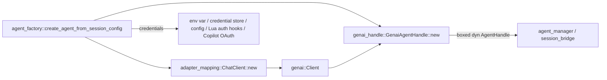

# Providers and LLM

## Purpose and ownership

This subsystem owns two related but separate jobs inside `crucible-daemon`:
chat with an external LLM backend, and text embedding for retrieval. Both are
provider seams: a small closed set of concrete backends sits behind one trait
or one factory function, and the rest of the daemon depends only on the
trait or the factory, never on a concrete provider type.

For chat, `crates/crucible-daemon/src/provider/` builds and drives a
`genai::Client`. Per the module's own comments, this is "architecture gate
A3": `genai` types must not leak past `crates/crucible-daemon/src/provider/`
and `crates/crucible-daemon/src/agent_factory.rs`. A workspace grep of
`genai::` under `crates/crucible-daemon/src/` confirms it: every hit sits
in `provider/` or in `agent_factory.rs`. `agent_factory.rs` calls
`build_chat_client_for_agent` to get a `ChatClient`, then builds a
`GenaiAgentHandle` and hands it out only as `Box<dyn AgentHandle + Send +
Sync>`. This matches AGENTS.md's daemon ownership row: business logic and
authoritative provider construction live in `crucible-daemon`; `crucible-cli`
and `crucible-web` never construct a second chat client.

For embeddings, `crates/crucible-daemon/src/llm/embeddings/` implements
`crucible_core::enrichment::EmbeddingProvider` for four backends and exposes
only `create_provider`, an async factory returning `Arc<dyn
EmbeddingProvider>`. `crates/crucible-daemon/src/embedding.rs` wraps that
factory in a process-global cache keyed by provider identity, so a session or
enrichment task never re-pays FastEmbed's model load or a remote provider's
connection setup. `crates/crucible-cli/src/factories/embedding.rs` (outside
this page) only derives an `EmbeddingProviderConfig` from CLI config; it does
not call `create_provider` itself — the provider instance is still built
daemon-side.

This subsystem must not own: session storage, kiln admission, or tool
containment. `GenaiAgentHandle` reads `ActiveToolSets` and mode state live
but does not decide trust or containment — those checks happen in
`crate::agent_manager::scope` and `crate::tools::containment` (see
[[Tools and Admission]], [[Agent Manager]]) before a tool call ever reaches
this code. `crates/crucible-daemon/src/llm_state.rs` and
`crates/crucible-daemon/src/empty_providers.rs` are state and null-object
support for the same seam and are covered here rather than in
[[State Stores]] because their consumers are this subsystem's own factory
and handle.

## Module map

| Path | Lines | Role |
| --- | --- | --- |
| `crates/crucible-daemon/src/embedding.rs` | 230 | Process-global cache of `EmbeddingProvider` instances keyed by config identity; lazy, not on the boot path |
| `crates/crucible-daemon/src/empty_providers.rs` | 100 | Null-object `KnowledgeRepository` and `EmbeddingProvider` for a session with no kiln or embedding configured |
| `crates/crucible-daemon/src/llm_state.rs` | 643 | Reader/writer for `<data_home>/llm.json` (recorded provider selection) plus `LiveLlmConfig`, the live provider table trust checks read |
| `crates/crucible-daemon/src/llm/mod.rs` | 69 | Module root for `llm`; re-exports `embeddings` and `model_discovery` types |
| `crates/crucible-daemon/src/llm/model_discovery.rs` | 608 | Scans configured directories for local `.gguf` model files and classifies them |
| `crates/crucible-daemon/src/llm/embeddings/mod.rs` | 102 | Embeddings module root; `create_provider`, the one factory entry point |
| `crates/crucible-daemon/src/llm/embeddings/config.rs` | 112 | Re-exports `crucible_core::config::EmbeddingProviderConfig` as `EmbeddingConfig`; expected-dimensions lookup |
| `crates/crucible-daemon/src/llm/embeddings/error.rs` | 154 | `EmbeddingError`/`EmbeddingResult`, shared by every provider; retry classification |
| `crates/crucible-daemon/src/llm/embeddings/provider.rs` | 524 | Shared value types: `ModelFamily`, `ParameterSize`, `ModelInfo`/`ModelInfoBuilder`, `EmbeddingResponse` |
| `crates/crucible-daemon/src/llm/embeddings/fastembed.rs` | 498 | Local ONNX/CPU provider, feature-gated behind `fastembed` |
| `crates/crucible-daemon/src/llm/embeddings/ollama.rs` | 667 | Ollama HTTP provider with retry/backoff and native batch requests |
| `crates/crucible-daemon/src/llm/embeddings/openai.rs` | 409 | OpenAI HTTP embedding provider |
| `crates/crucible-daemon/src/llm/embeddings/mock.rs` | 168 | `FixtureEmbeddingProvider`, the deterministic runtime provider for `BackendType::Mock` |
| `crates/crucible-daemon/src/llm/embeddings/catalog.rs` | 419 | Curated local-model catalog: names, published scores, HuggingFace cache probing, download |
| `crates/crucible-daemon/src/llm/embeddings/catalog/tests.rs` | 198 | Unit tests for `catalog.rs` name resolution and cache probing |
| `crates/crucible-daemon/src/llm/embeddings/test_helpers.rs` | 24 | `#[cfg(test)]` fixture configs shared by `ollama.rs` and `openai.rs` tests |
| `crates/crucible-daemon/src/provider/mod.rs` | 15 | Module root for `provider`; re-exports `backend_to_adapter` and `ChatClient`; declares `endpoint_check` and `oneshot` as `pub(crate)` children |
| `crates/crucible-daemon/src/provider/adapter_mapping.rs` | 777 | `backend_to_adapter`, `ChatClient`: builds the authenticated `genai::Client` |
| `crates/crucible-daemon/src/provider/copilot.rs` | 501 | GitHub Copilot OAuth device flow and token-refreshing API client |
| `crates/crucible-daemon/src/provider/endpoint_check.rs` | 204 | Refuses a request-named endpoint that is not operator-configured and does not resolve to a globally routable address; the daemon's one SSRF/private-address gate for every client |
| `crates/crucible-daemon/src/provider/endpoint_check/tests.rs` | 293 | `proptest`-driven and fixed-case coverage of every internal/reserved address range and the operator-configured-origin allowlist |
| `crates/crucible-daemon/src/provider/genai_handle.rs` | 3241 | `GenaiAgentHandle`: the tool-loop `Agent`/`AgentHandle`/`SessionKnobs` implementation |
| `crates/crucible-daemon/src/provider/model_listing.rs` | 238 | Probes a backend's model-listing endpoint for UI pickers; carries the SSRF no-redirect defense |
| `crates/crucible-daemon/src/provider/oneshot.rs` | 140 | Single bounded request/response exchange behind `cru.session.complete` |
| `crates/crucible-daemon/src/provider/tool_bridge.rs` | 98 | Converts `LlmToolDefinition` to genai's `Tool`; sanitizes JSON schema for provider compatibility |

## Key types and traits

- `crucible_core::enrichment::EmbeddingProvider` (defined outside this page,
  in `crucible-core`) is the trait every embedding backend implements:
  `embed`, `embed_batch`, `model_name`, `provider_kind`, `dimensions`,
  `provider_name`, `list_models`. `crates/crucible-daemon/src/llm/embeddings/mod.rs`'s
  `create_provider` is the only place that names a concrete implementor;
  every caller elsewhere holds `Arc<dyn EmbeddingProvider>`.
- `crates/crucible-daemon/src/llm/embeddings/fastembed.rs`'s
  `FastEmbedProvider { model: Arc<Mutex<Option<TextEmbedding>>>, config,
  model_info }`, `crates/crucible-daemon/src/llm/embeddings/ollama.rs`'s
  `OllamaProvider`, `crates/crucible-daemon/src/llm/embeddings/openai.rs`'s
  `OpenAIProvider`, and `crates/crucible-daemon/src/llm/embeddings/mock.rs`'s
  `FixtureEmbeddingProvider` are the four concrete implementors. `create_provider`
  creates each and boxes it; `crates/crucible-daemon/src/embedding.rs`'s
  `get_or_create_embedding_provider` holds the cached `Arc`, and
  `crates/crucible-daemon/src/empty_providers.rs`'s `EmptyEmbeddingProvider`
  stands in when a session has no embedding config at all.
- `crates/crucible-daemon/src/llm/embeddings/error.rs`'s `EmbeddingError`
  (`thiserror`) is the shared error every provider returns; its
  `is_retryable`/`retry_delay_secs` methods drive `ollama.rs`'s
  `embed_with_retry` backoff loop.
- `crates/crucible-daemon/src/llm/embeddings/provider.rs`'s `ModelInfo` (built
  via `ModelInfoBuilder`) and `EmbeddingResponse` are the shared value types
  every provider's `list_models`/`embed` return; `catalog.rs` builds
  `ModelInfo` values from its curated table.
- `crates/crucible-daemon/src/provider/adapter_mapping.rs`'s `ChatClient
  { client: genai::Client, backend, zai_coding }` is the daemon's one chat
  client type. `crates/crucible-daemon/src/agent_factory.rs`'s
  `build_chat_client_for_agent` is the sole external constructor; it holds no
  session state and is created once per agent build.
- `crates/crucible-daemon/src/provider/genai_handle.rs`'s `GenaiAgentHandle`
  is the central type of this page: it holds `client: genai::Client`, `model:
  ModelIden`, `system_prompt`, `session_context`, `tools:
  Vec<LlmToolDefinition>`, `mode_state`, `context_budget`,
  `context_strategy`, `deferrable_tool_names`, `plugin_tool_names`, and
  `active_tools: Option<(String, ActiveToolSets)>`. `agent_factory.rs`'s
  `create_agent_from_session_config` is the only production constructor; it
  is consumed as a boxed `dyn AgentHandle` by `crate::agent_manager` and
  `crate::session_bridge` (outside this page — see [[Agent Manager]],
  [[Session Services]]). Its `SessionKnobs` implementation answers every
  plugin-approval and plugin-turn-limit call with an inert stub
  (`set_plugin_approval`/`set_plugin_turn_limit` return
  `ChatError::NotSupported`; `get_plugin_approval` returns
  `PluginApproval::Inherit`; `get_plugin_turn_limit` returns `25`) — those
  knobs belong to the session/plugin layer, not this provider handle.
- `crates/crucible-daemon/src/provider/genai_handle.rs`'s private
  `ToolCallEmitter::try_emit` builds each `TurnEvent::ToolCall` around a full
  `crucible_core::types::CanonicalToolCall` (with `diffs` synthesized by
  `crates/crucible-daemon/src/tools/diff_synth.rs`'s `synthesize_diffs`),
  carried on the `call: Option<Box<CanonicalToolCall>>` field, rather than
  emitting the diffs on their own. `try_emit` returns `None` for a `call_id`
  it already emitted, so each tool call reaches the runtime once.
- `crates/crucible-daemon/src/provider/genai_handle.rs`'s private
  `provider_error_text` extracts an HTTP status and response body from a
  `genai::Error` (`HttpError`, a downcast `WebStream` error, or
  `WebModelCall`'s `ResponseFailedStatus`) and formats them as one line,
  capped at 600 characters. Both the turn-stream error path and
  `oneshot.rs`'s `complete` call it instead of `genai::Error`'s raw
  multi-line `Display` output.
- `crates/crucible-daemon/src/llm_state.rs`'s `LiveLlmConfig(Arc<RwLock<Option<Arc<LlmConfig>>>>)`
  is the running daemon's shared provider table. Its only mutator,
  `add_provider`, is additive-only by construction: it cannot alter an
  existing entry or re-aim an already-set default. `crates/crucible-daemon/src/llm_state.rs`'s
  `LlmStateStore` is the separate `<data_home>/llm.json` file store
  (`register_provider`, `overlay_onto`); see [[State Stores]] for the shared
  `RegistryStore` locking pattern it uses.
- `crates/crucible-daemon/src/provider/endpoint_check.rs`'s
  `configured_endpoints` and `check_request_endpoint` are the daemon's one
  pair of functions for the SSRF/private-address check on a request-named
  provider endpoint. Neither holds state: `configured_endpoints` reads the
  live `LlmConfig` and `chat.endpoint` to build the operator's allowlist, and
  `check_request_endpoint` resolves the endpoint's host and refuses it
  unless its origin is on that allowlist or every resolved address is
  globally routable.
- `crates/crucible-daemon/src/provider/copilot.rs`'s `CopilotAuth` (device
  flow) and `CopilotClient { http, oauth_token, cached_token:
  Arc<RwLock<Option<CachedToken>>> }` (token-refreshing API client) are
  self-contained; `crates/crucible-daemon/src/provider/model_listing.rs`
  holds the other production caller of `CopilotClient`.

## Flows

### Building a chat agent for a session

1. `crates/crucible-daemon/src/agent_factory.rs`'s
   `create_agent_from_session_config` receives a resolved `SessionAgent` and
   branches on `agent_config.agent_type`.
2. For an internal agent, it calls `build_chat_client_for_agent`, which reads
   `crucible_core::config::LlmProviderConfig`. It resolves the provider's key
   with `crucible_core::config::credentials::resolve_provider_api_key`, in
   order: the backend's environment variable, the credential store under the
   provider's `llm.providers` key, the credential store under the backend's
   name, then the configured `llm.providers.<key>.api_key` value passed in as
   `configured_key`. A `crucible_lua::auth_plugin` hook may override the key
   next, and for GitHub Copilot,
   `crucible_core::config::credentials::resolve_copilot_oauth_token` may
   override it again. When no source yields a key and the backend needs one,
   `build_chat_client_for_agent` refuses before any network call, as
   `AgentFactoryError::MissingApiKey`, naming the provider key, its
   environment variable when it has one, and `cru auth login --provider
   <key>`. It then calls
   `crates/crucible-daemon/src/provider/adapter_mapping.rs`'s `ChatClient::new`.
3. `ChatClient::new` calls `backend_to_adapter` to pick a `genai::AdapterKind`,
   builds an `AuthResolver` (a placeholder bearer token for a keyless custom
   endpoint, otherwise genai's own vendor-env-var fallback), fixes up the
   endpoint's trailing slash, and constructs the `genai::Client`.
4. `agent_factory.rs` assembles tool definitions
   (`create_internal_mcp_tool_defs`, filtered by `mode_exposes_tool`) and a
   two-part `EnrichedPrompt` (stable persona/rules/skills versus volatile
   per-session workspace/kilns, kept apart so the provider's prompt cache
   matches on a stable prefix), then constructs `GenaiAgentHandle::new` with
   `with_session_context`, `with_modes`, `with_context_settings`, and
   `with_active_tools` when both `active_tools` and `parent_session_id` are
   `Some`.
5. The boxed handle returns to the caller as `Box<dyn AgentHandle + Send +
   Sync>`.

### Checking a request-named endpoint

A session's `endpoint` field can come from `session.create`,
`session.configure_agent` over RPC, the TUI's `cru session configure
--endpoint`, a Lua plugin's `configure_agent`, or `crucible-web` relaying a
browser's choice. Every one of those paths runs the same check, in the
daemon, before the endpoint is used or persisted.

1. `crate::agent_manager` (outside this page)'s
   `AgentManager::refuse_internal_endpoint` reads the agent's `endpoint`. An
   absent endpoint passes with no check.
2. It calls `crates/crucible-daemon/src/provider/endpoint_check.rs`'s
   `configured_endpoints`, which collects every operator-configured origin:
   each `BackendType::default_endpoint` (the local Ollama at
   `http://localhost:11434` among them), every `llm.providers` endpoint,
   `OLLAMA_HOST` (via `ollama_endpoint_from_env`), and `chat.endpoint`.
3. It calls `check_request_endpoint(endpoint, &configured)`. An endpoint
   whose origin (scheme, host, port) matches a configured one is accepted
   with no further check. Any other endpoint must use `http` or `https`, and
   every address its host resolves to must be a globally routable unicast
   address; loopback, private, link-local, CGNAT and every other
   non-global range are refused.
4. `AgentManager::configure_agent` and `session.create` both call
   `refuse_internal_endpoint` before they persist the agent. A refusal maps
   to `AgentError::InvalidConfig`, which the RPC layer turns into
   `INVALID_PARAMS` (-32602).

### A chat turn

1. `crate::agent_manager` (outside this page) calls the handle's `turn()`
   (`crucible_core::turn::Agent::turn`), which `crates/crucible-daemon/src/provider/genai_handle.rs`
   dispatches to `scheduler_driven_turn`.
2. `scheduler_driven_turn` runs an unlabeled `loop`. Each iteration calls
   `stream_chat_from_messages`, which computes `visible_tools()` (mode filter,
   then plan/plugin write-name filter, then active-set intersection, then
   budget-driven deferral of gateway/user-MCP tools to the discovery bridge —
   `bridge_tool_defs`), maps each visible tool through
   `crates/crucible-daemon/src/provider/tool_bridge.rs`'s `llm_tool_to_genai`
   (which calls `sanitize_tool_schema`), applies prompt caching
   (`apply_prompt_caching`: a breakpoint on the second-to-last message, plus
   one breakpoint each for the session-context and system-prompt messages),
   and enforces the context budget (`enforce_context_budget`:
   `Truncate` or `Summarize` via `summarize_via_backend`, falling back to a
   static placeholder on failure).
3. `client.exec_chat_stream` streams `ChatStreamEvent`s; `translate_chat_stream_event`
   turns each into a `TurnEvent`, deduplicated by `ToolCallEmitter` (live
   chunks versus the end-of-stream replay) and `ReasoningEmissionState`.
   `ToolCallEmitter::try_emit` wraps each call in a full
   `crucible_core::types::CanonicalToolCall`, carried on
   `TurnEvent::ToolCall`'s `call` field, not a bare `diffs` list. The whole
   stream is wrapped by `wrap_stream_with_guards` for a 300-second
   per-chunk timeout and non-terminal-close classification. On a stream-start
   or mid-stream `genai::Error`, the handle formats the provider's HTTP
   status and response body into one line with `provider_error_text`,
   instead of surfacing genai's raw multi-line `Display` output.
4. On a tool call batch, the handle yields `ToolBatchEnd` and awaits
   `ChatToolResult`s and `TurnEvent::ContextAttach` messages on `ctx.inbound`
   (owned by `crate::agent_manager`, not this handle — `owns_history:
   false`). `tool_response_payload` folds result and error into the message
   list so a tool failure reaches the model rather than vanishing. A
   buffered `ContextAttach` message is appended last, after the tool
   responses, through `context_messages_to_chat` — the same per-adapter role
   rule as every other injection (an Anthropic model gets a `user`-role
   message; another adapter gets a `system`-role message), so the attached
   content shares the cacheable prefix instead of always landing as a plain
   system message. The loop restarts the LLM call with the updated message
   list.
5. `cancel()` and `switch_model()` on the `Agent` trait let
   `crate::agent_manager` stop a turn or change models between turns.

### One-shot completion (`cru.session.complete`)

`crate::agent_manager::completion::complete_once` (outside this page) resolves
a session's `ChatClient` the same way a turn would, then calls
`crates/crucible-daemon/src/provider/oneshot.rs`'s `complete`, which builds a
single-message `ChatRequest` with no tools and no history, races it against a
timeout via the private `bounded` helper, and formats any provider failure
through `genai_handle::provider_error_text` before returning it as a plain
`String` error (no error enum, because every caller surfaces it to Lua) — so
a one-shot completion's error string carries the same one-line HTTP
status/body as a turn's stream error.

### Embedding a query or document

1. A caller (enrichment, `crate::multi_kiln_search`, or an MCP tool — outside
   this page) calls `crates/crucible-daemon/src/embedding.rs`'s
   `get_or_create_embedding_provider(config)`.
2. On a cache miss, it calls `crate::llm::embeddings::create_provider`, which
   validates the config and matches `BackendType` to construct
   `OllamaProvider`, `OpenAIProvider`, `FastEmbedProvider` (feature-gated), or
   `FixtureEmbeddingProvider`; any other variant returns `EmbeddingError::ConfigError`.
3. The result is boxed as `Arc<dyn EmbeddingProvider>`, cached under a key of
   `"{provider_type:?}|{endpoint}|{model_name}"`, and returned. Every
   subsequent call with the same config identity returns the same `Arc`
   without re-running provider setup.
4. `FastEmbedProvider` additionally defers the actual ONNX model load: `new`
   only parses the model name via `catalog::parse_model_name`; the first
   `embed`/`embed_batch` call triggers `ensure_model_loaded`, which runs
   `TextEmbedding::try_new` inside `tokio::task::spawn_blocking`.

### Local model catalog and download

`crates/crucible-daemon/src/server/llm.rs` (outside this page, the `cru
models embeddings` RPC handler) calls `catalog::find`, `catalog::all`,
`catalog::parse_model_name`, `catalog::cache_dir`, `catalog::is_downloaded`,
`catalog::disk_bytes`, and `catalog::download` directly — the catalog is
reachable both through the provider factory (`fastembed.rs` uses it to
resolve a configured model name) and directly from the RPC layer for listing
and downloading.

## State, concurrency and lifecycle

- `crates/crucible-daemon/src/embedding.rs`'s `EMBEDDING_PROVIDER_CACHE` is a
  `once_cell::sync::Lazy<Mutex<HashMap<String, Arc<dyn EmbeddingProvider>>>>`,
  process-global for the daemon's life. It recovers from a poisoned lock
  (`unwrap_or_else(|e| e.into_inner())`) rather than propagating a panic, and
  has no eviction — it grows by one entry per distinct provider identity ever
  requested, accepted because the identity space is bounded by configuration.
- `crates/crucible-daemon/src/llm/embeddings/fastembed.rs`'s `FastEmbedProvider`
  holds `Arc<Mutex<Option<TextEmbedding>>>`; the `tokio::sync::Mutex` is held
  across the blocking embed call, so concurrent `embed_batch` calls against
  one `FastEmbedProvider` serialize.
- `crates/crucible-daemon/src/llm/embeddings/mock.rs`'s `FixtureEmbeddingProvider`
  caches generated vectors in an unbounded `std::sync::Mutex<HashMap<String,
  Vec<f32>>>` keyed by input text — acceptable for a test/mock backend, not
  used for production embedding volume.
- `crates/crucible-daemon/src/llm_state.rs`'s `LiveLlmConfig` uses a
  `std::sync::RwLock`, read by the trust path
  (`resolve_provider_trust`, outside this page) via a cheap `Arc` clone; its
  only mutator is additive-only, closing a TOCTOU window between a trust read
  and a provider addition. Every trust gate — create, `configure_agent`,
  `switch_model`, fork, revive, delegation and attach — reads the provider
  table through one entry point, `crate::agent_manager`'s
  `AgentManager::refuse_untrusted`, which calls `resolve_provider_trust`.
- `crates/crucible-daemon/src/provider/copilot.rs`'s `CopilotClient` holds
  `cached_token: Arc<RwLock<Option<CachedToken>>>` and uses a
  double-checked-lock pattern (`ensure_token`: read-lock fast path, then a
  write-lock re-check before calling `get_copilot_token`) to avoid duplicate
  refresh calls under concurrent access. Token TTL is 30 minutes; the cache
  refreshes 5 minutes early.
- `crates/crucible-daemon/src/provider/genai_handle.rs`'s `GenaiAgentHandle`
  holds no `Arc`/`Mutex` itself — it is owned per-session by its caller
  (`crate::agent_manager`), and `genai::Client` is cheap to clone per stream.
  `ActiveToolSets` is read live from outside the handle on every request
  rather than snapshotted, so a plugin narrowing the active tool set takes
  effect on the very next request within the same turn.
- No explicit startup step runs for this subsystem: embedding providers and
  the chat client are both created lazily, on first use, per
  `crates/crucible-daemon/src/embedding.rs`'s own module doc ("This factory
  does NOT block daemon startup"). Shutdown has no explicit cleanup path in
  this subsystem beyond normal `Arc`/`Drop` teardown of the cached providers
  and clients when the daemon process ends.

## Boundaries and invariants

- Architecture gate A3: `genai` types are confined to
  `crates/crucible-daemon/src/provider/` and
  `crates/crucible-daemon/src/agent_factory.rs`. A grep of `genai::` across
  `crates/crucible-daemon/src/` finds no hit outside those two locations, and
  `crates/crucible-daemon/src/provider/oneshot.rs` is deliberately
  `pub(crate)` for the same reason — its module doc calls this out directly.
- `crates/crucible-daemon/src/provider/adapter_mapping.rs`'s `backend_to_adapter`
  is a real exhaustive match over every `BackendType` variant (12 arms,
  including `None` results for `VertexAI`, `FastEmbed`, `Burn`, `Mock`) — the
  compiler enforces completeness because there is no wildcard arm.
- Concrete provider types in `llm/embeddings/` are private to the module;
  the only public constructor is `create_provider`, matching the module's
  own doc: "Public API provides factory functions that return trait
  objects."
- `crates/crucible-daemon/src/provider/model_listing.rs`'s `http_client`
  hard-disables HTTP redirects. Its own comment explains why: the endpoint
  has already been checked against
  `crates/crucible-daemon/src/provider/endpoint_check.rs`'s
  `check_request_endpoint`, but that check applies to the URL the caller was
  handed, not to wherever a redirect points next — following one would let a
  validated public endpoint answer with a `302` to an internal address. The
  SSRF defense is entirely inside `crucible-daemon`, split between
  `endpoint_check.rs` (the deny list, checked once per request) and
  `model_listing.rs` (no redirects, because the dialer resolves the host
  again).
- `crates/crucible-daemon/src/provider/endpoint_check.rs` is the daemon's
  one SSRF/private-address gate, checked for every client that can name an
  endpoint — the TUI's `cru session configure --endpoint`, direct RPC, a Lua
  plugin's `configure_agent`, and `crucible-web` relaying a browser's
  choice — not only a browser session. `crucible-web` no longer implements
  any half of this check itself; see [[Web Server]] for how it forwards an
  endpoint to the daemon instead.
- `crates/crucible-daemon/src/empty_providers.rs`'s null objects are
  deliberately asymmetric: `EmptyKnowledgeRepository` returns empty success
  ("no results" is a valid answer), while `EmptyEmbeddingProvider::embed`
  fails loudly with `anyhow::bail!` — a caller that actually needs a vector
  gets an error, not a silently wrong zero vector.
- `crates/crucible-daemon/src/provider/genai_handle.rs` enforces that
  progressive tool disclosure only ever defers gateway/user-MCP tools, never
  kiln or workspace tools, and that plan mode and an unknown mode both fail
  closed to the most restrictive tool set rather than the most permissive
  one; an active tool set can only narrow what plan mode already removed,
  never re-grant it.
- `crates/crucible-daemon/src/llm_state.rs` draws an explicit contrast with
  [[State Stores]]'s kiln-name rule: a kiln name is never re-pointed, but an
  LLM provider selection is re-pointable (switching from Ollama to Anthropic
  is an ordinary user action) — the state-layer precedence machinery is
  shared, the re-point policy is not.

## Extension seams

A new chat backend needs a `BackendType` variant in `crucible-core`
(`crates/crucible-core/src/config/components/backend.rs`, outside this page)
and an arm in `crates/crucible-daemon/src/provider/adapter_mapping.rs`'s
`backend_to_adapter` (compiler-enforced by the exhaustive match). If the
backend needs endpoint or auth quirks beyond genai's defaults, they land in
`ChatClient::new`.

A new embedding backend needs a `BackendType` arm in
`crates/crucible-daemon/src/llm/embeddings/mod.rs`'s `create_provider` and an
implementation of `crucible_core::enrichment::EmbeddingProvider` alongside
`ollama.rs`/`openai.rs`/`fastembed.rs`/`mock.rs`. It should also extend
`crates/crucible-daemon/src/llm/embeddings/config.rs`'s
`expected_dimensions_for_model` if the backend has a known model-to-dimension
mapping worth validating.

A change to the tool-call loop, prompt caching, context budgeting, or
progressive tool disclosure lands in
`crates/crucible-daemon/src/provider/genai_handle.rs`'s
`stream_chat_from_messages`/`scheduler_driven_turn`/`visible_tools`; see
[[Consolidation Plan#Extension seams]]'s "Provider" row for the required
proof (config resolution and a request through the provider boundary).

A curated local embedding model addition lands in
`crates/crucible-daemon/src/llm/embeddings/catalog.rs`'s `CURATED` table.

## Tests

- `crates/crucible-daemon/src/provider/adapter_mapping.rs` carries an inline
  `#[cfg(test)]` module covering all 12 `BackendType` variants and endpoint/auth
  edge cases (keyless custom endpoint, ZAI's `zai_coding::` namespace).
- `crates/crucible-daemon/src/provider/genai_handle.rs`'s test module is
  roughly half the file: it proves progressive-disclosure budget behavior,
  plan-mode fail-closed filtering (including a mode whose Lua declaration
  vanished), active-tool-set narrowing-only behavior, tool-call/reasoning
  deduplication across live and end-of-stream replay, and stream-timeout
  classification. `injected_context_uses_conversation_role_for_each_adapter`
  proves an Anthropic-model handle wraps a tagged injection as a `user`-role
  message while an OpenAI-model handle keeps it as `ChatRole::System`. A `mod
  admission_matrix` inside the test module is labeled "ROUND-3 THROWAWAY" in
  its own section header.
- `crates/crucible-daemon/src/provider/endpoint_check/tests.rs` uses
  `proptest` to check that every private/loopback/link-local/CGNAT/reserved
  IPv4 range and every non-global IPv6 prefix is refused and every globally
  routable address is accepted, plus fixed cases for IPv6-embedded IPv4,
  numeric-literal IPv4 shorthand, DNS-resolution failure, and the
  operator-configured-origin allowlist. The RPC crossing — `session.create`
  actually refusing on this check — is proved separately in
  `crates/crucible-daemon/tests/rpc_session_create_agent_e2e.rs`, outside
  this file set.
- `crates/crucible-daemon/src/provider/oneshot.rs` uses
  `#[tokio::test(start_paused = true)]` to exercise its timeout bound
  deterministically without a live provider.
- `crates/crucible-daemon/src/provider/copilot.rs` includes
  `test_copilot_client_debug_redacts_token`, proving the OAuth token never
  appears in a `{:?}` log line.
- `crates/crucible-daemon/src/provider/model_listing.rs`'s
  `a_provider_redirect_is_never_followed` uses `wiremock` to build a
  redirecting mock server and asserts the redirect target is never dialed —
  the direct regression test for the no-redirects half of the SSRF defense.
- `crates/crucible-daemon/src/llm/embeddings/ollama.rs` and
  `crates/crucible-daemon/src/llm/embeddings/openai.rs` each carry an inline
  `#[cfg(test)]` module using `crates/crucible-daemon/src/llm/embeddings/test_helpers.rs`
  fixtures; `provider.rs`'s `ParameterSize` parsing is pinned from
  `ollama.rs`'s test module.
- `crates/crucible-daemon/src/llm/embeddings/catalog/tests.rs` covers name
  resolution (curated and uncurated), unknown-name error text, and HuggingFace
  cache probing (`is_downloaded`, `disk_bytes`) using `tempfile::TempDir`
  fixtures that fabricate the on-disk cache shape without any network access.
- `crates/crucible-daemon/src/embedding.rs`'s inline tests cover cache-key
  determinism and a concurrent-clear test across four threads with no panic.
- `crates/crucible-daemon/src/llm/embeddings/fastembed.rs`'s tests
  (`test_fastembed_single_embedding`, `test_fastembed_batch_embedding`)
  perform real model downloads to a temporary cache directory — network- and
  disk-dependent, not marked `#[ignore]` and without a named external
  prerequisite comment, which AGENTS.md's testing guidance asks for.
- Gap: `crates/crucible-daemon/src/llm/model_discovery.rs` has thorough unit
  tests for its own classification and caching logic, but no test anywhere
  exercises it from an RPC handler or session flow, because no such caller
  exists (see Findings).
- Gap: `crates/crucible-daemon/src/llm_state.rs`'s `LlmStateStore` and
  `LiveLlmConfig` are unit-tested in isolation; no test in this page's file
  set exercises `overlay_onto` merging into a live daemon boot alongside
  `crates/crucible-daemon/src/agent_factory.rs`'s credential resolution — that
  crossing is covered, if at all, by daemon-wide integration tests outside
  this page's file set.

## Findings

- `crates/crucible-daemon/src/llm/embeddings/mod.rs`'s `create_provider`
  matches `BackendType` with a trailing wildcard arm (`_ =>
  Err(EmbeddingError::ConfigError(...))`) rather than an exhaustive match.
  This contradicts AGENTS.md's "Closed sets need one exhaustive table and a
  compiler/runtime completeness gate... not source-text greps": a new
  `BackendType` variant compiles silently into a runtime config error here,
  in contrast to `crates/crucible-daemon/src/provider/adapter_mapping.rs`'s
  `backend_to_adapter`, which is genuinely exhaustive over the same enum in
  the same crate.
- `crates/crucible-daemon/src/llm/model_discovery.rs`'s `ModelDiscovery` is
  re-exported from `crates/crucible-daemon/src/llm/mod.rs` but has no caller
  anywhere in the workspace except `crates/crucible-daemon/examples/llm_discover_models.rs`.
  No RPC handler, session flow, or test wires it into the running daemon; it
  is effectively unreachable production code behind a public re-export.
- `crates/crucible-daemon/src/llm/embeddings/ollama.rs` and
  `crates/crucible-daemon/src/llm/embeddings/openai.rs` each carry a stale
  file-header comment naming a path in the `crucible-mcp` crate, a crate
  that no longer exists in this tree — a documentation drift versus the
  files' actual location under `crucible-daemon`.
- `crates/crucible-daemon/src/provider/genai_handle.rs`'s `mod
  admission_matrix` test module is labeled "ROUND-3 THROWAWAY" in a comment
  header but remains committed; if the invariant it tests is now trusted, the
  label is stale, and if it is not, the label understates the test's
  standing.
- `crates/crucible-daemon/src/llm/embeddings/mock.rs`'s
  `FixtureEmbeddingProvider` and `crate::test_support::MockEmbeddingProvider`
  (outside this page) are two distinct mock embedding providers with
  overlapping purpose; `mock.rs`'s own doc comment disambiguates them
  deliberately (runtime `BackendType::Mock` backend versus a configurable
  test double), so this is a documented duplication rather than an
  unexplained one.
- No conflict found between this subsystem and the ownership or Luau
  sections of AGENTS.md: no chat or embedding provider is constructed
  outside `crucible-daemon`, no Lua fallback exists for provider selection,
  and the one Lua-reachable path (`cru.session.complete`, via
  `crates/crucible-daemon/src/provider/oneshot.rs`) is a bounded read-only
  exchange with no history and no tools.
