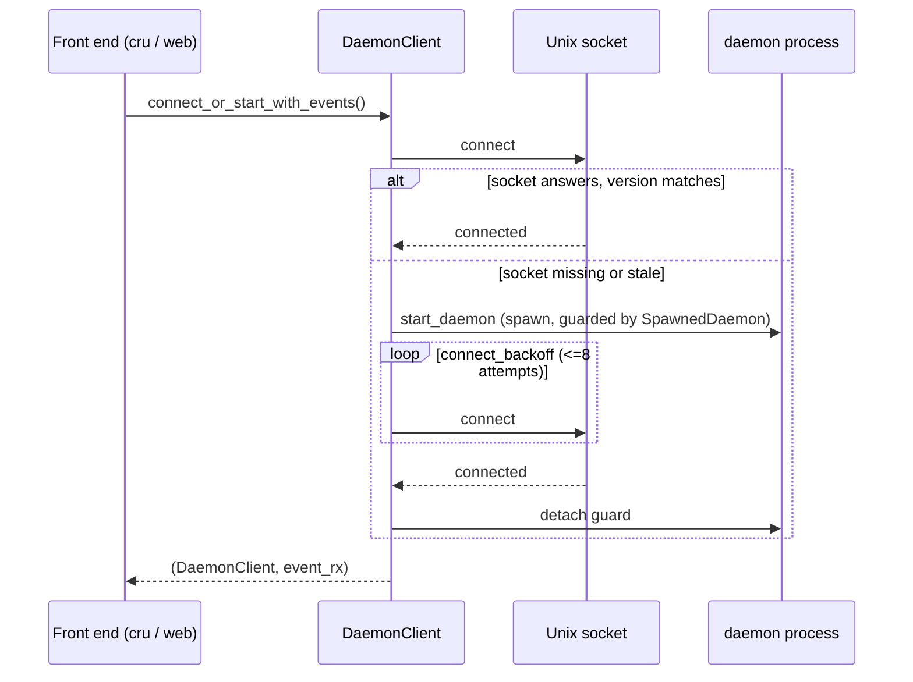

# RPC Client

The `crucible-daemon::rpc_client` module is a client library that ships
inside the `crucible-daemon` crate. It is the one path any front end
(`crucible-cli`, `crucible-web`, `acp_handle.rs`, `provider/genai_handle.rs`)
uses to reach a running daemon over its Unix socket. It owns connection
setup, JSON-RPC framing, request/response correlation, and the typed
wrappers around each RPC method. It does not run daemon business logic; it
sends intent and decodes the daemon's answer.

## Purpose and ownership

Per `AGENTS.md`, `crucible-daemon` owns "Sessions, admission, tools,
storage, retrieval, review, plugin lifecycle." This module is the *client*
half of that boundary, living in the same crate for convenience but never
executing the daemon's own handlers directly. It must:

- Open and keep a Unix socket connection to the daemon, spawning a daemon
  process if none answers.
- Frame each call as a JSON-RPC request, correlate it to a reply by id, and
  decode the reply into a typed struct or a raw `serde_json::Value`.
- Send every agent-facing session action (send a message, switch a model,
  answer a prompt, undo a turn) as one direct `DaemonClient` RPC call. There
  is no client-side agent adapter in this module: `AgentHandle` and
  `SessionKnobs` (`crucible_daemon::agent_manager::{AgentHandle,
  SessionKnobs}`) are daemon-only traits that a running agent implements
  inside the daemon process; a client never holds one.

It must not:

- Construct a second agent configuration or a second note-write pipeline.
  Every mutating call is a thin RPC pass-through (`crates/crucible-daemon/src/rpc_client/client/storage.rs`,
  `crates/crucible-daemon/src/rpc_client/client/session.rs`).
- Hold link-index rows, resolved backlinks, or any authoritative state.
  `crates/crucible-daemon/src/rpc_client/storage.rs` refuses several methods
  outright (`inbound_links`, `reindex_links`) rather than fake an answer,
  because "the RPC surface does not expose the rows."
- Decide kiln trust, admission, or mode-based tool filtering. Those stay
  daemon-side; this module only forwards the caller's request and mirrors
  the daemon's answer locally for display.

This matches AGENTS.md's client rule directly: "Clients send intent; they
must not construct a second agent configuration or write pipeline."

## Module map

| Path | Lines | Role |
| --- | --- | --- |
| `crates/crucible-daemon/src/rpc_client/mod.rs` | 26 | Public façade: declares the `client`, `error_ext`, `lifecycle`, `storage` submodules and re-exports `DaemonClient`, `SessionEvent`, `decode_status_items`, `ChatResultExt`, `rpc_error_message`, `FtsResult`, `DaemonNoteStore`, `DaemonStorageClient`, and `socket_path`. It no longer re-exports a request or reply type; a caller outside `crucible-daemon` names one through `crucible_core::protocol::requests`. |
| `crates/crucible-daemon/src/rpc_client/error_ext.rs` | 59 | `ChatResultExt` trait (one method, `chat_comm`, that folds any displayable error into `ChatError::Communication`) and `rpc_error_message`, a free function that strips the `RPC error: {json}` envelope down to the daemon's own message. |
| `crates/crucible-daemon/src/rpc_client/lifecycle.rs` | 183 | Synchronous daemon-process utilities: socket path, log path, log rotation on spawn, log tail read, `is_daemon_running`. |
| `crates/crucible-daemon/src/rpc_client/storage.rs` | 621 | `DaemonStorageClient` (`KnowledgeRepository` impl) and `DaemonNoteStore` (`NoteStore` impl): adapt canonical storage traits onto `DaemonClient` RPC calls. |
| `crates/crucible-daemon/src/rpc_client/client/mod.rs` | 1139 | The core `DaemonClient` struct: socket connect/spawn lifecycle, JSON-RPC framing, id correlation, retry/timeout policy, plus the plugin/`client_state.*` RPC methods that have no dedicated submodule (kept because `crucible-web`'s `forward_rpc!` calls each by name, or — `plugin_list_info` — decodes a real field). It declares every `client` submodule and imports each request type through `crucible_core::protocol::requests::*`. |
| `crates/crucible-daemon/src/rpc_client/client/generated.rs` | 58 | One `impl DaemonClient` block, macro-generated: a `rpc_<method>` for every `rpc_methods!` row, each typed as that row's own params/reply pair. Closes gap 1 of step 19 (see Findings below). |
| `crates/crucible-daemon/src/rpc_client/client/types.rs` | 12 | What is left after the request and reply types moved to core: the `SessionEvent` alias, shared by two or more submodules. `DaemonCapabilities` and `VersionCheck` now live in `crucible_core::protocol::requests::common`. |
| `crates/crucible-daemon/src/rpc_client/client/agent.rs` | 338 | `DaemonClient` methods for `session.*` agent/model/mode RPCs, `providers.list`, `embeddings.models`, `skills.*`, and the plugin-approval/knob `session.*` RPCs — each kept for a retry policy, a `&Path`-to-wire-`String` transform, or a wire-`String`-to-enum decode (see the per-method doc comments and item 9 of step 19 in the Simplification Plan). `models.list` moved here too (`list_all_models`, retry). `agents.list_profiles`/`agents.list_cards`/`agents.resolve_profile` and the plain (non-summary) `providers.list` had no caller, or one CLI-only caller with no transform, and are gone: their one caller each now calls the generated `rpc_<variant>` method and reads the typed reply. The request and reply types live in `crucible_core::protocol::requests::agent`. |
| `crates/crucible-daemon/src/rpc_client/client/session.rs` | 485 | `DaemonClient` methods for the bulk of `session.*` RPCs: create, list, get/status/status_items, history, pause/resume/end/delete/archive/clear, replay, send-message (with optional attached comments), interaction-respond, search, export, list/dismiss notifications; also `decode_status_items`. The request and reply types live in `crucible_core::protocol::requests::session`. |
| `crates/crucible-daemon/src/rpc_client/client/storage.rs` | 927 | `DaemonClient` methods for kiln registry, text/vector/grep search, note CRUD, link graph, pipeline processing, MCP control, webhook ingress, project and filesystem RPCs (including `fs.read`), and `diff.*` RPCs (get/file/comment/resolve_comment/delete_comment/comments) over branch, session-record and proposal diffset sources. The request and reply types, `first_per_note`, and the `Diff*` DTOs live in `crucible_core::protocol::requests::storage`. |
| `crates/crucible-daemon/src/rpc_client/client/proposals.rs` | 132 | `DaemonClient` methods for `proposal.*` RPCs: list, get, accept, reject, dismiss, resolve — the decision surface for propose-mode writes; `list`/`get` retry, and the rest layer default arguments (whole-proposal accept/reject, single-file resolve) onto the `_files`/`_file` row call so no caller repeats an empty `paths`/`files` vec. The request types live in `crucible_core::protocol::requests::proposals`. |
| `crates/crucible-daemon/src/rpc_client/client/subscription.rs` | 37 | `DaemonClient` methods for `session.subscribe`/`session.unsubscribe`: kept for the borrowed-`&[&str]`-to-owned-`Vec<String>` transform ~30 call sites across the daemon, CLI and web lean on. The request type lives in `crucible_core::protocol::requests::subscription`. |
| `crates/crucible-daemon/src/rpc_client/client/tests.rs` | 1015 | The test module for the whole `client` submodule: unit tests, wire-format round-trips, live in-process server integration tests, response-correlation tests, and signal-reaper tests. |

## Key types and traits

- **`DaemonClient`** (`crates/crucible-daemon/src/rpc_client/client/mod.rs`).
  The connection object. Fields: `timeout_retries: bool`, `writer:
  Arc<Mutex<OwnedWriteHalf>>`, `next_id: AtomicU64`, `pending_requests:
  Arc<Mutex<HashMap<u64, oneshot::Sender<Value>>>>`, `reader_task:
  Option<JoinHandle<()>>`, `simple_reader:
  Option<Mutex<BufReader<OwnedReadHalf>>>`. Every submodule's `impl
  DaemonClient` block adds methods to this one struct; there is no second
  client type. Created by `DaemonClient::connect`, `connect_or_start`,
  `connect_or_start_with_events`, `connect_to`, or `connect_with_events`.
  Held as an `Arc<DaemonClient>` by `DaemonStorageClient`,
  `crucible-cli`'s `LiveSession` (`crates/crucible-cli/src/session.rs`), and
  `crucible-cli`'s ACP session map (`crates/crucible-cli/src/commands/acp/agent.rs`).
  `crucible-web/src/services/daemon.rs`'s `ReconnectingDaemon` holds it as
  `Arc<RwLock<DaemonClient>>` instead, so a reconnect can replace the
  connection in place without handing every caller a new `Arc`.
- **`SpawnedDaemon`** (private, `client/mod.rs`). A `#[must_use]` guard
  around a freshly spawned `std::process::Child`. `detach()` releases it on
  success; `Drop` reaps it (SIGTERM, poll, SIGKILL) on failure, so a client
  that gave up connecting never leaves an orphan daemon behind.
- **`AgentHandle`, `SessionKnobs`** (`crucible_daemon::agent_manager::handle`,
  re-exported as `crucible_daemon::agent_manager::{AgentHandle,
  SessionKnobs}`). Daemon-only traits an active agent implements inside the
  daemon process. This module holds no implementor of either trait and no
  client-side session cache: `crates/crucible-cli/src/session.rs`'s
  `LiveSession` drives a session through plain `DaemonClient` calls, and each
  RPC reads or writes the daemon's own state directly. See [[Agent
  Manager]] for the traits themselves.
- **`DaemonStorageClient` / `DaemonNoteStore`** (`crates/crucible-daemon/src/rpc_client/storage.rs`).
  `KnowledgeRepository` and `NoteStore` implementations that hold `Arc<DaemonClient>`
  (and, for `DaemonNoteStore`, an `Arc<DaemonStorageClient>`) and translate
  every trait method into an RPC call. Created by
  `crucible-cli/src/factories/storage.rs`.
- **`SessionCreateRequest`**
  (`crates/crucible-core/src/protocol/requests/session.rs`). The one
  session-creation type. Each caller builds it, and
  `DaemonClient::session_create` sends it. A caller that wants the daemon to
  configure the agent in the same call sets `configure_agent` and the agent
  fields (identity, provider, model, prompt).
  `SessionCreateRequest::kiln_set` turns a set of `KilnName` into the wire
  form: an empty set is absent, so the daemon resolves its default set.
- **`ProposalListRequest` / `ProposalIdRequest` / `ProposalAcceptRequest` /
  `ProposalRejectRequest` / `ProposalResolveRequest`**
  (`crates/crucible-core/src/protocol/requests/proposals.rs`, called from
  `crates/crucible-daemon/src/rpc_client/client/proposals.rs`). The request
  DTOs behind every `proposal.*` RPC, all built around
  `crucible_core::proposal::{Proposal, ProposalFile, ProposalId}`. `paths`
  (legacy bare path strings) and `files` (root-qualified `ProposalFile`
  identities) are mutually exclusive on accept and reject; an empty `paths`
  and an empty `files` together means every file of the proposal.
- **Wire-shared request types** (`crates/crucible-core/src/protocol/requests/`:
  `agent.rs`, `common.rs`, `lua.rs`, `notifications.rs`, `plugin.rs`,
  `proposals.rs`, `session.rs`, `storage.rs`, `subscription.rs`,
  `workflow.rs`, glob re-exported from `mod.rs`). Structs that derive both
  `Serialize` and `Deserialize` so the client serializes and the daemon's
  own handler deserializes the identical type — called "gate A6" in the
  code's own comments. This is the module's version of AGENTS.md's "closed
  sets need one exhaustive table," applied to wire contracts: one struct,
  not independently typed ends, and now one crate, so no client needs the
  daemon crate to name a request type. The `diff.*` requests
  (`DiffsetRef`, `DiffFileRequest`, `DiffCommentRequest`, `DiffCommentKey`)
  and their replies in `requests/storage.rs` follow this pattern, shared
  with the daemon's `diff.*` handlers.
- **One body for each shape.** Methods with one shape share one type, named
  for the shape, not for the method: `NoteRef` (`get_note_by_name`,
  `get_backlinks`), `KilnRef` (`kiln.graph`, `note.list`), `DiffsetRef`
  (`diff.get`, `diff.comments`), `DiffCommentKey` (`diff.resolve_comment`,
  `diff.delete_comment`), `ConfigLookupRequest` (`config.get`,
  `config.origin`), `ConfigKeyRequest` (`config.reset`, `config.pop`,
  `config.unset`) and `ConfigValuesRequest` (`config.set`, `config.save`).
- **`Scoped<T>`** (`requests/common.rs`). The params of each method that
  acts on one session: `session_id`, and the body `T` flattened beside it.
  The JSON keeps `session_id` at the top level, so the wire is the same as a
  flat struct. A method that names only the session takes `Scoped<()>`;
  `session.history` and `session.resume_from_storage` take `Scoped<Page>`.
  The body type holds only the other fields (`MessageInput`, `Title`,
  `NamedKiln`, `WorkflowSource`, and so on). A web route takes the session
  id from its URL path and reads only the body, so `Scoped<T>` has no
  `ToSchema`. Step 13 of the simplification plan replaced the five knob
  request types with one pair: `session.knob.set` takes `Scoped<KnobValue>`
  (the body IS the value — its own tag names the knob) and
  `session.knob.get` takes `Scoped<KnobRef>` (`{ knob: SessionKnob }`) and
  answers a `KnobValue`.
- **Methods without params.** The client sends `NO_PARAMS`, an empty map,
  so the JSON is `{}`, as it was before.
  `requests/storage.rs` also carries `ListedComment` (moved from
  `crates/crucible-daemon/src/diff/comments.rs`) and `GREP_DEFAULT_LIMIT`
  (moved from `crates/crucible-daemon/src/server/grep.rs`), for the same
  reason: both a client and the daemon's `diff.rs`/`grep.rs` handler need
  the identical type or constant.
- **`VersionCheck`** (`crucible_core::protocol::requests::common`): `Match`
  or `Mismatch { client, daemon }`. Drives `verify_or_restart` in
  `client/mod.rs`.
- **The generated `rpc_<method>` methods** (`client/generated.rs`). One per
  `rpc_methods!` row, typed as that row's own `Req`/`Resp` pair —
  `client.rpc_session_get(Scoped::session(id))` returns `Result<SessionDetail>`
  because the `SessionGet` row says so, and a caller that hands the wrong
  params type or reads the reply as the wrong type fails to compile, not at
  a runtime `serde_json::from_value`. `call`/`call_with_retry`/
  `call_with_timeout` still exist and still let a caller pick `Req`/`Resp`
  freely (needed for `serde_json::Value`-typed rows, and for a
  hand-written method that turns an ergonomic Rust argument list into a
  wire body); the generated method is the row-bound alternative, not a
  replacement for `call` itself. See Findings for how the seam is built and
  what did and did not change.

## Flows

### Connect-or-start

1. A front end calls `DaemonClient::connect_or_start()` or
   `connect_or_start_with_events()` (`crates/crucible-daemon/src/rpc_client/client/mod.rs`).
2. `validate_socket_path` rejects a socket path too long for `sun_path`
   before any connection attempt.
3. `connect`/`connect_with_events` tries the existing socket.
4. `verify_or_restart` calls `check_version`; on a build-SHA mismatch it
   calls `shutdown` on the stale daemon and falls through to spawn a fresh
   one.
5. On any connect failure, `start_and_retry` calls `start_daemon` (guarded
   by `SpawnedDaemon`) and retries the connect through `connect_backoff`
   (capped exponential backoff, about 4.6 seconds total across 8 attempts).
6. On success, `SpawnedDaemon::detach` releases the guard; on failure, its
   `Drop` reaps the child.

### Request/response correlation

`call_with_timeout` (`client/mod.rs`) assigns an id from `next_id`
(`AtomicU64`), registers a `oneshot::Sender` in `pending_requests` **before**
writing the request line — the module comment calls this out for both
transport modes. In event mode, `spawn_reader_task` owns the socket's read
half and, per line, either dispatches an event (`type: "event"` or
`"replay_event"`) onto the `mpsc::UnboundedReceiver<SessionEvent>` or routes
a reply by id to its `oneshot` slot (`dispatch_event`/`dispatch_response`).
In simple mode, `read_response_simple` races to become the reader: it awaits
either an already-routed reply or reads lines itself, handing any
mismatched id to another caller's still-pending slot. `call_with_retry`
retries up to twice, only on a fixed set of transient-error substrings
(`TRANSIENT_ERROR_PATTERNS`), and never on an RPC-level `error` field.

`call`/`call_with_timeout`/`call_with_retry` are generic over the request
and reply type (`Req: Serialize`, `Resp: DeserializeOwned`); `Req = Resp =
serde_json::Value` (inferred from context) behaves exactly like the old raw,
untyped `call`, so a Value-in-Value-out call site needs no annotation
change. The former `typed_call`/`typed_call_with_timeout`/
`typed_call_with_retry`/`typed_unit_call` were thin wrappers that
serialized/deserialized around a Value-only `call`; once `call` itself
became generic they were redundant and are gone. `send_raw` (private) is
the one place left that still speaks a bare `serde_json::Value` on the
wire — every public `call*` method serializes down to it and deserializes
back up from it. `typed_unit_call` and `session_id_call` (both
`pub(super)`) stay as small convenience wrappers built on `call`, for
"discard the reply" and "the body is just a session id," respectively.

Each `RpcMethod` row (`crucible_core::protocol::rpc::method`) also names its
params and reply type (`Variant = "wire.name": Req => Resp`), read back
through `RpcMethod::params_type`/`RpcMethod::reply_type`. Nothing ties a
`call::<Req, Resp>` call site to its row's declared pair at compile time —
Rust has no way to bind one concrete type pair to one enum *value* without a
marker type per variant, and a marker type per method is the
one-struct-per-method growth the table exists to avoid. What the row does
enforce: every method names a real, resolvable type — a typo or a private
type fails `crucible-core`'s own build (`ASSERT_ROW_TYPES_RESOLVE` in
`method.rs`) — and the pair is machine-readable enough to generate
`crates/crucible-web/web/src/lib/rpc-methods.d.ts` (`cargo run -p
crucible-core --example gen_rpc_methods_ts`), the TS method map step 19's
web RPC route reads from: one entry per method, `unknown` where the row is
`serde_json::Value` or the bare type has no `api-schema.d.ts` schema yet.

### A session action as one direct RPC

There is no client-side agent handle or turn loop in this module. A front
end that wants to drive a session opens one with
`crucible_cli::session::open_session` (`crates/crucible-cli/src/session.rs`,
covered in [[CLI Commands]]), which subscribes and calls `session.create`,
then sends every later action — a message, a
mode switch, an undo, a prompt answer — as its own `DaemonClient` call:

1. `open_session` subscribes to `"*"` before it creates or resumes the
   session (`session_subscribe`, then `session_create` with
   `configure_agent`, or `session_resume`), so a setup-task event cannot fire before the
   subscription exists. It then subscribes to the session's own id and
   best-effort reads any pending prompts via `session_pending_interactions`.
2. Each later action is one `DaemonClient` method — `session_send_message`,
   `session_knob_set`/`session_knob_get` (every session knob, since step 13:
   model, mode, context strategy, precognition, plugin turn limit),
   `session_undo`, `session_cancel`, `session_interaction_respond`, and so
   on — with no adapter trait and no cached mirror in between. The reply, when the action
   needs one, comes back on the same RPC; the ongoing turn's content comes
   back on the subscribed `SessionEvent` stream, read directly by the
   caller's own event loop (the TUI's `chat_runner`, covered in [[TUI Chat
   App]]).
3. `session.clear` (`DaemonClient::session_clear`) clears the session's
   model context in place: the transcript stays and the session id does not
   change. The daemon reports it with a `context_cleared` event. There is no
   client-side session-swap alternative to it in this module.
4. Ending a session (`LiveSession::end`, `crates/crucible-cli/src/session.rs`)
   is one `DaemonClient::session_end` call, made when the caller's run loop
   exits — not a background `Drop` action on a client-held handle, because
   there is no such handle to drop.

### Storage-as-RPC

`DaemonStorageClient`/`DaemonNoteStore` methods
(`crates/crucible-daemon/src/rpc_client/storage.rs`) each call one
`DaemonClient` method in `crates/crucible-daemon/src/rpc_client/client/storage.rs`
and reshape the JSON reply into canonical `crucible_core::parser`/`storage`
types via private DTOs (`WikilinkDto`, `NoteRecordDto`). `search` extracts a
`Scope` from a `Filter` tree, calls `search_vectors`, reduces its one-row-per-block
reply to one hit per note with `first_per_note`, then re-fetches each
surviving hit with `get()` under the same scope — so hydration never reveals
a note the original scope would have hidden.

`client/storage.rs` also carries plain `DaemonClient` methods that are not
part of the `KnowledgeRepository`/`NoteStore` trait adapters: `fs_read`
(`fs.read`, the same enclosing-root rule as `fs.write`) and the `diff.*`
family (`diff_get`, `diff_file`/`diff_file_request`, `diff_comment`,
`diff_resolve_comment`, `diff_delete_comment`, `diff_comments`), all keyed
on a `crucible_core::diff::DiffsetSource` (a branch, a session record, or a
proposal) rather than a bare session id. A comment anchor, a resolve, or a
delete calls plain `call` and never retries, for the same
non-idempotent-write reason as `proposal.*` below.

## State, concurrency and lifecycle

- **Shared mutable state.** `DaemonClient`'s `writer` and `pending_requests`
  are `Arc<Mutex<_>>`, cloned implicitly through `Arc<DaemonClient>` so many
  callers can hold the same connection.
- **Background tasks.** `spawn_reader_task` (event mode, `client/mod.rs`)
  owns the socket read half for the client's lifetime. This module runs no
  other background task: the session-event stream `session_subscribe`
  returns is read directly by the caller's own loop, not by an intermediate
  router task inside this crate.
- **Channels.** `mpsc::UnboundedReceiver<SessionEvent>` connects the daemon's
  event stream to whichever caller subscribed to it; `oneshot::Sender<Value>`
  slots in `pending_requests` carry one RPC reply each. There is no
  interaction-only channel and no pending-interaction replay inside this
  module: a caller that wants a session's pending prompts calls
  `session_pending_interactions` itself and reads its own reply (see
  `crucible_cli::session::open_session`, [[CLI Commands]]).
- **No client-side cache.** This module keeps no mirror of a session's
  model, mode, context strategy, precognition setting, or plugin approvals.
  Every read of one of those values is its own RPC; there is nothing here to
  keep in sync with a change made by another client.
- **Startup.** `connect_or_start`/`connect_or_start_with_events`
  (`client/mod.rs`) is the sole daemon-discovery path; `lifecycle.rs`'s
  `is_daemon_running` and `daemon_log_stdio` support the spawn path with
  status checks and size-bounded log rotation.
- **Shutdown/cleanup.** `DaemonClient::drop` aborts its `reader_task`.
  `SpawnedDaemon::drop` reaps an unresponsive spawned daemon with SIGTERM, a
  grace poll, then SIGKILL. Ending a session is an explicit
  `DaemonClient::session_end` call made by the caller (`LiveSession::end`,
  [[CLI Commands]]), not an automatic action on drop of a client-held handle.

## Boundaries and invariants

- **Gate A6 (wire-type sharing).** Request DTOs in
  `crates/crucible-core/src/protocol/requests/` derive both `Serialize` and
  `Deserialize` so the client's struct and the daemon handler's struct are
  the same type; a field rename there changes what the daemon accepts.
  `client/tests.rs` pins several of these round-trips.
- **At-most-once writes.** `proposals.rs`'s decision writes
  (`proposal_accept`/`_paths`/`_files`, `proposal_reject`/`_paths`/`_files`,
  `proposal_dismiss`, `proposal_resolve`/`_file`) and `storage.rs`'s
  `diff_comment`/`diff_resolve_comment`/`diff_delete_comment` all call plain
  `call`, never `call_with_retry`,
  because a retried write after a timeout could repeat a decision the
  daemon already made — `proposals.rs`'s own module doc states this: "A read
  retries. A decision is sent once, because a retry after a timeout can
  repeat a decision that the daemon already made." `workflow.rs`'s four RPCs
  follow the same pattern without stating the rationale inline.
  `proposal_list`/`proposal_get` and `diff_get`/`diff_file`/`diff_comments`
  use `call_with_retry` because they mutate nothing.
- **Names, not paths.** `NamedKiln.kiln` is `KilnName`, never a raw
  path string, matching AGENTS.md's kiln-registry rule;
  `AgentsListCardsRequest` is the documented exception (agent cards resolve
  by directory, not by kiln name).
- **Card/profile separation.** `session.rs`'s `SessionCreateRequest`
  documents that setting both `agent_name` and `agent_card` is
  `INVALID_PARAMS` daemon-side, matching AGENTS.md's "do not conflate cards
  and ACP profiles."
- **Honest absence over a fabricated answer.** `rpc_client/storage.rs`
  returns `Err` from `inbound_links`/`reindex_links` because "the RPC surface
  does not expose the rows," and empty/`None` from `list_note_records`/
  `get_note_by_path` because no RPC carries those index rows to a client and
  "the tools that do live in the daemon" — an honest absence rather than a
  faked answer the RPC surface cannot actually provide.
## Extension seams

A new `session.*`/`storage.*`/etc. RPC method's client-side wrapper lands in
the matching submodule (`client/agent.rs` for agent/model RPCs,
`client/storage.rs` for storage RPCs, and so on), paired with a request
struct in the matching file of `crates/crucible-core/src/protocol/requests/`
(`agent.rs`, `session.rs`, `storage.rs`, `lua.rs`, `plugin.rs`, and so on),
since every request and reply type is gate-A6-shared with the daemon's
handler. The method itself
goes through `call`/`call_with_retry` from `client/mod.rs`; a write with a
non-idempotent side effect should follow `proposals.rs`'s pattern of a
plain `call` — never `call_with_retry` — rather than retry it. A new RPC also needs a
re-export line in `crates/crucible-daemon/src/rpc_client/mod.rs` if a caller
outside `crucible-daemon` needs it. Per [[Consolidation Plan#Extension seams]],
the daemon-side half of a new RPC starts at `crates/crucible-daemon/src/rpc/dispatch.rs`
and its handler — this module is only the matching client half, proven by
"a real session round-trip," not by this file alone. A new agent-facing
session action needs a `DaemonClient` method here and a caller that sends
it directly; it does not need a new implementor of `AgentHandle`/
`SessionKnobs` in this crate, because those traits belong to
`crucible_daemon::agent_manager` (see [[Agent Manager]]) and this module
never implements them.

## Tests

- `crates/crucible-daemon/src/rpc_client/client/tests.rs` (920 lines): unit
  tests for backoff timing and failure-message composition
  (`the_connect_backoff_gives_up_in_seconds_not_minutes`), socket-path
  validation, `SessionCreateRequest`/`Scoped<LuaSessionInit>` wire-format
  round trips (gate A6), the golden fixtures of `session.create` and of the
  methods without params, live in-process-server integration tests over a
  `TempDir` socket (ping, capabilities, version check, kiln listing, session
  create/list/lifecycle, subscribe/unsubscribe, retry-vs-no-retry), a
  `simple_mode_correlation` submodule proving `read_response_simple`
  answers each caller correctly even when replies arrive out of order,
  `#[cfg(unix)]` SIGTERM/SIGKILL reaper tests for `SpawnedDaemon`, and
  (step 19 gap 1) `generated_method_of_a_no_params_row_reaches_the_daemon`/
  `generated_method_of_a_params_row_reaches_the_daemon`, live-server proofs
  that `client/generated.rs`'s `rpc_*` methods round-trip through the real
  daemon, not just through the type checker.
- `crates/crucible-daemon/src/rpc_client/error_ext.rs` has two inline tests
  proving `rpc_error_message` unwraps a JSON-RPC error envelope to the
  daemon's own message and passes any other error through unchanged.
- `crates/crucible-daemon/src/rpc_client/storage.rs` has an inline
  `#[cfg(test)] mod tests` that binds a real `Server` over a `TempDir` and
  proves `DaemonNoteStore` link/backlink/search behavior against it,
  including that `search` answers each note once despite multiple block
  hits (`first_per_note` end-to-end).
- `crates/crucible-core/src/protocol/requests/storage.rs` has a
  `first_per_note_tests` module: a pure function test with no server.
- `crates/crucible-core/src/protocol/requests/golden_tests.rs` compares the
  JSON of each request type with a fixture in
  `assets/fixtures/golden/requests/`. The fixtures hold the JSON of the code
  before step 12 of the simplification plan, so they prove that the merged
  bodies and `Scoped<T>` did not change the wire. No test writes a fixture.
- `crates/crucible-daemon/src/rpc_client/lifecycle.rs` has an inline
  `#[cfg(test)]` module covering socket-path detection and log rotation
  with `TempDir`.
- `crates/crucible-daemon/tests/rpc_integration/`
  and `crates/crucible-daemon/tests/rpc_session_create_agent_e2e.rs` exercise
  `DaemonClient` end to end from outside the crate, including daemon-owned
  agent resolution at `session.create`; this module defines no
  `DaemonAgentHandle`, so neither suite needs one.

**Gaps.** `workflow.rs`'s four RPC methods have no visible unit test in this
module (the workflow feature's own tests, if any, live outside this page's
file set). `proposals.rs`'s methods have no unit test in this module
either; they are exercised, if at all, outside this page's file set.

## Findings

- `crates/crucible-core/src/protocol/requests/lua.rs` defines
  `LuaCommands`, the body of `lua.register_commands`, but no
  `DaemonClient` method builds or sends it — the type is unused from this
  client's own methods (it may be built ad hoc by a caller elsewhere; not
  confirmed in this file set).
- `notification_list`/`notification_dismiss` and `workflow_status`/
  `workflow_cancel` had no caller anywhere (the web reaches
  `notification.*` through `POST /api/rpc/{method}`; the CLI's `workflow
  status`/`workflow cancel` now read the generated `rpc_workflow_status`/
  `rpc_workflow_cancel` reply's typed `WorkflowStatus` enum instead of
  hand-navigating a `serde_json::Value`) — all four, and the `lua.rs` and
  `workflow.rs` submodules that held them, are gone (step 19 item 9). The
  `kiln`-scoped-notification-filtering gap the former `notification_list`
  left is gone with it; nothing in this client sends `notification.list`
  today.
- No conflict with AGENTS.md ownership was found beyond the above: every
  mutating method in this module is a pass-through to a daemon RPC, and the
  deliberate `Err`/empty-value stubs in `crates/crucible-daemon/src/rpc_client/storage.rs`
  are documented as intentional rather than left as silent gaps.
- **Step 19 gap 1, closed.** Part A typed every `rpc_methods!` row, but
  `DaemonClient::call<Req, Resp>` still let a caller name any `Req`/`Resp`
  for a given `RpcMethod`, so a call site that disagreed with its row still
  compiled. `crates/crucible-daemon/src/rpc_client/client/generated.rs` now
  generates one method per row, `rpc_<variant in snake_case>`, whose
  signature IS the row's own params/reply pair. The seam: `rpc_methods!`
  (`crates/crucible-core/src/protocol/rpc/method.rs`) now also emits
  `#[macro_export] macro_rules! for_each_rpc_method`, an X-macro that hands
  every row to a callback macro as `Variant, "wire.name", ReqTy, RespTy;`
  repeated — `crucible-core` cannot generate the method itself (it cannot
  name `DaemonClient`, since the daemon depends on core, not the reverse),
  so it hands the row data to a `macro_rules!` callback the daemon supplies
  (`gen_rpc_methods` in `generated.rs`), which expands them into one
  `impl DaemonClient` block. A row's `crate::...` path had to become
  `crucible_core::...` (with `extern crate self as crucible_core;` added to
  `crucible-core/src/lib.rs`) because a macro-captured `crate::` path
  re-resolves against the *expanding* crate once a second macro invocation
  (`for_each_rpc_method!` → the callback) forwards it, not the crate that
  wrote it — an absolute path through the crate's own name does not.
  Each method is named `rpc_<variant>`, not the bare method name
  (`client.rpc_session_get(...)`, not `client.session_get(...)`), so it
  never collides with a hand-written method of the same job — a curated
  "which rows may keep their bare name" list would have been one more table
  to keep in sync, and the prefix needs none. This also keeps the
  struct/enum count flat (`rg -c -t rust '^\s*(pub(\([a-z:]+\))? )?(struct|enum)
  [A-Z]' crates/*/src`, unchanged by this change): one macro invocation
  generates 169 methods, not 169 marker types or a new facade type.
  **Compiler proof:** `client.rpc_session_get(...)` read as a `String`
  (the row is `Scoped<()> => SessionDetail`) fails `crucible-daemon`'s
  build with a type mismatch at the call site, proved once and reverted.
  **A latent wire bug this closed:** `send_raw` now canonicalizes a `()`
  params value (which serializes to JSON `null`) to `{}` before sending —
  the daemon has always received `{}` for a no-params method (see
  `NO_PARAMS`'s own doc comment), so a generated `rpc_ping(())` would
  otherwise have sent a shape the historical hand-written `ping()` never
  did; a regression test
  (`generated_method_of_a_no_params_row_reaches_the_daemon`) proves the
  generated method reaches the daemon the same way. **Change cost, measured
  on a scratch method** (`ScratchPing2`, added then reverted): 3 places —
  the `rpc_methods!` row, the dispatch arm, and the call site
  (`client.rpc_scratch_ping2(()).await`) — no wrapper method needed at all,
  down from part A's own 3-places baseline (which still needed a bespoke
  `call` invocation at the call site). **What replaced what:** two
  thin hand-written forwarders that passed a row's struct straight through
  with no argument reshaping, `workflow_start`/`workflow_approve_gate`
  (`client/workflow.rs`), were deleted; their two call sites
  (`crates/crucible-cli/src/commands/workflow.rs`) now call
  `client.rpc_workflow_start(...)`/`.rpc_workflow_approve_gate(...)`
  directly. The other ~160 hand-written methods across this module's
  submodules were kept, in four categories, none of them the gap this
  closes: (1) argument-transforming — `kiln_forget(name: &str)`,
  `session_pause(session_id: &str)`, and the great majority of this
  module's methods turn an ergonomic Rust argument list into a row's wire
  body, which `docs/Meta/Architecture/Simplification Plan.md` names
  explicitly as work `call` does not remove; (2) decode/derive —
  `embed_query`, `plugin_list_info`, `process_batch`, and others pick a
  field back out of a `serde_json::Value` reply or discard one; (3) policy
  — `call_with_retry`/`call_with_timeout` callers (`diff_get`, `scm_clone`,
  and others) add a retry or timeout the generated method does not have;
  (4) reachable from `crucible-web`'s `forward_rpc!` macro
  (`services/daemon.rs`, e.g. `session_create`, `diff_comment`), which
  calls the hand-written method by a bare identifier
  (`daemon.$client_method(...)`) — deleting these would have meant
  reworking that macro's grammar to call through a second segment, which is
  web-crate work outside this change's files, so they were left for a
  follow-up rather than touched incidentally. Step 19's own item 9 is that
  follow-up, migrating one web domain at a time: `skills_list`/`skills_get`/
  `skills_search` lost their `forward_rpc!` callers when the `skills`
  domain moved to `POST /api/rpc/{method}`, but the three methods
  themselves stayed, because they are ALSO category (1) — each reshapes an
  ergonomic `&Path` argument into the row's `String` wire field, and the
  CLI still calls them by name. A method's category (4) forwarder going
  away does not delete the method; only a method with no other category
  left after its domain migrates does.
- **Step 19 item 9, this pass.** 165 hand-written `pub async fn` methods
  before, 140 after (`generated.rs` excluded from both counts). Gone: the
  `lua.rs` (6 methods) and `workflow.rs` (2: `workflow_status`/
  `workflow_cancel`, category-(1)/(2) in name only — both discarded or
  hand-navigated a `Value` the row's own typed reply already made
  redundant) submodules entirely; `notifications.rs` (2 methods, no
  caller); and, from `mod.rs`/`agent.rs`, `ping`/`shutdown`/`capabilities`
  (the row is already typed `() => String`/`DaemonCapabilities`, so the
  hand-written decode added nothing), `plugin_list`/`plugin_list_spec`
  (one caller each, no transform — `plugin_list_info` stays, reachable
  from `crucible-web`'s `daemon_plugins.rs` `forward_rpc!`),
  `surface_list`/`surface_get` (no caller), `agents_list_profiles`/
  `agents_list_cards`/`agents_resolve_profile` and the plain
  `list_providers` (each one CLI caller or none, no transform —
  `list_providers_summary` stays, the only shape anything calls),
  `session_connect_kiln`/`session_disconnect_kiln` (test-only callers, no
  transform beyond a `Scoped`/`NamedKiln` wrap a caller builds as easily),
  `session_undo` (its own decode was a manual field pull the row's now-typed
  `SessionUndoReply.undone` makes moot), and `session_set_agent_option`
  (no caller — the row had already gained
  `SessionSetAgentOptionRequest` in core, orphaning this method's
  function-local duplicate `Params` struct). Each caller now calls the
  matching `rpc_<variant>` method directly; two — `cru workflow status`
  and `gate_id_from_status` — read the row's typed `WorkflowStatus` enum
  instead of hand-walking a `Value`, which is a strictly more precise
  decode, not a behavior change. **Not closed:** `agent.rs`'s and
  `mod.rs`'s remaining methods are unaudited item by item beyond what this
  pass's per-method doc comments record; `storage.rs`, `session.rs` and
  `crucible-web`'s other `services/*.rs` `forward_rpc!` domains are a
  separate pass, since their forwarders reach `routes/plugin.rs` and
  `routes/rpc.rs`, both under a parallel change in this same window.
  **Not closed:** a row's
  declared `Req`/`Resp` still is not enforced *at the row itself* — nothing
  stops a future row from being edited to a type a handler no longer
  matches; that is a dispatch-side property, and the module doc of
  `crucible_core::protocol::rpc::method` already names why closing it fully
  would need either 169 marker types (disfavored) or rewiring dispatch
  through a shared macro-generated helper (left to a follow-up, same as
  part A recorded).
- Step 19 part A (typed `rpc_methods!` rows) found that roughly half the
  169 methods have a reply the daemon still builds with `json!`, not a
  named core type: about 91 rows carry `serde_json::Value` on one or both
  sides, in three groups — (1) 49 client methods already returned
  `Result<serde_json::Value>` before this step; (2) about 15 more whose
  true wire type lived in `crucible-daemon` (`McpStatus`, `ScmCloneResponse`,
  `GrepSearchResponse`, `FtsResult`, `FsListing`/`FsMoveReply`/`FsTrashReply`,
  `SuggestLinksReply`, `WebhookReceiveReply`, `AgentProfilesReply`, and the
  six `base.*` params/reply pairs in `crucible_daemon::bases`); (3) about 27
  more behind a handler in `rpc/dispatch.rs` that still reads a raw
  `&Request` (mostly `config.*`, `session.can_undo`/`undo_depth`/
  `cache_stats`/`list_models`/`list_notifications`, `ui.*`), never having
  called `typed_params`, so their reply was hand-built `json!` from the
  start and never had a shape to name.
- Step 19 part B, gap 2 (storage-side rows) closed group (2) above and the
  storage-side share of groups (1)/(3): every `kiln.*`, `note.*`, `fs.*`,
  `base.*`, `diff.*`, `proposal.*`, `storage.*`, `mcp.*`, `skills.*`,
  `agents.*`, `models.*`, `providers.*`, `embeddings.*`, `project.*`,
  `scm.*`, `webhook.*`, `llm.*`, `embed.*` row, plus the bare
  `search_vectors`/`search_text`/`search_grep`/`list_notes`/
  `get_note_by_name`/`get_backlinks`/`process_file`/`process_batch`/
  `suggest_links` methods, now names a real core reply type except the
  seven documented in `rpc_methods!` itself (`kiln.registry_list`,
  `project.registry_list`, `fs.read`, `fs.write`, and the six `base.*`
  rows — each reply is a merge of mutually exclusive shapes that a single
  struct can only express as an Option-per-field merge, which this pass's
  own design rule forbids). `McpStatus`, `ScmCloneResponse`,
  `GrepSearchResponse`, `FtsResult`, `FsListing`/`FsMoveReply`/
  `FsTrashReply`/`FsMkdirReply`, `SkipReason`/`SkippedRef`,
  `SuggestLinksReply`, `WebhookReceiveReply`, `AgentProfilesReply`/
  `AgentProfileEntry` moved from `crucible-daemon` to
  `crucible-core/src/protocol/requests/storage.rs` (and `agent.rs` for the
  agent/model/provider replies); the daemon crate now only re-exports them.

- Step 19 gap 2 (`session.*`, `lua.*`, `plugin.*`, `surface.*`, `config.*`,
  `ui.*`, `notification.*`, `workflow.*`, `subagent.*`, `daemon.*`, `ping`,
  `shutdown`): gave each `json!`-built reply in this row set a named core
  reply type in `crucible_core::protocol::requests` (`session.rs`, `lua.rs`,
  `config.rs`, `workflow.rs`, and a new `ui.rs`), and moved
  `ConfigSaveReply` and the `workflow.status` snapshot
  (`WorkflowStatusSnapshot` → `WorkflowStatusReply`) from `crucible-daemon`
  to core — both named only core types already, so the move added no cycle.
  `session.set_agent_option`'s params moved from a function-local struct in
  the handler to `SessionSetAgentOptionRequest`. 64 of this row set's rows
  named `serde_json::Value` as a reply before this change; 11 remain, each
  with a row comment naming why (an arbitrary config value, a Lua-declared
  snapshot or control tree, an `eval` result, or a per-job result list — the
  same openness `lua.eval` already had). `session.list_persisted` was
  already documented as deliberately open and is unchanged.
  `session.reindex`, a retired stub that never builds a reply, is now typed
  `()` rather than `Value`. `crates/crucible-core/src/protocol/requests/
  step19_gap2_wire.rs` proves each new reply type serializes to the exact
  JSON the pre-change `json!` call built (transcribed from the source, not
  captured as a separate fixture file — see that module's doc comment for
  why). This step's own rows have no client-visible type gap yet: the
  generated TS map (`rpc-methods.d.ts`) still shows `unknown` for nearly all
  of them, because `gen_rpc_methods_ts` only names a type that already has
  an OpenAPI schema entry, and `utoipa` only emits one for a type an actual
  web route returns — the `/api/rpc/{method}` route is the unstarted part of
  step 19, not gap 2. Only `shutdown` (→ `String`) and `session.reindex`
  (→ `()`) improved in the generated map, because those two TS shapes
  (`string`, `null`) need no schema lookup at all.
- **Step 19 item 7, closed: every row's type now reaches the generated map.**
  Before this change, `gen_rpc_methods_ts` named a type only when
  `api-schema.d.ts` already had a schema for it. `utoipa` emits a schema only
  for a type that a live web route names. So a row could be fully typed on
  the Rust side and still print `unknown`. Most of gap 2's own rows hit this
  gap the moment they landed (see the bullet above).
  `crates/crucible-core/src/protocol/rpc/type_text.rs` now holds the one
  parser both generators share: `strip_path`, `split_generic`,
  `named_schema_types`, `render_schema_types_file`.
  `examples/gen_rpc_methods_ts.rs` keeps its old behavior, but now imports
  this shared parser instead of carrying its own copy. The new
  `examples/gen_rpc_schema_types.rs` renders the committed, generated file
  `crates/crucible-core/src/protocol/rpc/schema_types.rs`. That file
  declares one struct, `RpcMethodSchemas`, behind the crate's `openapi`
  feature:
  `#[derive(utoipa::OpenApi)] #[openapi(components(schemas(...)))]`. The
  list names every row's params and reply type.
  `crates/crucible-web/src/server.rs`'s `api_spec()` now runs
  `.into_openapi().merge_from(RpcMethodSchemas::openapi())`. A row's schema
  reaches the document whether or not a route also returns it.
  `named_schema_types` recurses through `Vec<T>`, `Option<T>`, `Scoped<T>`
  and the value half of `BTreeMap`/`HashMap`, and keeps only the wrapped
  type: `Scoped<Page>` lists `Page`, not `Scoped`, matching how
  `gen_rpc_methods_ts` already renders it
  (`WithSessionId<Schemas['Page']>`). It drops `()`, `serde_json::Value` and
  the Rust primitives, because `utoipa` gives none of them a named schema.
  **A row without `ToSchema` fails the build by construction.**
  `schemas(...)` requires the trait. `schema_types.rs` is checked in and
  regenerated by the example, so it fails `crucible-core`'s
  `--features openapi` build the moment a row names a type that lacks the
  trait. This was proved once with a scratch row and struct
  (`ScratchNoSchemaMethod => crucible_core::protocol::rpc::ScratchNoSchema`,
  no `ToSchema` derive). The build failed with "the trait bound
  `ScratchNoSchema: ToSchema` is not satisfied." The scratch row was then
  reverted. 107 core types gained a
  `#[cfg_attr(feature = "openapi", derive(utoipa::ToSchema))]` they lacked.
  A script located each type's definition and inserted the derive after its
  existing `#[derive(...)]` line. 84 of the 107 are `rpc_methods!` row types
  themselves; the other 23 are fields those reply types nest — for example
  `ModeDescriptor` inside `SessionModes`, and `PluginDiscoveryError` inside
  `PluginListReply`. Two fields needed a `#[schema(value_type = ...)]`
  override, because `utoipa` can derive no schema for their Rust type as
  written: `AgentCard.id: Uuid` (fixed by adding utoipa's `uuid` feature to
  the workspace `Cargo.toml`, which changes how its derive macro treats a
  field literally named `Uuid`; it does not add an implementation for
  `uuid::Uuid` itself), and `Scope::Workspace.path: PathBuf`
  (`schema(value_type = String)`, because `PathBuf` serializes as a plain
  string and `utoipa` has no built-in schema for the type). One more field
  needed an override for a different reason:
  `WorkflowStatusReply.scope: OutputScope` took
  `schema(value_type = std::collections::HashMap<String, serde_json::Value>)`.
  `OutputScope` is a bare `pub type` alias. `serde_json::Value` has a
  hand-written `ToSchema` in `utoipa` itself, not a derived one, so it lacks
  the `ComposeSchema` a generic container's element type needs. The override
  tells the derive to call the concrete `HashMap`'s own schema directly,
  skipping the alias. `WorkflowRunReply` and `WorkflowStatusReply` had stood
  without `ToSchema` on purpose since gap 2 landed — their own doc comments
  named this exact cascade as the reason. Both comments are now stale in the
  way they predicted, and are corrected here. **Measured:** `rg -c
  ': unknown' crates/crucible-web/web/src/lib/rpc-methods.d.ts` went from
  149 to 21. The 21 that remain are exactly the rows `rpc_methods!` still
  names `serde_json::Value`, each with its own row comment: six `base.*`
  operations behind one raw-`&Request` handler; `kiln.registry_list` and
  `project.registry_list`, each a merge of two starting shapes; `fs.read`
  and `fs.write`, each one of five or more mutually exclusive shapes;
  `lua.eval`, the seven `config.*` reads and `ui.config`, each open by
  nature; `session.list_persisted`'s mixed-shape page; and
  `subagent.collect`'s per-job result. `bun run typecheck`
  (`crates/crucible-web/web`) passes against the regenerated
  `rpc-methods.d.ts`. The Rust struct/enum count (`rg -c -t rust
  '^\s*(pub(\([a-z:]+\))? )?(struct|enum) [A-Z]' crates/*/src`, summed) went
  from 1839 to 1840: the one new `RpcMethodSchemas` struct the generated
  `schema_types.rs` declares. Every `ToSchema` addition above is a derive on
  an existing type, not a new type. `just lint types` now also fails when
  `rpc-methods.d.ts` is stale; it used to check only `api-schema.d.ts`
  against `openapi.json`. The new check regenerates `rpc-methods.d.ts` with
  `gen_rpc_methods_ts` and diffs it against the committed file. This was
  proved by appending a stray line to the committed file, observing the
  gate fail, then reverting the line. `schema_types.rs`'s own staleness has
  a separate gate: `method.rs`'s
  `the_committed_schema_types_file_matches_the_rows` test re-renders the
  file from `RpcMethod::ALL` and compares it, the same way
  `openapi_contract.rs`'s `the_committed_openapi_json_is_current` holds
  `openapi.json` current against its router.
