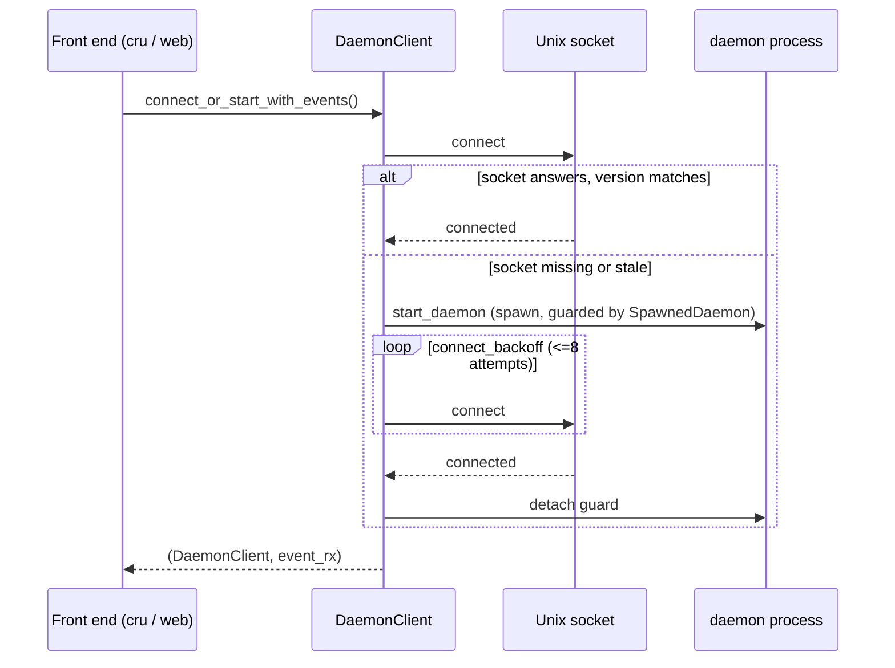
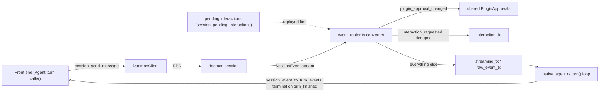

# RPC Client

The `crucible-daemon::rpc_client` module is a client library that ships
inside the `crucible-daemon` crate. It is the one path any front end
(`crucible-cli`, `crucible-web`, `acp_handle.rs`, `provider/genai_handle.rs`)
uses to reach a running daemon over its Unix socket. It owns connection
setup, JSON-RPC framing, request/response correlation, and the typed
wrappers around each RPC method. It does not run daemon business logic; it
sends intent and decodes the daemon's answer.

## Purpose and ownership

Per `AGENTS.md`, `crucible-daemon` owns "Sessions, admission, tools,
storage, retrieval, review, plugin lifecycle." This module is the *client*
half of that boundary, living in the same crate for convenience but never
executing the daemon's own handlers directly. It must:

- Open and keep a Unix socket connection to the daemon, spawning a daemon
  process if none answers.
- Frame each call as a JSON-RPC request, correlate it to a reply by id, and
  decode the reply into a typed struct or a raw `serde_json::Value`.
- Adapt a daemon-managed session to the generic `crucible_core::turn::Agent`
  and `crucible_core::traits::chat::{AgentHandle, SessionKnobs}` traits, so a
  front end can drive a daemon session the same way it drives any other
  agent backend.

It must not:

- Construct a second agent configuration or a second note-write pipeline.
  Every mutating call is a thin RPC pass-through (`crates/crucible-daemon/src/rpc_client/client/storage.rs`,
  `crates/crucible-daemon/src/rpc_client/client/session.rs`).
- Hold link-index rows, resolved backlinks, or any authoritative state.
  `crates/crucible-daemon/src/rpc_client/storage.rs` refuses several methods
  outright (`inbound_links`, `reindex_links`) rather than fake an answer,
  because "the RPC surface does not expose the rows."
- Decide kiln trust, admission, or mode-based tool filtering. Those stay
  daemon-side; this module only forwards the caller's request and mirrors
  the daemon's answer locally for display.

This matches AGENTS.md's client rule directly: "Clients send intent; they
must not construct a second agent configuration or write pipeline."

## Module map

| Path | Lines | Role |
| --- | --- | --- |
| `crates/crucible-daemon/src/rpc_client/mod.rs` | 55 | Public façade: declares the `agent`, `client`, `error_ext`, `lifecycle`, `storage` submodules and re-exports the client's whole contract (`DaemonClient`, request/response DTOs, `DaemonAgentHandle`, `ChatResultExt`, `rpc_error_message`, `socket_path`). |
| `crates/crucible-daemon/src/rpc_client/error_ext.rs` | 59 | `ChatResultExt` trait (one method, `chat_comm`, that folds any displayable error into `ChatError::Communication`) and `rpc_error_message`, a free function that strips the `RPC error: {json}` envelope down to the daemon's own message. |
| `crates/crucible-daemon/src/rpc_client/lifecycle.rs` | 183 | Synchronous daemon-process utilities: socket path, log path, log rotation on spawn, log tail read, `is_daemon_running`. |
| `crates/crucible-daemon/src/rpc_client/storage.rs` | 621 | `DaemonStorageClient` (`KnowledgeRepository` impl) and `DaemonNoteStore` (`NoteStore` impl): adapt canonical storage traits onto `DaemonClient` RPC calls. |
| `crates/crucible-daemon/src/rpc_client/agent/mod.rs` | 353 | Defines `DaemonAgentHandle` and its constructors, pending-interaction replay, cached-value bootstrap, and `Drop` cleanup. |
| `crates/crucible-daemon/src/rpc_client/agent/agent_handle.rs` | 280 | `impl AgentHandle` and `impl SessionKnobs` for `DaemonAgentHandle`: mode, model, undo, clear-history session-swap, interaction replies, plugin-approval and plugin-turn-limit knobs. |
| `crates/crucible-daemon/src/rpc_client/agent/native_agent.rs` | 149 | `impl crucible_core::turn::Agent` for `DaemonAgentHandle`: the streaming `turn()` loop that a front end drives directly. |
| `crates/crucible-daemon/src/rpc_client/agent/convert.rs` | 646 | Converts daemon `SessionEvent`s to `TurnEvent`s; runs the background `event_router` task that replays pending interactions, splits interaction events from turn-content events, and keeps the shared plugin-approval cache live. |
| `crates/crucible-daemon/src/rpc_client/client/mod.rs` | 1185 | The core `DaemonClient` struct: socket connect/spawn lifecycle, JSON-RPC framing, id correlation, retry/timeout policy, plus the plugin/surface/notification-adjacent RPC methods that have no dedicated submodule. |
| `crates/crucible-daemon/src/rpc_client/client/types.rs` | 134 | Wire types and helpers shared by two or more submodules: `SessionEvent` alias, `DaemonCapabilities`, `VersionCheck`, small param structs, `extract_string_array`. |
| `crates/crucible-daemon/src/rpc_client/client/agent.rs` | 708 | `DaemonClient` methods and DTOs for `session.*` agent/model/mode RPCs, `models.list`, `providers.list`, `embeddings.models`, `skills.*`, `agents.*`, and the plugin-approval/plugin-turn-limit `session.*` RPCs. |
| `crates/crucible-daemon/src/rpc_client/client/session.rs` | 956 | `DaemonClient` methods and DTOs for the bulk of `session.*` RPCs: create, list, get/status/status_items, history, pause/resume/end/delete/archive/clear, replay, send-message (with optional attached comments), interaction-respond, search, export, list/dismiss notifications. |
| `crates/crucible-daemon/src/rpc_client/client/storage.rs` | 986 | `DaemonClient` methods for kiln registry, text/vector/grep search, note CRUD, link graph, pipeline processing, MCP control, webhook ingress, project and filesystem RPCs (including `fs.read`), and `diff.*` RPCs (get/file/comment/resolve_comment/delete_comment/comments) over branch, session-record and proposal diffset sources. |
| `crates/crucible-daemon/src/rpc_client/client/storage_requests.rs` | 480 | Wire-type module backing `storage.rs`'s methods, shared verbatim with the daemon's handlers; also `first_per_note`, the block-to-note dedup helper, and the `Diff*` request/reply DTOs. |
| `crates/crucible-daemon/src/rpc_client/client/proposals.rs` | 184 | `DaemonClient` methods and DTOs for `proposal.*` RPCs: list, get, accept, reject, dismiss, resolve — the decision surface for propose-mode writes. |
| `crates/crucible-daemon/src/rpc_client/client/subscription.rs` | 35 | `DaemonClient` methods for `session.subscribe`/`session.unsubscribe`. |
| `crates/crucible-daemon/src/rpc_client/client/workflow.rs` | 62 | `DaemonClient` methods and DTOs for `workflow.start`/`approve_gate`/`status`/`cancel`. |
| `crates/crucible-daemon/src/rpc_client/client/lua.rs` | 183 | `DaemonClient` methods and DTOs for `lua.*` plugin-lifecycle RPCs: init/shutdown session, discover, health check, generate stubs, run plugin tests. |
| `crates/crucible-daemon/src/rpc_client/client/plugin_requests.rs` | 103 | Wire-type module (no methods) for `plugin.*`/`project.*`/`surface.*` request shapes, shared with the daemon's handlers. |
| `crates/crucible-daemon/src/rpc_client/client/notifications.rs` | 70 | `DaemonClient` methods for `notification.list`/`notification.dismiss`. |
| `crates/crucible-daemon/src/rpc_client/client/tests.rs` | 920 | The test module for the whole `client` submodule: unit tests, wire-format round-trips, live in-process server integration tests, response-correlation tests, and signal-reaper tests. |

## Key types and traits

- **`DaemonClient`** (`crates/crucible-daemon/src/rpc_client/client/mod.rs`).
  The connection object. Fields: `timeout_retries: bool`, `writer:
  Arc<Mutex<OwnedWriteHalf>>`, `next_id: AtomicU64`, `pending_requests:
  Arc<Mutex<HashMap<u64, oneshot::Sender<Value>>>>`, `reader_task:
  Option<JoinHandle<()>>`, `simple_reader:
  Option<Mutex<BufReader<OwnedReadHalf>>>`. Every submodule's `impl
  DaemonClient` block adds methods to this one struct; there is no second
  client type. Created by `DaemonClient::connect`, `connect_or_start`,
  `connect_or_start_with_events`, `connect_to`, or `connect_with_events`.
  Held as an `Arc<DaemonClient>` by `DaemonAgentHandle`,
  `DaemonStorageClient`, and `crucible-cli`'s ACP session map
  (`crates/crucible-cli/src/commands/acp/agent.rs`).
  `crucible-web/src/services/daemon.rs`'s `ReconnectingDaemon` holds it as
  `Arc<RwLock<DaemonClient>>` instead, so a reconnect can replace the
  connection in place without handing every caller a new `Arc`.
- **`SpawnedDaemon`** (private, `client/mod.rs`). A `#[must_use]` guard
  around a freshly spawned `std::process::Child`. `detach()` releases it on
  success; `Drop` reaps it (SIGTERM, poll, SIGKILL) on failure, so a client
  that gave up connecting never leaves an orphan daemon behind.
- **`DaemonAgentHandle`** (`crates/crucible-daemon/src/rpc_client/agent/mod.rs`).
  The struct wiring one daemon session to a front end. Fields include
  `client: Arc<DaemonClient>`, `session_id: String`, `router_session_id:
  Arc<watch::Sender<String>>`, `streaming_rx:
  Arc<Mutex<mpsc::UnboundedReceiver<SessionEvent>>>`, `interaction_rx:
  Option<mpsc::UnboundedReceiver<InteractionEvent>>`, `raw_event_rx:
  Option<mpsc::UnboundedReceiver<SessionEvent>>`, cached mirrors
  (`cached_model`, `cached_context_strategy`, `cached_precognition`,
  `cached_agent_config`, `cached_plugin_approvals`,
  `cached_plugin_turn_limit`), `kiln: Option<KilnName>`, `workspace:
  Option<PathBuf>`, and `event_router_task: Option<JoinHandle<()>>`.
  Created by `DaemonAgentHandle::new`, `new_and_subscribe`, or
  `new_and_subscribe_with_raw_forwarding`; held by
  `crucible-cli/src/factories/agent.rs`, `crucible-daemon/src/acp_handle.rs`,
  `crucible-daemon/src/agent_manager/models.rs`, and
  `crucible-daemon/src/provider/genai_handle.rs`, each of which uses it
  polymorphically through `Agent`/`AgentHandle`.
- **`PluginApprovals`** (`crates/crucible-daemon/src/rpc_client/agent/convert.rs`,
  `pub(crate)`). A cloneable newtype around `Arc<Mutex<BTreeMap<String, PluginApproval>>>`,
  shared between `DaemonAgentHandle`'s `cached_plugin_approvals` field and its
  `event_router` task. The router applies every `plugin_approval_changed`
  event to it, so a change made by another client, or by the daemon's own
  plugin-loop-limit logic, is visible on this handle without a new fetch.
- **`AgentHandle`, `SessionKnobs`, `Agent`** (`crucible_core::traits::chat`,
  `crucible_core::turn`). The generic traits `DaemonAgentHandle` implements.
  It is the daemon-proxy *instance* of these traits; other instances (ACP,
  a direct provider handle) implement the same traits so a front end never
  branches on which backend it holds.
- **`DaemonStorageClient` / `DaemonNoteStore`** (`crates/crucible-daemon/src/rpc_client/storage.rs`).
  `KnowledgeRepository` and `NoteStore` implementations that hold `Arc<DaemonClient>`
  (and, for `DaemonNoteStore`, an `Arc<DaemonStorageClient>`) and translate
  every trait method into an RPC call. Created by
  `crucible-cli/src/factories/storage.rs`.
- **`SessionCreateRequest` / `SessionCreateParams` / `SessionAgentSpec`**
  (`crates/crucible-daemon/src/rpc_client/client/session.rs`). The
  session-creation wire shape and its two logical halves: `SessionCreateParams`
  (session_type, kilns, workspace, recording, isolation) and the optional
  `SessionAgentSpec` (agent identity, provider, model, prompt). `build_create_request`
  merges them and derives `configure_agent` from whether an agent spec was
  given.
- **`ProposalListRequest` / `ProposalIdRequest` / `ProposalAcceptRequest` /
  `ProposalRejectRequest` / `ProposalResolveRequest`**
  (`crates/crucible-daemon/src/rpc_client/client/proposals.rs`). The request
  DTOs behind every `proposal.*` RPC, all built around
  `crucible_core::proposal::{Proposal, ProposalFile, ProposalId}`. `paths`
  (legacy bare path strings) and `files` (root-qualified `ProposalFile`
  identities) are mutually exclusive on accept and reject; an empty `paths`
  and an empty `files` together means every file of the proposal.
- **Wire-shared request types** (`crates/crucible-daemon/src/rpc_client/client/plugin_requests.rs`,
  `storage_requests.rs`, and similar structs inline in `agent.rs`/`session.rs`/`lua.rs`).
  Structs that derive both `Serialize` and `Deserialize` so the client
  serializes and the daemon's own handler deserializes the identical type —
  called "gate A6" in the code's own comments. This is the module's version
  of AGENTS.md's "closed sets need one exhaustive table," applied to wire
  contracts: one struct, not independently typed ends. The ten `Diff*`
  request/reply types (`DiffGetRequest`, `DiffFileRequest`,
  `DiffCommentRequest`/`Reply`, `DiffResolveCommentRequest`/`Reply`,
  `DiffDeleteCommentRequest`/`Reply`, `DiffCommentsRequest`/`Reply`) in
  `storage_requests.rs` are the newest instance of this pattern, shared with
  the daemon's `diff.*` handlers.
- **`VersionCheck`** (`client/types.rs`): `Match` or `Mismatch { client,
  daemon }`. Drives `verify_or_restart` in `client/mod.rs`.

## Flows

### Connect-or-start

1. A front end calls `DaemonClient::connect_or_start()` or
   `connect_or_start_with_events()` (`crates/crucible-daemon/src/rpc_client/client/mod.rs`).
2. `validate_socket_path` rejects a socket path too long for `sun_path`
   before any connection attempt.
3. `connect`/`connect_with_events` tries the existing socket.
4. `verify_or_restart` calls `check_version`; on a build-SHA mismatch it
   calls `shutdown` on the stale daemon and falls through to spawn a fresh
   one.
5. On any connect failure, `start_and_retry` calls `start_daemon` (guarded
   by `SpawnedDaemon`) and retries the connect through `connect_backoff`
   (capped exponential backoff, about 4.6 seconds total across 8 attempts).
6. On success, `SpawnedDaemon::detach` releases the guard; on failure, its
   `Drop` reaps the child.

### Request/response correlation

`call_with_timeout` (`client/mod.rs`) assigns an id from `next_id`
(`AtomicU64`), registers a `oneshot::Sender` in `pending_requests` **before**
writing the request line — the module comment calls this out for both
transport modes. In event mode, `spawn_reader_task` owns the socket's read
half and, per line, either dispatches an event (`type: "event"` or
`"replay_event"`) onto the `mpsc::UnboundedReceiver<SessionEvent>` or routes
a reply by id to its `oneshot` slot (`dispatch_event`/`dispatch_response`).
In simple mode, `read_response_simple` races to become the reader: it awaits
either an already-routed reply or reads lines itself, handing any
mismatched id to another caller's still-pending slot. `call_with_retry`
retries up to twice, only on a fixed set of transient-error substrings
(`TRANSIENT_ERROR_PATTERNS`), and never on an RPC-level `error` field.
`typed_call`/`typed_call_with_timeout`/`typed_call_with_retry`/`typed_unit_call`
build on `call`/`call_with_timeout`/`call_with_retry` to deserialize the
reply into a typed struct.

### Daemon-backed turn

1. A front end builds a `DaemonAgentHandle` via `new_and_subscribe` or
   `new_and_subscribe_with_raw_forwarding` (`crates/crucible-daemon/src/rpc_client/agent/mod.rs`),
   which calls `DaemonClient::session_subscribe`, best-effort fetches any
   pending interactions via `session_pending_interactions`, spawns the
   `event_router` task (`crates/crucible-daemon/src/rpc_client/agent/convert.rs`)
   with that snapshot and a shared `PluginApprovals` map, and best-effort
   fetches cached model/mode/precognition/plugin-approval/plugin-turn-limit
   values.
2. The front end drives the handle as a `crucible_core::turn::Agent`. `turn()`
   (`crates/crucible-daemon/src/rpc_client/agent/native_agent.rs`) sends the
   outgoing message via `DaemonClient::session_send_message`, then locks
   `streaming_rx` and loops `rx.recv()`, converting each `SessionEvent` to
   zero or more `TurnEvent`s via `session_event_to_turn_events`
   (`convert.rs`), stopping at the first `Done` or `Error`. Only
   `turn_finished` (`TurnPayload::TurnFinished`) yields that terminal
   `Done`/`Error`: `message_complete` emits only `TurnEvent::Usage`, when
   usage fields are present, and never ends the turn itself.
3. In parallel, `event_router` (`convert.rs`) reads the same event channel
   at its source, drops events for a session id that a concurrent
   `clear_history` has already superseded (via a `watch::Receiver`
   comparison), replays any pending-interaction snapshot onto `interaction_tx`
   before the live stream starts (de-duplicated against it by request id, so
   a prompt open before subscribe is shown once, not twice), applies every
   `plugin_approval_changed` event to the shared `PluginApprovals` map, and
   splits `interaction_requested` events onto a separate `interaction_tx`
   from everything else.
4. `/clear`-style history reset is `agent_handle.rs`'s `clear_history`: it
   refuses on an ACP-backed session, unsubscribes, ends the old session,
   creates a replacement with the same kiln/workspace, best-effort
   re-applies cached config, resubscribes, then pushes the new session id
   through `router_session_id` so the already-running `event_router` picks
   it up without a restart. This is a different operation from
   `DaemonClient::session_clear` (`session.clear`), which clears the
   session's model context in place — the transcript stays, the session id
   does not change, and the daemon reports it with a `context_cleared` event
   rather than a session swap.
5. A `turn_finished` event carries a `crucible_core::turn::TurnStatus`
   (`Completed`, `Cancelled`, `HandlerCancelled`, `TimedOut`, or `Failed`),
   an optional `stop_reason`, and an optional `error`; `session_event_to_turn_events`
   (`convert.rs`) maps `Completed`/`Cancelled` to `TurnEvent::Done`,
   `HandlerCancelled` to `TurnEvent::Done { stop_reason: Refusal }` ("an end,
   not an error of the connection"), and `Failed`/`TimedOut` to
   `TurnEvent::Error`. A `TurnEvent::ToolCall` carries `call:
   Option<Box<CanonicalToolCall>>` (`crucible_core::types::CanonicalToolCall`):
   `None` when the runtime must classify the call itself from `name` and
   `args`, `Some` when the agent layer already classified it with its own
   diff. `TurnEvent::ToolCallUpdate` carries `id: String` and a mandatory
   `call: Box<CanonicalToolCall>`, replacing the call of that id with a later
   canonical form.

### Storage-as-RPC

`DaemonStorageClient`/`DaemonNoteStore` methods
(`crates/crucible-daemon/src/rpc_client/storage.rs`) each call one
`DaemonClient` method in `crates/crucible-daemon/src/rpc_client/client/storage.rs`
and reshape the JSON reply into canonical `crucible_core::parser`/`storage`
types via private DTOs (`WikilinkDto`, `NoteRecordDto`). `search` extracts a
`Scope` from a `Filter` tree, calls `search_vectors`, reduces its one-row-per-block
reply to one hit per note with `first_per_note`, then re-fetches each
surviving hit with `get()` under the same scope — so hydration never reveals
a note the original scope would have hidden.

`client/storage.rs` also carries plain `DaemonClient` methods that are not
part of the `KnowledgeRepository`/`NoteStore` trait adapters: `fs_read`
(`fs.read`, the same enclosing-root rule as `fs.write`) and the `diff.*`
family (`diff_get`, `diff_file`/`diff_file_request`, `diff_comment`,
`diff_resolve_comment`, `diff_delete_comment`, `diff_comments`), all keyed
on a `crucible_core::diff::DiffsetSource` (a branch, a session record, or a
proposal) rather than a bare session id. A comment anchor, a resolve, or a
delete calls plain `typed_call` and never retries, for the same
non-idempotent-write reason as `proposal.*` below.

## State, concurrency and lifecycle

- **Shared mutable state.** `DaemonClient`'s `writer` and `pending_requests`
  are `Arc<Mutex<_>>`, cloned implicitly through `Arc<DaemonClient>` so many
  callers can hold the same connection.
- **Background tasks.** `spawn_reader_task` (event mode, `client/mod.rs`)
  owns the socket read half for the client's lifetime; `event_router`
  (`agent/convert.rs`) owns the session's event stream for the handle's
  lifetime. Both are `tokio::spawn`ed `JoinHandle`s stored on their owning
  struct and aborted on `Drop`.
- **Channels.** `mpsc::UnboundedReceiver<SessionEvent>` connects the daemon's
  event stream to `event_router`; `mpsc::UnboundedReceiver<InteractionEvent>`
  carries interaction requests to the front end's own loop; a
  `watch::Sender<String>` (`router_session_id`) lets `clear_history` retarget
  the running `event_router` to a new session id without restarting the
  task; `oneshot::Sender<Value>` slots in `pending_requests` carry one RPC
  reply each. A `Vec<InteractionEvent>` snapshot, fetched via
  `DaemonClient::session_pending_interactions` before `event_router` starts,
  is replayed onto `interaction_tx` first and de-duplicated against the live
  stream by request id, so a prompt open before subscribe is shown once, not
  twice.
- **Caches.** `DaemonAgentHandle` mirrors `cached_model`,
  `cached_context_strategy`, `cached_precognition`, `cached_agent_config`,
  `cached_plugin_approvals`, `cached_plugin_turn_limit`, and `mode_id`
  locally so `apply_mode` and similar reads avoid a round trip; every setter
  that changes daemon state (`set_mode_str`, `switch_model`,
  `set_plugin_approval`, `set_plugin_turn_limit`) still RPCs first and only
  updates the mirror after. `cached_plugin_approvals` is a `PluginApprovals`
  (a cloneable newtype around `Arc<Mutex<BTreeMap<String, PluginApproval>>>`)
  shared with the `event_router` task, which also updates it in place on every
  `plugin_approval_changed` event, so a change from another client or the
  daemon's own plugin-loop-limit logic is visible without a new fetch.
  `apply_mode`, by contrast, only ever updates the mirror, to avoid
  re-entering `AgentManager::set_mode` while the caller's mutex is held.
- **Startup.** `connect_or_start`/`connect_or_start_with_events`
  (`client/mod.rs`) is the sole daemon-discovery path; `lifecycle.rs`'s
  `is_daemon_running` and `daemon_log_stdio` support the spawn path with
  status checks and size-bounded log rotation.
- **Shutdown/cleanup.** `DaemonClient::drop` aborts its `reader_task`.
  `DaemonAgentHandle::drop` aborts `event_router_task`, then (if a tokio
  runtime is still reachable via `Handle::try_current()`) spawns a
  fire-and-forget `session_end` call. `SpawnedDaemon::drop` reaps an
  unresponsive spawned daemon with SIGTERM, a grace poll, then SIGKILL.

## Boundaries and invariants

- **Gate A6 (wire-type sharing).** Request DTOs in `plugin_requests.rs`,
  `storage_requests.rs`, and inline in `agent.rs`/`session.rs`/`lua.rs`
  derive both `Serialize` and `Deserialize` so the client's struct and the
  daemon handler's struct are the same type; a field rename here changes
  what the daemon accepts. `client/tests.rs` pins several of these
  round-trips.
- **At-most-once writes.** `proposals.rs`'s decision writes
  (`proposal_accept`/`_paths`/`_files`, `proposal_reject`/`_paths`/`_files`,
  `proposal_dismiss`, `proposal_resolve`/`_file`) and `storage.rs`'s
  `diff_comment`/`diff_resolve_comment`/`diff_delete_comment` all call plain
  `typed_call`/`call`, never `typed_call_with_retry`/`call_with_retry`,
  because a retried write after a timeout could repeat a decision the
  daemon already made — `proposals.rs`'s own module doc states this: "A read
  retries. A decision is sent once, because a retry after a timeout can
  repeat a decision that the daemon already made." `workflow.rs`'s four RPCs
  follow the same pattern without stating the rationale inline.
  `proposal_list`/`proposal_get` and `diff_get`/`diff_file`/`diff_comments`
  use `typed_call_with_retry` because they mutate nothing.
- **Names, not paths.** `SessionKilnRequest.kiln` and
  `DaemonAgentHandle.kiln` are `KilnName`, never a raw path string, matching
  AGENTS.md's kiln-registry rule; `AgentsListCardsRequest` is the documented
  exception (agent cards resolve by directory, not by kiln name).
- **Card/profile separation.** `session.rs`'s `SessionCreateRequest`
  documents that setting both `agent_name` and `agent_card` is
  `INVALID_PARAMS` daemon-side, matching AGENTS.md's "do not conflate cards
  and ACP profiles."
- **Honest absence over a fabricated answer.** `rpc_client/storage.rs`
  returns `Err` from `inbound_links`/`reindex_links` because "the RPC surface
  does not expose the rows," and empty/`None` from `list_note_records`/
  `get_note_by_path` because no RPC carries those index rows to a client and
  "the tools that do live in the daemon" — an honest absence rather than a
  faked answer the RPC surface cannot actually provide.
- **Session-id swap without a task restart.** `router_session_id`
  (`watch::Sender<String>`) is the one channel `clear_history` uses to
  retarget a *running* `event_router` task to a freshly created session,
  instead of tearing the task down and rebuilding it.
- **Reentrancy guard.** `agent_handle.rs`'s `apply_mode` deliberately skips
  the daemon RPC that `set_mode_str` would take, because that round trip
  would re-enter `AgentManager::set_mode` while the caller's own mutex is
  still held.

## Extension seams

A new `session.*`/`storage.*`/etc. RPC method's client-side wrapper lands in
the matching submodule (`client/agent.rs` for agent/model RPCs,
`client/storage.rs` for storage RPCs, and so on), paired with a request
struct in that file or in `storage_requests.rs`/`plugin_requests.rs` if it
also needs to be gate-A6-shared with the daemon's handler. The method itself
goes through `typed_call`/`typed_call_with_retry`/`call` from `client/mod.rs`;
a write with a non-idempotent side effect should follow `proposals.rs`'s
pattern of a plain `typed_call`/`call` — never `typed_call_with_retry`/
`call_with_retry` — rather than retry it. A new RPC also needs a
re-export line in `crates/crucible-daemon/src/rpc_client/mod.rs` if a caller
outside `crucible-daemon` needs it. Per [[Consolidation Plan#Extension seams]],
the daemon-side half of a new RPC starts at `crates/crucible-daemon/src/rpc/dispatch.rs`
and its handler — this module is only the matching client half, proven by
"a real session round-trip," not by this file alone. A new `Agent`/`AgentHandle` backend (an alternative to `DaemonAgentHandle`)
is the "Client" row of [[Consolidation Plan#Extension seams]]: it must carry
the same `crucible_core::protocol::SessionEventMessage` events and satisfy
the `AgentHandle`/`SessionKnobs` contract that `crucible_core::traits::chat`
defines, not a daemon-specific shortcut.

## Tests

- `crates/crucible-daemon/src/rpc_client/client/tests.rs` (920 lines): unit
  tests for backoff timing and failure-message composition
  (`the_connect_backoff_gives_up_in_seconds_not_minutes`), socket-path
  validation, `SessionCreateRequest`/`LuaInitSessionRequest` wire-format
  round trips (gate A6), live in-process-server integration tests over a
  `TempDir` socket (ping, capabilities, version check, kiln listing, session
  create/list/lifecycle, subscribe/unsubscribe, retry-vs-no-retry), a
  `simple_mode_correlation` submodule proving `read_response_simple`
  answers each caller correctly even when replies arrive out of order, and
  `#[cfg(unix)]` SIGTERM/SIGKILL reaper tests for `SpawnedDaemon`.
- `crates/crucible-daemon/src/rpc_client/agent/convert.rs` has an inline
  `#[cfg(test)] mod tests` (about 20 tests) proving each `TurnPayload`
  variant's mapping to `TurnEvent`s in isolation, with no server or mocks.
- `crates/crucible-daemon/src/rpc_client/agent/native_agent.rs` has a small
  inline test module: an object-safety compile check and a capability-flag
  assertion; no turn-loop behavior test lives here.
- `crates/crucible-daemon/src/rpc_client/agent/mod.rs` has an inline
  `#[cfg(test)] mod tests` with
  `pending_snapshot_reaches_the_tui_interaction_channel_once`, proving a
  pending interaction for the handle's own session reaches `interaction_rx`
  exactly once even when the same request id later arrives on the live
  event stream, and that a pending entry for a different session id is
  filtered out.
- `crates/crucible-daemon/src/rpc_client/error_ext.rs` has two inline tests
  proving `rpc_error_message` unwraps a JSON-RPC error envelope to the
  daemon's own message and passes any other error through unchanged.
- `crates/crucible-daemon/src/rpc_client/storage.rs` has an inline
  `#[cfg(test)] mod tests` that binds a real `Server` over a `TempDir` and
  proves `DaemonNoteStore` link/backlink/search behavior against it,
  including that `search` answers each note once despite multiple block
  hits (`first_per_note` end-to-end).
- `crates/crucible-daemon/src/rpc_client/client/storage_requests.rs` has a
  `first_per_note_tests` module: a pure function test with no server.
- `crates/crucible-daemon/src/rpc_client/lifecycle.rs` has an inline
  `#[cfg(test)]` module covering socket-path detection and log rotation
  with `TempDir`.
- `crates/crucible-daemon/tests/rpc_integration/`
  and `crates/crucible-daemon/tests/rpc_session_create_agent_e2e.rs` exercise
  `DaemonClient`/`DaemonAgentHandle` end to end from outside the crate.

**Gaps.** `agent_handle.rs`'s richer surface (`clear_history`'s session-swap
path, mode/model/undo RPC wrappers, and the plugin-approval/plugin-turn-limit
knobs) has no dedicated unit test file of its own; it is covered indirectly
through the `rpc_integration` end-to-end suites rather than in isolation.
`workflow.rs`'s four RPC methods have no visible unit test in this module
(the workflow feature's own tests, if any, live outside this page's file
set). `proposals.rs`'s methods have no unit test in this module either; they
are exercised, if at all, outside this page's file set.

## Findings

- `crates/crucible-daemon/src/rpc_client/client/lua.rs` defines
  `LuaRegisterCommandsRequest` and exports it from `mod.rs`, but no
  `impl DaemonClient` method in `lua.rs` builds or sends it — the type is
  unused from this client's own methods (it may be built ad hoc by a caller
  elsewhere; not confirmed in this file set).
- `crates/crucible-daemon/src/rpc_client/client/notifications.rs`'s
  `notification_list` always sends `kilns: Vec::new()` even though
  `NotificationListRequest` has a `kilns` field; there is no public method
  on this client that can populate it, so kiln-scoped notification filtering
  is unreachable through this RPC client today.
- `crates/crucible-daemon/src/rpc_client/client/workflow.rs`'s writes bypass
  `call_with_retry` with no inline comment explaining why, unlike the
  parallel and better-documented rationale in `proposals.rs`'s module doc —
  a minor commenting-discipline gap, not a behavior defect.
- No conflict with AGENTS.md ownership was found beyond the above: every
  mutating method in this module is a pass-through to a daemon RPC, and the
  deliberate `Err`/empty-value stubs in `crates/crucible-daemon/src/rpc_client/storage.rs`
  are documented as intentional rather than left as silent gaps.
