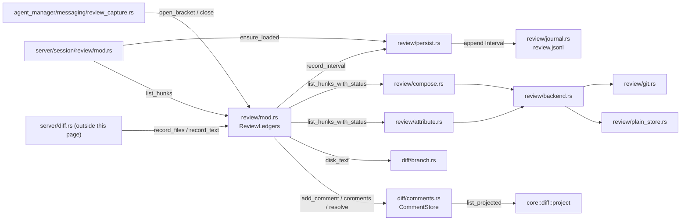

# Review

Three separate mechanisms answer three separate questions about a session's
tracked roots, per [[Meta/CONTEXT]]. The **ledger** answers which tool call
made a change (attribution over `session_base` → current worktree). A
**diffset** — a `Branch`, a `SessionRecord` or a `Proposal` — answers what
changed and carries the comments a human or an agent wrote about it. A
**proposal** answers what a write that a mode marks `propose` would do, before
any decision lands it on disk. None of the three blocks a write any more: the
daemon does not hold a write for review, revert a hunk or undo a rejection.
This page covers `crates/crucible-daemon/src/review/` (the ledger),
`crates/crucible-daemon/src/diff/` (comment storage and chat injection over
any diffset), `crates/crucible-daemon/src/proposals/` (the propose-write
disposition), and `crates/crucible-daemon/src/server/session/review/` (the two
ledger-loading reads the `diff.*` handlers and the Lua bridge still share).
The wire types the first two share are canonical in
`crates/crucible-core/src/diff.rs` and `crates/crucible-core/src/proposal.rs`.

## Purpose and ownership

The ledger (`crates/crucible-daemon/src/review/`) owns three things:

- **The ledger.** An append-only record, per session, of the tree on either
  side of each bracketed tool call (an `Interval`), persisted to
  `review.jsonl`.
- **The composed diff and the session record.** `session_base` → current
  worktree, recomputed on demand: as zero-context hunks attributed to the
  tool calls that made them (`ReviewLedgers::list_hunks_with_status`), or as a
  whole-file summary with line counts and no text
  (`ReviewLedgers::record_files`/`record_text`). Both are read-only — nothing
  in this crate accepts, rejects or reverts a hunk any more.
- **Retention.** Keeping the git trees and plain-store snapshots the ledger
  still names alive against garbage collection, and releasing everything else.

It does not own: tool admission or the decision to bracket a call (that is
`crates/crucible-daemon/src/agent_manager/messaging/review_capture.rs`, in
[[Agent Manager]]); the worktree watcher that reports edits the ledger did not
make (`crates/crucible-daemon/src/watch/external_changes.rs`); the canonical
review types (`HunkId`, `Ledger`, `ComposedHunk`, `Comment`, and siblings live
in `crates/crucible-core/src/session/types/review.rs`, per
[[Core Domain Types]]); resolving a stored comment into chat context
(`crate::server::diff_context::review_context`, outside this page's files, in
[[Agent Manager]]); or the propose-write disposition itself
(`crate::proposals::ProposalStore`, a sibling engine described below with its
own store, lock and RPC family). A write that needs a human decision now uses
propose mode — it is diverted before it reaches disk, by
`crate::tools::notes::propose::NoteWrites` (outside this page's files, in
[[Tools and Admission]]) reading the turn's `WriteMode` — rather than being
held after the fact by anything in this subsystem.

The comment store and the chat-injection builder
(`crates/crucible-daemon/src/diff/`) own the comments of every diffset —
`Branch`, `SessionRecord` and `Proposal` alike — and the one
`<system-message kind="review-comment">` block a chat message's attached
comments become. They do not own resolving a `CommentRef`/`@comment:<id>`
mention against a session's admitted roots (that is
`crate::server::diff_context`, outside this page) or the `diff.*` RPC
handlers themselves (`crate::server::diff`/`crate::server::diff_comments`,
outside this page, in [[Daemon Server]]).

The proposal store (`crates/crucible-daemon/src/proposals/`) owns the whole
propose-write lifecycle: recording a proposed write, superseding an older
pending proposal of the same author and path, merging and conflict-checking
an accept, splitting a partial decision into a new proposal, and staying
`Stale` while the disk it read no longer matches. It does not own deciding
*whether* a write proposes in the first place — that is the mode's
`writes: WriteMode` (`crucible_core::types::mode`), read by
`crate::tools::notes::propose` outside this page — nor the `proposal.*` RPC
dispatch table (`crates/crucible-daemon/src/rpc/dispatch.rs`).

The RPC boundary that remains inside `crates/crucible-daemon/src/server/session/review/`
is now small: two lazy-load reads (`ensure_loaded`/`ensure_record_loaded`)
that the `diff.*` handlers and the Lua bridge call before touching
`am.review`, plus `list_hunks` (which backs only
`cru.session.review_list_hunks` for the reflection pass) and
`emit_review_changed`. It emits no decision any more, because there is no
decision left to emit.

## Module map

### `crates/crucible-core/` — canonical diffset and proposal types

| File | Lines | Role |
|---|---|---|
| `crates/crucible-core/src/diff.rs` | 532 | `DiffsetId`, `DiffsetSource` (`Branch`/`SessionRecord`/`Proposal`), `Diffset`, `DiffFileEntry`, `FileStatus`, `DiffFileText`, `UnreadableRoot`, `CommentRef`, `project()`/`Projection`, `quickfix_line()`, `reference()`. |
| `crates/crucible-core/src/proposal.rs` | 274 | `ProposalId`, `ProposalAuthor`, `ProposalFile`, `ProposedWrite`, `FileConflict`, `ProposalState`, `Proposal`. |

`Comment`, `CommentAuthor`, `CommentAnchor` and `CommentSide` stay in
`crates/crucible-core/src/session/types/review.rs`, beside the ledger's own
`HunkId`, `Ledger`, `Interval`, `ComposedHunk`, `RootStatus`, `Integrity`,
`Skip` and `SkipKind`.

### `crates/crucible-daemon/src/review/`

| File | Lines | Role |
|---|---|---|
| `crates/crucible-daemon/src/review/attribute.rs` | 177 | Projects a bracketed call's added/removed lines through diffs to decide which composed hunks it accounts for. |
| `crates/crucible-daemon/src/review/backend.rs` | 299 | `RootBackend` enum (`Git`/`Plain`) — the one dispatch point between git-tree roots and manifest-backed roots. |
| `crates/crucible-daemon/src/review/compose.rs` | 149 | Computes the zero-context composed diff between `session_base` and the current worktree; no decision or reapplied flag attaches to a hunk. |
| `crates/crucible-daemon/src/review/error.rs` | 87 | `ReviewError` and `ReviewResult`, the error type crossing the RPC boundary. |
| `crates/crucible-daemon/src/review/git.rs` | 356 | All git subprocess plumbing: tree diffing, blob reads, ignore discovery, keep-ref retention; scrubs an inherited `GIT_DIR`/`GIT_WORK_TREE`. |
| `crates/crucible-daemon/src/review/journal.rs` | 447 | `review.jsonl` record format and lenient, append-only replay; carries three read-only tombstone record kinds for backward compatibility. |
| `crates/crucible-daemon/src/review/mod.rs` | 1000 | `ReviewLedgers`, the central engine: brackets, listing, the session record, comment delegation, delegation harvest. No gate, no decision, no revert, no undo. |
| `crates/crucible-daemon/src/review/persist.rs` | 377 | Journal-facing half of `ReviewLedgers`: restore, one-time comment migration, keep-ref refresh/sweep. |
| `crates/crucible-daemon/src/review/plain_store.rs` | 953 | Content-addressed manifest store standing in for git on non-git roots. |

### `crates/crucible-daemon/src/review/tests/`

| File | Lines | Role |
|---|---|---|
| `crates/crucible-daemon/src/review/tests/mod.rs` | 282 | Shared fixtures: `Fixture` (in-memory, git-backed), `Persisted` (journal-backed, git), `PlainKiln` (journal-backed, non-git); a `record_comment` helper for the diffset-owned `Comment` shape. |
| `crates/crucible-daemon/src/review/tests/attribution.rs` | 473 | Hunk identity stability and attribution cardinality; bracket lifecycle and overlap degradation. No decision, revert or per-file gate query — none of those exist any more. |
| `crates/crucible-daemon/src/review/tests/delegation.rs` | 170 | Parent-child interval harvest and turn-coordinate stamping. |
| `crates/crucible-daemon/src/review/tests/identity.rs` | 197 | `HunkId` derivation, multi-root/multi-file independence, backend-misuse errors, and a comment round trip against the diffset-owned `Comment` shape. |
| `crates/crucible-daemon/src/review/tests/persistence.rs` | 511 | Restart survival, journal corruption grading, version-compatibility replay, and one-time migration of a pre-`CommentStore` journaled comment. |
| `crates/crucible-daemon/src/review/tests/record.rs` | 135 | `ReviewLedgers::record_files`/`record_text`: the read-only, per-file session-record diff and its unreadable-root reporting. |
| `crates/crucible-daemon/src/review/tests/retention.rs` | 575 | Keep-ref gc survival, sweep correctness (git and plain), young-snapshot race protection. |

### `crates/crucible-daemon/src/diff/`

| File | Lines | Role |
|---|---|---|
| `crates/crucible-daemon/src/diff/mod.rs` | 10 | Module root: `branch` reads git for a `Branch` diffset, `comments` stores every diffset's comments, `context` builds a comment's chat injection. |
| `crates/crucible-daemon/src/diff/branch.rs` | 673 | A second, independent git-reading module for the `Branch` diffset source — rename detection on, unlike `review/git.rs`. |
| `crates/crucible-daemon/src/diff/comments.rs` | 454 | `CommentStore` — one JSON file per diffset under `<data_home>/diff-comments/`, guarded by `crate::registry_store::RegistryStore`. |
| `crates/crucible-daemon/src/diff/context.rs` | 365 | Builds the one `<system-message kind="review-comment" source="...">` injection for every comment a chat message attaches. |

### `crates/crucible-daemon/src/proposals/`

| File | Lines | Role |
|---|---|---|
| `crates/crucible-daemon/src/proposals/accept.rs` | 233 | `ProposalStore::accept`/`resolve`/`resolve_file`: checked writes as one set, per-file merge-conflict reporting. |
| `crates/crucible-daemon/src/proposals/diff.rs` | 98 | `ProposalStore::diff_files`/`diff_text`: projects a `Proposal` onto `crucible_core::diff::{DiffFileEntry, DiffFileText}`. |
| `crates/crucible-daemon/src/proposals/mod.rs` | 488 | `ProposalStore`: `record_write`/`record_writes`, `supersede`, `Reservations`, `announce`, `end_turn`, turn-scoped memory. |
| `crates/crucible-daemon/src/proposals/rpc.rs` | 243 | The `proposal.*` RPC boundary: `handle_proposal_list/get/accept/reject/dismiss/resolve`. |
| `crates/crucible-daemon/src/proposals/split.rs` | 347 | Partial accept/reject of a proposal's files, splitting the rest into a new `Proposal`. |
| `crates/crucible-daemon/src/proposals/stale.rs` | 194 | The `Open`↔`Stale` staleness check, driven by the daemon's file-watch events. |
| `crates/crucible-daemon/src/proposals/store.rs` | 124 | On-disk persistence: one file per proposal, never removed. |
| `crates/crucible-daemon/src/proposals/tests.rs` | 646 | Integration tests across `accept.rs`/`rpc.rs`/`mod.rs`/`split.rs`/`stale.rs`/`store.rs`. |

### `crates/crucible-daemon/src/server/session/review/`

| File | Lines | Role |
|---|---|---|
| `crates/crucible-daemon/src/server/session/review/mod.rs` | 88 | `ensure_loaded`/`ensure_record_loaded` (load a resumed session's `review.jsonl`), `list_hunks` (backs only `cru.session.review_list_hunks`), `emit_review_changed`. No RPC handlers remain here. |
| `crates/crucible-daemon/src/server/session/review/tests.rs` | 332 | The Lua-bridge/`diff.get`-handler parity regression, plus one end-to-end plugin-turn crossing: a plugin session's own note write lands in its own ledger, attributed to its tool call. |

## Key types and traits

Canonical ledger types live in `crates/crucible-core/src/session/types/review.rs`:

- **`SnapshotId`** — a git tree SHA or a plain-store manifest hash; the arm a
  `RootBackend` dispatches on (`RootBackend::of`).
- **`HunkId`** — a blake3 digest over the root's raw bytes, path, before/after
  text and base `LineRange`, derived by `HunkId::derive`. Content-derived, not
  positional, so an edit above a hunk does not change its identity.
- **`Interval`** — one bracketed call: `tool_call_id`, `node_id`
  (turn coordinate), `roots_touched: Vec<RootInterval>`, `contested: bool`,
  and an optional `child_session_id` for a harvested interval. Created by
  `ReviewLedgers::close`, held in `Ledger`.
- **`Ledger`** — a session's append-only record: `session_id`,
  `session_base: Vec<RootBase>`, `intervals: Vec<Interval>`,
  `children: Vec<ChildLedgerRef>`. Held inside `ReviewLedgers`'s `DashMap`,
  mutated only through `ReviewLedgers` methods.
- **`ComposedHunk`** — the review surface unit: `id`, `root`, `path`,
  `base_range`/`current_range`, before/after text, `tool_call_ids`. Built by
  `compose::compose_root`, attributed by `attribute::attribute_root`,
  consumed by `diff.get`/`diff.file` (outside this page) and by
  `list_hunks`/`cru.session.review_list_hunks`. Carries no decision — there is
  no field on it that a human's accept or reject ever set.
- **`RootStatus`**, **`Integrity`**, **`Skip`**, **`SkipKind`** — per-root
  health and journal-corruption grading, produced by `persist.rs` and
  `journal.rs` and read by `list_hunks_with_status`/`record_files`.
- **`CommentAuthor`**, **`CommentAnchor`** (`Snapshot`/`Commit`/`Proposal`),
  **`CommentSide`** (`Base`/`Current`), **`Comment`** — a line-range-anchored
  comment owned by a diffset, not a session: `id`, `diffset: DiffsetId`,
  `root`, `path`, `anchor`, `side`, `line_range`, `quoted` (the text under the
  range when the comment was made, so a later listing can find it again after
  the text moves), `body`, `author`, `resolved`, `created_at`. Built by
  `Comment::new(diffset, anchor, root, path, side, line_range, quoted, body,
  author)`.

Canonical diffset and proposal types live in `crates/crucible-core/src/diff.rs`
and `crates/crucible-core/src/proposal.rs`:

- **`DiffsetId`**, **`DiffsetSource`** (`Branch { root, base, head }` /
  `SessionRecord { session }` / `Proposal { id }`) — a closed set with one
  exhaustive match in the daemon and one in the web client;
  `DiffsetSource::id()` gives one id per source, memoized by content.
- **`Diffset`** (`id`, `source`, `files: Vec<DiffFileEntry>`,
  `unreadable_roots: Vec<UnreadableRoot>`) and **`DiffFileText`**
  (`base_text`, `current_text`) — the two wire shapes `diff.get` and
  `diff.file` send. `unreadable_roots` is filled only for a `SessionRecord`
  diffset; a `Branch` or a `Proposal` reads its files directly, so the list is
  always empty for them.
- **`FileStatus`** (`Added`/`Modified`/`Deleted`/`Renamed { from }`) — the
  closed set a `DiffFileEntry` carries in place of the old `ReviewState`.
- **`CommentRef`** — the wire reference a client attaches to a chat message:
  a comment `id` plus the `DiffsetSource` that owns it.
- **`project()`**/**`Projection`** (`Kept`/`Moved(LineRange)`/`Outdated`) — finds
  a comment's `quoted` text in the current text of its side, preferring the
  match nearest the stored range, so a comment survives an edit elsewhere in
  the file.
- **`ProposalId`**, **`ProposalAuthor`** (`Plugin { name }`/`Session { id }`),
  **`ProposalFile`**, **`ProposedWrite`** (`root`, `path`, `base`, `new_text`,
  `remove`, `moved_from`), **`FileConflict`** (`root`, `path`, `disk_text`,
  `merged_text`, `regions`).
- **`ProposalState`** (`Open`/`Stale`/`Conflicted { files }`/`Accepted`/
  `Rejected { reason }`/`Superseded { by }`/`Dismissed`), with `is_listed()`
  and `is_pending()` — both exhaustive matches, no wildcard arm.
- **`Proposal`** (`id`, `author`, `session`, `title`, `rationale`,
  `created_at`, `state`, `writes: Vec<ProposedWrite>`), with `writes_path`,
  `moved_to`, `moved_from`, `changes()` and `describe()` (auto-titles: "Move
  X to Y" / "Delete X" / "Change X" / "Change N notes").

Types defined inside `crates/crucible-daemon/src/review/`:

- **`ReviewLedgers`** — the engine. Fields are private `DashMap`s: `ledgers`,
  `open` (the bracket-overlap registry, keyed by root path), `journals`,
  `integrity`, `parents` (delegation links) — all but `open` keyed by
  `session_id`. Also holds `plain: PlainStore`, `comments: CommentStore`
  (shared across every diffset, not per-session) and an `AtomicU64
  next_handle`. One instance, shared as `Arc<ReviewLedgers>` per
  `AgentManager` as `am.review`.
- **`CaptureHandle`** — returned by `open_bracket`; holds a
  `Weak<ReviewLedgers>` and deregisters its bracket on `Drop`, so a cancelled
  or timed-out tool call cannot leave a root permanently marked contested.
- **`RootBackend`** (`Git`/`Plain`) — created by `RootBackend::of`/`detect`,
  held nowhere; every call re-derives it from a `SnapshotId` or a path so an
  older-built journal entry still routes correctly.
- **`PlainStore`** — `Arc<Inner>` wrapping a `DashMap` stat cache and a
  snapshot/blob directory tree; one instance inside `ReviewLedgers`, used for
  every root `RootBackend::detect` calls `Plain`.
- **`Manifest`** — a `BTreeMap<String, String>` of path to content hash,
  whose blake3-derived `id()` is a `SnapshotId::Plain`; the plain analogue of
  a git tree.
- **`journal::Record`** — the `review.jsonl` line shape: `Header`, `Base`,
  `Rebase`, `Interval`, `Child`, `State {}`, `Comment(JournalComment)`,
  `CommentResolved`, `Rejected {}`, `Undone`. `State`, `Rejected`, `Undone`
  and `Rebase` are permanent, read-only tombstones — the daemon no longer
  writes any of the four, because no hunk has a decision to record and
  `review.rebase` no longer exists; replay reads the tag and skips the body,
  so an old journal still restores. `journal::append` writes only `Header`,
  `Base`, `Interval` and `Child`. `Record::Comment` still preserves the *old*
  on-disk comment shape (`JournalComment`), read exactly once by
  `persist::migrate_comments` into the new `CommentStore`.
- **`RecordFiles`** (`files: Vec<DiffFileEntry>`, `unreadable_roots:
  Vec<UnreadableRoot>`) — the result of `ReviewLedgers::record_files`, the
  session-record half of the diffset model.

Types defined inside `crates/crucible-daemon/src/diff/`:

- **`FileText`** (`Absent`/`Text(String)`/`Binary`/`TooLarge`) — a snapshot or
  disk read, classified before it crosses the wire; `into_shown()` gives the
  `Option<String>` a `DiffFileText` field holds.
- **`CommentStore`** — one JSON file per diffset (`DiffsetComments {
  journal_migrated, source: Option<DiffsetSource>, comments: Vec<Comment> }`),
  each managed through `RegistryStore` (sidecar lock, read, change, atomic
  rename). Sits beside `<data_home>/review-snapshots`
  (`root_beside_snapshots`), not inside it. `list_projected` applies
  `crucible_core::diff::project` to every comment before returning it.
- **`ListedComment`** (`comment`, `outdated`) — a comment after projection.
- **`CommentBlock`**, **`ReviewContext`** (`source: "human"/"agent"/"mixed"`,
  `body`) — the resolved inputs and the built body of one message's comment
  injection, from `crates/crucible-daemon/src/diff/context.rs`.

Types defined inside `crates/crucible-daemon/src/proposals/`:

- **`ProposalStore`** — `files: ProposalFiles` (one JSON file per proposal),
  `turns: Mutex<HashMap<String, ProposalId>>` (the open proposal of each
  session's current turn), `write: Mutex<Reservations>` (one lock guarding
  every decision and every write's supersede pass). One instance, shared as
  `Arc<ProposalStore>` per `AgentManager` as `am.proposals()`.
- **`ProposalError`** (`Busy`/`Ambiguous`/`MixedSelection`/`NotFound`/
  `Settled`/`NoWrite`/`NoConflict`/`WriteFailed`/`Store`) — a `thiserror` enum
  crossing the RPC boundary, mirroring `ReviewError`'s split.
- **`Reservations`**/**`Reservation`** (private) — a `Mutex`-guarded
  held-proposal-id set with a `superseded_on_release` map and a `Drop` impl
  that applies a deferred supersede once a decision's reservation drops — the
  proposal store's own analogue of `CaptureHandle`'s `Drop` backstop, for a
  different race (a decision in flight vs. a concurrent write, not a
  cancelled tool call).

## Flows

### Capture: a tool call becomes an interval

1. `crate::agent_manager::messaging::review_capture::StreamContext::open_review_bracket`
   (outside this page) calls `ReviewLedgers::open_bracket` before a writing
   tool call runs, capturing every tracked root's current tree via
   `RootBackend::capture`.
2. The tool call runs. If a waiter (a permission prompt) sits between the
   bracket opening and the writer actually running, `ReviewLedgers::rebase`
   re-captures every open root and overwrites the tree the interval will be
   measured from, so the wait itself is not folded into the call's
   attribution. This is a per-bracket re-baseline, unrelated to the deleted
   `review.rebase` RPC of the same name's era.
3. `ReviewLedgers::close` re-captures each root (`RootBackend::capture`) and
   compares the new tree against the bracket's before-tree; for each root
   whose tree actually changed it builds an `Interval` and appends it via
   `persist::record_interval` → `journal::append`.
4. `CaptureHandle::Drop` deregisters the bracket's root-overlap entries if the
   caller never reached step 3 (a cancelled turn).

### The composed diff and the session record, on demand

1. `diff.get`/`diff.file` (`crate::server::diff`, outside this page's files)
   or the Lua-only `cru.session.review_list_hunks` reach the ledger through
   `ensure_loaded`/`ensure_record_loaded`
   (`crates/crucible-daemon/src/server/session/review/mod.rs`), which restores
   a resumed session's `review.jsonl` into memory if it is not already open.
2. For the attributed-hunk view, `list_hunks_with_status(session_id)` (no
   scope or turn filter any more — it always answers the whole session)
   computes per-root degradation, then for each tracked root calls
   `compose::compose_root` (the diff) and `attribute::attribute_root` (which
   call made each hunk).
3. For the whole-file session-record view, `record_files(session_id)` walks
   every session-base root, diffs the base tree against disk, and returns a
   `RecordFiles` of `DiffFileEntry` rows (path, `FileStatus`, added/removed
   counts, binary/too-large flags) plus `unreadable_roots` naming any root the
   ledger could not read, so the record does not look complete when it is
   not. `record_text(session_id, root, path)` returns the two texts of one
   file as a `DiffFileText`.
4. Neither view carries or applies a decision. There is nothing here to
   accept, reject or revert.

### Comment: store, list, resolve, delete

1. `diff.comment` (`crate::server::diff_comments`, outside this page's files)
   or an internal caller builds a `Comment::new(...)` and calls
   `CommentStore::add` (`crate::diff::comments`); the ledger's own
   `add_comment`/`comments`/`resolve_comment` methods delegate to the same
   store, scoped to one session's record diffset through
   `record_diffset(session_id)`.
2. `CommentStore::list_projected` runs every listed comment's `quoted` text
   through `crucible_core::diff::project` against the current text of its
   side, so a comment that survives an edit elsewhere in the file is still
   found, and an outdated one is flagged rather than silently mislocated.
3. `resolve_diffset_comment` and `delete_diffset_comment` are deliberately
   distinct: resolve keeps the settled comment in the store; delete removes
   it, so no later listing or quickfix line holds it again.
4. A pre-`CommentStore` journal's `Record::Comment`/`Record::CommentResolved`
   entries are migrated into the store exactly once, on restore
   (`persist::migrate_comments`, guarded by `CommentStore::is_migrated` so a
   second restart neither re-copies nor un-resolves a migrated comment).

### Comment injection: attaching a comment to a chat message

1. A user attaches a stored comment to a chat message, either as a
   `CommentRef` on `session.send_message` or as an `@comment:<id>` mention in
   the text; `crate::server::diff_context::review_context` (outside this
   page's files, in [[Agent Manager]]) resolves each reference against the
   session's admitted roots.
2. `crate::diff::context::message` builds exactly one
   `<system-message kind="review-comment" source="human"|"agent"|"mixed">`
   injection body for every comment one message attaches — never one element
   per comment — escaping the body so a hostile comment or file cannot forge
   a second element.
3. The injection reaches the agent through the same context-injection path as
   any other injected context. A comment reaches the agent only when a chat
   message names it; it is never an automatic side effect of a daemon
   decision.

### Propose: a note write becomes a proposal

1. A session's current turn reads its mode's `writes: WriteMode`
   (`crucible_core::types::mode::ModeDescriptor`, outside this page) into
   `crate::tools::notes::propose::TurnWriteMode` (outside this page, in
   [[Tools and Admission]]) at turn start. The tool dispatcher build in
   `crates/crucible-daemon/src/agent_manager/mod.rs` (outside this page, in
   [[Agent Manager]]) wires this write mode into the note tools: it calls
   `NoteWrites::new` with the slot's write mode, the proposal store and the
   session. A write made while no turn runs, such as a plugin's Bases write,
   reads the same decision fresh through `AgentManager::write_mode_for`
   (`crates/crucible-daemon/src/agent_manager/session_permissions.rs`,
   outside this page, in [[Agent Manager]]).
2. In `WriteMode::Propose`, a note tool's write calls
   `ProposalStore::record_write`/`record_writes`
   (`crates/crucible-daemon/src/proposals/mod.rs`) instead of writing the
   kiln. A second write of the same turn extends that turn's open proposal; a
   write elsewhere supersedes an older *pending* proposal of the same author
   writing the same path (`ProposalStore::supersede`).
3. The store's single `Mutex<Reservations>` guards every decision and every
   write's supersede pass, so a write and a concurrent decision on a
   *different* proposal can race on this one lock but never leave a proposal
   half-written; a decision holds its `Reservation` across its own
   asynchronous file writes without holding the blocking mutex itself.
4. `announce()` emits `proposal_changed` (`crate::event_map::proposal_changed`)
   on the daemon's system session channel after every write, supersede,
   reject and dismiss — a different broadcast target from
   `emit_review_changed`'s session-scoped `review_changed`.
5. `ProposalStore::end_turn` (`crates/crucible-daemon/src/proposals/mod.rs`)
   forgets the turn's open proposal when the turn ends, called from
   `crate::agent_manager::messaging::send` (outside this page, in
   [[Agent Manager]]). A write after that point starts a new proposal
   rather than extending the finished turn's.

### Proposal decision: accept, reject, dismiss, resolve

1. `proposal.accept`/`reject`/`dismiss`/`resolve` reach
   `handle_proposal_*` (`crates/crucible-daemon/src/proposals/rpc.rs`), or
   `cru.proposals.accept`/`reject` reach the same `ProposalStore` methods
   through `DaemonSessionApi::decide_proposal` (`crucible-lua`).
2. Accepting or resolving admits every kiln root the proposal writes
   (`write_roots`) before writing every file of the proposal as one set,
   through the checked write path (`write_many_for_roots` in
   `crates/crucible-daemon/src/file_write.rs`). A
   conflicting file makes the whole proposal `Conflicted { files }`, with
   each `FileConflict` re-derived by `conflict_of()` (a `merge3` three-way
   merge), so the daemon can report every conflicting file even when only one
   file's write actually failed.
3. `split.rs`'s `accept_paths`/`reject_paths` decide a named subset of a
   proposal's files, splitting the rest into a new `Proposal` so a partial
   decision's history survives per file rather than only per turn; a move's
   two halves travel together (`select_files` pulls in the paired write of a
   `moved_from`/`moved_to` pair automatically).
4. `stale.rs`'s `spawn_stale_watch` subscribes to the daemon's event bus; a
   file-watch event on a proposed path flips that proposal between `Open` and
   `Stale` via `check_stale_at`, independent of any accept/reject decision —
   an accept alone decides `Conflicted`, and a newer proposal alone decides
   `Superseded`.

### Delegation harvest

A delegated child session keeps its own ledger over the roots it shares with
its parent. `ReviewLedgers::link_child` records the link;
`ReviewLedgers::harvest_and_clear` (at child teardown, called from
`crates/crucible-daemon/src/agent_manager/mod.rs`) calls
`ReviewLedgers::absorb_child_intervals`, which folds the child's intervals
into the parent's ledger, stamping them with the parent's turn coordinate
rather than the child's, so a turn comparison over the harvested work is
meaningful. See [[Agent Manager]] for the caller side.

### Retention

`persist::sweep_review_refs` (git roots) and `PlainStore::sweep` (plain
roots) are the maintenance-side entry points, called from outside this
page's files. Each reads every session's on-disk journal to build a live
set of claimed trees/snapshots, then releases everything unclaimed and past
its grace window. `git::update_keep`/`drop_keep` and
`PlainStore::keep`/`drop_keep` are the per-session claim/release calls,
invoked from `persist.rs`'s `refresh_keep_refs` and from session deletion.
Proposals have no equivalent sweep: `ProposalFiles` never removes a file, so
the rejection history of a proposal survives for as long as the daemon keeps
the data directory.

## State, concurrency and lifecycle

- **Sharing.** One `Arc<ReviewLedgers>` per `AgentManager`, reached by every
  session as `am.review`. A sibling `Arc<ProposalStore>`, reached as
  `am.proposals()`, is a second, independent engine with its own
  `Mutex<Reservations>` rather than a set of `DashMap`s. Internal ledger
  state is a set of `DashMap`s, most keyed by `session_id` and one (`open`,
  the bracket registry) keyed by root path; no `Mutex`, no single global
  lock.
- **No guard crosses an `await`.** `list_hunks_with_status` clones the
  `Ledger` out of its `DashMap` entry before doing any async work, called out
  in an inline comment as deliberate deadlock avoidance. `ProposalStore`'s
  `Reservation` is held across an accept's asynchronous file writes without
  holding the store's blocking `Mutex`, for the same reason.
- **`Weak` back-references and `Drop` backstops.** `CaptureHandle` holds a
  `Weak<ReviewLedgers>` so it can self-deregister without keeping the engine
  alive, and implements `Drop` to release its bracket when a turn is
  cancelled or times out rather than closed normally. `Reservation` is the
  proposal store's own `Drop`-backed equivalent, releasing a deferred
  supersede when a decision's hold on a proposal ends — a different race (a
  decision in flight vs. a concurrent write), not a cancelled tool call.
- **Overlap registration.** `mark_open`/`mark_closed` (private, `mod.rs`)
  track concurrent brackets per root; a second bracket opening on an already
  open root marks both `contested`, and attribution skips a contested
  interval's hunks rather than guessing.
- **Journal writes are eager.** `journal::append` opens `review.jsonl` in
  append mode and flushes on every record; there is no batching, because
  rewriting the whole file is quadratic over a session and a crash mid-rewrite
  would lose the base record. Only `Header`, `Base`, `Interval` and `Child`
  are written now; `State`, `Rejected`, `Undone` and `Rebase` are read-only
  tombstones an old journal still replays.
- **Watcher suppression.** Every daemon-side write this subsystem makes (a
  capture bracket's own writes) runs inside a suppression window
  (`crate::watch::external_changes::ExternalChangeTracker`) so the worktree
  watch never reports the daemon's own write as an external edit. Nothing in
  this subsystem writes outside a bracket any more — there is no revert or
  undo replay left to suppress.
- **`PlainStore` concurrency.** `capture` runs on `spawn_blocking` over a
  cloned `Arc<Inner>`; a `DashMap` stat cache (size, mtime, inode, hash) is
  consulted before re-hashing a file, with a "racy" same-second exception
  that skips caching a file written within the same second as the capture.
- **Retention sweep grace period.** `PlainStore`'s `PRUNE_GRACE` (one hour)
  and git's keep-ref registration both protect a snapshot or tree captured
  just before its interval is recorded, so a sweep running inside an open
  bracket cannot remove what the closing call is about to name. A `Proposal`
  file has no such grace period, because nothing ever sweeps it.
- **Startup/resume.** `ReviewLedgers::open_or_restore` is the single entry
  point: a fresh session calls `open` and writes a `Header` + one `Base` per
  root; a resumed session with an existing `review.jsonl` calls
  `restore_from_journal`, which never falls through to capturing a fresh
  base on a read error — that would silently empty the composed diff. On a
  journal that still carries pre-`CommentStore` comment records,
  `restore_from_journal` also runs `persist::migrate_comments` once, reading
  each comment's current on-disk text to fill in the new `quoted` field.
- **Teardown.** `clear_session` drops every in-memory map for a session but
  leaves the on-disk journal; "teardown is not deletion." Comments are not
  per-session state to tear down — they live in the shared `CommentStore`,
  keyed by diffset. Keep refs are released separately, by
  `drop_keep_refs`/`PlainStore::drop_keep`, called from session deletion
  outside this page's files.

## Boundaries and invariants

- **One legal mutation path.** The `mod.rs` module doc states it directly:
  any write to a `Ledger` that does not go through a `ReviewLedgers` method
  is a persistence bug; the journal append lives beside every such mutation
  for that reason alone.
- **Fail-closed identity, on replay.** An old journal `State` record naming
  an unrecognised or now-decision-less `HunkId` is skipped on replay, not
  applied and not deleted — `journal::load` keeps it on disk but resurrects
  no decision, because no code reads one any more.
- **Fail-closed journal corruption.** `journal::classify` defaults an
  unclassifiable or multi-root-naming record to `SkipKind::Session`,
  degrading every root under it rather than risking a session record it
  cannot scope reading as accurate.
- **Fail-closed retention.** `PlainStore::sweep` aborts its whole pass with
  nothing removed if any read along the way fails; git's `sweep_review_refs`
  only releases refs it can positively prove are orphaned.
- **Line-number projection, not content matching, for attribution.**
  `attribute::attribute_root`'s own comment: content matching would attribute
  every hunk containing a lone `}` to whichever call last added one anywhere
  in the file.
- **`thiserror` at each RPC-facing boundary, `anyhow` inside each engine**,
  per AGENTS.md: `ReviewError` variants are what an RPC handler can match on;
  `ProposalError` mirrors the same split for the proposal store; internal
  engine plumbing on either side is not required to.
- **Exhaustive backend dispatch.** `backend.rs` carries
  `#![deny(clippy::wildcard_enum_match_arm)]` and
  `#![deny(clippy::match_wildcard_for_single_variants)]` so a third
  `RootBackend` variant cannot compile with a silently-skipped arm.
  `ProposalState::is_listed`/`is_pending` carry the same discipline: a new
  variant fails to compile until both are updated.
- **A proposal decision is silent to the agent unless a pass reads it.**
  Accept, reject, dismiss and resolve all fire `proposal_changed` on the
  system channel and nothing else; an agent's own turn learns of a rejection
  only if a later pass explicitly calls `rejected_proposals()`/
  `cru.proposals.rejected`. This replaces the old ledger's
  "rejection is a conversation event" rule, which no longer applies to
  anything in `crates/crucible-daemon/src/review/` — that rule described the
  now-deleted `reject_hunk` → `inject_context_impl` path.
- **Path-escape refusal, split across two owners.** `crate::server::diff`
  (outside this page) calls `crate::tools::containment::reject_non_normal`
  to refuse a `..` that survives normalization before a comment or a
  session-record read reaches a path, per [[Tools and Admission]]. Separately,
  `crate::diff::comments::CommentStore`'s private `file()` refuses a diffset
  id that is not a safe file name (empty, leading `.`, or a non-alphanumeric
  byte outside `-`/`_`/`.`) before it builds a store filename.
- **Panic avoidance over correctness shortcuts.** `error.rs` documents this
  for `ReviewError::WrongBackend`: reported rather than asserted, because the
  release profile aborts on a panic and takes every live session with it.
  The revert/undo machinery that used to need the same care for a stale
  `start` index is gone along with the mechanism it protected.
- **A comment cannot be deleted from Lua.** `DiffOp` (`crucible-lua`) has
  `Get`/`File`/`Comment`/`ResolveComment`/`Comments` but no `DeleteComment`
  variant, so a plugin can resolve a comment through `cru.diff` but not
  delete one; only the client-facing `diff.delete_comment` RPC can.
- **One comment model, three diffset kinds.** The same `CommentStore`, and
  the same resolve-vs-delete distinction, backs a `Branch`, a `SessionRecord`
  and a `Proposal` diffset uniformly through `DiffsetId` — comments are not a
  session-ledger-only concept.

## Extension seams

- **A new backend** (a third way to snapshot a root) adds a `RootBackend`
  variant; the two `#[deny]` lints in `backend.rs` force every match arm
  inside `backend.rs` itself to be updated before the crate compiles. The
  lints are scoped to that module — `attribute.rs`, `compose.rs` and
  `persist.rs` never match on `RootBackend`'s variants; they only call
  methods on the value, so a new variant only needs a new arm inside
  `backend.rs`.
- **A new `diff.*` RPC method** lands in `crate::server::diff`/
  `crate::server::diff_comments` (outside this page's files, in
  [[Daemon Server]]), not in `server/session/review/mod.rs`, which now only
  supplies the two shared ledger-loading reads other code calls before
  touching `am.review`. When reachable from a plugin, a matching variant is
  added to `DiffOp` (`crates/crucible-lua/src/sessions/mod.rs`).
- **A new `proposal.*` RPC method** lands as a `handle_proposal_*` free
  function in `crates/crucible-daemon/src/proposals/rpc.rs`, re-exported
  `pub(crate)` from `crates/crucible-daemon/src/proposals/mod.rs`, and a
  dispatch entry in `crates/crucible-daemon/src/rpc/dispatch.rs`. A
  plugin-reachable proposal decision is a new `ProposalDecision` variant
  (`crucible-lua`) plus a `DaemonSessionApi::decide_proposal` call, not a
  method on `crate::session_bridge::DaemonSessionBridge` named after review.
- **A new journal record kind** adds a `journal::Record` variant and a
  `journal::classify` arm naming its `SkipKind` on corruption. `State`,
  `Rejected`, `Undone` and `Rebase` are permanent read-only tombstones now,
  not a pattern to model a new *live* record kind after.
- **A new `SkipKind`** is a three-way choice already exhausted
  (`Session`/`Root`/`Informational`); a new corruption case picks one of the
  three rather than adding a fourth without also updating `SkipKind::blocks`.
- **A new `ProposalState` variant** must update both `is_listed()` and
  `is_pending()` (`crates/crucible-core/src/proposal.rs`) — both are
  exhaustive matches with no wildcard arm.
- **A new `DiffsetSource` variant** is forced onto every match on it: a
  `#[cfg(test)] EnumDiscriminants`/`EnumIter` pair in
  `crates/crucible-core/src/diff.rs` generates a test sample
  (`sample_sources`) for it, and the module doc states the daemon and the web
  client each keep one exhaustive match.

## Tests

Every test file in scope is a Rust unit/integration test run under
`cargo`/`nextest` against real git repositories and real temporary
directories — no mocked git, no mocked filesystem:

- `crates/crucible-daemon/src/review/tests/mod.rs` supplies the three shared
  fixtures (`Fixture`, `Persisted`, `PlainKiln`) every other file in the
  directory builds on, plus a `record_comment` helper for the diffset-owned
  `Comment` shape.
- `crates/crucible-daemon/src/review/tests/identity.rs` and
  `crates/crucible-daemon/src/review/tests/attribution.rs` prove the two
  properties the design rests on: a hunk's identity survives an unrelated
  edit elsewhere in the file, and attribution never claims a tool call made a
  change it cannot account for (including under concurrent/contested
  brackets). Neither file proves anything about a decision surviving an edit
  any more, because there is no decision to survive one.
- `crates/crucible-daemon/src/review/tests/delegation.rs` proves a child
  session's intervals reach its parent's journal before the child's ledger
  drops, stamped with the parent's turn — with no claim left that this feeds
  a write-blocking gate.
- `crates/crucible-daemon/src/review/tests/persistence.rs` proves restart
  survival of base and attribution, journal corruption grading, replay of
  pre-`SnapshotId` and pre-`CommentStore` journal formats, and that an old
  journal's `state`/`rejected`/`undone` records are skipped, not applied, on
  replay.
- `crates/crucible-daemon/src/review/tests/record.rs` proves the session
  record's per-file diff (added/removed counts, `FileStatus`, binary/too-large
  flags), its naming of a root the ledger cannot read after that root is
  deleted, and that an unknown session's record reads as simply empty rather
  than as an error.
- `crates/crucible-daemon/src/review/tests/retention.rs` proves keep refs
  survive an aggressive `git gc`, sweeps release only orphaned claims (both
  backends), and a sweep racing an open bracket keeps what that bracket is
  about to name.
- `crates/crucible-daemon/src/server/session/review/tests.rs` proves the
  Lua-bridge/`diff.get`-handler parity regression (a resumed session's record
  must not read as empty before its journal is restored) and one
  end-to-end plugin-turn crossing: a plugin session's own note write lands in
  that session's own ledger, attributed to its tool call.
- `crates/crucible-daemon/src/diff/comments.rs`, `crates/crucible-daemon/src/diff/branch.rs`
  and `crates/crucible-daemon/src/diff/context.rs` each carry their own
  inline `#[cfg(test)]` module: comment storage/round-trip and the
  resolve-vs-delete distinction, branch diffing (rename, binary,
  over-the-limit, untracked-file cases), and the injection's single-element,
  hostile-body and mixed-author shape, respectively.
- `crates/crucible-daemon/src/proposals/tests.rs` is the proposal store's
  integration suite: a proposal's round trip through its file, a second write
  extending the turn's proposal, supersede, staleness on a file-watch event,
  a partial accept/reject splitting a proposal, and the concurrency ordering
  guarantee that a write landing while its own turn's proposal is being
  decided starts the session's *next* proposal rather than racing the held
  one. `crates/crucible-daemon/src/proposals/split.rs` and
  `crates/crucible-daemon/src/proposals/rpc.rs` each also carry a smaller
  inline `#[cfg(test)]` module of their own.

Gaps: the capture-bracket call site
(`crate::agent_manager::messaging::review_capture`) and the comment-mention
resolver (`crate::server::diff_context::review_context`) are outside this
page's files; their tests live in
`crates/crucible-daemon/src/agent_manager/tests/review_capture.rs` and
`crates/crucible-daemon/src/agent_manager/tests/review_comment_context.rs`,
in [[Agent Manager]]'s scope, not here. No test in this scope exercises a web
client's `diff.comment` call over an actual network transport — the
integration tests build requests in-process — so any network-boundary
regression coverage for that RPC belongs to [[Daemon Server]], not to this
page.

## Findings

`crates/crucible-daemon/src/review/journal.rs` carries one editorial artifact
worth a future pass: the doc comment above `scan_string` is a stray one-line
fragment that reads as if it belongs to the neighboring `scan_strings`,
leaving `scan_string` itself effectively undocumented — a comment-placement
slip, not a behavior bug.

`crates/crucible-daemon/src/review/compose.rs`'s module doc still calls every
composed hunk "independently revertible" — true of the zero-context shape a
hunk is built with, but there is no revert operation left in this crate to
exercise that property; the sentence is a leftover from before `487f95de6`
removed `revert_hunk`, not a description of anything a caller can still do.
