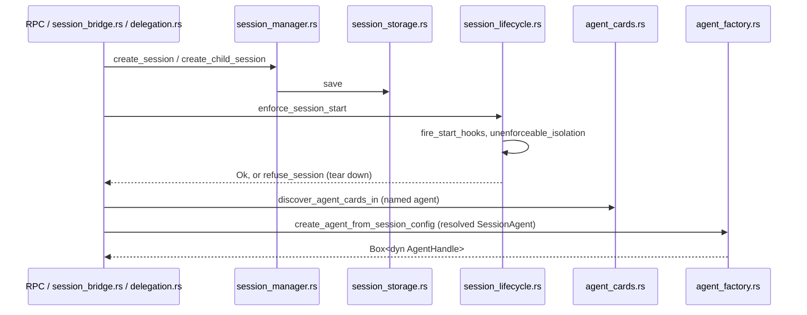

# Session Services

This page covers the daemon modules that make a session exist, construct its
agent, and give it a small set of ancillary services: persistence and
migration, a plugin-facing API, delegated children, transcript
recording/replay, background bash jobs, workflow step execution, and Agent
Skills discovery. The turn loop itself — the gate pipeline a tool call
passes through, `SessionSlot`, precognition — is [[Agent Manager]]'s.
`crates/crucible-daemon/src/rpc/` (the JSON-RPC handlers) and `crates/crucible-daemon/src/server/`
sit outside this page's file list; they are the RPC-facing callers into the
same `SessionManager`/`AgentManager` this page's files build and hold.

## Purpose and ownership

Per `AGENTS.md`, `crucible-daemon` owns "Sessions, admission, tools, storage,
retrieval, review, plugin lifecycle." Within that, this subsystem owns:

- **Session identity, persistence and migration.** `session_manager.rs` is
  the in-memory-plus-persisted CRUD/lifecycle authority; `session_storage.rs`
  is its file-based backend; `session_migration.rs` is the one-time-per-boot
  importer that folds legacy per-kiln session directories into the unified
  store.
- **The single gate a session must pass to become live, and the single owner
  that takes it out of service.** `session_lifecycle.rs` fires plugin
  start/end hooks and checks isolation claims for every creation path,
  including delegation, closing the historical escape where
  `SessionManager::create_child_session` bypassed RPC and ran a delegated
  child with no hooks and no isolation claim. The same file's
  `SessionLifecycle::stop` is now the one owner of every way a session leaves
  service — pause, end, archive, auto-archive, delete, a start refusal, and a
  delegated child's completion.
- **Agent construction.** `agent_factory.rs` turns a resolved `SessionAgent`
  into a boxed `AgentHandle`, for both internal (genai) and ACP agents, and
  refuses construction up front when a provider needs an API key and none is
  configured anywhere. `agent_cards.rs` discovers `.crucible/agents/*.md`
  cards that name a delegation target or a `session.create` agent choice,
  reading the roots injected as `SourceRoots` (`crates/crucible-daemon/src/runtime_path.rs`).
  `rules_files.rs` loads `AGENTS.md`-style project rules into the agent's
  system prompt.
- **Delegation.** `delegation.rs` spawns delegated child sessions as real,
  scheduler-driven sessions with depth/concurrency/trust gating and
  plugin-isolation enforcement.
- **The plugin-facing session API.** `session_bridge.rs` implements
  `crucible_lua::DaemonSessionApi` so Lua plugins drive the same
  `SessionManager`/`AgentManager` machinery an RPC client drives, through
  `cru.session.*`.
- **Recording and replay** of a session's event stream to and from
  `recording.jsonl` (`recording.rs`, `replay.rs`).
- **Background bash jobs**, a session-scoped, non-persisted, ephemeral job
  kind (`background_manager/`).
- **The `workflow.*` execution registry and the daemon's own inline workflow
  step handler** (`workflow_registry.rs`, `workflow_handlers/`).
- **Agent Skills discovery**, an on-disk feature that feeds the agent's
  system prompt (`skills/`).

This subsystem must **not** own note storage, the SQLite link index, or
embedding retrieval — those stay with `crucible-core`'s parser and the
daemon's own knowledge-storage modules; this page's files only call into
them (kiln search inside delegation's trust checks, review keep-refs on
session deletion). It must not run a session-local Lua VM: every Lua-facing
file here (`session_bridge.rs`, `agent_factory.rs`) reaches the one shared
daemon plugin VM through `crucible_lua`'s registration functions, never a VM
of its own, matching `AGENTS.md`'s "The daemon owns one shared plugin VM;
session-local state lives in scopes and `SessionSlot`, not per-session VMs."
It must not construct a second write or agent-configuration path for
plugins: `session_bridge.rs`'s `create_session` calls the same
`ctx.create_session_resolved` an RPC client's `session.create` calls (then
runs `enforce_session_start` itself, the same gate the RPC path runs), and its
`diff`/`decide_proposal`/`list_proposals`/`rejected_proposals` methods call
the same `crate::server::diff`, `crate::server::diff_comments` and
`crate::proposals` handler functions the `diff.*`/`proposal.*` RPC methods
call, through a synthetic `Request` built by `bridge_request`, so a plugin
call and a browser action cannot drift on what a comment or a decision does.

## Module map

Grouped by directory. Lines are as of `582c5e6c1`.

### `crates/crucible-daemon/src/` (session identity, construction, delegation, recording)

| Path | Lines | Role |
|---|---|---|
| `crates/crucible-daemon/src/session_storage.rs` | 1255 | `SessionStorage` trait and `FileSessionStorage`: `meta.json`/`session.jsonl`/`session.md` persistence, kiln name↔path translation, directory/id agreement enforcement, scope-floor re-check on load. |
| `crates/crucible-daemon/src/session_bridge.rs` | 1188 | `DaemonSessionBridge`, implementing `crucible_lua::DaemonSessionApi` — `cru.session.*` (create, fork, send, subscribe, diff/proposal dispatch, undo, and more). |
| `crates/crucible-daemon/src/session_manager.rs` | 1257 | `SessionManager`: in-memory + persisted session CRUD, pause/resume/end/archive/delete, `modify_session`'s mutate-in-place write path, `KilnFilter`/`KilnScope` listing predicates, per-session persist locks, and the lossless-journal read/seq-reseeding path every session-log reader waits on. |
| `crates/crucible-daemon/src/agent_factory.rs` | 871 | `create_agent_from_session_config` — builds a boxed `AgentHandle` (internal genai or ACP), assembles tool definitions, resolves credentials (refusing construction when a provider needs a key and none exists anywhere), builds the two-part `EnrichedPrompt`. |
| `crates/crucible-daemon/src/delegation.rs` | 753 | `DelegationService`/`DelegationSpawner` — spawns delegated child sessions with depth/concurrency/trust gating, tearing a failed or finished child down through `SessionLifecycle::stop`. |
| `crates/crucible-daemon/src/session_migration.rs` | 455 | One-time-per-boot relocation of legacy `<kiln>/.crucible/sessions/{id}` directories into the daemon's unified sessions root, with id/kilns/workspace re-stamping. |
| `crates/crucible-daemon/src/agent_cards.rs` | 775 | Discovers `.crucible/agents/*.md` agent cards for delegation targets and `session.create`, tiered by priority over `SourceRoots`-injected sources (personal, workspace, kiln, `runtimepath`, active-plugin directories) with full-name coexistence and `resolve_card` ambiguity handling. |
| `crates/crucible-daemon/src/replay.rs` | 434 | `ReplaySession` — replays a recorded transcript back through `EventBus::publish_recorded` as a synthetic, kiln-less chat session, preserving each event's recorded `seq`/`timestamp`. |
| `crates/crucible-daemon/src/session_lifecycle.rs` | 896 | `SessionLifecycle` — the one enforcement point for plugin start/end hooks and durable isolation checks on every path that makes a session live, and the one stop owner (`stop`/`stop_from_lua`) for every path that takes a session out of service. |
| `crates/crucible-daemon/src/recording.rs` | 247 | `RecordingWriter` — writes a session's event stream to `recording.jsonl` (header, one line per event, footer). |
| `crates/crucible-daemon/src/rules_files.rs` | 121 | `load_rules_files` — walks a workspace's ancestors for `AGENTS.md`-style rules files, root-first, into the agent's prompt. |
| `crates/crucible-daemon/src/workflow_registry.rs` | 66 | `WorkflowRegistry` — maps a workflow session id to its running `WorkflowExecution` and a per-run `CancellationToken` for early cancel. |

### `crates/crucible-daemon/src/agent_factory/`

| Path | Lines | Role |
|---|---|---|
| `crates/crucible-daemon/src/agent_factory/tests.rs` | 1007 | Tests for prompt building, internal/ACP dispatch, tool assembly and dedup, Lua auth-hook overrides, and the missing-API-key refusal table. |

### `crates/crucible-daemon/src/background_manager/` (background bash jobs)

| Path | Lines | Role |
|---|---|---|
| `crates/crucible-daemon/src/background_manager/bash.rs` | 346 | `BackgroundJobManager::spawn_bash` — spawns and supervises a detached bash job with concurrent stdout/stderr/wait to avoid a pipe deadlock, emitting typed `JobPayload` events through `EventBus`. |
| `crates/crucible-daemon/src/background_manager/mod.rs` | 194 | `BackgroundJobManager` itself: state, list/get/cancel/cleanup, bounded per-session history. |
| `crates/crucible-daemon/src/background_manager/types.rs` | 31 | `BackgroundError`, `RunningJob`, `BashError` (the job event-name constant table was removed; events are typed `JobPayload` variants now). |
| `crates/crucible-daemon/src/background_manager/spawner.rs` | 28 | `impl BackgroundSpawner for BackgroundJobManager` — the seam generic tool code uses to spawn/inspect/cancel jobs. |
| `crates/crucible-daemon/src/background_manager/tests/bash.rs` | 385 | Integration tests: spawn, list, cancel, timeout, history eviction, events (asserted as typed `JobPayload` variants), cleanup, the `BackgroundSpawner` trait object. |
| `crates/crucible-daemon/src/background_manager/tests/mod.rs` | 8 | Shared `create_manager()` fixture. |

### `crates/crucible-daemon/src/session_bridge/tests/` (plugin session API test suite)

| Path | Lines | Role |
|---|---|---|
| `crates/crucible-daemon/src/session_bridge/tests/mod.rs` | 794 | Shared fixtures plus bridge-level tests not owned by a narrower file: permission-gate/plugin-turn behavior, context usage, compact, remove/undo messages. |
| `crates/crucible-daemon/src/session_bridge/tests/create.rs` | 562 | The plugin `cru.session.create` path: card resolution, trust gates, tool-policy override, mutual exclusion of `agent_card`/`agent_name`, and refusal of an SSRF-shaped internal endpoint on `create_session`/`configure_agent`. |
| `crates/crucible-daemon/src/session_bridge/tests/async_session.rs` | 553 | Fork, delegated create/collection, `send_and_collect`, subscribe/unsubscribe, a fork refusal against a persisted `isolation_record`, and `configure_agent`'s isolation-bypass refusal from Lua. |
| `crates/crucible-daemon/src/session_bridge/tests/lifecycle.rs` | 432 | Plugin re-entrancy at session end while the plugin-loader mutex is held: a create from inside the hook is refused, a create from a task the hook starts succeeds and runs the start hooks. |
| `crates/crucible-daemon/src/session_bridge/tests/reflection.rs` | 548 | End-to-end test of the shipped `reflection` Luau plugin: session end, LLM call, note proposal (propose mode, no disk write) read back via `cru.proposals`, run on the reviewed session's own workspace/isolation, and gated on plugin-created sessions by a `reflection:request` event. |
| `crates/crucible-daemon/src/session_bridge/tests/delegate.rs` | 216 | The `delegate=true` branch reaching a `DelegationSpawner` with a correct `DelegationRequest`. |
| `crates/crucible-daemon/src/session_bridge/tests/message_rows.rs` | 89 | Unit tests for `message_rows`, the log→Lua row shaping function, including plugin/relay-attributed user messages. |
| `crates/crucible-daemon/src/session_bridge/tests/review.rs` | 154 | Error text for malformed `cru.diff.comment` params, and an end-to-end test of listing and accepting/rejecting a delegated child's proposal through the bridge. |
| `crates/crucible-daemon/src/session_bridge/tests/persisted_history.rs` | 49 | Reading an ended session's history after a simulated restart, without reviving it. |
| `crates/crucible-daemon/src/session_bridge/tests/session_json.rs` | 66 | Unit tests for `session_json` and `session_record_json`, the per-session record shapes (workspace/isolation/plugin, omitted rather than `null` when absent). |
| `crates/crucible-daemon/src/session_bridge/tests/auto_title.rs` | 199 | End-to-end test of the shipped `auto-title` Luau plugin, driving `cru.session.messages`/`cru.session.set_title` through a real plugin loader via `plugin.run_command`'s `session_id` parameter. |

### `crates/crucible-daemon/src/session_manager/` and `session_migration/`

| Path | Lines | Role |
|---|---|---|
| `crates/crucible-daemon/src/session_manager/tests.rs` | 904 | `SessionManager` lifecycle tests, storage-failure fault injection, an end-vs-persist interleaving regression, event-seq continuity across a simulated restart/cleanup cycle, and old-transcript migration on load. |
| `crates/crucible-daemon/src/session_migration/tests.rs` | 558 | Relocation, collision, staging-crash-safety, and foreign-`meta.json` security tests. |

### `crates/crucible-daemon/src/skills/` (Agent Skills discovery)

| Path | Lines | Role |
|---|---|---|
| `crates/crucible-daemon/src/skills/discovery.rs` | 1263 | `FolderDiscovery` — source-qualified filesystem walk (`crucible_core::sources::listing`) across builtin/personal/workspace/kiln/plugin/`runtimepath` search paths: the highest-priority source keeps the bare name, every source's skill stays addressable by its full name, with symlink and size hardening. |
| `crates/crucible-daemon/src/skills/parser.rs` | 255 | `SkillParser` — YAML frontmatter plus Markdown body into a `Skill`. |
| `crates/crucible-daemon/src/skills/types.rs` | 104 | `SkillScope`, `SkillSource` (now carrying `namespace`), `Skill`, `ResolvedSkill`, `SkillFrontmatter`. |
| `crates/crucible-daemon/src/skills/context.rs` | 119 | `format_skills_for_context` — the compact, cache-stable tier-1 catalog for the system prompt. |
| `crates/crucible-daemon/src/skills/error.rs` | 29 | `SkillError`/`SkillResult`. |
| `crates/crucible-daemon/src/skills/mod.rs` | 17 | Module wiring and public re-exports. |

### `crates/crucible-daemon/src/workflow_handlers/`

| Path | Lines | Role |
|---|---|---|
| `crates/crucible-daemon/src/workflow_handlers/inline.rs` | 195 | `DaemonInlineHandler` — the `default`-type workflow step handler, driving one real agent turn per step via `AgentManager::send_message_notified` and awaiting its `TurnOutcome` oneshot. |
| `crates/crucible-daemon/src/workflow_handlers/interpolate.rs` | 89 | `interpolate` — substitutes `**name**` tokens from an `OutputScope`. |
| `crates/crucible-daemon/src/workflow_handlers/mod.rs` | 14 | Module wiring; documents the split from the engine's placeholder `DefaultHandler`. |

## Key types and traits

- **`SessionManager`** (`crates/crucible-daemon/src/session_manager.rs`) —
  holds `sessions: DashMap<SessionId, Session>` (the live in-memory cache),
  `storage: Arc<dyn SessionStorage>`, `session_locks: DashMap<String,
  Arc<Mutex<()>>>` (per-session persist serialization),
  `session_workspace_dir: Option<PathBuf>`, `review_snapshot_root`,
  `kiln_registry: Arc<KilnRegistry>`, `journal: crate::lossless_queue::Waiter`
  (the lossless event journal a session-log reader waits on before it reads),
  and `events: Option<crate::EventBus>` (seeds a resumed session's live seq
  counter from its log). Created at daemon composition, held by
  `AgentManager`, `DaemonSessionBridge`, `SessionLifecycle`, and nearly every
  RPC handler. `modify_session` is the one write path for a resident
  session's fields: it takes the persist guard, reads the *live* entry, lets
  a closure mutate it in place and report whether it changed anything, then
  saves — replacing the old `update_session` (save a whole copy over the live
  entry), which could revert a concurrent writer's field change written in
  the gap between that copy's read and its save. `KilnFilter`
  (`Any`/`Attached`/`Kilnless`) is the predicate `list_sessions_filtered`
  uses. `KilnScope` (an ordered `Vec<KilnName>` with `overlaps`) is a separate
  listing predicate used by `server/session/list.rs` and `server/observe.rs`
  (outside this page's files); delegation's trust checks use neither
  `KilnFilter` nor `KilnScope` — they call `AgentManager::refuse_untrusted`
  with the parent kilns (see Flows: Delegation).
- **`SessionStorage` trait** and **`FileSessionStorage`**
  (`crates/crucible-daemon/src/session_storage.rs`) — `save`/`load`/`list`/
  `append_event`/`append_markdown`/`load_events`/`count_events`. Created once
  at boot (`FileSessionStorage::root_for`), held by `SessionManager` as a
  trait object so a different backend could substitute it without changing
  callers.
- **`SessionLifecycle`** (`crates/crucible-daemon/src/session_lifecycle.rs`)
  — holds `sessions: Arc<SessionManager>`, `plugin_loader:
  Arc<Mutex<Option<DaemonPluginLoader>>>`, `event_tx: crate::EventBus` (a
  stop announces itself here once its steps are done), `agents:
  OnceLock<Weak<AgentManager>>` (a weak reference, since `AgentManager` owns
  `DelegationService`, which holds a strong `Arc<SessionLifecycle>`), and
  `plugin_end_claimed: DashSet<String>` for exactly-once teardown per
  start/end pair — the start hooks remove a session's id from the set, so a
  session that ends, revives and ends again runs its end hooks twice, once
  per start/end pair, not once for the daemon's lifetime. Created once at
  daemon startup, bound to `AgentManager` lazily, and called by every
  session-creation path including `DelegationService`. **`StopCause`**
  (`Pause`/`End`/`Archive`/`AutoArchive`/`Delete`/`Refuse`/`ChildDone`),
  **`Stopped`** (`Paused{previous}`/`Ended`/`Archived`/`Deleted`), and
  **`StopError`** (`TurnRunning`/`Session`) are `SessionLifecycle::stop`'s
  cause, success and refusal types.
- **`DaemonSessionBridge`** (`crates/crucible-daemon/src/session_bridge.rs`)
  — implements `crucible_lua::DaemonSessionApi`; holds `ctx: Arc<RpcContext>`,
  `session_manager`, `agent_manager`, `event_tx: crate::EventBus`, a
  `DashMap` of per-session cancel `watch::Sender<bool>` for `subscribe`, and
  an optional `delegation_spawner: Arc<dyn DelegationSpawner>`. Constructed
  at the composition root and consumed by `crucible-lua`'s Lua bindings
  whenever a plugin calls `cru.session.*`.
- **`DelegationService`** (`crates/crucible-daemon/src/delegation.rs`) —
  implements `DelegationSpawner` (`spawn_delegation`, `await_delegation`,
  `list_delegations`, `get_delegation_result`, `cancel_delegation`). Holds
  `records: Arc<DashMap<String, DelegationRecord>>`, `permits:
  Arc<DashMap<String, Arc<Semaphore>>>` (one semaphore per parent, bounding
  concurrent children), `completed: Arc<Notify>`, `event_tx: crate::EventBus`,
  `agent_manager: OnceLock<Weak<AgentManager>>` to avoid the same reference
  cycle `SessionLifecycle` avoids, and `session_lifecycle:
  OnceLock<Arc<SessionLifecycle>>` (the same instance the RPC path binds, so
  a delegated child's teardown and an RPC `session.end` share one
  exactly-once claim; exposed read-only via `session_lifecycle()`).
  `DelegationRequest`/`DelegationSpawned` are the request/response value
  types the `delegate_session` tool and `session_bridge.rs`'s
  `create_delegation` both build.
- **`discover_agent_cards_in`/`resolve_card`** (`crates/crucible-daemon/src/agent_cards.rs`)
  read the injected **`SourceRoots`** (`crates/crucible-daemon/src/runtime_path.rs`)
  — `config_home: Option<PathBuf>`, the deprecated `agent_directories:
  Vec<PathBuf>`, `runtimepath: Vec<PathBuf>`, `plugin_dirs: ActivePluginDirs`
  (each active plugin's directory), `kiln_registry:
  Option<Arc<KilnRegistry>>`, `levels`, and `kiln_priorities`. A bare card
  name resolves, via `resolve_card`, to the card of the highest-priority
  source that has it, or errors on an ambiguous tie; every card also keeps
  its full `namespace:name`. `card_directories`/`discover_agent_cards_in` are
  called by `DelegationService::spawn_delegation` and by `agent_factory.rs`'s
  construction parameters.
- **`CreateAgentFromSessionConfigParams`**, **`AgentFactoryError`**, and
  **`EnrichedPrompt`** (`crates/crucible-daemon/src/agent_factory.rs`) — the
  factory's input parameter struct (carrying `source_roots: &SourceRoots`,
  `kilns: &[PathBuf]` and `configured_api_key: Option<&str>` alongside the
  session config), its `thiserror` error enum (`ClientCreation`,
  `AgentBuild`, `UnsupportedAgentType`, and `MissingApiKey { provider, fix }`
  for a backend that needs a key with none found anywhere), and the
  cache-friendly `{stable, volatile}` prompt split `create_agent_from_session_config`
  returns embedded in the constructed handle.
- **`RecordingWriter`** (`crates/crucible-daemon/src/recording.rs`) and
  **`ReplaySession`** (`crates/crucible-daemon/src/replay.rs`) — the writer
  pairs an `mpsc::Sender<SessionEventMessage>` with a spawned task that
  drains it to disk; the replay session owns a parsed `RecordingHeader`,
  `Vec<RecordedEvent>` and optional `RecordingFooter`, plus a synthetic
  kiln-less `Session`, and holds an `event_tx: crate::EventBus` it feeds
  through `EventBus::publish_recorded` rather than `EventBus::emit`.
- **`WorkflowRegistry`** (`crates/crucible-daemon/src/workflow_registry.rs`)
  — `DashMap<String, (Arc<Mutex<WorkflowExecution>>, CancellationToken)>`,
  keyed by workflow session id; held by the RPC context, populated and
  drained by `workflow.start`/`workflow.cancel` handlers outside this page.
  `cancel_token` lets `workflow.cancel` signal a run's token without taking
  the execution lock, so a cancel between two steps stops the run on the
  driver's next loop iteration rather than waiting for the run to finish.
- **`BackgroundJobManager`** (`crates/crucible-daemon/src/background_manager/mod.rs`)
  — `running: Arc<DashMap<JobId, RunningJob>>`, `history: Arc<DashMap<String,
  VecDeque<JobResult>>>` (bounded per session), `activity: Arc<DaemonActivity>`,
  and `event_tx: crate::EventBus`. `RunningJob`
  (`crates/crucible-daemon/src/background_manager/types.rs`) holds the job's
  `oneshot::Sender<()>` cancel channel, its `JoinHandle`, and a `WorkGuard`
  whose sole purpose is its `Drop`.
- **`FolderDiscovery`** and **`SearchPath`**
  (`crates/crucible-daemon/src/skills/discovery.rs`) — `SearchPath` carries
  an explicit `priority: i32` (from `PriorityLevel::default_priority()`,
  keyed off `SkillScope`, or a configured override) and a `namespace: String`
  naming its source; `SkillScope`'s derived `Ord` is retained for display and
  filtering only, not for precedence. `FolderDiscovery::discover` runs every
  search path through `crucible_core::sources::listing`: the skill from the
  highest-priority source keeps the bare name (its `shadowed: Vec<PathBuf>`,
  on `ResolvedSkill` in `crates/crucible-daemon/src/skills/types.rs`, names
  the `SKILL.md`s of same-named skills at other sources); every other
  same-named skill is kept too, under its full name `namespace:name`.
  `resolve_skill(skills, name)` resolves a bare or full name, erroring on an
  ambiguous bare name tied across sources at one priority. `SkillParser`
  (`crates/crucible-daemon/src/skills/parser.rs`) turns one `SKILL.md`'s
  bytes into a `Skill`; `agent_factory.rs` calls
  `crate::skills::format_skills_for_context` to render the resolved map.
- **`DaemonInlineHandler`** (`crates/crucible-daemon/src/workflow_handlers/inline.rs`)
  — implements `crucible_core::workflow::StepHandler`; holds the workflow's
  session id, an `Arc<AgentManager>`, an `event_tx: crate::EventBus` handle
  (passed through to `send_message_notified`, never subscribed to), and a
  `tokio::sync::Mutex<()> turn_guard` serializing steps against
  `AgentManager`'s single-writer-per-session rule.

## Flows

### Session creation, lifecycle gate, and agent construction

1. A creation path — RPC `session.create`, `session_bridge.rs::create_session`,
   or `delegation.rs::spawn_delegation` — calls
   `session_manager.rs::SessionManager::create_session` (or
   `create_child_session` for a delegated child), which persists a new
   `Session` through `session_storage.rs::FileSessionStorage::save`.
2. Every path then calls
   `session_lifecycle.rs::SessionLifecycle::enforce_session_start`, which
   fires the plugin `on_session_start` hook (`fire_start_hooks`) and checks
   `unenforceable_isolation`; either failure tears the session back down
   (`refuse_session`) rather than leaving a half-live session.
3. Before the factory runs, the caller resolves the agent card itself: the
   RPC `session.create` path (`server/session/create.rs`, outside this page)
   and `delegation.rs::spawn_delegation` each call
   `agent_cards.rs::discover_agent_cards_in` for a named agent and pass the
   already-resolved `SessionAgent` in. When an agent must be built,
   `agent_factory.rs::create_agent_from_session_config` then loads project
   rules (`rules_files.rs::load_rules_files`) and discovers the skills
   catalog (`skills::FolderDiscovery::discover` plus
   `skills::format_skills_for_context`) into the system prompt, then
   dispatches on `agent_type` to build an internal or ACP `AgentHandle`.

At daemon boot, before any of the above runs against a legacy kiln,
`session_migration.rs::migrate_sessions` relocates every
`<kiln>/.crucible/sessions/{id}` directory it finds into `session_storage.rs`'s
unified layout, stamping `id`/`kilns`/`workspace` into the moved `meta.json`
so a later `session_storage.rs::FileSessionStorage::load` cannot be tricked
into writing one session's transcript into another's directory.

### Delegation

1. The `delegate_session` tool (outside this page, in `crate::tools`) or
   `session_bridge.rs`'s `create_delegation` calls
   `delegation.rs::DelegationService::spawn_delegation`.
2. `spawn_delegation` validates depth (`depth_of` walks the
   `parent_session_id` chain, with a 32-level cycle-guard break that is not
   itself the limit; the enforced cap is the parent agent's own
   `delegation_config.max_depth`), the `allowed_targets` allowlist, and calls
   `AgentManager::refuse_untrusted(Some(&child_agent), &parent_kilns,
   parent.workspace.as_deref())` — the one trust gate every admission path
   (create, `configure_agent`, switch model, fork, revive, delegation, attach)
   now shares, which itself resolves classification via
   `resolve_session_classification` and trust via
   `trust_resolution.rs::resolve_provider_trust`. It resolves the target
   agent through `agent_cards.rs::discover_agent_cards_in` (every parent
   kiln, not just the first) then `agent_cards.rs::resolve_card` when a named
   target is given; an ambiguous bare name fails the delegation
   (`JobError::SpawnFailed`) instead of silently missing, and a resolved-card
   match stamps `SessionAgent.agent_card_name`.
3. It acquires a per-parent `Semaphore` permit, calls
   `session_manager.rs::SessionManager::create_child_session`, and enforces
   plugin-isolation transfer or tears the child back down through
   `stop_child`/`stop_child_session` (`StopCause::Refuse`) — which, when a
   `SessionLifecycle` is bound, calls `SessionLifecycle::stop` rather than
   ending the row and separately calling `AgentManager::cleanup_session`.
   This is the same `session_lifecycle.rs::enforce_session_start` gate every
   other creation path passes through, since `create_child_session` alone
   does not run hooks.
4. A spawned watcher awaits the child's turn completion (or times out; a
   `TurnStatus::HandlerCancelled` outcome fails the delegation exactly as
   `Failed` does), builds a `JobResult`, stops the child session through
   `stop_child`/`SessionLifecycle::stop` (`StopCause::ChildDone`), and emits
   `DelegationSpawned`/`DelegationCompleted`/`DelegationFailed` typed
   `JobPayload` events (unchanged wire names) consumed by
   `session_bridge/tests/async_session.rs`'s collection tests and by
   [[Agent Manager]]'s turn loop on the parent side.

### Plugin-facing session API

`session_bridge.rs::DaemonSessionBridge` implements every
`crucible_lua::DaemonSessionApi` method by cloning a manager `Arc` and
returning a boxed future, so most calls reach exactly the manager path an
RPC client reaches — see [[Agent Manager]] for what happens once a turn
starts, and [[Luau APIs]] for the Lua binding on the other side of
`DaemonSessionApi`. A plugin's `send_message` takes one of three paths: a
bare call with no `plugin` name reaches plain `AgentManager::send_message`
exactly as an RPC `session.send` does; a call naming a `plugin` reaches
`AgentManager::send_plugin_message` (an interactive plugin turn, shown with
the plugin's name and counted toward its turn limit: it runs in the
session's stored mode with the plugin's `PluginApproval`, and a permission
prompt waits for the user rather than being denied); and
`send_and_collect` with a `relay` reaches `AgentManager::send_relayed_message`
(a user turn attributed to the named relay, e.g. Discord). `clear_session`
(new plugin-facing verb, no prior equivalent) reaches
`AgentManager::clear_session`. `pause`/`resume`/`end_session` from Lua route
through `ctx.session_lifecycle` — `stop_from_lua(id, StopCause::Pause/End)`
and `enforce_session_start` — the same stop owner and start gate an RPC
client's `session.pause`/`resume`/`end` reach, so the plugin-facing and
RPC-facing lifecycle transitions are provably the same code path.
`request_interaction` no longer times out server-side: a prompt with no
client to answer it stays pending rather than expiring after 300s.
`subscribe`/`send_and_collect` each spawn a task selecting over the
session's cancel `watch::Sender` and the daemon's `EventBus`, buffering
`text_delta` events until a boundary and forwarding `ResponsePart`s over an
unbounded channel; the one event that ends a whole turn on this stream is
`turn_finished` — `message_complete` seals one reply, and there is no
separate `ended` event any more. The `diff`/`decide_proposal`/
`list_proposals`/`rejected_proposals` methods dispatch through
`crucible_lua::DiffOp`/`ProposalDecision` to the same `crate::server::diff`,
`crate::server::diff_comments` and `crate::proposals` handler functions the
`diff.*`/`proposal.*` RPC methods call, via a synthetic `Request` built by
`bridge_request` and unwrapped by `response_result`; the review-ledger
methods (`review_set_state`, `review_comment`, `review_resolve_comment`) are
gone.

### Recording and replay

A recorded session's `recording.rs::RecordingWriter` is constructed and
started (outside this page, at session creation) alongside the session; it
owns the write side of an `mpsc` channel that session events are pushed
into, and its own `tokio::spawn`ed task flushes to `recording.jsonl` every
100 events or 500ms. `replay.rs::ReplaySession::start` reverses this: it
parses the file, builds a synthetic kiln-less `Session`, and spawns a task
that sleeps between recorded events (scaled by a speed multiplier) and
sends each one, with its **recorded** `seq`/`timestamp` preserved, via
`EventBus::publish_recorded`, deliberately bypassing the live sequencing
`EventBus::emit` performs.

### Background bash jobs and workflow steps

`background_manager/bash.rs::spawn_bash` inserts a `RunningJob` into a
`DashMap` only after its supervising task is spawned, then races a
`tokio::select!` between cancellation and a `tokio::time::timeout`-wrapped
concurrent stdout/stderr/`wait()` join (`tokio::try_join!`), moving the
entry into a bounded `history` ring on completion, and emitting typed
`crucible_core::protocol::JobPayload` events (`BashJobSpawned`/
`BashJobCompleted`/`BashJobFailed`/`BackgroundJobCompleted`) through
`crate::EventBus` rather than hand-built JSON. Tool-call code elsewhere
in the daemon reaches this only through the `BackgroundSpawner` trait
(`background_manager/spawner.rs`); see [[Agent Manager]] and [[Tools and Admission]]
for the calling side. Separately,
`workflow_handlers/inline.rs::DaemonInlineHandler::execute` drives one real
agent turn per `default`-type workflow step by calling
`AgentManager::send_message_notified`, then awaiting the returned oneshot's
`TurnOutcome` — `outcome_to_step` maps `TurnStatus::Completed` to
`StepOutcome::Advance` with the turn's final text, and any other terminal
status to `StepOutcome::Fail`; a `ConcurrentRequest` error fails the step at
once, with no retry, because the daemon now suppresses a `turn:complete`
handler's follow-up turn for a turn this handler awaits (see
[[Agent Manager]]), guaranteeing the session slot is free for the next
step. `workflow_registry.rs::WorkflowRegistry` is the map the `workflow.*`
RPC handlers (outside this page) use to hold the running `WorkflowExecution`
each step advances, alongside a per-run `CancellationToken`: `workflow.cancel`
sets the token without taking the execution lock, so a cancel between two
steps stops the run on the driver's next loop iteration instead of waiting
for the run to finish.

## State, concurrency and lifecycle

- **Per-session persistence lock.** `session_manager.rs`'s `session_locks:
  DashMap<String, Arc<Mutex<()>>>` serializes each session's
  read-modify-write cycle against `meta.json`; every mutator takes it before
  persisting. `end_session` deliberately does not evict the session from the
  in-memory map — a documented regression showed eviction racing the persist
  task draining a turn's last broadcast events; eviction is the archive
  sweep's job instead.
- **One stop owner, exactly-once per start/end pair.**
  `session_lifecycle.rs::SessionLifecycle::stop` is the one entry point for
  every way a session leaves service; every RPC pause/end/archive/delete,
  the auto-archive sweep, the Lua pause/end, a start refusal, and the three
  delegation-teardown sites all call it (or `stop_from_lua`, for Lua that
  already holds the plugin-loader mutex and cannot await it). Its private
  `run_end_stage` (the old `fire_session_end`) fires the plugin
  `on_session_end` hooks under the plugin-loader mutex, guarded by
  `plugin_end_claimed: DashSet<String>` so a concurrent second caller's
  `insert` loses and skips them — but the start hooks remove a session's id
  from that set, so the guard is exactly-once *per start/end pair*, not
  once for the daemon's lifetime: a session that ends, revives, then ends
  again runs its end hooks twice. `stop` also runs the session's own
  `session:ended`-scoped observers before the handler/statusline sweep
  removes them (the sweep used to remove the row before the bus dispatched
  the event, so that observer never ran), and, for `Archive`/`Delete`, stops
  each delegated child the same way. Calling `stop` on an already-ended
  session now returns `Err(StopError)` rather than silently no-op'ing.
- **Durable isolation requirement.** A session's isolation requirement
  survives a restart: `session_lifecycle.rs::enforce_session_start` refuses
  a session whose *persisted* requirement (its own request, or a stored
  `IsolationRecord` from an earlier plugin claim) has no live claim after
  that start, and persists a claim via `record_isolation`. Every revive path
  (`resume_from_storage`, revive-on-send, the Lua `resume`) re-runs
  `enforce_session_start`, so an empty in-memory isolation registry after a
  restart is no longer misread as "never needed a sandbox."
- **A `tokio::task_local!` marks plugin-loader ownership.**
  `session_lifecycle.rs` sets `HOLDS_PLUGIN_LOADER` around every plugin-Lua
  call it makes; `enforce_session_start` checks it first and refuses — with
  a message naming the recourse (create or resume from Lua that does not
  hold it, or the `session.resume` RPC) — a session create/resume attempted
  from inside plugin Lua that already holds the (non-reentrant) mutex,
  rather than deadlocking on it.
- **Mutate-in-place, not read-copy-then-overwrite.**
  `session_manager.rs::SessionManager::modify_session` takes the persist
  guard, reads the live entry, and lets its closure mutate that entry in
  place before saving — fixing a lost-update race where a writer that read
  a stale copy under the old `update_session` could revert another writer's
  concurrent field change (e.g. a `set_title` racing a context-window
  write).
- **Event seq survives a restart.** `session_manager.rs`'s `seed_seq`, run
  from `resume_session_from_storage`, scans a resumed session's persisted
  log for its highest `seq` and seeds the daemon's live `EventBus` counter
  above it, so a client cursor does not see events renumbered from 1 after a
  restart; `settle_history` (awaited by `load_session_events`,
  `count_session_events`, and every other session-log reader) blocks until
  every event published before the call has reached the session's log,
  since the broadcast can reach a client before the persist task writes the
  event.
- **Delegation concurrency.** `delegation.rs`'s per-parent `Semaphore`
  (`try_acquire_owned`) bounds concurrent children atomically against races;
  `await_delegation`'s per-delegation `watch` channel uses `send_replace` so
  a result is never discarded if no caller has subscribed yet; the spawned
  completion watcher's `timeout` cancels the child's turn and releases the
  permit on expiry.
- **Session bridge subscriptions.** `session_bridge.rs` holds a `DashMap` of
  per-session cancel `watch::Sender<bool>`; `subscribe`'s spawned task
  self-prunes its map entry once no receivers remain.
- **Background job lifecycle.** `background_manager/mod.rs`'s
  `RunningJob::task_handle` and `WorkGuard` fields are stored purely to stay
  alive and to `Drop` — dropping either early would detach the task or
  release the daemon-exit guard prematurely. History is a bounded, per-session
  `VecDeque` (`MAX_HISTORY_PER_SESSION`); jobs do not persist across a daemon
  restart, per the module's "session-scoped, ephemeral" contract.
- **Recording/replay tasks.** `RecordingWriter::start` and
  `ReplaySession::start` each own one `tokio::spawn`ed task with no shared
  state beyond the channel/broadcast handle passed in; a recording's
  `started_at` is stamped at construction, not inside the spawned task, so a
  delayed schedule cannot produce a spuriously short `duration_ms`.
- **Workflow registry cleanup and cancellation.**
  `workflow_registry.rs::WorkflowRegistry` enforces no lifecycle itself;
  insertion, lookup, cancellation-token signaling and removal are the whole
  contract, and the caller (`workflow.cancel` or normal session end) is
  responsible for calling `remove`. Each run gets its own `CancellationToken`
  at `insert`; `workflow.cancel` calls `cancel_token(...).cancel()` before it
  locks the execution, so the daemon's `drive` loop (outside this page) can
  stop a run between steps instead of only mid-turn.
- **Skills discovery has no runtime state.** `skills/discovery.rs::FolderDiscovery::discover`
  is a synchronous, one-shot filesystem walk called once per agent build
  inside `agent_factory.rs`; there is no cache and no background watcher in
  this page's files.

## Boundaries and invariants

- **A live session has had its plugin start hooks fired and its isolation
  claim checked, or it does not exist** — `session_lifecycle.rs`'s central
  invariant, enforced identically for direct creation, resume, and
  delegated-child spawn, closing the documented escape where a delegated
  child could run every tool on the host with no sandbox. The isolation
  requirement itself is now durable (`Session::isolation_record`) rather
  than a live-only claim, so this invariant also survives a daemon restart
  and a plugin pause/resume cycle.
- **A refusal before the turn starts when no API key exists anywhere.**
  `agent_factory.rs`'s `missing_key_refuses(backend, endpoint)` gates a new
  `AgentFactoryError::MissingApiKey { provider, fix }`: any backend whose
  metadata sets `requires_api_key` (`Anthropic`, `Cohere`, `OpenAI`,
  `OpenRouter`, `VertexAI`, `ZAI` — on no endpoint or its own default) with
  none found by
  `crucible_core::config::credentials::resolve_provider_api_key` (env var,
  credential store by provider key, credential store by backend name, then
  the passed-in configured key) refuses construction naming the provider,
  its env var, and `cru auth login --provider <key>`, before any provider
  call is attempted. Exempt: `OpenAI` on a distinct endpoint, `Ollama`,
  `Custom`, and `GitHubCopilot` (self-hosted or bring-your-own-credential
  backends can be keyless); an ACP agent never hits this refusal — it
  brings its own credentials.
- **A `meta.json`'s `id`/`kilns`/`workspace` are re-derived, never trusted
  verbatim, at two independent points.** `session_migration.rs::relocate`
  stamps them before a moved session can be resumed; `session_storage.rs::load`
  re-checks `session.id == session_id` (the directory/id-agreement
  invariant) and re-runs the scope floor (`refuse_persisted_workspace`) on
  every load — "this is the sink rather than one door," since a foreign
  `meta.json` can also arrive by hand-edit or by a synced/shared kiln, not
  only through migration.
- **Prompt-cache stability.** `agent_factory.rs::build_enriched_prompt`
  keeps anything session-specific (kiln paths, workspace directory) out of
  the `stable` half of the prompt, because prompt caching matches on a token
  prefix and one varying line poisons everything cached behind it.
- **Plugin tools are attached at agent build, not filtered per turn.**
  `agent_factory.rs` attaches plugin tools in every mode; excluding them at
  creation time would be captured permanently, since "mode is captured when
  the agent is built" — plan-mode exclusion is `messaging/tool_call.rs`'s
  job instead (see [[Agent Manager]]).
- **Agent cards are discovered only under `.crucible/`.** `agent_cards.rs`
  never scans a kiln's visible top level, because "the visible top level of
  a kiln belongs to notes." A card source's precedence is now the personal
  sources (`agent_directories`, then `~/.config/crucible/agents/`) on top,
  then the workspace, then each attached kiln, then each `runtimepath`
  entry's `agents/` and each active plugin's directory — "a user develops a
  card personally before sharing it, so the personal sources are on top."
  Every card keeps its full `namespace:name`; only the top layer's card of
  one name also gets the bare name, and `resolve_card` errors on an
  ambiguous bare name tied across sources at one priority, rather than
  silently shadowing.
- **Delegation's trust gate is the one gate every admission path shares, not
  a name check.** `delegation.rs` calls `AgentManager::refuse_untrusted`,
  passing the child agent, the parent's kilns and its workspace; the same
  function gates create, `configure_agent`, switch-model, fork, revive and
  attach, so a cloud ACP target on a confidential kiln is refused regardless
  of what the target is named, and regardless of which admission path
  reaches it.
- **Replay never restamps history.** `replay.rs` sends events with their
  recorded `seq`/`timestamp` intact via `EventBus::publish_recorded`,
  deliberately not through `EventBus::emit`'s live sequencing, because
  stamping "would renumber history from the live counter and silently
  rewrite what a recording says happened."
- **A background job's pipes and exit must be awaited concurrently.**
  `background_manager/bash.rs::execute_bash_with_cancellation` reads stdout,
  stderr, and `child.wait()` together via `tokio::try_join!`; awaiting
  `wait()` alone deadlocks once a child writes past a 64 KiB pipe buffer.
- **Skill discovery hardens against three concrete attack shapes.**
  `skills/discovery.rs::parse_skill_file` rejects a symlinked `SKILL.md` or
  symlinked parent directory outright, caps file size before reading
  (`SKILL_MAX_BYTES`), and reads cross-harness directories (`~/.claude/skills`
  and similar) only when `CRUCIBLE_CROSS_HARNESS_SKILLS` opts in — "skill
  text becomes LLM instructions, so silently sourcing prompts from another
  tool's config directory is a real attack surface."

## Extension seams

- **A new agent type** is added as a new match arm in
  `agent_factory.rs::create_agent_from_session_config`'s dispatch on
  `agent_config.agent_type` (currently `"internal"` and `"acp"`); anything
  else returns `AgentFactoryError::UnsupportedAgentType`.
- **A new delegation target shape** (beyond a named agent card or an ACP
  profile) extends `delegation.rs::spawn_delegation`'s target resolution,
  which currently falls through named target → agent card
  (`agent_cards.rs::discover_agent_cards_in` then `agent_cards.rs::resolve_card`,
  which can itself fail with an ambiguity error a plain map lookup never
  could) → ACP profile → clone-of-parent.
- **A new `cru.session.*` plugin verb** is added to the
  `crucible_lua::DaemonSessionApi` trait and implemented in
  `session_bridge.rs`, reusing existing manager methods rather than adding a
  parallel write path — see [[Luau APIs]] for the Lua-side registration.
- **A new workflow step handler** (beyond `default`, `DaemonInlineHandler`)
  lands beside `workflow_handlers/inline.rs`, implementing
  `crucible_core::workflow::StepHandler`, and is wired into the dispatch
  table by `crate::rpc::workflow_handlers` (outside this page's files); see
  [[Daemon Server]] for that dispatch layer.
- **A new Agent Skills search path or scope** extends
  `skills/discovery.rs::default_discovery_paths_from`'s `PathInputs`
  composition and, if it changes precedence, `SearchPath.priority` (from
  `PriorityLevel::default_priority()`) — `SkillScope`'s declaration order is
  retained for display and filtering only, not for precedence.
- **A new background job kind** (only `Bash` exists today) would add a
  `JobKind` variant in `crucible-core` and a sibling to
  `background_manager/bash.rs`, registered through the same
  `BackgroundSpawner` trait `spawner.rs` implements.
- **A new RPC method touching session lifecycle** is a thin caller into this
  page's `pub` surface (`SessionManager`, `DelegationService`,
  `SessionLifecycle`); see [[Daemon Server]] for dispatch and [[Agent Manager]]
  for the turn it may start.

## Tests

- **`agent_factory/tests.rs`** proves prompt-cache-stable/volatile
  separation, internal/ACP dispatch routing, tool-definition dedup and
  mode-based gateway exclusion, session-config propagation (rules files,
  context strategy) reaching the built `AgentHandle`, and
  `a_missing_key_refuses_only_a_backend_that_needs_one` pinning
  `missing_key_refuses`'s table directly, plus an assertion that ACP
  construction never hits the new refusal.
- **`session_manager/tests.rs`** covers the manager's full lifecycle surface
  including two interleaving-focused regressions — a failed `save` must
  never mutate the in-memory copy (`FailingSaveStorage`, exercised through
  `modify_session` now, not the removed `update_session`), and ending a
  session must outlast a concurrently gated `last_activity` persist
  (`GatedSaveStorage`, a real two-worker interleaving, not a timing race) —
  plus two more: `a_resumed_session_continues_its_seq_above_the_log` proves
  the daemon's live event-seq counter for a resumed session seeds above its
  persisted log's highest `seq`, across both a simulated restart and a
  resume after the counter is forgotten at session end, and
  `an_old_transcript_loads_in_its_current_form` proves `load_session_events`
  migrates an old-wire-format `session.jsonl` line to its current shape
  (checked byte-for-byte against a fixture a web-side test also reads).
- **`session_migration/tests.rs`** is a security-regression suite: a
  path-traversing persisted `id`, a crafted `meta.json` naming a victim
  session's directory, and an overly broad `["/"]` `kilns`/`workspace` are
  each proven refused or neutralized, alongside ordinary
  relocation/collision/staging-crash-safety coverage.
- **`session_bridge/tests/`** (eleven files) exhaustively prove the plugin
  surface runs through the same scope/trust/permission machinery the RPC
  path uses: `create.rs` for card/trust resolution and refusal of an
  SSRF-shaped internal provider endpoint, `delegate.rs` for the delegation
  branch, `lifecycle.rs` for plugin re-entrancy at session end (a create
  from inside the hook is refused; a create from a task the hook starts
  succeeds and runs the start hooks), `reflection.rs` for a full real-plugin
  end-to-end pass (session end → LLM call → proposal → accept/reject via
  `cru.proposals`, on the reviewed session's own workspace/isolation, gated
  on plugin-created sessions by a `reflection:request` event),
  `async_session.rs` for fork/collection/subscription plus the persisted
  `isolation_record` fork refusal and the plugin `configure_agent`
  isolation-bypass fix, `auto_title.rs` for the shipped `auto-title` plugin
  driving `cru.session.messages`/`set_title` through a real plugin loader,
  and four narrower files for message-row shaping (including plugin/relay
  attribution), the session JSON shape (`session_json`/`session_record_json`),
  `cru.diff.comment` error text plus an accept/reject proposal flow, and
  post-restart reads.
- **`background_manager/tests/bash.rs`** drives real `bash`/`sleep`/`false`
  subprocesses to prove spawn/list/cancel/timeout/history-eviction/cleanup
  and the `BackgroundSpawner` trait object, asserting each job event as its
  typed `JobPayload` variant rather than a string event name; several tests
  use wall-clock `sleep` rather than condition-polling, a pattern this
  repo's own testing guidance calls out as flake-prone under load, though
  the windows here are generous (200-500ms on sub-100ms operations).
- **Inline `#[cfg(test)]` modules** in `recording.rs`, `replay.rs`,
  `rules_files.rs`, `agent_cards.rs`, `session_storage.rs`,
  `session_lifecycle.rs`, `workflow_handlers/inline.rs`, and
  `workflow_handlers/interpolate.rs` prove each file's own unit-level
  behavior (event coverage and footer correctness, replay timing and
  malformed-line tolerance, rules-file precedence, card precedence, the
  directory/id-mismatch refusal, and `TurnOutcome`-to-`StepOutcome` mapping
  including the dropped-completion-channel failure path, respectively).
- **`skills/discovery.rs`**, **`skills/parser.rs`**, and
  **`skills/context.rs`** each carry substantial inline test modules
  covering the source-qualified collision model (a same-named skill from a
  lower-priority source is kept under its full name, never dropped;
  `resolve_skill` errors on an ambiguous bare name), symlink and size
  rejection, frontmatter parsing edge cases, and deterministic catalog
  formatting.
- **Named gap: `delegation.rs` has no unit-level test module of its own** —
  it carries exactly one `#[cfg(test)]`-gated helper method
  (`session_lifecycle_bound`) and no `mod tests`. Its behavior is exercised
  only through `session_bridge/tests/delegate.rs` (the Lua-facing create
  path) and through integration tests outside this page's file list
  (`crates/crucible-daemon/tests/delegation_integration.rs`,
  `tests/acp_cross_agent_delegation.rs`); the `delegate_session` tool's own
  call path is not covered by any file this page lists.
- **Named gap: `workflow_registry.rs` has no test coverage in this page's
  file list.** It is a five-method `DashMap` wrapper (`new`/`insert`/`get`/
  `cancel_token`/`remove`); any behavior beyond simple insert/get/cancel/
  remove — including the early-cancel race `cancel_token` exists to fix —
  would need a test alongside the `workflow.*` RPC handlers that use it,
  which live outside this page.
- No `#[ignore]`d test appears in this page's file list.

## Findings

- **`delegation.rs` and `workflow_registry.rs` are undertested at the unit
  level** (see Tests). Neither is a correctness defect on its own — both are
  covered indirectly — but a change to `delegation.rs`'s depth/trust/permit
  logic would only fail loudly through `session_bridge/tests/delegate.rs` or
  an out-of-page integration test, not through a test that names this file.
- **Two independent enforcement points for the same session-integrity
  invariant.** `session_migration.rs::relocate` and
  `session_storage.rs::load` each independently re-derive/re-check a
  session's `id`/`kilns`/`workspace`, by design ("this is the sink rather
  than one door") rather than through one shared function. This is
  documented as deliberate defense-in-depth, not an oversight, but it means
  the two must be kept in sync by comment cross-reference rather than by a
  shared helper.
- **`agent_cards.rs`'s `agent_directories` field is explicitly deprecated
  but still live.** It is kept working — one of the two "personal" sources
  (with `~/.config/crucible/agents/`), the highest-priority tier, above the
  workspace and each kiln — rather than removed, matching `AGENTS.md`'s
  expectation of graceful deprecation rather than a silent break.
- No conflict was found between this subsystem's code and the `AGENTS.md`
  ownership or boundary rules it implements: the rules most load-bearing
  here (session lifecycle admission, one shared plugin VM, no second
  plugin write path, note-write disposition shared between plugin and RPC
  surfaces) are each backed by a named test in
  `crates/crucible-daemon/src/session_bridge/tests/`,
  `crates/crucible-daemon/src/session_lifecycle.rs`, or
  `crates/crucible-daemon/src/session_migration/tests.rs`.
