# TUI Chat App

`OilChatApp` is the state machine behind `cru chat`'s screen. It holds the
chat transcript, the input buffer and every piece of display chrome (popups,
modals, notifications), and it turns key events and daemon replies into a new
`Node` tree each frame. It never talks to a daemon itself. All 25 files below
live in `crates/crucible-cli/src/tui/oil/` (the framework the screen is built
from) and `crates/crucible-cli/src/tui/oil/chat_app/` (the screen itself).

## Purpose and ownership

This subsystem owns:

- The `OilChatApp` struct: the chat screen's whole state, and its `view()`
  (render from source), `frame_view()` (render reusing kept transcript rows),
  `update()`, `on_message()` entry points.
- The chat transcript model (`ChatNode`, `ContainerList`) and the display
  cache it renders from (`CachedToolCall`, `CachedSubagent`,
  `CachedShellExecution`), plus the kept-rows cache
  (`TranscriptRows`/`NodeRows`/`Slot`) that a finished node's rows come from
  on later frames.
- The wire vocabulary between the screen and its runner (`ChatAppMsg`,
  `MsgCategory`).
- Key-event routing, autocomplete (including the `/resume` session picker
  and `:plugin-mode`/`:status` pick menus), the `:` REPL and `/` slash-command
  parsers, and the `!` shell modal's key handling.
- Two test doubles: `ComponentHarness` (one component) and `AppHarness` (a
  whole `OilChatApp`), both cfg-gated to test/`test-utils` builds.

This subsystem must not own:

- Handler execution, permission-grant storage, or any decision a different
  client would need repeated. `crates/crucible-cli/AGENTS.md` states the rule
  directly: the CLI and TUI are a view layer, and business logic belongs to
  `crucible-daemon`/`crucible-core`. `crates/crucible-cli/src/tui/oil/chat_app/shell.rs`
  names a fixed past violation in its own comment: the TUI once wrote
  permission grants into its own config file "in a grammar the permission
  engine could not parse," and now only asks the daemon to store them.
- The daemon round trip itself: `Action::Send(ChatAppMsg::…)` is a request,
  not an RPC call. The call, and the reply that re-enters as another
  `ChatAppMsg`, are `crates/crucible-cli/src/tui/oil/chat_runner/`'s job — see
  [[TUI Components]].
- Rendering primitives (layout, styling, terminal writes) — those belong to
  `crucible_oil`, described in [[Oil Renderer]].
- The full-screen (alternate-screen) view and its own transcript/selection
  code. `crates/crucible-cli/src/tui/oil/fullscreen/` is a sibling module
  that this page's `crates/crucible-cli/src/tui/oil/mod.rs` declares
  (`pub mod fullscreen;`) but does not implement; it drives `OilChatApp`
  through this page's `pub(crate)` seams —
  `autocomplete.rs::get_popup_items`, `mod.rs::has_fullscreen_modal`,
  `mod.rs::transcript_frame_slots`/`transcript_node_rows` — rather than
  duplicating any of them. See [[TUI Components]].

## Module map

### `crates/crucible-cli/src/tui/oil/` — framework the screen is built on

| Path | Lines | Role |
| --- | --- | --- |
| `crates/crucible-cli/src/tui/oil/agent_selection.rs` | 5 | `AgentSelection` — `Acp(String)` or `Internal`, which agent backend a session uses. |
| `crates/crucible-cli/src/tui/oil/app.rs` | 87 | `ViewContext`, the per-frame render context; `Action<M>`, what a key/event handler returns. |
| `crates/crucible-cli/src/tui/oil/component.rs` | 140 | `Component` trait (`view()`); test-only `ComponentHarness`. |
| `crates/crucible-cli/src/tui/oil/containers.rs` | 1142 | `ChatNode` and `ContainerList` — the append-only, revision-tracked chat transcript. |
| `crates/crucible-cli/src/tui/oil/event.rs` | 240 | `Event`, `InputAction`, `InputBuffer` — the raw-input model, including mouse reports for the full-screen view. |
| `crates/crucible-cli/src/tui/oil/local_replay.rs` | 235 | `read_recording`/`drive_replay` — replays a recorded session with no daemon. |
| `crates/crucible-cli/src/tui/oil/mod.rs` | 69 | Module root; the curated re-export surface for `tui::oil`, including the `fullscreen` module and `ChatExit`. Declares no agent-handle stand-in module: the runner is not generic over an agent handle, so replay needs none. |
| `crates/crucible-cli/src/tui/oil/render_state.rs` | 29 | `RenderState` — a `Copy` projection of `ViewContext` for leaf renderers. |
| `crates/crucible-cli/src/tui/oil/test_harness.rs` | 220 | `AppHarness` — the app-level test driver. |
| `crates/crucible-cli/src/tui/oil/transcript_rows.rs` | 312 | `TranscriptRows`/`NodeRows`/`Slot` — the kept-rows cache for finished transcript nodes, shared by the native and full-screen views. |
| `crates/crucible-cli/src/tui/oil/viewport_cache.rs` | 307 | `CachedToolCall`, `CachedShellExecution`, `CachedSubagent`, `ToolSourceDisplay` — the display cache `ChatNode` renders from. |

### `crates/crucible-cli/src/tui/oil/chat_app/` — the chat screen itself

| Path | Lines | Role |
| --- | --- | --- |
| `crates/crucible-cli/src/tui/oil/chat_app/autocomplete.rs` | 998 | Popup-autocomplete: trigger detection (`/resume`, `@path:line`), fuzzy filtering, completion insertion. |
| `crates/crucible-cli/src/tui/oil/chat_app/command_handling.rs` | 1024 | `/` slash and `:` REPL dispatch, the `:set` subsystem, mode switching, the `/resume`, status and plugin-approval pickers. |
| `crates/crucible-cli/src/tui/oil/chat_app/command_handling_tests.rs` | 1324 | The dispatch-matrix test suite for `command_handling.rs`, attached via `#[path]`. |
| `crates/crucible-cli/src/tui/oil/chat_app/defaults.rs` | 70 | `impl Default for OilChatApp` — the one constructor. |
| `crates/crucible-cli/src/tui/oil/chat_app/input_handling.rs` | 387 | Key-event dispatch, ordered by which modal or mode owns the screen. |
| `crates/crucible-cli/src/tui/oil/chat_app/message_handlers.rs` | 576 | The four `on_message` sub-dispatchers: stream, config, delegation, UI. |
| `crates/crucible-cli/src/tui/oil/chat_app/messages.rs` | 528 | `ChatAppMsg` and `MsgCategory` — the wire vocabulary. |
| `crates/crucible-cli/src/tui/oil/chat_app/mod.rs` | 1123 | The `OilChatApp` struct; `view()`/`frame_view()`/`compose()`/`chrome()`, `update()`, `on_message()`; module root. |
| `crates/crucible-cli/src/tui/oil/chat_app/model_state.rs` | 65 | `ModelListState`, `SessionChoice`, `SessionListState`, `McpServerDisplay`, `KilnSummary`; re-exports `PluginStatusEntry`. |
| `crates/crucible-cli/src/tui/oil/chat_app/popup_state.rs` | 60 | `PopupState`, `PermissionState`, `PrecognitionState`. |
| `crates/crucible-cli/src/tui/oil/chat_app/repl_command.rs` | 307 | `ReplCommand` — the one table every `:` command reads from. |
| `crates/crucible-cli/src/tui/oil/chat_app/shell.rs` | 254 | The `!cmd` shell modal, and permission/interaction-modal key routing. |
| `crates/crucible-cli/src/tui/oil/chat_app/state.rs` | 142 | Mode-badge helpers (`mode_label`/`mode_badge`), `AutocompleteKind`, `PickSource`, `MessageQueueState`. |

## Key types and traits

- **`OilChatApp`** (`crates/crucible-cli/src/tui/oil/chat_app/mod.rs`). One
  plain struct, built once by `defaults::Default` and held by
  `crates/crucible-cli/src/tui/oil/chat_runner/` (outside this page; see
  [[TUI Components]]) for the life of the chat screen. Its fields fall into
  three groups by comment: daemon-derived viewport state (`container_list`,
  `mode`, `model`, `context_used`, `mcp_servers`, `model_list_state`,
  `proposing_modes`, `status_items`, `plugin_approvals`, `session_list`,
  `proposal_count`, …), local UI chrome (`input`, `popup`,
  `notification_area`, `interaction_modal`, `shell_modal`, `surface_modal`,
  `diff_modal`, `proposals_modal`, `show_thinking`, `show_diffs`,
  `terminal_size: Cell<(u16, u16)>`, `transcript_rows`), and I/O/lifecycle
  fields flagged as tech debt (`shell_output_dir`, `runtime_config`,
  `workspace_files`, `plugin_command_names`). Every other type in this page
  is created to fill, or read from, one of these fields.
- **`ChatAppMsg` / `MsgCategory`** (`messages.rs`). One enum for both
  directions of traffic: outbound intents (`UserMessage`, `SwitchModel`,
  `ConfigSet`) and inbound daemon events (`TextDelta`, `ToolCall`,
  `StreamComplete`); around 85 variants in all, most added long before this
  slice. `OilChatApp::update`'s handlers construct it as
  `Action::Send(ChatAppMsg::…)`; `chat_runner` (outside this page) is the
  sole producer of the inbound variants. `ChatAppMsg::category()` has five
  values, not four: `on_message` (`mod.rs`) handles `MsgCategory::User`
  inline by calling `submit_user_message`, and routes the other four
  categories (`Stream`, `Config`, `Delegation`, `Ui`) to the matching
  `message_handlers.rs` function. Two former events, `ToolCallDiffUpdate`
  and `ToolCallArgsUpdate`, are gone: one `ToolCallUpdate{call_id, args,
  diffs, render, auto_approved}` carries any subset of them, each field
  `None` when that update did not change it. `ModesLoaded` carries
  `Vec<ModeDescriptor>` (id, name, description, icon, color, `writes`), not
  bare ids, because a mode's `writes: WriteMode` (`Apply`/`Propose`) must
  reach the TUI to badge the mode and gate `:proposals`.
  `ChatAppMsg::ProposalChanged` is the inbound counterpart of the
  `proposal_changed` event that `proposal_changed` in
  `crates/crucible-daemon/src/event_map.rs` builds and that
  `crates/crucible-daemon/src/proposals/mod.rs` emits after every proposal
  change, on the system session rather than a user session because a
  proposal belongs to no one session; `handle_ui_msg`
  (`message_handlers.rs`) does not read the carried `ProposalId`, it just
  turns the event into `Action::Send(ChatAppMsg::FetchProposals { open:
  false })` so `proposal_count` and any open `:proposals` view reread the
  whole list.
- **`ChatNode` / `ContainerList`** (`containers.rs`). `ContainerList` owns
  `nodes: Vec<ChatNode>`, a lockstep `revisions: Vec<u64>` (one entry per
  node, bumped by process-wide `next_revision()` on every mutation through
  private `push`/`last_mut`/`entries_mut` helpers), plus
  `background: Vec<CachedToolCall>`. `ContainerList` is a field of
  `OilChatApp` (`container_list`), built by `defaults.rs`, mutated by
  `message_handlers.rs` and `mod.rs::split_slow_tools`, and read by
  `mod.rs::view`/`frame_view` each frame. `ContainerList::revisions()`
  exposes the revision slice; `transcript_rows.rs`'s `RowsKey` reads it
  directly to know when a finished node's cached rows are stale. The
  full-screen `Transcript` (outside this page) never reads `revisions()`
  itself; it gets the same staleness check only through the
  `transcript_frame_slots`/`transcript_node_rows` seam.
- **`CachedToolCall`, `CachedSubagent`, `CachedShellExecution`,
  `ToolSourceDisplay`** (`viewport_cache.rs`). Plain, single-threaded
  projections of daemon-reported tool/subagent/shell state, held inside the
  matching `ChatNode` variant. `CachedToolCall.render: Option<Arc<ToolRender>>`
  holds the render the daemon sent with the call — what the call does, its
  fields, and, after the result, the summary of the result — replacing a
  narrower `lua_primary_arg: Option<Arc<str>>` field. `message_handlers.rs`
  creates and updates `CachedToolCall`/`CachedSubagent` from `ChatAppMsg`;
  `CachedShellExecution` is instead created in
  `shell.rs::update_shell_modal`, from the finished `!cmd` shell modal
  rather than a `ChatAppMsg`. `containers.rs`'s renderers and the component
  renderers in `crates/crucible-cli/src/tui/oil/components/` (outside this
  page) read them.
- **`TranscriptRows` / `NodeRows` / `Slot` / `RowsKey`**
  (`transcript_rows.rs`). The kept-rows cache for a finished transcript
  node: `RowsKey{revision, width, style_generation, show_thinking,
  show_diffs}` decides whether a node's cached `NodeRows` still applies.
  Owned by `OilChatApp.transcript_rows`, built empty by `defaults.rs`, taken
  and put back by `mod.rs::frame_view` (native render) via `mem::take`, and
  read directly by `mod.rs::transcript_frame_slots`/`transcript_node_rows`
  for the full-screen view (outside this page). `TranscriptRows::frame_nodes`
  lays out an unfinished node fresh and reuses a finished node's kept rows;
  `frame_slots` instead returns a size `Slot::Estimate` for a node whose key
  no longer matches, so a full-screen width change does not lay out every
  off-screen node; `node_rows` lays out one node on demand when it scrolls
  on screen. This cache replaces laying out the whole transcript from
  source every frame, which the module's own doc comment measures at about
  160ms at 5,000 rows.
- **`Component` trait** (`component.rs`): one required method,
  `view(&self, ctx: &ViewContext<'_>) -> Node`. `OilChatApp` does not
  implement this trait; it has its own inherent `view`/`frame_view` methods
  with a related signature. Every leaf component in
  `crates/crucible-cli/src/tui/oil/components/` (outside this page)
  implements the trait.
- **`ViewContext` / `Action<M>` / `RenderState`** (`app.rs`, `render_state.rs`).
  `ViewContext` is built fresh each frame — `mod.rs::frame_context` narrows
  the caller's `ViewContext` down to this app's frame clock, spinner frame
  and display flags — and carries the frame clock (`frame_time`);
  `RenderState::from(&ViewContext)` strips it down further to the four
  `Copy` fields a leaf renderer needs. `Action<M>` is the return type of
  `update`/`on_message`; `test_harness.rs::process_action` and the real
  runner both unwind `Action::Batch`.
- **`Event` / `InputAction` / `InputBuffer`** (`event.rs`). `Event` is what
  `chat_runner` feeds into `OilChatApp::update`, with five variants: `Key`,
  `Paste`, `Tick`, `Resize`, and `Mouse` (a `crossterm::event::MouseEvent`,
  for the full-screen mode's mouse reporting). `OilChatApp::update` treats
  `Event::Mouse` as an inert `Action::Continue`, since the native chat has
  no mouse behavior of its own. `InputAction` is what a `KeyEvent` maps to;
  `InputBuffer` is the cursor/history-aware text model `OilChatApp.input`
  holds and `InputAction`s mutate.
- **`ReplCommand`** (`repl_command.rs`) and **`AutocompleteKind` /
  `PickSource`** (`state.rs`). Three closed, table-driven vocabularies:
  `command_handling.rs` matches `ReplCommand` exhaustively (compile-enforced
  by module-level `#![deny(clippy::wildcard_enum_match_arm)]`), with four
  variants added this cycle — `Diff` (`:diff [base]`), `Proposals`
  (`:proposals`), `Status` (`:status`), `PluginMode` (`:plugin-mode`);
  `autocomplete.rs::detect_trigger`/`get_popup_items` match
  `AutocompleteKind`/`PickSource` to decide what a popup lists.
  `AutocompleteKind` gained `Session` (the `/resume` picker); `PickSource`
  gained `Status` and `PluginApproval` (the rows of the `:status` overflow
  view and the `:plugin-mode` menu).
- **`PopupState`, `PermissionState`, `PrecognitionState`**
  (`popup_state.rs`). Three small state groups held as `OilChatApp` fields;
  `autocomplete.rs` mutates `PopupState`, `shell.rs`/`command_handling.rs`
  mutate `PermissionState`, `command_handling.rs` mutates
  `PrecognitionState`.
- **`AgentSelection`** (`agent_selection.rs`). The display choice between an
  ACP-delegated agent and the built-in one, consumed by `chat_app`
  configuration code outside this page. There is no agent-handle stand-in
  type in this page any more: `crate::tui::oil::chat_runner`'s
  `EventLoopParams` (outside this page, see [[TUI Components]]) carries
  `session: Option<&LiveSession>`, and `local_replay.rs`'s replay path passes
  `None`, so a replayed run reaches no daemon by construction rather than by
  an inert trait impl.
- **`ComponentHarness`** (`component.rs`) and **`AppHarness`**
  (`test_harness.rs`). Test doubles, both cfg-gated to `test`/`test-utils`.
  `ComponentHarness` renders one `Component` in isolation; `AppHarness` owns
  a whole `OilChatApp` plus a real `FocusContext`/`FramePlanner` and drives
  it with simulated keys, ticks and messages — see [[Test Architecture]].

## Flows

### A live turn, key to render

This flow crosses `event.rs`, `chat_app/mod.rs`, `input_handling.rs`,
`command_handling.rs`/`shell.rs`, `messages.rs`, `message_handlers.rs`,
`containers.rs` and `viewport_cache.rs`, plus `chat_runner` outside this
page (see [[TUI Components]] and [[RPC Client]] for the daemon side).

```mermaid
flowchart LR
    A["crossterm KeyEvent<br/>(chat_runner)"] --> B["OilChatApp::update<br/>(mod.rs)"]
    B --> C["input_handling::handle_key<br/>(priority chain)"]
    C --> D["handle_submit /<br/>handle_slash_command /<br/>handle_repl_command /<br/>handle_shell_command"]
    D --> E["Action::Send(ChatAppMsg::…)"]
    E --> F["chat_runner: daemon RPC<br/>(outside this page)"]
    F --> G["OilChatApp::on_message<br/>(mod.rs)"]
    G --> H["ChatAppMsg::category()<br/>(messages.rs)"]
    H --> I["message_handlers.rs<br/>(stream/config/delegation/ui)"]
    I --> J["ContainerList / CachedToolCall<br/>(containers.rs, viewport_cache.rs)"]
    J --> K["OilChatApp::view / frame_view<br/>next frame"]
```

1. `chat_runner` turns a terminal key into `Event::Key` and calls
   `OilChatApp::update` (`mod.rs`).
2. `update` forwards to `input_handling.rs::handle_key`, a priority chain:
   notification drawer, shell modal, surface modal, diff modal, proposals
   modal, interaction modal, streaming keys, palette toggle, thinking
   toggle, popup keys, Ctrl-C double-tap, mode-cycle, then the input
   buffer. A typed character or `Enter` that reaches the input buffer can
   itself return a non-`Continue` `Action` (for example a model or session
   fetch), not only the `Enter`-triggered dispatch in step 3.
3. On `Enter`, `handle_submit` dispatches on a leading `/`, `:`, or `!` to
   `command_handling.rs::handle_slash_command`/`handle_repl_command` or
   `shell.rs::handle_shell_command`; anything else becomes
   `Action::Send(ChatAppMsg::UserMessage)`.
4. `chat_runner` performs the daemon RPC the `Action` named, and re-enters
   the screen with the daemon's reply as a new `ChatAppMsg` through
   `on_message`.
5. `on_message` (`mod.rs`) reads `ChatAppMsg::category()` (`messages.rs`)
   and calls one of `handle_stream_msg`/`handle_config_msg`/
   `handle_delegation_msg`/`handle_ui_msg` (`message_handlers.rs`). Beyond
   the transcript cache, these four dispatchers also carry notifications,
   proposals, the session list and the diff view into their matching
   `OilChatApp` fields.
6. Those handlers create or update `CachedToolCall`/`CachedSubagent`/
   `CachedShellExecution` (`viewport_cache.rs`) and mutate `container_list`
   (`containers.rs`), which bumps the touched node's revision.
7. The next `view()` or `frame_view()` call renders `container_list.nodes()`
   into the frame's `Node` tree; `frame_view()` reuses a finished node's
   kept rows from `transcript_rows.rs` instead of laying it out again.

### Render composition: `view`, `frame_view` and the kept-rows cache

`view(&self, ctx)` and `frame_view(&mut self, ctx)` both call private
`compose`, which first asks `modal_view` whether the shell, surface, diff or
proposals modal should replace the whole frame. If none is open, `compose`
narrows `ctx` through `frame_context`, builds every transcript node — from
source (`transcript_nodes`) for `view`, or from `transcript_rows`'s kept
rows via `TranscriptRows::frame_nodes` for `frame_view` — and assembles the
result with `chrome`, which lays out the top/bottom status regions, the
pinned footer (interaction modal, notification drawer or command panel) and
the popup overlay into a `Chrome` struct. `frame_view` takes `&mut self`
because it swaps `self.transcript_rows` out with `mem::take`, threads it
through `compose`, and puts it back — the one place in this page that reads
or fills the kept-rows cache for the native view.
`transcript_frame_slots`/`transcript_node_rows` expose the same cache's
`frame_slots`/`node_rows` `pub(crate)` for the full-screen view (outside
this page, see [[TUI Components]]), which lays out only the nodes it needs
for whichever nodes are on screen.

### Autocomplete

A keystroke reaches `input_handling.rs::handle_key`, which calls
`autocomplete.rs::check_autocomplete_trigger` after every buffer edit.
`detect_trigger` first checks a literal `/resume ` prefix — the generic `/`
trigger below it stops at the first space, so it cannot see a `/resume`
argument — and otherwise scans the text before the cursor for the last
unmatched `/`, `@`, `[[`, or `:` and classifies it into an
`AutocompleteKind` (`state.rs`). An `@` filter is split by
`split_line_suffix` into the path and a trailing `:12`/`:12-14` line-range
suffix, so the `File` kind filters on the path only and
`insert_autocomplete_selection` reattaches the typed suffix to the inserted
path with no separating space. `check_autocomplete_trigger` then calls
`get_popup_items` (`pub(crate)`, also read by the full-screen module outside
this page), which matches on the kind and delegates to a per-kind filter
helper to build the popup list; when the trigger is `Model` or `Session`
and the matching list state is stale (`NotLoaded`/`Failed`),
`check_autocomplete_trigger` itself returns
`Action::Send(ChatAppMsg::FetchModels)`/`FetchSessions` instead of showing
the (still empty) filtered list. `session_popup_items` renders
`SessionListState`'s four states (loading/failed/empty/loaded) as popup
rows, fuzzy-filtered on title and id once loaded.
`mod.rs::popup_overlay_view` renders whatever `PopupState` (`popup_state.rs`)
currently holds. Accepting an item calls
`input_handling.rs::select_popup_item`, which calls
`autocomplete.rs::insert_autocomplete_selection`. For `AutocompleteKind::Session`
it re-dispatches `/resume <label>` as a slash command; for
`PickSource::Status` rows it either opens `:plugin-mode` (when the row's
action is the shared plugin-approval action) or echoes the row as a system
message; for `PickSource::PluginApproval` rows it sends
`ChatAppMsg::PluginApproval{plugin, set: Some(approval)}`.

### The `:set` classification

`command_handling.rs::dispatch_set_key` classifies every `:set` key as
`KeyHome::Client` or `KeyHome::Daemon` (via `classify_set_value`/
`classify_key_without_value` in `crates/crucible-cli/src/tui/oil/commands/`,
outside this page); underneath that split, `classify_set_value` actually
returns one of three effects. A `SetEffect::TuiLocal` key (`thinking`,
`show_diffs`, `perm.*`, `syntax_theme`) writes `runtime_config` directly and
`sync_runtime_to_fields` copies it onto the matching `OilChatApp` field, with
no daemon round trip. `model` and `precognition` are `SetEffect::DaemonRpc`
keys, not `TuiLocal`: `apply_daemon_set_action` writes the optimistic local
copy itself (`self.model`/`self.precognition`, plus `runtime_config`) *and*
returns `Action::Send(ChatAppMsg::SwitchModel/SetPrecognition)`, so these two
keys get both a local write and an RPC. `SetRpcAction::SetPluginTurnLimit`
joins that same local-write-and-RPC path (a `plugin_turn_limit` write); its
sibling `SetRpcAction::SetPluginApproval` writes no local copy at all — the
runner shows the value the daemon holds. A `plugin_approval.<plugin>?` read
bypasses `key_home` entirely: `handle_set_query` strips the `PLUGIN_APPROVAL`
prefix before the client/daemon split and sends
`Action::Send(ChatAppMsg::PluginApproval{plugin, set: None})` directly. Every
other key is unknown to `classify_set_value` and is treated as daemon
app-config: it never gets a local write on the optimistic path, going out as
`Action::Send(ChatAppMsg::ConfigSet/ConfigQuery/ConfigDrop)`, and only
`message_handlers.rs::handle_config_msg`, on receiving
`ConfigSetResolved`/`ConfigQueryResolved`/`ConfigDropResolved`, hands the
reply to `command_handling.rs`'s printers.

### Local replay (no daemon)

`local_replay.rs::read_recording` parses a recorded transcript file into a
`RecordingHeader` and a `Vec<RecordedEvent>`. `drive_replay` walks that
vector, paces itself against the recorded timestamps, and sends each event —
rewritten with a fresh `session_id` — over an
`mpsc::UnboundedSender<SessionEventMessage>` the caller supplies.
`chat_runner` (outside this page) is that caller: its replay entry point
passes `session: None` through `EventLoopParams` instead of a live
`LiveSession`, so the replay path forwards the replayed
`SessionEventMessage`s into `OilChatApp::on_message` exactly as it would
forward a real daemon event, but can never reach the daemon itself.

## State, concurrency and lifecycle

- `OilChatApp` is a plain, single-threaded struct: no `Arc`, `Mutex`, or
  channel lives inside it. Its interior mutability is `terminal_size:
  Cell<(u16, u16)>`, set on every `view()`/`frame_view()` call because both
  take the terminal size through `&self`'s `ctx` argument, plus the
  `transcript_rows` cache that `frame_view` takes and returns through
  `mem::take` rather than mutating in place.
- `defaults.rs::Default` is the only constructor. It reads the wall clock
  once, into both `spinner_epoch` and `frame_time`; every other field starts
  empty or at its `DEFAULT_MODE`/`DEFAULT_MODES` value, including an empty
  `TranscriptRows::default()`.
- `set_frame_time` (`mod.rs`) is the single injection point for the frame
  clock; `frame_context` (`mod.rs`) is what reads it into each frame's
  `ViewContext`, alongside the spinner frame and the display flags. That
  discipline holds through `containers.rs::split_slow_tools`, which takes a
  caller-supplied `now` and passes it into
  `viewport_cache.rs`'s `CachedToolCall`/`CachedSubagent::elapsed_at` (there
  is no `ChatNode::elapsed_at`; `elapsed_at` is defined only on the cached
  tool/subagent types). Two exceptions
  are called out in their own files: `input_handling.rs`'s Ctrl-C
  double-tap timer, and `defaults.rs`'s `spinner_epoch` read, both read the
  wall clock directly.
- The kept-rows cache is keyed, not reset, on a size change: a terminal
  resize no longer invalidates anything by itself (unlike before this
  slice) — `transcript_rows.rs`'s `RowsKey{revision, width,
  style_generation, show_thinking, show_diffs}` simply stops matching a
  node's kept rows once the width, the node's revision, or a display flag
  changes, so the next frame lays that node out again on demand.
  `Event::Resize`'s handler comment states this directly: the app itself
  holds no resize-specific reset logic.
- `local_replay.rs::drive_replay` is an `async fn`; it owns the sending half
  of a caller-supplied `mpsc::UnboundedSender` and stops early if the
  receiver drops. It is the only async entry point this page defines for the
  replay path — there is no agent-handle stand-in with its own trait methods
  to run alongside it.
- There is no explicit shutdown routine in this page: `OilChatApp` and its
  fields are dropped with `chat_runner`'s event loop (outside this page).
- Test-only state: `ComponentHarness` (`component.rs`) and `AppHarness`
  (`test_harness.rs`), both cfg-gated to `test`/`feature = "test-utils"`,
  each own a real `FocusContext` and `FramePlanner` rather than a mock.

## Boundaries and invariants

- **View layer only.** `crates/crucible-cli/AGENTS.md` states the CLI/TUI
  render and forward intent; they do not execute handlers, store
  permissions, or decide business rules. `shell.rs::handle_interaction_key`
  names the fixed violation directly: the daemon, not the TUI, now stores
  every permission grant. Every RPC-shaped feature this page fetches or
  mutates — notifications, proposals, status items, plugin approvals,
  sessions, diffs — is round-tripped through the daemon via
  `Action::Send(ChatAppMsg::…)`; the TUI holds only display-shaped copies
  (`SessionListState`, `status_items`, `plugin_approvals`,
  `proposal_count`).
- **A rendered row never rewrites.** `containers.rs`'s doc comments state
  the rule plainly: a row that scrolls off the top belongs to the terminal,
  and a later repaint cannot reach it. `split_slow_tools` enforces it by
  moving a slow tool's live copy into `ContainerList.background` and
  freezing its transcript card (`backgrounded = true`) rather than mutating
  it further; `update_tool`'s search filters out `backgrounded` cards so a
  frozen card cannot be found and rewritten by accident.
  `update_tool_by_call_id` is the one path built to reach past that filter
  on purpose: it checks `self.background` first, so a late
  `ChatAppMsg::ToolCallUpdate` — for example the result's render, which
  arrives after a tool has already split off the transcript — still reaches
  the frozen card and shows up on its finish row, rather than being
  silently dropped.
- **Client keys never anticipate the daemon.** `command_handling.rs`'s
  `dispatch_set_key` sends every key it does not recognize as client-local
  straight to `Action::Send(ChatAppMsg::ConfigSet)`, with no local write —
  a local write "would answer the next read with a value the daemon may
  have refused," per its own comment. `SetRpcAction::SetPluginApproval`
  follows the same rule explicitly: its handler writes nothing locally,
  by comment, because the runner shows the value the daemon holds.
- **Closed sets get one table.** `repl_command.rs`'s `ALL` and
  `command_handling.rs`'s module-level `#![deny(clippy::wildcard_enum_match_arm)]`
  force every `ReplCommand` variant to be named once and handled everywhere
  it matters — matching the `AGENTS.md` design rule that a closed set needs
  a compiler or runtime completeness gate, not a source grep. The four
  variants this slice added (`Diff`, `Proposals`, `Status`, `PluginMode`)
  went through the same table.
- **A plugin command can dispatch on a bare colon.** The slash-command
  shadow check is no longer only "the name is in `plugin_command_names`":
  `_ if self.plugin_command_names.contains(command.as_str()) ||
  command.contains(':')` also routes any namespaced word (`source:name`)
  to `RunPluginCommand`, even for a plugin the TUI has never registered a
  bare name for. It still runs after every built-in slash command, so a
  plugin still cannot shadow `/plan` or `/help`.
- **`ModeChanged` is one-directional.** `messages.rs`'s doc comment on
  `ChatAppMsg::ModeChanged` warns it must never be produced from an inbound
  daemon event, only from a local key action; `ModeSynced` is the inbound
  counterpart. Nothing but the comment enforces the split.
- **Byte-safe cursor math.** `event.rs::word_start` and `InputBuffer`'s
  cursor movement use `char_indices()`/`len_utf8` rather than raw byte
  arithmetic, because a pasted separator (`U+00A0`, `U+2009`, `U+3000`) can
  be several bytes wide; a bare `+ 1` would slice into it and panic.

## Extension seams

- **A new `:` REPL command** adds a variant to `ReplCommand`
  (`repl_command.rs`); the module's `#![deny]` lints turn every missing
  match arm across `command_handling.rs` into a compile error.
- **A new `ChatAppMsg` variant** (outbound or inbound) is added to
  `messages.rs`, placed in `ChatAppMsg::category()`, and handled in the
  matching `message_handlers.rs` dispatcher (inbound) or produced from
  `input_handling.rs`/`command_handling.rs`/`autocomplete.rs`/`shell.rs`
  (outbound); the RPC side of an outbound variant, and the production of an
  inbound one, are `chat_runner`'s job (outside this page, see
  [[TUI Components]]). Every variant this slice added — `SetPluginTurnLimit`,
  `PluginApproval`, `FetchProposals`, `ProposalChanged`, `OpenDiff`,
  `FetchSessions`, and the rest — followed exactly this seam;
  `ProposalChanged` is the case where the same change added the daemon-side
  event (`crates/crucible-daemon/src/proposals/mod.rs`) and the TUI variant
  that reads it together.
- **A new autocomplete trigger** adds an `AutocompleteKind` variant
  (`state.rs`), a case in `autocomplete.rs::detect_trigger`, and a matching
  arm in `autocomplete.rs::get_popup_items`; `AutocompleteKind::Session` is
  the most recent example.
- **A new fullscreen modal** needs a field on `OilChatApp`, an arm in
  `mod.rs::has_fullscreen_modal`, a short-circuit in `mod.rs::modal_view`
  (called from `compose`, not `view` directly), and a slot in
  `input_handling.rs::handle_key`'s priority chain — `mod.rs` flags this by
  comment as an enumeration a new modal must not forget, with no compiler
  check behind it. The diff and proposals modals both followed this seam
  this slice.
- **A new `:set` key** is classified in
  `crates/crucible-cli/src/tui/oil/commands/set.rs` (outside this page) and
  routed in `command_handling.rs::dispatch_set_key`; a client-local key also
  needs a line in `sync_runtime_to_fields`.
- **A new cached tool/subagent/shell field** is added to the matching struct
  in `viewport_cache.rs`, populated in `message_handlers.rs` (tool/subagent)
  or `shell.rs` (shell), and rendered in `containers.rs::ChatNode::render`;
  `CachedToolCall.render` replacing the narrower `lua_primary_arg` is the
  most recent example.
- **A field that changes a finished node's rendered rows** must go through
  `ContainerList`'s revision-bumping helpers (`push`/`last_mut`/
  `entries_mut`), or be one of the flags `transcript_rows.rs`'s `RowsKey`
  already keys on (`width`, `style_generation`, `show_thinking`,
  `show_diffs`) — otherwise the kept-rows cache in `frame_view`/
  `transcript_frame_slots` shows a stale row instead of the new one.

## Tests

- Inline `#[cfg(test)]` modules sit beside almost every file in this page
  and exercise it directly: `containers.rs` (19 tests, including a named
  regression, `a_freeze_moves_no_rendered_line`, and a newer one,
  `a_split_tool_keeps_the_result_render_on_its_finish_row`, proving
  `update_tool_by_call_id` reaches a backgrounded call), `autocomplete.rs`
  (21 tests covering every trigger kind, including the new `/resume` and
  `@path:line` cases), `viewport_cache.rs` (4), `test_harness.rs` (5),
  `component.rs` (4), `local_replay.rs` (4),
  `repl_command.rs` (4, including the `all_names_every_variant_once`
  completeness check, which now also covers `Diff`/`Proposals`/`Status`/
  `PluginMode`), `input_handling.rs` (3), `message_handlers.rs` (3),
  `transcript_rows.rs` (1,
  `an_estimate_scales_the_old_rows_by_the_old_width_over_the_new_width`).
  All are plain unit tests against the type under test — no `TempDir`,
  PTY, or `insta`.
- `crates/crucible-cli/src/tui/oil/chat_app/command_handling_tests.rs` is a
  1324-line, 78-test dispatch-matrix suite attached to
  `command_handling.rs` via `#[path]` (its targets are `pub(super)`). It
  uses `test_case` and `strum::IntoEnumIterator` to walk `ReplCommand` and
  `SetCommand` exhaustively, proving the `:set` Client/Daemon split and the
  slash/REPL/plugin dispatch order, plus a 9-test block for the `/resume`
  picker (slash advertisement, picker open and fetch, direct resume-by-id,
  listing/filtering/selecting sessions, empty and failed states, and
  `:pick sessions`). It also exercises `ModesLoaded`'s `ModeDescriptor`
  payload through a test-only `state::mode_descriptors` helper, rather than
  the bare strings the type carried before.
- `crates/crucible-cli/src/tui/oil/chat_app/tests.rs` (outside this page's
  file list, but directly testing `state.rs`'s `next_mode`/`mode_label`)
  covers mode-cycling and mode-badge framework behavior.
- App-level coverage — `AppHarness` (this page's `test_harness.rs`) driven
  through `crossterm::KeyEvent`s, `Vt100TestRuntime`, and `insta` snapshots —
  lives under `crates/crucible-cli/src/tui/oil/tests/` (for example
  `container_snapshot_tests.rs`, `popup_tests.rs`,
  `permission_invariant_tests.rs`, `message_routing_tests.rs`,
  `replay_mode_tests.rs`). That tree is out of this page's scope; see
  [[Test Architecture]] and [[TUI Components]].
- Gap: `chat_app/mod.rs` (1115 lines, `view`/`frame_view`/`compose`/
  `update`/`on_message`) and `messages.rs` (`ChatAppMsg`) carry no inline
  test module of their own; their behavior is proven only indirectly,
  through `command_handling_tests.rs`, `chat_app/tests.rs`, and the
  `AppHarness`-based suites outside this page. `defaults.rs`,
  `model_state.rs`, `popup_state.rs`, and `shell.rs` likewise have no inline
  tests; new coverage for the growth in `message_handlers.rs`'s dispatch
  arms lives in `command_handling_tests.rs`/app-level suites rather than in
  that file's own 3-test module.

## Findings

- `shell.rs::persisted_scope_label` matches `PermissionScope` exhaustively
  but, unlike `command_handling.rs` and `repl_command.rs`, carries no
  `#![deny(clippy::wildcard_enum_match_arm)]` guard. A new `PermissionScope`
  variant would compile with a stale match instead of failing the build —
  the same completeness gate `AGENTS.md` asks for elsewhere in this
  subsystem is comment-only here.
- `mod.rs::has_fullscreen_modal` is flagged in its own comment as an
  enumeration a new modal must remember to join, with no compiler or
  runtime check behind that requirement — the same class of gap as above.
  The diff and proposals modals both had to be added to it by hand this
  cycle.
- `messages.rs`'s module doc comment cites an approximate line number
  ("the key insight is in `chat_runner.rs` line ~1334") that is stale in a
  stronger way than before: `chat_runner.rs` is no longer a single file at
  all — the runner is now the `crates/crucible-cli/src/tui/oil/chat_runner/`
  directory (`mod.rs`, `actions.rs`, `commands.rs`, `render.rs`,
  `runner.rs`, `stream.rs`) — so the citation names a file that does not
  exist. A stale cross-reference, not a functional defect.
- `test_harness.rs::graduated_count` is a self-documented approximation
  (counts `\r\n` occurrences in accumulated stdout as a stand-in for
  drain-based graduation accounting); a test asserting an exact graduation
  count from it would be asserting on the proxy, not the real mechanism.

No conflict with AGENTS.md's ownership table was found beyond the two
completeness-gate gaps above; the `:set` Client/Daemon split, the
daemon-owned permission storage, and the append-only transcript are each
enforced in code, not just described in comments.
