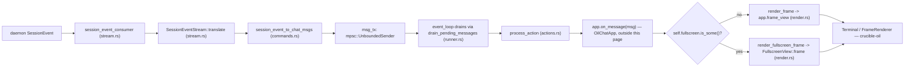
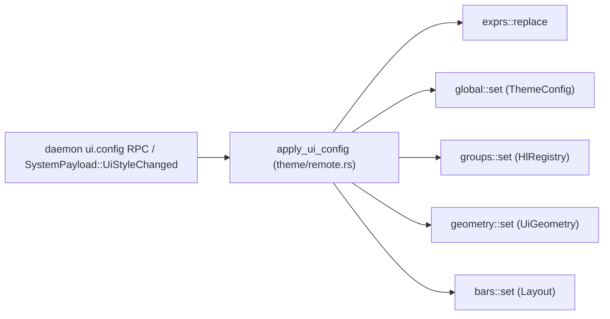
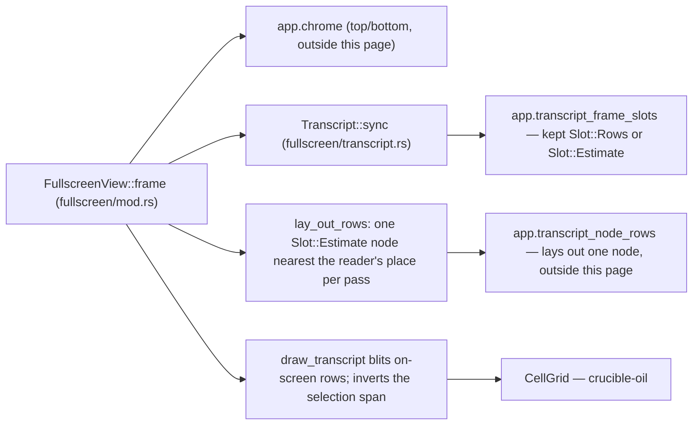

# TUI Components

This page covers `crates/crucible-cli/src/tui/mod.rs` and everything under
`crates/crucible-cli/src/tui/oil/`, including the full-screen chat view
(`crates/crucible-cli/src/tui/oil/fullscreen/`).
Paths below are relative to `crates/`. It does not cover `chat_app`,
`app.rs`, `component.rs`, `containers.rs`, `event.rs`, `viewport_cache.rs`,
`transcript_rows.rs`, or the headless story/vt100 test suites under
`tui/oil/tests/` — those own `OilChatApp` itself and belong to
[[TUI Chat App]]. It also does not cover the `crucible-oil` crate (`Node`,
layout, `Terminal`, `ScreenMode`, `CellGrid`, `TextRole`, `render_tree_to_grid`),
which this code renders through and which belongs to [[Oil Renderer]].

## Purpose and ownership

This subsystem owns the reusable rendering pieces of the `cru chat` TUI: the
event loop that drains daemon events and user keystrokes
(`crucible-cli/src/tui/oil/chat_runner/`), the leaf view components
(`crucible-cli/src/tui/oil/components/`), the `:set` command parser and its
client-local config overlay (`crucible-cli/src/tui/oil/commands/`,
`crucible-cli/src/tui/oil/config/`), the chat markdown-to-`Node` renderer
(`crucible-cli/src/tui/oil/markdown/`), the process-wide theme/style stores
(`crucible-cli/src/tui/oil/theme/`), shared string/width/wrap helpers
(`crucible-cli/src/tui/oil/utils/`), and the full-screen (alternate-screen)
chat view, with its own scroll, per-node lazy layout, text selection and
clipboard copy (`crucible-cli/src/tui/oil/fullscreen/`).

Per `AGENTS.md` and `crates/crucible-cli/AGENTS.md`, this code is a **view
layer only**. It must render state and forward user intent as daemon RPC
calls; it must not decide permission outcomes, hold session-authoritative
state, or build a second agent/session/write pipeline. Every file record
read for this page confirms the rule holds: `crates/crucible-cli/src/tui/oil/chat_runner/actions.rs`
is the single place a daemon RPC is issued from this code, and every such
match arm has a mirrored no-op arm for replay mode. The full-screen view's
own event handling (`crates/crucible-cli/src/tui/oil/fullscreen/`) forwards
`ChatAppMsg`s into the same reducer this page's other flows already use; it
issues no RPC of its own and writes only to the terminal, the OS clipboard
and tmux. The screen mode itself (`ChatScreen::Fullscreen`/`Inline`, read
from `cli.screen`) is client-local display state, the same category as
`theme`/`show-thinking`, per `AGENTS.md`'s rule that display state stays in
the client.

## Module map

### `crates/crucible-cli/src/tui/mod.rs`

| Path | Lines | Role |
|---|---|---|
| `crates/crucible-cli/src/tui/mod.rs` | 11 | Re-exports the `oil` toolkit's flat public surface for the rest of the crate. |

### `crates/crucible-cli/src/tui/oil/chat_runner/`

| Path | Lines | Role |
|---|---|---|
| `crates/crucible-cli/src/tui/oil/chat_runner/mod.rs` | 374 | Defines `OilChatRunner`, its builders, the full-screen/inline switch and `ChatExit`; declares the sibling files as submodules. No longer generic over an agent-handle type parameter. |
| `crates/crucible-cli/src/tui/oil/chat_runner/runner.rs` | 604 | The `tokio::select!` event loop (`event_loop`) and the top-level `run_with_factory` entry point, taking a factory that returns `crate::session::OpenedSession`; `EventLoopParams`/`ProcessActionParams` carry `session: Option<&LiveSession>`, `None` for a replay. |
| `crates/crucible-cli/src/tui/oil/chat_runner/actions.rs` | 1526 | `process_action`: the only place a daemon RPC is issued from this subsystem. Each daemon action is a direct `DaemonClient` call on `params.session` (`session_undo`, `session_cancel`, `session_switch_model`, `session_list_modes`, `session_set_context_strategy`, `session_set_precognition`, `session_set_plugin_turn_limit`, `session_set_plugin_approval`, `session_interaction_respond`, `session_set_mode`, `session_send_message`); there is no `ClearHistory` arm. |
| `crates/crucible-cli/src/tui/oil/chat_runner/commands.rs` | 473 | `session_event_to_chat_msgs`: pure translation of a daemon `SessionEvent` into `ChatAppMsg` values; also carries inline `#[cfg(test)]` cases. |
| `crates/crucible-cli/src/tui/oil/chat_runner/stream.rs` | 346 | `SessionEventStream`: the stateful wrapper around `commands.rs`'s translator, plus `session_event_consumer` (history/replay, opens no prompt) and the new `live_session_event_consumer` (opens the session's pending prompts first, then each later `interaction_requested` once, deduped by request id). |
| `crates/crucible-cli/src/tui/oil/chat_runner/render.rs` | 103 | `render_frame`/`render_app_frame`: the inline frame-paint path, plus the full-screen frame path (`render_fullscreen_frame`). |
| `crates/crucible-cli/src/tui/oil/chat_runner/tests/mod.rs` | 16 | Declares the sibling test modules, including `interaction_prompts`. |
| `crates/crucible-cli/src/tui/oil/chat_runner/tests/builders.rs` | 20 | Proves a runner builder method (`with_show_diffs`) sets its field. |
| `crates/crucible-cli/src/tui/oil/chat_runner/tests/comment_mention.rs` | 92 | Proves an `@comment:<id>` mention reaches the daemon unaltered, and a refusal reaches the user as an `Error`, not a log line only; drives a `FakeDaemon` (`crates/crucible-cli/src/test_daemon.rs`). |
| `crates/crucible-cli/src/tui/oil/chat_runner/tests/daemon_notification.rs` | 244 | Integration tests against a real in-process `crucible_daemon::Server`: notification delivery, attach-time read, per-session dismissal and `:messages clear`. |
| `crates/crucible-cli/src/tui/oil/chat_runner/tests/diff_fetch.rs` | 159 | US-910 regression: a drained `DiffLoaded` follow-up reaches `process_action`, not just the reducer, and starts the per-file diff-text read. |
| `crates/crucible-cli/src/tui/oil/chat_runner/tests/initial_sets.rs` | 53 | Regression: `cru chat --set` overrides reach the daemon RPC, not just the reducer; against a `FakeDaemon`. |
| `crates/crucible-cli/src/tui/oil/chat_runner/tests/interaction_prompts.rs` | 95 | Proves `live_session_event_consumer` opens a pending prompt plus each later `interaction_requested` of its own session exactly once, and that `session_event_consumer` (stored history) opens none. |
| `crates/crucible-cli/src/tui/oil/chat_runner/tests/knob_rpc.rs` | 324 | Per-knob matrix: each `:set` message dispatches to the matching daemon RPC (`session.set_plugin_approval`, `session.set_mode`, and so on), including `plugin_turn_limit` and `plugin_approval.<plugin>`; also the `:plugin-mode` menu flow. Drives a `FakeDaemon`. |
| `crates/crucible-cli/src/tui/oil/chat_runner/tests/model_prefetch.rs` | 37 | Regression: startup model prefetch needs both a reducer message and a spawned fetch task. |
| `crates/crucible-cli/src/tui/oil/chat_runner/tests/proposal_fetch.rs` | 55 | Proves a drained `ProposalChanged` event starts a `FetchProposals` read through `process_action`, replay-gated. |
| `crates/crucible-cli/src/tui/oil/chat_runner/tests/replay.rs` | 170 | Proves delegation `SessionEvent`s translate correctly and the consumer exits cleanly on `replay_complete`. |
| `crates/crucible-cli/src/tui/oil/chat_runner/tests/session_resume.rs` | 153 | US-912: proves the `/resume` guards (already-open session, a running turn, replay) short-circuit before any daemon call, and unit-tests the picker's sort/cap/dedup logic (`resumable_sessions`). |
| `crates/crucible-cli/src/tui/oil/chat_runner/tests/status_read.rs` | 49 | Proves a failed or partially-undecodable `session.status` read shows a notice rather than silently rendering a shorter list. |
| `crates/crucible-cli/src/tui/oil/chat_runner/tests/stream_gap.rs` | 127 | Proves the daemon's broadcast-lag marker survives the per-session filter because it is wildcard-addressed. |
| `crates/crucible-cli/src/tui/oil/chat_runner/tests/surface_refresh.rs` | 124 | US-908: distinguishes a withdrawn surface (`Ok(None)`) from a failed refetch (`Err`). |
| `crates/crucible-cli/src/tui/oil/chat_runner/tests/system_channel.rs` | 52 | Proves the daemon's system-session events (for example `proposal_changed`) cross the per-session stream filter, which previously accepted only the session's own id and the broadcast-lag wildcard. |
| `crates/crucible-cli/src/tui/oil/chat_runner/tests/translate.rs` | 456 | The largest translator test file. It covers the setup and notification messages. Its last section sends wire events through `EventFeed` and reads the tool cards that the app draws: the late update, the render and summary fields, and structured tool results. |

### `crates/crucible-cli/src/tui/oil/commands/`

| Path | Lines | Role |
|---|---|---|
| `crates/crucible-cli/src/tui/oil/commands/mod.rs` | 9 | Re-exports the `:set` parser's public API, including the `PLUGIN_APPROVAL` key-prefix constant. |
| `crates/crucible-cli/src/tui/oil/commands/set.rs` | 951 | `SetCommand`/`SetEffect`/`KeyHome`: the vim-style `:set`/`--set` parser and the single classifier deciding client-local vs daemon-bound keys. |

### `crates/crucible-cli/src/tui/oil/components/`

| Path | Lines | Role |
|---|---|---|
| `crates/crucible-cli/src/tui/oil/components/mod.rs` | 49 | Re-export surface for every submodule below. |
| `crates/crucible-cli/src/tui/oil/components/command_panel.rs` | 31 | `CommandPanel`: assembles the turn indicator, input box and status bars into one prompt region. |
| `crates/crucible-cli/src/tui/oil/components/turn_indicator.rs` | 76 | `TurnIndicator`: a bare spinner shown while a turn is active. |
| `crates/crucible-cli/src/tui/oil/components/input_area.rs` | 116 | `InputMode`: prompt glyph/color/prefix logic for Normal/Command/Shell input modes. |
| `crates/crucible-cli/src/tui/oil/components/input_component.rs` | 298 | `InputComponent`: renders the multiline composer box, cursor and completion-popup edge swap. |
| `crates/crucible-cli/src/tui/oil/components/status_bar.rs` | 290 | `StatusBar`/`NotificationToastKind`: the data-plus-render model for status/prompt bars, including proposal count and the daemon-published `StatusDisplayItem` list. |
| `crates/crucible-cli/src/tui/oil/components/status_component.rs` | 201 | `StatusComponent`: a borrowed-snapshot view wrapper around `StatusBar`. |
| `crates/crucible-cli/src/tui/oil/components/status_items.rs` | 940 | `render_bar`: evaluates the Lua-declared `StatusItem` tree, plus the daemon-published `StatusDisplayItem` streams (`sl.items`, `sl.plugin_turns`), into `Node`s each frame. |
| `crates/crucible-cli/src/tui/oil/components/notification_area.rs` | 317 | `NotificationArea`: the notification lifecycle store (toast timeout, history, unread count, daemon-owned id tracking). |
| `crates/crucible-cli/src/tui/oil/components/notification_component.rs` | 350 | `NotificationComponent`: renders the notification/messages drawer from pre-computed entries. |
| `crates/crucible-cli/src/tui/oil/components/popup_overlay.rs` | 14 | Thin `Component` adapter for `crucible_oil::components::PopupOverlay`. |
| `crates/crucible-cli/src/tui/oil/components/drawer.rs` | 31 | Thin `Component` adapter for `crucible_oil::components::Drawer`. |
| `crates/crucible-cli/src/tui/oil/components/diff_view.rs` | 1314 | `render_diff`/`render_diffset_file`: the shared unified/side-by-side diff renderer for tool cards, permission popups, the `:diff`/`:proposals` full-screen views, and `cru diff`/`cru proposal`. |
| `crates/crucible-cli/src/tui/oil/components/diff_modal.rs` | 503 | `DiffModal`: the full-screen `:diff` view over one `Diffset`, paging per file. |
| `crates/crucible-cli/src/tui/oil/components/proposals_modal.rs` | 302 | `ProposalsModal`: the full-screen `:proposals` view over the daemon's Inbox, reusing `DiffModal` for its diff. |
| `crates/crucible-cli/src/tui/oil/components/tool_render.rs` | 551 | `CachedToolCall` render methods, drawing the daemon-computed `ToolRender` line, fields and summary. |
| `crates/crucible-cli/src/tui/oil/components/tool_render_tests.rs` | 767 | `#[path]`-attached test module for `tool_render.rs`'s private summarization logic. |
| `crates/crucible-cli/src/tui/oil/components/subagent_render.rs` | 153 | `render_subagent`: a subagent's running/completed/failed status line. |
| `crates/crucible-cli/src/tui/oil/components/shell_modal.rs` | 708 | `ShellModal`: the full-screen "run a shell command" modal, spawning and streaming a child process. |
| `crates/crucible-cli/src/tui/oil/components/shell_render.rs` | 109 | `render_shell_execution`: renders a completed, cached shell run in the transcript. |
| `crates/crucible-cli/src/tui/oil/components/surface_modal.rs` | 391 | `SurfaceModal`: the full-screen modal for a plugin-declared row surface. |
| `crates/crucible-cli/src/tui/oil/components/thinking_component.rs` | 278 | `ThinkingComponent`: owns and renders one reasoning block, expanded or collapsed. |

### `crates/crucible-cli/src/tui/oil/components/interaction_modal/`

| Path | Lines | Role |
|---|---|---|
| `crates/crucible-cli/src/tui/oil/components/interaction_modal/mod.rs` | 189 | `InteractionModal`/`InteractionModalOutput`: the Elm-style struct and dispatch for every `InteractionRequest` kind. |
| `crates/crucible-cli/src/tui/oil/components/interaction_modal/ask.rs` | 345 | Key handling and rendering for `Ask` and `AskBatch` requests, on `ChoiceList`. |
| `crates/crucible-cli/src/tui/oil/components/interaction_modal/choice.rs` | 242 | `ChoiceList`/`ChoiceInput`/`ChoiceStep`: the one choice flow (cursor wrap, the "Other" slot, multi-select toggle, text input) of Ask, AskBatch, Popup and Panel, plus `wrap_selection` and the "Other" rows. |
| `crates/crucible-cli/src/tui/oil/components/interaction_modal/edit.rs` | 289 | Key handling and rendering for the `Edit` line-editor request. |
| `crates/crucible-cli/src/tui/oil/components/interaction_modal/helpers.rs` | 52 | `prettify_tool_args`/`prettify_tool_args_full`: shared tool-argument formatting for `perm.rs`. |
| `crates/crucible-cli/src/tui/oil/components/interaction_modal/panel.rs` | 224 | Key handling and rendering for the generic filterable/multi-select `Panel` request: the filter input, and `ChoiceList` over the visible items. |
| `crates/crucible-cli/src/tui/oil/components/interaction_modal/perm.rs` | 439 | Key handling and rendering for `Permission` requests: allow/deny/allowlist, plugin-origin banner and diff preview, reading the daemon's `CanonicalToolCall`. |
| `crates/crucible-cli/src/tui/oil/components/interaction_modal/popup.rs` | 115 | Key handling and rendering for the `Popup` single-select request, on `ChoiceList`. |
| `crates/crucible-cli/src/tui/oil/components/interaction_modal/show.rs` | 121 | Key handling and rendering for the read-only `Show` scrollable-text request. |
| `crates/crucible-cli/src/tui/oil/components/interaction_modal/tests/mod.rs` | 17 | Shared key-event test fixtures for this directory's test files. |
| `crates/crucible-cli/src/tui/oil/components/interaction_modal/tests/ask.rs` | 111 | Unit tests for `ask.rs`, including the batch-answer regression. |
| `crates/crucible-cli/src/tui/oil/components/interaction_modal/tests/choice.rs` | 187 | Unit tests for `choice.rs`: wrap, filtered ids, toggle, the "Other" slot, text input and cancel. |
| `crates/crucible-cli/src/tui/oil/components/interaction_modal/tests/edit.rs` | 108 | Unit tests for `edit.rs`. |
| `crates/crucible-cli/src/tui/oil/components/interaction_modal/tests/panel.rs` | 169 | Unit tests for `panel.rs`, including filter narrowing and the "Other" slot. |
| `crates/crucible-cli/src/tui/oil/components/interaction_modal/tests/perm.rs` | 304 | Unit and `insta` snapshot tests for `perm.rs`, including the plugin-origin banner. |
| `crates/crucible-cli/src/tui/oil/components/interaction_modal/tests/popup.rs` | 75 | Unit tests for `popup.rs`. |
| `crates/crucible-cli/src/tui/oil/components/interaction_modal/tests/show.rs` | 66 | Unit tests for `show.rs`. |

### `crates/crucible-cli/src/tui/oil/config/`

| Path | Lines | Role |
|---|---|---|
| `crates/crucible-cli/src/tui/oil/config/mod.rs` | 23 | Re-exports the `:set` overlay's public types. |
| `crates/crucible-cli/src/tui/oil/config/overlay.rs` | 592 | `RuntimeConfig`: the sparse per-key overlay store layered over the base JSON config. |
| `crates/crucible-cli/src/tui/oil/config/shortcuts.rs` | 310 | `SHORTCUTS`/`ShortcutRegistry`: the static table of every `:set` short name. |
| `crates/crucible-cli/src/tui/oil/config/stack.rs` | 308 | `ConfigStack`/`ConfigMod`/`ModSource`: the per-key audit-log data structure. |
| `crates/crucible-cli/src/tui/oil/config/value.rs` | 664 | `ConfigValue`: the dynamically-typed value with string parsing/type coercion. |

### `crates/crucible-cli/src/tui/oil/fullscreen/`

| Path | Lines | Role |
|---|---|---|
| `crates/crucible-cli/src/tui/oil/fullscreen/mod.rs` | 527 | `FullscreenView`/`Frame`/`ViewAction`: the full-screen mode's frame builder, key/mouse dispatch and per-node lazy layout. |
| `crates/crucible-cli/src/tui/oil/fullscreen/transcript.rs` | 453 | `Transcript`/`Anchor`/`Index`: numbers the full-screen mode's rows from `OilChatApp`'s own kept-row cache, keeping no rows of its own. |
| `crates/crucible-cli/src/tui/oil/fullscreen/selection.rs` | 500 | `Selection`/`Point`/`Span`/`Unit`: buffer-coordinate text selection (drag, word, line) and the shared gutter-aware read path for highlight and copy. |
| `crates/crucible-cli/src/tui/oil/fullscreen/scroll.rs` | 126 | `Scroll`: the top/follow scroll-position primitive used by the plugin-buffer pane (`shell.rs`). |
| `crates/crucible-cli/src/tui/oil/fullscreen/clipboard.rs` | 295 | `Copier`/`CopyEnv`/`Backend`/`CopyReport`: the full-screen copy chain — OSC 52, then the native clipboard, then tmux. |
| `crates/crucible-cli/src/tui/oil/fullscreen/shell.rs` | 508 | `FullscreenShell`/`ChatPane`/`PluginBuffer`: a prototype multi-pane shell (chat panes plus a plugin-buffer pane) behind one switch key; not wired into the live `cru chat` runner. |
| `crates/crucible-cli/src/tui/oil/fullscreen/fixtures.rs` | 72 | Test-only fake transcript fixtures, shared by this directory's tests, its bench and `examples/fullscreen_demo`; excluded from the `cru` binary. |
| `crates/crucible-cli/src/tui/oil/fullscreen/bench.rs` | 217 | `#[ignore]`d frame-time/bytes-per-frame benchmarks for streaming, relayout and the plugin-buffer pane; manual inspection, not a gate. |
| `crates/crucible-cli/src/tui/oil/fullscreen/tests.rs` | 841 | Black-box test suite for `FullscreenView`: scroll/follow, resize reflow with reader-anchoring, selection/copy through gutters and wraps, the dump-to-scrollback key, and the lazy per-node layout's frame budget. |

### `crates/crucible-cli/src/tui/oil/markdown/`

| Path | Lines | Role |
|---|---|---|
| `crates/crucible-cli/src/tui/oil/markdown/mod.rs` | 160 | Public entry point: `markdown_to_node*` functions, `Margins`, `RenderStyle`. |
| `crates/crucible-cli/src/tui/oil/markdown/context.rs` | 207 | `RenderContext`: the mutable render-time state, plus the cached, panic-safe `parse_and_render_internal`. |
| `crates/crucible-cli/src/tui/oil/markdown/render.rs` | 289 | `render_node`: the recursive `markdown-it` AST-to-`Node` dispatcher; owns `margin_node`, the shared gutter-marked left-margin helper. |
| `crates/crucible-cli/src/tui/oil/markdown/blockquote.rs` | 44 | Renders a blockquote with a `│ ` prefix; the prefix and left margin are marked as gutters so a full-screen selection/copy skips them. |
| `crates/crucible-cli/src/tui/oil/markdown/code.rs` | 106 | Renders fenced/indented code blocks as one pre-formatted, syntax-highlighted text node; each line's left margin is marked a gutter. |
| `crates/crucible-cli/src/tui/oil/markdown/list.rs` | 94 | Renders one bulleted/numbered list item, recursing into nested sub-lists; continuation lines carry the wrap's dropped whitespace so a full-screen copy rejoins a wrapped item exactly. |
| `crates/crucible-cli/src/tui/oil/markdown/table.rs` | 349 | `render_table`: GFM table rendering with column-width negotiation; also `wrap_text_with_gaps` (with `wrap_text` as a gap-discarding wrapper over it), used crate-wide in this module. |
| `crates/crucible-cli/src/tui/oil/markdown/tests.rs` | 856 | Black-box unit-test suite for the whole markdown renderer. |

### `crates/crucible-cli/src/tui/oil/theme/`

| Path | Lines | Role |
|---|---|---|
| `crates/crucible-cli/src/tui/oil/theme/mod.rs` | 68 | Theme module root; re-exports `config::*` and `global::{active, set}`. |
| `crates/crucible-cli/src/tui/oil/theme/slot.rs` | 61 | `RenderSlot<T>`: the shared leak-on-install swappable-store primitive; also a shared `GENERATION` counter (`slot::generation()`) bumped on every install across every slot. |
| `crates/crucible-cli/src/tui/oil/theme/global.rs` | 81 | The global active `ThemeConfig` store, built on `RenderSlot`. |
| `crates/crucible-cli/src/tui/oil/theme/groups.rs` | 96 | `HlRegistry` store for highlight-group overrides, kept unresolved against the active theme; `get` now returns a `crucible_oil::style::Style` directly. |
| `crates/crucible-cli/src/tui/oil/theme/geometry.rs` | 79 | `UiGeometry` store: per-surface border/padding/glyph overrides. |
| `crates/crucible-cli/src/tui/oil/theme/bars.rs` | 58 | `Layout` store for the statusline; falls back to a complete built-in layout. |
| `crates/crucible-cli/src/tui/oil/theme/exprs.rs` | 180 | `RwLock`-backed cache of daemon-pushed statusline expression values. |
| `crates/crucible-cli/src/tui/oil/theme/config.rs` | 188 | Re-exports `ThemeConfig` and friends from `crucible_lua::theme`. |
| `crates/crucible-cli/src/tui/oil/theme/remote.rs` | 225 | `apply_ui_config`: the single entry point applying a daemon `ui.config` payload to every store above. |
| `crates/crucible-cli/src/tui/oil/theme/status_color.rs` | 73 | `color`: resolves a shared `crucible_core::status_color::StatusColorGroup` name to a terminal `Color`, ansi16-aware. |

### `crates/crucible-cli/src/tui/oil/utils/`

| Path | Lines | Role |
|---|---|---|
| `crates/crucible-cli/src/tui/oil/utils/mod.rs` | 22 | Re-exports the three submodules' canonical string/width/wrap helpers. |
| `crates/crucible-cli/src/tui/oil/utils/truncate.rs` | 131 | `truncate_lines`/`truncate_first_line`, plus a re-export of `crucible_oil`'s char/width truncation. |
| `crates/crucible-cli/src/tui/oil/utils/width.rs` | 72 | Terminal-dimension queries and a re-export of ANSI-aware `visible_width`. |
| `crates/crucible-cli/src/tui/oil/utils/wrap.rs` | 273 | `wrap_to_width`/`wrap_chars`/`wrap_words`: canonical ANSI-preserving text wrapping; also `wrap_words_with_gaps`, the gap-tracking variant `containers.rs` uses for full-screen-copy-safe user-message wrapping. |

## Key types and traits

- **`OilChatRunner`** (`crates/crucible-cli/src/tui/oil/chat_runner/mod.rs`) — owns
  the terminal, the tick rate, replay flags, an optional `fullscreen:
  Option<FullscreenView>` (`None` is inline mode), a `copier` for full-screen
  clipboard copy, `next_session` (the id `/resume` chose), and the
  background-task list. Built by the CLI's `cru chat` command setup (outside
  this page, in `commands/chat/`) through `with_terminal`, `with_screen`
  (sets `ChatScreen::Fullscreen`/`Inline`, reading `cli.screen`) and the
  other `with_*` builders, then driven for the whole session by
  `run_with_factory`, which returns `Result<ChatExit>` (`ChatExit::Quit` or
  `ChatExit::Resume(session_id)`) rather than a bare `Result<()>`, so a
  caller can re-enter the TUI on another session after `/resume`.
- **`SessionEventStream`** (`crates/crucible-cli/src/tui/oil/chat_runner/stream.rs`)
  — holds `saw_text_delta`, a `thinking_run` de-duplication buffer, and an
  optional shared `Arc<AtomicUsize>` context-limit cell. It is not a field of
  `OilChatRunner`: one instance is built inside the spawned
  `session_event_consumer` task for a session's whole life, and a second,
  separate instance hydrates resume history. `translate` is its sole entry
  point. `session_event_consumer`'s per-session filter accepts an event
  addressed to the session's own id, the broadcast-lag wildcard, or
  `crucible_daemon::event_map::SYSTEM_SESSION` — the address of a daemon
  event that belongs to no user session, for example `proposal_changed`.
- **`ChatAppMsg`, `Action`, `ViewContext`, `Component`** — defined in
  `crate::tui::oil::chat_app`/`app`/`component` (outside this page, owned by
  [[TUI Chat App]]). Every component and the whole event loop in this page
  consumes them: `Component::view(&self, ctx: &ViewContext<'_>) -> Node` is the
  one method every file under `components/` implements. `ChatAppMsg` has no
  message for one tool call or one text delta. The `Transcript` message
  carries the ops of the daemon fold, and those ops draw each tool card.
- **`SetCommand`, `SetEffect`, `KeyHome`, `SetRpcAction`, `PLUGIN_APPROVAL`** (`crates/crucible-cli/src/tui/oil/commands/set.rs`)
  — `SetCommand::parse` turns raw `:set` text into a typed command;
  `classify_set_value`/`classify_key_without_value` are the single classifier
  every `:set`/`--set` surface must route through, producing a `SetEffect`
  (`TuiLocal` or `DaemonRpc`). `key_home` answers the same question for a
  value-less query/reset/pop/unset. Two module-level clippy denies
  (`wildcard_enum_match_arm`, `match_wildcard_for_single_variants`) make an
  unclassified new key a compile error. `plugin_turn_limit` and
  `plugin_approval.<plugin>` (`PLUGIN_APPROVAL = "plugin_approval."`) are
  current examples of that discipline: the latter is the first `:set` key
  family whose classifier arm is a prefix match (`k if
  k.starts_with(PLUGIN_APPROVAL)`) over a namespace of keys discovered only
  at runtime (one per loaded plugin), rather than a fixed name in
  `SHORTCUTS`.
- **`RuntimeConfig`, `ConfigStack`, `ConfigMod`, `ModSource`, `ConfigValue`,
  `ShortcutRegistry`** (`crates/crucible-cli/src/tui/oil/config/`) — `RuntimeConfig`
  is the sparse overlay: one `ConfigStack` per modified key, holding an
  append-only `Vec<ConfigMod>` (value, timestamp, `ModSource`) above a base
  value read from `base_json`. `SHORTCUTS` (`shortcuts.rs`) maps short names to
  a `ShortcutTarget::{Path, Dynamic, Virtual}`; `ConfigValue::parse` does
  hint-first, then bool→int→float→string auto-detection.
- **`InteractionModal`, `InteractionModalOutput`, `InteractionMode`**
  (`crates/crucible-cli/src/tui/oil/components/interaction_modal/mod.rs`) —
  one struct holding every interaction kind's UI state (selection index, text
  buffer, scroll offset, batch answers, panel filter, edit-buffer lines).
  `chat_app`'s `open_interaction` (outside this page) constructs it from a
  daemon `InteractionRequest` and holds `Option<InteractionModal>`; `update`
  consumes key events and returns an `InteractionModalOutput` that `chat_app`
  turns into a `ChatAppMsg` routed back through `actions.rs::process_action`.
  `perm.rs`'s `PermRequest` (`crucible_core::interaction`) carries
  `origin: Option<TurnOrigin>` (the plugin, if the prompt started inside a
  plugin turn), `call: Option<Box<CanonicalToolCall>>` (the daemon's resolved,
  render-bearing tool call), and `layer: Option<String>` (who asked);
  `suggested_pattern()` returns `Option<String>`, `None` when no grant can
  name the call.
- **`ChoiceList`, `ChoiceInput`, `ChoiceStep`**
  (`crates/crucible-cli/src/tui/oil/components/interaction_modal/choice.rs`) —
  the one choice flow of the Ask, AskBatch, Popup and Panel modals.
  `ChoiceList` gives the shape of a list: the choice ids (`new(count)`, or
  `filtered(&visible)` for a panel), `allow_other` and `multi_select`.
  `handle_key` takes a `ChoiceInput` (borrows of the cursor, the checked ids,
  the "Other" text and the `InteractionMode`) and returns a `ChoiceStep`:
  `Pick(id)`, `PickMany(ids)` in ascending order, `Other(text)`, `Cancel`,
  `Handled` or `Ignored`. Up/Down (`k`/`j`) wrap over the choices and the
  "Other" slot. Space toggles a choice id, and does nothing on the "Other"
  slot. Enter on the "Other" slot opens the text input. Each modal handles
  its own keys first (Ask: Tab; AskBatch: Tab, BackTab, Enter; Panel: `/`
  and the `InteractionMode::Filter` input). Then it turns the step into its
  response type. `perm.rs` uses only `wrap_selection`.
- **`StatusBar`, `StatusComponent`, `ItemContext`, `Fragment`**
  (`crates/crucible-cli/src/tui/oil/components/status_bar.rs`,
  `status_component.rs`, `status_items.rs`) — `StatusBar` is the per-frame data
  snapshot (mode, model, context usage, notification state, proposal count,
  the `proposes` flag, and `status_items: Vec<StatusDisplayItem>` with a
  `status_width`); `status_items::render_bar` interprets both the
  Lua-declared `StatusItem`/`Region` tree from `crucible_lua::statusline_items`
  and the daemon-published `StatusDisplayItem` list against that snapshot.
  `StatusItem` gained `Proposals` (blank at zero, "N proposals" otherwise),
  `List` (`sl.items`: non-pinned `StatusItemKind::Published` entries, folded
  into a trailing `+N` badge past `status_width`, plus always-drawn pinned
  entries) and `PluginTurns` (`sl.plugin_turns`: `StatusItemKind::PluginTurns`
  entries, which never fold — only the plugin name inside each entry shrinks
  to fit, because a cut state word could hide an `ask` or a `stop`).
- **`CachedToolCall`, `DiffOptions`, `DiffLayout`, `DiffModal`, `DiffModalOutcome`,
  `ProposalsModal`, `ProposalsModalOutcome`** — `CachedToolCall` is defined
  in `crate::tui::oil::viewport_cache` (outside this page); its
  `render_compact*` methods, implemented in
  `crates/crucible-cli/src/tui/oil/components/tool_render.rs`, draw the
  daemon-computed `ToolRender`'s `line`, `fields` and `summary`
  (`self.render: Option<Arc<ToolRender>>`) rather than rebuilding a summary
  from the tool's name and arguments. `DiffOptions`/`render_diff`/
  `render_diffset_file` in
  `crates/crucible-cli/src/tui/oil/components/diff_view.rs` are shared by
  `tool_render.rs`, `interaction_modal/perm.rs`, the full-screen
  `DiffModal`/`ProposalsModal` (this page), and the CLI's `cru diff`/`cru
  proposal` commands (outside this page). `DiffModal`
  (`components/diff_modal.rs`) is the full-screen `:diff` view over one
  `Diffset`, paging one file at a time and requesting its text through a
  `DiffModalOutcome::Load` the caller turns into an RPC.
  `ProposalsModal` (`components/proposals_modal.rs`) is the full-screen
  `:proposals` view over the daemon's Inbox; it reuses `DiffModal::with_texts`
  because a proposal already holds both the base and the new text of each
  file, so opening its diff needs no daemon round trip.
- **`RenderSlot<T>`** (`crates/crucible-cli/src/tui/oil/theme/slot.rs`) — the
  one generic primitive under `global`, `groups`, `geometry` and `bars`: an
  `RwLock<Option<&'static T>>` swapped by leaking (`Box::leak`) a new value on
  `set`, with a `OnceLock<T>` fallback that only initializes on an actual
  read-side miss, never eagerly. `slot::generation()` returns a process-wide
  `u64` that `RenderSlot::set` increments on every install into any slot; a
  row-layout cache outside this page (`transcript_rows.rs`, [[TUI Chat App]])
  keys its cached rows on this value, so a theme/highlight/geometry/bars push
  invalidates every cached row.
- **`ThemeConfig`** — defined in `crucible_lua::theme`, re-exported unchanged
  by `crates/crucible-cli/src/tui/oil/theme/config.rs`. `theme::global` holds
  the process-wide active instance; `theme::remote::apply_ui_config` is the
  only writer that installs a new one from the wire.
- **`StatusColorGroup`** (`crucible_core::status_color`, outside this page)
  — the shared `ok`/`warn`/`danger`/`info`/`hue0`-`hue7` name table a
  status-producing plugin uses so a named color renders the same on the TUI
  and the web. `theme::status_color::color` (`crates/crucible-cli/src/tui/oil/theme/status_color.rs`)
  is the TUI's resolver from a group to a concrete `crucible_oil::style::Color`,
  with a dedicated palette-index branch when the active theme is `"ansi16"`.
- **`Margins`, `RenderStyle`** (`crates/crucible-cli/src/tui/oil/markdown/mod.rs`)
  — `Margins` controls left/right indent and the assistant bullet; `RenderStyle`
  selects text/table widths for a render call (`natural` is currently coded
  identically to `viewport`; see Findings). `render.rs`'s `margin_node` and
  `bullet_node` mark their `Node`s as gutters (`Node::gutter`, from
  `crucible-oil`, [[Oil Renderer]]), and a wrapped paragraph row that
  continues a source line carries the dropped separator via
  `Node::continues_line`; both are read by `fullscreen/selection.rs` so a
  full-screen selection/copy skips decoration and rejoins a wrapped line
  exactly.
- **`FullscreenView`, `Frame`, `ViewAction`** (`crates/crucible-cli/src/tui/oil/fullscreen/mod.rs`)
  — the full-screen mode's per-session state: a `Transcript`, the reader's
  place (`Place::{Bottom, At(Anchor)}`), the current selection, and mouse
  click-tracking. `frame(app, ctx)` builds one `Frame { grid: CellGrid,
  cursor }` per call; `handle_event` gives the view first refusal on every
  terminal event and returns a `ViewAction` (`Ignored`, `Handled`,
  `Copy(String)`, `Dump(Vec<String>)`, `ToggleMouse`) — only `Ignored` falls
  through to the existing reducer path.
- **`Transcript`, `Anchor`, `Index`** (`crates/crucible-cli/src/tui/oil/fullscreen/transcript.rs`)
  — numbers the full-screen mode's rows from `OilChatApp::transcript_frame_slots`/
  `transcript_node_rows` (outside this page, [[TUI Chat App]]) without
  keeping a second copy of any row. `sync` reindexes on a kept-rows/estimate
  mix; `lay_out` replaces only the entries still `Slot::Estimate`.
  `Anchor::resolve` rescales a stored row by the ratio of new to old row
  count when the transcript's width changed, so the reader's place survives
  a reflow even before that node is laid out again.
- **`Selection`, `Point`, `Span`, `Unit`** (`crates/crucible-cli/src/tui/oil/fullscreen/selection.rs`)
  — buffer-coordinate text selection (`Unit::{Cell, Word, Line}` from click
  count). `text_span` clamps a span's ends to the nearest source text, per
  row, using `crucible_oil::cell_grid::RowText` (built from each row's
  `TextRole`, [[Oil Renderer]]), so
  the highlight and the copy read through the same function and cannot
  disagree; a span that lands entirely in a gutter or a blank row selects
  nothing.
- **`Scroll`** (`crates/crucible-cli/src/tui/oil/fullscreen/scroll.rs`) — the
  top/follow scroll-position primitive used by the plugin-buffer pane
  (`shell.rs`); distinct from `FullscreenView`'s own `Place`/`Anchor` scroll
  tracking.
- **`Copier`, `CopyEnv`, `Backend`, `CopyReport`** (`crates/crucible-cli/src/tui/oil/fullscreen/clipboard.rs`)
  — the full-screen copy chain: OSC 52 first (the one path that reaches the
  user's own clipboard over SSH), then the native clipboard (skipped over
  SSH), then, inside tmux, `tmux load-buffer`. `Copier` holds the
  `arboard::Clipboard` handle alive across calls, since the process that
  owns the clipboard must stay alive until the user pastes.
- **`FullscreenShell`, `ChatPane`, `PluginBuffer`** (`crates/crucible-cli/src/tui/oil/fullscreen/shell.rs`)
  — a prototype multi-pane shell proving the view model for several chat
  sessions plus a plugin-buffer pane behind one switch key (`F4`); it is not
  reachable from `cru chat` today (see Findings). Each `ChatPane` holds its
  own `OilChatApp` and `FullscreenView`; `PluginBuffer` reads only the lines
  its current scroll position needs, so a very large source costs only its
  visible rows.

## Flows

### Daemon event to rendered frame

`session_event_consumer` filters by session id, the wildcard address, or
`SYSTEM_SESSION`, feeds every event through a per-consumer
`SessionEventStream`, and forwards the resulting `ChatAppMsg`s. `event_loop`
(`crates/crucible-cli/src/tui/oil/chat_runner/runner.rs`) alternates
`drain_pending_messages`/`process_action` with a biased `tokio::select!`
over the next terminal event, a tick, the next interaction event, an idle
full-screen layout slot (lowest priority, only when nothing else is ready)
and a replay-auto-exit timer. `drain_pending_messages` runs a drained
message through `process_message` (reducer only), then feeds the resulting
`Action` to `process_action` — the same path a live keystroke uses, replay
gates included — so a follow-up `Action::Send` from a drained event (for
example a `DiffLoaded`/`ProposalChanged` event's follow-up fetch) starts its
daemon read exactly as a live keystroke's follow-up does. Most
`process_action` arms fall through to a shared tail that calls
`app.on_message(msg)` and recurses on the resulting `Action`; `Undo` is an
exception that calls `on_message` inline and `return`s early instead. There
is no `ClearHistory` arm any more — the client-side end-and-recreate-a-new-
session path it drove was dead in production, since the TUI's `/clear`
maps to `session.clear` (context reset in place), not a session swap.
`render_frame` (inline mode) calls
`app.frame_view(&ctx)`, which reuses the rows of finished messages between
frames, keyed on the message's revision, the render width, the theme's style
generation and `show_thinking`/`show_diffs`; a full-screen session
(`self.fullscreen.is_some()`) instead calls `render_fullscreen_frame`, which
reads the same kept rows through `Transcript::sync` but lays out only the
nodes visible on screen.

### User action to daemon RPC

A terminal event first reaches `handle_selected_event`
(`crates/crucible-cli/src/tui/oil/chat_runner/runner.rs`), which, in a
full-screen session, gives `FullscreenView::handle_event` first refusal: a
`Handled`/`Copy`/`Dump`/`ToggleMouse` result stops there; only `Ignored`
falls through to the existing reducer. A crossterm mouse event now
translates to `Event::Mouse` (previously dropped). From there a keystroke
becomes an `Event`, `OilChatApp::update` (outside this page) turns it into
an `Action`, and `process_action` in
`crates/crucible-cli/src/tui/oil/chat_runner/actions.rs` matches on the
resulting `ChatAppMsg`. For anything daemon-bound (config get/set/drop, model
or mode fetch, plugin reload/run-command, surface fetch, Lua eval, session
export, undo, clear context, cancel, notification read/close, plugin-turn
limit/approval, `/resume`'s session list and switch, and `:diff`'s branch
diff/file fetch) it either spawns a `tokio::task` pushed onto
`background_tasks` or calls a `DaemonClient` method directly on
`params.session: Option<&LiveSession>` (`crates/crucible-cli/src/session.rs`).
There is no agent-handle abstraction in this path: `session_undo`,
`session_cancel`, `session_switch_model`, `session_list_modes`,
`session_set_context_strategy`, `session_set_precognition`,
`session_set_plugin_turn_limit`, `session_set_plugin_approval`, and
`session_set_mode` are named RPCs, and a mode-set refusal re-reads the
current mode via `session_list_modes` rather than trusting a cached mirror.
Every such arm has a mirrored `if self.is_replay` arm that drops the message
with `tracing::debug!` instead, so replay never reaches the daemon; the
`ResumeSession`/`FetchSessions`/`OpenDiff`/`FetchDiffFile`/
`FetchPluginApprovals`/`FetchProposals`/`ClearContext`/
`CloseDaemonNotifications` arms follow this pattern with an explicit `if
!self.is_replay` guard, the same as every other daemon-bound arm added
before them. `ResumeSession(id)` is the one arm whose effect leaves the
running loop rather than staying in it: it guards against resuming the
already-open session (toast, no-op) or a session with a turn in flight
(warning, no-op), else sets `self.next_session` so `run_with_factory`
returns `ChatExit::Resume(id)` instead of looping again. `EvalLua` and
`ExecuteSlashCommand` unwrap an RPC error through the shared
`crucible_daemon::rpc_error_message`, so both paths show the daemon's
failure text instead of a raw envelope.
`ExecuteSlashCommand` sends the whole `/name args` line to
`session.send_message`; `actions.rs::send_user_message` reads the
`SendOutcome` it answers and shows `SendOutcome::Command`'s result as a
`SystemNotice`, `/name: <result>`, or nothing at all for `SendOutcome::Turn`,
whose events already arrive on the session's event stream. There is no
`RunPluginCommand` arm any more: a plugin command is one more name the
daemon's catalog routes, the same as a mode or a skill.
`ExportSession` no longer reads a client-local session directory;
it reads the agent's session id and asks the daemon's `session_export_to_file`
RPC to write the file, since `OilChatRunner` keeps no session directory to
export from (`shell_output_dir` exists only for the shell modal's saved
output).

### `:set` classification

`SetCommand::parse` (`crates/crucible-cli/src/tui/oil/commands/set.rs`) turns
raw text into a `SetCommand`; `classify_set_value`/`classify_key_without_value`
turn a key (and optional value) into a `SetEffect`. `SetEffect::TuiLocal`
values are applied directly to `RuntimeConfig`
(`crates/crucible-cli/src/tui/oil/config/overlay.rs`) or to a client-local
flag on `OilChatApp`; `SetEffect::DaemonRpc(SetRpcAction)` becomes a
`ChatAppMsg` via `into_chat_msg` and is dispatched through the same
`process_action` path as any other daemon-bound message, including the new
`SetPluginTurnLimit(u32)` and `SetPluginApproval(plugin, approval)` variants.
`apply_initial_sets` (`crates/crucible-cli/src/tui/oil/chat_runner/runner.rs`)
applies `cru chat --set` startup overrides the same way, splitting
`TuiLocal` from `DaemonRpc` before the event loop starts.

### Daemon theme push to render stores

`apply_ui_config` is called from two places: once at startup after
`session/new` (in `commands/chat/mod.rs`, outside this page) and again
whenever a live `SystemPayload::UiStyleChanged` event arrives
(`system_msgs` in `crates/crucible-cli/src/tui/oil/chat_runner/commands.rs`).
`exprs` is applied first and independently of the rest, so a values-only push
(for example, a changed git-branch string) never reinstalls the other four
stores. A `layout` payload whose `prompt` region lacks an `Element::Input` is
rejected and the built-in layout kept, so a themed layout can never leave the
user unable to type. Every `set` into any of the four `RenderSlot`-backed
stores also bumps the shared `slot::generation()` counter, invalidating any
cached transcript row keyed on it (see Key types).

### Interaction request to daemon response

A daemon `InteractionRequest` arrives as `SessionEvent::InteractionRequested`,
read by `live_session_event_consumer`
(`crates/crucible-cli/src/tui/oil/chat_runner/stream.rs`), the consumer a
live session runs instead of the plain `session_event_consumer` history/replay
path. It opens the session's pending prompts first (read once at
`crucible_cli::session::open_session` time, see [[CLI Commands]]), then each
later `interaction_requested` event, deduped by request id so a prompt
already delivered as pending is not opened twice; each open is a
`ChatAppMsg::OpenInteraction`. `chat_app` turns that message into an
`InteractionModal`. The TUI answers no prompt by itself: the session mode
`auto` makes the daemon allow each call, so no prompt comes.
There is no separate interaction channel: the same `SessionEvent` stream
that feeds the transcript carries the prompts too. Each keystroke goes
through `InteractionModal::update` →
`handle_{ask,ask_batch,edit,panel,perm,popup,show}_key` in the matching
`crates/crucible-cli/src/tui/oil/components/interaction_modal/` file,
returning an `InteractionModalOutput`. `chat_app` turns a non-`None` output
into a `ChatAppMsg::CloseInteraction`/`ToggleDiff`, which reaches
`process_action` and, for a real response, a `session_interaction_respond`
RPC call.
A prompt that ends without this client's own response — a timeout, another
client's answer, or a delegated turn finishing — instead arrives as
`TurnPayload::InteractionCompleted` and reaches this client as
`ChatAppMsg::InteractionEnded { request_id }`, closing the modal with no
`PermResponse` round trip.

### `:diff`/`:proposals` full-screen views

`:diff` sends `Action::Send(ChatAppMsg::OpenDiff(base))`, which
`process_action` turns into a spawned `fetch_branch_diff` read; the loaded
`Diffset` opens a `DiffModal`. `DiffModal::request_text` asks for one file's
text at a time (`DiffModalOutcome::Load`), which `process_action` turns into
a spawned `fetch_diff_file` read and a `ChatAppMsg::DiffFileLoaded` follow-up
that fills the modal. `:proposals` sends `ChatAppMsg::FetchProposals { open }`,
which spawns a read of the daemon's Inbox and opens a `ProposalsModal`; since
a `Proposal` already carries both the base and the new text of every file it
touches, opening its diff (Enter) builds a `DiffModal::with_texts` directly,
with no `Load` request and no second daemon round trip. A live
`SystemPayload::ProposalChanged` event (`commands.rs`'s `system_msgs`)
produces `ChatAppMsg::ProposalChanged(id)`, whose drained follow-up
(`FetchProposals`) keeps both the statusline's proposal count and an open
`ProposalsModal` current.

### Chat markdown to a `Node`

`markdown_to_node_styled`/`markdown_to_node_streaming`
(`crates/crucible-cli/src/tui/oil/markdown/mod.rs`) call
`parse_and_render_internal` (`context.rs`), which checks a thread-local
single-entry cache, parses with `markdown-it`, and calls `render_node`
(`render.rs`). `render_node` dispatches block-level constructs to
`blockquote.rs`, `code.rs`, `list.rs` and `table.rs`, accumulating spans into
a `RenderContext`, then `into_node()` collapses the result into one `Node`.
The whole parse-and-render body runs inside `catch_unwind`, falling back to
raw text on an internal panic. Every renderer that draws a margin, a bullet
or a blockquote/code prefix marks that `Node` a gutter
(`crucible_oil::node::TextRole`, [[Oil Renderer]]) via `render.rs`'s shared
`margin_node`/`bullet_node`; a wrapped paragraph or list-item row that
continues a source line is marked `continues_line` with the exact whitespace
the wrap dropped. `fullscreen/selection.rs` (this page) reads both marks so a
full-screen selection/copy skips decoration and rejoins a wrapped line
exactly as it was written.

### Full-screen frame from kept rows

Each frame builds the chrome, reindexes the transcript from the app's kept
rows (no second row cache), and lays out at most the nodes that have a row
on screen, nearest to the reader's place first; every other node keeps an
estimated row count until it is actually visible. Between frames, an idle
`tokio::select!` branch calls `lay_out_idle` for up to `IDLE_BUDGET` (4 ms) to
retire estimates in the background without moving the screen. A scroll lays
out the rows of the new screen before it moves; a copy or the `F3` dump lays
out only the nodes each reaches. The selection is stored in row numbers and
re-mapped through `Transcript::relocate` whenever a layout above it changes
row heights, so a background layout never moves an active selection's
target text.

## State, concurrency and lifecycle

- **Event loop.** `OilChatRunner::run_with_factory` builds one
  `mpsc::unbounded_channel::<ChatAppMsg>` per run, spawns one event-consumer
  task on the live or replay event receiver — `live_session_event_consumer`
  for a live session (with its pending prompts), `session_event_consumer`
  for a replay (which opens no prompt) — queues two unconditional background
  reads before `apply_initial_sets`
  (`session.status` and the session's notifications) and a third
  (the proposal count) right after — none of which existed before this
  page's current revision — and runs `event_loop` until quit or error. A quit
  via `/resume` (`next_session` set) is a distinct exit reason from a quit via
  `:q` or an error; either way, `abort_background_tasks` runs, then
  `exit_terminal` restores the terminal, live or replay. In a
  full-screen session, `exit_terminal` first takes any unprinted finished
  transcript rows (`FullscreenView::take_dump`) and prints them to the main
  screen with a trailing SGR reset, so the session's text stays in the
  terminal's scrollback after exit.
- **Background tasks.** Every daemon RPC that `process_action`
  (`actions.rs`) spawns rather than awaits inline is pushed onto a
  caller-owned `Vec<JoinHandle<()>>` (`background_tasks`), cleaned up by
  `abort_background_tasks`.
- **Shared context limit.** `context_limit: Arc<AtomicUsize>` is created once
  by `OilChatRunner` and cloned into `SessionEventStream`
  (`chat_runner/stream.rs`), so a `context_limit_resolved` event patches a
  value that a later `message_complete` event reads back with
  `Ordering::Relaxed`.
- **Replay mode.** `is_replay` on `OilChatRunner` gates most daemon-bound
  arms in `actions.rs::process_action`; the replay path's factory passes
  `session: None` through `EventLoopParams`, so an arm that reads
  `params.session` directly (`Undo`, `StreamCancelled`, `SwitchModel`, and
  others) finds nothing to call and never opens an RPC connection, with no
  separate agent-handle stand-in needed to enforce it.
- **Shell subprocess.** `ShellModal::spawn`
  (`crates/crucible-cli/src/tui/oil/components/shell_modal.rs`) launches a
  child process and a dedicated `std::thread` that itself spawns two more
  threads reading stdout/stderr into an `mpsc::Sender<String>`, ending with a
  sentinel `"\x00EXIT:<code>"`. `cancel` sends `SIGTERM`/`taskkill` without
  waiting for exit. `save_output` writes to a caller-supplied `shell_dir`
  (joined by the caller, not this module).
- **Notification clock and daemon ownership.** `NotificationArea::expire_toasts`
  (`crates/crucible-cli/src/tui/oil/components/notification_area.rs`) always
  takes `now` as a caller-supplied frame clock, never `Instant::now()`
  internally, so a replay renders the same toast state on every machine.
  `NotificationArea` also tracks which entries the daemon owns
  (`add_from_daemon`, recorded in a `from_daemon: HashSet<String>`);
  `close_all` (driven by `:messages clear`) clears every entry locally but
  returns only the daemon-owned ids, so the caller — `actions.rs`'s
  `CloseDaemonNotifications` arm — sends one `session.dismiss_notification`
  per id and does not unilaterally discard state the daemon still holds. A
  `notification_dismissed` event — fired when another client, for example the
  web UI, dismisses a daemon-owned notification — reaches the TUI as
  `ChatAppMsg::DismissNotification` (`commands.rs`'s translator) and removes
  that id from `NotificationArea`, keeping the two clients in sync.
- **Process-wide theme stores.** `global`, `groups`, `geometry` and `bars`
  (`crates/crucible-cli/src/tui/oil/theme/`) are `static` `RenderSlot<T>`
  values. `set` leaks the new value (`Box::leak`) rather than reference
  counting it, a deliberate trade documented in `global.rs` to keep ~60
  render-path call sites free of `Arc` clones for a rare, user-initiated
  event, and also bumps the shared `slot::generation()` counter. `exprs` is
  the one mutable-throughout-session store, using an
  `RwLock<BTreeMap<String, String>>` with whole-set replacement semantics.
- **Markdown render cache.** `context.rs`'s `parse_and_render_internal` keeps
  a `thread_local!` single-entry `(hash, Node)` cache, not an LRU — sized for
  the common case of many consecutive per-frame cache hits during streaming.
- **Config overlay.** `RuntimeConfig` (`config/overlay.rs`) is plain owned
  state on `OilChatApp` (outside this page): no locks, no channels, one
  `ConfigStack` per modified key.
- **Full-screen reader's place.** `FullscreenView`'s `Place::{Bottom,
  At(Anchor)}` names a node and a row inside it, not a screen row, so a
  layout of nodes above the screen never moves the text currently on
  screen. `Scroll` (`fullscreen/scroll.rs`, used by the plugin-buffer pane
  only) keeps `follow = true` until a manual scroll turns it off; nothing
  but reaching the bottom again turns it back on — a reflow or a shrink that
  happens to show the bottom does not.
- **Full-screen clipboard.** `Copier` (`fullscreen/clipboard.rs`) holds an
  `Option<arboard::Clipboard>` across calls so the process keeps clipboard
  ownership until the user pastes; the copy chain tries OSC 52, then the
  native clipboard (skipped over SSH), then, inside tmux, `tmux load-buffer`,
  and reports which backends succeeded in one toast string.

## Boundaries and invariants

- **View layer only.** No file in this page issues a daemon RPC outside
  `crates/crucible-cli/src/tui/oil/chat_runner/actions.rs`, and no file
  decides a permission or admission outcome; `InteractionModal` only produces
  the response payload the daemon interprets. The full-screen view's own
  event handling forwards `ChatAppMsg`s into the same reducer and issues no
  RPC of its own.
- **Replay never touches the daemon.** For most daemon-bound `ChatAppMsg`
  variants this is enforced in `actions.rs` by gating live-only work behind
  `!self.is_replay` — a list that includes `ResumeSession`, `FetchSessions`,
  `OpenDiff`, `FetchDiffFile`, `FetchPluginApprovals`, `FetchProposals`,
  `ClearContext` and `CloseDaemonNotifications`. A few arms (`Undo`,
  `StreamCancelled`, `SwitchModel`) carry no `is_replay` gate at all and
  instead match on `params.session: Option<&LiveSession>` directly: a replay
  run's factory returns `None`, so these arms find no session to call and
  fall through to a "nothing to do"/error branch rather than reaching a
  daemon. There is no agent-handle stand-in behind this guarantee any more —
  the `Option` itself is the guard.
- **`:set` key space is one closed set.** `crates/crucible-cli/src/tui/oil/commands/set.rs`
  denies any wildcard match arm at compile time; its own test
  (`every_declared_set_target_is_classified`) walks `SHORTCUTS` and asserts no
  shortcut reaches `UnknownKey`, closing the loop between the shortcut table
  and the classifier.
- **A theme push fails to a complete store, never a partial one.**
  `crates/crucible-cli/src/tui/oil/theme/remote.rs` replaces the whole color
  set on any missing-field payload rather than patching individual fields;
  `RenderSlot::get` never initializes its fallback on a mere read, so a
  render before the daemon's first push cannot permanently latch the
  built-in default ahead of a later `set`.
- **A diff never blocks the render thread on size.** `render_diff` and
  `render_diffset_file`/`diff_row_count`
  (`crates/crucible-cli/src/tui/oil/components/diff_view.rs`) all check
  `MAX_DIFF_BYTES` before diffing.
- **A tool-card argument never exceeds its width budget.** `fit_arg_to_width`
  (`crates/crucible-cli/src/tui/oil/components/tool_render.rs`) guarantees the
  returned string's visible width is `<= available`.
- **A layout that removes typing is rejected.** `apply_ui_config` requires
  the `prompt` region to still resolve an `Element::Input` before accepting a
  new statusline layout.
- **Markdown rendering is panic-safe by construction.** `parse_and_render_internal`
  wraps the whole parse-and-render body in `catch_unwind`.
- **A plugin-turn status item is never folded.** `fitted_plugin_turns`
  (`crates/crucible-cli/src/tui/oil/components/status_items.rs`) shrinks only
  the plugin name inside an entry's text to share `status_width`; it never
  drops the entry into a `+N` badge, because a cut state word (`ask`, `stop`)
  could hide an approval the user needs to see.
- **A full-screen selection and its copy read the same clamp.** `text_span`
  (`crates/crucible-cli/src/tui/oil/fullscreen/selection.rs`) is the one
  function both the highlight and `selected_text` call, so the two paths
  cannot disagree about which columns are source text versus gutter.
- **Tool identity is now one daemon-computed shape, not a client-side guess.**
  Both `tool_render.rs` (the chat card) and `interaction_modal/perm.rs` (the
  permission modal) read the same daemon-computed `CanonicalToolCall`/
  `ToolRender` — a `line`, an optional `summary`, and a `fields` list — off
  the event or the interaction request, rather than deriving a display from
  the tool's name or arguments. A call the daemon could not resolve into a
  render falls back to `{name} {args}` in the permission modal and to the
  raw result text (JSON for a structured result, not empty) in the chat
  card. This closes what was previously a documented ACP-tool-identity gap
  in this code, moved instead to the daemon's `tool:render` handling.

## Extension seams

- **A new `:set` key** — add a `ShortcutTarget`/`CompletionSource` entry to
  `SHORTCUTS` in `crates/crucible-cli/src/tui/oil/config/shortcuts.rs`, then a
  match arm in `classify_set_value`/`classify_key_without_value`
  (`commands/set.rs`); the clippy wildcard denials force the new arm. A
  namespaced key family (one real key per some runtime-discovered name, like
  `plugin_approval.<plugin>`) instead adds a prefix-match arm keyed on a
  shared constant.
- **A new daemon RPC reachable from the TUI** — a `ChatAppMsg` variant plus a
  match arm in `process_action` (`chat_runner/actions.rs`), mirrored with a
  no-op arm under `self.is_replay` (eight such arms landed in this page's
  current revision: `FetchSessions`, `ResumeSession`,
  `OpenDiff`, `FetchDiffFile`, `FetchPluginApprovals`, `FetchProposals`,
  `ClearContext`, `CloseDaemonNotifications`). An arm whose effect must leave
  the running event loop (like `/resume`) sets a field `run_with_factory`
  checks after the loop returns and reports through `ChatExit`, rather than
  routing through the swallow-under-replay list alone.
- **A new `InteractionRequest` variant** — a new sibling file in
  `crates/crucible-cli/src/tui/oil/components/interaction_modal/` (a
  `handle_*_key` and a `render_*_interaction` function), wired into the
  dispatch in `interaction_modal/mod.rs` and into `InteractionModal::new`'s
  seed logic if the variant needs per-kind initial state. A variant that
  offers a list of choices uses `ChoiceList` in `choice.rs`. Do not write
  another cursor or "Other" flow.
- **A new full-screen view** — a new component beside `DiffModal`/
  `ProposalsModal` (`components/`), full-screen and self-contained (own
  screen, no window layer), returning an outcome enum the caller turns into
  a `ChatAppMsg`; `diff_view::render_diff`/`render_diffset_file` are the
  shared renderer to reuse where a diff applies.
- **A new statusline item kind** — a variant on
  `crucible_lua::statusline_items::StatusItem` (outside this page) plus an
  `eval` match arm in `crates/crucible-cli/src/tui/oil/components/status_items.rs`,
  or, for a daemon-published (not Lua-declared) item, a new
  `StatusItemKind` consumer reading `StatusBar.status_items`.
- **A new theme-adjacent store pushed from the daemon** — a new
  `RenderSlot<T>`-backed module beside `bars.rs`/`geometry.rs`/`groups.rs`
  (`crates/crucible-cli/src/tui/oil/theme/`), wired into
  `apply_ui_config` (`theme/remote.rs`). A stateless color-mapping module
  like `status_color.rs` (a pure lookup over the active `ThemeConfig`, not
  daemon-pushed and not `RenderSlot`-backed) is a different, simpler shape
  for a theme-adjacent addition that needs no live update.
- **A new markdown block/inline construct** — a new `if node.cast::<T>()`
  branch in `render_node` (`crates/crucible-cli/src/tui/oil/markdown/render.rs`),
  delegating to a new or existing sibling file; mark any margin/prefix
  decoration a gutter via `margin_node`/`Node::gutter` so full-screen
  selection skips it.
- **A new tool-card presentation** — the daemon's `tool:render` Lua handler
  supplies the `line`/`summary`/`fields` for a new tool kind; this page's
  `tool_render.rs`'s `render_compact_with` dispatcher and `render_fields`
  draw whatever render it receives and reuse `diff_view::render_diff` where a
  diff applies. A new tool-card presentation is no longer a Rust name-keyed
  table in this crate.
- **A new full-screen pane or interaction** — the `fullscreen/` module's
  `FullscreenView::handle_event` and `frame` are the two entry points; a new
  behavior model can start in `fullscreen/shell.rs`'s `FullscreenShell`
  prototype (multi-pane) before it reaches the single-session `cru chat`
  path this page documents as live today.

## Tests

- **Event-loop and RPC-dispatch tests** —
  `crates/crucible-cli/src/tui/oil/chat_runner/tests/` cover the real
  `process_action`/`process_message` path via `#[cfg(test)]` helpers on
  `OilChatRunner` (not a duplicated test-only body), proving daemon-bound
  `:set` overrides, per-knob RPC routing (including plugin turn-limit and
  plugin-approval knobs, and the `:plugin-mode` menu), model prefetch,
  delegation-event translation, wildcard/system-session `stream_gap`/
  `system_channel` filtering, the two-meanings-of-empty surface-refetch
  distinction (US-908), comment-mention pass-through and send-failure
  surfacing, daemon-notification read/close, `:diff` branch/file fetch
  (US-910), `/resume` session listing and switching (US-912), and the first
  `session.status` read. Most files in this list drive a `FakeDaemon`
  (`crates/crucible-cli/src/test_daemon.rs`) — a real `DaemonClient`
  connected to a Unix-socket fake that records each method and params and
  answers through a closure. `tests/daemon_notification.rs` instead spins up
  a real in-process
  `crucible_daemon::Server` for notification delivery, attach-time read and
  per-session dismissal. `tests/interaction_prompts.rs` proves
  `live_session_event_consumer` opens a pending prompt and each later
  `interaction_requested` of its own session exactly once, and that
  `session_event_consumer` opens none, with no `Server` and no `FakeDaemon`
  needed — both consumers are plain channel-in, channel-out functions.
- **`:set` classifier tests** — embedded in `commands/set.rs`, proving every
  shortcut classifies and agrees on `KeyHome` with `classify_set_value`, plus
  an exhaustive spelling matrix for `SetCommand::parse`.
- **Config overlay tests** — embedded in `config/overlay.rs`, `stack.rs` and
  `value.rs`, covering set/get/toggle/reset/pop/history, dynamic-shortcut
  provider isolation, and `ConfigValue` type coercion including edge cases
  (scientific notation, negative zero, UTF-8-safe truncation elsewhere in the
  same directory tree).
- **Component tests** — inline `#[cfg(test)]` modules in most
  `components/*.rs` files, all pure and synchronous, asserting on
  `render_to_plain_text`/`render_to_string` output; `diff_view.rs` and
  `interaction_modal/tests/perm.rs` add `insta` snapshot tests.
  `tool_render.rs`'s test module is split into
  `crates/crucible-cli/src/tui/oil/components/tool_render_tests.rs` via
  `#[path]` specifically because it needs access to `tool_render.rs`'s
  private `collapse_result` function.
- **Interaction modal tests** —
  `crates/crucible-cli/src/tui/oil/components/interaction_modal/tests/`,
  one file per interaction kind, all pure key-event-in / typed-response-out
  unit tests with no I/O; `perm.rs`'s tests also cover the plugin-origin
  banner and the allowlist-availability gate.
- **Markdown renderer tests** —
  `crates/crucible-cli/src/tui/oil/markdown/tests.rs`, a black-box suite over
  the public `markdown_to_node*` functions covering structural spacing,
  width-fitting, ` ` handling, and syntax-highlighting ANSI-code presence.
- **Theme store tests** — embedded per file in `theme/*.rs`; `remote.rs`'s
  own tests note they rely on nextest's process-per-test isolation of the
  global stores, since a shared-process `cargo test` run would interfere
  across tests. `status_color.rs`'s tests cover the default palette and the
  `ansi16`-only palette-index branch.
- **Full-screen view tests** —
  `crates/crucible-cli/src/tui/oil/fullscreen/tests.rs`, a black-box suite
  over `FullscreenView` covering scroll/follow, resize reflow with
  reader-anchoring, selection/copy through gutters and wraps, the
  dump-to-scrollback key, and the lazy per-node layout's frame budget;
  `selection.rs`, `scroll.rs`, `clipboard.rs` and `shell.rs` each carry their
  own inline unit tests (selection clamping and word/line semantics, follow
  on/off transitions, the copy chain's backend ordering and byte limit, and
  pane-switching/mouse-row-offset regressions). `fixtures.rs` supplies the
  fake transcript data every one of these shares, plus the frame-time bench
  (`bench.rs`, `#[ignore]`d, manual inspection only) and
  `examples/fullscreen_demo` (outside this page).
- **Gaps.** `interaction_modal/edit.rs` has no test exercising multi-byte
  UTF-8 input against its byte-indexed cursor slicing (see Findings). No test
  in this page's files exercises `RuntimeConfig::set("model", ...)` (the
  plain, non-`_dynamic` call) to confirm it lands on the inert placeholder
  path rather than a real config path — only the `_dynamic` calls are tested.
  Real-terminal (PTY) and headless story/vt100 coverage of this code's output
  live in the out-of-scope `tui/oil/tests/` tree, owned by [[TUI Chat App]].

## Findings

- **`edit.rs` UTF-8 slicing risk.** `crates/crucible-cli/src/tui/oil/components/interaction_modal/edit.rs`
  indexes `edit_cursor_col` directly into a `String` (for example
  `line[self.edit_cursor_col..self.edit_cursor_col + 1]`) with no
  `char_indices`/boundary check. Typing or navigating over a multi-byte UTF-8
  character can panic on a non-char-boundary slice. All fixtures in
  `interaction_modal/tests/edit.rs` are ASCII, so no test exercises this path.
- **`RuntimeConfig`'s dynamic-shortcut footgun.** `resolve_path` in
  `crates/crucible-cli/src/tui/oil/config/overlay.rs` maps a `Dynamic`
  shortcut like `"model"` to a placeholder path
  (`format!("__dynamic__.{}", key)`) when reached through the plain `get`/`set`
  API instead of `get_dynamic`/`set_dynamic`. Nothing in the public API
  prevents a caller from using the plain form and having the value land on
  this inert path instead of the real per-provider config path. Not covered
  by a misuse-case test.
- **`RenderStyle::natural` is a stale-doc mismatch, not a missing feature.**
  `crates/crucible-cli/src/tui/oil/markdown/mod.rs`'s module doc describes
  `natural` as using a large text width while tables use the terminal width;
  the code makes `natural` an exact synonym for `viewport`. A test
  (`natural is a viewport layout under another name`) confirms the collapse
  was deliberate at some point, but the doc comment was not updated to match.
- **`FullscreenShell` proves a model that `cru chat` does not use yet.**
  `crates/crucible-cli/src/tui/oil/fullscreen/shell.rs`'s own module doc
  states this directly: it "proves the view model, not the wiring." `cru
  chat`'s `OilChatRunner` drives exactly one `OilChatApp` through one
  `FullscreenView`; multiple chat panes and the plugin-buffer pane exist
  only behind this prototype's tests and the frame-time bench, not on any
  path a user can reach today.
- No other conflicts with `AGENTS.md`'s view-layer rule were found in this
  page's files: every daemon-bound path in `chat_runner/actions.rs` is a
  simple RPC forward, and the full-screen copy chain
  (`fullscreen/clipboard.rs`) writes only to the terminal, the OS clipboard
  and tmux.
