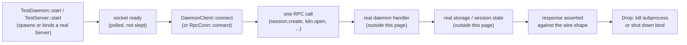
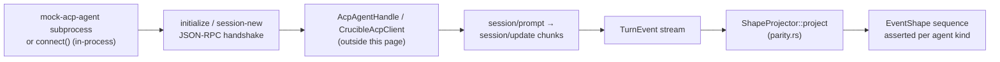

# Test Architecture

This page names every test file, harness and fixture under each crate's
`tests/` directory and the in-crate test trees `crates/crucible-cli/src/tui/oil/tests/` and
`crates/crucible-cli/src/tui/oil/chat_app/tests.rs`. It does not cover inline
`#[cfg(test)]` modules beside production code elsewhere in the workspace;
[[TUI Chat App]], [[Oil Renderer]] and the other subsystem pages name those
where they matter. `just test <tier>` (see [State, concurrency and
lifecycle](#state-concurrency-and-lifecycle)) is the one entry point that runs
every file this page describes.

## Purpose and ownership

This subsystem owns:

- Every integration-test binary under each crate's `tests/` directory and
  the two test trees that live beside `crucible-cli`'s TUI source
  (`crates/crucible-cli/src/tui/oil/tests/`,
  `crates/crucible-cli/src/tui/oil/chat_app/tests.rs`).
- The shared test harnesses each crate keeps for its own binaries:
  `TestDaemon`/`RpcConn` (`crates/crucible-daemon/tests/common/mod.rs`),
  `AppHarness`/`Vt100TestRuntime` (`crates/crucible-cli/src/tui/oil/test_harness.rs`,
  outside this page, and `crates/crucible-cli/src/tui/oil/tests/vt100_runtime.rs`),
  `TuiTestSession` (`crates/crucible-cli/tests/tui_e2e_harness.rs`), the one
  scripted mock ACP agent (`crates/crucible-daemon/tests/acp_support/`), and
  the proptest case-budget helpers (`crates/crucible-oil/tests/common/mod.rs`).
- The source-scan architecture gates: `crates/crucible-cli/tests/architecture_tests.rs`,
  `crates/crucible-daemon/tests/architecture_tests.rs`,
  `crates/crucible-daemon/tests/architecture_tests/wire_types.rs`.
- The docs-truth gates that run real parsers/loaders against the shipped
  `docs/` kiln: `crates/crucible-core/tests/dev_kiln.rs`,
  `crates/crucible-core/tests/docs_config.rs`,
  `crates/crucible-lua/tests/docs_lua_config.rs`.
- The `just test <tier>` recipe (`justfile`) and
  `assets/test-tiers/external.txt`, the generated file that recipe reads.

This subsystem must not own:

- Business logic. A test proves a rule that some other page's production code
  states and enforces; per AGENTS.md, "Bugfixes start red" and "test that
  actual crossing" when behavior crosses a process or language boundary — the
  rule itself belongs to the owning subsystem's page.
- A second write pipeline or a second config store. Every harness on this
  page (`TestDaemon`, `TestServer`, `TuiTestSession`) drives the real
  `crucible-daemon::Server`, the real `CliAppConfig`/Lua config-store, or a
  real `cru` binary; none constructs its own parallel agent, storage, or
  config path — matching AGENTS.md's "clients send intent; they must not
  construct a second agent configuration or write pipeline" for the daemon
  boundary, and the equivalent rule for config in [[Config Boot]].
- Mocking what a contract test exists to disprove. `crates/crucible-web/tests/route_contract_tests/`
  mocks the daemon socket deliberately (HTTP-shape proof only); its own
  sibling files (`config_daemon_e2e.rs`, `router_security.rs`) exist
  specifically because, per `config_daemon_e2e.rs`'s comment, "the mock-backed
  route tests prove the forwarding. They cannot prove the gate."

## Module map

Every path below is a real file at `582c5e6c1`; lines are `wc -l` counts.
Roles are condensed from the file's own doc comment or its test names.

### `crates/crucible-cli/src/tui/oil/chat_app/tests.rs`

| Path | Lines | Role |
| --- | --- | --- |
| `crates/crucible-cli/src/tui/oil/chat_app/tests.rs` | 943 | Unit suite for `OilChatApp`: mode cycling and its "· PROPOSES" badge for a proposing mode, setup-event propagation, runtime-config round trip, shell/precognition transcript recording (one note per line, two-digit score), frame-clock tool splitting, plugin surface-modal lifecycle, the full-screen `:diff` view, structured status items (`:status`), and the proposals Inbox (`:proposals`). |

### `crates/crucible-cli/src/tui/oil/tests/` — framework and Phase-7 component tests

| Path | Lines | Role |
| --- | --- | --- |
| `crates/crucible-cli/src/tui/oil/tests/component_isolation_tests.rs` | 996 | Renders `StatusBar` (including status-item overflow and named color groups), `PopupOverlay`, `InputComponent` in isolation; asserts plain-text and ANSI output against theme colors and width limits; also asserts a tool card's collapsed summary comes from the call's `ToolRender`, never a per-tool-name table. |
| `crates/crucible-cli/src/tui/oil/tests/container_snapshot_tests.rs` | 346 | `ChatNode` state assertions plus VT100 rendering snapshots of streaming state. |
| `crates/crucible-cli/src/tui/oil/tests/e2e_debug_test.rs` | 1313 | 13 large multi-turn scenarios: streaming, thinking, tools, cancellation, terminal resize, modals. |
| `crates/crucible-cli/src/tui/oil/tests/event_loop_tests.rs` | 216 | Event handling, render performance and key-binding tests for the app's event loop. |
| `crates/crucible-cli/src/tui/oil/tests/event_tests.rs` | 416 | Unit tests for `InputBuffer` text handling and key-event translation. |
| `crates/crucible-cli/src/tui/oil/tests/fixture_replay_tests.rs` | 607 | Replays JSONL session recordings through the app; checks rendering invariants and color/styling snapshots; its `parse_fixture` helper is `pub(super)` and reused by `layout_cache_tests.rs`. |
| `crates/crucible-cli/src/tui/oil/tests/focus_tests.rs` | 79 | Unit tests for `FocusContext` keyboard-navigation state. |
| `crates/crucible-cli/src/tui/oil/tests/frame_time_bench.rs` | 102 | Ignored manual-inspection timing measurements (median/p99/max frame time and bytes) for a ~5,000-row transcript, streaming and on a width change; proves the layout-cache perf claim, not a CI gate. |
| `crates/crucible-cli/src/tui/oil/tests/generators.rs` | 8 | Property-test generator helpers shared by this directory's proptest files. |
| `crates/crucible-cli/src/tui/oil/tests/graduation_tests.rs` | 281 | Tests graduation: moving streaming content to scrollback and collapsing thinking blocks. |
| `crates/crucible-cli/src/tui/oil/tests/helpers.rs` | 140 | Fixture loading (`read_fixture`), sized VT100 rendering (`vt_render_sized`), and the no-triple-blank-line assertion every sibling file calls. |
| `crates/crucible-cli/src/tui/oil/tests/input_buffer_property_tests.rs` | 193 | Property tests for `InputBuffer` under arbitrary Unicode input. |
| `crates/crucible-cli/src/tui/oil/tests/inter_frame_invariant_tests.rs` | 923 | Invariant checks run after every frame of realistic multi-turn conversations; the core rendering-consistency test. |
| `crates/crucible-cli/src/tui/oil/tests/layout_cache_tests.rs` | 415 | Byte-for-byte proof that the row-cache render path (`render_frame`) and the from-source layout path (`OilChatApp::view`) agree, across streaming, tool cards, display-toggle, width/theme changes, clear, and seven recorded fixtures. |
| `crates/crucible-cli/src/tui/oil/tests/layout_test_helpers.rs` | 794 | Structural layout-tree assertion library, used instead of brittle string matching. |
| `crates/crucible-cli/src/tui/oil/tests/layout_tests.rs` | 288 | Tests the Taffy-based `build_layout_tree` box model: sizing, flex distribution, gap, padding, margin. |
| `crates/crucible-cli/src/tui/oil/tests/markdown_fuzz_tests.rs` | 429 | Adversarial fuzz input for `markdown_to_node`; asserts the renderer never panics. |
| `crates/crucible-cli/src/tui/oil/tests/message_routing_tests.rs` | 468 | Asserts every `ChatAppMsg` variant reaches its correct handler and produces the expected state change, including the "· PROPOSES" statusline suffix for a proposing mode. |
| `crates/crucible-cli/src/tui/oil/tests/mod.rs` | 36 | Module root; declares "surviving framework" tests and "Phase 7 component model" tests as two groups, plus `transcript_fixtures` (shared long-transcript builders), `frame_time_bench` (ignored perf measurements) and `layout_cache_tests` (row-cache-vs-fresh-layout proofs). |
| `crates/crucible-cli/src/tui/oil/tests/node_tests.rs` | 350 | Tests node constructors (`text`, `col`, `row`, `spinner`, `fragment`) and combinators (`with_style`, `with_padding`, `with_border`). |
| `crates/crucible-cli/src/tui/oil/tests/permission_invariant_tests.rs` | 552 | Property tests for the permission system: no write without consent, Esc always denies, diff accuracy, pattern persistence, and a daemon-cancelled prompt (`interaction_completed`) leaves the TUI whether shown or queued. |
| `crates/crucible-cli/src/tui/oil/tests/popup_tests.rs` | 488 | Popup rendering, selection, item description, kind indicator and anchoring; minimal vs. panel completion styles. |
| `crates/crucible-cli/src/tui/oil/tests/property_tests.rs` | 831 | Property tests for rendering, layout, focus/input-buffer invariants, mode cycling, markdown block spacing, ordered-list rendering. |
| `crates/crucible-cli/src/tui/oil/tests/region_placement_tests.rs` | 66 | Regression: statusline regions render their authored content, guarding against a hardcoded bar overriding configured layout. |
| `crates/crucible-cli/src/tui/oil/tests/render_tests.rs` | 627 | Text layout, wrapping, nesting, cursor tracking, gaps, and two-column-layout snapshots. |
| `crates/crucible-cli/src/tui/oil/tests/rendering_regression_tests.rs` | 469 | Regression tests for visual artifacts, styling consistency and multi-turn flows in the container system. |
| `crates/crucible-cli/src/tui/oil/tests/replay_mode_tests.rs` | 99 | Tests the chat runner's replay gates: a drained `UserMessage` never sends, because `process_message` gets no session (`Option<&LiveSession>` is `None`), so a resume or a replay cannot re-send an old prompt; drives a `FakeDaemon` for the live send `process_action` exercises. |
| `crates/crucible-cli/src/tui/oil/tests/session_event_stream_tests.rs` | 488 | Tests `SessionEventStream`'s replay-deduplication rule for text and thinking deltas, plus subagent and token-count event mapping. |
| `crates/crucible-cli/src/tui/oil/tests/spacing_tests.rs` | 488 | Blank-line spacing rules between transcript node types; regression coverage for modal and graduation-boundary spacing bugs. |
| `crates/crucible-cli/src/tui/oil/tests/transcript_fixtures.rs` | 66 | Shared long-transcript builders (markdown with lists, code, CJK, ZWJ emoji) for `frame_time_bench` and `layout_cache_tests`; needs no daemon. |
| `crates/crucible-cli/src/tui/oil/tests/vt100_runtime.rs` | 249 | `Vt100TestRuntime` harness: feeds the app's real ANSI output through a `vt100::Parser` for screen-level assertions; `present_fullscreen` writes a full-screen frame (built directly with `FullscreenView`/`FullscreenShell`) through the same row-diff/alternate-screen protocol production uses, and `vt_screen()` exposes the raw `vt100::Screen` for cell-level assertions. |

### `crates/crucible-cli/src/tui/oil/tests/user_story_tests/`

| Path | Lines | Role |
| --- | --- | --- |
| `crates/crucible-cli/src/tui/oil/tests/user_story_tests/acp_parity_tests.rs` | 553 | US-307: an ACP-delegated tool-call turn renders identically to an internally-run one except for a provenance badge, including a late permission grant (Rule 7) marking the card `[auto]`; also covers the C3 permission-category divergence. Tool-result summaries come from the daemon's per-call `ToolRender`, not a per-tool-name synonym table. |
| `crates/crucible-cli/src/tui/oil/tests/user_story_tests/agent_card_tests.rs` | 25 | US-909: a card-backed chat draws the daemon's resolved model, not the client's initial card label. |
| `crates/crucible-cli/src/tui/oil/tests/user_story_tests/clear_tests.rs` | 100 | US-902 (and plugin-turn provenance): a `context_cleared` event renders inline without hiding the prior turn; plugin-turn/prompt/permission labels and relay origins survive a resume through `migrate_history`. |
| `crates/crucible-cli/src/tui/oil/tests/user_story_tests/completion_frame_tests.rs` | 142 | US-505: the `/`-triggered completion popup overlays the transcript bottom-anchored; it never moves the prompt or grows the frame. |
| `crates/crucible-cli/src/tui/oil/tests/user_story_tests/diff_tests.rs` | 172 | US-910: a loaded `Diffset` (branch or session-record source) reaches the frame — base, file position, rename/delete lines, added/removed content, paging keys, and an `unreadable_roots` warning row in the warning color above the first file. |
| `crates/crucible-cli/src/tui/oil/tests/user_story_tests/fullscreen_tests.rs` | 294 | US-804/US-306/US-908 in the full-screen (now default) mode: mouse drag-select/copy, PageUp-holds-the-reader while streaming, tool-card render tables, and a surface panel as the whole frame — built directly with `FullscreenView`/`FullscreenShell` and fed through `Vt100TestRuntime::present_fullscreen`, since the full-screen frame is built outside `OilChatApp::view`. |
| `crates/crucible-cli/src/tui/oil/tests/user_story_tests/mod.rs` | 40 | Module index for one file per TUI user-story group; documents the split from inline dispatch-matrix tests in `chat_app` submodules. |
| `crates/crucible-cli/src/tui/oil/tests/user_story_tests/notification_tests.rs` | 150 | US-701 (toast lifecycle), US-702 (messages drawer) and US-704 (`:messages clear` closes every notification, and asks the daemon to dismiss only the ones it owns) render-level tests. |
| `crates/crucible-cli/src/tui/oil/tests/user_story_tests/paste_tests.rs` | 62 | US-106: bracketed paste delivers multiline content as one atomic buffer insert, never line-by-line. |
| `crates/crucible-cli/src/tui/oil/tests/user_story_tests/permission_tests.rs` | 121 | US-401 end-to-end permission-modal flow (approve/deny/queueing), including refusing an "Allowlist"/`y/n/a` choice for a call that no grant can name; an exemplar for the `vocab.rs` intent-vocabulary style. |
| `crates/crucible-cli/src/tui/oil/tests/user_story_tests/precognition_tests.rs` | 43 | US-209: the precognition notice's daemon event (`precognition_complete`) reaches the frame with one note per line and a two-digit score, never the raw `f64`. |
| `crates/crucible-cli/src/tui/oil/tests/user_story_tests/resume_tests.rs` | 92 | US-912: `/resume` opens a session picker (`FetchSessions`→`SessionsLoaded`→`ResumeSession`), proven in both the inline and the full-screen render paths. |
| `crates/crucible-cli/src/tui/oil/tests/user_story_tests/scroll_tests.rs` | 76 | US-801: scroll ownership by the shell modal's scroll region; notes main-viewport scrollback review as a real-terminal (T4/PTY) concern this file cannot reach. |
| `crates/crucible-cli/src/tui/oil/tests/user_story_tests/shell_tests.rs` | 136 | US-601/602: shell-modal execution — spawn, poll to completion, exit code/output, insertion into composer or transcript. |
| `crates/crucible-cli/src/tui/oil/tests/user_story_tests/status_items_tests.rs` | 153 | US-911: the daemon's `status_items_changed` event (`StatusDisplayItem` list) reaches the frame identically in the inline and full-screen render paths (same text, same per-cell colors); a narrow status row keeps the state word of a pinned plugin-turn item and truncates the plugin name instead. |
| `crates/crucible-cli/src/tui/oil/tests/user_story_tests/stop_reason_tests.rs` | 81 | US-206: a reply cut off by the provider (`max_tokens`, refusal) must say so on screen; the render half of `chat_runner`'s translation logic. |
| `crates/crucible-cli/src/tui/oil/tests/user_story_tests/stream_gap_tests.rs` | 86 | US-907: the transcript admits when daemon events were dropped (a `stream_gap` event); the render half of `chat_runner`'s stream-gap logic. |
| `crates/crucible-cli/src/tui/oil/tests/user_story_tests/subagent_mcp_tests.rs` | 160 | US-302 (subagent/delegation display) and US-303 (`:mcp` server-status listing). |
| `crates/crucible-cli/src/tui/oil/tests/user_story_tests/support.rs` | 300 | `StoryRuntime`, the shared driver wrapping `OilChatApp` and `Vt100TestRuntime`, that every file in this directory depends on. |
| `crates/crucible-cli/src/tui/oil/tests/user_story_tests/surface_tests.rs` | 269 | US-908: a Lua plugin's declared surface panel reaches the frame without stealing focus, and respects withdrawal cleanly (the inline-mode T2 frame; the full-screen-mode equivalent is `fullscreen_tests::a_surface_is_the_whole_full_screen_frame`). |
| `crates/crucible-cli/src/tui/oil/tests/user_story_tests/tool_render_tests.rs` | 229 | US-306: the tool card and the permission modal draw the daemon-sent `render` (line, fields, result summary) verbatim, never rebuilding from raw arguments; an old (pre-render) transcript still shows its lines/diffs and one error per failed turn after `migrate_history`. |
| `crates/crucible-cli/src/tui/oil/tests/user_story_tests/turn_end_tests.rs` | 123 | US-207: every `turn_finished` status (including `handler_cancelled`/`timed_out`) ends the console's streaming state and shows its error/reason; a `turn:complete`-handler-started turn renders as its own turn under the first. |
| `crates/crucible-cli/src/tui/oil/tests/user_story_tests/undo_tests.rs` | 140 | US-902: `/undo`'s render half — the daemon's `UndoComplete` toast and viewport truncation when history clears and re-emits, and the refusal reason shown (never a success toast) when the daemon refuses undo on an ACP-delegated session, proved against a `FakeDaemon` answering `session.undo` with that refusal. |
| `crates/crucible-cli/src/tui/oil/tests/user_story_tests/vocab.rs` | 231 | Intent-level verbs (`send_user_message`, `approve_permission`, …) over `StoryRuntime`, so story tests read as user intent, not raw key codes. |
| `crates/crucible-cli/src/tui/oil/tests/user_story_tests/vocab_tests.rs` | 72 | Exemplar/smoke tests for the vocab layer and `StoryRuntime::settle`/`expect_frame`. |

### `crates/crucible-cli/src/tui/oil/tests/vt100_runtime_tests/`

| Path | Lines | Role |
| --- | --- | --- |
| `crates/crucible-cli/src/tui/oil/tests/vt100_runtime_tests/mod.rs` | 53 | Module root for screen-level tests driven through `Vt100TestRuntime`, split out of `vt100_runtime.rs`; holds shared helpers. |
| `crates/crucible-cli/src/tui/oil/tests/vt100_runtime_tests/spacing.rs` | 523 | Exact blank-line spacing between graduated content types (user message, thought, tool), across single and multi-frame renders, at vt100-parsed screen level. |
| `crates/crucible-cli/src/tui/oil/tests/vt100_runtime_tests/spinner_leak.rs` | 781 | Regression suite: no spinner glyph survives graduation into scrollback or lingers after a turn completes; covers four historically distinct leak bugs. |

### `crates/crucible-cli/tests/` — CLI binary-level tests

| Path | Lines | Role |
| --- | --- | --- |
| `crates/crucible-cli/tests/acp_wire_tests.rs` | 731 | Pins the v1 ACP wire format `cru acp` writes to stdout against ACP SDK major-version changes, and runs full prompt turns — reply, cancellation, and tool permission approve/reject — through a real `cru acp` process and an in-file OpenAI-compatible mock provider. |
| `crates/crucible-cli/tests/agent_factory_config_tests.rs` | 491 | Agent creation with varied LLM provider configurations: parsing, validation, multi-provider setups. |
| `crates/crucible-cli/tests/agent_factory_integration.rs` | 111 | `AgentInitParams` builder for both ACP and internal agents. |
| `crates/crucible-cli/tests/architecture_tests.rs` | 1059 | Source-scan gates for TUI-side rules in AGENTS.md — see [Boundaries and invariants](#boundaries-and-invariants). |
| `crates/crucible-cli/tests/auth_e2e_helpers.rs` | 428 | Shared harness for `cru auth` E2E tests: env isolation, credential fixtures, kiln creation. |
| `crates/crucible-cli/tests/auth_e2e_tests.rs` | 370 | `cru auth login`/`logout`/`list`: credential storage, env-var override, multiple providers, empty-key rejection. |
| `crates/crucible-cli/tests/bases_cli.rs` | 105 | Real `cru base create`/`query`/`list`/`views`/`set` against a real daemon and kiln; proves the stale-ancestor-hash refusal and clap's own required-arg gate ahead of the daemon. |
| `crates/crucible-cli/tests/cli_e2e_acp.rs` | 271 | ACP session lifecycle at the binary level: help text, profile resolution, and a full create → send → end run that asserts the mock agent's reply text and turn-completion marker, not just a zero exit. |
| `crates/crucible-cli/tests/cli_e2e_delegation.rs` | 279 | `session configure`/`session send` with tool calls, especially unavailable-tool delegation. |
| `crates/crucible-cli/tests/cli_e2e_diff.rs` | 97 | `cru diff branch` against a real daemon and git repo: admission refusal for an unregistered root, subdirectory-relative invocation, and a clean (no-ANSI) pipe. |
| `crates/crucible-cli/tests/cli_e2e_helpers.rs` | 282 | Shared harness for CLI E2E tests: hermetic `cru` invocation, daemon isolation, config fixtures. |
| `crates/crucible-cli/tests/cli_e2e_init_registrations.rs` | 181 | `cru init` registers with the daemon, not the user's config file. |
| `crates/crucible-cli/tests/cli_e2e_internal.rs` | 258 | Internal-session lifecycle commands (create, list, show, send, pause, resume, end) at the binary level. |
| `crates/crucible-cli/tests/cli_e2e_proposal.rs` | 201 | `cru proposal list`/`accept`/`resolve` against a real daemon: note writes, Inbox removal on accept, multi-kiln conflict and `--root`-disambiguated resolve. |
| `crates/crucible-cli/tests/cli_help_snapshot_tests.rs` | 174 | `insta` snapshots pinning user-facing help output and subcommand inference, including `cru proposal --help`. |
| `crates/crucible-cli/tests/config_acquisition_e2e.rs` | 153 | Bootstrap commands complete with no daemon and spawn none; daemon-backed commands against a daemon on a different config root are refused. |
| `crates/crucible-cli/tests/config_command_tests.rs` | 635 | `config init`/`show`/`dump`: value-source tracking, JSON output, partial configs, edge cases. |
| `crates/crucible-cli/tests/config_migrate_tests.rs` | 257 | `cru config migrate`: the one-time TOML-to-Lua generator, machine-state split, abort discipline, acceptance flow. |
| `crates/crucible-cli/tests/config_tests.rs` | 268 | `CliConfig` parsing from TOML, env-var overrides, error cases, defaults. |
| `crates/crucible-cli/tests/consistency_tests.rs` | 224 | `cru process` and `cru stats` must agree on file counts, discovery and exclusion. |
| `crates/crucible-cli/tests/enrichment_factory_integration.rs` | 208 | Enrichment cache-key generation from LLM config; uniqueness across providers/models. |
| `crates/crucible-cli/tests/eval_precognition_e2e.rs` | 165 | `cru eval precognition` measures retrieval quality using the same search path live precognition uses. |
| `crates/crucible-cli/tests/init_integration.rs` | 147 | `cru init` kiln initialization: directory structure, idempotency, force-reinit, isolation from global config. |
| `crates/crucible-cli/tests/integration_tests.rs` | 512 | CLI parsing and help-text coverage via `assert_cmd` for every major command and flag. |
| `crates/crucible-cli/tests/model_flow_log_tests.rs` | 161 | The `model_flow` tracing target logs `FetchModels`/`Loading`/`Loaded`/`Failed` transitions with correct fields. |
| `crates/crucible-cli/tests/oneshot_precognition_query_e2e.rs` | 264 | `cru chat -q` passes the user's unaltered question to the daemon; precognition searches with that question, not a CLI-prepended block. |
| `crates/crucible-cli/tests/plugin_cli_contract.rs` | 82 | `cru plugin test`/`stubs`/`check`: suite results, type errors and Luau type-checking reach the CLI. |
| `crates/crucible-cli/tests/process_command_tests.rs` | 514 | `cru process`: pipeline execution, persistent storage, change detection, force flag, single-file mode, verbose/dry-run. |
| `crates/crucible-cli/tests/process_explicit_path_regression.rs` | 163 | Regression: `cru process <path>` indexes the named path, not the configured `kiln_path`. |
| `crates/crucible-cli/tests/replay_cru_session_replay_still_works.rs` | 42 | Compile-time guard: `DaemonClient::session_replay` keeps its signature after the TUI-only replay refactor. |
| `crates/crucible-cli/tests/replay_flag_validation.rs` | 121 | `cru chat --replay` flag-combination validation, run before daemon work in `chat::execute`. |
| `crates/crucible-cli/tests/replay_no_daemon.rs` | 97 | Regression: `cru chat --replay` makes zero socket or network `connect()` calls (Linux-only, `strace`). |
| `crates/crucible-cli/tests/replay_rendering.rs` | 94 | Regression: replaying the demo fixture renders with no RPC-error strings or warning badges (spawns `cru` in a PTY). |
| `crates/crucible-cli/tests/standalone_integration.rs` | 213 | `cru --standalone`: flag parsing, in-process daemon startup, isolation from a running daemon, persistence-directory creation. |
| `crates/crucible-cli/tests/storage_factory_integration.rs` | 273 | `get_storage()` factory connects through the daemon, preventing database-lock errors; serialized to avoid env-var conflicts. |
| `crates/crucible-cli/tests/tui_e2e_harness.rs` | 914 | `TuiTestSession`: PTY spawn/send/expect/capture, vt100 screen parsing, recording, and `home()` (the hermetic `HOME` of the child, for reaching its socket and data root directly) — the foundation every `tui_e2e_tests/` file builds on. |
| `crates/crucible-cli/tests/tui_e2e_tests.rs` | 76 | Mounts `tui_e2e_harness` and the eleven `tui_e2e_tests/` submodules. |

### `crates/crucible-cli/tests/tui_e2e_tests/`

| Path | Lines | Role |
| --- | --- | --- |
| `crates/crucible-cli/tests/tui_e2e_tests/chat.rs` | 467 | Startup, input, slash commands, navigation, multi-turn flow, mode switching, stress, and a hang-bug regression, over a real PTY; the scrollback regression selects `--inline`, since only that mode writes into scrollback. |
| `crates/crucible-cli/tests/tui_e2e_tests/errors.rs` | 137 | CLI error messages and exit codes: invalid options, valid help/version, process-command edge cases. |
| `crates/crucible-cli/tests/tui_e2e_tests/hero.rs` | 380 | Hero-flow legs 1 and 3, driven by the Playwright harness `crates/crucible-web/web/e2e/live/hero.live.spec.ts`, which stands up an isolated daemon, `cru web` and a fake Ollama; the legs attach to that same daemon and hand off through a JSON state file. |
| `crates/crucible-cli/tests/tui_e2e_tests/model.rs` | 495 | Model popup and flow: display, lazy fetch, filtering, selection, direct switch, error states, and regressions for duplicate loading messages and double-border artifacts. |
| `crates/crucible-cli/tests/tui_e2e_tests/oil.rs` | 301 | Oil-runner responsiveness, streaming, Ctrl+C edge cases, mode switching, rapid-input rendering before exit. |
| `crates/crucible-cli/tests/tui_e2e_tests/popup.rs` | 205 | Oil-runner popup/stress/error handling: F1 toggle, arrow navigation, rapid typing, alternating input/commands. |
| `crates/crucible-cli/tests/tui_e2e_tests/screen.rs` | 119 | US-804: which screen (alternate vs. main) `cru chat` draws on by default, under `--inline`, under `cli.screen = "inline"`, and during the first-run wizard. |
| `crates/crucible-cli/tests/tui_e2e_tests/session_store.rs` | 195 | The TUI opens its Lua session only under the daemon's own `session.create` id, writes no session folder of its own, and `/resume` (US-912) switches the running console to a chosen sibling session. |
| `crates/crucible-cli/tests/tui_e2e_tests/shared.rs` | 80 | Shared helpers: binary location, config creation, macro utilities for this directory. |
| `crates/crucible-cli/tests/tui_e2e_tests/smoke.rs` | 133 | `--version`/`--help` and subcommand help; run by default (not `#[ignore]`d), skips if the binary is unbuilt. |
| `crates/crucible-cli/tests/tui_e2e_tests/terminal.rs` | 100 | TUI rendering across terminal dimensions (narrow, wide, short). |
| `crates/crucible-cli/tests/tui_e2e_tests/vt100.rs` | 136 | Exemplar tests for the recommended vt100 screen-assertion pattern. |

### `crates/crucible-core/tests/`

| Path | Lines | Role |
| --- | --- | --- |
| `crates/crucible-core/tests/common/docs_kiln.rs` | 125 | Shared `docs/`-walking logic (`is_authored`, `is_committable` against `git ls-files`) used identically by `dev_kiln.rs` and `docs_config.rs`; replaced two copies that had drifted. |
| `crates/crucible-core/tests/common/mod.rs` | 3 | `pub mod docs_kiln;` — module wiring only. |
| `crates/crucible-core/tests/config_permission_integration.rs` | 105 | `PermissionEngine`/`PermissionConfig` pipeline: config allow/deny/ask rules, hardcoded denial, chained-bash and path-traversal handling. |
| `crates/crucible-core/tests/config_workspace_toml_backward_compat.rs` | 37 | `read_kiln_config`/`read_project_config` still fall back to a legacy `.crucible/workspace.toml`. |
| `crates/crucible-core/tests/dev_kiln.rs` | 1091 | `#[ignore]`d docs-truth gate: parses, checks frontmatter, resolves every wikilink, checks Help-note reachability and code-reference line accuracy across the real `docs/` kiln — see [Boundaries and invariants](#boundaries-and-invariants). |
| `crates/crucible-core/tests/docs_config.rs` | 450 | `#[ignore]`d gate: every ` ```toml ` fence under `docs/Help`/`docs/Guides` loads through the real `CliAppConfig`/`ProjectConfig` loader, with a `serde_ignored` pass catching keys no struct claims. |
| `crates/crucible-core/tests/markdown_parser_contract_tests.rs` | 249 | `CrucibleParser` behavioral contract, plus `mod never_panics_on_multibyte`, a dedicated Unicode-safety regression suite for markdown-it extensions. |
| `crates/crucible-core/tests/note_edit.rs` | 248 | Exhaustive safety suite for `apply_anchored_edits`: atomicity, anchor precision, ambiguity, line-ending fidelity, overlap detection, anti-reentrancy. |
| `crates/crucible-core/tests/public_properties.rs` | 58 | `public_properties` strips every daemon-stamped key (notably `scope`, which carries an absolute host path) before a note's properties reach a reader. |
| `crates/crucible-core/tests/workflow_fixtures.rs` | 54 | Parses an on-disk workflow fixture through `WorkflowDoc::from_parsed`; proves the parser extracts goals, validations, gates and per-step bindings correctly. |

### `crates/crucible-daemon/tests/acp_integration/`

| Path | Lines | Role |
| --- | --- | --- |
| `crates/crucible-daemon/tests/acp_integration/agent_handshake_tests.rs` | 342 | Parameterized handshake/create/resume/close across Claude-ACP and OpenCode `MockScript`s; asserts the ACP client's own error text and a typed `acp_resume_fallback` event. |
| `crates/crucible-daemon/tests/acp_integration/concurrent_sessions.rs` | 109 | Concurrent session isolation, chunk-ordering preservation, and large/empty responses, driven through the shared `MockScript`/`connect` helper. |
| `crates/crucible-daemon/tests/acp_integration/context_usage.rs` | 237 | ACP `usage_update` frames propagate to `context_limit_resolved`/`message_complete` session events; drives a real `AgentManager` end to end via `TurnEvent` (not `StreamingChunk`), and needs an `AcpConfig` profile entry for the mock agent's own path. |
| `crates/crucible-daemon/tests/acp_integration/display_parity.rs` | 610 | `TurnEvent` wire parsing: tool-call arguments, results, diffs (now carried on `CanonicalToolCall`), graceful degradation without usage data. Despite the name, stops above the `SessionEventMessage` boundary; real display parity is proven by `crates/crucible-cli/src/tui/oil/tests/user_story_tests/acp_parity_tests.rs`. |
| `crates/crucible-daemon/tests/acp_integration/error_propagation.rs` | 198 | Connection/handshake timeouts, mid-stream agent stall and crash, and the turn-gate hold across a timeout (a late frame of a timed-out turn must not leak into the next turn). |
| `crates/crucible-daemon/tests/acp_integration/mcp_integration.rs` | 132 | A live `InProcessMcpHost` over Streamable HTTP: URL format, reachability, graceful shutdown, and that a missing `text/event-stream` Accept header still succeeds. The stdio-variant MCP-server frame is asserted in `acp_transport_negotiation.rs`, not here. |
| `crates/crucible-daemon/tests/acp_integration/mod.rs` | 28 | Hosts 11 test modules and imports `acp_support`; the module doc states no test needs a real agent binary. |
| `crates/crucible-daemon/tests/acp_integration/permission_flow.rs` | 480 | `session/request_permission` round trip, asserted from the mock agent's own frame log rather than from the agent's derived text: handler invocation, approve/deny, an unset handler defaulting to `cancelled`, an unknown `toolCallId`, and a turn the daemon drops while a permission question is still open. |
| `crates/crucible-daemon/tests/acp_integration/session_modes.rs` | 165 | Agent-declared modes from `session/new` replace Crucible's internal defaults; mode switching and no-modes fallback; the agent's advertised modes are scripted through a `MockScript`, not a `CRU_MOCK_ADVERTISE_MODES` env var. |
| `crates/crucible-daemon/tests/acp_integration/streaming_chat.rs` | 184 | End-to-end streaming: `session/prompt` → `session/update` chunks → final `PromptResponse`; cancellation propagation. |
| `crates/crucible-daemon/tests/acp_integration/tool_roundtrip.rs` | 409 | Tool-call notification flow through the ACP streaming pipeline via the shared `MockScript`/`connect` mock agent; asserts `TurnEvent::ToolCall`/`ToolResult` naming (no humanization — a named call keeps its own tool key, an unnamed one gets the literal fallback `"tool"`) and content accumulation after a tool call; one test drives the mock agent's own MCP call against a real `InProcessMcpHost`. |
| `crates/crucible-daemon/tests/acp_integration/turn_event_parity.rs` | 688 | `TurnEvent` contract for ACP-delegated turns against a real spawned `mock-acp-agent` subprocess, scripted through `MockScript`; asserts the ACP agent's own event shape, not equality with the internal agent. |

### `crates/crucible-daemon/tests/acp_support/`

| Path | Lines | Role |
| --- | --- | --- |
| `crates/crucible-daemon/tests/acp_support/mcp_http.rs` | 125 | Shared Streamable-HTTP MCP client (open-session, one request) and `InProcessMcpHost` starter; used by five ACP test files that used to each keep their own copy. |
| `crates/crucible-daemon/tests/acp_support/mock_agent.rs` | 809 | One scripted SDK-role ACP agent (`MockScript`/`Step`), served in-process over a duplex pipe (`connect`) or as the `mock-acp-agent` binary via `CRU_MOCK_SCRIPT` (`serve`); replaces `MockStdioAgent` and `ThreadedMockAgent`. `Step::Hold` can hold a turn open across `session/cancel` in both forms. |
| `crates/crucible-daemon/tests/acp_support/mock_agent_bin.rs` | 316 | Locates the `mock-acp-agent` binary; builds `SessionAgent`/`AcpAgentHandleParams` for it; and owns `mock_session`/`MockSession`, the one place every ACP e2e test builds its mock-agent chat session through the production `AgentManager`. |
| `crates/crucible-daemon/tests/acp_support/mod.rs` | 21 | Re-exports the sibling files (`mcp_http`, `mock_agent`, `mock_agent_bin`, `parity`) so `acp_support` can be included by name. |
| `crates/crucible-daemon/tests/acp_support/parity.rs` | 565 | `ShapeProjector`: normalizes a `TurnEvent` stream into a comparable `EventShape` sequence per agent, deliberately never comparing ACP shapes to internal-agent shapes. |

### `crates/crucible-daemon/tests/architecture_tests/`

| Path | Lines | Role |
| --- | --- | --- |
| `crates/crucible-daemon/tests/architecture_tests/wire_types.rs` | 340 | Compile-time-adjacent gate: every wire request type in `WIRE_REQUEST_TYPES` is deserialized by turbofish at its server call site, never hand-plucked field by field. |

### `crates/crucible-daemon/tests/bin/`

| Path | Lines | Role |
| --- | --- | --- |
| `crates/crucible-daemon/tests/bin/mock-acp-agent.rs` | 17 | `main()` calling `mock_agent::serve(MockScript::from_env(), Stdio::new())`: an async subprocess wrapper with no CLI flags of its own — the script (behavior, capabilities, turn steps) arrives entirely through the `CRU_MOCK_SCRIPT` JSON environment variable. |

### `crates/crucible-daemon/tests/common/`

| Path | Lines | Role |
| --- | --- | --- |
| `crates/crucible-daemon/tests/common/mod.rs` | 636 | `RpcConn` (buffered JSON-RPC socket connection) and `TestDaemon` (spawned `cru daemon serve` subprocess); shared by every subprocess-based daemon E2E test via `mod common;`. Also seeds a named `MOCK_ACP_PROFILE` for the mock agent binary when it is built. |

### `crates/crucible-daemon/tests/rpc_integration/`

| Path | Lines | Role |
| --- | --- | --- |
| `crates/crucible-daemon/tests/rpc_integration/bases.rs` | 74 | Bases RPC (`base.list`/`views`/`create_entry`/`query`/`set_property`) over the socket: query rows carry an `ancestor_hash` for optimistic concurrency, and `set_property` on `file.folder` performs a real folder move. |
| `crates/crucible-daemon/tests/rpc_integration/client.rs` | 325 | Ping, shutdown, sequential/concurrent calls, kiln operations, RPC error handling. |
| `crates/crucible-daemon/tests/rpc_integration/event_flow.rs` | 147 | Setup events do not leak into unrelated later RPC calls; concurrent event-mode calls stay isolated. |
| `crates/crucible-daemon/tests/rpc_integration/models.rs` | 351 | Model and mode switching, and the per-plugin `PluginApproval` (`ask`/`stop`/`inherit`) knob, persist and propagate through `session.get`/`status_items_changed`/`plugin_approval_changed`, decoded the same way the TUI's status line does; against a plain `DaemonClient`, with no case for client-side cache/mirror behavior, since there is no client-side handle to test. |
| `crates/crucible-daemon/tests/rpc_integration/notes.rs` | 524 | `list_notes`, `get_note_by_name`, `search_vectors`, including a seeded SQLite fixture. |
| `crates/crucible-daemon/tests/rpc_integration/recording.rs` | 101 | Recording modes accepted at `session.create`. The recording-footer path is exercised where it is actually driven, in `crates/crucible-cli/src/session.rs`'s own tests (`ending_a_live_session_sends_session_end`). |
| `crates/crucible-daemon/tests/rpc_integration/scope.rs` | 114 | Post-C2: a client-supplied `scope` param is accepted for backward compatibility but ignored — the server derives authority from `kiln_path`. |
| `crates/crucible-daemon/tests/rpc_integration/server.rs` | 71 | Shared `TestServer` fixture — one kiln named `kiln` — for every file in this directory. |
| `crates/crucible-daemon/tests/rpc_integration/sessions.rs` | 396 | Session CRUD: create, list, subscribe/unsubscribe, configure, send, cancel, clear — all against `DaemonClient` directly. |
| `crates/crucible-daemon/tests/rpc_integration/tui_flow.rs` | 182 | TUI-representative flows: `cru sessions`, `cru resume`, and a full daemon-agent lifecycle, driven by `DaemonClient` calls rather than a client-side agent handle. |

### `crates/crucible-daemon/tests/` — top level

| Path | Lines | Role |
| --- | --- | --- |
| `crates/crucible-daemon/tests/acp_cross_agent_delegation.rs` | 458 | Internal parent agent delegates to an ACP child agent running in a separate OS process, including a refusal when the parent's sandbox claim cannot cover the ACP child. |
| `crates/crucible-daemon/tests/acp_daemon_rpc_e2e.rs` | 241 | An ACP turn driven entirely through the daemon's socket RPC surface, scripted through a `MockScript` in the agent's environment. |
| `crates/crucible-daemon/tests/acp_delegation_e2e.rs` | 241 | `delegate_session` tool visibility gated on delegation enablement and context presence; semantic search in both states; the `InProcessMcpHost`/MCP-over-HTTP plumbing is now the shared `acp_support/mcp_http.rs`. |
| `crates/crucible-daemon/tests/acp_fixture_replay.rs` | 1519 | Replays recorded fixtures from real agent binaries — identity, session id, `TurnEvent` shapes, answer text, thinking, usage, context window, tool results — and separately classifies a fixed `tool_frames` corpus (claude, codex-rust, codex-ts, gemini, antigravity) into canonical tool calls against the shipped and user-overridden Lua key tables, joining permission requests to their tool-call cards. |
| `crates/crucible-daemon/tests/acp_integration_e2e.rs` | 152 | ACP plumbing survives crate absorptions: `DaemonToolDispatcher` routing, `DaemonToolsBridge` wiring to `DaemonToolsApi`. |
| `crates/crucible-daemon/tests/acp_mcp_containment_e2e.rs` | 184 | An ACP agent process's own call to a Crucible MCP tool (`Step::McpCall`) answers to session containment: reads inside the attached kiln succeed, reads through a symlink into an unattached kiln and writes into a session-root-protected plugin tree are refused. |
| `crates/crucible-daemon/tests/acp_mcp_permission_e2e.rs` | 184 | An ACP agent's Crucible MCP call is decided by the daemon's one tool policy (`decide_permission`): a card `deny` or an operator `[permissions]` deny rule refuses the call and the agent reads why; an asked write is decided by the MCP server itself, so the user sees exactly one prompt, not two. |
| `crates/crucible-daemon/tests/acp_permission_gate_e2e.rs` | 231 | The ACP permission gate, driven through `AgentManager` with the real Lua mode defaults loaded: an agent-reported mode id (`auto`, `plan`) never triggers the same-named Crucible mode's stance; each turn start rebinds the cached handle's turn gate; the agent receives `allow_once`/`reject_once` matching the user's answer. |
| `crates/crucible-daemon/tests/acp_prompt_injection_e2e.rs` | 336 | Daemon-computed context (precognition, plugin `transform_context`) reaches the external ACP agent's wire prompt through `acp_prompt_text`; stale system context already in the stored conversation history must not reach the agent a second time — only the current turn's injected messages do. |
| `crates/crucible-daemon/tests/acp_real_agents.rs` | 151 | Conformance: real shipped agent profiles (claude, codex, cursor, gemini, opencode, hermes) complete the ACP handshake. |
| `crates/crucible-daemon/tests/acp_resume_e2e.rs` | 532 | Resuming an ACP agent's own session across a daemon restart sends `session/resume` for the stored agent session id, replacing a stale stored id with the fallback's fresh one when the agent has forgotten it; `clear_session` opens a new ACP session under the same Crucible session id; a plugin's `clear_session` prompt reaches the agent wrapped in a `<system-message kind="plugin" ...>` tag. |
| `crates/crucible-daemon/tests/acp_review_comment_context_e2e.rs` | 557 | An attached review comment on the ACP wire, driven through a real daemon socket and a real `mock-acp-agent` process: the block reaches the ACP prompt but is never written into `session.jsonl`, unlike the internal route. |
| `crates/crucible-daemon/tests/acp_sandbox_launch_e2e.rs` | 110 | An isolation claim's exec prefix actually launches the spawned ACP agent process (argv + profile env verified via a marker file); Unix-only. |
| `crates/crucible-daemon/tests/acp_session_knobs_e2e.rs` | 580 | ACP session knob changes never kill the agent process; an exhaustive match over `SessionKnob::ALL` pins what each knob does on the wire (or its refusal), and a rebuilt handle re-sends the session's stored model. |
| `crates/crucible-daemon/tests/acp_session_modes_e2e.rs` | 346 | Agent-declared modes replace Crucible's internal set after handshake; `mode_changed` announces them. Built on the shared `mock_session` harness; no longer has its own binary-exists smoke check. |
| `crates/crucible-daemon/tests/acp_smoke.rs` | 1049 | Full ACP lifecycle smoke test: spawn → handshake → message → delegation → recording; also covers the wire-recorder fixture, a dropped/cancelled turn's grace period (`CANCELLED_TURN_GRACE`), and an agent that exits mid-turn. |
| `crates/crucible-daemon/tests/acp_transport_negotiation.rs` | 197 | `handshake()` picks stdio/HTTP/SSE from the agent's reported capabilities per the ACP spec, driven through the shared `mock_agent::connect`/`MockScript`, not a bespoke mock. |
| `crates/crucible-daemon/tests/acp_wire_e2e.rs` | 106 | The ACP wire between the daemon and a spawned agent process: a non-JSON stdout line, a pre-handshake `session/update`, `session/new`'s `cwd`, and the newline-resend guard, all run through a real `mock-acp-agent` subprocess and `AgentManager`. |
| `crates/crucible-daemon/tests/agent_routing_integration.rs` | 238 | `configure_agent` stores config for internal, ACP and unsupported agent types; `send_message` fails correctly for unsupported types. |
| `crates/crucible-daemon/tests/architecture_tests.rs` | 964 | Source-scan gates for daemon-side AGENTS.md rules — see [Boundaries and invariants](#boundaries-and-invariants). `CONFIG_METHODS` now covers `plugin_turn_limit`; `plugin_approval` is carved out as a per-plugin (non-scalar) knob shape. |
| `crates/crucible-daemon/tests/boot_idiom_e2e.rs` | 196 | One VM, one-time plugin setup, `init.lua` execution order at daemon boot. |
| `crates/crucible-daemon/tests/config_rpc_e2e.rs` | 466 | `config.set`/`get`/`effective`/`reset`/`pop`/`unset`/`origin` against the live config store. |
| `crates/crucible-daemon/tests/config_save_e2e.rs` | 320 | `config.save` persists to `settings.json`; refuses pinned leaves owned by `init.lua`. |
| `crates/crucible-daemon/tests/config_settings_file_e2e.rs` | 244 | `settings.json` persists and reloads across a daemon restart. |
| `crates/crucible-daemon/tests/config_source_is_lua_only.rs` | 141 | The deprecated `config.toml` is never read; `settings.json` is a boot input, not the source of truth; also pins `evaluate_boot_config_with_paths`'s `runtime_roots` argument so an installed runtime tree elsewhere on the machine cannot answer a test's boot. |
| `crates/crucible-daemon/tests/cru_namespace_gate.rs` | 73 | The plugin VM's `cru` table exposes exactly the declared namespaces — no undeclared keys, no missing variants. |
| `crates/crucible-daemon/tests/daemon_lifetime_e2e.rs` | 243 | Daemon readiness timeout on startup; SIGTERM handling on shutdown, including a hard 5-second exit bound covering a session write stuck on an unread FIFO and a plugin service blocked in synchronous `io.popen` I/O. |
| `crates/crucible-daemon/tests/delegation_integration.rs` | 1460 | The delegation service: child-session spawning, tool-call handling, isolation claims, card specialization, depth/concurrency limits. |
| `crates/crucible-daemon/tests/e2e.rs` | 505 | General daemon lifecycle, JSON-RPC protocol, session lifecycle, model switching. |
| `crates/crucible-daemon/tests/file_write.rs` | 569 | Checked-write conflicts, merges and replay after a daemon restart; the innermost-root containment rule for nested kilns/projects; the `fs.read` RPC; `write_many_for_roots`' all-or-nothing multi-path write with sorted-lock deadlock avoidance and rollback. |
| `crates/crucible-daemon/tests/init_lua_failure_rule.rs` | 159 | A boot parse error is fatal; a runtime error rolls back and boots anyway; the rule covers required config modules but not plugins. Boot now takes an explicit `runtime_roots` value, pinned to this repository. |
| `crates/crucible-daemon/tests/kiln_blocks_lua.rs` | 248 | A named kiln's blocks, embeddings and graph reads reach Lua through the pipeline's stored vectors and resolved edges. |
| `crates/crucible-daemon/tests/knowledge_repository_contract_tests.rs` | 55 | The mock `KnowledgeRepository` returns the expected sentinel values for missing data. |
| `crates/crucible-daemon/tests/list_tools_delegate_test.rs` | 168 | `delegate_session` is visible only when delegation is enabled. |
| `crates/crucible-daemon/tests/llm_backend_comparison.rs` | 277 | FastEmbed (ONNX) vs. Ollama embedding backends: semantic similarity and batch throughput. |
| `crates/crucible-daemon/tests/llm_embedding_edge_cases.rs` | 163 | Embedding generation on empty text, long text, special characters, Unicode, batches. |
| `crates/crucible-daemon/tests/llm_onnx_windows_diagnostics.rs` | 175 | ONNX Runtime diagnostics on Windows: DLL loading, Visual C++ Redistributable, build configuration. |
| `crates/crucible-daemon/tests/lua_degraded.rs` | 338 | The daemon starts and keeps working (kiln operations, `plugin.list`) when a plugin fails to load. |
| `crates/crucible-daemon/tests/mcp_server_tools_test.rs` | 309 | The MCP tool surface is exactly the expected set, excluding workspace tools already available in ACP; every tool has a description; the server's advertised instructions text may not name a workspace tool it does not actually serve. |
| `crates/crucible-daemon/tests/notification_rpc.rs` | 561 | The notification hub as the one store: session-scoped add/list/dismiss over `reaches`, per-session hiding of a shared notice, the once-per-workspace no-kiln info notice and its `chat.precognition_notify_no_kiln` opt-out, plus `notification.list`/`notification.dismiss` ring contract shapes. |
| `crates/crucible-daemon/tests/observe_e2e.rs` | 313 | JSONL roundtrip, markdown export, resume-append, error/tool-truncated event fidelity for session logs. |
| `crates/crucible-daemon/tests/oci_plugin.rs` | 957 | The reference OCI container-interception plugin through the real daemon runtime: tool takeover, opt-in isolation, config resolution, isolation profiles. |
| `crates/crucible-daemon/tests/plugin_config.rs` | 1060 | Plugin config precedence: declared default < caller fallback < `setup()` < explicit TOML; module isolation. |
| `crates/crucible-daemon/tests/plugin_install_authorship_e2e.rs` | 168 | A plugin installed at runtime writes the plugin config layer, not the human's own layer. |
| `crates/crucible-daemon/tests/plugin_stubs_contract.rs` | 485 | Type stubs match the real plugin VM, never source text — see [Boundaries and invariants](#boundaries-and-invariants). |
| `crates/crucible-daemon/tests/plugin_tools_commands.rs` | 270 | Plugin-declared tools and commands are actually dispatchable and reachable over RPC, not just counted. |
| `crates/crucible-daemon/tests/progressive_disclosure_test.rs` | 87 | The discover → inspect → invoke tool-discovery bridge, and its unknown-tool error path. |
| `crates/crucible-daemon/tests/proposals.rs` | 463 | Proposal accept/resolve/stale-check through a running daemon: all-or-nothing conflict blocking, settled-text-per-file resolve, and root-qualified vs. ambiguous path decisions across two kilns. |
| `crates/crucible-daemon/tests/recording_roundtrip.rs` | 369 | Text, tool, thinking, delegation and mixed event streams survive `RecordingWriter` → JSONL → `ReplaySession`. |
| `crates/crucible-daemon/tests/replay_e2e.rs` | 263 | Replayed sessions preserve event order, exact markdown, turn boundaries, model switches and tool pairing. |
| `crates/crucible-daemon/tests/replay_harness.rs` | 148 | `create_test_recording` and per-event-type constructors for synthetic JSONL recording fixtures. |
| `crates/crucible-daemon/tests/review_plugin.rs` | 116 | The shipped `review` plugin offers every review operation (changes, file, comment, comments, resolve_comment, proposals, accept_proposal, reject_proposal — 8 tools) as a session-scoped tool, backed by `diff.*`/`proposal.*` JSON-RPC instead of the removed `review.*` gate/undo/rebase RPCs. |
| `crates/crucible-daemon/tests/rpc_config_agent_e2e.rs` | 384 | `session.set_precognition`/`get_precognition` and `session.configure_agent` round trips. |
| `crates/crucible-daemon/tests/rpc_integration.rs` | 27 | Module aggregator for the ten `rpc_integration/` submodules. |
| `crates/crucible-daemon/tests/rpc_kiln_e2e.rs` | 590 | Kiln and note RPC methods over the socket: open/list/close, `list_notes`, `get_note_by_name`. |
| `crates/crucible-daemon/tests/rpc_llm_state_e2e.rs` | 145 | Recorded provider state in `<data_home>/llm.json` reaches the daemon's provider table and the client. |
| `crates/crucible-daemon/tests/rpc_platform_e2e.rs` | 428 | Platform RPC methods: `lua.*`, `plugin.*`, `project.*`, `storage.*`, `mcp.*`, `skills.*`, `agents.*`. |
| `crates/crucible-daemon/tests/rpc_session_create_agent_e2e.rs` | 692 | Daemon-owned agent resolution in `session.create`, searching every attached kiln (not only the first) for a card; mutual exclusion of `agent_card`/`agent_name`; and the daemon's own SSRF endpoint policy (refusing internal/loopback addresses unless operator-configured) enforced identically for `session.create` and `session.configure_agent`. |
| `crates/crucible-daemon/tests/rpc_session_e2e.rs` | 681 | Session lifecycle RPC: create, list, get, pause, resume, end, delete, archive, unarchive. |
| `crates/crucible-daemon/tests/rpc_session_kilnless_e2e.rs` | 257 | A kiln-less session (zero kilns) is a legitimate tools-only state, not a fallback to `data_home`. |
| `crates/crucible-daemon/tests/rpc_session_scope_e2e.rs` | 289 | Mid-session `connect_kiln`/`disconnect_kiln`/`set_workspace`, and trust-based kiln-attach refusal. |
| `crates/crucible-daemon/tests/rpc_session_storage_root_e2e.rs` | 222 | Session files live under injected `data_home`, never inside a kiln, even across kilns sharing one root. |
| `crates/crucible-daemon/tests/rpc_ui_config_e2e.rs` | 241 | `ui.config` delivers a Lua-evaluated theme in authoring form; the client resolves adaptive colors, not the daemon. |
| `crates/crucible-daemon/tests/security_enforcement.rs` | 606 | `[permissions]`/`[security.shell]` config, filesystem containment, glob escapes, and card-vs-config allow/deny precedence for internal agents. |
| `crates/crucible-daemon/tests/session_create_emits_setup_events.rs` | 370 | `session.create` emits its setup-event sequence in order, with a different set for internal vs. ACP agents. |
| `crates/crucible-daemon/tests/session_lifecycle_events.rs` | 233 | Daemon-wide `session:created`/`session:ended` events reach the broadcast bus addressed to the system session. |
| `crates/crucible-daemon/tests/session_proptest.rs` | 251 | Fuzzes session state-machine operation sequences; checks idempotence and concurrency safety. |
| `crates/crucible-daemon/tests/skills_discovery_tests.rs` | 134 | Skill discovery from directories; a same-named skill in two scopes both stay reachable (bare name to the highest priority, `scope:name` for the rest, not shadowed/hidden); runtime discovery from the `crucible-help` plugin. |
| `crates/crucible-daemon/tests/skills_parser_tests.rs` | 136 | The SKILL.md YAML+markdown parser: required fields, `allowed-tools`, missing/unclosed frontmatter. |
| `crates/crucible-daemon/tests/skills_storage_tests.rs` | 64 | Skill-storage shape, `#[ignore = "requires: live database"]`; runs only under the `external` test tier. |
| `crates/crucible-daemon/tests/streaming_mock.rs` | 122 | `TestHarness`: reusable session/agent-manager/event-broadcast setup for streaming-agent test files. |
| `crates/crucible-daemon/tests/text_search.rs` | 154 | Full-text search finds body and title text, skips unindexed file kinds (`.png`), and handles phrase vs. word queries. |
| `crates/crucible-daemon/tests/tool_unification_test.rs` | 67 | The MCP surface an ACP client sees carries only kiln and delegation tools, not workspace tools ACP already has; shares the in-process MCP host starter and MCP HTTP client in `acp_support/mcp_http.rs`. |
| `crates/crucible-daemon/tests/user_flow_e2e.rs` | 465 | The complete daemon session lifecycle over JSON-RPC: open kiln → create → configure → message → pause/resume → export → end; pause is refused (not queued) while the session's turn is still running, distinct from end/archive/delete, which cancel the turn first. |
| `crates/crucible-daemon/tests/watch_file_changed_emission_tests.rs` | 324 | `IndexingHandler::handle()` maps `FileEvent` kinds to `SessionEvent::FileChanged` correctly. |
| `crates/crucible-daemon/tests/watch_file_deleted_emission_tests.rs` | 375 | `IndexingHandler::handle()` emits `SessionEvent::FileDeleted` across path-type scenarios. |
| `crates/crucible-daemon/tests/watch_indexing.rs` | 199 | Notes created/deleted in an open kiln are indexed/deindexed with no explicit RPC, through the daemon's own registry — see [Findings](#findings). |
| `crates/crucible-daemon/tests/watch_notify_filter_tests.rs` | 216 | `EventFilter` extension and directory exclusion applied to real `notify`-backend file events. |
| `crates/crucible-daemon/tests/workspace_targets_e2e.rs` | 288 | Workspace-target publication, enumeration and session creation through the git-worktree plugin against a real daemon and git repo. |

### `crates/crucible-lua/tests/integration/`

| Path | Lines | Role |
| --- | --- | --- |
| `crates/crucible-lua/tests/integration/cru_inspect.rs` | 140 | `cru.inspect(value, opts?)`: scalar/table formatting, cycle detection, `max_depth` truncation, removal of the legacy `_G.inspect` alias. |
| `crates/crucible-lua/tests/integration/cru_tbl.rs` | 172 | `cru.tbl_deep_extend`/`cru.tbl_get`: force/keep merge modes, multi-table extend, variadic nested-path get. |
| `crates/crucible-lua/tests/integration/health.rs` | 83 | `cru.health.*`: `ok`/`warn`/`info`/`error` aggregate into `healthy`, which flips false on any `error`-level check. |
| `crates/crucible-lua/tests/integration/mocks.rs` | 258 | `cru.on_error` and the `test_mocks` global's Lua-side mocking of `cru.kiln.*`/`cru.http.*` for plugin unit tests — see [Findings](#findings). |
| `crates/crucible-lua/tests/integration/plugin_template.rs` | 108 | The `cru plugin new` scaffold templates are syntactically valid and use only live constructs — see [Findings](#findings). |
| `crates/crucible-lua/tests/integration/shell.rs` | 56 | `register_shell_module`/`cru.shell.*` synchronous entry points: `shell.which`, and policy blocking `shell.exec("rm", ...)`. |

### `crates/crucible-lua/tests/` — top level

| Path | Lines | Role |
| --- | --- | --- |
| `crates/crucible-lua/tests/config_compat.rs` | 289 | `emit_lua_config` output, evaluated through the one-VM boot path, matches the TOML-oracle config byte-for-byte — see [Boundaries and invariants](#boundaries-and-invariants). |
| `crates/crucible-lua/tests/demo_config.rs` | 148 | The shipped demo Lua configs actually set kiln, provider and delegation as the VHS recordings assume; no committed demo config regressed to TOML. |
| `crates/crucible-lua/tests/docs_lua_config.rs` | 329 | `#[ignore]`d docs-drift gate: every `cru.config.set`-writing fence under `docs/Help`/`docs/Guides` evaluates and touches only real config keys. |
| `crates/crucible-lua/tests/integration.rs` | 14 | `#[path]` mounts for the six `integration/` files into one test binary. |
| `crates/crucible-lua/tests/pipeline_integration.rs` | 274 | The scaffold-to-test pipeline: template rendering, the `describe`/`it`/`expect` Lua test harness, health checks, EmmyLua stub round trip. |
| `crates/crucible-lua/tests/plugin_integration.rs` | 148 | `PluginManager` discovery and state tracking, explicitly scoped away from activation (the daemon's job). |
| `crates/crucible-lua/tests/stubs_integration.rs` | 188 | `StubGenerator` output matches the real registered API surface, including negative assertions that removed/fabricated namespaces stay absent. |

### `crates/crucible-oil/tests/common/`

| Path | Lines | Role |
| --- | --- | --- |
| `crates/crucible-oil/tests/common/mod.rs` | 25 | `default_cases()`: resolves the proptest case budget from `CRUCIBLE_PROPTEST_CASES`, default 64 — see [State, concurrency and lifecycle](#state-concurrency-and-lifecycle). |

### `crates/crucible-oil/tests/` — top level

| Path | Lines | Role |
| --- | --- | --- |
| `crates/crucible-oil/tests/ansi_properties.rs` | 204 | Property tests for ANSI stripping, visible-width calculation, visual row wrapping. |
| `crates/crucible-oil/tests/cursor_properties.rs` | 177 | Property tests for cursor bounds, focus-dependent visibility, offset calculation inside containers. |
| `crates/crucible-oil/tests/graduation_invariant_tests.rs` | 3 | Placeholder: graduation-invariant tests moved to `crucible-cli` with the graduation logic. |
| `crates/crucible-oil/tests/graduation_properties.rs` | 147 | Property tests: no spinners survive graduation; sync-marker balance holds across render sequences. |
| `crates/crucible-oil/tests/graduation_tests.rs` | 3 | Placeholder: graduation tests moved to `crucible-cli` with the graduation logic. |
| `crates/crucible-oil/tests/layout_render_properties.rs` | 423 | Consolidated property tests for layout (row/column/sizing), overlay rendering, and general render contracts. |
| `crates/crucible-oil/tests/row_layout_tests.rs` | 145 | Integration tests pinning row-layout sizing: content-plus-flex siblings, and ellipsizing on overflow. |
| `crates/crucible-oil/tests/sequencing_proofs.rs` | 710 | Proof harness over `FramePlanner`/`Terminal`/`OutputBuffer` for eight formal invariants: monotonic scrollback, width-stable graduation, no double-paint, idempotence, determinism, ANSI round-trip, overlay non-interference, cursor cleanup. |
| `crates/crucible-oil/tests/serialize_json.rs` | 126 | Oil nodes serialize to the externally-tagged, snake_case JSON shape the web UI expects. |
| `crates/crucible-oil/tests/standalone_integration.rs` | 35 | Basic `TestRuntime` rendering and resize, with no proptest. |
| `crates/crucible-oil/tests/style_wrap_tests.rs` | 293 | `wrap_styled_text()` preserves and balances ANSI style codes across line-wrapped output, including CJK width. |
| `crates/crucible-oil/tests/wire_shape.rs` | 61 | Direct JSON assertions pinning the serialized node-tree shape the web renderer consumes. |

### `crates/crucible-web/tests/route_contract_tests/`

| Path | Lines | Role |
| --- | --- | --- |
| `crates/crucible-web/tests/route_contract_tests/chat.rs` | 513 | `ChatEvent` serialization, daemon-event mapping, and the SSE chat stream's replay-past-cursor/seq numbering. `ChatEvent::ToolCall` no longer carries `diffs`; `ToolResult`/`ToolResultError` carry `render` in its place. |
| `crates/crucible-web/tests/route_contract_tests/commands.rs` | 253 | `GET /api/session/{id}/commands` and `POST /api/session/{id}/command`: the built-in commands run, every other name is refused with an `error` reply, `/clear` forwards a real `session.clear` RPC, and `/resume <id>` answers `open_session`. |
| `crates/crucible-web/tests/route_contract_tests/daemon_errors.rs` | 248 | Daemon JSON-RPC error envelopes surface as HTTP 502 (server), 422 (validation) or 409 (`BUSY`, e.g. a proposal decision that another decision holds), with the daemon's own message. |
| `crates/crucible-web/tests/route_contract_tests/diff_comments.rs` | 75 | Diff-comment error-status contract: a daemon `INVALID_PARAMS` refusal on `diff.comment` is a 422 with the daemon's message; an internal failure is a 502. |
| `crates/crucible-web/tests/route_contract_tests/errors.rs` | 85 | `WebError` serialization to HTTP status and JSON body, with no mock daemon involved. |
| `crates/crucible-web/tests/route_contract_tests/fs.rs` | 146 | `/api/fs/*` daemon-proxy routes: list, move, mkdir, trash. |
| `crates/crucible-web/tests/route_contract_tests/health.rs` | 141 | `/health` and `/ready` signal daemon connectivity and readiness. |
| `crates/crucible-web/tests/route_contract_tests/kilns.rs` | 881 | Kiln/note listing, graph building, semantic/vector search, backlinks, patch/put, and concurrent-write serialization; every kiln-scoped file route resolves a symlink against the innermost registered kiln root consistently. |
| `crates/crucible-web/tests/route_contract_tests/plugins.rs` | 652 | Plugin discovery, install, remove, reload, option get/set/execute, publications, commands, permission checks. |
| `crates/crucible-web/tests/route_contract_tests/projects.rs` | 149 | Project registration: list, register, unregister, `registration_roots` containment. |
| `crates/crucible-web/tests/route_contract_tests/router.rs` | 76 | Router wiring: method mismatches, unknown routes, the providers-enumeration endpoint. |
| `crates/crucible-web/tests/route_contract_tests/session_config.rs` | 63 | Precognition session-config get/set. |
| `crates/crucible-web/tests/route_contract_tests/sessions.rs` | 746 | Session lifecycle routes: create, list, retrieve, pause, end, cancel, switch model/mode, title, export, archive, scope, plugin status. The private-IP-endpoint test now runs a real daemon; the session-status wire type uses `id`/`color_group`, and the daemon always prepends a pinned `plugin_turns` item. |
| `crates/crucible-web/tests/route_contract_tests/shared.rs` | 13 | Re-exports `crucible_web::test_support`'s mock daemon so sibling files never hand-roll a second copy. |
| `crates/crucible-web/tests/route_contract_tests/skills.rs` | 144 | Skills routes: list, get, search within a kiln. |
| `crates/crucible-web/tests/route_contract_tests/stream_version.rs` | 135 | Every versioned SSE stream names its version in both the HTTP header and the body handshake frame; the route set now includes `/api/events/system`, not `/api/plugins/events`. |
| `crates/crucible-web/tests/route_contract_tests/system_events.rs` | 157 | `GET /api/events/system` forwards `proposal_changed` and `publication_changed`; all three versioned event streams (system, fs, surfaces) answer `stream_gap` on ring overflow and on an upstream gap frame. |

### `crates/crucible-web/tests/` — top level

| Path | Lines | Role |
| --- | --- | --- |
| `crates/crucible-web/tests/bases_daemon_e2e.rs` | 158 | The `/api/bases/*` HTTP routes (query, property, views, group-order, entries) against a real daemon: typed cell values, optimistic concurrency (409 on a stale `ancestor_hash`), and path-traversal/unknown-view 422 refusals. |
| `crates/crucible-web/tests/config_daemon_e2e.rs` | 251 | The config pin/refuse gate through `/api/config`, against a real daemon booted from a real `init.lua` — the mock cannot prove this; see [Purpose and ownership](#purpose-and-ownership). |
| `crates/crucible-web/tests/config_secret_redaction_e2e.rs` | 163 | `redact_credentials` keeps provider and web API keys out of `/api/config`'s JSON body, including the `origins` rows, against a real booted daemon in its own test binary (process-global config store). |
| `crates/crucible-web/tests/file_root_daemon_e2e.rs` | 202 | The web's `/api/kiln/file`/`/api/file/raw`/`/api/canvas` routes now defer root/containment decisions to the daemon's `fs.read`/`fs.write`; a kiln-less session's generated folder is a root for every file route, and an unregistered session workspace is a root for none. |
| `crates/crucible-web/tests/notification_daemon_e2e.rs` | 290 | Real-daemon E2E: a plugin `cru.log.notify(...)` call reaches the web session stream, and `GET`/`POST` notification routes list and dismiss per-session, verified against two independent live `ReconnectingDaemon` subscribers. |
| `crates/crucible-web/tests/openapi_contract.rs` | 1195 | Hand-rolled static-analysis suite: the committed `openapi.json`, the Axum router's actual routes, and the SolidJS client's literal `/api` paths all agree — see [Boundaries and invariants](#boundaries-and-invariants). |
| `crates/crucible-web/tests/proposal_daemon_e2e.rs` | 122 | Real-daemon E2E: `POST /api/proposals/{id}/{accept,reject,resolve}` against two kilns sharing a relative path, proving root selection and conflict-state shape. |
| `crates/crucible-web/tests/route_contract_tests.rs` | 41 | `#[path]` mounts for the 17 `route_contract_tests/` files; no tests of its own. |
| `crates/crucible-web/tests/router_security.rs` | 203 | The assembled Axum router enforces auth/host/origin before dispatch, for every sensitive route and the opt-in remote-shell WebSocket. |

## Key types and traits

- **`TestDaemon` / `RpcConn`** (`crates/crucible-daemon/tests/common/mod.rs`).
  `TestDaemon` spawns a real `cru daemon serve` subprocess in a hermetic,
  env-cleared temp home; `RpcConn` wraps its Unix socket with a carried read
  buffer, because one `read()` can return a reply and part of the next
  notification in the same chunk. Both are created once per test and killed
  by `Drop`; `restart()` kills, deletes the socket and spawns again. Every
  subprocess-based daemon test file gets these through `mod common;` — one
  canonical copy, not a per-file rewrite.
- **`TestServer`** (defined separately in `crates/crucible-daemon/tests/rpc_kiln_e2e.rs`,
  `rpc_session_e2e.rs`, `rpc_platform_e2e.rs`, and twelve more top-level
  daemon test files, plus once more, shared, in
  `crates/crucible-daemon/tests/rpc_integration/server.rs`). Binds a real
  `crucible-daemon::Server` in-process (no subprocess) against a temp socket
  with one registered kiln named `kiln`, so a scoped RPC request has
  something to address. Unlike `TestDaemon`, this pattern has no single
  shared definition across top-level test binaries — see
  [Findings](#findings).
- **`MockScript` / `Step`** (`crates/crucible-daemon/tests/acp_support/mock_agent.rs`).
  One scripted agent on the real `agent_client_protocol::Agent` role serves
  every ACP test. A `MockScript` declares what the agent advertises
  (capabilities, modes, models) and an ordered `Vec<Step>` per turn (`Text`,
  `Thought`, `Raw`, `Update`, `Permission`, `IfAllowed`, `McpCall`, `Hold {
  tick_ms, ignore_cancel }`, `Exit`, `Stop`); `connect()` runs it in-process
  over a `tokio::io::duplex` pipe, `serve()` (called from
  `crates/crucible-daemon/tests/bin/mock-acp-agent.rs`) runs the same script
  as the real `mock-acp-agent` subprocess reading the `CRU_MOCK_SCRIPT`
  environment variable. `Step::Hold` can hold a turn open across
  `session/cancel` in both forms, since the binary now runs on the SDK's
  async connection rather than raw synchronous stdio framing.
  `MockScript::log` appends one JSON line per inbound frame, read back with
  `read_log`/`logged`. `crates/crucible-daemon/tests/acp_support/mock_agent_bin.rs`'s
  `mock_session`/`MockSession` build a full mock-agent chat session through
  the production `AgentManager`, and `acp_support/mcp_http.rs`'s
  `start_host`/`mcp_http_open_session`/`mcp_http_request` are the shared
  in-process MCP host starter and Streamable-HTTP client — both replace what
  used to be duplicated per test file.
- **`ShapeProjector` / `EventShape`** (`crates/crucible-daemon/tests/acp_support/parity.rs`).
  Projects a `TurnEvent` stream into a normalized, ordinal-renamed shape
  sequence for assertion, deliberately refusing to compare an ACP agent's
  shape sequence to an internal agent's: the two diverge on purpose at
  `TurnEvent` (ACP owns its own tool loop; internal agents receive
  `ToolResult` back from the daemon). `crates/crucible-daemon/tests/acp_integration/turn_event_parity.rs`
  and `crates/crucible-daemon/tests/acp_fixture_replay.rs` consume it.
- **`AppHarness` / `Vt100TestRuntime`** (`crates/crucible-cli/src/tui/oil/test_harness.rs`,
  outside this page, and `crates/crucible-cli/src/tui/oil/tests/vt100_runtime.rs`).
  `AppHarness` owns a real `OilChatApp` plus a real `FocusContext`/`FramePlanner`
  and drives it with simulated keys, ticks and `ChatAppMsg`s;
  `Vt100TestRuntime` feeds the app's actual ANSI output through a real
  `vt100::Parser`, so a test asserts on the parsed screen a terminal would
  show, not on a string a renderer merely emitted.
  `Vt100TestRuntime::present_fullscreen` writes a full-screen frame (built
  directly with `FullscreenView`/`FullscreenShell`, which render outside
  `OilChatApp`) through the same row-diff/alternate-screen protocol
  `Terminal::present` uses in production; `vt_screen()` exposes the raw
  `vt100::Screen` for cell-level assertions (inverse video, foreground
  color) that plain-text/ANSI-string assertions cannot make. `StoryRuntime`
  (`crates/crucible-cli/src/tui/oil/tests/user_story_tests/support.rs`) wraps
  both for the user-story test tree; `vocab.rs` layers an intent-level verb
  set on top of `StoryRuntime`.
- **`TuiTestSession` / `TuiTestConfig`** (`crates/crucible-cli/tests/tui_e2e_harness.rs`).
  Spawns the real `cru` binary in a PTY via `expectrl`, with a hermetic
  `HOME` (its own `init.lua` and kiln) and its own `vt100::Parser` for
  screen queries; `wait_for_ready()`/`wait_for_text()` poll rather than
  sleep. `home()` exposes the hermetic `HOME` itself, letting a test reach
  the child's socket and `.crucible/` data root directly. Every file in
  `crates/crucible-cli/tests/tui_e2e_tests/` builds on it.
- **`WIRE_REQUEST_TYPES` / `HAND_PLUCKED_LEDGER`**
  (`crates/crucible-daemon/tests/architecture_tests/wire_types.rs`) and the
  `CONFIG_METHODS`/`SCOPE_METHODS`/`IGNORE_TOKENS_HERMETIC`/`IGNORE_TOKENS_EXTERNAL`/`BANNED_LLM_SDK_CRATES`
  tables (`crates/crucible-daemon/tests/architecture_tests.rs`) and their CLI
  counterparts (`VIEW_ONLY_VARIANTS`, `WEB_ROUTE_LEDGER`, `TUI_KEY_LEDGER`,
  `MARKDOWN_PREDICATE_LEDGER`, `NON_KNOB_GUARDED`, `WEB_KNOB_ROUTES`,
  `TUI_SET_KEYS`, `TUI_KEY_EXEMPT`, `WIRE_NAME_HOMES` in
  `crates/crucible-cli/tests/architecture_tests.rs`).
  Each is a closed-set ledger a source-scan test walks against the real
  tree; every one is documented shrink-only, so a row whose file stops
  matching fails as loudly as an undeclared new one. `WIRE_NAME_HOMES`
  shrank from two files to one when `event_payload!` began expanding both
  the const and its serde rename from one literal.
- **`default_cases()`** (`crates/crucible-oil/tests/common/mod.rs`). Reads
  `CRUCIBLE_PROPTEST_CASES`, falling back to 64; every proptest file in
  `crates/crucible-oil/tests/` and `crates/crucible-cli/src/tui/oil/tests/`
  calls it (directly or via its own copy) so CI can scale case counts
  without touching individual files. Per-file `.max(N)` calls set a floor
  the env var cannot lower.
- **`MockDaemon` test support** (`crucible_web::test_support`, outside this
  page's file list; re-exported for this page's files by
  `crates/crucible-web/tests/route_contract_tests/shared.rs`). The canonical
  mock Unix-socket JSON-RPC peer every `route_contract_tests/` file uses;
  its own comment records that a hand-maintained duplicate used to live
  beside the tests and drifted, and asks that nothing recreate it.
- **`FakeDaemon`** (`crates/crucible-cli/src/test_daemon.rs`, `#[cfg(test)]`).
  `crucible-cli`'s own version of the same pattern: a Unix-socket JSON-RPC
  fake in a `TempDir` that records each method and params and answers
  through a caller-supplied closure, giving the test a real `DaemonClient`
  (via `LiveSession`). The TUI runner's tests
  (`knob_rpc.rs`, `initial_sets.rs`, `comment_mention.rs`,
  `session_resume.rs`, `diff_fetch.rs`, `proposal_fetch.rs`,
  `daemon_notification.rs`, `replay_mode_tests.rs`, `undo_tests.rs`) drive it
  directly: there is no client-side agent handle for any of them to mock —
  see [[TUI Components]].

## Flows

### A real-daemon RPC end-to-end test

Crosses `crates/crucible-daemon/tests/common/mod.rs` (or a file-local
`TestServer`), `crucible-daemon::Server`, `crucible-daemon::DaemonClient`,
and the daemon's own storage/session code (outside this page; see
[[Daemon Server]] and [[Session Services]]).



1. The fixture starts a real daemon: either a subprocess (`TestDaemon`,
   shared) or an in-process bind (`TestServer`, redefined per file — see
   [Findings](#findings)).
2. The fixture polls the socket path rather than sleeping, so the test never
   races a slow CI runner.
3. `DaemonClient` (or the raw `RpcConn`) connects and issues one or more RPC
   calls.
4. The real daemon handler runs against real storage/session state — no
   second implementation exists in the test crate.
5. The test asserts on the wire response shape, not on an internal state
   read the client could never actually see.
6. `Drop` (subprocess kill, or socket/task cleanup) tears the daemon down at
   the end of the test, even on panic.

### An ACP conformance test through a mock agent

Crosses `crates/crucible-daemon/tests/acp_support/mock_agent.rs`,
`crates/crucible-daemon/tests/bin/mock-acp-agent.rs`, the daemon's real
`AcpAgentHandle`/`CrucibleAcpClient` (built on the `agent-client-protocol`
SDK connection; outside this page, see [[ACP and MCP]]), and
`crates/crucible-daemon/tests/acp_support/parity.rs`.



1. A mock agent starts, either spawned as the real `mock-acp-agent`
   subprocess or run in-process via `mock_agent::connect`; a `MockScript`
   declares what it advertises (capabilities, modes, models) and an ordered
   `Vec<Step>` per turn.
2. The daemon's real ACP client (outside this page) completes the
   `initialize`/`session/new` handshake against it, exactly as it would
   against a real third-party agent.
3. A prompt turn streams `session/update` notifications; the script can
   inject errors, delays, or hold the turn open (`Step::Hold`) until
   `session/cancel` — in either the in-process or the spawned-binary form,
   since the binary now runs on the SDK's async connection.
4. The resulting `TurnEvent` stream is projected through
   `ShapeProjector::project` into a normalized `EventShape` sequence.
5. Tests assert on that sequence per agent kind — `acp_support/parity.rs`
   refuses to compare an ACP agent's shapes against an internal agent's,
   since the two diverge on purpose at `TurnEvent`.

### A docs-truth gate

Crosses `crates/crucible-core/tests/common/docs_kiln.rs`,
`crates/crucible-core/tests/docs_config.rs` (or `dev_kiln.rs`, or
`crates/crucible-lua/tests/docs_lua_config.rs`), and the real config loader
or parser the gate exists to prove docs agree with.

1. `markdown_files()`/`files_with_extensions()` (`docs_kiln.rs`) walk the
   real `docs/` tree from `CARGO_MANIFEST_DIR`, filtering to files
   `git ls-files` (or the index, for staged-but-uncommitted work) actually
   tracks — an untracked scratch file under `docs/` is invisible to the
   gate on purpose.
2. A hand-rolled fence extractor (`extract_toml_blocks`/`extract_lua_blocks`)
   finds every fenced code block of the relevant language, honoring a
   `<!-- crucible:not-config -->` marker that exempts one fence.
3. Each block runs through the real loader: `CliAppConfig::load`/
   `ProjectConfig` deserialization for TOML, `evaluate_config_source` for
   Lua — never a hand-rolled parser standing in for the real one.
4. A `serde_ignored` pass on the same block catches a key that merges
   harmlessly but that no config struct claims, since nothing in the config
   tree sets `#[serde(deny_unknown_fields)]`.
5. Every failure across every file is collected and reported together, not
   just the first.

## State, concurrency and lifecycle

- **Test tiers** (`justfile`'s `test` recipe): `quick` (default, no
  `#[ignore]`d tests), `ci`, `gated` (every `#[ignore]`d test except the
  ones `assets/test-tiers/external.txt` names), `external` (exactly those —
  needing a model, a container runtime, a real ACP agent, Ollama, or a
  human), `ignored`, `full`, `features` (proves `crucible-oil`'s library
  needs no test feature), `doc`, `tiers` (regenerates `external.txt` from
  `#[ignore = "requires: ..."]` reasons), `plugin <dir>` and `plugins` (runs
  `cru plugin test` against one or every shipped Lua plugin suite).
  `crates/crucible-daemon/tests/architecture_tests.rs`'s
  `IGNORE_TOKENS_HERMETIC`/`IGNORE_TOKENS_EXTERNAL` tables are the single
  source that `external_test_tier_file_matches_the_ignore_reasons` checks
  `external.txt` against; the "manual inspection" token there covers
  `crates/crucible-cli/src/tui/oil/tests/frame_time_bench.rs`'s
  ignored timing measurements, which are not a CI gate.
- **Hermetic environment.** `crucible_core::test_support::hermetic_env_pairs`
  underlies `TestDaemon`, `TuiTestSession` and the CLI E2E helpers: each
  spawns its subprocess with a cleared environment and an explicit
  allowlist, so a developer's real credentials, `~/.crucible` state, or
  running daemon can never leak into a test. `crates/crucible-daemon/tests/architecture_tests.rs`
  itself documents "Never raw `std::env::set_var`; child processes get
  scoped env" as a workspace rule, matching AGENTS.md.
  `evaluate_boot_config_with_paths`'s `runtime_roots` argument is injected
  the same way as its plugin-paths argument:
  `crates/crucible-daemon/tests/config_source_is_lua_only.rs`,
  `init_lua_failure_rule.rs`, `plugin_config.rs` and
  `crates/crucible-web/tests/config_daemon_e2e.rs`/`config_secret_redaction_e2e.rs`
  pass `crucible_daemon::test_support::repo_runtime_roots()`, so a boot in a
  test binary cannot resolve an installed release's `defaults/init.luau`
  instead of this repository's own.
- **Isolation per test.** Every harness on this page creates its own
  `tempfile::TempDir` (or `NamedTempFile`) for a socket, a home, or a
  kiln; `crates/crucible-cli/tests/storage_factory_integration.rs` and
  `crates/crucible-web/tests/config_daemon_e2e.rs`/`config_secret_redaction_e2e.rs`
  go further and run in their own test binary entirely, because
  `crucible-lua`'s app-config store is process-global — a second boot
  evaluation in the same process would replace the first one's store.
- **Cleanup.** `TestDaemon`/`TestServer` kill their subprocess or shut down
  their bind in `Drop`, including on an early `?` return from a readiness
  failure. `crates/crucible-core/tests/dev_kiln.rs`'s `ScratchFile` is a
  `Drop`-guarded real file written under the live `docs/` tree for one test
  that proves the git-index gate, cleaning itself up even on panic.
- **Concurrency inside a fixture.** `RpcConn::call()` matches a reply's `id`
  against the caller's request `id` and discards a stale reply from an
  abandoned call, because the daemon multiplexes replies and broadcast
  notifications down the same socket. `crates/crucible-daemon/tests/session_proptest.rs`
  and `crates/crucible-daemon/tests/rpc_integration/client.rs`'s concurrent
  tests drive several calls at once against one fixture to prove this.
- **Proptest case budgets.** `crates/crucible-oil/tests/common/mod.rs`'s
  `default_cases()` (and the near-identical copy in
  `crates/crucible-cli/src/tui/oil/tests/input_buffer_property_tests.rs`)
  reads `CRUCIBLE_PROPTEST_CASES` so CI can scale iteration counts
  workspace-wide without editing every property test file individually.

## Boundaries and invariants

- **A closed set gets one table, checked against the running system, not
  against source text.** `crates/crucible-daemon/tests/plugin_stubs_contract.rs`
  and `crates/crucible-lua/tests/stubs_integration.rs` walk the actual
  plugin VM's namespaces, not the Lua source that declares them, matching
  AGENTS.md's "Closed sets need one exhaustive table and a
  compiler/runtime completeness gate... not source-text greps."
  `crates/crucible-daemon/tests/architecture_tests/wire_types.rs` applies
  the same rule to wire types: a `Deserialize` struct can compile with no
  caller ever deserializing it, so the gate greps for the turbofish at the
  call site instead of trusting the struct's existence.
- **The docs kiln teaches nothing the loader rejects.**
  `crates/crucible-core/tests/docs_config.rs`,
  `crates/crucible-lua/tests/docs_lua_config.rs` and
  `crates/crucible-core/tests/dev_kiln.rs` run every fenced config example
  and every wikilink in `docs/` through the real loader/parser, `#[ignore]`d
  by default (heavy, whole-tree) and run by `just test gated`/`just lint
  docs`. All three are anchored at `CARGO_MANIFEST_DIR`, so a failure can
  only be reproduced by editing this repository's own `docs/` tree.
- **The Lua config path stays byte-equivalent to the TOML oracle.**
  `crates/crucible-lua/tests/config_compat.rs` converts a TOML fixture
  through `emit_lua_config`, re-evaluates the emitted Lua through the same
  one-VM boot path the daemon uses, and asserts JSON and canonicalized-TOML
  equality against the real `CliAppConfig::load` oracle — its own comment
  calls a fixture edit that turns this green without fixing the emitter
  "the self-satisfying-gate failure the house rules name."
- **AGENTS.md's TUI/daemon rules are enforced by source scan, not
  convention.** `crates/crucible-cli/tests/architecture_tests.rs` and
  `crates/crucible-daemon/tests/architecture_tests.rs` scan every `.rs` file
  under each crate's `src/` for violations: every `ChatAppMsg` variant handled
  somewhere, parser types canonical to `crucible-core/src/parser/`, no
  hand-rolled markdown-extension check outside `is_note_file`, every
  session knob reachable from both web and TUI, `genai::` imports confined
  to the provider seam, every `#[ignore]` reason naming a known
  prerequisite token.
- **The web contract is generated once and diffed, not maintained by hand
  in two places.** `crates/crucible-web/tests/openapi_contract.rs` renders
  `api_spec()` and diffs it against the committed `openapi.json`
  byte-for-byte (`CRUCIBLE_WRITE_OPENAPI=1` via `just web-contract` is the
  only writer), then cross-checks the Axum router's actual `.route()` calls
  and the SolidJS client's literal `/api` string usage against that same
  document, in both directions.
- **Security middleware runs before dispatch, not inside a handler.**
  `crates/crucible-web/tests/router_security.rs` proves every sensitive
  route returns 401/403 before the daemon ever sees the request (checked via
  the mock daemon's `received_methods()` staying empty), and that the
  remote-shell WebSocket's opt-in gate and origin check run before the
  upgrade extractor gets a chance to reject the request for its own reason.
- **Anchored note edits cannot half-apply or silently corrupt.**
  `crates/crucible-core/tests/note_edit.rs` is the pure-logic half of
  AGENTS.md's "Rejection must distinguish an absent file from an empty
  one"; one bad edit in a batch refuses the whole batch, and edits resolve
  against the original text so edit 2 can never match text edit 1 already
  wrote.
- **Multibyte content cannot desynchronize the parser's byte/char offsets.**
  `crates/crucible-core/tests/markdown_parser_contract_tests.rs`'s
  `never_panics_on_multibyte` module exists because a real past bug (a
  footnote extension walking `Vec<char>` while slicing by byte) panicked
  the parsing thread on one em dash before a footnote — fatal under
  `panic = "abort"` in a release build, since `catch_unwind` never runs
  there.
- **A kept-row cache must be byte-identical to a fresh layout.**
  `crates/crucible-cli/src/tui/oil/tests/layout_cache_tests.rs` proves this
  by rendering every frame twice into twin terminals — once through the
  row-cache path (`render_frame`), once from source (`OilChatApp::view`) —
  and diffing row by row, rather than inspecting the cache's internals.
- **A signalled daemon shuts down inside a fixed budget, even mid-blocking-call.**
  `crates/crucible-daemon/tests/daemon_lifetime_e2e.rs` proves a SIGTERMed
  daemon exits within `EXIT_BOUND` (5 s) even while a plugin service blocks
  in synchronous `io.popen` I/O or a session write blocks on an unread FIFO
  — the runtime's own task-drain budget is bounded, not open-ended.
- **One tool policy decides every call, agent or ACP alike.** The daemon's
  `decide_permission`/`unattended_refusal` chain (card deny, the engine, card
  allow, the override, saved patterns, Lua hooks, the mode stance,
  interactivity, one prompt) replaced the standalone `DaemonPermissionGate`;
  its contract now lives in `crates/crucible-daemon/tests/acp_mcp_permission_e2e.rs`
  and `crates/crucible-daemon/tests/acp_permission_gate_e2e.rs`, not a
  dedicated gate-contract file.

## Extension seams

- **A new TUI behavior** gets a headless test in
  `crates/crucible-cli/src/tui/oil/tests/user_story_tests/` (via
  `StoryRuntime`/`vocab.rs`) or `crates/crucible-cli/src/tui/oil/chat_app/tests.rs`
  first; a PTY-level test in `crates/crucible-cli/tests/tui_e2e_tests/` only
  where the headless tier cannot reach the behavior (real terminal resize,
  real Ctrl+C) — matching AGENTS.md's "PTY only where necessary."
- **A new daemon RPC method** gets an E2E test alongside its siblings, such
  as `crates/crucible-daemon/tests/rpc_session_e2e.rs`, or a new submodule
  beside `crates/crucible-daemon/tests/rpc_integration/sessions.rs`, and, if
  it crosses to the web or TUI, a route-contract test under
  `crates/crucible-web/tests/route_contract_tests/` plus a regenerated
  `openapi.json` via `just web-contract`.
- **A new ACP agent kind or wire shape** gets a new `MockScript` field or
  `Step` variant in `crates/crucible-daemon/tests/acp_support/mock_agent.rs`,
  a matching `EventShape` case in `acp_support/parity.rs` if it changes what
  a turn emits, and a parameterized case in
  `crates/crucible-daemon/tests/acp_integration/agent_handshake_tests.rs`
  if it needs handshake coverage.
- **A wire-crossing ACP regression** (a case only a real process pipe and a
  real `AcpAgentHandle` can prove — a non-JSON stdout line, a pre-handshake
  frame, a resend guard) belongs in
  `crates/crucible-daemon/tests/acp_wire_e2e.rs`, run through a real spawned
  `mock-acp-agent` subprocess and `AgentManager`, not the in-process mock.
- **A new `#[ignore]`d test** must give a reason naming a token already in
  `IGNORE_TOKENS_HERMETIC` or `IGNORE_TOKENS_EXTERNAL`
  (`crates/crucible-daemon/tests/architecture_tests.rs`); a genuinely new
  prerequisite needs a new token there, and `just test tiers` regenerates
  `assets/test-tiers/external.txt` from it.
- **A new closed-set architecture rule** adds a function and, where the
  rule needs a ledger, a table entry to
  `crates/crucible-cli/tests/architecture_tests.rs` or
  `crates/crucible-daemon/tests/architecture_tests.rs`, following the
  shrink-only convention the existing ledgers already use.
- **A new Lua-config or TOML-config example in `docs/`** is picked up
  automatically by `crates/crucible-core/tests/docs_config.rs` or
  `crates/crucible-lua/tests/docs_lua_config.rs`'s fence scan; a genuinely
  non-config example needs the adjacent `<!-- crucible:not-config -->`
  marker, not a change to either gate.

## Tests

This page is itself about tests, so "coverage" means: what proves the
harnesses correct, and what runs them.

- `crates/crucible-daemon/tests/common/mod.rs` carries its own tests
  (`test_daemon_fixture_starts_and_stops`,
  `reply_read_together_with_a_notification_does_not_corrupt_the_next_call`,
  `a_stale_reply_is_skipped_rather_than_answered_to_the_wrong_call`,
  `test_daemon_fixture_cleanup_on_drop`) that reproduce the exact
  coalesced-read and stale-reply bugs `RpcConn`/`TestDaemon` exist to fix.
- `crates/crucible-lua/tests/pipeline_integration.rs` and
  `crates/crucible-lua/tests/integration/plugin_template.rs` test the
  plugin scaffold and its own test harness (`describe`/`it`/`expect`)
  round-trip, so a broken scaffold or harness is caught here rather than in
  every plugin author's first run of `cru plugin test`.
- `crates/crucible-daemon/tests/architecture_tests.rs`'s
  `config_methods_table_covers_every_knob` and
  `crates/crucible-daemon/tests/architecture_tests/wire_types.rs`'s
  `every_lua_request_type_is_in_the_wire_table` are completeness checks on
  the gate's own ledgers, catching a new knob or wire type that nobody
  added a row for.
- **Gap:** the in-process `TestServer` harness (see [Findings](#findings))
  has no test of its own proving its fifteen-plus copies stay behaviorally
  identical; a divergence would surface only as an unrelated-looking
  failure in whichever E2E test hit it first.
- **Gap:** the one scripted `MockScript`/`Step` agent
  (`crates/crucible-daemon/tests/acp_support/mock_agent.rs`) has no test of
  its own proving the framework correct, unlike the deleted per-mock
  self-tests it replaced; a broken script surfaces only as a failure in
  whichever consumer test hit it first. The `hold_turn_until_cancel`
  (`Step::Hold`) gap this replaced is closed: `crates/crucible-daemon/tests/acp_smoke.rs`
  now exercises it through the spawned `mock-acp-agent` binary itself, not
  only the in-process path, since the binary runs on the SDK's async
  connection rather than raw synchronous stdio framing.

## Findings

- `crates/crucible-daemon/tests/rpc_kiln_e2e.rs`,
  `rpc_llm_state_e2e.rs`, `rpc_platform_e2e.rs`,
  `rpc_session_create_agent_e2e.rs`, `rpc_session_e2e.rs`,
  `rpc_session_kilnless_e2e.rs`, `rpc_session_scope_e2e.rs`,
  `rpc_session_storage_root_e2e.rs`, `rpc_ui_config_e2e.rs`,
  `rpc_config_agent_e2e.rs`, `session_create_emits_setup_events.rs`,
  `session_lifecycle_events.rs`, `text_search.rs`, `user_flow_e2e.rs` and
  `watch_indexing.rs` — fifteen separate top-level test binaries — each
  redefine an identical `struct TestServer`; fourteen of the fifteen also
  redefine `fn ensure_crypto_provider`, and `rpc_session_storage_root_e2e.rs`
  installs the same `rustls` default provider inline instead. Each is an
  in-process daemon-bind harness. `crates/crucible-daemon/tests/user_flow_e2e.rs`'s
  own doc comment names this "the TestServer pattern from
  rpc_integration.rs," so the duplication is deliberate, not accidental —
  but unlike the subprocess-based `TestDaemon`/`RpcConn` harness, which
  twelve files share through one `mod common;`, no equivalent shared
  module exists for this in-process variant, and no comment documents why
  one pattern is shared and the other is not.
- `crates/crucible-lua/tests/integration/mocks.rs` leaves
  `eprintln!("DEBUG: {:?}", content);` in
  `test_mock_globals_exist`, committed debug output with no `#[ignore]` or
  removal.
- `crates/crucible-lua/tests/integration/plugin_template.rs` documents, in
  its own test assertions, that `parse_tools`, `parse_commands` and
  `parse_views` (outside this page's file list) "have no callers on any
  live path" — a pointer to dead code this page's scope does not include,
  not a defect in the test file itself.
- The move onto the `agent-client-protocol` SDK connection
  (`crates/crucible-daemon/tests/acp_integration/concurrent_sessions.rs`)
  dropped its mid-stream-cancel-closes-the-transport scenario with no direct
  successor; `crates/crucible-daemon/tests/acp_integration/streaming_chat.rs`
  still proves a cancel reaches the agent, but not that the transport itself
  closes on that path.
- No conflict with AGENTS.md's ownership table was found beyond the
  `TestServer` duplication above: every harness on this page drives a real
  daemon, a real config loader, or a real `cru` binary rather than building
  a second implementation, and the deliberately-mocked layer
  (`route_contract_tests/`) is explicitly paired with the real-daemon tests
  that prove what the mock cannot.
