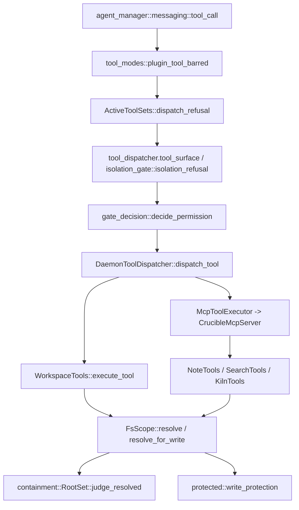

# Tools and Admission

## Purpose and ownership

This subsystem is the daemon's tool layer: every built-in tool an agent or a
plugin can call, the paths through which a tool reaches the filesystem, and
the classification that decides whether a sandboxed session may reach a given
tool at all. `crucible-daemon` owns all of it, per the repository agent
guide's (`AGENTS.md`) ownership table ("tools, storage" belong to
`crucible-daemon`) and its "Scope/admission" boundary, which names
`tools/{containment,surface}.rs` and `execution_roots.rs` directly.

The subsystem owns:
- Routing a tool call by name to the right executor (`crates/crucible-daemon/src/tool_dispatch.rs`).
- Deciding whether a resolved path is reachable at all, for read or for write
  (`crates/crucible-daemon/src/tools/containment.rs`,
  `crates/crucible-daemon/src/tools/fs_scope.rs`).
- Classifying every built-in tool's reach — `Host`, `Daemon`, or `Unknown` —
  as one exhaustive table (`crates/crucible-daemon/src/tools/surface.rs`).
- The MCP-facing tool groups a session or an external client calls: notes,
  search, kiln info, workspace/host tools, delegation and job tools.
- The upstream (user-configured) MCP gateway and the daemon's own plugin tool
  registry, both folded into the same dispatch and classification rules.
- The registry of filesystem trees the daemon itself loads or executes code
  from, so that set can never be a strict subset of what actually runs
  (`crates/crucible-daemon/src/execution_roots.rs`).

The subsystem must not own:
- A second write path or a second review disposition for notes — note writes
  stay daemon-owned end to end. `NoteTools` reads a turn's write mode
  (`Apply`/`Propose`, set by the session's mode, owned by [[Agent Manager]])
  and either writes through the daemon's checked write or records a
  `Proposal`; the proposal itself, and its accept/reject disposition, belong
  to [[Review]]'s `ProposalStore`, not to this layer.
- Session or turn lifecycle state — `SessionSlot` and `agent_manager` hold
  that; this layer answers "may this call happen", not "what happens next".
- Permission policy authorship — `crucible_core::config::components::permissions`
  owns the rules; `agent_manager::messaging::gate_decision::decide_permission`
  evaluates them for every call, prompted or not, whatever the call's source.

## Module map

### Dispatch, trust and execution-root tracking (`crates/crucible-daemon/src`)

| Path | Lines | Role |
| --- | --- | --- |
| `crates/crucible-daemon/src/tool_dispatch.rs` | 793 | Routes a tool name to a `ToolExecutor`; owns discovery-tool bridge, `ToolSurface` corroboration and the per-session `for_session` builder |
| `crates/crucible-daemon/src/tool_dispatch/tests.rs` | 620 | Unit tests for dispatch routing, surface classification and hanging-provider hydration |
| `crates/crucible-daemon/src/tools_bridge.rs` | 716 | `cru.tools.call`/`set_active_tools`/`get_active_tools`/`list_tools` for Lua plugins; its unattended refusal now forwards to the one tool-policy chain |
| `crates/crucible-daemon/src/plugin_tools.rs` | 845 | Registry making a plugin's declared `tools`/namespaced `commands` reachable to dispatch, `plugin.commands`/`plugin.run_command`, and each active plugin's own skill/card/theme directory |
| `crates/crucible-daemon/src/trust_resolution.rs` | 412 | Resolves a kiln's `DataClassification` and a session's provider `TrustLevel`, read by the one trust gate every kiln-trust admission path calls |
| `crates/crucible-daemon/src/vm_profiles.rs` | 103 | Enumerates the three Lua VM shapes (Daemon, Statusline, Theme) and drives `.d.luau` stub generation |
| `crates/crucible-daemon/src/execution_roots.rs` | 520 | Growing registry of every tree the daemon loads or executes Lua/plugin code from |

### Tool groups and MCP surfaces (`crates/crucible-daemon/src/tools`)

| Path | Lines | Role |
| --- | --- | --- |
| `crates/crucible-daemon/src/tools/mod.rs` | 85 | Module root: submodule declarations and re-exports; two `ToolDefinition` builder helpers |
| `crates/crucible-daemon/src/tools/mcp_server.rs` | 782 | `CrucibleMcpServer` — the unified rmcp router for note, search, kiln, delegation and job tools, gated by an optional `McpCallGate` before dispatch |
| `crates/crucible-daemon/src/tools/mcp_server/tests.rs` | 785 | Tests for `CrucibleMcpServer` construction, skill discovery across every attached kiln, delegation and job ownership |
| `crates/crucible-daemon/src/tools/extended_mcp_server.rs` | 629 | `ExtendedMcpServer`/`ExtendedMcpService` — adds plugin tools and gateway tools onto the kiln server for `cru mcp` |
| `crates/crucible-daemon/src/tools/workspace.rs` | 699 | `WorkspaceTools` — `read_file`, `edit_file`, `write_file`, `bash`, `glob`, `grep`, host-facing |
| `crates/crucible-daemon/src/tools/workspace_defs.rs` | 210 | Pure JSON-schema `Tool` definitions for the six workspace tools |
| `crates/crucible-daemon/src/tools/workspace/tests/mod.rs` | 556 | Behavior tests for the six workspace tools, including a real subprocess timeout test |
| `crates/crucible-daemon/src/tools/workspace/tests/containment.rs` | 754 | Dedicated containment-regression ledger for `WorkspaceTools`/`FsScope` |
| `crates/crucible-daemon/src/tools/kiln.rs` | 296 | `KilnTools` — `get_kiln_info` |
| `crates/crucible-daemon/src/tools/search.rs` | 415 | `SearchTools` — `semantic_search`, `grep_notes`, `property_search`; `semantic_search` names a failed kiln in its answer and one warning notification |
| `crates/crucible-daemon/src/tools/search/tests.rs` | 920 | Anti-leak and llama.cpp schema-compatibility tests for search and other tool params |
| `crates/crucible-daemon/src/tools/notes/mod.rs` | 604 | `NoteTools` — `create_note`, `read_note`, `read_metadata`, `update_note`, `delete_note`, `list_notes`, and the propose-vs-apply write disposition of a session's turn |
| `crates/crucible-daemon/src/tools/notes/helpers.rs` | 123 | `resolve_note_write`, `ensure_md_suffix`, `reject_non_note`; frontmatter (de)serialization now wraps the canonical `crucible_core::note_frontmatter` parser |
| `crates/crucible-daemon/src/tools/notes/list.rs` | 95 | `list_notes_via_filesystem` implementation |
| `crates/crucible-daemon/src/tools/notes/params.rs` | 71 | Deserialize/JsonSchema parameter structs for the note tools |
| `crates/crucible-daemon/src/tools/notes/propose.rs` | 148 | `TurnWriteMode`/`NoteWrites`/`Disposition`/`author_of` — the one propose-or-apply write decision that note tools and Bases writes both call |
| `crates/crucible-daemon/src/tools/notes/tests/mod.rs` | 31 | Shared fixtures for the note-tool test submodules |
| `crates/crucible-daemon/src/tools/notes/tests/crud.rs` | 945 | CRUD, line-range read, frontmatter, write-lock, and checked-write conflict/merge tests |
| `crates/crucible-daemon/src/tools/notes/tests/indexed.rs` | 169 | Index-vs-disk dual-answer tests against a real SQLite repository |
| `crates/crucible-daemon/src/tools/notes/tests/list.rs` | 220 | `list_notes` behavior tests |
| `crates/crucible-daemon/src/tools/notes/tests/path_safety.rs` | 399 | Path-traversal, symlink-escape, protected-directory and non-note-extension refusal tests |
| `crates/crucible-daemon/src/tools/notes/tests/propose.rs` | 303 | End-to-end tests for the propose write mode against a real `ProposalStore` and `TempDir` kiln |

### Containment and path safety (`crates/crucible-daemon/src/tools`)

| Path | Lines | Role |
| --- | --- | --- |
| `crates/crucible-daemon/src/tools/containment.rs` | 830 | `RootSet`/`Containment` — the pure allowlist/denylist judgment engine, plus the read-only `allowed_roots` accessor |
| `crates/crucible-daemon/src/tools/fs_scope.rs` | 907 | `FsScope` — the one door every tool family passes through to get a `ContainedPath`/`WritablePath`; `canonical_anchor` names its root for proposal recording |
| `crates/crucible-daemon/src/tools/path_resolution.rs` | 288 | `ResolvedPath`/`absolutize` — lexical and canonical path normalization primitives |
| `crates/crucible-daemon/src/tools/protected.rs` | 516 | Write-deny list for `.crucible`, `.git`, other harnesses' dotdirs and shell startup files |
| `crates/crucible-daemon/src/tools/surface.rs` | 393 | `BuiltinTool`/`classify` — the exhaustive per-tool `Host`/`Daemon`/`Unknown` classification |
| `crates/crucible-daemon/src/tools/surface/tests.rs` | 311 | Exhaustiveness and no-executor-overrides-the-table tests for the classification |
| `crates/crucible-daemon/src/tools/active_tools.rs` | 278 | `ActiveToolSets` — per-session tool narrowing written by `cru.tools.set_active` |
| `crates/crucible-daemon/src/tools/tool_modes.rs` | 243 | Fallback plan-mode tool list and the plugin-tool-in-read-only-mode admission rule |

### MCP gateway and upstream clients (`crates/crucible-daemon/src/tools`)

| Path | Lines | Role |
| --- | --- | --- |
| `crates/crucible-daemon/src/tools/mcp_client.rs` | 271 | `RmcpExecutor` — rmcp-backed client wrapper for one upstream MCP server (stdio) |
| `crates/crucible-daemon/src/tools/mcp_gateway.rs` | 1226 | `McpGatewayManager`/`UpstreamClient` — connects, prefixes, reconnects and shadow-guards upstream servers |
| `crates/crucible-daemon/src/tools/gateway_executor.rs` | 90 | `GatewayToolExecutor` — `ToolExecutor` adapter dispatching an agent's gateway tool calls |

### Search, discovery and presentation helpers (`crates/crucible-daemon/src/tools`)

| Path | Lines | Role |
| --- | --- | --- |
| `crates/crucible-daemon/src/tools/grep_engine.rs` | 262 | Shared ripgrep-based content-search engine (`grep_search`) |
| `crates/crucible-daemon/src/tools/autolink.rs` | 292 | Pure-text scanner suggesting double-bracket wikilink conversions for plain-text note mentions |
| `crates/crucible-daemon/src/tools/diff_synth.rs` | 363 | `synthesize_diffs` — renders `FileDiff` previews from tool name and raw args, no filesystem access |
| `crates/crucible-daemon/src/tools/tool_discovery.rs` | 380 | `discover_tools`/`get_tool_schema` — progressive tool disclosure |
| `crates/crucible-daemon/src/tools/toon_response.rs` | 59 | `toon_success_smart` — TOON-formatted tool response wrapper |
| `crates/crucible-daemon/src/tools/utils.rs` | 98 | `parse_yaml_frontmatter` — shared frontmatter parsing, now a thin wrapper over `crucible_core::note_frontmatter::split_yaml_frontmatter` |
| `crates/crucible-daemon/src/tools/helpers.rs` | 81 | `json_success`, `text_success`, `McpResultExt`, `make_server_info` — MCP response glue |
| `crates/crucible-daemon/src/vm_profiles/tests.rs` | 61 | Tests proving each Lua VM profile exposes exactly its own `cru.*` surface |

## Key types and traits

**`crucible_core::traits::tools::ToolExecutor`** (`crates/crucible-core/src/traits/tools.rs`) is the trait every provider implements: `execute_tool`, `list_tools`, and the required `surface(&self, tool: &str) -> ToolSurface`. The trait doc states the rule this whole subsystem enforces: an executor answers per tool, not once for its whole catalog, because a flat answer let three note tools reach the host filesystem while the rest of the same executor's tools were daemon-only.

**`ToolSurface`** (same file) is a three-value enum — `Host`, `Daemon`, `Unknown` — with no `Default` implementation, so a caller cannot `.unwrap_or_default()` its way into treating an unclassified tool as safe.

**`crate::tools::surface::BuiltinTool`** (`crates/crucible-daemon/src/tools/surface.rs`) is the exhaustive enum of every built-in tool name; `classify(name: &str) -> ToolSurface` and `BuiltinTool::surface` are total functions over it, enforced by `#![deny(clippy::wildcard_enum_match_arm)]` and `#![deny(clippy::match_wildcard_for_single_variants)]` so a new tool fails to compile until classified. `advertised_builtin_names()` and `reserved_tool_names()` are read by `crate::plugin_tools` and `crate::tools::mcp_gateway` to refuse a name collision.

**`crate::tool_dispatch::DaemonToolDispatcher`** (`crates/crucible-daemon/src/tool_dispatch.rs`) holds `providers: Vec<Arc<dyn ToolExecutor>>`, a `session: Option<String>`, plus hydration caches (`tool_names`, `tool_refs`, `tool_surfaces`, each `RwLock` with an `AtomicBool` hydrated flag). It is created once per session by `crate::agent_manager::mod.rs` (`Arc::new(DaemonToolDispatcher::new(providers).for_session(session_id)) as Arc<dyn ToolDispatcher>`) from an ordered provider list: `WorkspaceTools`, `McpToolExecutor` (wrapping `CrucibleMcpServer`), an optional `GatewayToolExecutor`, and — deliberately last — a `PluginToolExecutor`, so a built-in always wins the dispatch walk. `for_session` consumes `self` and sets the session id that `dispatch_tool` copies into each `ExecutionContext.session_id`, so a plugin tool's Lua call knows which session it ran under. `crate::agent_manager::messaging::tool_call` holds the resulting `Arc<dyn ToolDispatcher>` per turn and is the only consumer of `dispatch_tool`/`tool_surface` on the agent path.

**`crate::tools::containment::RootSet`/`Containment`** (`crates/crucible-daemon/src/tools/containment.rs`) is the pure judgment engine: `RootSet::scoped`, `protect`, `carve_out` build an immutable set of allowed/denied/carved/protected `ResolvedPath`s; `judge_resolved` answers `Permitted`, `Outside`, `SymlinkEscape`, or `WriteProtected`. `allowed_roots` is a read-only accessor over the allowed roots in lexical form, never a judgment: its own doc comment says the caller "must still judge the result with `judge_resolved`, because a root does not know about the denials and the links below it." Every non-empty-construction method is `pub(crate)`, so a foreign crate may carry a `RootSet` but never build a populated one.

**`crate::tools::fs_scope::FsScope`** (`crates/crucible-daemon/src/tools/fs_scope.rs`) is the single door: `ContainedPath`/`WritablePath` are newtypes with no public constructor outside this module and no `display()` — a signature that takes `&ContainedPath` carries a compiler-checked proof that containment ran. `FsScope::workspace`/`kiln` build the two anchor shapes; `resolve`/`resolve_for_write` are the only ways to obtain the newtypes. `canonical_anchor` names the scope's root in its canonical form, so two spellings of one kiln resolve to one root; a propose-mode write (see `NoteWrites` below) keys its proposal on this form, not the raw configured path. `WorkspaceTools`, `SearchTools`, `NoteTools`, and `KilnTools` each hold one `FsScope`.

**`crate::tools::mcp_server::CrucibleMcpServer`** holds a `kilns: Vec<PathBuf>` (every attached kiln, in attach order), one `NoteTools`, one `SearchTools`, one `KilnTools` built from the same `RootSet`, a `source_roots: crate::runtime_path::SourceRoots`, an optional `call_gate: Option<McpCallGate>`, and an optional `DelegationContext` for `delegate_session`/`list_jobs`/`get_job_result`/`cancel_job`. `with_kilns`/`with_source_roots`/`with_call_gate`/`with_notifications`/`with_note_writes` are its builders: `with_kilns` makes card and skill discovery read every attached kiln, not only the anchor; `with_note_writes` binds the server's `NoteTools` to a session's `NoteWrites` (propose-vs-apply, below); `with_call_gate` wires the ACP call gate described under Flows. `DelegationContext.source_roots` is a `crate::runtime_path::SourceRoots` value, the same type `CrucibleMcpServer.source_roots` holds. **`crate::tools::extended_mcp_server::ExtendedMcpServer`** wraps a `CrucibleMcpServer` plus an optional `Arc<PluginRegistry>` and an optional `Arc<RwLock<McpGatewayManager>>`, serving `cru mcp`'s unified `tools/list`/`tools/call`.

**`crate::plugin_tools::PluginRegistry`** (`crates/crucible-daemon/src/plugin_tools.rs`) holds `tools`/`commands` maps (`RwLock<HashMap<String, PluginCallable>>`) and a `dirs: crate::runtime_path::ActivePluginDirs` naming each active plugin's own directory as a skill/card/theme source. `register_plugin` replaces a plugin's entire prior *tool* contribution before adding new ones, and refuses outright (never shadows) a tool name in `crate::tools::surface::reserved_tool_names()`. Commands are namespaced instead: each is stored under `"{plugin}:{command}"`, so two plugins' same-named commands both register; `command_func` resolves a bare name through `crucible_core::sources::{Sources, Lookup}` — a unique bare name still works, and a name two plugins share is `Lookup::Ambiguous`, an `anyhow::Result` error naming both full names, not a silent pick.

**`crate::tools::mcp_gateway::McpGatewayManager`/`UpstreamClient`** hold the set of user-configured upstream MCP servers: `upstreams: HashMap<String, UpstreamClient>`, `tool_index: HashMap<String, String>` mapping a prefixed tool name back to its owning upstream. `UpstreamClient::state` is a `Mutex<ConnectionState>` (`Connected`/`Disconnected`/`Error`) updated under a shared read lock.

**`crate::tools::active_tools::ActiveToolSets`** wraps `Arc<DashMap<String, Vec<String>>>` keyed by session id, written by `cru.tools.set_active`/`get_active`/`clear` and read by both `crate::provider::genai_handle` (advertised set) and the dispatch-time refusal in `agent_manager/messaging/tool_call.rs`.

**`crate::trust_resolution`** functions (`resolve_kiln_classification`, `resolve_session_classification`, `most_restrictive_classification`, `resolve_provider_trust`) are pure and synchronous. `resolve_kiln_classification`/`resolve_session_classification` re-read the workspace config and the filesystem on every call, trading I/O for freshness, and return `Option<DataClassification>` with no silent default to `Public`. `resolve_provider_trust` takes an already-loaded `LlmConfig` and does no I/O of its own; it returns a bare `TrustLevel`, falling back to `Cloud` — the most restrictive level — when no provider key resolves. These functions are read by the one trust gate, `AgentManager::refuse_untrusted`, which every kiln-trust admission path — session create, `configure_agent`, `switch_model`, fork, revive, delegation, attach — now calls, in place of the separate resolvers each path used before.

**`agent_manager::messaging::gate_decision::decide_permission`/`unattended_refusal`** (`crates/crucible-daemon/src/agent_manager/messaging/gate_decision.rs`) is the one tool-policy chain this subsystem's dispatch and unattended callers both call into; see [[Agent Manager]] for the type it decides on (`crucible_core::types::CanonicalToolCall`) and Flows below for the order it evaluates.

**`crate::tools::notes::propose::{TurnWriteMode, NoteWrites, Disposition, author_of}`** (`crates/crucible-daemon/src/tools/notes/propose.rs`) decide where one session's note writes land. `TurnWriteMode` is an `Arc<RwLock<WriteMode>>` cell set once per turn; `NoteWrites::disposition` reads it to answer `Disposition::Propose(&NoteWrites)` or `Disposition::Apply`. `NoteWrites::propose`/`propose_all` record a `Proposal` in `crate::proposals::ProposalStore`, keyed by `author_of(session)` — a `Plugin{name}`-authored session so a later pass supersedes an earlier one's proposal, otherwise `Session{id}`. `NoteTools::with_writes` binds a `NoteWrites` into a session's note tools; `None` (the default) means every write applies straight to disk.

## Flows

### An agent's tool call (agent-turn path)

1. `crate::agent_manager::messaging::tool_call` receives a model-issued tool
   call inside a turn.
2. `crate::tools::tool_modes::plugin_tool_barred` refuses a plugin tool in a
   read-only mode (for example `plan`) unless the operator's own mode
   registry names it exactly.
3. `ActiveToolSets::dispatch_refusal` refuses a call outside a plugin-narrowed
   set, exempting the discovery bridge and `invoke_tool`.
4. If the session is isolated, `stream_ctx.tool_dispatcher.tool_surface(name)`
   asks `DaemonToolDispatcher`, which asks the dispatching provider and then
   corroborates the answer against `crate::tools::surface::classify` via
   `corroborated_surface`, downgrading any disagreement to `Unknown`.
   `agent_manager::messaging::isolation_gate::isolation_refusal` then refuses
   the call unless a handler already took it or the surface is exempt.
5. The one tool policy,
   `agent_manager::messaging::gate_decision::decide_permission`, decides the
   call from a `CanonicalToolCall` (`CanonicalToolCall` in
   `crates/crucible-core/src/types/tool_call.rs`) built from the tool's name
   and arguments, in order: a card `deny` refuses; the `PermissionEngine`
   runs once and its own `deny` refuses; a card `allow` runs the call; the
   `--permissions` override decides (its `allow` only for a plugin turn whose
   plugin value is `inherit`); a read-only tool that nothing asks about runs
   (`crate::agent_manager::is_safe`, never an executor's own `readOnlyHint`);
   an operator `allow` runs the call; a saved pattern or a session grant runs
   the call; a Lua permission hook or, absent one, the mode's own stance
   decides; and only then does the caller prompt — or refuse outright, when
   nothing can answer. `Deny` is absolute at every layer that reaches it.
6. `DaemonToolDispatcher::dispatch_tool` special-cases the two discovery
   tools, then tries each provider in order, treating `ToolError::NotFound`
   as "try the next provider."
7. The chosen `ToolExecutor::execute_tool` runs. For a kiln tool this is
   `McpToolExecutor` delegating into `CrucibleMcpServer`'s `NoteTools`/
   `SearchTools`/`KilnTools`, each resolving every path through `FsScope`. For
   a host tool this is `WorkspaceTools::execute_tool`.

### An ACP agent's Crucible MCP call

An ACP agent executes its own tools directly and asks the client about some
of them, but it reaches Crucible's own tools (notes, search, kiln,
delegation) only through the in-process MCP server started by
`InProcessMcpHost::start` in `crates/crucible-daemon/src/mcp_host.rs` (see
[[ACP and MCP]]). Before this range, that server ran every call it received
with no gate of its own; only a call the agent itself chose to ask about ever
reached the daemon's permission logic.

1. `CrucibleMcpServer::call_tool` in `crates/crucible-daemon/src/tools/mcp_server.rs`
   (the `ServerHandler` override) runs first, before the `rmcp` tool router.
2. If the server was built `with_call_gate(Some(gate))`, it calls `gate(name,
   args)`. The gate an ACP session gives is
   `agent_manager::messaging::gate_decision::decide_permission`, reached
   through `AcpPermissions::mcp_gate` — the same decision chain the agent-turn
   path above runs, on the same `CanonicalToolCall`.
3. An `Err(reason)` becomes a normal `CallToolResult::error` (`isError: true`
   with the reason as its text), not an RPC-level failure, so the calling
   agent's own model reads why, exactly as it would read a Crucible tool's
   own refusal.
4. Otherwise the call proceeds into the router as before. Because the MCP
   server decided the call, `AcpPermissions::mcp_server_decides` marks the
   session so the agent's own `session/request_permission` answer for the
   same call is folded to `allow_once` — the user still sees exactly one
   prompt, not two.

`cru mcp`'s stdio-served `ExtendedMcpServer` path has no `call_gate`; it
serves plugin and gateway tools to an external client the daemon does not
run tool-policy decisions for on its own account.

### A plugin's unattended tool call (`cru.tools.call`)

1. Lua plugin code calls `cru.tools.call`, reaching
   `crate::tools_bridge::DaemonToolsBridge::call_tool` with no agent and no
   session of its own.
2. `isolation_refusal` (the bridge's own copy, named `isolated_session_refusal`
   in `tools_bridge.rs`) checks the stated session's isolation claim, or
   fails closed when no session is named but any session anywhere is
   sandboxed.
3. `tools_bridge::unattended_refusal` forwards the call to
   `gate_decision::unattended_refusal` — the same rule evaluation the
   daemon's own agent path and the ACP gate use, minus the card, saved
   patterns, hooks, mode and prompt an agent's own turn has — and adds the
   caller's name to the refusal text. An operator `deny` is absolute, an
   `allow` runs the call, a read-only tool runs, and a tool that can mutate
   with no explicit `allow` is refused rather than asked, since nobody is
   there to answer.
4. On success, `WorkspaceTools::execute_tool` runs with a default
   `ExecutionContext` — the same execution path an agent's `bash`/`read_file`
   call would take, through the same `FsScope`.

`set_active_tools`/`get_active_tools` on the same bridge require a bound
`ActiveToolBinding` (an `ActiveToolSets` plus `Arc<SessionManager>`); absent
one they return `NO_ACTIVE_TOOL_SETS` rather than silently succeeding.
`active_set_refusal` looks the session up in the live `SessionManager`, not
disk, and refuses both an unknown session id and an ACP-delegated session.

### Propose write mode for note tools

A session's mode declares a `writes: WriteMode` stance (`Apply` or
`Propose`, `crucible_core::types::mode`); the turn reads it once, at start,
into the session's `TurnWriteMode` cell, so a mode change mid-turn does not
change the turn already running.

`agent_manager::messaging::send` sets this cell at the start of every turn,
in `crates/crucible-daemon/src/agent_manager/messaging/send.rs`. It reads
the mode's declared stance through `AgentManager::mode_writes`
(`crates/crucible-daemon/src/agent_manager/mod.rs`), then degrades it
through `WriteMode::effective_for` (`crates/crucible-core/src/types/mode.rs`).
An agent type other than `internal` always reads `Apply`, because the daemon
cannot hold the writes an external ACP agent makes with its own tools.
Between turns, and for a plugin's Bases write, `AgentManager::write_mode_for`
(`crates/crucible-daemon/src/agent_manager/session_permissions.rs`) answers
the same question: it reads the running slot's cell when a turn runs, or
reads `mode_writes` fresh when none runs. `session.list_modes` shows this
same effective value to a client through `ModeDescriptor::degraded_for`
(`crates/crucible-core/src/types/mode.rs`), so a client never shows a
`Propose` mode as active on a session that in fact writes straight to disk;
see [[Agent Manager]] for the RPC handler that calls it.

1. `NoteTools::create_note`/`update_note` ask `propose::Disposition` for the
   turn: `Apply` (the default, when `NoteTools` holds no `NoteWrites`) or
   `Propose(&NoteWrites)`.
2. In `Apply` disposition, both tools now go through the daemon's checked
   write (`crate::file_write::write_locked`, `ExpectedBase`) instead of a
   raw `std::fs::write`: `create_note` writes with `ExpectedBase::Unchecked`;
   `update_note` reads the disk base first and writes with
   `ExpectedBase::Text{hash, text}`, merging or refusing a conflicting
   outside edit rather than silently overwriting it.
3. In `Propose` disposition, neither tool touches disk. `create_note` records
   `ExpectedBase::Absent` (so an accept later must not replace a file another
   writer created after the proposal); `update_note` first asks
   `NoteWrites::proposed_text` for a write this same turn already proposed at
   that path and builds on it (`ExpectedBase::Unchecked`) rather than on disk,
   otherwise it reads disk as `Apply` does. Either way the write becomes an
   `Open` `Proposal` in `crate::proposals::ProposalStore`, keyed by the
   `FsScope::canonical_anchor` of the note's kiln so two spellings of one
   kiln proposal-target the same root.
4. `delete_note` refuses outright in `Propose` disposition: a proposal holds
   new text, not a removal, so a delete cannot wait for review.

`crate::tools::notes::propose::NoteWrites::propose_all` (recording several
writes, a deletion among them, as one proposal) is the same call the Bases
write path uses, so an agent's note edit and a plugin's Bases write share one
review disposition.

### Path resolution inside `FsScope`

`FsScope::resolve`/`resolve_for_write` run, in order: naming pre-checks
(absolute/`..` rejection for a kiln-anchored scope), path join,
`path_resolution::ResolvedPath::resolve` (lexical and canonical forms),
`protected::write_protection` (write access only, checked even for an
ambient scope), a control-directory check for the kiln family, then
`containment::RootSet::judge_resolved` against the anchor's own root set
(kiln family only) and the session's `RootSet`, taking the weaker verdict.
`walk_files`/`read_dir` re-apply `FsScope::admits` per yielded entry so a
walk cannot surface a denied subtree even when its root is permitted.

### Upstream MCP gateway connect and reconnect

`McpGatewayManager::add_upstream` calls `UpstreamClient::connect`
(`crate::tools::mcp_client::create_stdio_executor_with_env`), filters tools
by `allowed_tools`/`blocked_tools` globs, prefixes each name, and validates
the prefix shape. `index_upstream` refuses the whole upstream — disconnecting
it and indexing nothing — if any prefixed tool name collides with
`crate::tools::surface::reserved_tool_names()`. `McpGatewayManager::start_reconnect_loop`
runs a `tokio::spawn`ed loop with per-upstream exponential backoff, re-checking
the shadow guard on every reconnect since a reconnected server can answer
`tools/list` differently than before.

## State, concurrency and lifecycle

- **`DaemonToolDispatcher`** hydrates its provider tool lists three ways: an
  eager non-blocking `now_or_never()` pass at construction, an async path
  (`hydrate_tool_names`) for `dispatch_tool`/`tool_surface`, and a blocking
  path (`hydrate_tool_names_blocking`, an inner per-provider listing bounded
  by `BLOCKING_HYDRATION_TIMEOUT` = 5s, with the caller's own
  `recv_timeout` bounded by twice that) for the sync `has_tool`/`get_tool_ref`.
  The blocking path spawns a dedicated OS thread and a current-thread tokio
  runtime; a ticket/attempt counter (`hydration_attempts`, `parking_lot::Mutex
  hydration_turn`) deduplicates concurrent callers so only one walk runs at a
  time. The walk tracks a `complete` flag, false whenever any provider's own
  listing times out; only a `complete` walk is stored as hydrated, so a
  provider that answered too slowly once is retried on the next call rather
  than being cached as an empty catalog forever.
- **`McpGatewayManager`** lives behind `Arc<RwLock<McpGatewayManager>>`, shared
  identically by `GatewayToolExecutor` (agent dispatch) and
  `ExtendedMcpServer` (external `cru mcp` surface). `start_reconnect_loop`
  is cancelled through a `CancellationToken`.
- **`ActiveToolSets`** is an in-memory-only `DashMap`; sets are lost on daemon
  restart, by design, per its module doc.
- **`execution_roots`** is a `Mutex<Vec<PathBuf>>` behind a `OnceLock`,
  deduplicated on `record()`. `baseline()` answers before any Lua VM runs by
  reading `settings.json` directly; `record_runtimepath` is called after
  `init.lua` evaluates. `crate::daemon_plugins::daemon_plugin_paths` and
  `crate::runtime_defaults::defaults_candidates` are expected to `record()`
  their own results.
- **`plugin_tools::PluginRegistry`**'s `execute_tool`/`run_command_in` call
  `crucible_lua::enter_plugin`/`enter_session` before invoking the Lua
  function and restore the prior source on every exit path, including error,
  so `cru.storage`/`cru.plugin.publish` attribute to the right plugin. Its
  `dirs: ActivePluginDirs` is updated by `set_plugin_dir` on activation and by
  `remove_plugin` on the inert path, so a plugin's skill/card/theme source
  never outlives the plugin.
- **`TurnWriteMode`** is an `Arc<RwLock<WriteMode>>` cell read fresh on every
  `create_note`/`update_note` call, not cached at construction, so a mode
  switch to `Apply` mid-session (but not mid-turn) writes straight to disk on
  the very next call.
- **Cleanup**: `active_set_refusal`/`isolated_session_refusal` fail closed on
  an unknown session rather than leaking a map entry `cleanup_session` never
  reaches. `McpGatewayManager` has no daemon-triggered cleanup beyond
  `disconnect`/reconnect; the tool dispatcher and gateway are dropped with
  their owning session slot.

## Boundaries and invariants

- **Default-deny, not default-allow-minus-a-denylist.** `containment.rs`'s
  module doc states the design inversion directly: the predecessor was
  default-allow, and every escape found against it either out-ranked a
  denial or side-stepped it. `RootSet::Ambient` is barred from session
  dispatchers by convention, not by the type system alone.
- **Never judge a path on one form.** `path_resolution::ResolvedPath` carries
  both a lexical and a canonical form, and callers must check both;
  `containment::judge_resolved` requires both forms to pass
  (`form_permits`) before returning `Permitted`.
- **Write-deny never read-deny, and non-existence is not an exemption.**
  `protected.rs` checks a path's name, not whether anything exists there yet
  — closing the class of bug where a sandbox writes a config file that a
  trusted host process later loads.
- **Classification is per tool, never per executor.** `ToolSurface` comes
  from `crate::tools::surface::classify`'s exhaustive `match`;
  `corroborated_surface` in `tool_dispatch.rs` downgrades any executor claim
  that disagrees with the table to `Unknown`. An executor serving foreign
  code (`GatewayToolExecutor`, `PluginToolExecutor`) always answers `Unknown`,
  regardless of the name asked.
- **A note write is checked on both the name given and the path resolved.**
  `notes/helpers.rs::resolve_note_write` runs `FsScope::resolve_for_write`
  then judges both forms via `is_note_file`/`KilnFileKind`, closing the
  symlink-laundering shape named in the file's own CVE-2026-25725 reference.
  An `Apply`-disposition write also carries a base hash of the disk content
  read moments earlier, through the daemon's checked write
  (`crate::file_write::write_locked`), closing a lost-update race that a raw
  `std::fs::write` could not detect.
- **A tree cannot be loaded without being protected.** `execution_roots.rs`'s
  own words: naming a tree for the loader is what protects it; `all()` is
  guaranteed to be a superset of what `daemon_plugin_paths`/
  `defaults_candidates` actually feed a Lua VM.
- **Built-ins always win; a colliding plugin or upstream name is rejected
  outright.** `plugin_tools::PluginRegistry::register_plugin` refuses a
  plugin tool or command name that collides with a reserved built-in name
  outright, and `mcp_gateway::index_upstream` refuses the same collision for
  an upstream server. Two plugins' same-named *commands* both register,
  namespaced as `plugin:command`; only a bare, still-ambiguous lookup across
  sources is refused, at lookup time rather than at registration.
- **An approver sees the arguments, not the file.** `diff_synth.rs` never
  opens a file; it renders a diff preview straight from the tool's raw JSON
  arguments.
- **A read-only annotation informs policy but never skips the permission
  gate.** `mcp_client.rs`/`mcp_gateway.rs`'s `read_only_tool_names` feeds
  `crate::agent_manager::is_safe`, which still requires the name to be one
  Crucible itself trusts as safe — an upstream's own `readOnlyHint` cannot
  grant that.
- **Every tool call, whatever its source, is decided once, on one canonical
  shape.** The daemon's own agent path, an ACP agent's call to a Crucible
  tool over the in-process MCP server, an unattended caller (`cru.tools.call`,
  workflow validation), and `AgentManager::bases_write_permission` for a
  plugin's Bases write all build a `CanonicalToolCall` and pass it to
  `gate_decision::decide_permission`/`decide_nested`/`unattended_refusal`, so
  a card `bash` rule, a `[permissions]` `read`/`edit`/`write`/`delete` rule, a
  saved pattern, and a Lua permission hook all apply identically whichever
  path made the call. Before this range the in-process MCP server ran an ACP
  agent's Crucible-tool calls with no gate at all; a card `deny` or a
  `[permissions]` deny rule on a tool like `read_note` did not stop the call.

These boundaries are the concrete instances of the repository agent guide's
"Scope/admission" rule that creation, resume, delegation and fork honor
current kiln trust and isolation, and that an absent isolation claim is not
proof a session never needed one.

## Extension seams

- **A new built-in tool** is declared as a `BuiltinTool` variant in
  `crates/crucible-daemon/src/tools/surface.rs`; the `#![deny]` lints force a
  classification before the crate compiles. It is then implemented on the
  owning tool group (`NoteTools`, `SearchTools`, `KilnTools`, `WorkspaceTools`,
  or `CrucibleMcpServer` directly for job/delegation tools) and wired into
  `CrucibleMcpServer::list_tools`/`all_tool_names` or
  `WorkspaceTools::tool_definitions`/`execute_tool`.
- **A new upstream MCP server** is added through
  `crate::tools::mcp_gateway::McpGatewayManager::add_upstream`/`from_config`;
  no dispatch-side change is needed, since `GatewayToolExecutor` and
  `ExtendedMcpServer` both read the shared gateway.
- **A new plugin tool or command** registers through
  `crate::plugin_tools::PluginRegistry::register_plugin`, reached from Lua's
  returned spec table. A tool is barred automatically from any name in
  `crate::tools::surface::reserved_tool_names()`, since a tool shares the
  model's own name space with the built-ins; a command is namespaced as
  `plugin:command` instead, so two plugins may declare the same command name.
- **A new containment rule** belongs in `containment.rs`'s `RootSet`
  construction (`scoped`/`protect`/`carve_out`), never as an ad hoc check
  inside a tool method — `fs_scope.rs`'s module doc frames deviation from
  this as reopening, by ergonomics, what the type system closed.
- **A new protected directory or shell startup file** is one entry in
  `protected::PROTECTED_DIRS`/`SHELL_STARTUP_FILES`.

## Tests

- `crates/crucible-daemon/src/tool_dispatch/tests.rs` proves dispatch routing
  for real MCP-provided tools, the classification-corroboration contract, and
  that a hanging provider's `list_tools` fails `has_tool` closed within
  `BLOCKING_HYDRATION_TIMEOUT` rather than hanging the turn — including a
  provider whose listing itself times out, which must not be recorded as a
  complete (and so cached) hydration — with concurrent callers coalescing
  into one hydration attempt.
- `crates/crucible-daemon/src/tools/surface/tests.rs` proves `BuiltinTool::ALL`
  matches every enum variant (`strum::EnumIter`), that every advertised
  built-in tool has exactly one classification, that no executor's own
  `surface()` claim can override the table, and pins the literal 17-tool
  `Daemon`-classified set so widening it costs two edits and narrowing costs
  one.
- `crates/crucible-daemon/src/tools/workspace/tests/containment.rs` is the
  dedicated regression ledger for `WorkspaceTools`/`FsScope`: empty-root
  denial, symlink escape (naming the CVE class in comments), dangling
  symlinks, denied-subtree filtering on `glob`/`grep` output, and
  write-protection on the actual tool call rather than only the underlying
  check.
- `crates/crucible-daemon/src/tools/workspace/tests/mod.rs` proves env-var
  expansion is scoped to the tool's own map (never the process environment),
  a real `bash` timeout via a live subprocess, and ripgrep argument-injection
  containment (`--pre=` style flag injection via a leading-dash pattern).
- `crates/crucible-daemon/src/tools/notes/tests/path_safety.rs` proves
  traversal, symlink-escape, protected-directory, and non-note-extension
  refusal across all five note write/read tools, explicitly cross-referenced
  to CVE-2026-25725.
- `crates/crucible-daemon/src/tools/notes/tests/crud.rs`,
  `crates/crucible-daemon/src/tools/notes/tests/indexed.rs`, and
  `crates/crucible-daemon/src/tools/notes/tests/list.rs` prove CRUD
  round-trips, the RPC write-lock contention path
  (`crate::file_write::lock`), the index-vs-disk dual-answer behavior against
  a real SQLite-backed repository, and that `create_note`/`update_note` now
  go through the checked write — merging with, or refusing, a conflicting
  concurrent outside edit rather than silently overwriting it.
- `crates/crucible-daemon/src/tools/notes/tests/propose.rs` proves the
  propose write mode end to end against a real `ProposalStore` and `TempDir`
  kiln: `create_note`/`update_note` in a `Propose` turn leave disk unchanged
  and record a `Proposal` keyed by the kiln's canonical root, `delete_note` is
  refused, and a mode switch to `Apply` mid-session writes straight to disk
  on the next call.
- `crates/crucible-daemon/src/tools/search/tests.rs` proves the search tools
  never leak a kiln's absolute path in a result or an error, that 13 tool
  parameter schemas across three files stay llama.cpp/GBNF-compatible, and
  that a kiln that fails to search is named in both the tool result
  (`failed_kilns`) and one warning notification, not silently dropped.
- `crates/crucible-daemon/src/tools/mcp_server/tests.rs` proves kiln-less
  tool filtering, delegation ownership (a job owned by another session
  cannot be cancelled by name alone), multibyte-safe result truncation, and
  that every attached kiln, not only the anchor, is a skill/card source.
- `crates/crucible-daemon/src/vm_profiles/tests.rs` proves each Lua VM
  profile's `cru.*` surface matches exactly what that profile's constructor
  builds, and that no two profiles write the same stub file.
- `crates/crucible-daemon/tests/mcp_server_tools_test.rs`'s
  `test_server_info_metadata` fails if `CrucibleMcpServer::get_info`'s
  instructions ever name a workspace tool (`read_file`, `edit_file`,
  `write_file`, `bash`, `glob`, `grep`) the server does not itself serve.

Gaps the tests name themselves: `crates/crucible-daemon/src/tools/notes/mod.rs`
carries three `TODO` comments for missing re-parse triggers after
`create_note`/`update_note`/`delete_note`, meaning a note written through
these tools is not proven to reach the index-reparse pipeline before the next
full parse. `crates/crucible-daemon/src/tools/gateway_executor.rs` has no
`#[cfg(test)]` module of its own; its behavior is exercised only indirectly
through `crates/crucible-daemon/src/tools/mcp_gateway.rs`'s tests.
`crates/crucible-daemon/src/tools/tool_modes.rs`'s own tests name a known,
currently-latent gap: its read-only-mode predicate and
`agent_factory::mode_exposes_tool`'s independently derived one must be kept
in sync by hand, untested by reproduction because `plan` is still the only
read-only mode.

## Findings

- **`ExtendedMcpServer`'s cached tool list may go stale.** Its own doc
  comment in `crates/crucible-daemon/src/tools/extended_mcp_server.rs`
  describes `cached_tools` as "refreshed on demand," but `ExtendedMcpService::new`
  sets it once and nothing in this file invalidates it if a gateway
  reconnects or a plugin registers new tools afterward — a documented
  behavior/comment mismatch, not confirmed as reachable by a test in this
  chunk.
- **Two independent taxonomies over the same tool names.**
  `crates/crucible-daemon/src/tools/tool_discovery.rs`'s `ToolSourceFilter`
  (Builtin/Just/Upstream, a naming-convention heuristic) and
  `crates/crucible-daemon/src/tools/surface.rs`'s `BuiltinTool`/`ToolSurface`
  (a security classification) both bucket tool names but answer different
  questions; nothing conflates them today, but a reader could.
- **Workspace tool schemas are hand-written JSON; note/search tool schemas
  are derived.** `crates/crucible-daemon/src/tools/workspace_defs.rs` builds
  each `Tool` schema as a literal `serde_json::json!` object, while
  `crates/crucible-daemon/src/tools/search.rs` and
  `crates/crucible-daemon/src/tools/notes/params.rs` use
  `#[derive(JsonSchema)]`. An inconsistency in approach within the same
  crate, not a defect.
- **`mcp_server.rs`'s `get_info()` still hand-writes most of its tool names
  into a static description string** (the tool count itself is computed live
  from `tool_count()`). Commit `7b62933a3` removed the one instance that had
  already drifted — a line naming the six workspace tools this server does
  not serve — and `crates/crucible-daemon/tests/mcp_server_tools_test.rs`'s
  `test_server_info_metadata` now fails if any of those six reappears. The
  note, search, kiln, delegation and job tool names in the same string are
  still hand-written and un-guarded, so the general duplication risk this
  finding named still holds for them.
- **`ReconnectSchedule::poll`** in `crates/crucible-daemon/src/tools/mcp_gateway.rs`
  is documented as "time between two checks" but is also used as the
  *initial* backoff wait on first reconnect — an overloaded field, confirmed
  intentional by the file's own `reconnect_loop_retries_with_backoff` test
  rather than a bug.
- No conflict was found between this subsystem's code and the repository
  agent guide's ownership or admission rules: the containment, protected-path
  and surface-classification modules are, by their own extensive doc
  comments, direct implementations of the "Scope/admission" boundary the
  guide names.

## See also

[[Agent Manager]] holds the per-turn dispatcher, the isolation gate
(`agent_manager/messaging/isolation_gate.rs`), and the one tool-policy chain
(`agent_manager::messaging::gate_decision::decide_permission`/
`unattended_refusal`) this subsystem's dispatch and unattended callers call
into, all consuming this subsystem's `ToolDispatcher` and `ToolSurface`.
[[ACP and MCP]] owns the in-process MCP host and the ACP permission handler
that reach this subsystem's `CrucibleMcpServer::call_tool`/`McpCallGate` for
an externally-delegated agent's Crucible-tool calls. [[Luau Host]] and
[[Luau APIs]] own the `cru.tools.*` Lua bindings that `tools_bridge.rs`
implements against, and the `ModeConfig.writes`/`cru.modes.<name>.writes`
knob that drives this subsystem's propose write mode. [[Daemon Server]]
wires `DaemonToolsBridge`, `DaemonToolDispatcher` and `McpGatewayManager`
together at boot. [[Core Domain Types]] defines `ToolExecutor`,
`ToolSurface`, `ToolDefinition`, `ExecutionContext`, and `CanonicalToolCall`,
the traits and types this crate implements or builds. [[Review]] owns
`ProposalStore`/`Proposal` and the accept/resolve path that this subsystem's
propose-mode note writes and Bases writes both record into.
[[Knowledge Storage and Retrieval]] owns the `KnowledgeRepository`/SQLite
layer that `NoteTools`/`SearchTools` read through.
