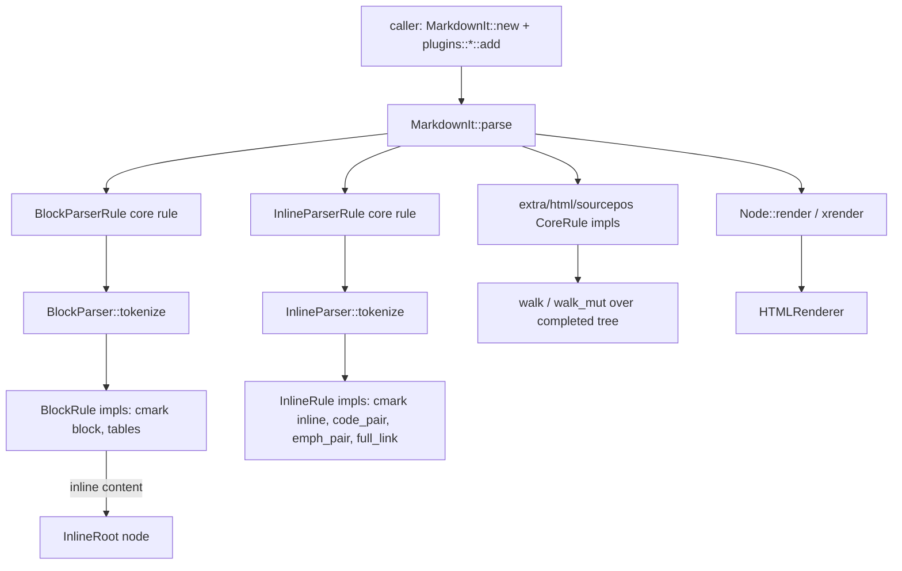

# Vendored Markdown-it

## Purpose and ownership

`vendor/markdown-it` is a local copy of the `markdown-it` crate (upstream
`https://github.com/rlidwka/markdown-it.rs`, version 0.6.1), kept in the
workspace under `[patch.crates-io]` so every crate that depends on
`markdown-it` builds against this copy instead of the crates.io release. The
workspace root `Cargo.toml` lists `vendor/markdown-it` in `workspace.exclude`
and declares the patch:

```toml
[patch.crates-io]
markdown-it = { path = "vendor/markdown-it" }
```

`vendor/README.md` states the reason: "Upstream is semi-abandoned with
unmerged panic fixes." This page owns the parser library itself: its rule
chains (core, block, inline), its AST node type, its HTML renderer, and its
bundled CommonMark and GFM syntax plugins. It does not own how Crucible
calls it. AGENTS.md's boundary — "Keep parser types canonical in
`crucible-core/src/parser/types/`... Re-export types instead of duplicating
them across crates" — describes Crucible's own parser layer, not this
vendored dependency; `markdown_it::Node` is a distinct type from
`crucible_core`'s `ParsedNote`/`Block` types, and no code in this directory
knows about kilns, notes, frontmatter or the daemon. [[Parser]] owns that
conversion, through `AstConverter` in
`crates/crucible-core/src/parser/markdown_it/converter.rs`, which is outside
this page's file list.

Per AGENTS.md's own rule on vendored code, changes here need a
`NOTE(crucible):` marker, regression coverage and a `vendor/README.md`
update; both patches present in this revision follow that pattern (see
Findings).

## Module map

### Crate root and entry points

| Path | Lines | Role |
| --- | --- | --- |
| `vendor/markdown-it/src/lib.rs` | 33 | Crate root: `#![forbid(unsafe_code)]`, Crucible lint-suppression block under a `NOTE(crucible):` comment, re-exports `MarkdownIt`, `Node`, `NodeValue`, `Renderer`, declares `common`, `examples`, `generics`, `parser`, `plugins` |
| `vendor/markdown-it/src/bin.rs` | 107 | `markdown-it` CLI binary: reads stdin or a file, prints an HTML render or an AST tree, with flags for sourcepos/linkify/typographer/no-html |
| `vendor/markdown-it/benchmarks/test-file.rs` | 31 | Criterion benchmark comparing this parser against `markdown-it-v5` and `comrak` on a fixture file |
| `vendor/markdown-it/demo/src/lib.rs` | 106 | WebAssembly demo (wasm-bindgen): live-parses a textarea into HTML preview and AST tree |

### `src/common/` — shared utilities

| Path | Lines | Role |
| --- | --- | --- |
| `vendor/markdown-it/src/common/mod.rs` | 11 | Re-exports `ruler`, `sourcemap`, `utils`, `typekey::TypeKey` |
| `vendor/markdown-it/src/common/ruler.rs` | 393 | `Ruler<M, T>`: dependency-ordered rule chain with before/after/require/alias |
| `vendor/markdown-it/src/common/sourcemap.rs` | 143 | `SourcePos`, `SourceWithLineStarts`: byte offset to (line, column) mapping |
| `vendor/markdown-it/src/common/typekey.rs` | 81 | `TypeKey`: `TypeId` fused with `type_name` for debuggable type-indexed maps |
| `vendor/markdown-it/src/common/utils.rs` | 467 | Entity decoding, HTML escaping, reference-label normalization, indent/whitespace and punctuation helpers |

### `src/examples/` and `examples/` — Ferris demo rules

| Path | Lines | Role |
| --- | --- | --- |
| `vendor/markdown-it/examples/ferris/block_rule.rs` | 72 | `BlockFerris` custom block rule, the real implementation |
| `vendor/markdown-it/examples/ferris/core_rule.rs` | 64 | `FerrisCounter` custom core rule, the real implementation |
| `vendor/markdown-it/examples/ferris/inline_rule.rs` | 61 | `InlineFerris` custom inline rule, the real implementation |
| `vendor/markdown-it/examples/ferris/main.rs` | 31 | Runnable example wiring all three Ferris rules and asserting output |
| `vendor/markdown-it/src/examples/ferris/block_rule.rs` | 7 | Re-export wrapper: `pub use crate::examples::ferris::block_rule::*` |
| `vendor/markdown-it/src/examples/ferris/core_rule.rs` | 7 | Re-export wrapper for the core rule |
| `vendor/markdown-it/src/examples/ferris/inline_rule.rs` | 7 | Re-export wrapper for the inline rule |
| `vendor/markdown-it/src/examples/ferris/mod.rs` | 15 | Re-exports the three Ferris rule modules; carries the rustdoc README include |
| `vendor/markdown-it/src/examples/mod.rs` | 4 | Declares `pub mod ferris` |
| `vendor/markdown-it/src/examples/testreadme.rs` | 2 | Doc-test harness that includes `README.md` and `examples/ferris/README.md` via `include_str!` |

### `src/generics/inline/` — reusable inline patterns

| Path | Lines | Role |
| --- | --- | --- |
| `vendor/markdown-it/src/generics/mod.rs` | 12 | Declares `pub mod inline` |
| `vendor/markdown-it/src/generics/inline/mod.rs` | 4 | Declares `code_pair`, `emph_pair`, `full_link` |
| `vendor/markdown-it/src/generics/inline/code_pair.rs` | 142 | `add_with::<const MARKER: char>`: variable-length marker code spans (backtick-family rules) |
| `vendor/markdown-it/src/generics/inline/emph_pair.rs` | 372 | `add_with::<MARKER, LENGTH, CAN_SPLIT_WORD>`: fixed-length marker emphasis/strong/strikethrough; carries the Crucible patch (see Findings) |
| `vendor/markdown-it/src/generics/inline/full_link.rs` | 440 | `add`/`add_prefix`: full links and images, `[label](url "title")` and reference form |

### `src/parser/` — core, block and inline engine

| Path | Lines | Role |
| --- | --- | --- |
| `vendor/markdown-it/src/parser/mod.rs` | 45 | Rule-chain documentation and module declarations for `block`, `core`, `extset`, `inline`, `linkfmt`, `main`, `node`, `renderer` |
| `vendor/markdown-it/src/parser/main.rs` | 90 | `MarkdownIt` struct and `parse()` entry point |
| `vendor/markdown-it/src/parser/node.rs` | 229 | `Node`, `NodeValue` trait, `NodeEmpty`; downcasting, tree walking, rendering |
| `vendor/markdown-it/src/parser/renderer.rs` | 154 | `Renderer` trait and the default `HTMLRenderer<const XHTML: bool>` |
| `vendor/markdown-it/src/parser/extset.rs` | 232 | `MarkdownItExt`, `NodeExt`, `InlineRootExt`, `RootExt`, `RenderExt` type-indexed extension sets |
| `vendor/markdown-it/src/parser/linkfmt.rs` | 100 | `LinkFormatter` trait and `MDLinkFormatter`: URL safety validation and normalization |
| `vendor/markdown-it/src/parser/core/mod.rs` | 6 | Re-export glue: declares `rule` and `root` submodules and re-exports both |
| `vendor/markdown-it/src/parser/core/root.rs` | 21 | `Root` node type (content + `RootExtSet`), the sole definition |
| `vendor/markdown-it/src/parser/core/rule.rs` | 55 | `CoreRule` trait and its `RuleBuilder` macro expansion |
| `vendor/markdown-it/src/parser/block/mod.rs` | 127 | `BlockParser`: wraps a `Ruler`, drives line-by-line tokenization |
| `vendor/markdown-it/src/parser/block/rule.rs` | 13 | `BlockRule` trait (`check`/`run`) |
| `vendor/markdown-it/src/parser/block/state.rs` | 272 | `BlockState`, `LineOffset`: per-parse mutable line/indent tracking |
| `vendor/markdown-it/src/parser/block/builtin/mod.rs` | 9 | Registers the built-in block core rule |
| `vendor/markdown-it/src/parser/block/builtin/block_parser.rs` | 23 | `BlockParserRule`: the `CoreRule` that invokes the block parser on the document |
| `vendor/markdown-it/src/parser/inline/mod.rs` | 162 | `InlineParser`: char-by-char tokenization, `text_charmap` marker dispatch |
| `vendor/markdown-it/src/parser/inline/rule.rs` | 15 | `InlineRule` trait (`const MARKER`, `check`/`run`) |
| `vendor/markdown-it/src/parser/inline/state.rs` | 244 | `InlineState`, `DelimiterRun`: per-parse position, nesting and delimiter-flanking state |
| `vendor/markdown-it/src/parser/inline/builtin/mod.rs` | 12 | Registers the built-in inline core rule and text scanner |
| `vendor/markdown-it/src/parser/inline/builtin/inline_parser.rs` | 80 | `InlineRoot`, `InlineParserRule`: the `CoreRule` that walks the tree and inline-parses each `InlineRoot` |
| `vendor/markdown-it/src/parser/inline/builtin/skip_text.rs` | 140 | `Text`, `TextSpecial`, `TextScanner`: the no-marker fallback rule that accumulates plain text |

### `src/plugins/cmark/` — CommonMark syntax

| Path | Lines | Role |
| --- | --- | --- |
| `vendor/markdown-it/src/plugins/cmark/mod.rs` | 34 | `add()`: registers every CommonMark inline then block rule in priority order |
| `vendor/markdown-it/src/plugins/cmark/block/mod.rs` | 10 | Re-exports the nine CommonMark block rule modules |
| `vendor/markdown-it/src/plugins/cmark/block/blockquote.rs` | 168 | `Blockquote`: `>`-prefixed block quotes, nested block re-entry |
| `vendor/markdown-it/src/plugins/cmark/block/code.rs` | 69 | `CodeBlock`: 4-space indented code |
| `vendor/markdown-it/src/plugins/cmark/block/fence.rs` | 164 | `CodeFence`, `FenceSettings`: backtick/tilde fenced code with info string |
| `vendor/markdown-it/src/plugins/cmark/block/heading.rs` | 87 | `ATXHeading`: `#` through `######` |
| `vendor/markdown-it/src/plugins/cmark/block/hr.rs` | 55 | `ThematicBreak`: `***`/`---`/`___` |
| `vendor/markdown-it/src/plugins/cmark/block/lheading.rs` | 104 | `SetextHeader`: underline-style headings, ordered before `ParagraphScanner` |
| `vendor/markdown-it/src/plugins/cmark/block/list.rs` | 370 | `OrderedList`, `BulletList`, `ListItem`: list detection, tight/loose determination |
| `vendor/markdown-it/src/plugins/cmark/block/paragraph.rs` | 68 | `Paragraph`: the final fallback block rule (`after_all()`) |
| `vendor/markdown-it/src/plugins/cmark/block/reference.rs` | 374 | `ReferenceMap`, `Definition`: `[label]: url "title"` link reference definitions |
| `vendor/markdown-it/src/plugins/cmark/inline/mod.rs` | 9 | Re-exports the eight CommonMark inline rule modules |
| `vendor/markdown-it/src/plugins/cmark/inline/autolink.rs` | 87 | `Autolink`: `<url>` and `<email>` |
| `vendor/markdown-it/src/plugins/cmark/inline/backticks.rs` | 28 | `CodeInline`: backtick code spans, via `code_pair` |
| `vendor/markdown-it/src/plugins/cmark/inline/emphasis.rs` | 40 | `Em`, `Strong`: `*`/`_` emphasis and strong, via `emph_pair` |
| `vendor/markdown-it/src/plugins/cmark/inline/entity.rs` | 85 | Named and numeric HTML entity references |
| `vendor/markdown-it/src/plugins/cmark/inline/escape.rs` | 57 | Backslash escapes and hard-break-via-backslash |
| `vendor/markdown-it/src/plugins/cmark/inline/image.rs` | 34 | `Image`: ``, via `full_link` |
| `vendor/markdown-it/src/plugins/cmark/inline/link.rs` | 35 | `Link`: `[text](url "title")`, via `full_link` |
| `vendor/markdown-it/src/plugins/cmark/inline/newline.rs` | 81 | `Hardbreak`, `Softbreak`: line-break classification by trailing space count |

### `src/plugins/extra/` — extended syntax

| Path | Lines | Role |
| --- | --- | --- |
| `vendor/markdown-it/src/plugins/extra/mod.rs` | 44 | `add()`: registers strikethrough, beautify_links, linkify (feature-gated), tables, syntect (feature-gated), typographer, smartquotes |
| `vendor/markdown-it/src/plugins/extra/beautify_links.rs` | 39 | `LinkBeautifier`: shortens displayed URL text via `mdurl` |
| `vendor/markdown-it/src/plugins/extra/heading_anchors.rs` | 69 | `AddHeadingAnchors`: adds slug `id` attributes to headings |
| `vendor/markdown-it/src/plugins/extra/linkify.rs` | 135 | `Linkified`, `LinkifyPrescan`: auto-links bare URLs (feature `linkify`) |
| `vendor/markdown-it/src/plugins/extra/smartquotes.rs` | 567 | `SmartQuotesRule`: ASCII quotes to curly quotes/apostrophes, three-pass flatten/compute/mutate |
| `vendor/markdown-it/src/plugins/extra/strikethrough.rs` | 20 | `Strikethrough`: `~~text~~`, via `emph_pair` |
| `vendor/markdown-it/src/plugins/extra/syntect.rs` | 74 | `SyntectSnippet`: syntax-highlighted code via `syntect` (feature `syntect`) |
| `vendor/markdown-it/src/plugins/extra/tables.rs` | 456 | `Table`, `TableHead`, `TableBody`, `TableRow`, `TableCell`: GFM pipe tables |
| `vendor/markdown-it/src/plugins/extra/typographer.rs` | 124 | Dash/ellipsis/©/®/™ text replacement |

### `src/plugins/html/` — raw HTML passthrough

| Path | Lines | Role |
| --- | --- | --- |
| `vendor/markdown-it/src/plugins/html/mod.rs` | 29 | `add()`: registers inline then block HTML rules |
| `vendor/markdown-it/src/plugins/html/html_block.rs` | 151 | `HtmlBlock`: seven HTML block sequence patterns, unescaped render |
| `vendor/markdown-it/src/plugins/html/html_inline.rs` | 50 | `HtmlInline`: inline HTML tags, `<a>` link-nesting tracking |
| `vendor/markdown-it/src/plugins/html/utils/mod.rs` | 2 | Declares `blocks`, `regexps` |
| `vendor/markdown-it/src/plugins/html/utils/blocks.rs` | 68 | `HTML_BLOCKS`: the 62-entry CommonMark block tag name list |
| `vendor/markdown-it/src/plugins/html/utils/regexps.rs` | 46 | `HTML_TAG_RE` and related regexes for tag/comment/CDATA matching |

### `src/plugins/` top level

| Path | Lines | Role |
| --- | --- | --- |
| `vendor/markdown-it/src/plugins/mod.rs` | 20 | Declares `cmark`, `extra`, `html`, `sourcepos` |
| `vendor/markdown-it/src/plugins/sourcepos.rs` | 52 | `SyntaxPosRule`: adds `data-sourcepos` HTML attributes after block and inline parsing complete |

### `tests/` — the vendored crate's own test suite

| Path | Lines | Role |
| --- | --- | --- |
| `vendor/markdown-it/tests/commonmark.rs` | 6557 | 652 auto-generated CommonMark spec compliance tests |
| `vendor/markdown-it/tests/extras.rs` | 202 | Lazy-init, no-plugin, node-extension-propagation and newline-normalization tests |
| `vendor/markdown-it/tests/linkify.rs` | 170 | Linkify plugin behavior and non-interference with existing links |
| `vendor/markdown-it/tests/markdown-it-smartquotes.rs` | 214 | Auto-generated smartquotes fixture tests |
| `vendor/markdown-it/tests/markdown-it-typographer.rs` | 157 | Auto-generated typographer fixture tests |
| `vendor/markdown-it/tests/markdown-it.rs` | 828 | GFM table tests plus one named panic regression |
| `vendor/markdown-it/tests/pathological.rs` | 140 | Stress tests for deeply nested/repetitive input, no assertions beyond "did not panic" |
| `vendor/markdown-it/tests/sourcemaps.rs` | 376 | Verifies byte-accurate `srcmap` spans for every syntax construct |

## Key types and traits

- **`MarkdownIt`** (`vendor/markdown-it/src/parser/main.rs`) — the parser
  instance: `block: BlockParser`, `inline: InlineParser`, `link_formatter:
  Box<dyn LinkFormatter>`, `ext: MarkdownItExtSet`, `max_nesting: u32`
  (default 100), `max_indent: i32` (default `i32::MAX`), and a private
  `ruler: Ruler<TypeKey, RuleFn>` for its core-rule chain. `MarkdownIt::new()`
  calls `Default::default()`, which registers the built-in block and inline
  core rules (`block::builtin::add`, `inline::builtin::add`) but no
  CommonMark syntax; a caller must call `plugins::cmark::add(&mut md)` (and
  any extras) before `parse()` produces useful output.
  `crates/crucible-core/src/parser/basic_markdown_it.rs`'s
  `BasicMarkdownItExtension::new` builds one `md` once, behind an `Arc`,
  and reuses it for every parse. `crates/crucible-cli/src/tui/oil/markdown/context.rs`'s `create_parser` instead builds a fresh
  `MarkdownIt` on every parse-and-render call.
- **`Node`** (`vendor/markdown-it/src/parser/node.rs`) — the one AST node
  type: `children: Vec<Node>`, `srcmap: Option<SourcePos>`, `ext:
  NodeExtSet`, `attrs: Vec<(&'static str, String)>`, and two
  `#[readonly]` fields, `node_type: TypeKey` and `node_value: Box<dyn
  NodeValue>`. `Node::new::<T>(value)` is the only constructor; `is::<T>()`,
  `cast::<T>()` and `cast_mut::<T>()` downcast by comparing `node_type`
  against `TypeId::of::<T>()`. Every syntax plugin below both creates
  `Node`s (in its `BlockRule`/`InlineRule::run`) and is a `NodeValue`
  consumer downstream (in `AstConverter::classify`, outside this page).
- **`NodeValue`** (`vendor/markdown-it/src/parser/node.rs`) — the trait
  every AST payload type implements (`Debug` + `Downcast` + a `render`
  method called by `HTMLRenderer`). Each struct in `plugins/cmark`,
  `plugins/extra` and `plugins/html` (`Blockquote`, `CodeFence`,
  `ATXHeading`, `Table`, `HtmlBlock`, and so on) is one `NodeValue` impl;
  `Root` (`parser/core/root.rs`) is the one that wraps the whole document.
- **`BlockRule`**, **`InlineRule`**, **`CoreRule`** (`vendor/markdown-it/
  src/parser/{block/rule.rs,inline/rule.rs,core/rule.rs}`) — the three rule
  traits. `BlockRule`/`InlineRule` both default `check()` to calling `run()`
  and discarding the node; `InlineRule` additionally declares `const
  MARKER: char` so `InlineParser` can dispatch by first character.
  `CoreRule` has one required method, `run(root: &mut Node, md:
  &MarkdownIt)`, and runs once per document rather than per line or char.
  Every plugin module's `add(md: &mut MarkdownIt)` function registers one
  or more of these against `md.block`, `md.inline`, or `md` itself.
- **`Ruler<M, T>`** (`vendor/markdown-it/src/common/ruler.rs`) — the
  generic dependency-ordered rule chain: an `add()`-returned `RuleItem`
  supports `.before(mark)`, `.after(mark)`, `.before_all()`, `.after_all()`,
  `.alias(mark)`, `.require(mark)`. `iter()` lazily topo-sorts into a
  `OnceCell`-cached order, invalidated on the next `add`/`remove`. `Ruler`
  backs `BlockParser`, `InlineParser` and `MarkdownIt`'s own core chain, so
  plugin registration order (`cmark::add`, then any extras) does not by
  itself decide execution order — the `.before`/`.after`/`.require`
  declarations do.
- **`BlockState`**, **`InlineState`** (`vendor/markdown-it/src/parser/
  {block/state.rs,inline/state.rs}`) — the per-parse mutable sandbox each
  rule chain hands to its rules: `BlockState` tracks `line_offsets`,
  `blk_indent`, `line`/`line_max`, `tight`, `list_indent`, `level`;
  `InlineState` tracks `pos`/`pos_max`, `link_level`, `level`, and trailing
  text via `trailing_text_push`/`trailing_text_pop`. Both expose a `get_map`
  method that returns a `SourcePos`; `InlineState` additionally has a
  private `get_source_pos_for` helper that converts a local position back
  to a document byte offset — the layer the Crucible emphasis patch had to
  reconcile (see Findings).
- **Extension sets — `MarkdownItExt`, `NodeExt`, `InlineRootExt`,
  `RootExt`, `RenderExt`** (`vendor/markdown-it/src/parser/extset.rs`) —
  five parallel type-indexed traits, each backing a `HashMap<TypeKey,
  Box<dyn Trait>>`-shaped set (`MarkdownItExtSet`, `NodeExtSet`,
  `InlineRootExtSet`, `RootExtSet`, `RenderExtSet`) reached through
  `md.ext`, `node.ext`, an inline root's ext, `state.root_ext`, and a
  renderer's ext respectively. Plugins use these instead of adding fields
  to `MarkdownIt`/`Node` directly: `FenceSettings` (lang prefix),
  `SlugifyFunction`, `SyntectSettings`, `ReferenceMap`, `TableRenderContext`
  and linkify's prescan state are all extension-set entries, one concrete
  type each (a second `insert` of the same type overwrites the first).
- **`LinkFormatter`**, **`MDLinkFormatter`** (`vendor/markdown-it/src/
  parser/linkfmt.rs`) — `LinkFormatter` declares `validate_link`,
  `normalize_link`, `normalize_link_text`; `MDLinkFormatter` is the default,
  blocking `javascript:`/`vbscript:`/`file:` and most `data:` URIs (an
  image-`data:` allowlist is the one exception) and delegating encoding to
  `mdurl::urlencode`. `MarkdownIt::link_formatter` is a trait object, so
  `plugins::extra::beautify_links::LinkBeautifier` can wrap and delegate to
  whatever formatter was installed before it.
- **`Renderer`**, **`HTMLRenderer<const XHTML: bool>`** (`vendor/
  markdown-it/src/parser/renderer.rs`) — `Renderer` is the pluggable output
  trait (`open`, `close`, `self_close`, `contents`, `cr`, `text`,
  `text_raw`, plus an ext accessor); `HTMLRenderer` is the only
  implementation in this crate, building a `String`. `Node::render()`
  builds an `HTMLRenderer<false>`; `Node::xrender()` builds
  `HTMLRenderer<true>` for XHTML-style self-closing tags.

## Flows

### Parse and render

1. A caller builds one `MarkdownIt` with `MarkdownIt::new()`, then calls
   `plugins::cmark::add(&mut md)` and any extras it wants
   (`crates/crucible-core/src/parser/basic_markdown_it.rs` adds `cmark` and
   `extra::tables`; `crates/crucible-cli/src/tui/oil/markdown/context.rs` adds the same pair).
2. `MarkdownIt::parse(src)` wraps `src` in a `Root` node with a
   whole-document `SourcePos`, then runs every registered core rule in
   `Ruler`-sorted order over that one node.
3. The built-in `BlockParserRule` (`parser/block/builtin/block_parser.rs`)
   is one such core rule: it swaps the `Root`'s content into a fresh
   `BlockState`, calls `BlockParser::tokenize`, and splices the resulting
   block-level children back onto `Root`.
4. `BlockParser::tokenize` (`parser/block/mod.rs`) walks lines, asking each
   registered `BlockRule::run` in `Ruler` order until one returns a node
   and a line count; unhandled lines fall through to
   `ParagraphScanner`, registered `after_all()`.
5. Block rules whose content needs inline parsing (headings, paragraphs,
   list items, table cells) wrap that content in an `InlineRoot` node
   rather than parsing it themselves.
6. The built-in `InlineParserRule` (`parser/inline/builtin/inline_parser.rs`)
   is the core rule that walks the whole tree afterward, replacing every
   `InlineRoot` with the nodes `InlineParser::tokenize` produces by
   scanning that root's text character by character and dispatching on
   `text_charmap`.
7. Any registered `extra`/`html`/`sourcepos` core rules
   (`SmartQuotesRule`, `TypographerRule`, `AddHeadingAnchors`,
   `SyntectRule`, `SyntaxPosRule`, `LinkifyPrescan`) run last, in their own
   `Ruler` order, walking the now-complete tree with `walk`/`walk_mut`.
8. `Node::render()`/`xrender()` builds an `HTMLRenderer` and calls the root
   node's `NodeValue::render`, which recurses into children; each plugin's
   `NodeValue::render` impl emits its own tag.



### Consumption outside this page

`crates/crucible-core/src/parser/basic_markdown_it.rs`'s
`BasicMarkdownItExtension::parse` wraps `md.parse(&content)` in
`panic::catch_unwind`, because upstream `markdown-it.rs` issue #48 could
panic on certain emphasis inputs before the Crucible patches below; its
result feeds `AstConverter::convert` (`crates/crucible-core/src/parser/markdown_it/converter.rs`), which reads each top-level child's `srcmap` and
`node_value` type (via `is::<T>()`/pattern matching on the cmark/tables
structs) to build [[Parser]]'s `Block`/`BlockKind` values — a node kind this
converter does not recognize is skipped rather than guessed at.
`crates/crucible-cli/src/tui/oil/markdown/render.rs` (`render_node`, with
sibling files `table.rs`'s `render_table` and `list.rs`'s
`render_list_item`) instead reads the same `Node` tree directly, matching
against the same cmark/tables `NodeValue` structs rather than going through
`AstConverter`. That call site is outside this page's file list; see
[[TUI Components]] for the shape of its output.

## State, concurrency and lifecycle

The library holds no global mutable state of its own. `Ruler`'s `OnceCell`
cache and the several `once_cell::sync::Lazy` regex statics (in
`common/utils.rs`, `parser/linkfmt.rs`, `plugins/cmark/inline/autolink.rs`,
`plugins/extra/*`, `plugins/html/utils/regexps.rs`) are process-lifetime,
read-only after first use, and hold no reference to caller data — they
cache compiled patterns, not parse results. A `MarkdownIt` value is
otherwise plain data; nothing here spawns a task, opens a channel, or
performs I/O (`src/bin.rs` and the `demo/` crate are the only places that
touch a file, stdin/stdout, or the DOM, and both are separate binaries, not
library code any Crucible crate links). `Node`'s `Drop` impl runs a
`walk_post_mut` pass specifically to delete children iteratively rather
than through recursive drop, which is a stack-safety measure noted at
`parser/node.rs`, not a cleanup obligation callers must think about.
`BlockParser::tokenize` and `Node::walk`/`walk_post` use the `stacker` crate
to grow the stack before deep recursion, for the same reason.

## Boundaries and invariants

- **Unsafe code is forbidden crate-wide.** `#![forbid(unsafe_code)]` in
  `vendor/markdown-it/src/lib.rs`.
- **Parenthesis nesting in link destinations is capped at 32.**
  `vendor/markdown-it/src/generics/inline/full_link.rs`, to bound
  backtracking cost.
- **Ordered list start numbers are capped at 9 digits.**
  `vendor/markdown-it/src/plugins/cmark/block/list.rs`, to avoid integer
  overflow in a browser reading the rendered HTML.
- **`max_indent` gates indented constructs.** Default `i32::MAX`;
  `plugins/cmark/block/code.rs`'s `add()` lowers it to 4 for indented code
  blocks, and every other block rule that checks indentation reads the same
  field, so lowering it in one plugin changes behavior for all of them.
- **Link URLs are validated before use.** `MDLinkFormatter::validate_link`
  (`parser/linkfmt.rs`) blocks `javascript:`, `vbscript:`, `file:` and most
  `data:` URIs; autolinks, full links/images and linkify all call through
  `md.link_formatter` rather than emitting a URL unchecked.
- **Root stays `Root` across every core rule.** `MarkdownIt::parse` asserts
  (`debug_assert!`) that the top node `is::<Root>()` after each core rule
  runs, so a misbehaving core rule that replaces the root entirely fails
  loudly in debug builds.
- **Auto-generated test files are read-only in intent.** `tests/
  commonmark.rs`, `tests/markdown-it-smartquotes.rs`, `tests/
  markdown-it-typographer.rs` and `tests/markdown-it.rs` each carry a
  comment stating they are generated from a fixture file and manual edits
  will be lost on regeneration; this is a convention, not a compiler-
  enforced rule.
- **Vendor patches are commented and centrally logged.** AGENTS.md
  requires a `NOTE(crucible):` marker plus a `vendor/README.md` entry for a
  vendor change; both exist for the two patches under Findings.

## Extension seams

A new block-level syntax is a new module under `src/plugins/cmark/block/`
(or `src/plugins/extra/` for a non-CommonMark syntax) exporting a
`NodeValue` struct and an `add(md: &mut MarkdownIt)` that calls
`md.block.add_rule::<YourRule>()` with whatever `.before`/`.after`/
`.require` ordering it needs relative to `ParagraphScanner` and the other
existing rules, then a line added to the aggregating `mod()` (`cmark::add`
or `extra::add`) that calls it. The same pattern holds for inline syntax
under `src/plugins/cmark/inline/` or `src/plugins/extra/`, registering
through `md.inline.add_rule::<YourRule>()` and declaring `const MARKER:
char` (or `'\0'` to run unconditionally, as `TextScanner` does). A syntax
that only needs a fixed-length or variable-length delimiter pair should
reuse `generics::inline::{code_pair, emph_pair, full_link}::add_with`
rather than writing a new scanner, the way `backticks.rs`, `emphasis.rs`
and `strikethrough.rs` do. A post-parse, whole-tree transform (source
positions, smart quotes, syntax highlighting) is a `CoreRule` registered
through `md.add_rule::<YourRule>()`, ordered with `.after::<
BlockParserRule>().after::<InlineParserRule>()` if it needs the tree fully
built first, as `plugins/sourcepos.rs` does.

This vendored crate has no seam of its own into Crucible's tool, provider
or RPC extension points; those seams belong to [[Tools and Admission]],
[[Providers and LLM]] and [[RPC Client]]. The only Crucible-side seam this
crate feeds is [[Parser]]'s `Extension` enum (`crates/crucible-core/src/parser/extensions.rs`) and `AstConverter::classify`
(`crates/crucible-core/src/parser/markdown_it/converter.rs`): a new
`BlockKind` there requires matching a new or existing `NodeValue` type from
this crate, not a change here.

## Tests

- `vendor/markdown-it/tests/commonmark.rs` — 652 tests generated from the
  CommonMark spec fixture; asserts exact HTML output and that every node
  has a `srcmap`, for both trailing-newline and no-trailing-newline input.
- `vendor/markdown-it/tests/sourcemaps.rs` — 17 tests asserting byte-exact
  `srcmap` spans (via `SourceWithLineStarts`) for paragraphs, headings,
  fences, blockquotes, lists, and inline constructs; documents one
  deliberately simplified case (indented code blocks point to the first
  nonspace character; a comment says this "isn't quite correct" for code
  blocks) and a separate comment flagging what the author believes is a
  CommonMark spec inconsistency around multi-line indented code blocks.
- `vendor/markdown-it/tests/extras.rs` — lazy-singleton reuse, no-plugin
  bare parsing, `max_indent` override, CR/CRLF newline normalization, null
  byte and null entity replacement with U+FFFD, and
  `test_node_ext_propagation` proving custom `NodeExt` data survives a
  parse with injected custom rules.
- `vendor/markdown-it/tests/linkify.rs`, `tests/markdown-it-smartquotes.rs`,
  `tests/markdown-it-typographer.rs`, `tests/markdown-it.rs` — plugin-
  specific behavior tests, mostly auto-generated from fixture files, for
  linkify, smartquotes, typographer, and GFM tables respectively.
- `vendor/markdown-it/tests/pathological.rs` — no-panic/no-hang stress
  tests against adversarial inputs (100,000-repetition emphasis/link/
  bracket runs, 5,000-level nested lists); prints timing but asserts
  nothing beyond completion.
- `crates/crucible-core/src/parser/basic_markdown_it.rs` (outside this
  page's file list, but the direct regression home) — carries
  `emphasis_across_list_item_lines_before_a_multibyte_char_parses`, the
  regression test named in `vendor/README.md` for the backtrack patch
  below.
- **Gap:** the vendored suite runs upstream's tests against upstream
  behavior; neither `tests/extras.rs` nor any other file in `tests/`
  exercises the Crucible-specific backtrack/underflow patch in
  `generics/inline/emph_pair.rs` directly — that coverage lives only in
  `crucible-core`'s test, outside `vendor/`. A regression here that only
  reverts the vendor patch (as opposed to one that changes
  `crucible-core`'s call site) would not be caught by any test inside
  `vendor/markdown-it/`.

## Findings

- **Both vendor patches are documented and regression-tested, per
  AGENTS.md.** `vendor/markdown-it/src/generics/inline/emph_pair.rs`
  carries two `NOTE(crucible):` comments (saturating-arithmetic underflow
  fix, and a char-boundary-aware backtrack fix), both described in
  `vendor/README.md` with the upstream issue number and the
  `crucible-core` regression test name. This matches AGENTS.md's vendor
  rule exactly; no gap found.
- **Crucible builds the crate without its default features.** The
  workspace `Cargo.toml` depends on `markdown-it` with
  `default-features = false`, so the `linkify` and `syntect` plugins
  (`default = ["linkify", "syntect"]` in `vendor/markdown-it/Cargo.toml`)
  and their crate dependencies stay out of the build. Every Crucible caller
  (`crates/crucible-core/src/parser/basic_markdown_it.rs`,
  `crates/crucible-cli/src/tui/oil/markdown/context.rs`) calls only
  `plugins::cmark::add` and `plugins::extra::tables::add`. The crate's own
  tests still build with its defaults, because the vendored crate is outside
  the workspace.
- **The commented-out `no_block_parser` test in `tests/extras.rs`** is
  inert (compiled out) and not evidence of a broken feature, just an
  unresolved upstream experiment.
- No other conflict with AGENTS.md's ownership table was found: this
  directory does not touch storage, retrieval, kilns, or the daemon's write
  path, and its extension points (`MarkdownItExt`/`NodeExt`/etc.) are used
  only for parser-internal plugin state, not for anything AGENTS.md assigns
  to another owner.
