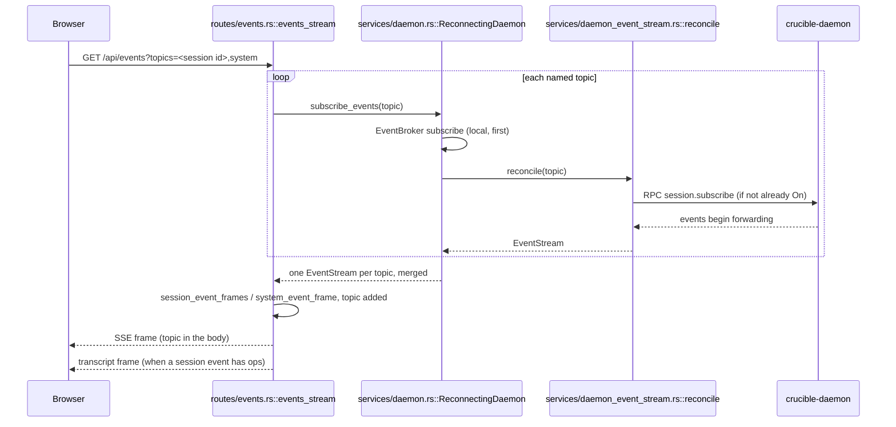

# Web Server

`crucible-web` is the Axum HTTP backend for `cru web`. It serves the
SolidJS frontend under `crates/crucible-web/web/`, answers the browser's
REST and SSE calls, and forwards every one of them to `crucible-daemon`
over the daemon's Unix socket. `crates/crucible-cli/src/commands/web.rs`
calls `crucible_web::start_server` (`crates/crucible-web/src/server.rs`);
that is the crate's one production entry point.

## Purpose and ownership

Per `AGENTS.md`, `crucible-cli`/`crucible-web` own "Input, presentation,
client-local state"; `crucible-daemon` owns "Sessions, admission, tools,
storage, retrieval, review, plugin lifecycle." `crucible-web` must not
construct a second agent configuration or a second write pipeline; it sends
intent to the daemon and renders the daemon's answer.

The crate holds to this rule as a thin proxy layer: almost every handler
under `crates/crucible-web/src/routes/` calls one `state.daemon.*` method
(`crates/crucible-web/src/services/daemon.rs`) and either returns the
daemon's own type verbatim or reshapes it through a locally declared,
`utoipa`-annotated row type via `crates/crucible-web/src/routes/session/mod.rs`'s
`daemon_shape`.

**Step 19's "What the web itself needs" decisions are done.** Four rules and
two stores that used to live only in this crate — reachable by the browser
alone, skipped by a raw RPC caller (the TUI, a Lua script) — now live in the
daemon, so every caller of the RPC method gets them:

- `crates/crucible-web/src/routes/project.rs`'s `register_project` no longer
  runs `untrusted_root_refusal` itself. `project.register` takes an
  `untrusted` flag; the web route sets it, and
  `crucible_daemon::project_manager::register_untrusted` applies the rule
  (a credential store, the user's config/state tree, on top of the daemon
  floor every caller gets). The web route keeps only `[web]
  registration_roots`, an operator setting of the web process, not a daemon
  concept. Proved through the live RPC method in
  `crates/crucible-daemon/tests/project_register.rs`.
- `crates/crucible-web/src/routes/canvas.rs`'s `put_canvas` no longer runs
  `validate_canvas` itself before writing. The daemon's `fs.write`
  (`crucible_daemon::file_write::canvas_containment_refusal`) refuses a
  `.canvas` write whose parsed content names a reference outside the
  resolved root, checked on the bytes actually written — after
  `restore_redacted`, closing a gap where a historical bad reference used to
  ride back to disk unchecked on an unrelated edit. Proved in
  `crates/crucible-daemon/tests/file_write.rs`'s
  `fs_write_size_and_containment` module.
- `crates/crucible-web/src/routes/search.rs`'s `put_note` no longer checks
  content size or note-name traversal itself: `fs.write`'s own
  `MAX_CONTENT_SIZE` and `enclosing_root` containment check already covered
  both, for every caller, before this change — the web's copies were
  redundant, not a gap the daemon needed to close. Proved in the same
  `fs_write_size_and_containment` module.
- `POST /api/session/{id}/resume` no longer runs its own fallback logic
  (try `session.resume`, on any failure retry `session.resume_from_storage`).
  `session.resume` decides for itself whether a session needed reloading
  from storage — not held in memory at all, or held but not `Paused` (most
  commonly `Ended`) — and reports which in its reply
  (`SessionTransitionReply::resumed_from_storage`). The route reads that
  flag and, only when it is set, also reads the full transcript with the
  read-only `session.history`. Proved in
  `crates/crucible-daemon/tests/session_resume_from_ended.rs`.
- The web's own `SwrCache` (formerly `services/catalog.rs`, now deleted) is gone.
  `AgentManager` caches `agents.list_profiles` and `providers.list` itself
  (`agent_profiles_cache`, `providers_cache`,
  `crate::agent_manager::CATALOG_CACHE_TTL`), the same way its existing
  `model_cache` already worked, and warms both at daemon startup. Every
  caller of either RPC method shares the cache now.
- `crates/crucible-web/src/routes/layout.rs`'s pane-layout blob and recents
  list are no longer read from or written to this process's own disk
  (`default_layout_path`/`standalone_layout_path`, gone). They persist
  through the daemon's generic `client_state.get`/`client_state.set`
  (`crates/crucible-daemon/src/server/client_state.rs`), keyed by
  `(client, key)` and written with `crucible_core::fs::write_private` under
  the daemon's data root. `AppState::client_state_id` (`"web"` or, for
  `--standalone`, `"web-standalone"`) replaces `layout_path` and gives the
  same cross-instance isolation. Proved in
  `crates/crucible-daemon/tests/client_state.rs`.

**Step 19's generic RPC route is done for its backend half (items 1-3 and 6);
its typed client, the route migration and the old-route deletion are open
(item 4 and item 9).** `POST /api/rpc/{method}` (`crates/crucible-web/src/routes/rpc.rs`)
sits behind the same auth middleware, origin checks and body-size limit as
every other route — it is merged into `api_router` beside them, not layered
separately — and does three things in order:

1. Look up `method` in `RpcMethod`. A name the daemon does not answer to is
   404.
2. Check `browser_may_call`, one `match` over every `RpcMethod` variant with
   no wildcard arm: a row added to `rpc_methods!` fails to compile here until
   someone decides whether the browser may reach it. This table, not the
   route, is the security boundary. `false` methods fall into three groups,
   each named at its arm: local-admin methods (`shutdown`, `lua.eval` and the
   Lua lifecycle, `plugin.install`/`remove`, the `config.*` writes and reads,
   `storage.*`, `mcp.start`/`stop`, `kiln.open`/`close`/`register`/`forget`,
   `project.register`/`unregister`, `llm.register_provider`,
   `webhook.receive`, `client_state.get`/`set`); methods no current web route
   forwards; and methods whose existing REST route applies a check this raw
   passthrough would skip (`project.register`'s untrusted-root rule,
   `/api/config`'s credential redaction).
3. Check `plugin_may_call`, the stricter per-caller list from
   `routes/plugin_caller.rs`'s `PluginCaller` (read the same way — same
   header, same three-valued identity — except that an absent header is the
   app here, not a refusal, since almost none of this route's callers are
   plugin business). A caller that named itself a plugin reaches only
   `plugin.run_command` (checked against that plugin's own commands, reusing
   `routes/plugin.rs`'s `refuse_another_plugins_command`) and
   `plugin.publications` (narrowed to the caller's own rows after the daemon
   answers, reusing `routes/plugin.rs`'s `narrow_to_caller`) — the same two
   operations the dedicated plugin routes already gate this way. See
   `routes/plugin_caller.rs`'s own header comment: this identity is asserted
   by the caller, not proved.

The body then reaches `ReconnectingDaemon::rpc_forward` (a `services/daemon.rs`
method, `ReplayPolicy::Once` because the route's method is chosen at the HTTP
layer and cannot be known safe to replay), and the reply comes back
unchanged. Daemon errors map through the same `WebResultExt::daemon_err`
every other route uses (`INVALID_PARAMS` → 422, `BUSY` → 409, anything else →
502); an unknown method or a disallowed one is the route's own 404/403,
before the daemon is ever asked. This route is documented once in the OpenAPI
document, generically — the typed contract a caller reads is the generated
`crates/crucible-web/web/src/lib/rpc-methods.d.ts` map, not 169 hand-written
paths.

The generated typed client that reaches this route is `rpc<M>(method,
params)` (`crates/crucible-web/web/src/lib/api-client.ts`, step 19 item 4):
it reads its params and reply types off the generated `RpcMethods[M]`, and
one error mapping, `expectOk`, covers every method. The migration moving
each domain's callers onto `rpc(...)` and deleting the REST route that only
forwarded one RPC (item 9) is per-domain and in progress: the `skills`
domain is done (`GET /api/skills`, `/api/skills/{name}` and
`/api/skills/search` are gone, and `lib/query/skills.ts` calls
`rpc('skills.list' | 'skills.get' | 'skills.search', ...)` directly); the
other domains still keep their REST route and forwarder.

`crates/crucible-web/src/routes/search.rs`'s `resolve_note` still walks the
filesystem directly (a walk that deliberately bypasses the note index), but
now resolves its root through the daemon's `fs.read` rather than a local
walk-up. The one shell that the web client has is the PTY terminal in
`crates/crucible-web/src/routes/terminal.rs`, the browser's terminal
transport. It starts in the workspace of the session that the client sends,
which is where the TUI's `!` commands run too.

## Module map

Paths are relative to the repository root. Line counts are as recorded at
`582c5e6c1`.

### `crates/crucible-web/src/` (crate root)

| File | Lines | Role |
| --- | --- | --- |
| `crates/crucible-web/src/assets.rs` | 201 | Serves the embedded SolidJS bundle or a `--static-dir` override. |
| `crates/crucible-web/src/error.rs` | 246 | `WebError`, the crate's one error enum (now including `Conflict`), and its HTTP/JSON projection. |
| `crates/crucible-web/src/fs_events.rs` | 138 | `FsEvent`, the file-tree explorer's SSE event enum, projected from daemon file-watcher events. |
| `crates/crucible-web/src/server.rs` | 720 | Assembles and starts the Axum app: `start_server`, `build_router`, CORS, CSP, Host defense, OpenAPI document; merges the diff/proposal/system-event/bases/rpc route groups. |
| `crates/crucible-web/src/test_support.rs` | 1936 | Shared test daemons and fixtures for every route test in this crate: the mock daemon, whose reply `match` is exhaustive over `RpcMethod`, `start_real_daemon_with_kilns`, a real in-process daemon, and `request_json_with_errors`, a mock daemon that answers scripted JSON-RPC errors. |

### `crates/crucible-web/src/middleware/`

| File | Lines | Role |
| --- | --- | --- |
| `crates/crucible-web/src/middleware/mod.rs` | 1 | Declares the `auth` submodule tree. |
| `crates/crucible-web/src/middleware/auth/api_key.rs` | 149 | Resolves and verifies the server's API key (config, persisted file, or generated). |
| `crates/crucible-web/src/middleware/auth/mod.rs` | 409 | `bearer_auth`/`host_guard`, the ordering contract, and the auth-submodule re-exports. |
| `crates/crucible-web/src/middleware/auth/session.rs` | 326 | `SessionStore` — persisted browser session tokens minted by login. |
| `crates/crucible-web/src/middleware/auth/shell.rs` | 464 | WebSocket `Origin` guard (CSWSH defense) and the loopback-only shell/terminal gate. |
| `crates/crucible-web/src/middleware/auth/tests.rs` | 623 | Integration tests for `bearer_auth`/`enforce_host`/loopback/session-cookie behavior. |
| `crates/crucible-web/src/middleware/auth/host/mod.rs` | 636 | `HostPolicy` — the DNS-rebinding defense (`accepts`, `local_names`, `normalize_authority`). |
| `crates/crucible-web/src/middleware/auth/host/tests.rs` | 441 | Regression tests for `HostPolicy` against known Host-header vulnerability shapes. |

### `crates/crucible-web/src/routes/`

| File | Lines | Role |
| --- | --- | --- |
| `crates/crucible-web/src/routes/mod.rs` | 61 | Module tree and public re-export surface for every route group. |
| `crates/crucible-web/src/routes/agents.rs` | 147 | `GET /api/agents`, `GET /api/models` — the session-creation agent picker. |
| `crates/crucible-web/src/routes/auth.rs` | 497 | `POST /api/auth/login`/`logout` — exchanges an API key for a session cookie. |
| `crates/crucible-web/src/routes/bases.rs` | 147 | Obsidian Bases query, view-listing and write endpoints (query/views/entries/property/group-order), a thin proxy over the daemon's `base.*` RPCs. |
| `crates/crucible-web/src/routes/canvas.rs` | 769 | `.canvas` document endpoints with read-path reference redaction, within the root the daemon's `fs.read` names; the write-path containment check itself is the daemon's `fs.write`. |
| `crates/crucible-web/src/routes/chat.rs` | 542 | Chat turn intake (with attached diff comments), the session SSE event stream, and pending-interaction routes. |

| `crates/crucible-web/src/routes/canvas.rs` | 769 | `.canvas` document endpoints with strict containment and reference redaction, within the root the daemon's `fs.read` names. |
| `crates/crucible-web/src/routes/chat.rs` | 527 | Chat turn intake (with attached diff comments) and pending-interaction routes. The session SSE stream moved to `routes/events.rs` in Simplification Plan step 19. |
| `crates/crucible-web/src/routes/config.rs` | 489 | `GET`/`POST /api/config` — forwards the daemon's effective config, origins, controls, and save. |
| `crates/crucible-web/src/routes/diff.rs` | 609 | Branch/session-record/proposal diffset and diff-comment routes (`/api/diff`, `/api/diff/file`, `/api/diff/comment*`), a thin proxy over the daemon's `diff.*` RPCs. |
| `crates/crucible-web/src/routes/events.rs` | 550 | `GET /api/events` — the one SSE route (Simplification Plan step 19). A client names as many topics as it wants in `?topics=a,b,...`: a session id for the chat stream, or `system` for publications, proposals, surface changes and filesystem changes. Every frame's JSON body gains a `topic` field; the payload types are unchanged (`SessionEventPayload`, `FsEvent`, `SurfaceChangedEvent`, `PublicationChangedEvent`, `ProposalChangedEvent`). Replaces the four routes `chat.rs::event_stream`, `fs.rs::fs_event_stream`, `surface.rs::surface_event_stream` and this file's own former `system_event_stream` used to serve separately. |
| `crates/crucible-web/src/routes/fs.rs` | 398 | File-tree explorer routes: list, move, mkdir, trash. The live SSE stream moved to `routes/events.rs` (the `system` topic) in step 19. `fs_list_dir`/`fs_move`/`fs_trash` return the daemon's typed `FsListing`/`FsMoveReply`/`FsTrashReply` directly, with no `daemon_shape` decode. |
| `crates/crucible-web/src/routes/health.rs` | 49 | `/health` liveness and `/ready` readiness probes. |
| `crates/crucible-web/src/routes/helpers.rs` | 115 | Shared stream-versioning, note-projection, and note-name-validation helpers. |
| `crates/crucible-web/src/routes/kiln.rs` | 1300 | Kiln/project file listing, the note-link graph, and text/raw file read-write, all through the shared `read_through_daemon`/`text_of`/`check_file_answer` helpers. `kiln_graph` returns core's own `KilnGraphReply` unchanged. |
| `crates/crucible-web/src/routes/layout.rs` | 470 | Web UI layout persistence and the recently-opened-files list. |
| `crates/crucible-web/src/routes/mcp.rs` | 97 | `GET /api/mcp/status`. |
| `crates/crucible-web/src/routes/plugin.rs` | 981 | The nine plugin HTTP endpoints: list, install, remove, reload, options, commands, publications. Each reply is a `crucible_core::types::Plugin*` type, forwarded unchanged. It has no SSE stream of its own; see the "SSE subscribe-before-forward" flow below. |
| `crates/crucible-web/src/routes/plugin_caller.rs` | 144 | `PluginCaller` — the caller-identity extractor gating six plugin routes. |
| `crates/crucible-web/src/routes/project.rs` | 625 | `/api/project/*` routes and the untrusted-caller root-safety policy. |
| `crates/crucible-web/src/routes/proposals.rs` | 318 | `/api/proposals*` — accept/reject/dismiss/resolve a note-tool proposal, a thin proxy with no session in its path. |
| `crates/crucible-web/src/routes/rpc.rs` | 642 | `POST /api/rpc/{method}` — the one generic RPC route (Simplification Plan step 19 item 1): `browser_may_call`'s exhaustive allow list, `plugin_may_call`'s stricter per-caller list, and the daemon-error-to-HTTP-status mapping. |
| `crates/crucible-web/src/routes/scm.rs` | 93 | `POST /api/scm/clone` — thin proxy for a git clone. |
| `crates/crucible-web/src/routes/search.rs` | 1506 | Kiln/note/search surface: kilns (with a `git` flag), notes, backlinks, vector/semantic/grep search. `list_kilns`, `list_notes`, `get_note` and `get_backlinks` return core's own reply types (`KilnRow`, `NoteListRow`, `NoteByNameReply`, `GetBacklinksReply`) unchanged, rather than a local row type decoded through `daemon_shape`. |
| `crates/crucible-web/src/routes/session_commands.rs` | 337 | `GET /api/session/{id}/commands` answers the daemon's per-session catalog. `POST /api/session/{id}/command` runs a built-in command only, over an exhaustive `BuiltinCommand` match; any other name comes back as an `error` reply, so the composer sends it as a chat message instead. Includes a daemon-backed `/clear`, a readable `/search`, and `/resume <id>`, which answers `open_session` for the browser to open. |
| `crates/crucible-web/src/routes/session_status.rs` | 204 | `GET /api/session/{id}/status` (`Vec<StatusDisplayItem>`, shared with the `status_items_changed` event; includes the engine's plugin-turn item), `GET .../notifications`, and `POST .../notifications/{id}/dismiss`. |
| `crates/crucible-web/src/routes/surface.rs` | 176 | `GET /api/surfaces`. The SSE change stream moved to `routes/events.rs` (the `system` topic) in step 19. |
| `crates/crucible-web/src/routes/terminal.rs` | 504 | `GET /api/terminal/ws` — WebSocket-to-PTY bridge. |
| `crates/crucible-web/src/routes/webhook.rs` | 465 | `POST /api/webhook/{name}` — signed webhook ingress. |

### `crates/crucible-web/src/routes/session/`

| File | Lines | Role |
| --- | --- | --- |
| `crates/crucible-web/src/routes/session/mod.rs` | 1144 | `/api/session*` CRUD, lifecycle, scope, modes, providers, and the session notifications read/dismiss routes. Also `set_knob`/`get_knob` (`PUT /api/session/{id}/knob`, `GET /api/session/{id}/knob/{knob}`): one route pair for every `SessionKnob` — model, mode, context strategy, precognition, plugin turn limit (step 13 of the simplification plan). |
| `crates/crucible-web/src/routes/session/search_scope_tests.rs` | 55 | Tests for the session-search kiln-scope query parsing. |
| `crates/crucible-web/src/routes/session/shape_tests.rs` | 430 | Shape/round-trip tests for the session handlers. |
| `crates/crucible-web/src/routes/session/tests.rs` | 651 | `create_session` (forwarding its endpoint to the daemon unchecked), scope, export, session-history, and provider-listing tests. |

### `crates/crucible-web/src/routes/session_config/`

| File | Lines | Role |
| --- | --- | --- |
| `crates/crucible-web/src/routes/session_config/approval.rs` | 89 | Per-session, per-plugin approval mode (`ask`/`stop`/…) — not a `SessionKnob`, since it takes a second key (the plugin name). |
| `crates/crucible-web/src/routes/session_config/basic.rs` | 139 | The agent-self-advertised option list/set (`agent_option`, also not a `SessionKnob`). |
| `crates/crucible-web/src/routes/session_config/mod.rs` | 59 | Assembles the plugin-approval and agent-option routes from `approval.rs` and `basic.rs`. Every `SessionKnob` — precognition, context strategy, model, mode, plugin turn limit — moved to `routes/session/mod.rs`'s `set_knob`/`get_knob` in step 13 of the simplification plan; `prompt.rs` (the old `context-strategy` route) is gone. |
| `crates/crucible-web/src/routes/session_config/tests.rs` | 258 | Round-trip tests for `set_knob`/`get_knob`, plugin approval and agent options. |

### `crates/crucible-web/src/services/`

| File | Lines | Role |
| --- | --- | --- |
| `crates/crucible-web/src/services/mod.rs` | 8 | Declares the `services` module tree; imports the `forward_rpc!` macro crate-wide. |
| `crates/crucible-web/src/services/daemon.rs` | 1064 | `AppState`, `ReconnectingDaemon`, `EventBroker`, `EventStream` — the daemon RPC client wrapper, SSE fan-out, the `base.*`/`diff.*`/`proposal`-adjacent forwarders, and `rpc_forward`, the generic forwarder behind `routes/rpc.rs`. |
| `crates/crucible-web/src/services/daemon_config.rs` | 91 | Forwards `config.*` RPCs and redacts credentials at the crate boundary. |
| `crates/crucible-web/src/services/daemon_event_stream.rs` | 252 | `EventStream`, `Interest` — per-session upstream subscribe/unsubscribe reconciliation and SSE lag-to-`stream_gap` translation. |
| `crates/crucible-web/src/services/daemon_plugins.rs` | 101 | Forwards `plugin.*` RPCs for the plugin panel and settings pane. |
| `crates/crucible-web/src/services/daemon_proposals.rs` | 50 | Forwards `proposal.*` RPCs (list, get, accept, reject, dismiss, resolve) with the daemon's `Proposal` type. |
| `crates/crucible-web/src/services/daemon_retry_tests.rs` | 548 | Real-Unix-socket tests for `ReconnectingDaemon`'s reconnect/replay machinery and the `Interest`/`EventStream` upstream-subscription protocol, driven through both the raw client and the assembled router's SSE routes. |
| `crates/crucible-web/src/services/forwarding.rs` | 32 | `ReplayPolicy` and the `forward_rpc!` macro shared by every `daemon_*.rs` forwarder. |

### `crates/crucible-web/web/src/lib/` (selected)

| File | Lines | Role |
| --- | --- | --- |
| `crates/crucible-web/web/src/lib/slash-commands.ts` | 45 | `isBuiltinCommand`, checked against the generated `BuiltinCommand` union so a new Rust built-in command fails this file's build until it is added here, and `commandResultText`. Imports no API client, so the composer can use it with no session open. |

## Key types and traits

- **`AppState`** (`crates/crucible-web/src/services/daemon.rs`) — the shared
  Axum state every handler extracts. Holds `daemon: Arc<ReconnectingDaemon>`,
  `events: Arc<EventBroker>`, `config: Arc<CliAppConfig>`, an `http_client`,
  `client_state_id: Arc<str>`, `remote_shell`, and `recents_lock`.
  `client_state_id` is this process's namespace in the daemon's generic
  `client_state.get`/`client_state.set` store (`"web"`, or
  `"web-standalone"` for `--standalone`) — the pane layout and the recents
  list live there now, not on this process's own disk. Built once by
  `init_daemon` and cloned per request; `build_router` in
  `crates/crucible-web/src/server.rs` is the only place that mutates it
  after construction (setting `remote_shell` and, for a standalone
  instance, `client_state_id`). Being an
  `Arc` is load-bearing for `daemon`: `ReconnectingDaemon::subscribe_events`
  takes `self: &Arc<Self>` and hands `EventStream` a `Weak` clone so a
  dropped stream can still reach the daemon to release its interest.
- **`ReconnectingDaemon`** (`crates/crucible-web/src/services/daemon.rs`) —
  wraps a live `crucible_daemon::DaemonClient` behind `Arc<RwLock<DaemonClient>>`
  plus a generation counter. Every RPC forwarder (`forward_rpc!`-generated,
  or hand-written for `scm_clone`) calls its `forward_rpc` method, which
  retries once on a connection-shaped error only when the call's
  `ReplayPolicy` is `Safe`. `session_subscribe`/`session_unsubscribe` are
  private now, called only by `daemon_event_stream.rs`'s `reconcile`, never
  directly from a route.
- **`EventBroker`** (same file) — the SSE fan-out: its per-session
  `broadcast::Sender` lives in `sessions`; `dispatch` routes an event to one
  session's sender, or to every session's sender for the daemon's wildcard
  session id. `subscribe(session_id)` (a raw `broadcast::Receiver`) is now
  `#[cfg(any(test, feature = "test-utils"))]` — production code never calls
  it directly; it calls `ReconnectingDaemon::subscribe_events`, which returns
  an `EventStream` and reconciles the daemon subscription to match reader
  demand as a side effect.
- **`EventStream`**/**`Interest`** (`crates/crucible-web/src/services/daemon_event_stream.rs`)
  — `EventStream` is the `Stream<Item = SessionEvent>` every browser SSE
  route now reads (via `ReconnectingDaemon::subscribe_events`); its own
  `poll_next` turns a local broadcast lag (`Lagged(n)`) into a synthetic
  `stream_gap` event rather than propagating the error, and dropping it
  releases the session's upstream `session.subscribe` once no other reader
  remains — through an unbounded channel, so the release reaches the daemon
  even with no Tokio runtime on the dropping thread. `Interest` holds one
  `Upstream` mutex per session id and serializes that release/re-subscribe
  as one flight per session, so a slow RPC for one session cannot block
  another's.
- **`WebError`** (`crates/crucible-web/src/error.rs`) — the crate's one
  error enum (`Config`, `Io`, `Chat`, `Daemon`, `Validation`, `NotFound`,
  `UnsupportedMediaType`, `Forbidden`, `Conflict`, `Internal`, `StaleBase`).
  Every route returns `crate::Result<T>`; `WebResultExt::daemon_err()` turns
  a daemon RPC failure into the right variant, reclassifying an
  `INVALID_PARAMS` JSON-RPC error as `Validation` (422) and a `BUSY` error
  (`crucible_core::protocol::rpc::BUSY`, in `crates/crucible-core/src/protocol/rpc/mod.rs`)
  as `Conflict` (409) — a proposal decision or a bases write already in
  flight — rather than `Daemon` (502). `rpc_error_parts` (same file) is
  `pub(crate)` so `routes/bases.rs` can reuse the same JSON-RPC code/message
  split to map the daemon's bases-specific `NOT_FOUND` code to 404.
- **The chat topic of the one SSE stream carries one vocabulary, not two.**
  The route (`crates/crucible-web/src/routes/events.rs`, function
  `session_event_frames`) forwards the daemon's own `{event, data}` pair for
  every session event — the same shape `SessionEventMessage` and
  `session.jsonl` carry — with the SSE `event:` field set to `event.event`
  and a `topic` field added to the envelope (Simplification Plan step 19).
  There is no second, web-only enum re-encoding each event:
  `crucible_core::protocol::session_events::SessionEventPayload` carries
  `ToSchema`, so `openapi.json` and the generated
  `web/src/lib/api-schema.d.ts` describe the real wire union, and
  `web/src/lib/types.ts` aliases it as `SessionEvent`. A live event that
  changed the transcript still sends a second frame, `transcript`
  (`TranscriptFrame` in `routes/events.rs`), with the same `id:` as the
  first. `ChatEvent::from_daemon_event` and `normalize_interaction`, which
  used to build the second vocabulary and flatten permission requests, are
  gone; a permission request's suggested grant (`PermRequest.pattern`) is
  now filled in once, by `SessionEventMessage::interaction_requested`
  (`crates/crucible-core/src/protocol/rpc/mod.rs`), before the request
  reaches any client. **`FsEvent`** (`crates/crucible-web/src/fs_events.rs`)
  is the one remaining browser-facing projection enum, for the filesystem
  watcher, carried on the `system` topic of the same route.
- **`ApiKeyState`**, **`HostPolicy`**, **`SessionStore`**, **`ShellGateState`**
  (`crates/crucible-web/src/middleware/auth/mod.rs`, `host/mod.rs`,
  `session.rs`, `shell.rs`) — the auth/host/session state consumed by
  `bearer_auth`, built once at startup in `build_router` in `crates/crucible-web/src/server.rs`
  and carried through the router as `Arc` extractor state.
- **`PluginCaller`** (`crates/crucible-web/src/routes/plugin_caller.rs`) —
  an Axum `FromRequestParts` extractor reading the `x-crucible-plugin`
  header; created per-request, consumed by six handlers in
  `crates/crucible-web/src/routes/plugin.rs`. Documented as not a security
  boundary.
- **`ReplayPolicy`** (`crates/crucible-web/src/services/forwarding.rs`) —
  `Safe` or `Once`, declared per RPC forwarder; consumed by
  `ReconnectingDaemon::forward_rpc`.
- **`crucible_core::session::{SessionSummary, SessionDetail}`**/
  `ResumeSessionResponse`/`daemon_shape`
  (`crates/crucible-web/src/routes/session/mod.rs`) — `session.create` and
  `session.list` answer the full core `SessionSummary` (a `session.list`
  reply is `crucible_core::protocol::requests::SessionListReply`, a
  `Vec<SessionSummary>` and a count); `session.get` answers
  `SessionDetail`, a `SessionSummary` flattened onto the wire plus the
  full-record fields. Every route returns the core type unchanged rather
  than decoding into a web-local row. `ResumeSessionResponse` is a
  `#[serde(untagged)]` enum whose variant order is load-bearing (`Restored`
  must precede `Live`, tested by `shape_tests.rs`). `crates/crucible-web/src/routes/diff.rs`
  no longer calls `daemon_shape` for a diffset/comment reply: the daemon's
  `diff.*` RPCs answer `crucible_core::protocol::requests::{DiffCommentReply,
  DiffCommentsReply, DiffResolveCommentReply, DiffDeleteCommentReply}`
  directly, and the route returns each one unchanged. `ModeRow.writes: WriteModeRow`
  (`Apply`/`Propose`, mirroring `crucible_core::types::WriteMode` in
  `crates/crucible-core/src/types/mode.rs`) replaced `ModeRow.review_policy:
  ReviewPolicyRow`, since a mode now declares what a write *does*
  (`apply`/`propose`), not how much review gates it.
- **`DiffsetSource`** (`crucible_core::diff::DiffsetSource`, in
  `crates/crucible-core/src/diff.rs`) — a branch diff (`root`/`base`/`head`),
  a session record's base text against the current files on disk
  (`session`), or one proposal's base-of-each-write against its new text
  (`proposal`); the query shape `crates/crucible-web/src/routes/diff.rs`
  turns a caller's query or body into, and the key
  `crates/crucible-web/src/services/daemon.rs`'s `Diff*` forwarders send to
  the daemon.
- **`Comment`**/`CommentAnchor`/`CommentSide`/`CommentAuthor`
  (`crucible_core::session`, in `crates/crucible-core/src/session/types/review.rs`)
  — the one wire shape of a review comment, with `ToSchema` behind the
  `openapi` feature. `/api/diff/comment*` (`crates/crucible-web/src/routes/diff.rs`)
  names these types directly; no web-local row mirrors them.
- **`Proposal`**/`ProposalId` (`crucible_core::proposal`, in
  `crates/crucible-core/src/proposal.rs`) — forwarded verbatim by
  `crates/crucible-web/src/routes/proposals.rs` and
  `crates/crucible-web/src/services/daemon_proposals.rs`; the web declares
  no row type of its own for a proposal.
- **`WriteOutcome`** (`crucible_daemon::bases::WriteOutcome`, in
  `crates/crucible-daemon/src/bases/operation.rs`) — the three-way answer a
  bases write gives; `crates/crucible-web/src/routes/bases.rs`'s
  `write_answer` maps `Stale { current_hash }` to `WebError::StaleBase`
  (409), `Refused { reason }` to `WebError::Forbidden` (403), and
  `Applied`/`Unchanged`/`Proposed` to 200.

## Flows

### Startup

`crates/crucible-cli/src/commands/web.rs` calls
`crucible_web::start_server` (`crates/crucible-web/src/server.rs`), which:

1. Builds `HostPolicy::from_web_config`, before any port is bound, so a
   malformed `allowed_hosts` entry costs no bound port. This does not run
   before the daemon is touched: `crates/crucible-cli/src/commands/web.rs`'s
   own handler already connected or auto-spawned a daemon before it calls
   `start_server`, so a refusal here can still leave a daemon running.
2. Calls `daemon::init_daemon`, which connects (or auto-spawns) a
   `crucible_daemon::DaemonClient`, builds the `EventBroker` and
   `ReconnectingDaemon`, best-effort registers the configured kiln as a
   project, and returns `AppState`.
3. For a standalone instance, swaps `state.client_state_id` to the
   `"web-standalone"` namespace. The daemon itself warms the slow
   `agents.list_profiles`/`providers.list` catalog probes at its own
   startup now, so this step no longer exists here.
4. Resolves the API key (`middleware::auth::resolve_api_key`) and builds
   `ApiKeyState`.
5. Calls `build_router`, which composes the CORS allow-list from
   `HostPolicy`, decides `remote_shell`, builds `ShellGateState`, nests
   `api_router` behind `bearer_auth`, merges `health_routes`/`auth_routes`/
   `static_routes` as public routes, and wraps the whole app in
   `with_security_headers(with_app_wide_layers(...))`.
6. Binds a `TcpListener` and runs `axum::serve(...)`.

### Request auth flow

Every `/api/*` request passes `bearer_auth`
(`crates/crucible-web/src/middleware/auth/mod.rs`), which runs
`HostPolicy::accepts` (`enforce_host`) first, then relaxes in order: auth
disabled, loopback caller (`caller_is_loopback`), a matching `Authorization:
Bearer` header (`api_key::verify_api_key`), or a valid session cookie
(`session::SessionStore::verify`) — else 401/403 via
`crate::error::error_response`. The shell and terminal routes add a second,
stricter gate: `shell::localhost_only_shell_auth` plus
`websocket_origin_guard`, because `bearer_auth`'s loopback bypass is unsafe
for a PTY once DNS rebinding and same-origin trust combine; that second gate
lifts only under the fail-closed `remote_shell_active` opt-in.

### SSE subscribe-before-forward

Every topic of the one browser SSE route, `GET /api/events`
(`crates/crucible-web/src/routes/events.rs`, Simplification Plan step 19),
reads its own `EventStream` from `ReconnectingDaemon::subscribe_events`
(`crates/crucible-web/src/services/daemon.rs`, implemented in
`crates/crucible-web/src/services/daemon_event_stream.rs`), which subscribes
the local `EventBroker` channel before it reconciles the daemon's own
`session.subscribe`, so an event emitted between the two steps is not lost.
The route subscribes every named topic before it replays any of them: an
event emitted during a slow replay read of one topic must not be lost
because a later topic had not subscribed yet. The `system` topic (the
daemon's system channel: publications, proposals, filesystem and surface
changes) and a session's own topic (chat) both go through this one function,
where each used to call its own copy — `fs.rs`'s and `surface.rs`'s former
file-watcher and surface-change streams called a shared `system_stream`
helper, and `chat.rs`'s former per-session stream called `subscribe_events`
directly. `crates/crucible-web/src/routes/plugin.rs` has no SSE stream of
its own left at all — its former `GET /api/plugins/events` route is
deleted, superseded first by `GET /api/events/system` and now by the
`system` topic of `GET /api/events`.

`session_event_frames` in `crates/crucible-web/src/routes/events.rs` turns
one daemon event of a session topic into one or two SSE frames. The first
frame's `event:` name is `event.event` and its `data:` is `{"topic":
<topic>, "event": event.event, "data": event.data}` — the daemon's own pair,
forwarded, not re-encoded, with the topic added to the envelope. When the
live event has transcript ops, a second frame follows. Its name is
`transcript`, its `id:` is `<topic>:<seq>`, and its data is `{"topic":
<topic>, "type": "transcript", "seq": <seq or null>, "ops": [...]}`. A
replayed event comes from the stored log, so it has no ops and no second
frame. `system_event_frame` does the equivalent for the `system` topic,
trying each of the four payload shapes (`FsEvent`, `SurfaceChangedEvent`,
`PublicationChangedEvent`, `ProposalChangedEvent`) in turn and dropping an
event none of them recognise. The test
`a_live_event_sends_its_transcript_ops_as_a_second_frame` in the same file
reads the SSE body.

Three paths can raise a `stream_gap` event, and each names why.
`EventStream`'s `Stream` implementation
(`crates/crucible-web/src/services/daemon_event_stream.rs`) turns a local
broadcast lag (`Lagged(n)`) into a synthetic `stream_gap` event for that one
reader, rather than dropping it silently.
`ReconnectingDaemon::rewire_events` (`crates/crucible-web/src/services/daemon.rs`)
raises a `stream_gap` addressed to the wildcard session id after a daemon
reconnect, once the dead connection's event-router task has been stopped
and awaited to completion, so no event the dead connection still held can
follow the gap; `EventBroker::dispatch` fans a wildcard-addressed event out
to every session's sender, since no per-session sender is keyed to the
wildcard. `events_stream`'s per-topic replay-cursor filter treats either gap
as ending its "hide already-replayed events" window (resetting its `floor`
to 0), because a reconnected daemon renumbers events from its own persisted
log, so a seq at or below the old floor can be a genuinely new event. Each
topic keeps its own `floor`, so a gap on one session's topic does not reset
another topic's window.

### Browser-side stream recovery

The backend's `ReconnectingDaemon` reconnect covers only the web server's
own link to the daemon. The SolidJS frontend adds a second, separate
recovery layer for the browser's own link to the web server: the
`EventSource` an SSE route serves can drop for a reason `ReconnectingDaemon`
never sees, such as an HTTP 5xx or a wrong content type, which leaves a
browser `EventSource` permanently `CLOSED` with no further retry of its own.
`openReconnectingSource` (`crates/crucible-web/web/src/lib/api.ts`) closes a
failed source itself and opens a new one after an exponential backoff. Since
Simplification Plan step 19 there is one such source for the whole page,
`joinEventsTopic`'s shared connection, carrying every topic the page reads —
a session's chat events, surface changes, filesystem changes and the
daemon's publications and proposals — so one backoff now covers all of them
at once. An open resets the backoff to its first step; a manual
`reconnect()` on a root in `crates/crucible-web/web/src/lib/query/sse.ts`
calls `reconnectEventsConnection`, which rebuilds the one shared connection
(every joined topic's manual retry at once) and skips the backoff outright.

On a reconnect or a `stream_gap`, a consumer must not lose a change that
arrived while its first fetch of the same data was still in flight.
`refreshQueries` (`crates/crucible-web/web/src/lib/query/recovery.ts`) waits
for any fetch already in flight for a matched query to settle before it
invalidates that query, rather than cancelling the in-flight fetch; a cancel
would fail every caller of `fetchQuery` that is waiting on a query with no
data yet. `sessionNotifications` (`crates/crucible-web/web/src/lib/query/daemon-notification.ts`)
answers the related toast case: a notification whose display timer already
hid it keeps its entry in `showDaemonNotification`'s `shownIn` map, so a
reconnect's or a gap's re-read of the same notification snapshot does not
show the toast again.
`crates/crucible-web/web/src/lib/query/__tests__/stream-recovery.test.ts`
and `crates/crucible-web/web/e2e/system-stream-recovery.spec.ts` pin both
the backoff-reopen behavior and the wait-before-invalidate behavior.

### The client transcript

The web client does not fold events into a transcript. The daemon folds
them once (`crates/crucible-core/src/transcript/`). The web client draws the
result. `crates/crucible-web/web/src/contexts/transcriptStore.ts` holds one
transcript for each session, and every pane of that session reads it.

- **Seed.** The history route answers `transcript`, the fold of the stored
  log. `ChatContext` gives each answer to `seedTranscript`. The store keeps
  its own copy when that copy has a higher `as_of_seq`.
- **Apply.** The store applies the ops of each `transcript` frame in order
  with `applyTranscriptOp` (`crates/crucible-web/web/src/lib/transcript.ts`).
  This function is a port of `Transcript::apply`. The `at` of an append
  counts UTF-8 bytes, as the Rust string does. The store drops a frame whose
  `seq` is not above `as_of_seq`.
- **Snapshot.** For a resident session, `SessionManager::load_transcript`
  answers the live fold of the event bus (`EventBus::transcript`). That fold
  holds the text that a running turn streamed, which the log does not store.
  Thus a page that loads while a turn runs can apply the next ops.
- **Resync.** An op that does not fit, a `stream_gap` and a reopen of the
  stream make the store read the history again with
  `refetchSessionHistory`. A replayed event has no ops, so the store must
  read a snapshot after a reconnect. The daemon gives each event of a
  session the next seq. Thus a fresh stream compares its first live seq
  with the `as_of_seq` of the snapshot. When the first live seq is above
  `as_of_seq + 1`, an event fell between the two reads, and the store reads
  a snapshot again. A stream that resumes at a cursor reads a snapshot on
  its first open when the snapshot in the store is older than the
  subscription. The store
  keeps the frames since the last snapshot. After a new snapshot, it applies
  the frames above the `as_of_seq` of that snapshot again. When an op still
  does not fit, the store skips it and reads a snapshot again at
  `turn_finished`.
- **Draw.** `itemToMessage` maps one item to the `Message` view model of the
  existing components. It is a pure map: the order, the merges and the
  status of each item come from the daemon. `renderTranscript` adds the
  rows that only this browser knows: the optimistic entry of a sent message,
  and the notice of a failed send. The daemon's user turn with the id that
  the send answered replaces the optimistic entry.
- **Removed.** The client fold is gone: `foldHistory` in `ChatContext.tsx`,
  the transcript cases of `chatEventReducer.ts`, and the id helpers of
  `lib/turn.ts`. `chatEventReducer.ts` now keeps only the state around the
  transcript: streaming and loading, errors, the open interaction, the mode
  and the title. The route of the chat stream no longer writes the echoed
  user message into the cached history, and a turn end no longer
  invalidates the history.

`crates/crucible-web/web/src/lib/__tests__/transcript.test.tsx` draws each
golden fold of `assets/fixtures/golden/transcript/` and compares its rows
with the file in `rows/`, which the TUI and `cru acp` tests also read.
`crates/crucible-web/web/src/contexts/__tests__/transcriptStore.test.tsx`
pins the seed, the apply, the resync and the optimistic entry.

### Upstream subscription reconciliation

Every browser SSE stream drives its own daemon subscription, not one
hard-coded `"system"`-channel entry. `ReconnectingDaemon::subscribe_events`
(`crates/crucible-web/src/services/daemon_event_stream.rs`) gets-or-creates
the session's broadcast sender in `EventBroker`, wraps a new receiver in an
`EventStream`, then calls `reconcile(session_id)`, which computes
`wants_events` (true iff the broadcast sender still has a receiver) and,
holding the session's `Upstream` mutex from `Interest`, issues exactly one
`session.subscribe` or `session.unsubscribe` RPC to bring the daemon into
agreement — one flight at a time, so a slow RPC for one session cannot
block another session's `reconcile`. Dropping an `EventStream` sends a
release through an unbounded channel a lazily-started `serve_releases` task
drains, so the release reaches the daemon even if the drop happens with no
Tokio runtime on the current thread.
`ReconnectingDaemon::close_event_streams` (called by
`end_session`/`archive_session`/`delete_session` in
`crates/crucible-web/src/routes/session/mod.rs`) removes the broker entry
and reconciles away the upstream subscription through the same path an
ordinary last-reader drop uses.

### Daemon reconnect and replay

`ReconnectingDaemon::forward_rpc` calls the current `DaemonClient`; on a
connection-shaped error (broken pipe, connection reset/refused) and a
`Safe`-policy call, it calls `reconnect_if_stale` (a double-checked
generation compare under a write lock). `reconnect_if_stale` reconnects in
event mode, then — before it commits the new connection to `*daemon` —
calls `session_subscribe` on the new connection for every session whose
broadcast sender in `EventBroker` still has at least one receiver; a
failure here refuses the whole reconnect (leaving `generation` unchanged,
so the next `Safe` call retries) rather than committing a half-restored
connection that looks healthy while its browser streams stay silent. Once
restoration succeeds, `rewire_events` stops the old event-router task and
awaits its join before broadcasting the reconnect's `stream_gap` and
spawning the new router. The original call is then retried exactly once. A
`Once`-policy call (any daemon-side write) is returned immediately on error
rather than retried, because a lost response to a write is ambiguous.
`crates/crucible-web/src/services/daemon_retry_tests.rs` exercises this —
and the `Interest`/`EventStream` protocol above — against a real,
failure-injecting Unix-socket peer, driving both the raw client and, for
several tests, the fully assembled router's real SSE bodies.

### Kiln/canvas file read and write

Every file route resolves its root and content through the daemon rather
than locally. `get_kiln_file`/`get_raw_file` (`crates/crucible-web/src/routes/kiln.rs`)
and `get_canvas`/`put_canvas` (`crates/crucible-web/src/routes/canvas.rs`)
call the shared `read_through_daemon` helper (`crates/crucible-web/src/routes/kiln.rs`),
which sends the caller's path to the daemon's `fs.read` RPC and reads back
the resolved root and content, or `None` if absent; `text_of`
(`crates/crucible-web/src/routes/kiln.rs`) extracts `(text, content_hash)`
for a text read. `put_canvas` forwards the new content, and the original
path string unchanged, to `state.daemon.fs_write`, which is also where the
canvas-reference containment check now runs
(`crucible_daemon::file_write::canvas_containment_refusal`) — this route
only parses the document and restores a redacted reference before sending
it; `put_kiln_file`/`patch_kiln_file` do the same directly — a comment on
`put_kiln_file` states "the daemon owns containment, policy, compare, merge
and write." `check_file_answer` (renamed from `check_write`, and now called
by the *read* path too) in `crates/crucible-web/src/routes/kiln.rs`
translates the daemon's JSON reply into a typed 200/409/403 response for all
of these handlers (`write_response` wraps it for the write routes).
`crates/crucible-web/src/routes/search.rs`'s `put_note` follows the same
pattern and no longer checks content size or note-name traversal itself
either: `fs.write`'s own `MAX_CONTENT_SIZE` and `enclosing_root` containment
check cover both, for every caller. The daemon decides which root — the
innermost kiln, else the innermost project or session workspace folder —
encloses a path, whether that root's policy permits the operation, and
whether a symlink escapes it; none of these routes resolve or check that
themselves, matching the containment split described in
[[Knowledge Storage and Retrieval]].

### Diffset and proposal review

`crates/crucible-web/src/routes/diff.rs` is a thin proxy over the daemon's
`diff.get`/`diff.file`/`diff.comment`/`diff.resolve_comment`/
`diff.delete_comment`/`diff.comments` RPCs. A query names exactly one
`DiffsetSource`: a git branch diff (`root`, with an optional `base`/`head`),
a session record's base text against the current files on disk (`session`),
or a proposal's base-of-each-write against its new text (`proposal`); a
session-record or proposal source takes no `base`/`head`, and additionally
accepts an explicit `root` (either can span more than one root, unlike a
branch source, which names its own). Each comment reply
(`DiffCommentReply`/`DiffCommentsReply`/`DiffResolveCommentReply`/
`DiffDeleteCommentReply`, in
`crates/crucible-core/src/protocol/requests/storage.rs`) carries the core
`crucible_core::session::Comment` type directly; the route returns each
reply unchanged, with no web-local row to drop a field the daemon adds.
`crates/crucible-web/src/routes/proposals.rs` serves
`/api/proposals*` — a proposal belongs to no session, so its routes are not
nested under `/api/session/{id}`. `accept_proposal`/`reject_proposal` take
optional `paths`/root-qualified `files` so a caller can decide only some
files of a proposal; the daemon moves the rest into a new proposal of the
same author. A decision already in flight for a proposal answers
`WebError::Conflict` (409) — the daemon's `BUSY` JSON-RPC code — rather than
losing or duplicating the decision.

## State, concurrency and lifecycle

- **Locks.** `ReconnectingDaemon` guards its `DaemonClient` with
  `Arc<RwLock<DaemonClient>>`. `Interest`
  (`crates/crucible-web/src/services/daemon_event_stream.rs`) guards each
  session's `Upstream` state in its own `Arc<tokio::sync::Mutex<Upstream>>`,
  so a slow `session.subscribe`/`session.unsubscribe` RPC for one session
  holds only that session's flight; `forget_idle` drops a session's flight
  entry only when nothing else holds a clone (`Arc::strong_count == 2`) and
  it is locked and `Off`. `SessionStore`
  (`crates/crucible-web/src/middleware/auth/session.rs`) guards its session
  list with `Arc<Mutex<Vec<Session>>>`, pruning expired sessions lazily on
  every access — no background timer. `AppState.recents_lock` serializes the
  read-modify-write of the recents list
  (`record_recent` in `crates/crucible-web/src/routes/layout.rs`), which now
  lives in the daemon's `client_state.get`/`client_state.set` store, not a
  JSON file this process owns. The agent/provider catalog cache
  (`agent_profiles_cache`, `providers_cache`) moved into
  `crucible_daemon::AgentManager` with it — this crate holds no cache of its
  own for either.
- **Background tasks.**
  `services/daemon.rs::spawn_event_router` runs the daemon-to-broker event
  pump as a `JoinHandle`; `rewire_events` aborts it and awaits its join
  before it spawns the replacement on a reconnect, so no event of the dead
  connection can follow the reconnect's `stream_gap`.
  `daemon_event_stream.rs`'s `serve_releases` spawns one `tokio::spawn` per
  dropped `EventStream`'s release, so a slow `session.unsubscribe` RPC for
  one session does not delay another's.
  `routes/terminal.rs::handle_terminal` spawns a dedicated blocking OS thread
  (`std::thread::spawn`) for PTY reads, bridged into an `mpsc::channel` that
  the WebSocket bridge loop reads inline; the bridge loop itself runs in the
  task Axum's `on_upgrade` already spawns, not a second `tokio::spawn` inside
  `handle_terminal`.
- **Bounded resources.** `routes/terminal.rs` caps concurrent PTYs at
  `MAX_TERMINALS` (8) via a process-wide `Semaphore`; a permit is dropped
  only after the child process is killed and reaped, specifically to avoid
  releasing a slot while its process still lives.
- **Caches.** None in this crate. The agent-profile and provider-list caches
  live in `crucible_daemon::AgentManager` (`CATALOG_CACHE_TTL`, 30s) — see
  [[Daemon Server#State, concurrency and lifecycle]].
- **Startup.** `HostPolicy::from_web_config` performs a synchronous
  `getaddrinfo(AI_CANONNAME)` call to learn this machine's own reachable
  names, which can block startup briefly on a slow resolver. The daemon
  warms its own catalog cache at its startup, not this process's.
- **Shutdown/cleanup.** `end_session`/`archive_session`/`delete_session`
  call `state.daemon.close_event_streams(session_id)`, which drops the SSE
  registry entry and reconciles away the daemon's `session.subscribe` if no
  other reader is still attached — the same path an ordinary last-reader
  drop of an `EventStream` uses.
  `terminal.rs` kills the PTY's whole process group (`killpg(SIGKILL)` on
  unix, awaited on a blocking thread) rather than only the shell, because a
  PTY session leader can leave backgrounded grandchildren holding the slave
  open.

## Boundaries and invariants

- **Host defense runs before every relaxation.** `bearer_auth` checks
  `HostPolicy::accepts` first; every later relaxation (auth disabled,
  loopback, same-origin WebSocket) assumes the request named an authority
  this server actually answers to. `HostVerified` is a marker inserted only
  on a genuine match, never on the remote-caller relaxation, since the
  WebSocket origin guard reads that marker as license for same-origin trust.
- **Path/root containment is centralized in the daemon, not the web.**
  Every file route — `routes/canvas.rs`'s `get_canvas`/`put_canvas`,
  `routes/kiln.rs`'s `get_kiln_file`/`get_raw_file`/`put_kiln_file`/
  `patch_kiln_file` (via the shared `read_through_daemon` helper), and
  `routes/search.rs`'s `put_note` — sends the caller's path straight to the
  daemon's `fs.read` or `fs.write` RPC and uses the root and content in the
  daemon's answer; the daemon decides which root encloses the path, whether
  that root's policy permits the operation, and whether a symlink escapes
  it. `routes/helpers.rs` keeps only `validate_note_name` (note-name
  validation, unrelated to file-path containment) and the content-size
  constants; it holds no containment check of its own.
- **`PluginCaller` is explicitly not a security boundary.** Any same-origin
  script can set the `x-crucible-plugin` header and call itself `app`; the
  extractor exists as an honest-error seam for the accidental case and a
  future sandboxed-iframe boundary, not an authorization check.
- **Config redaction happens once, at the crate boundary.**
  `services/daemon_config.rs` calls `redact_credentials` on every
  `config.*` read before it leaves the crate, rather than in each route,
  because the daemon's own RPC does not redact (its socket is per-uid 0700)
  and a route that forgot to redact would ship secrets to the browser.
- **SSRF validation runs in the daemon, for every client.** `configure_agent`
  in `crates/crucible-daemon/src/agent_manager/session_config.rs` calls
  `check_request_endpoint` (`crates/crucible-daemon/src/provider/endpoint_check.rs`)
  to reject a custom provider endpoint that resolves to a non-global-unicast
  or embedded-IPv4 address, unless the endpoint's origin is one the operator
  configured (an `llm.providers` endpoint, a backend default, `OLLAMA_HOST`,
  or `chat.endpoint`); the check runs for the TUI, direct RPC callers and
  Lua plugins as well as the web, not the web alone. `create_session`
  (`routes/session/mod.rs`) forwards `endpoint` unvalidated; a daemon
  refusal comes back as `INVALID_PARAMS` (-32602), which `daemon_err()` maps
  to 422. `crucible-web` no longer declares an `EndpointPolicy` or any
  endpoint validator of its own — see [[Providers and LLM]].
- **Write replay safety is declared, not inferred.** Every daemon forwarder
  in `services/daemon*.rs` states `ReplayPolicy::Safe` or `Once` explicitly;
  only reads and idempotent listings may replay after a reconnect.
- **A route reads the core request body.** A route that forwards to the
  daemon takes `Json<T>` or `Query<T>` of the core request type from
  `crucible_core::protocol::requests`, and takes an id from the URL path
  with `Path(id)`. The core type has `ToSchema` or `IntoParams` behind the
  `openapi` feature, so the document names it directly. For a
  session-scoped method, `T` is the body inside `Scoped<T>`: `Title`,
  `NamedKiln`, `WorkspaceChoice`, `Page`. The web declares no copy of a
  request. Three kinds of body stay web-owned: a body of a route that no
  RPC answers (login, terminal, layout, recents, the SSE query, raw file
  serving); a body that differs from the RPC request in more than an id,
  such as `CreateSessionRequest`; and the proposal decision bodies
  (`AcceptProposalBody`, `RejectProposalBody`, `ResolveProposalBody`),
  whose RPC requests hold the proposal id, not a session id, so
  `Scoped<T>` cannot remove it. `InteractionResponseRequest` also stays: it
  carries `session_id` in its body, and `Scoped<T>` has no schema.
- **Diffset and proposal disposition stay daemon-owned.**
  `routes/diff.rs` forwards a `DiffsetSource` and a `comment_id` to the
  daemon unvalidated; `routes/proposals.rs` forwards a `paths`/`files`
  selection to `proposal.accept`/`proposal.reject` the same way. Neither
  route holds a local copy of what a comment's anchor or a proposal's state
  can be — a local copy could only ever refuse a case the daemon had newly
  learned, per [[Review]].

## Extension seams

- **A new HTTP/SSE route** lands in a new or existing file under
  `crates/crucible-web/src/routes/`, is re-exported from
  `crates/crucible-web/src/routes/mod.rs`, and is merged into the router in
  `build_router` in `crates/crucible-web/src/server.rs`. It needs a
  `#[utoipa::path]` annotation (or it is invisible to the generated
  TypeScript and to `crates/crucible-web/tests/openapi_contract.rs`'s
  route/document consistency gate) and, if it forwards to the daemon, a
  `forward_rpc!` entry in the matching `services/daemon*.rs` file with an
  explicit `ReplayPolicy`. Its body or query is the core request type; do
  not declare a web copy.
- **A new chat SSE event vocabulary member** is added to one of the eight
  payload groups under `crates/crucible-core/src/protocol/session_events/`
  (`TurnPayload`, `SetupPayload`, `SettingsPayload`, `JobPayload`,
  `ReviewPayload`, `NotificationPayload`, `WorkflowPayload`, `SystemPayload`)
  with a `ToSchema` derive gated on the crate's `openapi` feature. It reaches
  the browser with no web-side edit: `just web-contract` regenerates
  `openapi.json` and `api-schema.d.ts`, and `web/src/lib/api.ts`'s
  `SSE_EVENT_TYPES` and `web/src/contexts/chatEventReducer.ts`'s exhaustive
  `switch` on `event.event` both fail `bun run typecheck` until the new name
  is named there. A new filesystem-watcher event still goes on `FsEvent`
  (`crates/crucible-web/src/fs_events.rs`), or a dedicated side-channel type
  like `PublicationChangedEvent` (`crates/crucible-web/src/routes/plugin.rs`),
  `SurfaceChangedEvent` (`crates/crucible-web/src/routes/surface.rs`), or
  `ProposalChangedEvent` (`crates/crucible-web/src/routes/events.rs`). A
  side-channel event name must have a matching entry in the frontend's
  `SIDE_CHANNEL_EVENTS` table (`crates/crucible-web/web/src/lib/api.ts`),
  checked by `routes/chat.rs`'s `every_side_channel_event_name_has_a_frontend_listener`,
  which parses that table rather than grepping for `addEventListener` calls.
- **A new session knob** (since step 13 of the simplification plan) needs
  no new web route: `set_knob`/`get_knob` in `routes/session/mod.rs` already
  serve every `SessionKnob`. It needs the `SessionKnob` variant and its
  `KnobValue` arm in `crates/crucible-core/src/types/knob.rs`, and the
  daemon's apply arm in `handle_session_knob_set`/`get`
  (`crates/crucible-daemon/src/server/session/params.rs`).
- **A new daemon RPC forwarder** is a `forward_rpc!` line in
  `services/daemon.rs` or a sibling `daemon_*.rs` file, choosing `Safe` only
  for a call whose replay after a lost response is harmless.

## Tests

- **Inline unit tests** (`#[cfg(test)] mod tests` in nearly every
  production file) cover per-file behavior: asset serving
  (`assets.rs`), error mapping including the new `BUSY`-to-`Conflict`
  classification (`error.rs`), the SSE frame shape and two cross-language
  drift guards against the frontend source (`routes/chat.rs`),
  diffset/comment routes against the daemon's real `Comment` type (`diff.rs`),
  CORS/CSP/Host-header layering (`server.rs`),
  auth/session/host/shell logic (all of `middleware/auth/`), and per-route
  shape and validation behavior across `routes/*.rs`.
- **`crates/crucible-web/src/test_support.rs`** holds the two test daemons
  of this crate. It compiles under `#[cfg(any(test, feature =
  "test-utils"))]`. `crucible-web`'s own `Cargo.toml` enables `test-utils`
  as a dev-dependency on itself, so `crates/crucible-web/tests/` can reach
  it. `crucible-cli` does not enable this feature and does not reference
  `crucible_web::test_support` in its own tests.
  - `start_real_daemon_with_kilns` starts a real daemon in this process
    through `InProcessDaemonBuilder`. It registers each given directory as a
    kiln and indexes the markdown notes of each kiln before it returns. A
    route test that needs only normal daemon behavior uses it: the file,
    canvas, note-write and backlinks tests (through `request_json_in_kilns`
    and `shape_in_kilns`), the `/health` and `/ready` tests, and the
    private-endpoint session test.
  - `start_mock_daemon` and `start_mock_daemon_with_errors` start the mock
    daemon: a `UnixListener` that answers fixed replies, most of them built
    from the daemon's own serializable types. A test that needs a daemon
    failure, a fixed reply shape, or a record of the RPC params uses it.
    `mock_rpc_response` is a `match` over `RpcMethod` with no wildcard arm,
    and `MockErrors`, `received_params` and `received_methods` take
    `RpcMethod`. Thus a new `RpcMethod` variant does not compile until the
    mock gives it a reply or names it in the final `null` arm. A method
    name that `RpcMethod` does not know gets the "method not found" error.
    The mock holds no root, so its `fs.read` and `fs.write` answer the
    refusal of the daemon's own reader and writer.
- **`crates/crucible-web/src/services/daemon_retry_tests.rs`** proves the
  reconnect/replay machinery, and the `Interest`/`EventStream`
  upstream-subscription protocol (reconnect restoring every still-open
  browser stream, cancellation-safe release, one flight per session), against
  a real, failure-injecting Unix-socket peer — the only place that verifies
  `Once` calls are never replayed and `Safe` calls retry exactly once, and
  the only place that drives both the raw client and the fully assembled
  router's real SSE bodies for this machinery.
- **`crates/crucible-web/tests/config_daemon_e2e.rs`** and
  **`config_secret_redaction_e2e.rs`** boot a real daemon from a real
  `init.lua` (not the mock) to prove the config pin/refuse gate and
  credential redaction hold end to end through `/api/config`; each is its
  own test binary because the app-config store is process-global.
- **`crates/crucible-web/tests/file_root_daemon_e2e.rs`**,
  **`bases_daemon_e2e.rs`** and **`proposal_daemon_e2e.rs`** start their
  daemon through `InProcessDaemonBuilder`. They do not bind a copy of their
  own.
- **`crates/crucible-web/tests/file_root_daemon_e2e.rs`** puts a real
  daemon behind the real web file routes to prove a session's own generated
  folder is a root for every file route, and a session workspace unregistered
  from its project is a root for none — the enclosing-root agreement a mock
  cannot show disagreement with.
- **`crates/crucible-web/tests/bases_daemon_e2e.rs`** proves the HTTP
  transport preserves the daemon's bases query values and stale-write
  refusals (a stale `ancestor_hash` on a property/group-order write answers
  409, not 200) against a real daemon.
- **`crates/crucible-web/tests/proposal_daemon_e2e.rs`** proves a proposal
  decision crosses HTTP and the real daemon socket unchanged.
- **`crates/crucible-web/tests/notification_daemon_e2e.rs`** proves a
  daemon-side plugin notification reaches the web server's per-session
  event stream in the shape the browser reads, and that the notifications
  list/dismiss routes read and close it against a real daemon.
- **`crates/crucible-web/tests/openapi_contract.rs`** is a static-analysis
  suite that keeps the committed `openapi.json`, the router's actually
  registered routes, and the frontend's literal `/api` path usage mutually
  consistent, via a hand-rolled Rust/TypeScript source scan.
- **`crates/crucible-web/tests/route_contract_tests.rs`** is a
  module-declaration shim for 16 submodules of mock-daemon-backed HTTP
  contract tests (plus a `shared.rs` helper module) — including
  `diff_comments.rs` and `system_events.rs`, the successors to the deleted
  review-route contract tests; those submodules are outside this page's
  file set, so their individual assertions are not itemized here.
- **`crates/crucible-web/tests/router_security.rs`** drives the fully
  assembled router (`build_router`) end to end, proving every sensitive
  route demands credentials before the daemon is ever reached, and that the
  terminal WebSocket upgrade path enforces its opt-in/credential/origin
  gates before the upgrade extractor runs.

**Gaps.** `routes/plugin.rs`'s note that no route serves a plugin's own web
assets means the plugin-web-delivery bridge referenced in its comments has
no test coverage here either, since the code does not exist. The
`route_contract_tests/*` submodules that exercise `sessions`, `kilns`,
`fs`, `daemon_errors`, and similar per-route contracts are not part of this
page's file set and are not summarized above.

## Findings

- **Resolved.** `session_config`'s module docs used to cite a knob
  (`session.set_execution_timeout`) that no file in this crate implemented,
  and `session_config/tests.rs` carried three empty section-header comments.
  Step 13 of the simplification plan removed the per-knob routes and types
  those docs and headers were about (`prompt.rs`, and the precognition and
  plugin-turn-limit routes in `basic.rs`/`approval.rs`), so the stale example
  and the empty headers are gone rather than fixed in place.
- **A known, named frontend/backend drift.** `crucible-web/web/src/lib/api.ts`'s
  `InstallPluginResult` (`crucible_core::types::PluginInstallReply.manifest`)
  doc notes the file used to call the same field `plugins_toml`; the comment
  flags this as historical context, not as an unnoticed bug.
- **`test_support.rs::request_json_as` omits a `#[cfg(...)]` gate** that
  every other test/test-utils helper in the file repeats above itself. It
  still compiles correctly today because the items it calls remain visible
  within the same conditional compilation unit, but the inconsistency is
  worth fixing before a refactor relies on the gate being present.
- No other conflict with `AGENTS.md`'s ownership table, dead code, or
  duplicate write/config pipeline was found in this page's file set.
- **Step 16 of the Simplification Plan (the last TS copies) is done.**
  `GrepHit` and `SemanticHit` in `lib/types.ts` are now aliases of the
  generated schema (`Schemas['GrepHit']`, `Schemas['SemanticSearchRow']`);
  `grepSearch`/`semanticSearch` in `lib/api.ts` read the wire's own
  `rel_path`/`match_start`/`match_end` names directly, and `SearchPanel.tsx`
  reads them the same way — the camelCase mapper each function used to carry
  is gone. `GrepResponse` in `lib/api.ts` is now `Schemas['GrepSearchResponse']`.
  `SystemEvent` ties its two variants' fields to
  `Schemas['PublicationChangedEvent']`/`Schemas['ProposalChangedEvent']` (it
  still adds the `event` tag by hand, because the daemon's `SystemEvent` is
  `#[serde(untagged)]` and carries the discriminant only in the SSE frame
  name, which the document cannot describe). `AppConfigControls` and
  `PluginOptions` stay hand-written: `ConfigResponse.controls` is
  `serde_json::Value`, so there is no generated shape to alias. In
  `lib/query/bases.ts`, `BaseValue`/`BaseRow`/`BaseGroup`/`BaseResult`/
  `SetPropertyParams`/`CreateEntryParams`/`ReorderGroupsParams`/`WriteOutcome`
  were already schema aliases; `BaseRequest` stays a client-local
  discriminated union (`path` XOR `yaml`, where the wire takes both as
  optional query parameters) with its field types now drawn from
  `operations['query_base']['parameters']['query']`. In `lib/query/fs.ts`,
  `SaveFileParams` is now `Schemas['PutFileRequest']`; `DirRequest`,
  `FsMoveParams` and `FsPathParams` stay client-local hook-parameter shapes
  (documented why), each with the one camelCase-to-wire mapper it keeps, in
  `lib/api.ts`.
  **Gone:** the hand `GrepHit`/`SemanticHit`/`GrepResponse` interfaces and
  their mappers, and the untied `SystemEvent`/`BaseRequest` field types.
  **Measured:** the web TS type/interface declaration count (`rg -c '^\s*
  (export )?(interface|type) [A-Z]' crates/crucible-web/web/src -g '*.ts' -g
  '*.tsx' -g '!api-schema.d.ts' -g '!**/__tests__/**'`, summed) went from 693
  to 695 — the two new `type Schemas = components['schemas']` aliases that
  `bases.ts` and `fs.ts` needed to reach the generated types they now cite,
  not a new hand copy. The Rust struct/enum count in
  `crates/{core,daemon,web,cli}/src` is unchanged (1084 before and after):
  this step touched no Rust type. A drift proof (rename
  `crucible-daemon::tools::grep_engine::GrepHit::rel_path` to
  `relative_path`, regenerate, `bun run typecheck`) failed at all five
  `SearchPanel.tsx` readers, then was reverted.
- **Step 18 of the Simplification Plan (enums on the wire), the web/TS
  half.** `FsPathRequest.kind`/`FsMoveRequest.kind` moved from `String` to
  the existing `FsRootKind` enum (see the Core Domain Types page's
  Findings for the Rust side and the accepted behavior change: an unknown
  `kind` now fails `axum`'s `Json<T>` extraction with 422 instead of
  reaching `resolve_root`). `lib/query/fs.ts`'s `FsMoveParams.kind`/
  `FsPathParams.kind` and `lib/api.ts`'s `fsMove`/`fsMkdir`/`fsTrash`
  parameters are now `Schemas['FsRootKind']` in place of a hand
  `'project' | 'kiln'` union — the generated literal union was already
  `"project" | "kiln"`, so this is a drift tie, not a behavior change.
  `KnobValue::ContextStrategy` moved from `String` to the existing
  `ContextStrategy` enum; `lib/api.ts`'s `getContextStrategy`/
  `setContextStrategy` now read/write `Schemas['ContextStrategy']`
  (`"truncate" | "summarize"`) instead of a bare `string`, and
  `AdvancedSessionSettings.tsx`'s `<select>` narrows the DOM's `string`
  through a type guard (`isContextStrategy`) before it can reach
  `setKnob`. A drift proof (misspell `"contextstrategy"`'s wire enum value
  in a scratch TS use) fails `bun run typecheck`; see the Core Domain
  Types page for the fixture proof that old `"Truncate"`/`"Summarize"`
  session records still load under the new `#[serde(rename_all =
  "snake_case")]` spelling.
- **Step 19 item 7 of the Simplification Plan, closed.** `api_spec()`
  (`crates/crucible-web/src/server.rs`) used to build its document from the
  router alone, so `utoipa` gave a schema only to a type at least one live
  route named. Most `rpc_methods!` rows had no route yet, so their types
  never reached `api-schema.d.ts`, and the generated `rpc-methods.d.ts`
  called them `unknown` even when the Rust side was fully typed. `api_spec()`
  now runs `.into_openapi().merge_from(crucible_core::protocol::RpcMethodSchemas::openapi())`.
  `RpcMethodSchemas` is a generated, checked-in struct in
  `crucible-core` (`protocol/rpc/schema_types.rs`) that lists every row's
  named params and reply type. See [[RPC Client#Findings]] for the full
  account: the shared row-text parser, the 107 types that gained
  `ToSchema`, the two `schema(value_type = ...)` overrides, and the measured
  before/after counts.
