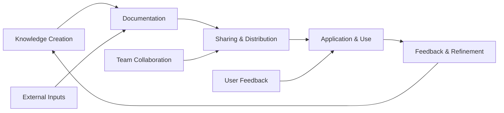

# Ideas & Brainstorming

Dynamic innovation workspace for capturing, developing, and evolving concepts ranging from incremental improvements to disruptive innovations across knowledge management and technology domains.

## Active Brainstorming Sessions

### January 28, 2025 - AI-Enhanced Knowledge Discovery

**Session Focus:** Leveraging artificial intelligence for automated knowledge discovery and pattern recognition in large document collections.

**Participants:** Sarah Chen, Michael Rodriguez, Dr. Jennifer Liu (MIT)

**Generated Ideas:**

#### 🚀 AI Concept Mapper
**Concept:** Automatic generation of concept relationships and knowledge graphs from document content.

**Core Features:**
- Natural language processing for entity extraction
- Relationship strength scoring based on co-occurrence
- Interactive visualization of knowledge networks
- Automatic concept clustering and categorization

**Technical Approach:**
```python
# Concept extraction using NLP
def extract_concepts(documents):
    entities = []
    relationships = []

    for doc in documents:
        # Named entity recognition
        doc_entities = nlp.extract_entities(doc.content)
        entities.extend(doc_entities)

        # Relationship extraction
        doc_relationships = nlp.extract_relationships(doc.content)
        relationships.extend(doc_relationships)

    return build_knowledge_graph(entities, relationships)
```

**Implementation Priority:** High (Q2 2025)
**Related Systems:** [[Technical Documentation]], [[Research Methods]]
**Potential Impact:** Transformative for knowledge discovery

#### 🧠 Intelligent Content Recommendations
**Concept:** Personalized content suggestions based on user behavior, context, and knowledge gaps.

**Algorithm Framework:**
- User profiling based on reading history and interactions
- Content similarity analysis using vector embeddings
- Collaborative filtering from team behavior patterns
- Context-aware recommendations (current project, role, expertise level)

**Data Sources:**
- Document access patterns
- Time spent on different content types
- Search query analysis
- [[Meeting Notes]] content references
- [[Reading List]] completion rates

**Success Metrics:**
- User engagement increase: Target 40%
- Knowledge discovery efficiency: Target 60% improvement
- Cross-functional knowledge sharing: Target 35% increase

#### 🔄 Dynamic Knowledge Synthesis
**Concept:** Real-time synthesis of related information from multiple sources to create comprehensive understanding.

**Synthesis Process:**
1. **Source Identification:** Find relevant documents based on topic
2. **Content Extraction:** Pull key insights and data points
3. **Conflict Resolution:** Identify and reconcile contradictory information
4. **Knowledge Integration:** Create coherent, synthesized overview
5. **Gap Identification:** Highlight missing information areas

**Use Cases:**
- Project research and planning
- Competitive analysis and market research
- Technical problem-solving
- Academic literature reviews

### January 15, 2025 - Collaborative Innovation Workshop

**Session Focus:** Improving team collaboration and knowledge sharing through innovative interface design and workflow optimization.

**Participants:** Full project team + external advisors

**Key Innovation Areas:**

#### 🎯 Context-Aware Collaboration
**Problem:** Team members struggle to find relevant collaborators for specific knowledge domains.

**Solution:** Smart collaboration suggestions based on:
- Expertise mapping from [[Contact Management]]
- Current project context from [[Project Management]]
- Historical collaboration patterns
- Skill gap analysis

**Prototype Features:**
- "Who can help with this?" smart search
- Automatic expert identification for technical issues
- Collaboration history and success metrics
- Cross-team knowledge bridge suggestions

#### 🌊 Knowledge Flow Visualization
**Problem:** Difficulty understanding how knowledge moves through the organization.

**Solution:** Real-time visualization of knowledge flow patterns:



**Metrics Tracked:**
- Knowledge creation rate by department
- Information flow bottlenecks
- Collaboration frequency and effectiveness
- Knowledge application success rates

#### 🔗 Intelligent Link Suggestion
**Problem:** Manual link creation is time-consuming and inconsistent.

**Solution:** AI-powered link suggestions based on:
- Content similarity analysis
- Semantic relationship detection
- User behavior patterns
- Existing link structures

**Implementation Phases:**
1. **Phase 1:** Basic content matching (Q1 2025)
2. **Phase 2:** Semantic analysis integration (Q2 2025)
3. **Phase 3:** Behavioral pattern learning (Q3 2025)

## Developed Concepts (Mature Ideas)

### Knowledge Garden Architecture
**Status:** Implementation Phase
**Priority:** High
**Team Lead:** Emily Watson

**Concept Overview:** Transform traditional folder-based organization into a dynamic, interconnected knowledge garden that grows and evolves over time.

**Key Principles:**
- **Organic Growth:** Knowledge structures emerge naturally from usage patterns
- **Seasonal Changes:** Content relevance based on time and context
- **Cross-Pollination:** Ideas spread between different knowledge areas
- **Pruning and Maintenance:** Outdated content automatically flagged for review

**Technical Implementation:**
```typescript
interface KnowledgeGarden {
  // Core structure
  plots: KnowledgePlot[];        // Thematic areas
  pathways: KnowledgePath[];     // Learning journeys
  ecosystems: KnowledgeEco[];    // Interconnected systems

  // Growth mechanics
  seeds: IdeaSeed[];             // New concepts
  growth_patterns: Pattern[];     // Usage-based evolution
  seasonal_effects: Seasonal[];  // Time-based relevance
}

class KnowledgePlot {
  // Content organization
  content: Document[];
  connections: Connection[];
  health_indicators: HealthMetric[];

  // Interaction tracking
  visitor_patterns: UserBehavior[];
  growth_rate: number;
  maturity_level: MaturityStage;
}
```

**Success Metrics:**
- User navigation efficiency: 50% improvement
- Knowledge discovery: 60% increase in cross-topic exploration
- Content relevance: 40% improvement in search satisfaction

### Adaptive Learning Paths
**Status:** Research Phase
**Priority:** Medium
**Research Lead:** Dr. Michael Rodriguez

**Concept Overview:** Personalized learning journeys that adapt based on user progress, knowledge gaps, and learning style.

**Adaptation Mechanisms:**
- **Performance-Based:** Adjust difficulty based on assessment results
- **Interest-Driven:** Incorporate user preferences and career goals
- **Collaborative:** Learn from team progress and challenges
- **Context-Aware:** Consider current projects and immediate needs

**Learning Path Structure:**
```
Foundation Knowledge → Specialized Skills → Practical Application → Mastery
     ↓                    ↓                     ↓                  ↓
  Assessment         Customization           Projects        Innovation
```

**Integration Points:**
- [[Reading List]] for resource recommendations
- [[Project Management]] for practical application opportunities
- [[Meeting Notes]] for collaborative learning sessions

## Early-Stage Concepts (Idea Incubator)

### Quantum-Enhanced Search Algorithms
**Concept:** Explore quantum computing applications for knowledge search and pattern recognition.

**Research Questions:**
- Can quantum algorithms improve semantic search performance?
- How might quantum entanglement concepts apply to knowledge relationships?
- What are the practical applications for current quantum hardware limitations?

**Potential Applications:**
- Large-scale semantic search optimization
- Complex pattern recognition in unstructured data
- Multi-dimensional knowledge space navigation

### Biometric Knowledge Retention
**Concept:** Use biometric feedback to optimize knowledge retention and learning effectiveness.

**Metrics to Track:**
- Cognitive load during learning sessions
- Attention patterns and focus duration
- Stress levels during complex problem-solving
- Memory consolidation during rest periods

**Implementation Considerations:**
- Privacy and ethical implications
- Integration with existing learning platforms
- User acceptance and comfort levels
- Accuracy and reliability of biometric measurements

### Augmented Reality Knowledge Spaces
**Concept:** Physical and digital knowledge interaction through AR interfaces.

**Use Cases:**
- 3D knowledge graph visualization in physical space
- Interactive technical documentation with AR overlays
- Collaborative problem-solving in shared virtual spaces
- Historical knowledge timeline exploration

**Technical Requirements:**
- AR hardware compatibility (Hololens, Magic Leap, mobile AR)
- Spatial computing optimization
- Multi-user synchronization
- Physical-digital content integration

## Innovation Framework

### Idea Development Process

#### 1. Idea Generation (Capture)
- **Brainstorming Sessions:** Regular team innovation workshops
- **Inspiration Sources:** [[Reading List]], industry trends, user feedback
- **Problem Identification:** Pain points and improvement opportunities
- **Technology Scouting:** Emerging technologies and applications

#### 2. Concept Validation (Filter)
- **Feasibility Analysis:** Technical, resource, and timeline assessment
- **Market Research:** User needs and competitive landscape
- **Risk Assessment:** Potential challenges and mitigation strategies
- **ROI Projection:** Expected benefits and success metrics

#### 3. Prototype Development (Build)
- **Minimum Viable Product:** Core feature implementation
- **User Testing:** Feedback collection and iteration
- **Technical Validation:** Performance and scalability testing
- **Integration Planning:** Connection to existing systems

#### 4. Implementation Planning (Launch)
- **Resource Allocation:** Team assignment and budget planning
- **Timeline Development:** Phased rollout strategy
- **Success Metrics:** KPI definition and measurement systems
- **Communication Plan:** Stakeholder updates and training

### Innovation Metrics

#### Creativity Indicators
- **Idea Generation Rate:** Average ideas per brainstorming session
- **Concept Diversity:** Range across different domains and approaches
- **Novelty Score:** Originality compared to existing solutions
- **Feasibility Rating:** Practical implementation potential

#### Development Tracking
- **Concept to Prototype Time:** Speed of idea validation
- **Success Rate:** Percentage of ideas reaching implementation
- **Impact Measurement:** Actual vs. expected outcomes
- **Learning Capture:** Knowledge gained from failures and successes

## Integration with Knowledge Ecosystem

This innovation workspace connects to:

- [[Research Methods]] for systematic idea validation
- [[Technical Documentation]] for implementation details
- [[Project Management]] for innovation project tracking
- [[Reading List]] for continuous learning and inspiration
- [[Contact Management]] for external collaboration and expertise

## Search Testing Targets

This ideas and brainstorming note enables testing of innovation and concept searches:

- **Innovation Types**: "AI-enhanced", "collaborative", "visualization", "adaptive"
- **Development Stages**: "brainstorming", "concept", "prototype", "implementation"
- **Technology Areas**: "quantum computing", "augmented reality", "biometric"
- **Idea Categories**: "user experience", "algorithms", "interfaces", "workflows"
- **Priority Levels**: "high priority", "research phase", "implementation"
- **Impact Areas**: "knowledge discovery", "collaboration", "learning", "productivity"

## Future Innovation Areas

### Emerging Technology Integration
- **Blockchain for Knowledge Authentication:** Decentralized verification of knowledge sources
- **IoT Environmental Learning:** Context-aware knowledge delivery based on physical environment
- **Brain-Computer Interfaces:** Direct neural interaction with knowledge systems

### Social and Organizational Innovation
- **Knowledge Marketplaces:** Internal knowledge exchange and reward systems
- **Cross-Organizational Learning:** Shared knowledge ecosystems between companies
- **AI-Human Collaboration:** Enhanced creative problem-solving through partnership

---

*This ideas and brainstorming note demonstrates comprehensive innovation management, concept development workflows, and creative thinking processes for testing idea tracking, innovation metrics, and concept evolution features.*