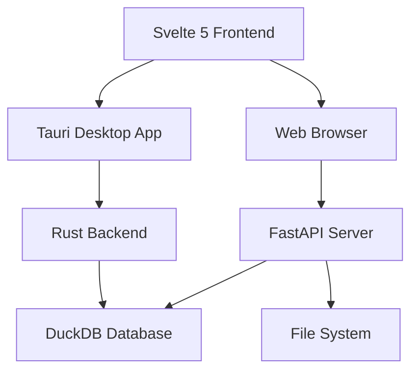

# Technical Documentation

Comprehensive technical documentation for the Crucible knowledge management system, including API specifications, code examples, and integration guidelines.

## System Architecture

### Core Components

#### Backend Services
- **API Gateway**: FastAPI-based REST API server
- **Database Layer**: DuckDB with vector search capabilities
- **Authentication**: JWT-based authentication system
- **File Storage**: Local file system with metadata indexing

#### Frontend Application
- **UI Framework**: Svelte 5 with TypeScript
- **State Management**: Svelte stores with persistence
- **Real-time Updates**: WebSocket connections
- **Responsive Design**: Mobile-first approach

### Technology Stack



## API Documentation

### Authentication Endpoints

#### POST /api/auth/login
Authenticate user and return JWT token.

```typescript
interface LoginRequest {
  username: string;
  password: string;
}

interface LoginResponse {
  token: string;
  expires_in: number;
  user: {
    id: string;
    username: string;
    role: string;
  };
}
```

**Example Request:**
```javascript
const response = await fetch('/api/auth/login', {
  method: 'POST',
  headers: {
    'Content-Type': 'application/json',
  },
  body: JSON.stringify({
    username: 'sarah.chen',
    password: 'secure_password123'
  })
});

const { token, user } = await response.json();
localStorage.setItem('auth_token', token);
```

### Document Management Endpoints

#### GET /api/documents
Retrieve paginated list of documents with optional filtering.

```python
# Python client example
import requests

def get_documents(auth_token, filters=None):
    headers = {
        'Authorization': f'Bearer {auth_token}',
        'Content-Type': 'application/json'
    }

    params = {}
    if filters:
        params.update(filters)

    response = requests.get(
        'https://api.crucible.app/documents',
        headers=headers,
        params=params
    )

    return response.json()

# Usage
documents = get_documents(token, {
    'tags': ['knowledge-management'],
    'created_after': '2025-01-01',
    'limit': 50
})
```

#### POST /api/documents
Create or update a document.

```rust
// Rust client example
use serde_json::json;
use reqwest::Client;

#[derive(Debug, Serialize)]
struct Document {
    id: Option<String>,
    title: String,
    content: String,
    frontmatter: serde_json::Value,
    tags: Vec<String>,
}

async fn create_document(
    client: &Client,
    auth_token: &str,
    document: Document
) -> Result<serde_json::Value, reqwest::Error> {
    let response = client
        .post("https://api.crucible.app/documents")
        .header("Authorization", format!("Bearer {}", auth_token))
        .header("Content-Type", "application/json")
        .json(&document)
        .send()
        .await?;

    response.json().await
}
```

## Code Examples

### Frontend Integration

#### Svelte Component Example
```svelte
<!-- DocumentList.svelte -->
<script lang="ts">
  import { onMount } from 'svelte';
  import type { Document } from '$lib/types';

  export let documents: Document[] = [];
  export let loading = false;
  export let error: string | null = null;

  async function loadDocuments() {
    loading = true;
    error = null;

    try {
      const response = await fetch('/api/documents');
      if (!response.ok) throw new Error('Failed to load documents');
      documents = await response.json();
    } catch (err) {
      error = err instanceof Error ? err.message : 'Unknown error';
    } finally {
      loading = false;
    }
  }

  onMount(loadDocuments);
</script>

<div class="document-list">
  {#if loading}
    <div class="loading">Loading documents...</div>
  {:else if error}
    <div class="error">{error}</div>
  {:else}
    <ul>
      {#each documents as doc}
        <li>
          <a href="/documents/{doc.id}">{doc.title}</a>
          <span class="date">{new Date(doc.created).toLocaleDateString()}</span>
        </li>
      {/each}
    </ul>
  {/if}
</div>

<style>
  .document-list {
    padding: 1rem;
  }

  .loading, .error {
    text-align: center;
    padding: 2rem;
  }

  .error {
    color: #dc3545;
  }

  ul {
    list-style: none;
    padding: 0;
  }

  li {
    display: flex;
    justify-content: space-between;
    padding: 0.5rem 0;
    border-bottom: 1px solid #eee;
  }

  .date {
    color: #666;
    font-size: 0.875rem;
  }
</style>
```

### Backend Processing

#### FastAPI Endpoint Example
```python
from fastapi import FastAPI, HTTPException, Depends
from pydantic import BaseModel
from typing import List, Optional
import json

app = FastAPI(title="Crucible API", version="2.1.0")

class DocumentCreate(BaseModel):
    title: str
    content: str
    frontmatter: Optional[dict] = {}
    tags: Optional[List[str]] = []

class DocumentResponse(BaseModel):
    id: str
    title: str
    content: str
    frontmatter: dict
    tags: List[str]
    created: str
    modified: str

@app.post("/api/documents", response_model=DocumentResponse)
async def create_document(
    document: DocumentCreate,
    current_user: dict = Depends(get_current_user)
):
    try:
        # Validate frontmatter
        if document.frontmatter:
            json.dumps(document.frontmatter)  # Validate JSON serializable

        # Create document in database
        doc_id = await db.create_document(
            title=document.title,
            content=document.content,
            frontmatter=document.frontmatter or {},
            tags=document.tags or [],
            user_id=current_user["id"]
        )

        # Return created document
        return await db.get_document(doc_id)

    except Exception as e:
        raise HTTPException(status_code=400, detail=str(e))
```

## Configuration

### Environment Variables

```bash
# Database Configuration
DATABASE_URL=duckdb:///data/crucible.duckdb
DATABASE_POOL_SIZE=10

# Authentication
JWT_SECRET_KEY=your-secret-key-here
JWT_ALGORITHM=HS256
JWT_EXPIRE_MINUTES=1440

# File Storage
STORAGE_PATH=/var/lib/crucible/documents
MAX_FILE_SIZE=50MB

# API Configuration
API_HOST=0.0.0.0
API_PORT=8000
API_WORKERS=4

# Logging
LOG_LEVEL=INFO
LOG_FILE=/var/log/crucible/app.log
```

### Application Configuration

```json
{
  "app": {
    "name": "Crucible Knowledge Management",
    "version": "2.1.0",
    "debug": false
  },
  "database": {
    "type": "duckdb",
    "path": "data/crucible.duckdb",
    "extensions": ["fts", "json"]
  },
  "features": {
    "vector_search": true,
    "real_time_collaboration": true,
    "file_upload": true,
    "export_formats": ["markdown", "pdf", "html"]
  },
  "limits": {
    "max_document_size": "50MB",
    "max_documents_per_user": 10000,
    "rate_limit": {
      "requests_per_minute": 100,
      "burst_size": 200
    }
  }
}
```

## Integration Examples

### Webhook Integration

```javascript
// Example webhook handler for document updates
app.post('/webhooks/document-updated', async (req, res) => {
  const { document_id, changes, user } = req.body;

  try {
    // Process document changes
    await processDocumentChanges(document_id, changes);

    // Update search index
    await updateSearchIndex(document_id);

    // Notify relevant users
    await notifyUsers(user, changes);

    res.status(200).json({ success: true });
  } catch (error) {
    console.error('Webhook processing failed:', error);
    res.status(500).json({ error: 'Processing failed' });
  }
});
```

### Plugin System Integration

```rust
// Example plugin for custom document processing
use crucible_plugin::{Plugin, Document, PluginResult};

pub struct MarkdownProcessor;

impl Plugin for MarkdownProcessor {
    fn name(&self) -> &str {
        "markdown-processor"
    }

    fn version(&self) -> &str {
        "1.0.0"
    }

    async fn process_document(&self, document: &mut Document) -> PluginResult<()> {
        // Add automatic metadata
        if let Some(frontmatter) = &mut document.frontmatter {
            frontmatter["word_count"] = json!(count_words(&document.content));
            frontmatter["reading_time"] = json!(estimate_reading_time(&document.content));
        }

        // Extract and validate links
        let links = extract_markdown_links(&document.content);
        frontmatter["internal_links"] = json!(links.internal);
        frontmatter["external_links"] = json!(links.external);

        Ok(())
    }
}
```

## Performance Optimization

### Database Indexing

```sql
-- Create indexes for common queries
CREATE INDEX idx_documents_created ON documents(created_date);
CREATE INDEX idx_documents_tags ON documents USING GIN(tags);
CREATE INDEX idx_documents_title ON documents USING gin(to_tsvector('english', title));
CREATE INDEX idx_documents_content ON documents USING gin(to_tsvector('english', content));

-- Vector search index
CREATE INDEX idx_documents_embeddings ON documents
USING ivfflat (embedding vector_cosine_ops)
WITH (lists = 100);
```

### Caching Strategy

```typescript
// Redis caching implementation
class DocumentCache {
  private redis: Redis;

  async getDocument(id: string): Promise<Document | null> {
    // Try cache first
    const cached = await this.redis.get(`doc:${id}`);
    if (cached) {
      return JSON.parse(cached);
    }

    // Fetch from database
    const document = await this.db.getDocument(id);
    if (document) {
      // Cache for 1 hour
      await this.redis.setex(`doc:${id}`, 3600, JSON.stringify(document));
    }

    return document;
  }

  async invalidateDocument(id: string): Promise<void> {
    await this.redis.del(`doc:${id}`);
  }
}
```

## Testing

### Unit Test Example

```python
import pytest
from crucible.api import app
from fastapi.testclient import TestClient

client = TestClient(app)

def test_create_document():
    document_data = {
        "title": "Test Document",
        "content": "# Test Content\n\nThis is a test document.",
        "tags": ["test", "example"],
        "frontmatter": {
            "author": "Test User",
            "created": "2025-01-01"
        }
    }

    response = client.post("/api/documents", json=document_data)
    assert response.status_code == 200

    data = response.json()
    assert data["title"] == "Test Document"
    assert "test" in data["tags"]
    assert "example" in data["tags"]

def test_search_documents():
    response = client.get("/api/documents/search?q=knowledge%20management")
    assert response.status_code == 200

    data = response.json()
    assert "results" in data
    assert "total" in data
```

## Deployment

### Docker Configuration

```dockerfile
FROM node:18-alpine AS frontend-build
WORKDIR /app
COPY package*.json ./
RUN npm ci --only=production
COPY . .
RUN npm run build

FROM python:3.11-slim AS backend
WORKDIR /app
COPY requirements.txt .
RUN pip install -r requirements.txt
COPY --from=frontend-build /app/dist ./static
COPY . .

EXPOSE 8000
CMD ["uvicorn", "main:app", "--host", "0.0.0.0", "--port", "8000"]
```

### Kubernetes Deployment

```yaml
apiVersion: apps/v1
kind: Deployment
metadata:
  name: crucible-api
spec:
  replicas: 3
  selector:
    matchLabels:
      app: crucible-api
  template:
    metadata:
      labels:
        app: crucible-api
    spec:
      containers:
      - name: crucible-api
        image: crucible/api:2.1.0
        ports:
        - containerPort: 8000
        env:
        - name: DATABASE_URL
          valueFrom:
            secretKeyRef:
              name: crucible-secrets
              key: database-url
```

## Integration with Documentation Ecosystem

This technical documentation connects to:

- [[API Documentation]] for detailed endpoint specifications
- [[Project Management]] for implementation tracking
- [[Knowledge Management Hub]] for system overview
- [[Meeting Notes]] for technical decision records

## Search Testing Targets

This note enables testing of technical documentation searches:

- **Code Languages**: "JavaScript", "Python", "Rust", "TypeScript"
- **Frameworks**: "FastAPI", "Svelte", "Tauri", "Node.js"
- **Technical Terms**: "API", "authentication", "database", "vector search"
- **File Formats**: "JSON", "SQL", "YAML", "Dockerfile"
- **DevOps Concepts**: "deployment", "Docker", "Kubernetes", "CI/CD"
- **Programming Concepts**: "caching", "indexing", "testing", "performance"

---

*This technical documentation note provides comprehensive code examples, API specifications, and integration patterns for testing technical content search, code navigation, and developer documentation features.*